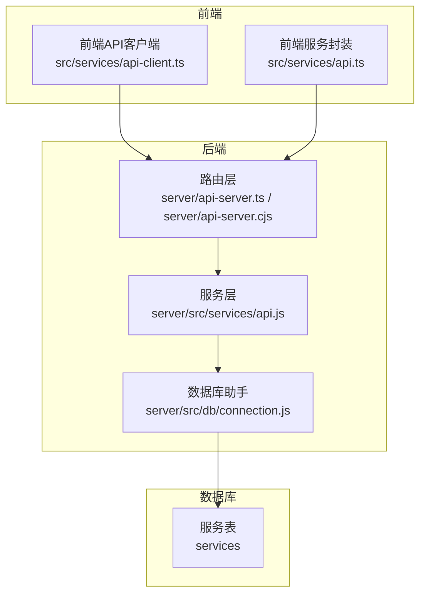
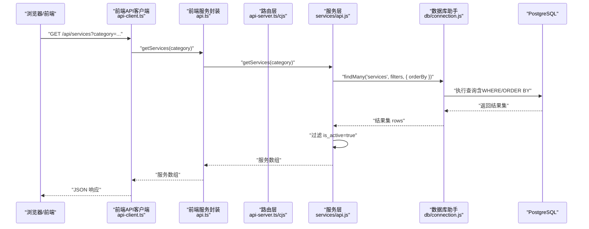
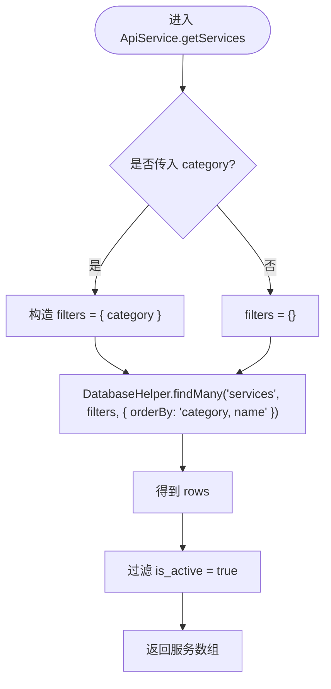
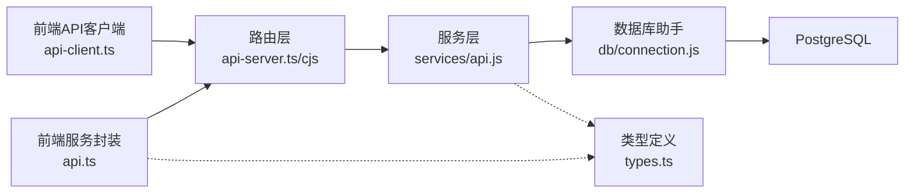

# 服务项目查询

<cite>
**本文引用的文件**
- [server/src/services/api.js](file://server/src/services/api.js)
- [server/src/db/connection.js](file://server/src/db/connection.js)
- [src/services/api.ts](file://src/services/api.ts)
- [src/services/api-client.ts](file://src/services/api-client.ts)
- [src/types/types.ts](file://src/types/types.ts)
- [database/init/02-create-tables.sql](file://database/init/02-create-tables.sql)
- [supabase/migrations/00001_create_bio_appointment_schema.sql](file://supabase/migrations/00001_create_bio_appointment_schema.sql)
- [server/api-server.ts](file://server/api-server.ts)
- [server/api-server.cjs](file://server/api-server.cjs)
</cite>

## 目录
1. [简介](#简介)
2. [项目结构](#项目结构)
3. [核心组件](#核心组件)
4. [架构总览](#架构总览)
5. [详细组件分析](#详细组件分析)
6. [依赖关系分析](#依赖关系分析)
7. [性能考量](#性能考量)
8. [故障排除指南](#故障排除指南)
9. [结论](#结论)

## 简介
本文档面向前端与后端开发者，系统化说明 Bio-Appointment 系统中“服务项目查询”接口的实现与使用。目标包括：
- 明确 HTTP GET /api/services 的行为与参数
- 解释可选查询参数 category 的过滤机制
- 说明响应数据结构与排序规则
- 强调自动过滤非活跃服务（is_active=false）的策略
- 展示前端如何调用接口，以及后端 ApiService 如何通过 DatabaseHelper 与数据库交互的完整流程

## 项目结构
围绕服务项目查询的关键文件分布如下：
- 后端路由层：提供 /api/services 的 HTTP GET 路由
- 后端服务层：封装业务逻辑，负责过滤与排序
- 数据访问层：统一的 DatabaseHelper 提供通用查询能力
- 前端客户端：封装 API 调用，支持带参查询
- 类型定义：约束服务项目的字段与取值范围
- 数据库建模：定义服务表结构与索引

图表来源
- [server/api-server.ts](file://server/api-server.ts#L188-L201)
- [server/api-server.cjs](file://server/api-server.cjs#L235-L255)
- [server/src/services/api.js](file://server/src/services/api.js#L49-L56)
- [server/src/db/connection.js](file://server/src/db/connection.js#L163-L208)
- [database/init/02-create-tables.sql](file://database/init/02-create-tables.sql#L23-L36)

章节来源
- [server/api-server.ts](file://server/api-server.ts#L188-L201)
- [server/api-server.cjs](file://server/api-server.cjs#L235-L255)
- [server/src/services/api.js](file://server/src/services/api.js#L49-L56)
- [server/src/db/connection.js](file://server/src/db/connection.js#L163-L208)
- [database/init/02-create-tables.sql](file://database/init/02-create-tables.sql#L23-L36)

## 核心组件
- 路由层：接收 HTTP GET /api/services 请求，读取查询参数 category，并调用 ApiService 获取服务列表，最终以 JSON 响应返回。
- 服务层：根据是否传入 category 构造查询条件；对结果按 category, name 进行排序；再在内存中过滤掉 is_active=false 的记录。
- 数据库助手：提供通用的 findMany 查询能力，支持 where 条件、排序、分页等。
- 前端客户端：封装 fetch 调用，支持带参查询；前端服务封装在 TypeScript 中，提供类型安全的 getServices 方法。
- 类型定义：约束服务对象的字段与取值范围，保证前后端一致性。
- 数据库建模：服务表包含 id、name、category、base_duration、requires_doctor、allow_companions、max_companions、is_active 等字段，并有相应索引。

章节来源
- [server/api-server.ts](file://server/api-server.ts#L188-L201)
- [server/src/services/api.js](file://server/src/services/api.js#L49-L56)
- [server/src/db/connection.js](file://server/src/db/connection.js#L163-L208)
- [src/services/api-client.ts](file://src/services/api-client.ts#L213-L216)
- [src/services/api.ts](file://src/services/api.ts#L77-L85)
- [src/types/types.ts](file://src/types/types.ts#L97-L106)
- [database/init/02-create-tables.sql](file://database/init/02-create-tables.sql#L23-L36)
- [supabase/migrations/00001_create_bio_appointment_schema.sql](file://supabase/migrations/00001_create_bio_appointment_schema.sql#L116-L125)

## 架构总览
下图展示了从浏览器到数据库的完整调用链路，以及服务层的过滤与排序逻辑。

图表来源
- [server/api-server.ts](file://server/api-server.ts#L188-L201)
- [server/api-server.cjs](file://server/api-server.cjs#L235-L255)
- [server/src/services/api.js](file://server/src/services/api.js#L49-L56)
- [server/src/db/connection.js](file://server/src/db/connection.js#L163-L208)
- [src/services/api-client.ts](file://src/services/api-client.ts#L213-L216)
- [src/services/api.ts](file://src/services/api.ts#L77-L85)

## 详细组件分析

### 接口定义与行为
- HTTP 方法：GET
- URL 路径：/api/services
- 查询参数：
  - category：可选字符串，用于按服务类别过滤
- 响应数据结构：服务对象数组，每个对象包含 id、name、category、base_duration、requires_doctor、allow_companions、is_active 等字段
- 排序规则：先按 category 升序，再按 name 升序
- 过滤规则：仅返回 is_active=true 的服务

章节来源
- [server/api-server.ts](file://server/api-server.ts#L188-L201)
- [server/api-server.cjs](file://server/api-server.cjs#L235-L255)
- [src/types/types.ts](file://src/types/types.ts#L97-L106)
- [src/services/api.ts](file://src/services/api.ts#L77-L85)
- [server/src/services/api.js](file://server/src/services/api.js#L49-L56)

### 前端调用示例
- 前端 API 客户端提供 getServices(category?) 方法，内部将 category 拼接为查询字符串并发起请求
- 前端服务封装在 TypeScript 中，提供类型安全的 getServices(category?)，并在内存中再次过滤 is_active=true

章节来源
- [src/services/api-client.ts](file://src/services/api-client.ts#L213-L216)
- [src/services/api.ts](file://src/services/api.ts#L77-L85)

### 后端处理流程
- 路由层读取查询参数 category，调用 ApiService.getServices(category)
- 服务层：
  - 若传入 category，则构造 { category } 条件；否则无条件
  - 使用 DatabaseHelper.findMany('services', filters, { orderBy: 'category, name' })
  - 再在内存中过滤掉 is_active=false 的记录
- 数据库助手：
  - 支持动态构建 WHERE 子句、ORDER BY、LIMIT/OFFSET
  - 统一执行查询并返回 rows

图表来源
- [server/src/services/api.js](file://server/src/services/api.js#L49-L56)
- [server/src/db/connection.js](file://server/src/db/connection.js#L163-L208)

章节来源
- [server/src/services/api.js](file://server/src/services/api.js#L49-L56)
- [server/src/db/connection.js](file://server/src/db/connection.js#L163-L208)

### 数据库模型与索引
- 服务表（services）包含以下关键字段：
  - id、name、description、category、base_duration、requires_doctor、allow_companions、max_companions、is_active、created_at、updated_at
- 索引：
  - idx_services_category：加速按类别查询
  - idx_services_is_active：加速按活跃状态过滤

章节来源
- [database/init/02-create-tables.sql](file://database/init/02-create-tables.sql#L23-L36)
- [database/init/02-create-tables.sql](file://database/init/02-create-tables.sql#L191-L193)
- [supabase/migrations/00001_create_bio_appointment_schema.sql](file://supabase/migrations/00001_create_bio_appointment_schema.sql#L116-L125)

## 依赖关系分析
- 前端到后端：
  - 前端 API 客户端通过 fetch 调用 /api/services
  - 前端服务封装在 TypeScript 中，调用后端 ApiService
- 后端到数据库：
  - 路由层 -> 服务层 -> 数据库助手 -> PostgreSQL
- 类型约束：
  - 前端与后端共享服务类型定义，确保字段一致

图表来源
- [src/services/api-client.ts](file://src/services/api-client.ts#L213-L216)
- [src/services/api.ts](file://src/services/api.ts#L77-L85)
- [server/api-server.ts](file://server/api-server.ts#L188-L201)
- [server/api-server.cjs](file://server/api-server.cjs#L235-L255)
- [server/src/services/api.js](file://server/src/services/api.js#L49-L56)
- [server/src/db/connection.js](file://server/src/db/connection.js#L163-L208)
- [src/types/types.ts](file://src/types/types.ts#L97-L106)

章节来源
- [src/services/api-client.ts](file://src/services/api-client.ts#L213-L216)
- [src/services/api.ts](file://src/services/api.ts#L77-L85)
- [server/api-server.ts](file://server/api-server.ts#L188-L201)
- [server/api-server.cjs](file://server/api-server.cjs#L235-L255)
- [server/src/services/api.js](file://server/src/services/api.js#L49-L56)
- [server/src/db/connection.js](file://server/src/db/connection.js#L163-L208)
- [src/types/types.ts](file://src/types/types.ts#L97-L106)

## 性能考量
- 查询优化：
  - 服务表存在 idx_services_category 与 idx_services_is_active 索引，有助于按类别过滤与活跃状态过滤
  - 服务层在数据库层面先按 category, name 排序，减少后续内存排序成本
- 内存过滤：
  - is_active 过滤在服务层完成，避免了复杂 SQL 条件，但可能增加内存开销；若数据量大，建议在数据库层面直接过滤
- 建议：
  - 若频繁按 is_active 过滤，可在数据库层面增加复合索引或视图
  - 对于大量数据，考虑分页（LIMIT/OFFSET）或游标分页

章节来源
- [database/init/02-create-tables.sql](file://database/init/02-create-tables.sql#L191-L193)
- [server/src/services/api.js](file://server/src/services/api.js#L49-L56)
- [server/src/db/connection.js](file://server/src/db/connection.js#L163-L208)

## 故障排除指南
- 常见错误与处理：
  - 500 服务器错误：路由层捕获异常并返回错误信息，检查后端日志定位具体原因
  - 404 未找到：通常用于资源不存在场景，服务项目查询不会返回 404
- 建议排查步骤：
  - 确认 /api/services 路由已启动且可访问
  - 检查数据库连接池初始化是否成功
  - 核对服务表是否存在且包含数据
  - 在浏览器网络面板查看实际请求与响应体，确认 category 参数是否正确传递

章节来源
- [server/api-server.ts](file://server/api-server.ts#L188-L201)
- [server/api-server.cjs](file://server/api-server.cjs#L235-L255)
- [server/src/db/connection.js](file://server/src/db/connection.js#L37-L61)

## 结论
- /api/services 接口通过可选的 category 参数实现灵活过滤，返回按类别与名称排序的可用服务列表
- 后端在数据库层面完成条件查询与排序，在服务层进行 is_active 过滤，确保只返回可用服务
- 前端通过 api-client.ts 与 api.ts 提供类型安全的调用入口，便于在组件中使用
- 数据库层面的索引设计与服务层的过滤策略共同保障了查询性能与正确性