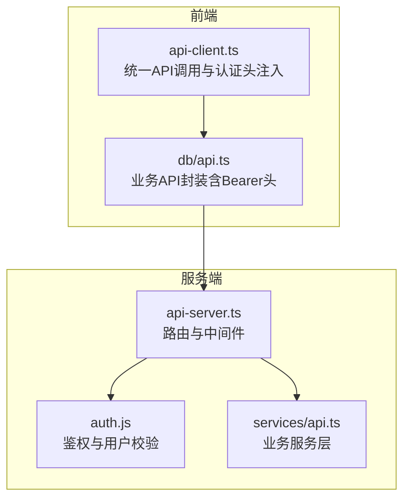
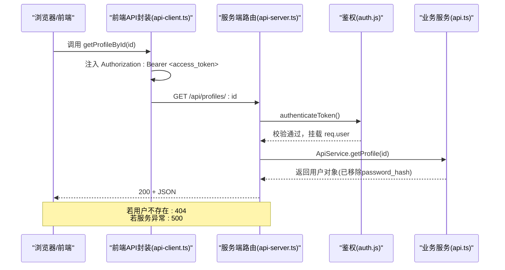
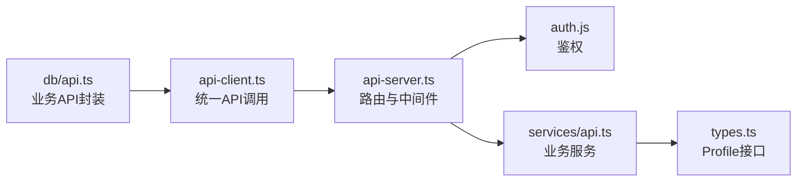

# 单个用户查询

<cite>
**本文引用的文件**
- [server/api-server.ts](file://server/api-server.ts)
- [server/server/api-server.js](file://server/server/api-server.js)
- [src/services/api-client.ts](file://src/services/api-client.ts)
- [src/db/api.ts](file://src/db/api.ts)
- [src/services/api.ts](file://src/services/api.ts)
- [src/types/types.ts](file://src/types/types.ts)
- [src/services/auth.ts](file://src/services/auth.ts)
- [server/src/services/auth.js](file://server/src/services/auth.js)
- [supabase/migrations/00007_update_profiles_structure_and_auth.sql](file://supabase/migrations/00007_update_profiles_structure_and_auth.sql)
</cite>

## 目录
1. [简介](#简介)
2. [项目结构](#项目结构)
3. [核心组件](#核心组件)
4. [架构总览](#架构总览)
5. [详细组件分析](#详细组件分析)
6. [依赖关系分析](#依赖关系分析)
7. [性能考量](#性能考量)
8. [故障排查指南](#故障排查指南)
9. [结论](#结论)

## 简介
本文件面向前端与集成方，完整说明“单个用户查询”RESTful API 的使用方式与行为规范。目标端点为 GET /api/profiles/:id，用于按用户标识获取指定用户的公开档案信息。文档涵盖：
- HTTP 方法与 URL 路径参数 :id 的语义与约束
- 认证要求（Bearer Token）与请求头格式
- 成功响应的 JSON 结构与字段说明
- 安全机制（自动移除敏感字段）
- 错误场景与 HTTP 状态码（404、500 等）
- 前端调用示例与异常处理建议

## 项目结构
围绕“单个用户查询”的关键代码分布在三层：
- 服务端路由与中间件：负责鉴权、路由分发与错误处理
- 业务服务层：负责数据访问与安全过滤
- 前端客户端：封装统一的 API 调用与认证头注入

图表来源
- [server/api-server.ts](file://server/api-server.ts#L118-L151)
- [src/services/api-client.ts](file://src/services/api-client.ts#L1-L48)
- [src/db/api.ts](file://src/db/api.ts#L426-L446)
- [src/services/api.ts](file://src/services/api.ts#L19-L42)
- [server/src/services/auth.js](file://server/src/services/auth.js#L145-L194)

章节来源
- [server/api-server.ts](file://server/api-server.ts#L118-L151)
- [src/services/api-client.ts](file://src/services/api-client.ts#L1-L48)
- [src/db/api.ts](file://src/db/api.ts#L426-L446)
- [src/services/api.ts](file://src/services/api.ts#L19-L42)
- [server/src/services/auth.js](file://server/src/services/auth.js#L145-L194)

## 核心组件
- 路由与中间件
  - 中间件 authenticateToken：校验 Authorization 头是否以 Bearer 开头并验证 JWT；若通过则将用户信息挂载到 req.user
  - 路由 /api/profiles/:id：受保护路由，接收 :id 参数，调用 ApiService.getProfile 并返回结果或 404/500
- 业务服务层 ApiService
  - getProfile(id)：从 profiles 表读取用户，移除 password_hash 后返回
- 前端客户端
  - api-client.ts：统一注入 Authorization: Bearer ${accessToken}，并处理响应与错误
  - db/api.ts：封装 getProfileById(id)，内部复用 api-client.ts 的认证逻辑

章节来源
- [server/api-server.ts](file://server/api-server.ts#L118-L151)
- [server/api-server.ts](file://server/api-server.ts#L167-L186)
- [src/services/api.ts](file://src/services/api.ts#L19-L42)
- [src/services/api-client.ts](file://src/services/api-client.ts#L1-L48)
- [src/db/api.ts](file://src/db/api.ts#L426-L446)

## 架构总览
下图展示从浏览器到服务端的关键交互链路，以及安全过滤与错误处理的职责边界。

图表来源
- [src/db/api.ts](file://src/db/api.ts#L426-L446)
- [src/services/api-client.ts](file://src/services/api-client.ts#L1-L48)
- [server/api-server.ts](file://server/api-server.ts#L118-L151)
- [server/api-server.ts](file://server/api-server.ts#L167-L186)
- [src/services/api.ts](file://src/services/api.ts#L19-L42)
- [server/src/services/auth.js](file://server/src/services/auth.js#L145-L194)

## 详细组件分析

### 端点定义与参数
- HTTP 方法：GET
- URL 路径：/api/profiles/:id
- 路径参数 :id
  - 含义：目标用户的唯一标识符（字符串）
  - 约束：
    - 必填
    - 类型：字符串
    - 语义：对应数据库 profiles 表的主键 id
    - 作用域：仅允许查询当前用户可访问的用户档案（由鉴权与业务层共同保证）

章节来源
- [server/api-server.ts](file://server/api-server.ts#L167-L186)

### 认证与请求头
- 认证要求：Bearer Token
- 请求头格式：
  - Authorization: Bearer <access_token>
  - Content-Type: application/json（由前端统一注入）
- 鉴权流程：
  - 中间件 authenticateToken 从 Authorization 头提取 Bearer Token
  - 校验 Token 格式与签名有效性
  - 解析 Token 获取 userId，并从数据库查询用户是否存在且状态有效
  - 通过后放行至下游路由

章节来源
- [server/api-server.ts](file://server/api-server.ts#L118-L151)
- [src/services/api-client.ts](file://src/services/api-client.ts#L28-L42)
- [src/db/api.ts](file://src/db/api.ts#L426-L446)
- [server/src/services/auth.js](file://server/src/services/auth.js#L145-L194)

### 成功响应结构
- HTTP 状态码：200 OK
- 响应体：JSON 对象，字段如下（均为字符串或枚举值）：
  - id: 用户唯一标识
  - username: 用户名
  - full_name: 全名（可选）
  - role: 角色（枚举：super_admin、sales、head_nurse、nurse、doctor）
  - department: 部门（可选）
  - status: 状态（枚举：active、disabled）
  - created_at: 创建时间（ISO 8601 字符串）
  - updated_at: 更新时间（ISO 8601 字符串）
- 安全机制：服务端在返回前自动移除 password_hash 字段，避免泄露

章节来源
- [src/types/types.ts](file://src/types/types.ts#L23-L41)
- [src/services/api.ts](file://src/services/api.ts#L19-L42)
- [server/src/services/auth.js](file://server/src/services/auth.js#L170-L194)

### 错误与异常处理
- 404 Not Found
  - 触发条件：请求的 :id 在数据库中不存在
  - 响应体：包含 error 字段的 JSON 对象
- 500 Internal Server Error
  - 触发条件：服务端执行查询或序列化过程中发生异常
  - 响应体：包含 error 与 message 字段的 JSON 对象
- 401 Unauthorized
  - 触发条件：缺少 Authorization 头、格式不正确、Token 无效或过期、Token 对应用户不存在
  - 响应体：包含 error 字段的 JSON 对象

章节来源
- [server/api-server.ts](file://server/api-server.ts#L167-L186)
- [server/api-server.ts](file://server/api-server.ts#L118-L151)

### 前端调用与异常处理示例
- 前端封装
  - api-client.ts：统一注入 Authorization: Bearer <access_token>，并处理 response.ok 与错误抛出
  - db/api.ts：getProfileById(id) 内部复用 api-client.ts 的认证逻辑
- 调用流程
  - 从本地存储读取 access_token
  - 发起 GET /api/profiles/:id
  - 根据 response.ok 判断成功或抛错
  - 捕获异常并进行 UI 友好提示
- 异常处理建议
  - 对 404：提示“用户不存在”或引导用户检查 id
  - 对 401：提示“请先登录”，并跳转登录页
  - 对 500：提示“服务器繁忙，请稍后再试”，并记录错误日志

章节来源
- [src/services/api-client.ts](file://src/services/api-client.ts#L1-L48)
- [src/db/api.ts](file://src/db/api.ts#L426-L446)

## 依赖关系分析
- 路由依赖中间件：/api/* 均受 authenticateToken 保护
- 业务服务依赖数据库访问层：ApiService.getProfile 通过 DatabaseHelper.findById 读取数据
- 前端依赖后端 API：db/api.ts 通过 fetch 调用 /api/profiles/:id，并携带 Bearer Token
- 类型定义：Profile 接口定义了响应字段，确保前后端一致

图表来源
- [server/api-server.ts](file://server/api-server.ts#L118-L151)
- [server/src/services/auth.js](file://server/src/services/auth.js#L145-L194)
- [src/services/api.ts](file://src/services/api.ts#L19-L42)
- [src/services/api-client.ts](file://src/services/api-client.ts#L1-L48)
- [src/db/api.ts](file://src/db/api.ts#L426-L446)
- [src/types/types.ts](file://src/types/types.ts#L23-L41)

章节来源
- [server/api-server.ts](file://server/api-server.ts#L118-L151)
- [src/services/api.ts](file://src/services/api.ts#L19-L42)
- [src/services/api-client.ts](file://src/services/api-client.ts#L1-L48)
- [src/db/api.ts](file://src/db/api.ts#L426-L446)
- [src/types/types.ts](file://src/types/types.ts#L23-L41)

## 性能考量
- 路由层：GET /api/profiles/:id 为轻量查询，通常无显著性能瓶颈
- 业务层：ApiService.getProfile 仅做一次数据库查找与一次对象解构（移除 password_hash），复杂度 O(1)
- 前端：统一注入 Authorization 头，减少重复逻辑
- 建议：
  - 对频繁查询可考虑缓存策略（如内存缓存或浏览器缓存）
  - 对高并发场景建议配合数据库连接池与索引优化（例如对 profiles.id 的索引）

[本节为通用性能讨论，无需列出具体文件来源]

## 故障排查指南
- 401 未授权
  - 检查本地存储中是否存在 access_token
  - 确认 Authorization 头格式为 Bearer <token>
  - 校验 Token 是否过期或被篡改
- 404 用户不存在
  - 确认 :id 是否正确
  - 检查数据库中是否存在该 id 的用户记录
- 500 服务器错误
  - 查看服务端日志与堆栈
  - 确认数据库连接与查询语句
- 前端异常处理
  - 捕获 api-client.ts 抛出的错误并提示用户
  - 记录错误上下文（如 id、时间戳、网络状态）

章节来源
- [server/api-server.ts](file://server/api-server.ts#L118-L151)
- [server/api-server.ts](file://server/api-server.ts#L167-L186)
- [src/services/api-client.ts](file://src/services/api-client.ts#L1-L48)
- [src/db/api.ts](file://src/db/api.ts#L426-L446)

## 结论
- GET /api/profiles/:id 是受保护的只读接口，用于按 id 获取用户公开档案
- 认证采用 Bearer Token，请求头需包含 Authorization: Bearer <access_token>
- 成功响应自动移除敏感字段 password_hash，保障安全
- 常见错误码：401（未授权）、404（用户不存在）、500（服务器错误）
- 前端通过 api-client.ts 与 db/api.ts 统一处理认证与异常，便于集成与维护