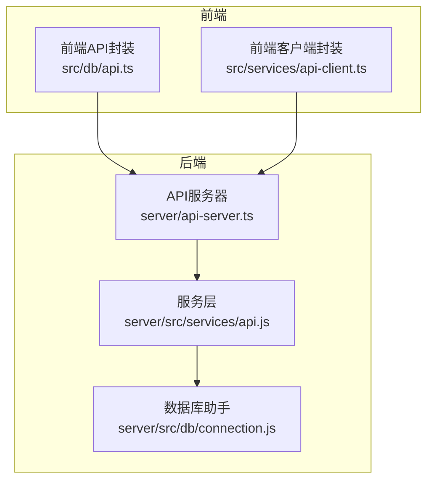
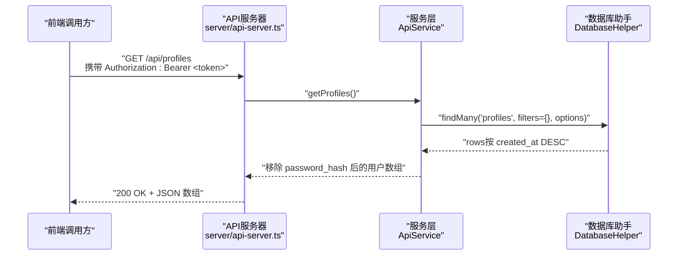
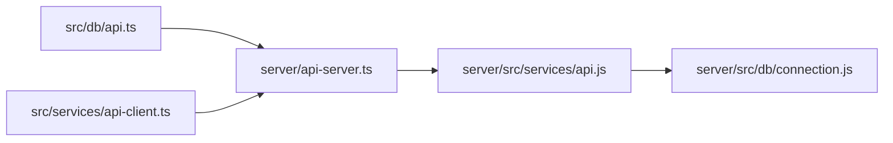

# 用户列表查询

<cite>
**本文引用的文件**
- [server/api-server.ts](file://server/api-server.ts)
- [server/src/services/api.js](file://server/src/services/api.js)
- [server/src/db/connection.js](file://server/src/db/connection.js)
- [src/db/api.ts](file://src/db/api.ts)
- [src/services/api-client.ts](file://src/services/api-client.ts)
- [supabase/migrations/00004_create_user_profiles_and_auth.sql](file://supabase/migrations/00004_create_user_profiles_and_auth.sql)
</cite>

## 目录
1. [简介](#简介)
2. [项目结构](#项目结构)
3. [核心组件](#核心组件)
4. [架构总览](#架构总览)
5. [详细组件分析](#详细组件分析)
6. [依赖关系分析](#依赖关系分析)
7. [性能考量](#性能考量)
8. [故障排查指南](#故障排查指南)
9. [结论](#结论)

## 简介
本文件面向前端与后端开发者，系统化说明 Bio-Appointment 系统的“用户列表查询”RESTful 接口 GET /api/profiles。内容涵盖：
- 接口基础信息（HTTP 方法、基础 URL）
- 查询参数 role、status、department 的使用与数据类型
- 默认排序规则（按创建时间倒序）的实现逻辑
- 成功响应的 JSON 数组结构（排除密码哈希）
- 空列表与错误场景（400/500 等）说明
- 前端 api-client 的调用方式与错误处理最佳实践

## 项目结构
- 后端 API 服务器位于 server/api-server.ts，提供 /api/* 路由，其中 GET /api/profiles 返回用户列表。
- 数据访问层通过 server/src/services/api.js 的 ApiService.getProfiles 调用 server/src/db/connection.js 的 DatabaseHelper.findMany 实现。
- 前端通过 src/db/api.ts 或 src/services/api-client.ts 进行调用，统一携带 Bearer Token 并处理响应。

图表来源
- [server/api-server.ts](file://server/api-server.ts#L150-L165)
- [server/src/services/api.js](file://server/src/services/api.js#L18-L27)
- [server/src/db/connection.js](file://server/src/db/connection.js#L172-L208)
- [src/db/api.ts](file://src/db/api.ts#L382-L401)
- [src/services/api-client.ts](file://src/services/api-client.ts#L273-L279)

章节来源
- [server/api-server.ts](file://server/api-server.ts#L150-L165)
- [server/src/services/api.js](file://server/src/services/api.js#L18-L27)
- [server/src/db/connection.js](file://server/src/db/connection.js#L172-L208)
- [src/db/api.ts](file://src/db/api.ts#L382-L401)
- [src/services/api-client.ts](file://src/services/api-client.ts#L273-L279)

## 核心组件
- 后端路由：GET /api/profiles 由 server/api-server.ts 提供，内部调用 ApiService.getProfiles。
- 服务层：ApiService.getProfiles 通过 DatabaseHelper.findMany('profiles', filters, { orderBy: 'created_at DESC' }) 查询并移除 password_hash 字段。
- 数据库助手：DatabaseHelper.findMany 支持 where 条件拼接、排序、分页；当前 GET /api/profiles 未传入 filters，因此默认返回全部用户并按 created_at 降序。
- 前端封装：
  - src/db/api.ts 提供 getProfiles() 与 getProfilesByRole(role) 等方法，统一携带 Authorization: Bearer Token。
  - src/services/api-client.ts 提供 clientApi.getProfiles()，内部使用 authenticatedApiCall 自动附加令牌。

章节来源
- [server/api-server.ts](file://server/api-server.ts#L150-L165)
- [server/src/services/api.js](file://server/src/services/api.js#L18-L27)
- [server/src/db/connection.js](file://server/src/db/connection.js#L172-L208)
- [src/db/api.ts](file://src/db/api.ts#L382-L401)
- [src/services/api-client.ts](file://src/services/api-client.ts#L273-L279)

## 架构总览
下面的时序图展示了从前端到后端再到数据库的完整调用链路，以及默认排序与字段脱敏的处理位置。

图表来源
- [server/api-server.ts](file://server/api-server.ts#L150-L165)
- [server/src/services/api.js](file://server/src/services/api.js#L18-L27)
- [server/src/db/connection.js](file://server/src/db/connection.js#L172-L208)

## 详细组件分析

### 接口定义与基础信息
- HTTP 方法：GET
- 基础 URL：/api/profiles
- 认证：受保护路由，需在请求头携带 Authorization: Bearer <token>
- 功能：返回用户列表（按创建时间倒序）

章节来源
- [server/api-server.ts](file://server/api-server.ts#L150-L165)

### 查询参数
- role（可选）：按角色过滤。当前后端 GET /api/profiles 路由未解析 req.query，直接调用 ApiService.getProfiles() 且未传入 filters。因此，若需按角色过滤，请使用前端封装中的 getProfilesByRole(role) 或自行构造带查询参数的 URL。
- status（可选）：按状态过滤。同上，当前路由未解析 status 参数。
- department（可选）：按部门过滤。同上，当前路由未解析 department 参数。
- 说明：若需使用上述参数进行过滤，建议通过前端封装或自行构造 URL 并在服务层实现参数解析与 filters 传递。

章节来源
- [server/api-server.ts](file://server/api-server.ts#L150-L165)
- [src/db/api.ts](file://src/db/api.ts#L404-L424)

### 默认排序规则
- ApiService.getProfiles 内部通过 DatabaseHelper.findMany('profiles', filters, { orderBy: 'created_at DESC' }) 实现按 created_at 倒序排序。
- 因此，即使未传入 filters，返回的用户列表也会按创建时间从新到旧排序。

章节来源
- [server/src/services/api.js](file://server/src/services/api.js#L18-L27)
- [server/src/db/connection.js](file://server/src/db/connection.js#L172-L208)

### 成功响应结构
- 响应体：JSON 数组，数组元素为用户对象。
- 字段说明（均来自 profiles 表，排除 password_hash）：
  - id：UUID，用户唯一标识
  - email：字符串，邮箱
  - full_name：字符串，真实姓名
  - role：枚举，用户角色（super_admin/sales/head_nurse/nurse/doctor）
  - phone：字符串，可选
  - department：字符串，可选
  - created_at：时间戳，创建时间
  - updated_at：时间戳，更新时间
- 空列表：当数据库中没有用户或过滤条件导致无匹配记录时，返回 []。

章节来源
- [supabase/migrations/00004_create_user_profiles_and_auth.sql](file://supabase/migrations/00004_create_user_profiles_and_auth.sql#L58-L68)
- [server/src/services/api.js](file://server/src/services/api.js#L18-L27)

### 错误处理与状态码
- 401 未授权：缺少或无效的 Authorization 头。
- 500 服务器错误：数据库连接异常、查询异常或内部错误。
- 400 场景：当前 GET /api/profiles 路由未显式校验参数，但其他路由如 GET /api/resources/availability 显示了 400 的典型用法（缺失必填参数）。若后续扩展参数校验，可能返回 400。

章节来源
- [server/api-server.ts](file://server/api-server.ts#L119-L148)
- [server/api-server.ts](file://server/api-server.ts#L150-L165)
- [server/api-server.ts](file://server/api-server.ts#L451-L475)

### 前端调用与错误处理最佳实践
- 使用 src/db/api.ts 中的 getProfiles() 或 getProfilesByRole(role)：
  - 自动携带 Authorization: Bearer Token
  - 对非 2xx 响应抛出错误，便于统一处理
- 使用 src/services/api-client.ts 中的 clientApi.getProfiles()：
  - 内部通过 authenticatedApiCall 自动附加令牌
  - 对响应非 ok 情况抛出错误，包含错误信息
- 最佳实践：
  - 在调用前确保已登录并持有有效 token
  - 捕获错误并提示用户或重定向登录
  - 对空列表进行友好提示
  - 如需过滤，优先使用 getProfilesByRole(role)，避免手动拼接 URL

章节来源
- [src/db/api.ts](file://src/db/api.ts#L382-L401)
- [src/db/api.ts](file://src/db/api.ts#L404-L424)
- [src/services/api-client.ts](file://src/services/api-client.ts#L273-L279)

## 依赖关系分析
- 路由依赖：server/api-server.ts -> ApiService.getProfiles
- 服务层依赖：ApiService.getProfiles -> DatabaseHelper.findMany
- 数据库助手依赖：DatabaseHelper.findMany -> query（连接池）
- 前端依赖：src/db/api.ts 与 src/services/api-client.ts -> 后端 /api/profiles

图表来源
- [server/api-server.ts](file://server/api-server.ts#L150-L165)
- [server/src/services/api.js](file://server/src/services/api.js#L18-L27)
- [server/src/db/connection.js](file://server/src/db/connection.js#L172-L208)
- [src/db/api.ts](file://src/db/api.ts#L382-L401)
- [src/services/api-client.ts](file://src/services/api-client.ts#L273-L279)

## 性能考量
- 排序：默认按 created_at DESC，数据库侧已建立索引，排序成本较低。
- 过滤：当前路由未解析查询参数，未对 profiles 表施加 where 条件。若未来启用 role/status/department 过滤，建议在 profiles 上为这些列建立索引以提升查询效率。
- 分页：当前未实现分页参数（limit/offset）。若用户规模增长，建议引入分页参数并在服务层传入 options。

章节来源
- [supabase/migrations/00004_create_user_profiles_and_auth.sql](file://supabase/migrations/00004_create_user_profiles_and_auth.sql#L70-L74)
- [server/src/db/connection.js](file://server/src/db/connection.js#L172-L208)

## 故障排查指南
- 401 未授权
  - 检查本地存储是否存在有效的 access_token
  - 确认 Authorization 头格式正确（Bearer <token>）
- 500 服务器错误
  - 检查数据库连接初始化是否成功
  - 查看后端日志定位具体异常
- 400 无效参数
  - 若后续扩展参数校验，检查必填参数是否齐全
- 响应为空
  - 确认数据库中是否存在用户
  - 若使用过滤参数，检查参数值是否与实际数据一致

章节来源
- [src/db/api.ts](file://src/db/api.ts#L382-L401)
- [src/services/api-client.ts](file://src/services/api-client.ts#L273-L279)
- [server/api-server.ts](file://server/api-server.ts#L119-L148)
- [server/api-server.ts](file://server/api-server.ts#L451-L475)

## 结论
- GET /api/profiles 提供了按创建时间倒序的用户列表查询能力，默认不带过滤条件。
- 前端推荐使用 src/db/api.ts 或 src/services/api-client.ts 的封装方法，自动处理认证与错误。
- 若需按角色、状态、部门过滤，建议通过前端封装或在服务层扩展参数解析与 filters 传递，同时考虑索引优化与分页策略。