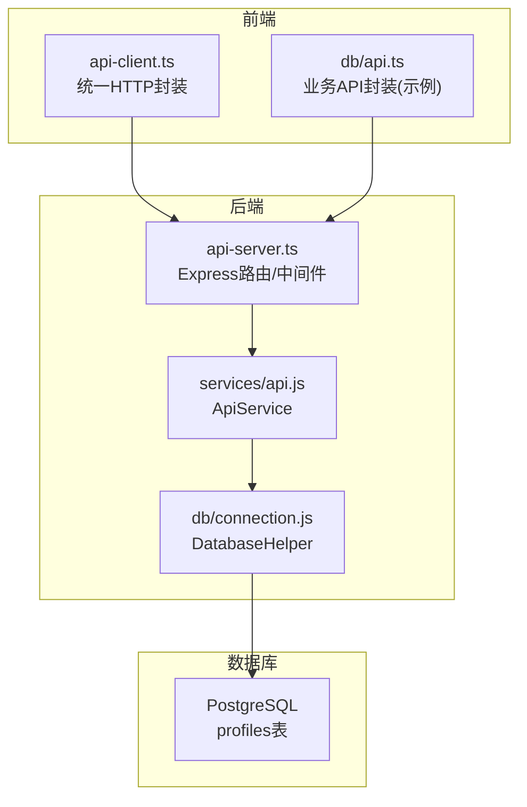
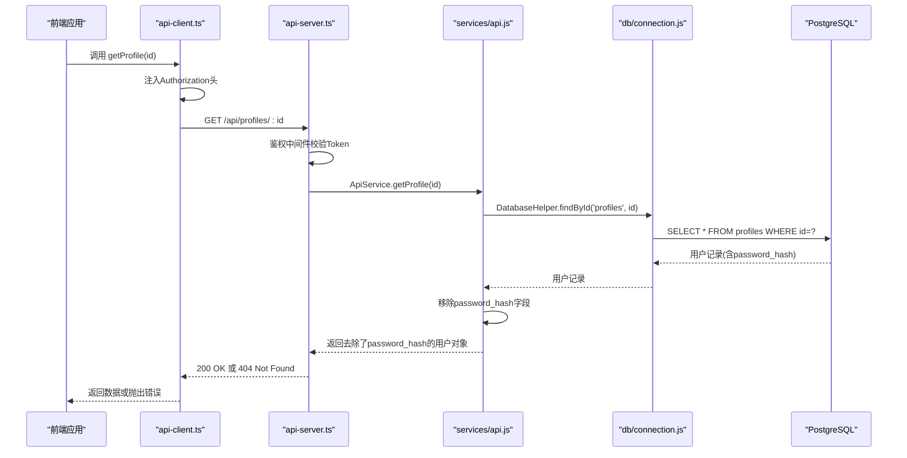
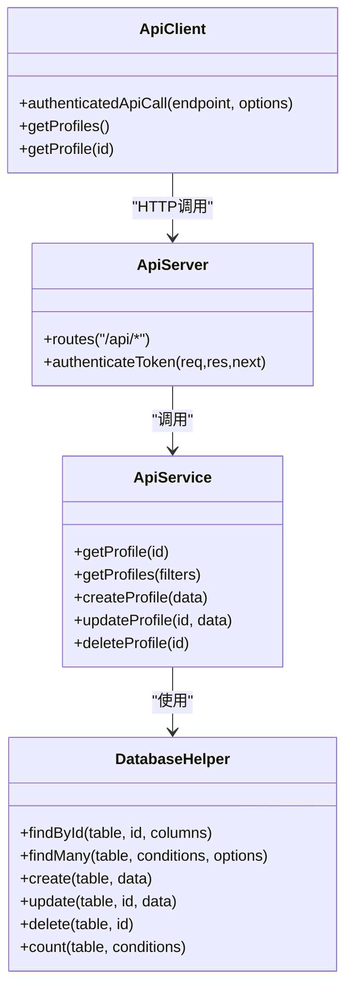

# 用户档案查询

<cite>
**本文档引用的文件**
- [server/api-server.ts](file://server/api-server.ts)
- [server/src/services/api.js](file://server/src/services/api.js)
- [server/src/db/connection.js](file://server/src/db/connection.js)
- [src/services/api-client.ts](file://src/services/api-client.ts)
- [src/db/api.ts](file://src/db/api.ts)
- [src/types/types.ts](file://src/types/types.ts)
- [supabase/migrations/00004_create_user_profiles_and_auth.sql](file://supabase/migrations/00004_create_user_profiles_and_auth.sql)
</cite>

## 目录
1. [简介](#简介)
2. [项目结构](#项目结构)
3. [核心组件](#核心组件)
4. [架构总览](#架构总览)
5. [详细组件分析](#详细组件分析)
6. [依赖关系分析](#依赖关系分析)
7. [性能考虑](#性能考虑)
8. [故障排除指南](#故障排除指南)
9. [结论](#结论)

## 简介
本文件面向前端与后端开发者，系统化梳理 Bio-Appointment 系统中“用户档案查询”相关接口，重点覆盖以下两个端点：
- 获取用户档案：GET /api/profiles/:id
- 获取用户列表：GET /api/profiles

文档将详细说明：
- 接口的 HTTP 方法、URL 路径、请求参数（如 role、status、department 等过滤条件）
- 响应数据结构与状态码
- 用户列表查询的动态过滤机制与排序规则
- 返回数据中自动移除密码哈希字段的安全处理
- 前端 api-client 与后端 ApiService 的协作模式
- 错误处理与日志记录最佳实践

## 项目结构
围绕用户档案查询的关键文件组织如下：
- 后端 API 服务器：负责路由、鉴权中间件、错误处理与业务调用
- 后端服务层：封装数据库操作与业务逻辑
- 前端 API 客户端：统一的 HTTP 调用封装与鉴权头注入
- 类型定义：前后端共享的 Profile 等类型
- 数据库迁移：profiles 表结构与 RLS 策略

图表来源
- [server/api-server.ts](file://server/api-server.ts#L118-L186)
- [server/src/services/api.js](file://server/src/services/api.js#L1-L48)
- [server/src/db/connection.js](file://server/src/db/connection.js#L163-L208)
- [src/services/api-client.ts](file://src/services/api-client.ts#L1-L60)
- [src/db/api.ts](file://src/db/api.ts#L380-L446)

章节来源
- [server/api-server.ts](file://server/api-server.ts#L1-L1189)
- [server/src/services/api.js](file://server/src/services/api.js#L1-L374)
- [server/src/db/connection.js](file://server/src/db/connection.js#L1-L271)
- [src/services/api-client.ts](file://src/services/api-client.ts#L1-L381)
- [src/db/api.ts](file://src/db/api.ts#L1-L800)
- [src/types/types.ts](file://src/types/types.ts#L1-L120)
- [supabase/migrations/00004_create_user_profiles_and_auth.sql](file://supabase/migrations/00004_create_user_profiles_and_auth.sql#L1-L207)

## 核心组件
- 后端路由与中间件
  - 鉴权中间件：校验 Authorization 头中的 Bearer Token，并将用户信息挂载到 req.user
  - 保护路由：对 /api 前缀启用鉴权中间件
  - 用户档案端点：
    - GET /api/profiles/:id：按用户 ID 查询档案；不存在时返回 404
    - GET /api/profiles：查询用户列表；返回时移除 password_hash 字段

- 服务层 ApiService
  - getProfile(id)：根据 ID 查询并返回去除 password_hash 的用户对象
  - getProfiles()：查询 profiles 表，按 created_at 降序排序，返回时移除 password_hash

- 数据库层 DatabaseHelper
  - findMany(table, conditions, options)：支持 where 条件、order by、limit、offset
  - findById(table, id)：按主键查询

- 前端 api-client
  - 统一的 authenticatedApiCall：自动注入 Authorization: Bearer token
  - 提供 getProfiles()、getProfile(id) 等方法，便于页面直接调用

章节来源
- [server/api-server.ts](file://server/api-server.ts#L118-L186)
- [server/src/services/api.js](file://server/src/services/api.js#L1-L48)
- [server/src/db/connection.js](file://server/src/db/connection.js#L163-L208)
- [src/services/api-client.ts](file://src/services/api-client.ts#L27-L60)

## 架构总览
下面的序列图展示了前端调用“获取用户档案”端点的典型流程。

图表来源
- [src/services/api-client.ts](file://src/services/api-client.ts#L27-L60)
- [server/api-server.ts](file://server/api-server.ts#L118-L186)
- [server/src/services/api.js](file://server/src/services/api.js#L1-L17)
- [server/src/db/connection.js](file://server/src/db/connection.js#L163-L171)

## 详细组件分析

### 接口定义与行为

- 获取用户档案（单个）
  - 方法与路径：GET /api/profiles/:id
  - 请求参数：
    - 路径参数：id（字符串，用户唯一标识）
  - 鉴权：需要 Authorization: Bearer <token>
  - 成功响应：200 OK，返回用户对象（已移除 password_hash）
  - 失败响应：
    - 404 Not Found：未找到对应用户
    - 401 Unauthorized：缺少或无效 Token
    - 500 Internal Server Error：服务异常

- 获取用户列表
  - 方法与路径：GET /api/profiles
  - 请求参数：支持查询字符串过滤（role、status、department）
  - 鉴权：需要 Authorization: Bearer <token>
  - 成功响应：200 OK，返回用户对象数组（每个对象已移除 password_hash）
  - 失败响应：
    - 401 Unauthorized：缺少或无效 Token
    - 500 Internal Server Error：服务异常

章节来源
- [server/api-server.ts](file://server/api-server.ts#L150-L186)
- [server/src/services/api.js](file://server/src/services/api.js#L18-L27)
- [server/src/db/connection.js](file://server/src/db/connection.js#L175-L208)

### 动态过滤机制与排序规则

- 用户列表过滤
  - ApiService.getProfiles() 直接将查询条件透传给 DatabaseHelper.findMany
  - 支持的过滤键（来自 profiles 表结构）：
    - role：用户角色
    - status：用户状态
    - department：所属部门
  - 过滤条件均为“等于”匹配，且仅当值非 undefined/非 null 时才加入 WHERE 子句
  - 排序规则：按 created_at 降序（最近创建优先）

- 前端调用示例
  - 前端 api-client.ts 中的 getProfiles() 会将传入的 filters 对象转换为查询字符串
  - 示例：getProfiles({ role: 'nurse', status: 'active', department: '内科' })

章节来源
- [server/src/services/api.js](file://server/src/services/api.js#L18-L27)
- [server/src/db/connection.js](file://server/src/db/connection.js#L175-L208)
- [src/services/api-client.ts](file://src/services/api-client.ts#L273-L279)

### 安全处理：自动移除密码哈希字段

- 后端安全处理
  - getProfile()：查询到用户记录后，使用解构语法移除 password_hash 字段再返回
  - getProfiles()：对每条记录都执行同样的移除操作
  - 该策略确保对外响应不泄露敏感字段

- 前端安全处理
  - api-client.ts 在调用时统一注入 Authorization 头，避免明文传输
  - 前端不接收或存储 password_hash 字段

章节来源
- [server/src/services/api.js](file://server/src/services/api.js#L10-L17)
- [server/src/services/api.js](file://server/src/services/api.js#L20-L27)
- [src/services/api-client.ts](file://src/services/api-client.ts#L27-L60)

### 响应数据结构

- Profile（对外响应）
  - 字段：id、username、email、full_name、role、department、status、created_at、updated_at
  - 注意：不包含 password_hash

- PublicProfile（类型定义）
  - 用于公开信息展示的简化结构，字段包含 id、username、full_name、role、department

章节来源
- [src/types/types.ts](file://src/types/types.ts#L23-L41)
- [src/types/types.ts](file://src/types/types.ts#L23-L33)

### 前端协作模式与最佳实践

- 前端调用链路
  - 页面组件通过 api-client.ts 的 getProfiles()/getProfile() 发起请求
  - api-client.ts 内部通过 authenticatedApiCall 注入 Authorization 头
  - api-client.ts 统一处理响应状态码与错误，抛出可读的错误信息

- 最佳实践
  - 统一错误处理：在页面层捕获错误并提示用户
  - 令牌管理：从本地存储读取并注入 Bearer Token
  - 参数构建：使用 URLSearchParams 将过滤条件拼接到查询字符串

章节来源
- [src/services/api-client.ts](file://src/services/api-client.ts#L1-L60)
- [src/services/api-client.ts](file://src/services/api-client.ts#L273-L279)
- [src/db/api.ts](file://src/db/api.ts#L380-L446)

### 日志与错误处理

- 后端错误处理
  - 全局错误中间件：捕获未处理异常并返回 500
  - 路由层：针对特定端点返回明确的错误消息与状态码（如 404、401、500）

- 前端错误处理
  - api-client.ts：当 response.ok 为 false 时，解析错误体并抛出带错误信息的异常
  - 页面层：使用 toast 或控制台输出错误，避免静默失败

章节来源
- [server/api-server.ts](file://server/api-server.ts#L28-L36)
- [server/api-server.ts](file://server/api-server.ts#L150-L186)
- [src/services/api-client.ts](file://src/services/api-client.ts#L1-L26)

## 依赖关系分析

图表来源
- [server/src/services/api.js](file://server/src/services/api.js#L1-L374)
- [server/src/db/connection.js](file://server/src/db/connection.js#L163-L271)
- [server/api-server.ts](file://server/api-server.ts#L118-L186)
- [src/services/api-client.ts](file://src/services/api-client.ts#L27-L60)

章节来源
- [server/src/services/api.js](file://server/src/services/api.js#L1-L374)
- [server/src/db/connection.js](file://server/src/db/connection.js#L163-L271)
- [server/api-server.ts](file://server/api-server.ts#L118-L186)
- [src/services/api-client.ts](file://src/services/api-client.ts#L27-L60)

## 性能考虑
- 查询优化
  - 用户列表按 created_at 降序排序，适合“最新优先”的展示场景
  - DatabaseHelper.findMany 支持 limit/offset，可在前端分页时减少一次性传输的数据量
- 安全与一致性
  - 通过移除 password_hash 字段，降低敏感信息泄露风险
  - 前端统一注入 Authorization 头，避免重复逻辑与遗漏
- 可扩展性
  - ApiService 层提供清晰的边界，便于后续增加索引、缓存或分页策略

[本节为通用建议，无需特定文件引用]

## 故障排除指南
- 401 未授权
  - 检查本地存储是否存在有效的访问令牌
  - 确认请求头 Authorization: Bearer <token> 已正确注入
- 404 用户不存在
  - 确认传入的用户 ID 是否有效
- 500 服务器内部错误
  - 查看后端日志，定位数据库查询或服务层异常
  - 确认数据库连接池初始化成功
- 前端调用失败
  - 捕获 api-client.ts 抛出的错误并提示用户
  - 检查网络连通性与 CORS 配置

章节来源
- [server/api-server.ts](file://server/api-server.ts#L28-L36)
- [server/api-server.ts](file://server/api-server.ts#L150-L186)
- [src/services/api-client.ts](file://src/services/api-client.ts#L1-L26)

## 结论
- 用户档案查询接口设计清晰，遵循最小暴露原则（自动移除敏感字段）
- 用户列表支持多条件组合过滤与创建时间倒序排序，满足常见管理场景
- 前后端协作通过 api-client.ts 与 ApiService 形成稳定边界，便于维护与扩展
- 建议在生产环境进一步完善：
  - 增加索引以优化过滤查询
  - 引入分页与缓存策略
  - 完善鉴权与审计日志