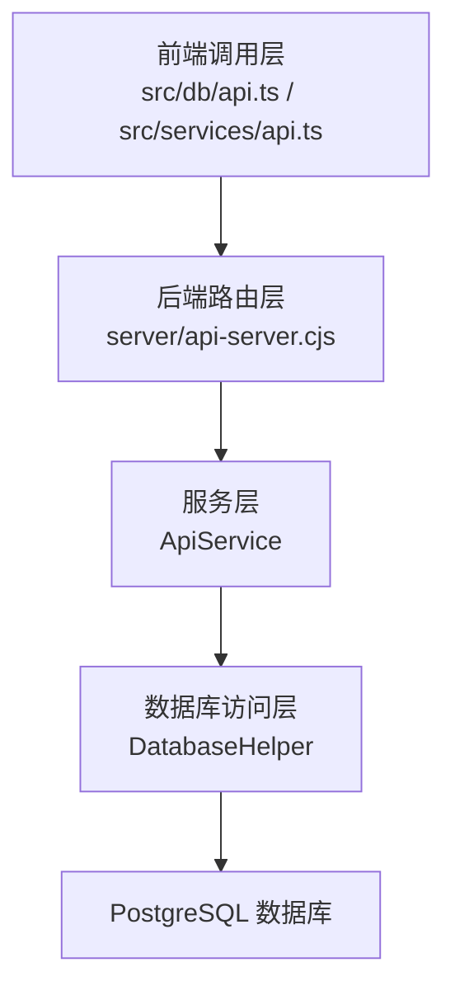
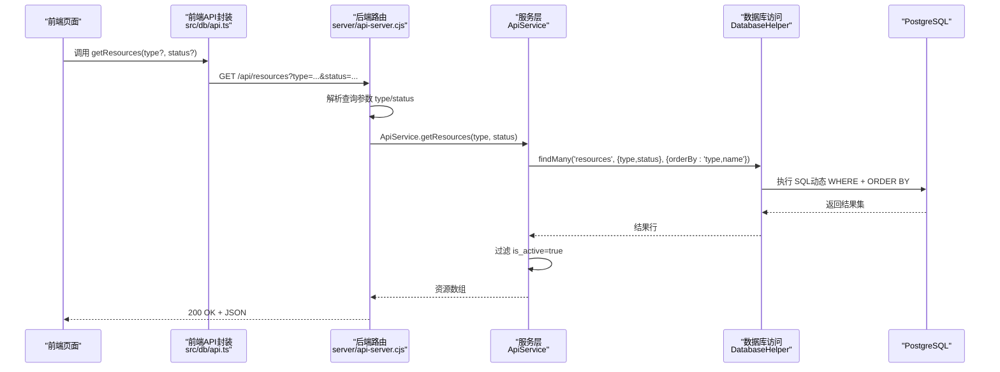
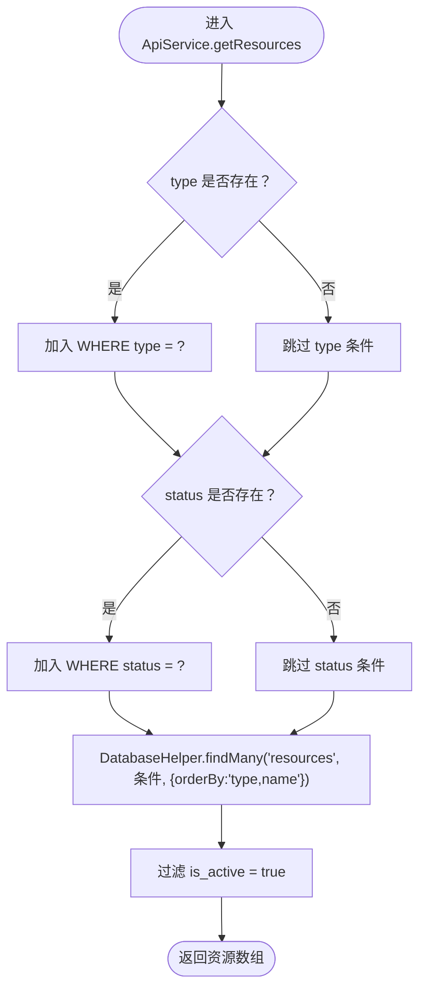
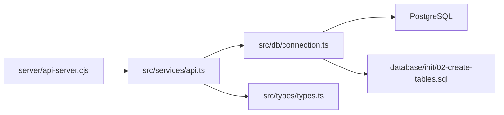

# 资源配置查询

<cite>
**本文引用的文件**
- [server/api-server.cjs](file://server/api-server.cjs)
- [src/services/api.ts](file://src/services/api.ts)
- [src/db/connection.ts](file://src/db/connection.ts)
- [src/db/api.ts](file://src/db/api.ts)
- [src/types/types.ts](file://src/types/types.ts)
- [database/init/02-create-tables.sql](file://database/init/02-create-tables.sql)
- [test-all-apis.js](file://test-all-apis.js)
</cite>

## 目录
1. [简介](#简介)
2. [项目结构](#项目结构)
3. [核心组件](#核心组件)
4. [架构总览](#架构总览)
5. [详细组件分析](#详细组件分析)
6. [依赖关系分析](#依赖关系分析)
7. [性能考量](#性能考量)
8. [故障排除指南](#故障排除指南)
9. [结论](#结论)
10. [附录](#附录)

## 简介
本文件面向前端与后端开发者，系统化梳理 Bio-Appointment 系统中“资源配置查询”接口（HTTP GET /api/resources）的实现与使用规范。重点覆盖：
- 接口方法、URL、查询参数（type、status）的使用方式
- 响应数据结构与状态码
- 多条件组合查询的构建逻辑
- 查询结果按类型与名称排序的实现
- 自动过滤非活跃资源（is_active=false）的策略
- 前端资源管理页面调用示例与后端 ApiService 的动态查询构建流程

## 项目结构
资源配置查询涉及三层协作：
- 前端调用层：通过 src/services/api.ts 或 src/db/api.ts 发起请求
- 后端路由层：Express 路由 server/api-server.cjs 暴露 /api/resources
- 数据访问层：ApiService 与 DatabaseHelper 组合完成查询与过滤

图表来源
- [server/api-server.cjs](file://server/api-server.cjs#L257-L285)
- [src/services/api.ts](file://src/services/api.ts#L112-L123)
- [src/db/connection.ts](file://src/db/connection.ts#L167-L236)

章节来源
- [server/api-server.cjs](file://server/api-server.cjs#L257-L285)
- [src/db/api.ts](file://src/db/api.ts#L519-L539)
- [src/services/api.ts](file://src/services/api.ts#L112-L123)
- [src/db/connection.ts](file://src/db/connection.ts#L167-L236)

## 核心组件
- 路由处理器：接收 HTTP GET /api/resources，解析查询参数 type、status，执行数据库查询并返回结果。
- ApiService：在前端侧提供 getResources(type?, status?) 方法，内部通过 DatabaseHelper.findMany 构建条件并排序，再以 is_active=true 过滤。
- DatabaseHelper：通用 ORM 辅助类，负责动态拼接 WHERE 条件、ORDER BY、LIMIT/OFFSET 等。
- 数据库表：resources 表包含 id、name、type、status、is_active 等字段；索引覆盖 type、status、is_active。

章节来源
- [server/api-server.cjs](file://server/api-server.cjs#L257-L285)
- [src/services/api.ts](file://src/services/api.ts#L112-L123)
- [src/db/connection.ts](file://src/db/connection.ts#L167-L236)
- [database/init/02-create-tables.sql](file://database/init/02-create-tables.sql#L38-L51)

## 架构总览
资源配置查询的端到端调用链如下：

图表来源
- [src/db/api.ts](file://src/db/api.ts#L519-L539)
- [server/api-server.cjs](file://server/api-server.cjs#L257-L285)
- [src/services/api.ts](file://src/services/api.ts#L112-L123)
- [src/db/connection.ts](file://src/db/connection.ts#L167-L236)

## 详细组件分析

### 接口定义与行为
- 方法与路径：HTTP GET /api/resources
- 查询参数：
  - type：资源类型（如 room、nurse 等），可选
  - status：资源状态（如 available、unavailable 等），可选
- 排序规则：按 type、name 升序排序
- 过滤策略：后端路由层返回的资源集合中，is_active=false 的资源会被前端 ApiService 再次过滤，确保仅返回可用资源
- 响应体：资源对象数组（见“响应数据结构”）

章节来源
- [server/api-server.cjs](file://server/api-server.cjs#L257-L285)
- [src/services/api.ts](file://src/services/api.ts#L112-L123)

### 查询参数与多条件组合
- 当仅传入 type 时，生成 WHERE type = $1
- 当仅传入 status 时，生成 WHERE status = $1
- 当同时传入 type 与 status 时，生成 WHERE type = $1 AND status = $2
- 未传参时，仅按 name 排序返回全部资源

章节来源
- [server/api-server.cjs](file://server/api-server.cjs#L257-L285)

### 排序实现
- 后端路由层：ORDER BY name
- 前端服务层：ORDER BY type, name
- 最终前端返回的资源数组按 type、name 排序

章节来源
- [server/api-server.cjs](file://server/api-server.cjs#L257-L285)
- [src/services/api.ts](file://src/services/api.ts#L112-L123)

### 可用性过滤（is_active）
- 后端路由层：返回数据库查询结果，不主动过滤 is_active
- 前端 ApiService：在内存中对结果进行 is_active=true 过滤，确保只返回可用资源
- 该策略保证了前端统一的“可用资源”语义

章节来源
- [server/api-server.cjs](file://server/api-server.cjs#L257-L285)
- [src/services/api.ts](file://src/services/api.ts#L112-L123)

### 响应数据结构
- 资源对象字段（节选）：id、name、type、category、status、capacity、location、description、is_active、created_at、updated_at
- 字段类型与取值范围：
  - type：枚举值（如 room）
  - status：枚举值（available、unavailable）
  - is_active：布尔值
  - created_at/updated_at：时间戳字符串

章节来源
- [database/init/02-create-tables.sql](file://database/init/02-create-tables.sql#L38-L51)
- [src/types/types.ts](file://src/types/types.ts#L108-L116)

### 状态码
- 200 OK：成功返回资源数组
- 500 Internal Server Error：服务器异常（如数据库查询失败）

章节来源
- [server/api-server.cjs](file://server/api-server.cjs#L257-L285)

### 前端调用示例
- 无参调用：获取全部可用资源
- 按类型过滤：传入 type=room
- 多条件组合：同时传入 type=room 与 status=available

章节来源
- [src/db/api.ts](file://src/db/api.ts#L519-L539)
- [src/db/api.ts](file://src/db/api.ts#L541-L561)

### 后端 ApiService 动态查询构建流程
- 参数映射：type -> resources.type，status -> resources.status
- 条件拼接：仅当参数存在时加入 WHERE 子句
- 排序：orderBy 设置为 type, name
- 过滤：返回结果后再按 is_active=true 过滤

图表来源
- [src/services/api.ts](file://src/services/api.ts#L112-L123)
- [src/db/connection.ts](file://src/db/connection.ts#L167-L236)

## 依赖关系分析
- 路由依赖：server/api-server.cjs 依赖数据库连接池与查询执行能力
- 服务层依赖：ApiService 依赖 DatabaseHelper 的 findMany 能力
- 数据访问层依赖：DatabaseHelper 依赖 PostgreSQL 连接池
- 类型定义：src/types/types.ts 为资源对象提供类型约束
- 数据库表：resources 表定义字段与索引，支撑查询与排序

图表来源
- [server/api-server.cjs](file://server/api-server.cjs#L257-L285)
- [src/services/api.ts](file://src/services/api.ts#L112-L123)
- [src/db/connection.ts](file://src/db/connection.ts#L167-L236)
- [src/types/types.ts](file://src/types/types.ts#L108-L116)
- [database/init/02-create-tables.sql](file://database/init/02-create-tables.sql#L38-L51)

章节来源
- [server/api-server.cjs](file://server/api-server.cjs#L257-L285)
- [src/services/api.ts](file://src/services/api.ts#L112-L123)
- [src/db/connection.ts](file://src/db/connection.ts#L167-L236)
- [src/types/types.ts](file://src/types/types.ts#L108-L116)
- [database/init/02-create-tables.sql](file://database/init/02-create-tables.sql#L38-L51)

## 性能考量
- 索引建议：resources 表已建立 type、status、is_active 索引，有助于 WHERE 与排序性能
- 排序成本：ORDER BY type, name 会在大结果集上产生额外开销，建议配合分页或筛选条件使用
- 过滤成本：前端再次过滤 is_active=true 为内存操作，建议尽量在后端层面完成（当前实现为前端过滤）

章节来源
- [database/init/02-create-tables.sql](file://database/init/02-create-tables.sql#L194-L196)

## 故障排除指南
- 404/500 错误：检查后端路由是否正确暴露 /api/resources，确认数据库连接正常
- 查询无结果：确认 type、status 是否与数据库实际值一致；确认 is_active=true 的资源确实存在
- 排序异常：确认数据库中 type、name 字段存在且类型正确
- 前端调用失败：检查 src/db/api.ts 中的 fetch 调用与 Authorization 头是否正确

章节来源
- [server/api-server.cjs](file://server/api-server.cjs#L257-L285)
- [src/db/api.ts](file://src/db/api.ts#L519-L539)
- [test-all-apis.js](file://test-all-apis.js#L1-L42)

## 结论
- /api/resources 接口支持按 type 与 status 的多条件组合查询，并按 type、name 排序
- is_active=false 的资源在前端被过滤，确保返回可用资源
- 前端调用简单直观，后端路由与服务层职责清晰，便于扩展与维护

## 附录

### API 定义速查
- 方法：GET
- 路径：/api/resources
- 查询参数：
  - type：可选，资源类型
  - status：可选，资源状态
- 响应：资源对象数组（按 type、name 排序）
- 状态码：200 成功；500 服务器错误

章节来源
- [server/api-server.cjs](file://server/api-server.cjs#L257-L285)

### 前端调用示例（路径引用）
- 获取全部可用资源：[src/db/api.ts](file://src/db/api.ts#L519-L539)
- 按类型过滤：[src/db/api.ts](file://src/db/api.ts#L541-L561)

### 后端查询构建（路径引用）
- 路由层参数解析与查询：[server/api-server.cjs](file://server/api-server.cjs#L257-L285)
- 服务层动态条件与排序：[src/services/api.ts](file://src/services/api.ts#L112-L123)
- 数据库访问辅助：[src/db/connection.ts](file://src/db/connection.ts#L167-L236)