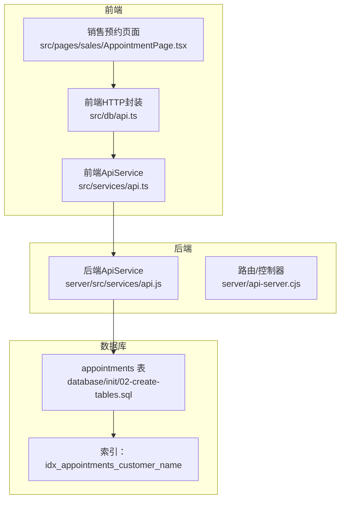
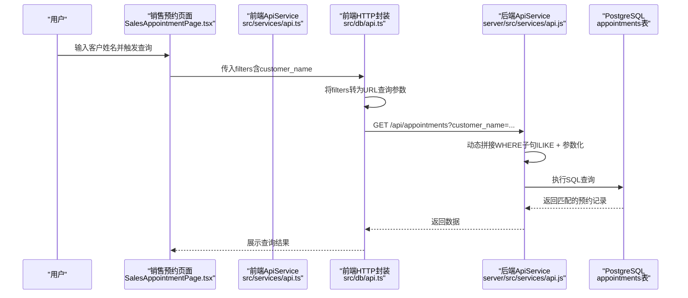
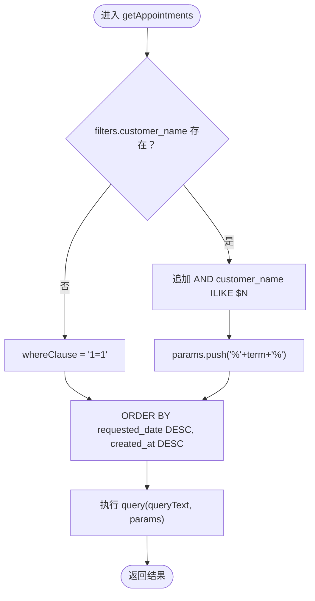
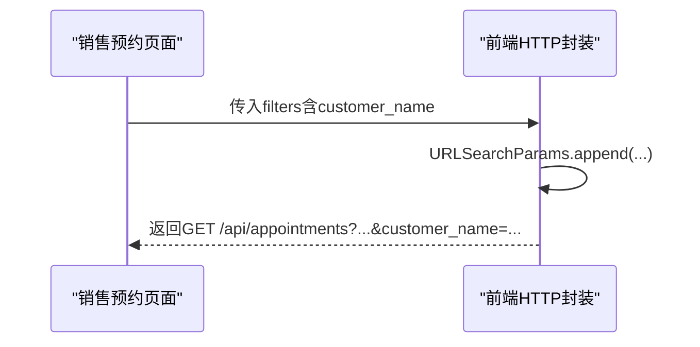
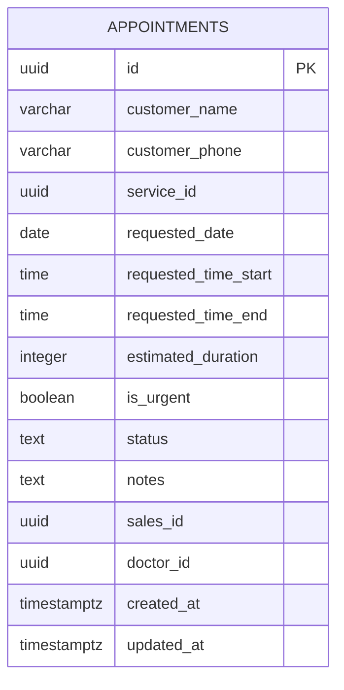
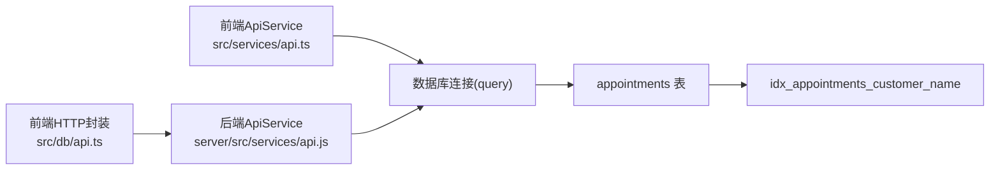

# 客户姓名查询

<cite>
**本文引用的文件**
- [src/services/api.ts](file://src/services/api.ts)
- [server/src/services/api.js](file://server/src/services/api.js)
- [src/db/api.ts](file://src/db/api.ts)
- [database/init/02-create-tables.sql](file://database/init/02-create-tables.sql)
- [src/pages/sales/AppointmentPage.tsx](file://src/pages/sales/AppointmentPage.tsx)
- [src/hooks/use-debounce.ts](file://src/hooks/use-debounce.ts)
</cite>

## 目录
1. [简介](#简介)
2. [项目结构](#项目结构)
3. [核心组件](#核心组件)
4. [架构总览](#架构总览)
5. [详细组件分析](#详细组件分析)
6. [依赖关系分析](#依赖关系分析)
7. [性能考量](#性能考量)
8. [故障排查指南](#故障排查指南)
9. [结论](#结论)

## 简介
本文件聚焦于Bio-Appointment系统中“客户姓名查询”能力，围绕以下目标展开：
- 说明如何通过customer_name参数实现预约记录的模糊搜索（ILIKE）。
- 解释前端在销售预约页面如何构造包含客户姓名的查询条件。
- 说明后端ApiService.getAppointments方法如何解析该参数并构建安全的SQL WHERE子句（使用$1参数化查询和%通配符）。
- 讨论该查询的大小写不敏感特性及其在处理中文姓名时的优势。
- 给出从用户输入到数据库查询的完整流程示例路径。
- 提供性能建议，包括在customer_name字段上创建索引以优化模糊搜索性能。

## 项目结构
与“客户姓名查询”直接相关的代码分布在三层：
- 前端服务层：封装数据库查询的ApiService类，负责拼接WHERE子句与参数。
- 后端服务层：提供REST接口，内部同样使用ApiService进行查询。
- 数据库层：定义appointments表及索引，确保查询性能。

图表来源
- [src/services/api.ts](file://src/services/api.ts#L151-L215)
- [server/src/services/api.js](file://server/src/services/api.js#L99-L146)
- [src/db/api.ts](file://src/db/api.ts#L588-L619)
- [database/init/02-create-tables.sql](file://database/init/02-create-tables.sql#L54-L77)
- [database/init/02-create-tables.sql](file://database/init/02-create-tables.sql#L198-L205)

章节来源
- [src/services/api.ts](file://src/services/api.ts#L151-L215)
- [server/src/services/api.js](file://server/src/services/api.js#L99-L146)
- [src/db/api.ts](file://src/db/api.ts#L588-L619)
- [database/init/02-create-tables.sql](file://database/init/02-create-tables.sql#L54-L77)
- [database/init/02-create-tables.sql](file://database/init/02-create-tables.sql#L198-L205)

## 核心组件
- 前端ApiService.getAppointments：接收filters对象，当存在customer_name时，动态拼接ILIKE条件并使用参数化查询。
- 后端ApiService.getAppointments：与前端逻辑一致，构建WHERE子句与参数数组，执行查询。
- 前端HTTP封装：将filters转换为URL查询参数，调用后端接口。
- 数据库表与索引：appointments表包含customer_name字段；初始化脚本创建了customer_name索引。

章节来源
- [src/services/api.ts](file://src/services/api.ts#L151-L215)
- [server/src/services/api.js](file://server/src/services/api.js#L99-L146)
- [src/db/api.ts](file://src/db/api.ts#L588-L619)
- [database/init/02-create-tables.sql](file://database/init/02-create-tables.sql#L54-L77)
- [database/init/02-create-tables.sql](file://database/init/02-create-tables.sql#L198-L205)

## 架构总览
从前端到数据库的调用链路如下：

图表来源
- [src/pages/sales/AppointmentPage.tsx](file://src/pages/sales/AppointmentPage.tsx#L1-L50)
- [src/db/api.ts](file://src/db/api.ts#L588-L619)
- [src/services/api.ts](file://src/services/api.ts#L151-L215)
- [server/src/services/api.js](file://server/src/services/api.js#L99-L146)
- [database/init/02-create-tables.sql](file://database/init/02-create-tables.sql#L54-L77)

## 详细组件分析

### 前端ApiService.getAppointments（模糊搜索实现）
- 条件判断：当filters.customer_name存在时，追加AND customer_name ILIKE $N。
- 参数化：将查询词包裹为%{term}%，并推入params数组，按顺序分配$1、$2…。
- 排序：按requested_date降序、created_at降序排序，保证最新记录优先。
- 作用：将前端输入安全地转化为SQL查询，避免字符串拼接注入风险。

图表来源
- [src/services/api.ts](file://src/services/api.ts#L151-L215)

章节来源
- [src/services/api.ts](file://src/services/api.ts#L151-L215)

### 后端ApiService.getAppointments（与前端一致的实现）
- 逻辑与前端一致：当filters.customer_name存在时，追加ILIKE条件并参数化。
- 查询文本：动态拼接WHERE子句，最终执行。
- 作用：作为REST接口的查询实现，保障与前端一致的模糊搜索行为。

图表来源
- [server/src/services/api.js](file://server/src/services/api.js#L99-L146)

章节来源
- [server/src/services/api.js](file://server/src/services/api.js#L99-L146)

### 前端HTTP封装（构造查询条件）
- 将filters映射为URL查询参数，例如status、date、sales_id、doctor_id等。
- 在销售预约页面，filters.customer_name由用户输入传递给该封装函数。
- 作用：统一前端请求格式，便于后端解析。

图表来源
- [src/db/api.ts](file://src/db/api.ts#L588-L619)

章节来源
- [src/db/api.ts](file://src/db/api.ts#L588-L619)

### 数据库表结构与索引
- 表结构：appointments表包含customer_name字段，用于存储客户姓名。
- 索引：初始化脚本创建了idx_appointments_customer_name索引，有助于提升ILIKE查询性能。

图表来源
- [database/init/02-create-tables.sql](file://database/init/02-create-tables.sql#L54-L77)

章节来源
- [database/init/02-create-tables.sql](file://database/init/02-create-tables.sql#L54-L77)
- [database/init/02-create-tables.sql](file://database/init/02-create-tables.sql#L198-L205)

### 前端销售预约页面（用户输入与查询）
- 页面表单包含customer_name字段，用户输入后触发查询或提交。
- 提交时，customer_name随其他字段一起写入数据库；查询时，customer_name作为filters传入前端HTTP封装。
- 作用：提供用户入口，承载“客户姓名查询”的交互体验。

章节来源
- [src/pages/sales/AppointmentPage.tsx](file://src/pages/sales/AppointmentPage.tsx#L20-L54)
- [src/pages/sales/AppointmentPage.tsx](file://src/pages/sales/AppointmentPage.tsx#L164-L219)

## 依赖关系分析
- 前端ApiService依赖数据库连接工具（query），负责执行参数化SQL。
- 前端HTTP封装依赖fetch，将filters转换为URL参数并调用后端接口。
- 后端ApiService依赖数据库连接工具，实现与前端一致的查询逻辑。
- 数据库层依赖PostgreSQL，使用ILIKE进行大小写不敏感模糊匹配，并通过索引加速。

图表来源
- [src/services/api.ts](file://src/services/api.ts#L1-L20)
- [src/services/api.ts](file://src/services/api.ts#L151-L215)
- [src/db/api.ts](file://src/db/api.ts#L588-L619)
- [server/src/services/api.js](file://server/src/services/api.js#L1-L20)
- [server/src/services/api.js](file://server/src/services/api.js#L99-L146)
- [database/init/02-create-tables.sql](file://database/init/02-create-tables.sql#L54-L77)
- [database/init/02-create-tables.sql](file://database/init/02-create-tables.sql#L198-L205)

章节来源
- [src/services/api.ts](file://src/services/api.ts#L1-L20)
- [src/services/api.ts](file://src/services/api.ts#L151-L215)
- [src/db/api.ts](file://src/db/api.ts#L588-L619)
- [server/src/services/api.js](file://server/src/services/api.js#L1-L20)
- [server/src/services/api.js](file://server/src/services/api.js#L99-L146)
- [database/init/02-create-tables.sql](file://database/init/02-create-tables.sql#L54-L77)
- [database/init/02-create-tables.sql](file://database/init/02-create-tables.sql#L198-L205)

## 性能考量
- ILIKE的大小写不敏感特性：在PostgreSQL中，ILIKE默认大小写不敏感，便于用户输入任意大小写仍能命中结果。
- 中文姓名优势：ILIKE对多字节字符友好，中文姓名前后缀匹配均有效，无需额外正则处理。
- 参数化查询：通过$N占位符与params数组，避免SQL注入，同时利于数据库计划缓存。
- 索引优化：初始化脚本已创建idx_appointments_customer_name索引，可显著提升ILIKE查询性能。
- 建议：若customer_name字段数据量大且查询频繁，可进一步评估是否使用GIN/Trigram扩展或全文索引以获得更好性能（需结合业务场景与数据分布评估）。

章节来源
- [database/init/02-create-tables.sql](file://database/init/02-create-tables.sql#L198-L205)
- [src/services/api.ts](file://src/services/api.ts#L151-L215)
- [server/src/services/api.js](file://server/src/services/api.js#L99-L146)

## 故障排查指南
- 查询无结果
  - 检查filters.customer_name是否正确传入前端HTTP封装。
  - 确认数据库中是否存在对应customer_name值（注意大小写与空格差异）。
- SQL注入风险
  - 确保始终使用参数化查询（$N），不要拼接字符串。
- 性能问题
  - 若数据量增长，确认idx_appointments_customer_name索引存在并生效。
  - 考虑对ILIKE进行前缀匹配优化（如仅以%开头的前缀查询）以利用索引。
- 前端防抖
  - 对高频输入（如实时搜索）可使用防抖钩子降低请求频率，减少后端压力。

章节来源
- [src/hooks/use-debounce.ts](file://src/hooks/use-debounce.ts#L1-L15)
- [src/db/api.ts](file://src/db/api.ts#L588-L619)
- [database/init/02-create-tables.sql](file://database/init/02-create-tables.sql#L198-L205)

## 结论
- “客户姓名查询”通过ILIKE实现大小写不敏感的模糊匹配，配合参数化查询确保安全性。
- 前端与后端共享相同的查询逻辑，保证一致性与可维护性。
- 数据库层面已具备customer_name索引，满足常见查询性能需求；在数据规模扩大时可进一步评估索引策略。
- 建议在高频输入场景引入防抖机制，平衡用户体验与系统负载。