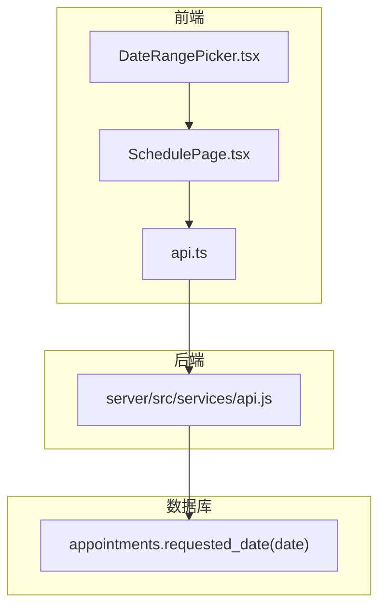
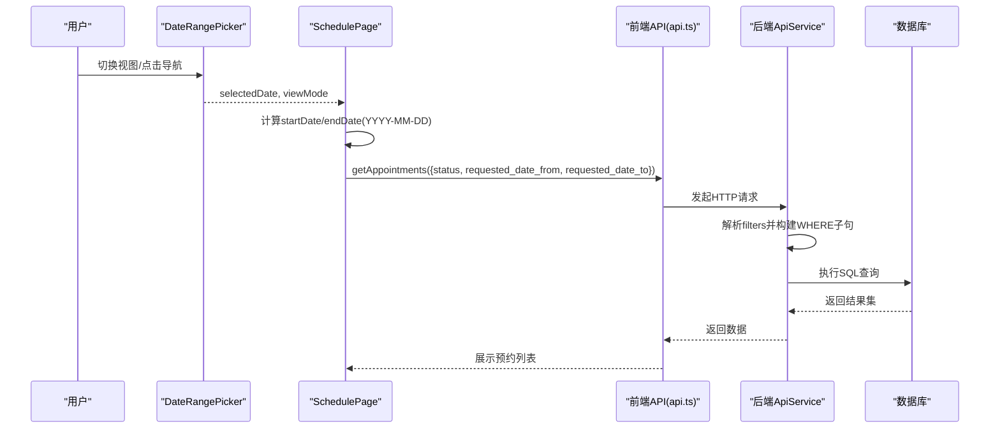

# 日期范围筛选

<cite>
**本文引用的文件**
- [DateRangePicker.tsx](file://src/components/appointment/DateRangePicker.tsx)
- [SchedulePage.tsx](file://src/pages/head-nurse/SchedulePage.tsx)
- [api.ts](file://src/db/api.ts)
- [api.js](file://server/src/services/api.js)
- [types.ts](file://src/types/types.ts)
- [00001_create_bio_appointment_schema.sql](file://supabase/migrations/00001_create_bio_appointment_schema.sql)
- [test-api-data.cjs](file://test-api-data.cjs)
- [DATE_FILTER_IMPLEMENTATION_SUMMARY.md](file://DATE_FILTER_IMPLEMENTATION_SUMMARY.md)
- [DATE_FILTER_USER_GUIDE.md](file://DATE_FILTER_USER_GUIDE.md)
</cite>

## 目录
1. [简介](#简介)
2. [项目结构](#项目结构)
3. [核心组件](#核心组件)
4. [架构总览](#架构总览)
5. [详细组件分析](#详细组件分析)
6. [依赖分析](#依赖分析)
7. [性能考量](#性能考量)
8. [故障排除指南](#故障排除指南)
9. [结论](#结论)
10. [附录](#附录)

## 简介
本文件聚焦于Bio-Appointment系统的“预约日期范围筛选”能力，围绕requested_date、requested_date_from、requested_date_to三个参数，系统性阐述：
- 单日期查询（requested_date）与范围查询（from/to）的区别与适用场景
- 前端如何通过DateRangePicker生成参数，后端ApiService.getAppointments如何据此构建SQL条件
- 实际代码示例路径，展示如何查询某一天、某段时间内的预约记录
- 日期格式（YYYY-MM-DD）规范与潜在时区处理注意事项

## 项目结构
围绕日期筛选的关键文件与职责如下：
- 前端组件：DateRangePicker.tsx负责生成日期范围参数；SchedulePage.tsx在不同视图模式下计算并传递日期范围；api.ts封装前端API调用。
- 后端服务：server/src/services/api.js提供ApiService.getAppointments，依据filters动态拼接WHERE条件。
- 类型定义：types.ts声明Appointment与相关过滤字段类型。
- 数据库：00001_create_bio_appointment_schema.sql定义requested_date为date类型，配合索引提升查询性能。
- 测试与文档：test-api-data.cjs演示不同视图下的参数组合；相关优化与使用指南文档提供用户与技术参考。

图表来源
- [DateRangePicker.tsx](file://src/components/appointment/DateRangePicker.tsx#L1-L223)
- [SchedulePage.tsx](file://src/pages/head-nurse/SchedulePage.tsx#L60-L120)
- [api.ts](file://src/db/api.ts#L588-L619)
- [api.js](file://server/src/services/api.js#L99-L135)
- [00001_create_bio_appointment_schema.sql](file://supabase/migrations/00001_create_bio_appointment_schema.sql#L137-L158)

章节来源
- [DateRangePicker.tsx](file://src/components/appointment/DateRangePicker.tsx#L1-L223)
- [SchedulePage.tsx](file://src/pages/head-nurse/SchedulePage.tsx#L60-L120)
- [api.ts](file://src/db/api.ts#L588-L619)
- [api.js](file://server/src/services/api.js#L99-L135)
- [types.ts](file://src/types/types.ts#L117-L137)
- [00001_create_bio_appointment_schema.sql](file://supabase/migrations/00001_create_bio_appointment_schema.sql#L137-L158)

## 核心组件
- DateRangePicker.tsx：根据视图模式（日/周/月）生成日期范围字符串，提供上一个/下一个/今天导航，以及“时间范围提示”文本。
- SchedulePage.tsx：在不同视图模式下计算startDate与endDate（YYYY-MM-DD），并将这些参数传给前端API getAppointments。
- api.ts：封装前端调用，将filters组装为URL查询参数（status、date、sales_id、doctor_id等），并在日/周/月视图下注入requested_date_from与requested_date_to。
- ApiService.getAppointments（server/src/services/api.js）：根据filters动态拼接WHERE子句，支持requested_date、requested_date_from、requested_date_to三者组合。
- types.ts：定义Appointment与过滤字段类型，确保类型安全。
- 数据库schema：appointments.requested_date为date类型，配合索引提升查询性能。

章节来源
- [DateRangePicker.tsx](file://src/components/appointment/DateRangePicker.tsx#L1-L223)
- [SchedulePage.tsx](file://src/pages/head-nurse/SchedulePage.tsx#L60-L120)
- [api.ts](file://src/db/api.ts#L588-L619)
- [api.js](file://server/src/services/api.js#L99-L135)
- [types.ts](file://src/types/types.ts#L117-L137)
- [00001_create_bio_appointment_schema.sql](file://supabase/migrations/00001_create_bio_appointment_schema.sql#L137-L158)

## 架构总览
下面的序列图展示了“日/周/月视图”下，前端如何生成日期范围参数并调用后端接口，最终由后端根据filters构建SQL条件返回数据。

图表来源
- [DateRangePicker.tsx](file://src/components/appointment/DateRangePicker.tsx#L1-L223)
- [SchedulePage.tsx](file://src/pages/head-nurse/SchedulePage.tsx#L60-L120)
- [api.ts](file://src/db/api.ts#L588-L619)
- [api.js](file://server/src/services/api.js#L99-L135)

## 详细组件分析

### DateRangePicker组件
- 视图模式适配：根据viewMode（day/week/month）切换选择器类型与导航行为。
- 参数生成：通过selectedDate计算并格式化为YYYY-MM-DD字符串，用于后续API调用。
- 快速导航：上一个/下一个/今天按钮分别对应日/周/月粒度的日期推进。
- 文本提示：提供完整与简短两种格式的时间范围提示，便于用户感知当前筛选区间。

章节来源
- [DateRangePicker.tsx](file://src/components/appointment/DateRangePicker.tsx#L1-L223)

### SchedulePage页面的数据加载与参数传递
- 视图模式与日期范围：根据viewMode计算startDate与endDate（YYYY-MM-DD），确保日视图为单日，周视图为周一到周日，月视图为1日到月末。
- 并发加载：同时获取待排班预约、排班、可用护士与房间，提高看板渲染效率。
- 参数传递：将status与requested_date_from、requested_date_to传入前端API getAppointments。

章节来源
- [SchedulePage.tsx](file://src/pages/head-nurse/SchedulePage.tsx#L60-L120)

### 前端API封装（api.ts）
- getAppointments(filters)：将filters组装为URL查询参数，支持status、date、sales_id、doctor_id等；在日/周/月视图下注入requested_date_from与requested_date_to。
- 返回类型：Promise<Array<Appointment>>，与types.ts中的Appointment类型保持一致。

章节来源
- [api.ts](file://src/db/api.ts#L588-L619)
- [types.ts](file://src/types/types.ts#L117-L137)

### 后端ApiService.getAppointments（server/src/services/api.js）
- 动态WHERE构建：依次处理customer_name、status、sales_id、doctor_id、requested_date、requested_date_from、requested_date_to等字段，拼接为可注入的参数化查询。
- 条件规则：
  - requested_date：精确相等（= $n）
  - requested_date_from：大于等于（>= $n）
  - requested_date_to：小于等于（<= $n）
- 排序：按requested_date降序、created_at降序，便于优先展示最新预约。

章节来源
- [api.js](file://server/src/services/api.js#L99-L135)

### 数据库schema与索引
- requested_date为date类型，确保存储与比较的统一性。
- 索引：idx_appointments_date_status（requested_date, status）有助于加速按日期与状态的查询。

章节来源
- [00001_create_bio_appointment_schema.sql](file://supabase/migrations/00001_create_bio_appointment_schema.sql#L137-L158)
- [00001_create_bio_appointment_schema.sql](file://supabase/migrations/00001_create_bio_appointment_schema.sql#L192-L196)

### 实际代码示例路径（查询某一天/某段时间）
- 查询某一天的预约：
  - 前端：在日视图下，startDate与endDate均为当日YYYY-MM-DD，传入requested_date_from与requested_date_to。
  - 后端：WHERE子句包含requested_date_from >= $1 且 requested_date_to <= $2，最终由requested_date精确匹配（= $3）。
  - 示例路径：
    - [SchedulePage.tsx](file://src/pages/head-nurse/SchedulePage.tsx#L60-L120)
    - [api.ts](file://src/db/api.ts#L588-L619)
    - [api.js](file://server/src/services/api.js#L99-L135)
- 查询某段时间内的预约：
  - 前端：在周/月视图下，计算startDate与endDate，传入requested_date_from与requested_date_to。
  - 后端：WHERE子句包含requested_date_from >= $1 且 requested_date_to <= $2。
  - 示例路径：
    - [test-api-data.cjs](file://test-api-data.cjs#L113-L155)

章节来源
- [SchedulePage.tsx](file://src/pages/head-nurse/SchedulePage.tsx#L60-L120)
- [api.ts](file://src/db/api.ts#L588-L619)
- [api.js](file://server/src/services/api.js#L99-L135)
- [test-api-data.cjs](file://test-api-data.cjs#L113-L155)

### 日期格式与视图模式映射
- 格式规范：YYYY-MM-DD（ISO 8601日期字符串），与数据库date类型一致。
- 视图模式映射：
  - 日视图：startDate = endDate = 当日YYYY-MM-DD
  - 周视图：startDate = 周一YYYY-MM-DD，endDate = 周日YYYY-MM-DD
  - 月视图：startDate = 1日YYYY-MM-DD，endDate = 月末YYYY-MM-DD
- 文档参考：
  - [DATE_FILTER_IMPLEMENTATION_SUMMARY.md](file://DATE_FILTER_IMPLEMENTATION_SUMMARY.md#L37-L49)
  - [DATE_FILTER_USER_GUIDE.md](file://DATE_FILTER_USER_GUIDE.md#L1-L120)

章节来源
- [DATE_FILTER_IMPLEMENTATION_SUMMARY.md](file://DATE_FILTER_IMPLEMENTATION_SUMMARY.md#L37-L49)
- [DATE_FILTER_USER_GUIDE.md](file://DATE_FILTER_USER_GUIDE.md#L1-L120)

### 时区处理注意事项
- 存储与传输：数据库层使用date类型，前端与后端均以YYYY-MM-DD字符串传递，避免时区转换带来的边界问题。
- 业务边界：若未来引入time/datetime字段，需明确时区策略（如统一UTC或本地时区），并在前后端统一转换。
- 建议：当前实现已满足日期级筛选需求，无需额外时区处理。

章节来源
- [00001_create_bio_appointment_schema.sql](file://supabase/migrations/00001_create_bio_appointment_schema.sql#L137-L158)

## 依赖分析
- 组件耦合：
  - DateRangePicker与SchedulePage通过selectedDate与viewMode耦合，SchedulePage负责计算日期范围并调用前端API。
  - 前端API与后端ApiService解耦，通过HTTP接口交互。
- 外部依赖：
  - date-fns用于日期计算与格式化，确保跨浏览器一致性。
  - 数据库索引idx_appointments_date_status提升查询性能。

图表来源
- [DateRangePicker.tsx](file://src/components/appointment/DateRangePicker.tsx#L1-L223)
- [SchedulePage.tsx](file://src/pages/head-nurse/SchedulePage.tsx#L60-L120)
- [api.ts](file://src/db/api.ts#L588-L619)
- [api.js](file://server/src/services/api.js#L99-L135)
- [00001_create_bio_appointment_schema.sql](file://supabase/migrations/00001_create_bio_appointment_schema.sql#L137-L158)

章节来源
- [DateRangePicker.tsx](file://src/components/appointment/DateRangePicker.tsx#L1-L223)
- [SchedulePage.tsx](file://src/pages/head-nurse/SchedulePage.tsx#L60-L120)
- [api.ts](file://src/db/api.ts#L588-L619)
- [api.js](file://server/src/services/api.js#L99-L135)
- [00001_create_bio_appointment_schema.sql](file://supabase/migrations/00001_create_bio_appointment_schema.sql#L137-L158)

## 性能考量
- 索引利用：idx_appointments_date_status（requested_date, status）可显著提升按日期与状态的筛选性能。
- 参数化查询：后端使用$1/$2/$3等参数绑定，避免SQL注入并利于执行计划缓存。
- 前端并发：SchedulePage在加载时并发获取预约、排班、资源等数据，减少首屏等待。
- 日期范围计算：使用date-fns的startOfWeek、endOfWeek、startOfMonth、endOfMonth等函数，确保边界计算准确。

章节来源
- [00001_create_bio_appointment_schema.sql](file://supabase/migrations/00001_create_bio_appointment_schema.sql#L192-L196)
- [api.js](file://server/src/services/api.js#L99-L135)
- [SchedulePage.tsx](file://src/pages/head-nurse/SchedulePage.tsx#L60-L120)

## 故障排除指南
- 问题：周视图/月视图仅显示单日数据
  - 解决：确认SchedulePage已根据viewMode正确计算startDate与endDate，并传入requested_date_from与requested_date_to。
  - 参考路径：
    - [SchedulePage.tsx](file://src/pages/head-nurse/SchedulePage.tsx#L60-L120)
    - [DATE_FILTER_IMPLEMENTATION_SUMMARY.md](file://DATE_FILTER_IMPLEMENTATION_SUMMARY.md#L37-L49)
- 问题：查询结果为空
  - 检查：日期格式是否为YYYY-MM-DD；是否正确设置了status等过滤条件。
  - 参考路径：
    - [api.ts](file://src/db/api.ts#L588-L619)
    - [api.js](file://server/src/services/api.js#L99-L135)
- 问题：性能缓慢
  - 检查：是否命中索引idx_appointments_date_status；是否同时使用了status等过滤条件。
  - 参考路径：
    - [00001_create_bio_appointment_schema.sql](file://supabase/migrations/00001_create_bio_appointment_schema.sql#L192-L196)

章节来源
- [SchedulePage.tsx](file://src/pages/head-nurse/SchedulePage.tsx#L60-L120)
- [api.ts](file://src/db/api.ts#L588-L619)
- [api.js](file://server/src/services/api.js#L99-L135)
- [00001_create_bio_appointment_schema.sql](file://supabase/migrations/00001_create_bio_appointment_schema.sql#L192-L196)
- [DATE_FILTER_IMPLEMENTATION_SUMMARY.md](file://DATE_FILTER_IMPLEMENTATION_SUMMARY.md#L37-L49)

## 结论
- requested_date适用于精确匹配某一天的场景；requested_date_from与requested_date_to构成灵活的范围查询，覆盖日/周/月等不同视图模式。
- 前端通过DateRangePicker与SchedulePage计算并传递日期范围参数，后端ApiService.getAppointments基于filters动态构建SQL条件，形成清晰、可维护的筛选链路。
- 日期格式统一为YYYY-MM-DD，数据库采用date类型并建立索引，保障查询性能与一致性。
- 若未来引入时间维度，需明确时区策略并在前后端统一转换。

## 附录
- 相关文档与测试：
  - [DATE_FILTER_IMPLEMENTATION_SUMMARY.md](file://DATE_FILTER_IMPLEMENTATION_SUMMARY.md#L1-L455)
  - [DATE_FILTER_USER_GUIDE.md](file://DATE_FILTER_USER_GUIDE.md#L1-L280)
  - [test-api-data.cjs](file://test-api-data.cjs#L113-L155)