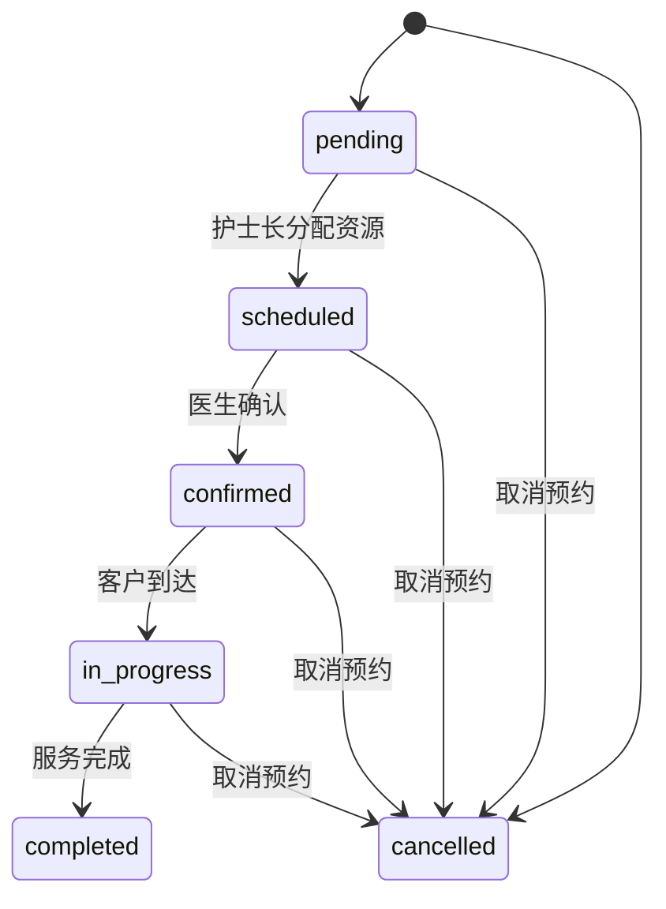
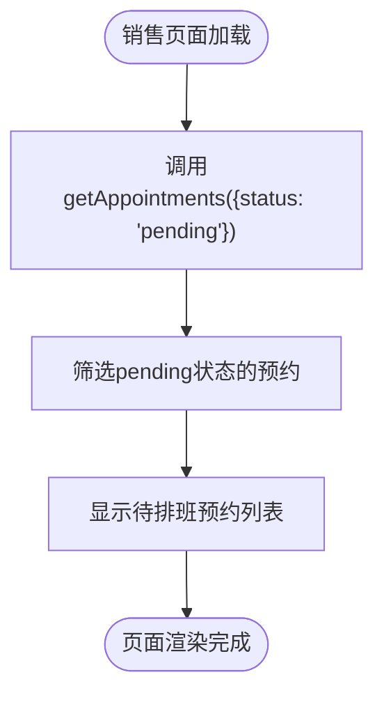
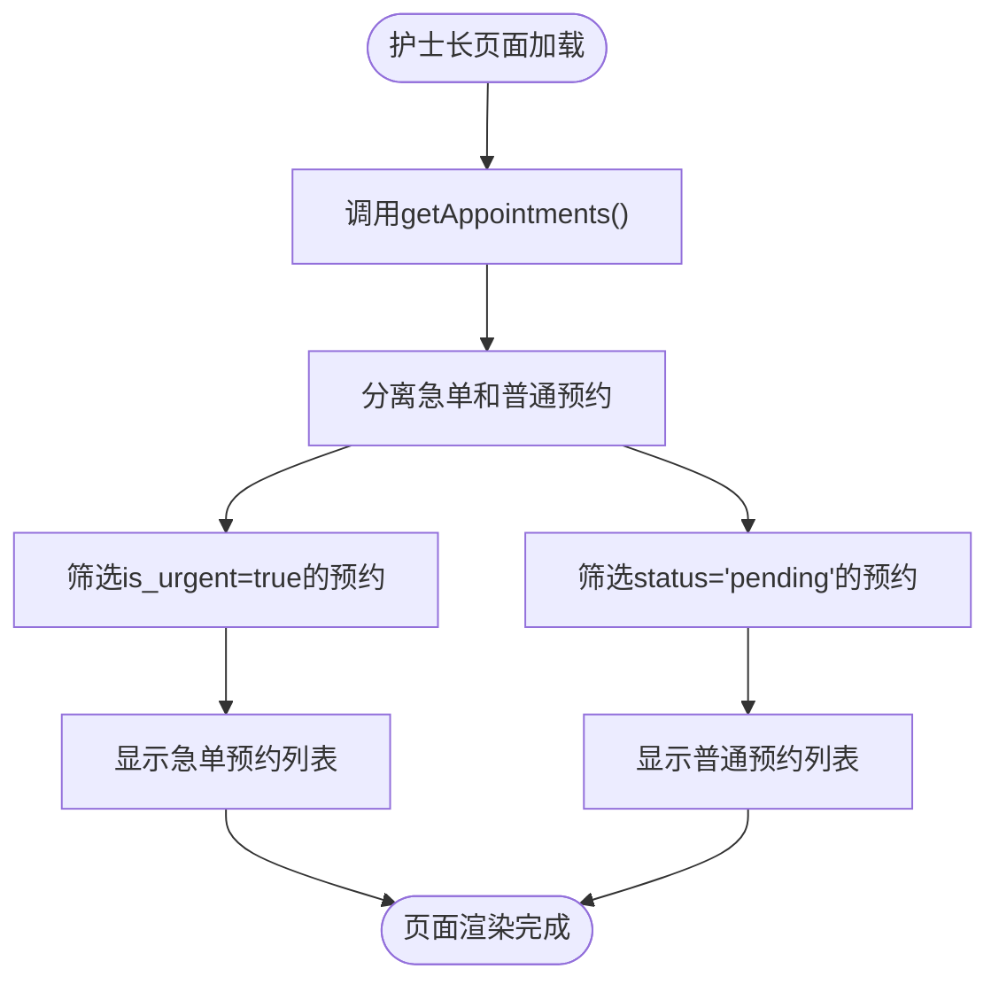
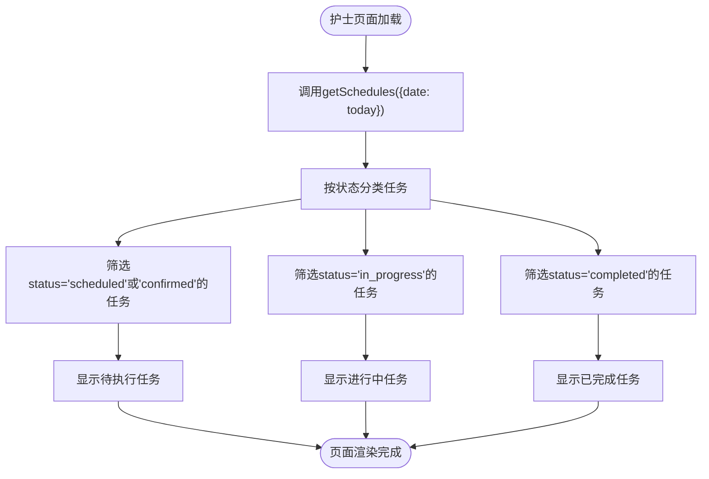
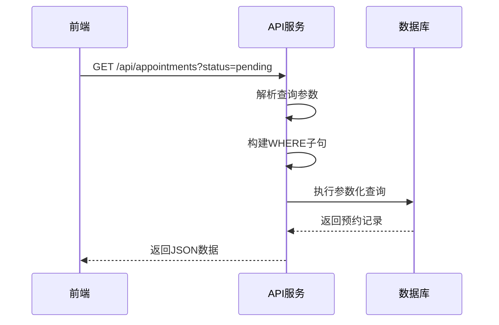
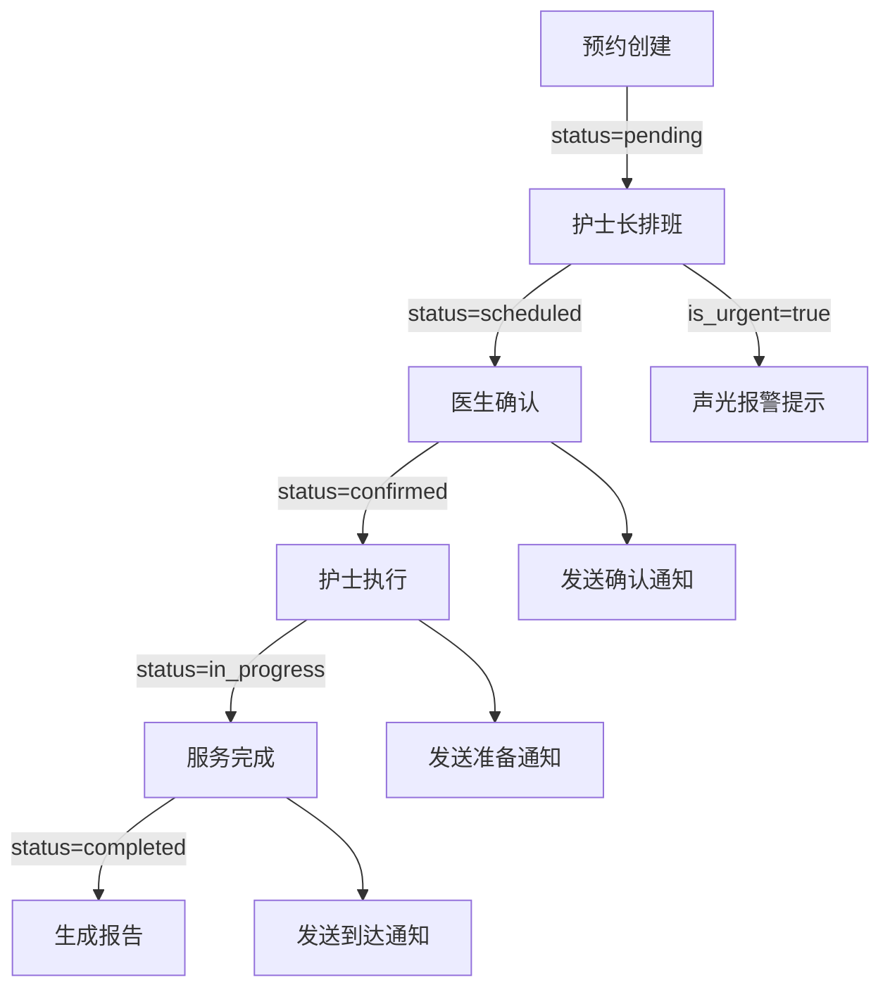

# 状态筛选

<cite>
**本文档引用文件**   
- [api.js](file://server/src/services/api.js)
- [api-client.ts](file://src/services/api-client.ts)
- [StatusBadge.tsx](file://src/components/appointment/StatusBadge.tsx)
- [types.ts](file://src/types/types.js)
- [02-create-tables.sql](file://database/init/02-create-tables.sql)
- [00001_create_bio_appointment_schema.sql](file://supabase/migrations/00001_create_bio_appointment_schema.sql)
- [AppointmentPage.tsx](file://src/pages/sales/AppointmentPage.tsx)
- [SchedulePage.tsx](file://src/pages/head-nurse/SchedulePage.tsx)
- [TaskPage.tsx](file://src/pages/nurse/TaskPage.tsx)
</cite>

## 目录
1. [引言](#引言)
2. [状态筛选功能概述](#状态筛选功能概述)
3. [预约状态流转体系](#预约状态流转体系)
4. [前端页面状态筛选应用](#前端页面状态筛选应用)
5. [后端API实现细节](#后端api实现细节)
6. [代码使用示例](#代码使用示例)
7. [工作流管理与任务分配应用](#工作流管理与任务分配应用)
8. [结论](#结论)

## 引言
Bio-Appointment系统是一个智能预约调度平台，支持多角色协同工作。本系统通过状态筛选功能，实现了对预约记录的精确匹配查询，帮助不同角色的用户高效管理预约、排班和任务执行。本文档详细描述了状态筛选功能的实现原理、使用方法及其在工作流管理中的应用。

## 状态筛选功能概述

状态筛选功能是Bio-Appointment系统的核心查询机制之一，允许用户通过`status`参数实现对预约记录的精确匹配查询。该功能支持多种状态值的筛选，包括待排班、已排班、已确认、进行中和已完成等，为不同角色的用户提供针对性的信息视图。

系统通过RESTful API提供状态筛选功能，前端页面通过调用API并传递`status`参数来获取特定状态的预约列表。后端API服务将`status`参数转换为SQL查询中的等值匹配条件（= $1），实现高效的数据检索。

**Section sources**
- [api.js](file://server/src/services/api.js#L99-L135)
- [api-client.ts](file://src/services/api-client.ts#L178-L190)

## 预约状态流转体系

Bio-Appointment系统定义了一套完整的预约状态流转体系，涵盖了从预约创建到服务完成的整个生命周期。这些状态不仅反映了预约的当前进展，还指导了后续的工作流程。

### 预约状态定义
系统支持以下预约状态：

- **pending（待排班）**：预约已创建，等待护士长分配资源
- **scheduled（已排班）**：已分配房间和护士，等待医生确认
- **confirmed（已确认）**：医生已确认，预约已锁定
- **in_progress（进行中）**：客户已到达，服务正在进行
- **completed（已完成）**：服务已完成
- **cancelled（已取消）**：预约已取消

这些状态在数据库中通过`appointment_status`枚举类型定义，并在`appointments`表中作为`status`字段存储。

### 状态流转图


**Diagram sources **
- [00001_create_bio_appointment_schema.sql](file://supabase/migrations/00001_create_bio_appointment_schema.sql#L150)
- [types.ts](file://src/types/types.ts#L13)

**Section sources**
- [00001_create_bio_appointment_schema.sql](file://supabase/migrations/00001_create_bio_appointment_schema.sql#L150)
- [types.ts](file://src/types/types.ts#L13)

## 前端页面状态筛选应用

状态筛选功能在前端页面中得到了广泛应用，不同角色的用户通过该功能查看与其工作相关的预约列表。

### 销售页面应用
销售角色主要关注待排班的预约，以便跟踪客户预约的进展。在销售页面中，系统通过状态筛选功能展示所有`pending`状态的预约记录。



**Diagram sources **
- [AppointmentPage.tsx](file://src/pages/sales/AppointmentPage.tsx#L131)
- [api-client.ts](file://src/services/api-client.ts#L178-L190)

### 护士长页面应用
护士长角色需要管理所有预约的排班工作。在护士长页面中，系统通过状态筛选功能将预约分为急单和普通预约，分别进行处理。



**Diagram sources **
- [SchedulePage.tsx](file://src/pages/head-nurse/SchedulePage.tsx#L372-L426)
- [api-client.ts](file://src/services/api-client.ts#L178-L190)

### 护士页面应用
护士角色需要执行已排班的任务。在护士页面中，系统通过状态筛选功能将任务分为待执行、进行中和已完成三类，方便护士管理日常工作。



**Diagram sources **
- [TaskPage.tsx](file://src/pages/nurse/TaskPage.tsx#L146-L152)
- [api-client.ts](file://src/services/api-client.ts#L228-L241)

**Section sources**
- [AppointmentPage.tsx](file://src/pages/sales/AppointmentPage.tsx#L131)
- [SchedulePage.tsx](file://src/pages/head-nurse/SchedulePage.tsx#L372-L426)
- [TaskPage.tsx](file://src/pages/nurse/TaskPage.tsx#L146-L152)

## 后端API实现细节

状态筛选功能的后端实现主要在`ApiService.getAppointments`方法中完成。该方法接收包含`status`参数的过滤器对象，并将其转换为SQL查询中的等值匹配条件。

### API方法签名
```typescript
static async getAppointments(filters: {
  customer_name?: string;
  status?: string;
  sales_id?: string;
  doctor_id?: string;
  requested_date?: string;
  requested_date_from?: string;
  requested_date_to?: string;
} = {}): Promise<Appointment[]>
```

### SQL查询构建
当`filters.status`存在时，系统在WHERE子句中添加等值匹配条件：

```sql
AND status = $1
```

完整的SQL查询如下：
```sql
SELECT * FROM appointments
WHERE 1=1 AND status = $1
ORDER BY requested_date DESC, created_at DESC
```

### 参数化查询
系统使用参数化查询来防止SQL注入攻击。`status`参数作为预处理语句的参数传递，确保了查询的安全性。



**Diagram sources **
- [api.js](file://server/src/services/api.js#L109-L112)
- [02-create-tables.sql](file://database/init/02-create-tables.sql#L67)

**Section sources**
- [api.js](file://server/src/services/api.js#L99-L135)

## 代码使用示例

以下是一些状态筛选功能的代码使用示例，展示了如何在不同场景下使用该功能。

### 获取待排班预约
```typescript
// 获取所有待排班的预约
const pendingAppointments = await apiClient.getAppointments({
  status: 'pending'
});
```

### 获取特定日期的已完成预约
```typescript
// 获取今天已完成的预约
const today = new Date().toISOString().split('T')[0];
const completedAppointments = await apiClient.getAppointments({
  status: 'completed',
  requested_date: today
});
```

### 获取销售负责的待排班预约
```typescript
// 获取特定销售负责的待排班预约
const salesAppointments = await apiClient.getAppointments({
  status: 'pending',
  sales_id: 'sales-123'
});
```

### 获取多状态预约
```typescript
// 获取待排班和已排班的预约（需要后端支持数组参数）
const activeAppointments = await apiClient.getAppointments({
  status: 'pending,scheduled'
});
```

**Section sources**
- [api-client.ts](file://src/services/api-client.ts#L178-L190)

## 工作流管理与任务分配应用

状态筛选功能在工作流管理和任务分配中发挥着重要作用，通过状态驱动的工作流，实现了高效的团队协作。

### 工作流管理
系统通过状态筛选功能实现了基于状态的工作流管理：

1. **销售发起预约**：创建`pending`状态的预约
2. **护士长排班**：将`pending`状态的预约更新为`scheduled`状态
3. **医生确认**：将`scheduled`状态的预约更新为`confirmed`状态
4. **护士执行**：将`confirmed`状态的预约更新为`in_progress`状态
5. **服务完成**：将`in_progress`状态的预约更新为`completed`状态

### 任务分配
状态筛选功能支持智能任务分配：

- **急单优先处理**：护士长页面优先显示`is_urgent=true`的预约
- **负载均衡**：根据护士的排班情况分配新任务
- **资源优化**：根据房间和护士的可用性进行排班

### 状态驱动的通知
系统基于状态变化触发通知：

- 当预约状态变为`scheduled`时，通知医生进行确认
- 当预约状态变为`confirmed`时，通知护士准备服务
- 当预约状态变为`in_progress`时，通知相关人员客户已到达



**Diagram sources **
- [StatusBadge.tsx](file://src/components/appointment/StatusBadge.tsx#L11-L16)
- [api.js](file://server/src/services/api.js#L150)

**Section sources**
- [StatusBadge.tsx](file://src/components/appointment/StatusBadge.tsx#L11-L16)

## 结论
状态筛选功能是Bio-Appointment系统的核心特性之一，通过`status`参数实现了对预约记录的精确匹配查询。该功能支持完整的预约状态流转，包括待排班、已排班、已确认、进行中和已完成等状态，为不同角色的用户提供针对性的信息视图。

在前端，销售、护士长和护士页面充分利用状态筛选功能，展示与其工作相关的预约列表，提高了工作效率。在后端，`ApiService.getAppointments`方法将`status`参数转换为SQL的等值匹配条件（= $1），实现了高效的安全查询。

该功能在工作流管理和任务分配中发挥着重要作用，通过状态驱动的工作流实现了高效的团队协作，并支持智能任务分配和状态驱动的通知机制。未来可以考虑扩展状态筛选功能，支持多状态查询、状态组合查询等高级功能，进一步提升系统的灵活性和实用性。