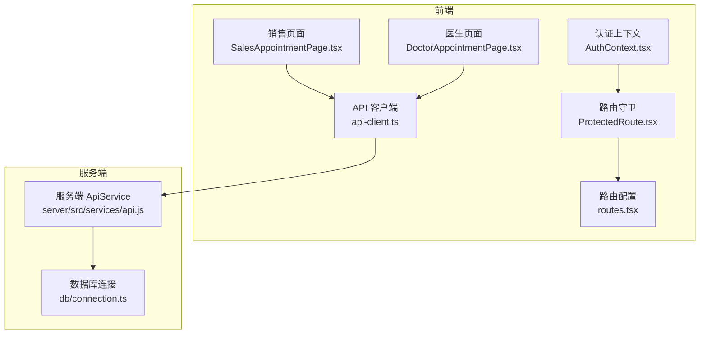
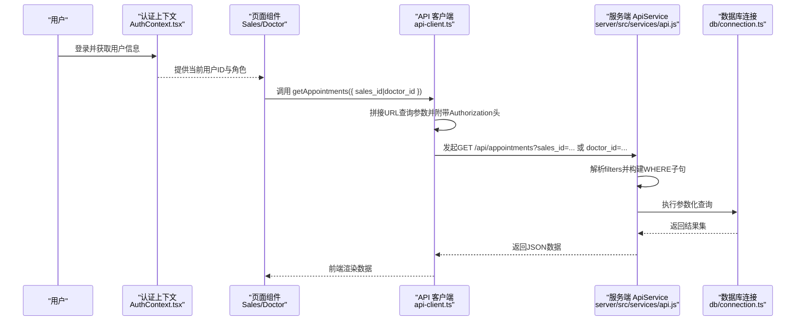
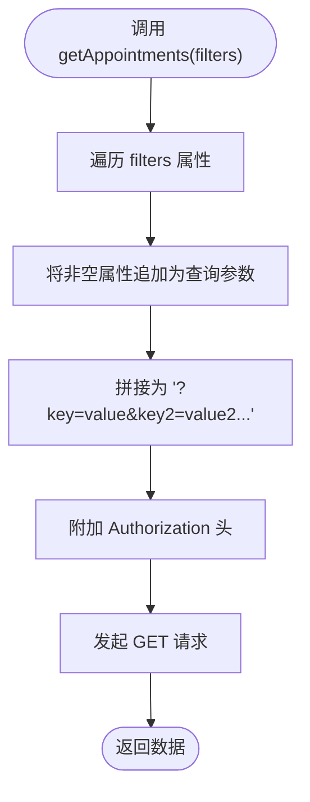
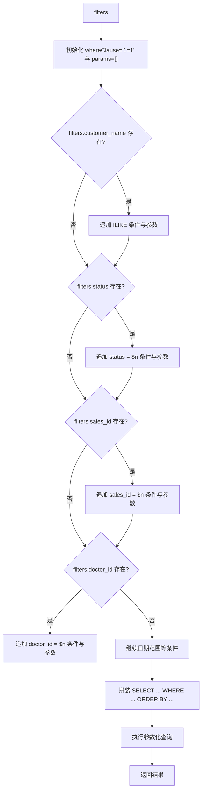
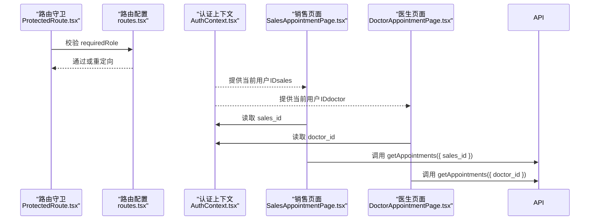
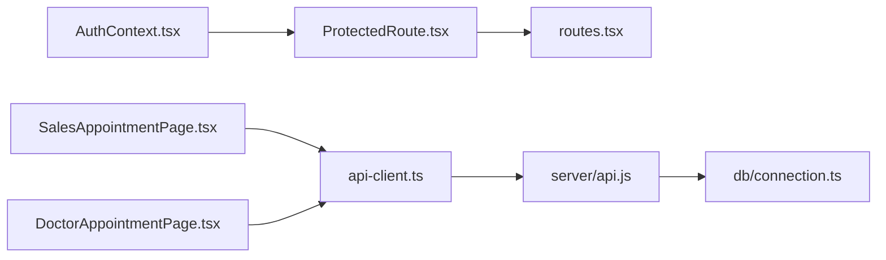

# 销售/医生筛选

<cite>
**本文引用的文件**
- [src/services/api.ts](file://src/services/api.ts)
- [server/src/services/api.js](file://server/src/services/api.js)
- [src/services/api-client.ts](file://src/services/api-client.ts)
- [src/db/connection.ts](file://src/db/connection.ts)
- [src/contexts/AuthContext.tsx](file://src/contexts/AuthContext.tsx)
- [src/routes.tsx](file://src/routes.tsx)
- [src/components/auth/ProtectedRoute.tsx](file://src/components/auth/ProtectedRoute.tsx)
- [src/pages/sales/AppointmentPage.tsx](file://src/pages/sales/AppointmentPage.tsx)
- [src/pages/doctor/AppointmentPage.tsx](file://src/pages/doctor/AppointmentPage.tsx)
- [supabase/migrations/00001_create_bio_appointment_schema.sql](file://supabase/migrations/00001_create_bio_appointment_schema.sql)
</cite>

## 目录
1. [简介](#简介)
2. [项目结构](#项目结构)
3. [核心组件](#核心组件)
4. [架构总览](#架构总览)
5. [详细组件分析](#详细组件分析)
6. [依赖关系分析](#依赖关系分析)
7. [性能考量](#性能考量)
8. [故障排查指南](#故障排查指南)
9. [结论](#结论)

## 简介
本文件聚焦“销售/医生筛选”能力，围绕通过 sales_id 和 doctor_id 参数对预约记录进行基于用户ID的筛选，解释该功能如何支撑多角色工作流（销售查看自己发起的预约；医生查看需要自己确认的预约），并说明从前端获取当前用户ID到后端将参数转换为 SQL 等值匹配条件的完整链路。同时，文档提供从角色权限到数据隔离的重要性的讨论与最佳实践建议。

## 项目结构
- 前端层：React 页面组件负责展示与交互，通过 API 客户端发起请求；认证上下文提供用户信息；路由守卫保障角色访问控制。
- 服务层：API 客户端将查询参数拼接为 URL 查询字符串，统一携带 Authorization 头。
- 后端层：服务端 ApiService 将查询参数动态拼装为 WHERE 条件，使用占位符参数化查询，最终执行 SQL 并返回结果。
- 数据层：PostgreSQL 连接池与查询封装，提供事务、健康检查与参数化查询能力。

图表来源
- [src/pages/sales/AppointmentPage.tsx](file://src/pages/sales/AppointmentPage.tsx#L1-L451)
- [src/pages/doctor/AppointmentPage.tsx](file://src/pages/doctor/AppointmentPage.tsx#L1-L395)
- [src/contexts/AuthContext.tsx](file://src/contexts/AuthContext.tsx#L1-L308)
- [src/components/auth/ProtectedRoute.tsx](file://src/components/auth/ProtectedRoute.tsx#L1-L49)
- [src/routes.tsx](file://src/routes.tsx#L1-L135)
- [src/services/api-client.ts](file://src/services/api-client.ts#L1-L381)
- [server/src/services/api.js](file://server/src/services/api.js#L99-L146)
- [src/db/connection.ts](file://src/db/connection.ts#L80-L115)

章节来源
- [src/services/api.ts](file://src/services/api.ts#L151-L215)
- [server/src/services/api.js](file://server/src/services/api.js#L99-L146)
- [src/services/api-client.ts](file://src/services/api-client.ts#L179-L210)
- [src/db/connection.ts](file://src/db/connection.ts#L80-L115)
- [src/contexts/AuthContext.tsx](file://src/contexts/AuthContext.tsx#L1-L308)
- [src/routes.tsx](file://src/routes.tsx#L62-L102)
- [src/components/auth/ProtectedRoute.tsx](file://src/components/auth/ProtectedRoute.tsx#L1-L49)
- [src/pages/sales/AppointmentPage.tsx](file://src/pages/sales/AppointmentPage.tsx#L1-L451)
- [src/pages/doctor/AppointmentPage.tsx](file://src/pages/doctor/AppointmentPage.tsx#L1-L395)
- [supabase/migrations/00001_create_bio_appointment_schema.sql](file://supabase/migrations/00001_create_bio_appointment_schema.sql#L137-L158)

## 核心组件
- 前端 API 客户端：将 sales_id、doctor_id 等过滤参数转为 URL 查询字符串，并统一携带 Authorization 头。
- 服务端 ApiService：接收查询参数，动态构建 WHERE 子句，使用参数化查询执行 SQL。
- 数据库连接：提供 query 封装，确保 SQL 注入防护与性能可观测性。
- 认证上下文与路由守卫：保障不同角色只能访问对应页面，避免越权访问。
- 页面组件：销售页面用于发起预约；医生页面用于查看与处理需要自己确认的预约。

章节来源
- [src/services/api-client.ts](file://src/services/api-client.ts#L179-L210)
- [server/src/services/api.js](file://server/src/services/api.js#L99-L146)
- [src/db/connection.ts](file://src/db/connection.ts#L80-L115)
- [src/contexts/AuthContext.tsx](file://src/contexts/AuthContext.tsx#L1-L308)
- [src/components/auth/ProtectedRoute.tsx](file://src/components/auth/ProtectedRoute.tsx#L1-L49)
- [src/pages/sales/AppointmentPage.tsx](file://src/pages/sales/AppointmentPage.tsx#L1-L451)
- [src/pages/doctor/AppointmentPage.tsx](file://src/pages/doctor/AppointmentPage.tsx#L1-L395)

## 架构总览
销售/医生筛选的端到端流程如下：
- 前端获取当前用户ID（来自认证上下文），将 sales_id 或 doctor_id 作为查询参数传给 API 客户端。
- API 客户端将参数拼接为 URL 查询字符串并发起 GET 请求。
- 服务端 ApiService 解析查询参数，动态构建 WHERE 条件，使用参数化查询执行 SQL。
- 返回结果集，前端页面渲染对应数据。

图表来源
- [src/contexts/AuthContext.tsx](file://src/contexts/AuthContext.tsx#L1-L308)
- [src/pages/sales/AppointmentPage.tsx](file://src/pages/sales/AppointmentPage.tsx#L1-L451)
- [src/pages/doctor/AppointmentPage.tsx](file://src/pages/doctor/AppointmentPage.tsx#L1-L395)
- [src/services/api-client.ts](file://src/services/api-client.ts#L179-L210)
- [server/src/services/api.js](file://server/src/services/api.js#L99-L146)
- [src/db/connection.ts](file://src/db/connection.ts#L80-L115)

## 详细组件分析

### 组件A：前端 API 客户端与查询参数传递
- API 客户端提供 getAppointments 方法，将 filters 对象转换为 URLSearchParams，自动附加 Authorization 头。
- 该方法支持 sales_id、doctor_id 等参数，便于后续在服务端进行等值匹配。

图表来源
- [src/services/api-client.ts](file://src/services/api-client.ts#L179-L210)

章节来源
- [src/services/api-client.ts](file://src/services/api-client.ts#L179-L210)

### 组件B：服务端 ApiService 的动态 WHERE 构建
- 服务端 ApiService.getAppointments 接收 filters，逐项判断是否存在，存在则追加 AND 条件与参数。
- sales_id 与 doctor_id 分别对应 appointments 表的 sales_id 与 doctor_id 字段，使用等值匹配。
- 最终以参数化查询执行 SQL，保证安全与性能。

图表来源
- [server/src/services/api.js](file://server/src/services/api.js#L99-L146)
- [src/db/connection.ts](file://src/db/connection.ts#L80-L115)

章节来源
- [server/src/services/api.js](file://server/src/services/api.js#L99-L146)
- [src/db/connection.ts](file://src/db/connection.ts#L80-L115)

### 组件C：前端页面如何获取当前用户ID并参与筛选
- 认证上下文提供当前用户信息（含 id），页面组件在加载数据时读取该 id 并作为 sales_id 或 doctor_id 传入查询。
- 路由守卫与角色配置确保只有具备相应角色的用户才能访问对应页面。

图表来源
- [src/components/auth/ProtectedRoute.tsx](file://src/components/auth/ProtectedRoute.tsx#L1-L49)
- [src/routes.tsx](file://src/routes.tsx#L62-L102)
- [src/contexts/AuthContext.tsx](file://src/contexts/AuthContext.tsx#L1-L308)
- [src/pages/sales/AppointmentPage.tsx](file://src/pages/sales/AppointmentPage.tsx#L1-L451)
- [src/pages/doctor/AppointmentPage.tsx](file://src/pages/doctor/AppointmentPage.tsx#L1-L395)

章节来源
- [src/components/auth/ProtectedRoute.tsx](file://src/components/auth/ProtectedRoute.tsx#L1-L49)
- [src/routes.tsx](file://src/routes.tsx#L62-L102)
- [src/contexts/AuthContext.tsx](file://src/contexts/AuthContext.tsx#L1-L308)
- [src/pages/sales/AppointmentPage.tsx](file://src/pages/sales/AppointmentPage.tsx#L1-L451)
- [src/pages/doctor/AppointmentPage.tsx](file://src/pages/doctor/AppointmentPage.tsx#L1-L395)

### 组件D：数据库表结构与字段映射
- appointments 表包含 sales_id 与 doctor_id 字段，分别指向 profiles 表（用户档案）。
- 服务端 ApiService 在 WHERE 中直接使用这两个字段进行等值匹配，从而实现“按销售/医生维度筛选”。

章节来源
- [supabase/migrations/00001_create_bio_appointment_schema.sql](file://supabase/migrations/00001_create_bio_appointment_schema.sql#L137-L158)
- [server/src/services/api.js](file://server/src/services/api.js#L99-L146)

## 依赖关系分析
- 前端 API 客户端依赖认证上下文提供的令牌，统一在请求头中携带 Authorization。
- 服务端 ApiService 依赖数据库连接封装，确保所有查询均通过参数化执行。
- 页面组件依赖路由守卫与认证上下文，保障角色可见性与数据隔离。

图表来源
- [src/contexts/AuthContext.tsx](file://src/contexts/AuthContext.tsx#L1-L308)
- [src/components/auth/ProtectedRoute.tsx](file://src/components/auth/ProtectedRoute.tsx#L1-L49)
- [src/routes.tsx](file://src/routes.tsx#L62-L102)
- [src/pages/sales/AppointmentPage.tsx](file://src/pages/sales/AppointmentPage.tsx#L1-L451)
- [src/pages/doctor/AppointmentPage.tsx](file://src/pages/doctor/AppointmentPage.tsx#L1-L395)
- [src/services/api-client.ts](file://src/services/api-client.ts#L179-L210)
- [server/src/services/api.js](file://server/src/services/api.js#L99-L146)
- [src/db/connection.ts](file://src/db/connection.ts#L80-L115)

章节来源
- [src/contexts/AuthContext.tsx](file://src/contexts/AuthContext.tsx#L1-L308)
- [src/components/auth/ProtectedRoute.tsx](file://src/components/auth/ProtectedRoute.tsx#L1-L49)
- [src/routes.tsx](file://src/routes.tsx#L62-L102)
- [src/pages/sales/AppointmentPage.tsx](file://src/pages/sales/AppointmentPage.tsx#L1-L451)
- [src/pages/doctor/AppointmentPage.tsx](file://src/pages/doctor/AppointmentPage.tsx#L1-L395)
- [src/services/api-client.ts](file://src/services/api-client.ts#L179-L210)
- [server/src/services/api.js](file://server/src/services/api.js#L99-L146)
- [src/db/connection.ts](file://src/db/connection.ts#L80-L115)

## 性能考量
- 参数化查询：服务端与数据库连接层均采用参数化查询，避免 SQL 注入并提升缓存命中率。
- 动态 WHERE 构建：仅在参数存在时追加条件，减少不必要的过滤开销。
- 索引建议：根据实际查询模式，可在 sales_id、doctor_id、requested_date 等字段建立复合索引以优化筛选性能。
- 分页与排序：当前查询按 requested_date、created_at 降序排列，建议在高频筛选场景引入分页参数以降低单次响应体积。

## 故障排查指南
- 无法获取当前用户ID
  - 检查认证上下文是否正确存储与刷新令牌；确认路由守卫与 ProtectedRoute 是否生效。
- 401 未授权
  - 确认 API 客户端是否正确附加 Authorization 头；检查本地存储中的令牌是否存在。
- 查询无结果
  - 确认 sales_id/doctor_id 是否与数据库中用户 ID 一致；检查服务端 ApiService 是否正确解析 filters。
- SQL 注入风险
  - 确保所有外部输入均通过参数化查询执行；避免手动拼接 SQL 字符串。

章节来源
- [src/contexts/AuthContext.tsx](file://src/contexts/AuthContext.tsx#L1-L308)
- [src/components/auth/ProtectedRoute.tsx](file://src/components/auth/ProtectedRoute.tsx#L1-L49)
- [src/services/api-client.ts](file://src/services/api-client.ts#L179-L210)
- [server/src/services/api.js](file://server/src/services/api.js#L99-L146)
- [src/db/connection.ts](file://src/db/connection.ts#L80-L115)

## 结论
销售/医生筛选通过“前端参数传递 + 服务端动态 WHERE 构建 + 参数化查询”的组合，实现了基于用户ID的精准数据隔离与权限控制。该设计既满足了销售查看自身发起预约、医生查看需确认预约的多角色工作流，又通过严格的参数化与路由守卫保障了系统安全性与稳定性。建议在生产环境中结合索引与分页策略进一步优化查询性能，并持续完善权限与审计机制。