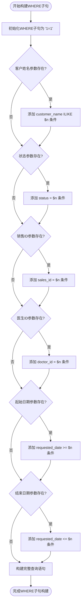
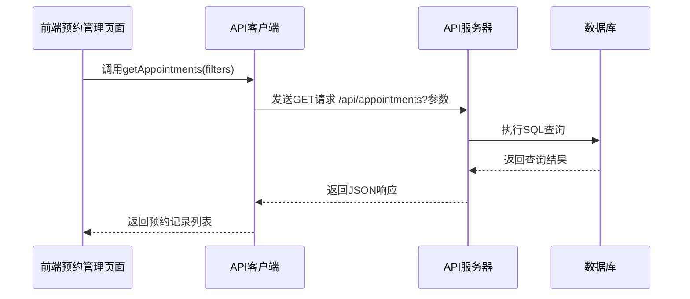

# 预约记录查询

<cite>
**本文档引用的文件**   
- [api.ts](file://src/services/api.ts#L151-L215)
- [api-server.ts](file://server/api-server.ts#L219-L231)
- [api-client.ts](file://src/services/api-client.ts#L179-L189)
- [database.ts](file://src/db/database.ts)
- [02-create-tables.sql](file://database/init/02-create-tables.sql#L54-L77)
- [AppointmentPage.tsx](file://src/pages/sales/AppointmentPage.tsx)
</cite>

## 目录
1. [接口概述](#接口概述)
2. [请求方法与路径](#请求方法与路径)
3. [查询参数详解](#查询参数详解)
4. [响应数据结构](#响应数据结构)
5. [状态码说明](#状态码说明)
6. [复杂过滤逻辑解析](#复杂过滤逻辑解析)
7. [动态WHERE子句构建](#动态where子句构建)
8. [安全措施](#安全措施)
9. [前端使用示例](#前端使用示例)
10. [后端处理流程](#后端处理流程)

## 接口概述

预约记录查询接口是Bio-Appointment系统的核心功能之一，用于获取系统中的预约记录。该接口支持多种复杂的查询条件，包括客户姓名模糊搜索、状态精确匹配、销售/医生ID关联查询以及日期范围筛选等。接口通过HTTP GET方法实现，返回符合查询条件的预约记录列表。

**Section sources**
- [api.ts](file://src/services/api.ts#L151-L215)
- [api-server.ts](file://server/api-server.ts#L219-L231)

## 请求方法与路径

预约记录查询接口使用HTTP GET方法，通过以下URL路径访问：

```
GET /api/appointments
```

该接口位于API服务器的根路径下，通过`/api/appointments`端点提供预约记录查询服务。

**Section sources**
- [api-server.ts](file://server/api-server.ts#L219-L231)

## 查询参数详解

预约记录查询接口支持多种查询参数，允许用户根据不同的条件筛选预约记录。以下是支持的查询参数及其说明：

| 参数名称 | 类型 | 必填 | 说明 |
|---------|------|------|------|
| customer_name | string | 否 | 客户姓名，支持模糊搜索 |
| status | string | 否 | 预约状态，精确匹配 |
| sales_id | string | 否 | 销售人员ID，关联查询 |
| doctor_id | string | 否 | 医生ID，关联查询 |
| requested_date_from | string | 否 | 预约日期起始范围 |
| requested_date_to | string | 否 | 预约日期结束范围 |

**Section sources**
- [api.ts](file://src/services/api.ts#L152-L159)
- [api-client.ts](file://src/services/api-client.ts#L180-L187)

## 响应数据结构

预约记录查询接口返回一个包含预约记录的数组，每个预约记录包含以下字段：

```json
[
  {
    "id": "string",
    "customer_name": "string",
    "customer_phone": "string",
    "service_id": "string",
    "requested_date": "string",
    "requested_time_start": "string",
    "requested_time_end": "string",
    "total_people": "number",
    "estimated_duration": "number",
    "is_urgent": "boolean",
    "status": "string",
    "notes": "string",
    "created_at": "string",
    "updated_at": "string"
  }
]
```

**Section sources**
- [02-create-tables.sql](file://database/init/02-create-tables.sql#L54-L77)

## 状态码说明

预约记录查询接口返回以下HTTP状态码：

| 状态码 | 说明 |
|-------|------|
| 200 | 请求成功，返回预约记录列表 |
| 400 | 请求参数错误 |
| 401 | 未授权访问 |
| 500 | 服务器内部错误 |

**Section sources**
- [api-server.ts](file://server/api-server.ts#L226-L230)

## 复杂过滤逻辑解析

预约记录查询接口实现了复杂的过滤逻辑，支持多种查询条件的组合。以下是各查询条件的实现机制：

### 客户姓名模糊搜索

客户姓名查询使用PostgreSQL的ILIKE操作符实现不区分大小写的模糊搜索。在查询时，系统会自动在搜索关键词前后添加通配符%，实现模糊匹配。

### 状态精确匹配

状态查询使用等值匹配操作符，确保返回的预约记录状态与查询参数完全一致。系统支持多种预约状态，如"pending"（待处理）、"confirmed"（已确认）、"completed"（已完成）等。

### 销售/医生ID关联查询

销售和医生ID查询通过外键关联实现，系统会根据提供的ID查询对应的预约记录。这种关联查询确保了数据的一致性和完整性。

### 日期范围筛选

日期范围查询支持起始日期和结束日期两个参数，系统会返回在指定日期范围内的所有预约记录。如果只提供起始日期，则返回该日期及之后的所有记录；如果只提供结束日期，则返回该日期及之前的所有记录。

**Section sources**
- [api.ts](file://src/services/api.ts#L165-L205)

## 动态WHERE子句构建

预约记录查询接口通过动态构建WHERE子句来实现灵活的查询功能。系统根据提供的查询参数，逐步构建WHERE子句，确保只包含有效的查询条件。



**Diagram sources**
- [api.ts](file://src/services/api.ts#L160-L211)

## 安全措施

预约记录查询接口采用了多种安全措施，确保系统的安全性和数据的完整性。

### 参数化查询

系统使用参数化查询（$1, $2, ...）来防止SQL注入攻击。所有查询参数都通过参数化方式传递，避免了直接拼接SQL语句可能带来的安全风险。

### 输入验证

系统对所有查询参数进行验证，确保参数类型和格式正确。对于无效的参数，系统会返回相应的错误信息，防止恶意请求。

### 权限控制

接口通过认证中间件进行权限控制，只有经过身份验证的用户才能访问预约记录查询接口。系统会验证请求头中的Bearer Token，确保用户身份合法。

**Section sources**
- [api.ts](file://src/services/api.ts#L161-L162)
- [api-server.ts](file://server/api-server.ts#L119-L148)

## 前端使用示例

前端预约管理页面通过API客户端调用预约记录查询接口，以下是具体的使用示例：



**Diagram sources**
- [AppointmentPage.tsx](file://src/pages/sales/AppointmentPage.tsx)
- [api-client.ts](file://src/services/api-client.ts#L179-L189)

## 后端处理流程

预约记录查询接口的后端处理流程如下：

1. 接收HTTP GET请求
2. 解析查询参数
3. 构建动态WHERE子句
4. 执行参数化SQL查询
5. 返回查询结果

系统通过`ApiService.getAppointments()`方法处理查询请求，该方法根据提供的过滤条件动态构建SQL查询语句，并使用参数化查询执行数据库操作。

**Section sources**
- [api.ts](file://src/services/api.ts#L151-L215)
- [api-server.ts](file://server/api-server.ts#L219-L231)