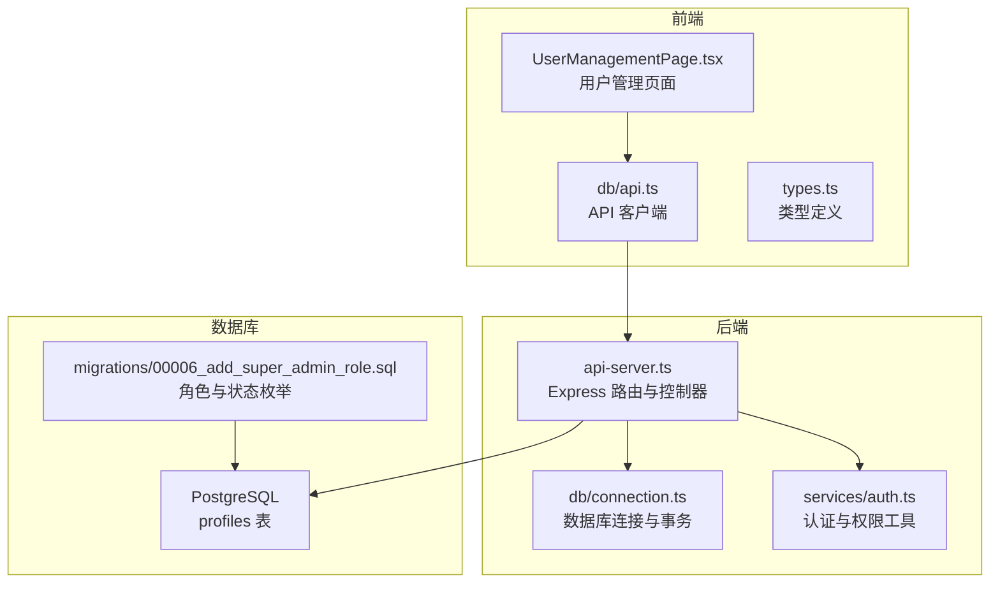
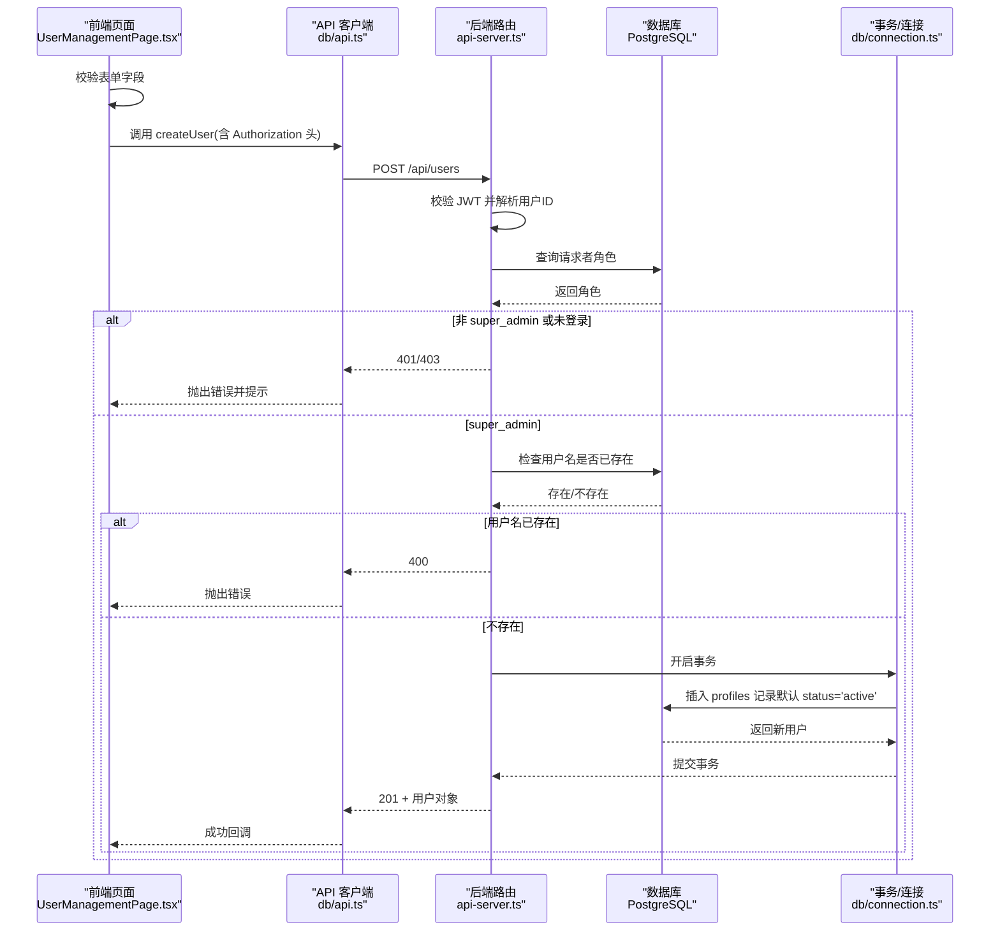
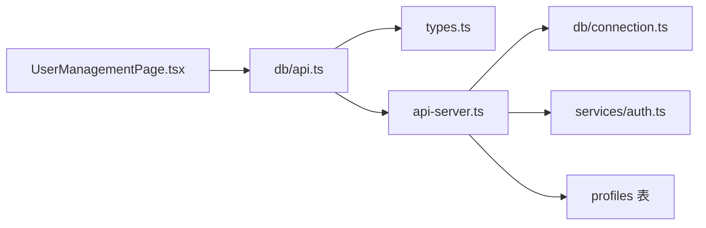
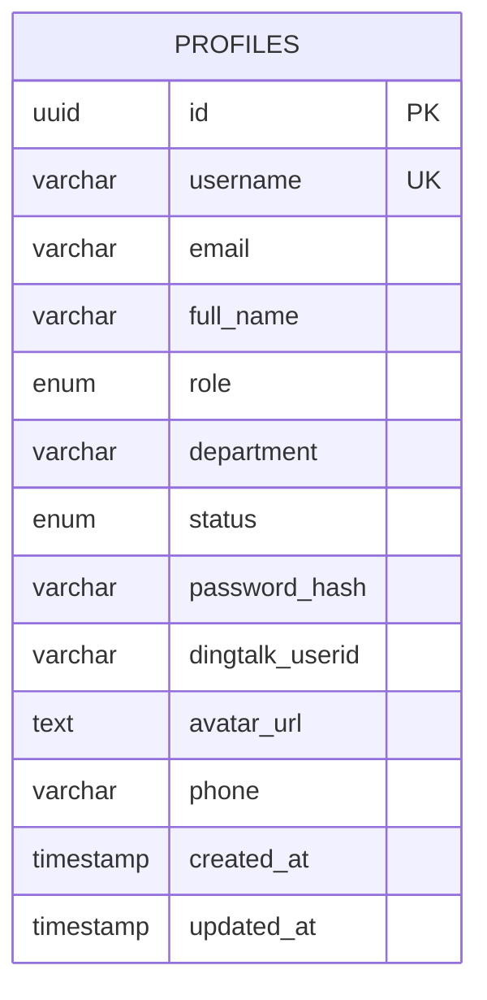
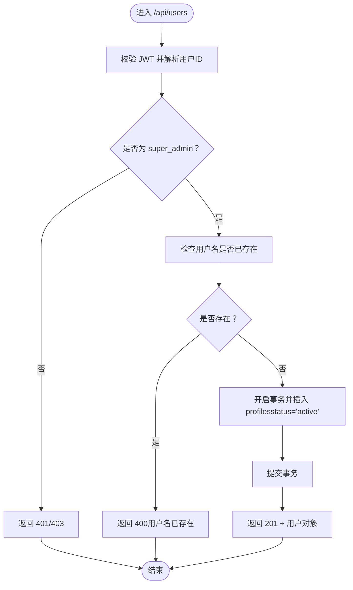

# 创建用户接口

<cite>
**本文引用的文件**
- [server/api-server.ts](file://server/api-server.ts)
- [src/db/api.ts](file://src/db/api.ts)
- [src/pages/admin/UserManagementPage.tsx](file://src/pages/admin/UserManagementPage.tsx)
- [src/types/types.ts](file://src/types/types.ts)
- [src/services/auth.ts](file://src/services/auth.ts)
- [src/db/connection.ts](file://src/db/connection.ts)
- [database/init/02-create-tables.sql](file://database/init/02-create-tables.sql)
- [supabase/migrations/00006_add_super_admin_role.sql](file://supabase/migrations/00006_add_super_admin_role.sql)
</cite>

## 目录
1. [简介](#简介)
2. [项目结构](#项目结构)
3. [核心组件](#核心组件)
4. [架构总览](#架构总览)
5. [详细组件分析](#详细组件分析)
6. [依赖关系分析](#依赖关系分析)
7. [性能考量](#性能考量)
8. [故障排除指南](#故障排除指南)
9. [结论](#结论)
10. [附录](#附录)

## 简介
本文件面向前端与后端开发者，系统化梳理“创建用户”接口的设计与实现，重点覆盖：
- HTTP 方法与路径：POST /api/users
- 请求参数与请求体结构：username、password、full_name、role、department
- 响应格式与状态码：201（成功）、400（用户名已存在）、401（未授权）、403（权限不足）、500（内部错误）
- 基于角色的访问控制（RBAC）：仅允许 super_admin 创建用户
- 安全策略：用户名唯一性校验；生产环境建议对密码进行哈希处理
- 默认状态：新用户默认状态为 active
- 数据库事务与错误处理规范
- 前端调用示例：Authorization 头携带 JWT 令牌

## 项目结构
围绕“创建用户”的关键文件与职责如下：
- 后端 API 服务器：负责路由、鉴权、业务校验与数据库交互
- 前端页面与 API 客户端：负责表单校验、发起请求与错误提示
- 类型定义：统一前后端数据契约
- 数据库与迁移：定义 profiles 表结构、枚举类型与索引

图表来源
- [server/api-server.ts](file://server/api-server.ts#L1056-L1117)
- [src/db/api.ts](file://src/db/api.ts#L273-L309)
- [src/pages/admin/UserManagementPage.tsx](file://src/pages/admin/UserManagementPage.tsx#L116-L135)
- [src/types/types.ts](file://src/types/types.ts#L75-L94)
- [src/services/auth.ts](file://src/services/auth.ts#L302-L338)
- [src/db/connection.ts](file://src/db/connection.ts#L96-L114)
- [database/init/02-create-tables.sql](file://database/init/02-create-tables.sql#L4-L21)
- [supabase/migrations/00006_add_super_admin_role.sql](file://supabase/migrations/00006_add_super_admin_role.sql#L9-L17)

章节来源
- [server/api-server.ts](file://server/api-server.ts#L1056-L1117)
- [src/db/api.ts](file://src/db/api.ts#L273-L309)
- [src/pages/admin/UserManagementPage.tsx](file://src/pages/admin/UserManagementPage.tsx#L116-L135)
- [src/types/types.ts](file://src/types/types.ts#L75-L94)
- [src/services/auth.ts](file://src/services/auth.ts#L302-L338)
- [src/db/connection.ts](file://src/db/connection.ts#L96-L114)
- [database/init/02-create-tables.sql](file://database/init/02-create-tables.sql#L4-L21)
- [supabase/migrations/00006_add_super_admin_role.sql](file://supabase/migrations/00006_add_super_admin_role.sql#L9-L17)

## 核心组件
- 后端路由与控制器：实现 POST /api/users，进行 RBAC 校验、用户名唯一性检查与用户创建
- 前端 API 客户端：封装 fetch 调用，统一携带 Authorization 头
- 页面组件：表单校验与提交，触发创建用户流程
- 类型定义：约束请求体字段与响应结构
- 数据库层：profiles 表结构、索引与事务支持
- 权限模型：roles 枚举与权限矩阵

章节来源
- [server/api-server.ts](file://server/api-server.ts#L1056-L1117)
- [src/db/api.ts](file://src/db/api.ts#L273-L309)
- [src/pages/admin/UserManagementPage.tsx](file://src/pages/admin/UserManagementPage.tsx#L116-L135)
- [src/types/types.ts](file://src/types/types.ts#L75-L94)
- [database/init/02-create-tables.sql](file://database/init/02-create-tables.sql#L4-L21)
- [src/services/auth.ts](file://src/services/auth.ts#L302-L338)

## 架构总览
以下序列图展示了从前端到后端再到数据库的完整调用链路，以及 RBAC 与安全策略的执行点。

图表来源
- [src/pages/admin/UserManagementPage.tsx](file://src/pages/admin/UserManagementPage.tsx#L116-L135)
- [src/db/api.ts](file://src/db/api.ts#L273-L309)
- [server/api-server.ts](file://server/api-server.ts#L1056-L1117)
- [src/db/connection.ts](file://src/db/connection.ts#L96-L114)
- [database/init/02-create-tables.sql](file://database/init/02-create-tables.sql#L4-L21)

## 详细组件分析

### 接口定义与请求参数
- 方法与路径：POST /api/users
- 请求头：
  - Content-Type: application/json
  - Authorization: Bearer <JWT>
- 请求体字段：
  - username: string（必填）
  - password: string（必填）
  - full_name: string（必填）
  - role: UserRole（必填，super_admin/sales/head_nurse/nurse/doctor）
  - department: string（可选）

章节来源
- [src/types/types.ts](file://src/types/types.ts#L75-L94)
- [src/db/api.ts](file://src/db/api.ts#L273-L309)
- [src/pages/admin/UserManagementPage.tsx](file://src/pages/admin/UserManagementPage.tsx#L116-L135)

### 响应格式与状态码
- 201 Created：成功创建用户，返回完整的用户对象（不包含敏感字段）
- 400 Bad Request：用户名已存在
- 401 Unauthorized：未提供有效 JWT 或无法解析用户
- 403 Forbidden：请求者不是 super_admin
- 500 Internal Server Error：服务器异常

章节来源
- [server/api-server.ts](file://server/api-server.ts#L1056-L1117)

### 基于角色的访问控制（RBAC）
- 角色枚举：super_admin、sales、head_nurse、nurse、doctor
- 权限矩阵（AuthService.getUserPermissions）：
  - super_admin：拥有 user:* 与系统管理权限
  - 其他角色：权限受限
- 在创建用户接口中，后端会读取请求者的角色，仅当为 super_admin 时才允许创建

章节来源
- [src/services/auth.ts](file://src/services/auth.ts#L302-L338)
- [supabase/migrations/00006_add_super_admin_role.sql](file://supabase/migrations/00006_add_super_admin_role.sql#L9-L17)
- [server/api-server.ts](file://server/api-server.ts#L1056-L1117)

### 安全策略与默认状态
- 用户名唯一性：数据库层 username 唯一约束；后端在插入前再次校验
- 默认状态：创建用户时默认 status='active'
- 密码处理：当前实现直接存储明文 password_hash 字段（演示用途）。生产环境应使用 AuthService.hashPassword 对密码进行哈希后再入库

章节来源
- [database/init/02-create-tables.sql](file://database/init/02-create-tables.sql#L4-L21)
- [server/api-server.ts](file://server/api-server.ts#L1056-L1117)
- [src/services/auth.ts](file://src/services/auth.ts#L30-L64)

### 数据库事务与错误处理
- 事务：后端使用 transaction 包装数据库操作，确保一致性
- 错误处理：
  - 参数校验失败：返回 400
  - 未登录或权限不足：返回 401/403
  - 服务器异常：返回 500
- 软删除：删除用户采用软删除（设置 status='disabled'），避免物理删除造成数据丢失

章节来源
- [src/db/connection.ts](file://src/db/connection.ts#L96-L114)
- [server/api-server.ts](file://server/api-server.ts#L1119-L1174)

### 前端调用示例
- 前端页面通过 db/api.ts 的 createUser 发起请求，自动在请求头中附加 Authorization: Bearer <token>
- 表单校验在前端完成（长度、格式、角色枚举），再调用 API 客户端

章节来源
- [src/pages/admin/UserManagementPage.tsx](file://src/pages/admin/UserManagementPage.tsx#L116-L135)
- [src/db/api.ts](file://src/db/api.ts#L273-L309)

## 依赖关系分析
- UserManagementPage.tsx 依赖 db/api.ts 的 createUser
- db/api.ts 依赖 types.ts 的 CreateUserInput
- api-server.ts 依赖 db/connection.ts 的 query 与 transaction
- AuthService 提供权限判断与密码哈希能力
- 数据库层依赖 profiles 表结构与枚举类型

图表来源
- [src/pages/admin/UserManagementPage.tsx](file://src/pages/admin/UserManagementPage.tsx#L116-L135)
- [src/db/api.ts](file://src/db/api.ts#L273-L309)
- [src/types/types.ts](file://src/types/types.ts#L75-L94)
- [server/api-server.ts](file://server/api-server.ts#L1056-L1117)
- [src/db/connection.ts](file://src/db/connection.ts#L96-L114)
- [src/services/auth.ts](file://src/services/auth.ts#L302-L338)
- [database/init/02-create-tables.sql](file://database/init/02-create-tables.sql#L4-L21)

## 性能考量
- 数据库索引：profiles 表对 username、email、role、status 建有索引，有利于快速查找与唯一性检查
- 事务边界：创建用户为单条插入，事务开销小；若后续扩展为多表联动，需评估事务范围与锁粒度
- 前端重试：建议在前端对 400/401/403/500 场景做幂等与友好提示，避免频繁重试导致数据库压力

章节来源
- [database/init/02-create-tables.sql](file://database/init/02-create-tables.sql#L184-L231)

## 故障排除指南
- 401 未授权
  - 检查 Authorization 头是否正确携带 Bearer 令牌
  - 确认令牌未过期且签名有效
- 403 权限不足
  - 确认当前登录用户角色为 super_admin
- 400 用户名已存在
  - 前端应提示用户更换用户名
- 500 内部错误
  - 查看后端日志中的错误堆栈，定位具体 SQL 或连接问题

章节来源
- [server/api-server.ts](file://server/api-server.ts#L1056-L1117)

## 结论
- 创建用户接口严格遵循 RBAC 设计，仅允许 super_admin 操作
- 前后端通过类型定义与表单校验形成一致的数据契约
- 生产环境需完善密码哈希与更严格的事务边界设计
- 建议在前端增加幂等与重试策略，提升用户体验与系统稳定性

## 附录

### API 定义一览
- 方法：POST
- 路径：/api/users
- 请求头：
  - Content-Type: application/json
  - Authorization: Bearer <JWT>
- 请求体：
  - username: string
  - password: string
  - full_name: string
  - role: super_admin|sales|head_nurse|nurse|doctor
  - department: string（可选）
- 响应：
  - 201：返回用户对象（不包含敏感字段）
  - 400：用户名已存在
  - 401：未授权
  - 403：权限不足
  - 500：服务器错误

章节来源
- [src/types/types.ts](file://src/types/types.ts#L75-L94)
- [src/db/api.ts](file://src/db/api.ts#L273-L309)
- [server/api-server.ts](file://server/api-server.ts#L1056-L1117)

### 数据模型（profiles）

图表来源
- [database/init/02-create-tables.sql](file://database/init/02-create-tables.sql#L4-L21)

### 关键流程图（创建用户）

图表来源
- [server/api-server.ts](file://server/api-server.ts#L1056-L1117)
- [src/db/connection.ts](file://src/db/connection.ts#L96-L114)
- [database/init/02-create-tables.sql](file://database/init/02-create-tables.sql#L4-L21)