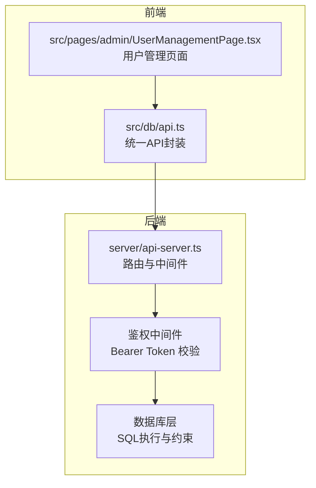
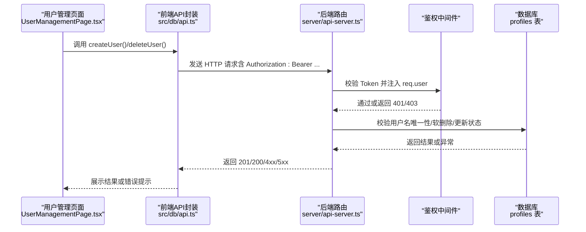
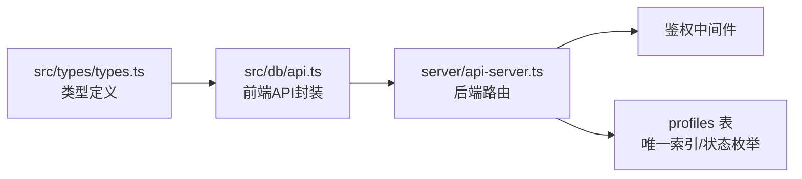

# 用户管理接口

<cite>
**本文引用的文件**
- [server/api-server.ts](file://server/api-server.ts)
- [src/db/api.ts](file://src/db/api.ts)
- [src/types/types.ts](file://src/types/types.ts)
- [supabase/migrations/00006_add_super_admin_role.sql](file://supabase/migrations/00006_add_super_admin_role.sql)
- [supabase/migrations/00007_update_profiles_structure_and_auth.sql](file://supabase/migrations/00007_update_profiles_structure_and_auth.sql)
- [supabase/migrations/00008_add_rls_policies_for_role_based_access.sql](file://supabase/migrations/00008_add_rls_policies_for_role_based_access.sql)
- [src/pages/admin/UserManagementPage.tsx](file://src/pages/admin/UserManagementPage.tsx)
</cite>

## 目录
1. [简介](#简介)
2. [项目结构](#项目结构)
3. [核心组件](#核心组件)
4. [架构总览](#架构总览)
5. [详细组件分析](#详细组件分析)
6. [依赖关系分析](#依赖关系分析)
7. [性能考量](#性能考量)
8. [故障排查指南](#故障排查指南)
9. [结论](#结论)

## 简介
本文件面向“Bio-Appointment”系统的超级管理员，提供用户全生命周期管理接口的权威说明。重点覆盖以下两个核心端点：
- 创建用户：/api/users（POST）
- 删除用户：/api/users/:id（DELETE）

同时，文档深入解析基于角色的访问控制（RBAC）机制、防自我删除安全策略、软删除实现（状态标记为“disabled”而非物理删除）、用户名唯一性约束检查，以及数据库事务与错误处理规范。文中所有技术细节均以仓库现有代码为依据，避免臆测。

## 项目结构
用户管理接口位于后端服务层，前端通过统一的数据库API封装发起请求；后端在路由层完成鉴权与业务校验，再调用数据库层执行SQL操作。

图表来源
- [server/api-server.ts](file://server/api-server.ts#L119-L148)
- [src/db/api.ts](file://src/db/api.ts#L273-L341)

章节来源
- [server/api-server.ts](file://server/api-server.ts#L119-L148)
- [src/db/api.ts](file://src/db/api.ts#L273-L341)

## 核心组件
- 路由与鉴权
  - /api/users（POST/PUT/DELETE）由后端路由处理，统一受鉴权中间件保护。
  - 鉴权中间件从请求头提取 Bearer Token，解码并注入当前用户信息到 req.user。
- RBAC 校验
  - 仅允许角色为 super_admin 的用户执行用户管理操作。
- 数据库约束与事务
  - profiles 表具备用户名唯一性约束；删除采用软删除（status='disabled'）。
  - 事务用于保证一致性（如需扩展时建议使用）。
- 前端封装
  - 统一的 createUser/deleteUser/updateUser 封装，自动携带 Authorization 头与 Bearer Token。

章节来源
- [server/api-server.ts](file://server/api-server.ts#L119-L148)
- [server/api-server.ts](file://server/api-server.ts#L1056-L1174)
- [src/db/api.ts](file://src/db/api.ts#L273-L341)
- [supabase/migrations/00007_update_profiles_structure_and_auth.sql](file://supabase/migrations/00007_update_profiles_structure_and_auth.sql#L74-L77)

## 架构总览
用户管理接口的端到端调用链如下：

图表来源
- [src/pages/admin/UserManagementPage.tsx](file://src/pages/admin/UserManagementPage.tsx#L116-L191)
- [src/db/api.ts](file://src/db/api.ts#L273-L341)
- [server/api-server.ts](file://server/api-server.ts#L119-L148)
- [server/api-server.ts](file://server/api-server.ts#L1056-L1174)

## 详细组件分析

### 创建用户接口（POST /api/users）
- 方法与路径
  - 方法：POST
  - 路径：/api/users
- 请求头
  - Content-Type: application/json
  - Authorization: Bearer <access_token>
- 请求体参数
  - username: string（必填，唯一）
  - password: string（必填，生产环境应哈希存储）
  - full_name: string（必填）
  - role: UserRole（必填，super_admin/sales/head_nurse/nurse/doctor）
  - department: string（可选）
- 成功响应
  - 状态码：201 Created
  - 响应体：完整的用户对象（不包含敏感字段）
- 错误响应
  - 400 Bad Request：用户名已存在
  - 401 Unauthorized：未提供有效 Token
  - 403 Forbidden：非 super_admin 角色
  - 500 Internal Server Error：服务器内部错误

实现要点
- 鉴权中间件确保请求来自已登录用户。
- 仅 super_admin 可创建用户。
- 校验 username 唯一性，若重复则返回 400。
- 插入 profiles 表，初始状态为 active。
- 返回新建用户对象。

章节来源
- [server/api-server.ts](file://server/api-server.ts#L1056-L1116)
- [src/types/types.ts](file://src/types/types.ts#L75-L81)
- [supabase/migrations/00007_update_profiles_structure_and_auth.sql](file://supabase/migrations/00007_update_profiles_structure_and_auth.sql#L74-L77)
- [src/db/api.ts](file://src/db/api.ts#L273-L309)

### 删除用户接口（DELETE /api/users/:id）
- 方法与路径
  - 方法：DELETE
  - 路径：/api/users/:id
- 请求头
  - Content-Type: application/json
  - Authorization: Bearer <access_token>
- 参数
  - 路径参数：id（被删除用户的 UUID）
- 成功响应
  - 状态码：200 OK
  - 响应体：被软删除后的用户对象（status='disabled'）
- 错误响应
  - 400 Bad Request：试图删除自己的账户
  - 401 Unauthorized：未提供有效 Token
  - 403 Forbidden：非 super_admin 角色
  - 404 Not Found：目标用户不存在
  - 500 Internal Server Error：服务器内部错误

实现要点
- 鉴权中间件确保请求来自已登录用户。
- 仅 super_admin 可删除用户。
- 防止自我删除：当 id 与当前用户 id 相同，直接返回 400。
- 执行软删除：将 profiles.status 更新为 'disabled'，并更新 updated_at。
- 若无匹配记录，返回 404。

章节来源
- [server/api-server.ts](file://server/api-server.ts#L1119-L1174)
- [src/db/api.ts](file://src/db/api.ts#L311-L341)

### 基于角色的访问控制（RBAC）
- 角色枚举
  - super_admin、sales、head_nurse、nurse、doctor
- 路由级 RBAC
  - 所有 /api/* 路由在进入业务逻辑前，先经过鉴权中间件校验 Token。
  - 在用户管理相关路由中，进一步校验 req.user.profile.role 是否为 super_admin。
- 数据库级 RLS（补充说明）
  - 项目迁移脚本中包含针对 appointments/schedules 的 RLS 策略，体现 RBAC 思想；用户管理涉及 profiles 表，其 RLS 策略不在本次目标范围内。

章节来源
- [server/api-server.ts](file://server/api-server.ts#L119-L148)
- [server/api-server.ts](file://server/api-server.ts#L1056-L1174)
- [src/types/types.ts](file://src/types/types.ts#L5-L6)
- [supabase/migrations/00008_add_rls_policies_for_role_based_access.sql](file://supabase/migrations/00008_add_rls_policies_for_role_based_access.sql#L1-L180)

### 软删除与用户名唯一性约束
- 软删除
  - 删除用户时，不物理删除记录，而是将 profiles.status 设为 'disabled'，并更新 updated_at。
- 用户名唯一性
  - profiles.username 字段建立唯一索引，插入前先查重，重复则返回 400。
- 约束来源
  - 角色与状态枚举：在迁移脚本中新增 user_role 枚举与 user_status 枚举。
  - 唯一索引：在迁移脚本中对 username 建立唯一索引。

章节来源
- [server/api-server.ts](file://server/api-server.ts#L1119-L1174)
- [supabase/migrations/00006_add_super_admin_role.sql](file://supabase/migrations/00006_add_super_admin_role.sql#L9-L17)
- [supabase/migrations/00007_update_profiles_structure_and_auth.sql](file://supabase/migrations/00007_update_profiles_structure_and_auth.sql#L74-L77)

### 数据库事务与错误处理规范
- 事务
  - 当前用户管理接口未显式使用事务。若未来扩展（例如创建用户同时写入多张表），建议使用事务以保证一致性。
- 错误处理
  - 统一的错误中间件捕获未处理异常并返回 500。
  - 各路由内对常见错误（401/403/400/404）进行明确返回。
  - 前端封装对非 2xx 响应抛出错误，便于 UI 层统一提示。

章节来源
- [server/api-server.ts](file://server/api-server.ts#L28-L35)
- [server/api-server.ts](file://server/api-server.ts#L1056-L1174)
- [src/db/api.ts](file://src/db/api.ts#L273-L341)

### 前端调用与界面交互
- 页面入口
  - 用户管理页面负责收集表单数据并调用前端 API 封装。
- 调用封装
  - createUser/deleteUser 会自动拼接 Authorization 头与 Bearer Token。
- 交互限制
  - 界面禁止对当前登录用户执行删除与编辑，避免误操作。

章节来源
- [src/pages/admin/UserManagementPage.tsx](file://src/pages/admin/UserManagementPage.tsx#L116-L191)
- [src/db/api.ts](file://src/db/api.ts#L273-L341)

## 依赖关系分析

图表来源
- [src/types/types.ts](file://src/types/types.ts#L5-L6)
- [src/db/api.ts](file://src/db/api.ts#L273-L341)
- [server/api-server.ts](file://server/api-server.ts#L119-L148)
- [supabase/migrations/00007_update_profiles_structure_and_auth.sql](file://supabase/migrations/00007_update_profiles_structure_and_auth.sql#L74-L77)

章节来源
- [src/types/types.ts](file://src/types/types.ts#L5-L6)
- [src/db/api.ts](file://src/db/api.ts#L273-L341)
- [server/api-server.ts](file://server/api-server.ts#L119-L148)
- [supabase/migrations/00007_update_profiles_structure_and_auth.sql](file://supabase/migrations/00007_update_profiles_structure_and_auth.sql#L74-L77)

## 性能考量
- 查询优化
  - profiles 表对 role/status 建有索引，有利于按角色与状态筛选。
- 写入优化
  - 创建用户时的唯一性检查为 O(log n) 级别的索引查找。
- 事务与锁
  - 当前未使用事务，若后续引入跨表写入，建议使用事务减少锁竞争与回滚成本。
- 缓存
  - 数据库层未见显式缓存策略，建议对热点查询（如按角色/状态分页）考虑应用层缓存。

章节来源
- [supabase/migrations/00007_update_profiles_structure_and_auth.sql](file://supabase/migrations/00007_update_profiles_structure_and_auth.sql#L79-L83)

## 故障排查指南
- 401 未授权
  - 检查 Authorization 头是否正确传递 Bearer Token。
  - 确认 Token 未过期且对应用户存在。
- 403 权限不足
  - 确认当前用户角色为 super_admin。
- 400 用户名已存在
  - 检查 profiles.username 是否已被占用。
- 400 自身删除
  - 界面已做禁用，若仍出现请检查前端传参 id 是否为当前用户 id。
- 404 用户不存在
  - 确认目标用户 id 是否正确。
- 500 服务器错误
  - 查看后端日志定位 SQL 异常或中间件错误。

章节来源
- [server/api-server.ts](file://server/api-server.ts#L1056-L1174)
- [src/db/api.ts](file://src/db/api.ts#L273-L341)

## 结论
本文档基于仓库现有代码，完整梳理了 Bio-Appointment 系统中超级管理员的用户全生命周期管理能力。通过严格的 RBAC、防自我删除、软删除与唯一性约束，系统在安全性与可维护性上具备良好基础。建议在未来扩展中引入事务与缓存策略，以进一步提升一致性与性能表现。