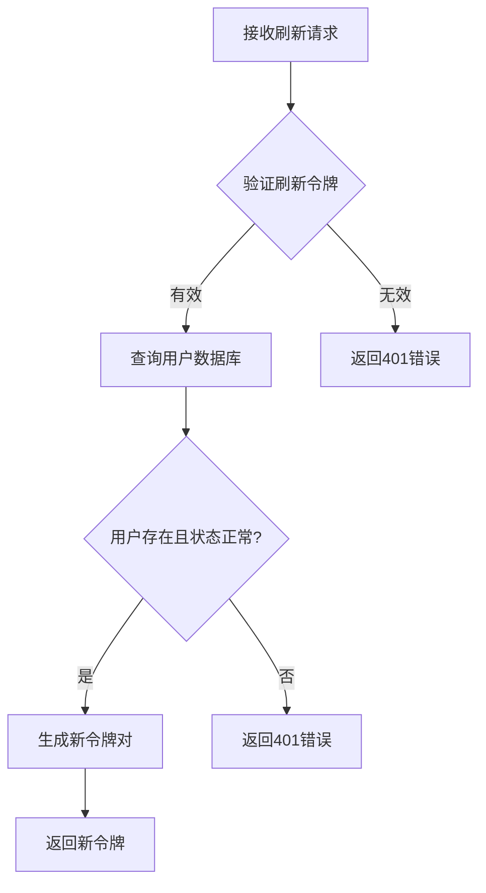
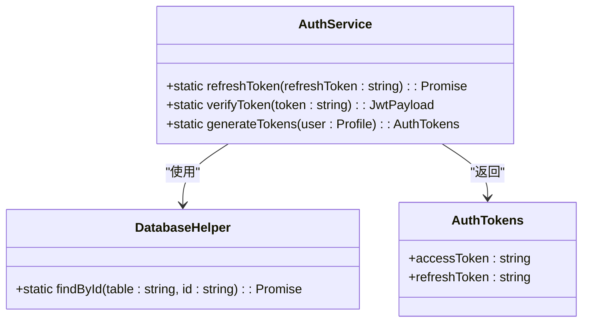
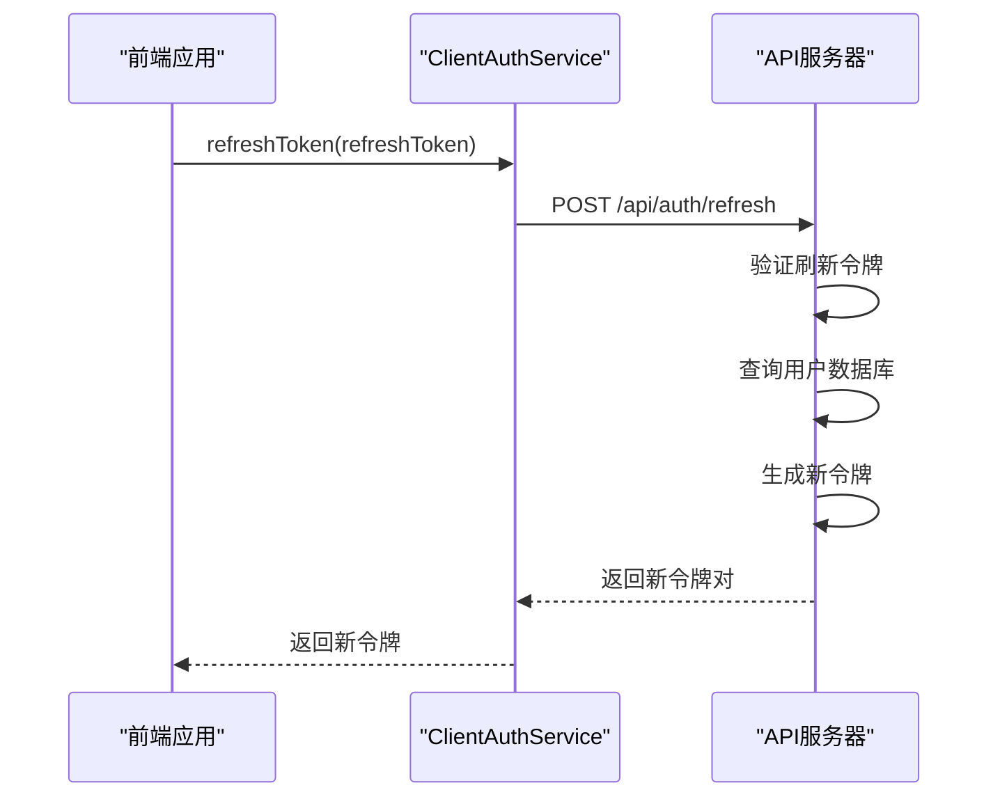
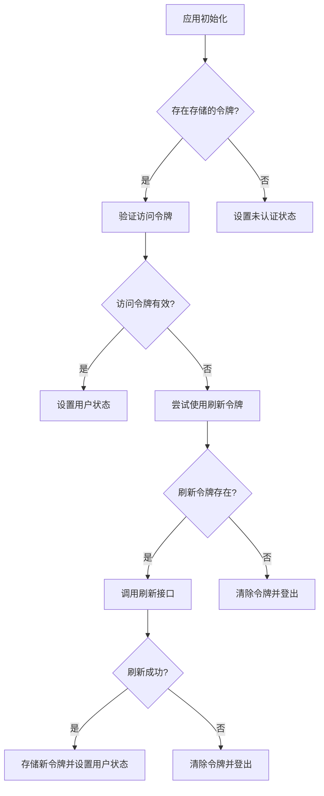

# 令牌刷新接口

<cite>
**本文档引用文件**   
- [auth.ts](file://src/services/auth.ts)
- [auth-client.ts](file://src/services/auth-client.ts)
- [api-server.ts](file://server/api-server.ts)
- [AuthContext.tsx](file://src/contexts/AuthContext.tsx)
- [connection.ts](file://src/db/connection.ts)
</cite>

## 目录
1. [接口概述](#接口概述)
2. [端点详情](#端点详情)
3. [服务端实现](#服务端实现)
4. [客户端实现](#客户端实现)
5. [前端自动刷新机制](#前端自动刷新机制)
6. [安全最佳实践](#安全最佳实践)

## 接口概述

令牌刷新接口是Bio-Appointment系统身份验证机制的关键组成部分，用于在访问令牌过期后获取新的访问令牌，而无需用户重新登录。该接口实现了无感刷新体验，提高了系统的可用性和用户体验。

**Section sources**
- [api-server.ts](file://server/api-server.ts#L86-L105)
- [auth.ts](file://src/services/auth.ts#L182-L204)

## 端点详情

### 基本信息
- **HTTP方法**: POST
- **端点**: /api/auth/refresh
- **认证要求**: 无需访问令牌，但需要有效的刷新令牌
- **内容类型**: application/json

### 请求参数
请求体必须包含以下JSON格式的参数：

| 参数名 | 类型 | 必需 | 描述 |
|-------|------|------|------|
| refreshToken | string | 是 | 用于刷新的JWT刷新令牌 |

### 响应格式
成功响应返回200状态码和包含新令牌对的JSON对象：

```json
{
  "accessToken": "新生成的JWT访问令牌",
  "refreshToken": "新生成的JWT刷新令牌"
}
```

### 错误响应
| 状态码 | 错误类型 | 描述 |
|-------|---------|------|
| 400 | Bad Request | 缺少刷新令牌参数 |
| 401 | Unauthorized | 刷新令牌无效、已过期或用户账户被禁用 |

**Section sources**
- [api-server.ts](file://server/api-server.ts#L86-L105)
- [auth.ts](file://src/services/auth.ts#L182-L204)

## 服务端实现

### AuthService.refreshToken方法
`AuthService.refreshToken`方法是令牌刷新的核心实现，其执行流程如下：

1. **验证刷新令牌有效性**：使用JWT库验证令牌的签名、过期时间和发行者/受众信息
2. **查询用户数据库**：根据解码后的用户ID从数据库中查找用户记录
3. **检查账户状态**：验证用户账户是否处于"active"状态
4. **生成新令牌对**：为有效用户生成新的访问令牌和刷新令牌



**Diagram sources**
- [auth.ts](file://src/services/auth.ts#L182-L204)

### 数据库交互
令牌刷新过程通过`DatabaseHelper.findById`方法与数据库交互，查询用户信息。该方法确保只有活动状态的用户才能成功刷新令牌。



**Diagram sources**
- [auth.ts](file://src/services/auth.ts#L182-L204)
- [connection.ts](file://src/db/connection.ts#L174-L181)

## 客户端实现

### API客户端
客户端通过`ClientAuthService.refreshToken`方法与服务器通信，实现令牌刷新功能。



**Diagram sources**
- [auth-client.ts](file://src/services/auth-client.ts#L112-L126)

### 令牌存储
客户端将令牌存储在localStorage中，确保在页面刷新后仍能保持用户会话。

**Section sources**
- [auth-client.ts](file://src/services/auth-client.ts#L182-L212)

## 前端自动刷新机制

### 认证上下文
`AuthContext`组件管理用户的认证状态，并实现自动令牌刷新机制。



**Diagram sources**
- [AuthContext.tsx](file://src/contexts/AuthContext.tsx#L80-L137)

### 定时刷新检查
系统每分钟检查一次令牌的到期时间，并在访问令牌即将过期（5分钟内）时自动触发刷新流程。

**Section sources**
- [AuthContext.tsx](file://src/contexts/AuthContext.tsx#L233-L276)

## 安全最佳实践

### 令牌生命周期管理
- **访问令牌**: 有效期24小时，用于常规API请求
- **刷新令牌**: 有效期7天，用于获取新的访问令牌
- 令牌包含发行者('bio-appointment')和受众('bio-appointment-users')声明，增强安全性

### 刷新令牌存储安全
虽然当前实现将刷新令牌存储在localStorage中，但最佳实践建议使用HttpOnly Cookie来存储刷新令牌，以防止XSS攻击。

### 防止重放攻击
系统通过以下机制防止重放攻击：
- 令牌包含时间戳(iat)和过期时间(exp)声明
- 服务器验证令牌的发行者和受众
- 用户状态检查确保被禁用的账户无法刷新令牌

### 错误处理
系统对各种错误情况进行了适当的处理：
- 无效或过期的刷新令牌返回401状态码
- 缺少刷新令牌参数返回400状态码
- 数据库查询失败或用户不存在返回401状态码

**Section sources**
- [auth.ts](file://src/services/auth.ts#L182-L204)
- [api-server.ts](file://server/api-server.ts#L86-L105)
- [AuthContext.tsx](file://src/contexts/AuthContext.tsx#L102-L129)