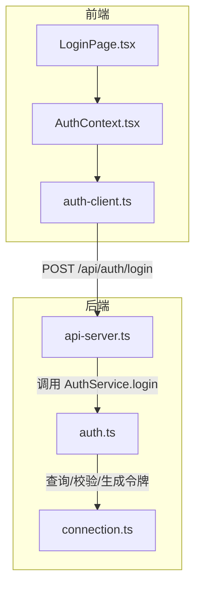
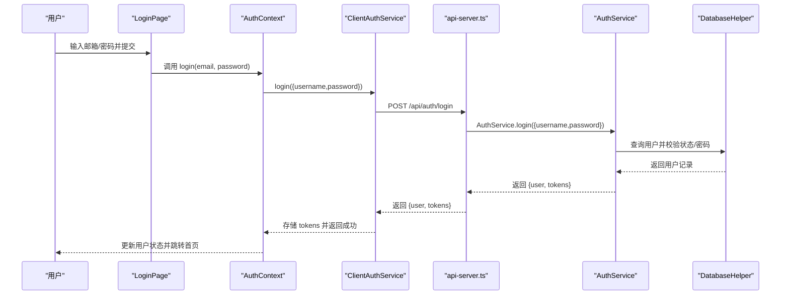
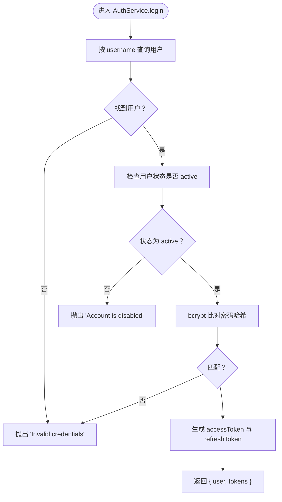
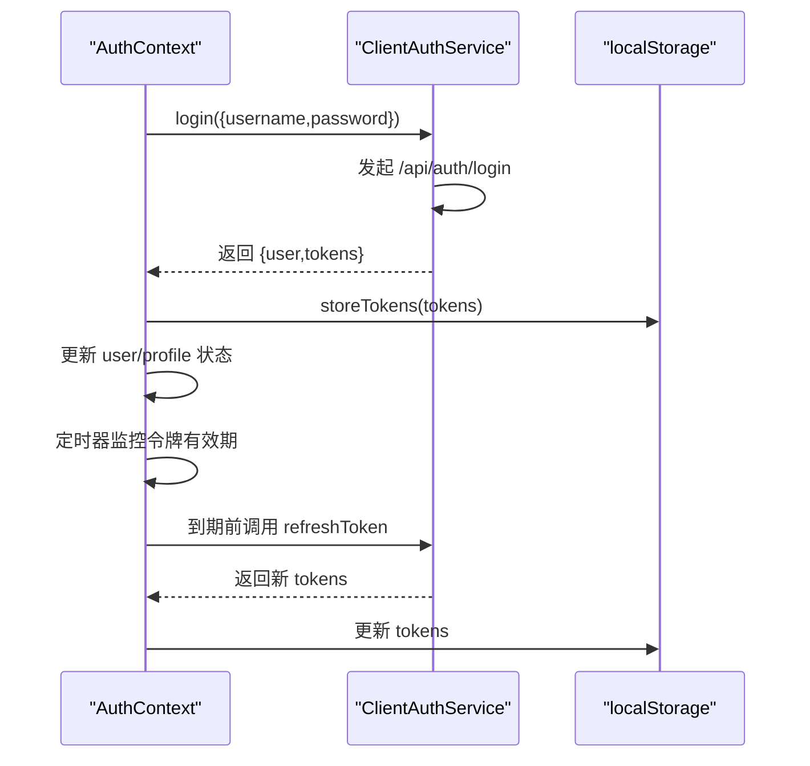
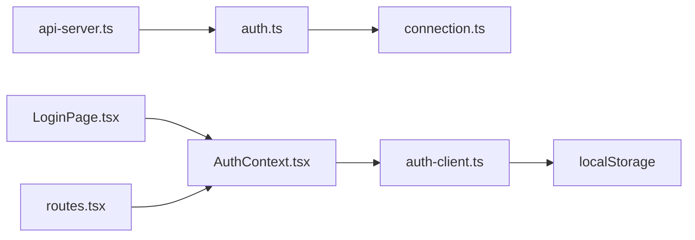

# 登录接口

<cite>
**本文引用的文件**
- [server/api-server.ts](file://server/api-server.ts)
- [src/services/auth.ts](file://src/services/auth.ts)
- [src/services/auth-client.ts](file://src/services/auth-client.ts)
- [src/contexts/AuthContext.tsx](file://src/contexts/AuthContext.tsx)
- [src/pages/auth/LoginPage.tsx](file://src/pages/auth/LoginPage.tsx)
- [src/routes.tsx](file://src/routes.tsx)
- [src/db/connection.ts](file://src/db/connection.ts)
- [src/types/types.ts](file://src/types/types.ts)
- [test-login.js](file://test-login.js)
</cite>

## 目录
1. [简介](#简介)
2. [项目结构](#项目结构)
3. [核心组件](#核心组件)
4. [架构总览](#架构总览)
5. [详细组件分析](#详细组件分析)
6. [依赖关系分析](#依赖关系分析)
7. [性能考量](#性能考量)
8. [故障排除指南](#故障排除指南)
9. [结论](#结论)

## 简介
本文件面向前端与后端开发者，系统化说明 Bio-Appointment 系统的登录接口设计与实现，重点覆盖：
- 基于 JWT 的用户认证流程
- POST /api/auth/login 的 HTTP 方法、请求参数与响应格式
- AuthService.login 的服务端实现逻辑（凭证校验、密码比对、状态检查、令牌生成）
- 前端通过 auth-client.ts 调用登录接口并处理令牌存储与用户状态更新
- 错误处理机制（无效凭证、账户禁用等）
- 安全最佳实践（HTTPS、防暴力破解建议）

## 项目结构
围绕登录与认证的关键文件分布如下：
- 服务端入口与路由：server/api-server.ts
- 服务端认证服务：src/services/auth.ts
- 前端认证客户端：src/services/auth-client.ts
- 前端上下文与登录页：src/contexts/AuthContext.tsx、src/pages/auth/LoginPage.tsx
- 数据库连接与类型：src/db/connection.ts、src/types/types.ts
- 示例测试脚本：test-login.js

图表来源
- [server/api-server.ts](file://server/api-server.ts#L56-L70)
- [src/services/auth.ts](file://src/services/auth.ts#L145-L179)
- [src/services/auth-client.ts](file://src/services/auth-client.ts#L59-L81)
- [src/contexts/AuthContext.tsx](file://src/contexts/AuthContext.tsx#L154-L169)
- [src/pages/auth/LoginPage.tsx](file://src/pages/auth/LoginPage.tsx#L34-L60)
- [src/db/connection.ts](file://src/db/connection.ts#L170-L321)

章节来源
- [server/api-server.ts](file://server/api-server.ts#L56-L70)
- [src/services/auth.ts](file://src/services/auth.ts#L145-L179)
- [src/services/auth-client.ts](file://src/services/auth-client.ts#L59-L81)
- [src/contexts/AuthContext.tsx](file://src/contexts/AuthContext.tsx#L154-L169)
- [src/pages/auth/LoginPage.tsx](file://src/pages/auth/LoginPage.tsx#L34-L60)
- [src/db/connection.ts](file://src/db/connection.ts#L170-L321)

## 核心组件
- 服务端路由与中间件
  - POST /api/auth/login：接收用户名与密码，返回用户信息与令牌对
  - 中间件 authenticateToken：校验 Authorization 头中的 Bearer 令牌，保护后续 API
- 服务端认证服务 AuthService
  - login：查找用户、校验状态、比对密码、生成访问与刷新令牌
  - refreshToken：使用刷新令牌生成新的令牌对
  - verifyToken：验证 JWT 并返回负载
- 前端认证客户端 ClientAuthService
  - login：向 /api/auth/login 发起请求，返回 { user, tokens }
  - storeTokens/clearTokens：本地持久化与清理令牌
  - verifyToken：简单解码客户端侧 JWT（开发环境支持 mock）
- 前端上下文 AuthContext
  - login：封装 ClientAuthService.login，更新用户状态与本地令牌
  - 自动初始化：读取本地令牌，尝试刷新或拉取用户资料
  - 定时刷新：在令牌即将过期前自动刷新
- 登录页 LoginPage
  - 表单校验与提交，调用 AuthContext.login，跳转首页并提示

章节来源
- [server/api-server.ts](file://server/api-server.ts#L56-L70)
- [src/services/auth.ts](file://src/services/auth.ts#L145-L204)
- [src/services/auth-client.ts](file://src/services/auth-client.ts#L59-L126)
- [src/contexts/AuthContext.tsx](file://src/contexts/AuthContext.tsx#L154-L169)
- [src/pages/auth/LoginPage.tsx](file://src/pages/auth/LoginPage.tsx#L34-L60)

## 架构总览
登录流程从浏览器发起请求到服务端，再回到前端上下文进行状态更新与令牌持久化。

图表来源
- [src/pages/auth/LoginPage.tsx](file://src/pages/auth/LoginPage.tsx#L34-L60)
- [src/contexts/AuthContext.tsx](file://src/contexts/AuthContext.tsx#L154-L169)
- [src/services/auth-client.ts](file://src/services/auth-client.ts#L59-L81)
- [server/api-server.ts](file://server/api-server.ts#L56-L70)
- [src/services/auth.ts](file://src/services/auth.ts#L145-L179)
- [src/db/connection.ts](file://src/db/connection.ts#L170-L321)

## 详细组件分析

### 服务端路由：POST /api/auth/login
- 方法与路径
  - POST /api/auth/login
- 请求体
  - 字段：email（字符串）、password（字符串）
  - 注意：前端传入 username，服务端会将其作为 email 字段处理
- 成功响应
  - 结构：{ user: Profile, tokens: { accessToken: string, refreshToken: string } }
  - user 字段包含 id、email、full_name、role 等
- 失败响应
  - 401：认证失败，message 为具体错误（如“Invalid credentials”、“Account is disabled”）
- 中间件
  - authenticateToken：用于后续受保护 API 的统一鉴权

章节来源
- [server/api-server.ts](file://server/api-server.ts#L56-L70)
- [src/types/types.ts](file://src/types/types.ts#L23-L41)
- [src/services/auth.ts](file://src/services/auth.ts#L145-L179)

### 服务端认证服务：AuthService.login 实现
- 关键步骤
  1) 根据 username 查找用户
  2) 校验用户状态是否为 active
  3) 使用 bcrypt 对比密码哈希
  4) 生成访问令牌与刷新令牌
  5) 返回去除敏感字段的用户对象与令牌对
- 错误场景
  - 用户不存在或密码错误：抛出“Invalid credentials”
  - 用户状态非 active：抛出“Account is disabled”
- 令牌生成
  - 访问令牌与刷新令牌均包含 userId、email、role
  - 使用环境变量配置的密钥与过期时间

图表来源
- [src/services/auth.ts](file://src/services/auth.ts#L145-L179)

章节来源
- [src/services/auth.ts](file://src/services/auth.ts#L145-L179)

### 前端调用与状态更新：auth-client.ts 与 AuthContext
- ClientAuthService.login
  - 向 /api/auth/login 发送 POST 请求，请求体包含 email 与 password
  - 解析响应，若失败则抛出错误
- AuthContext.login
  - 调用 ClientAuthService.login
  - 将返回的 tokens 写入 localStorage
  - 设置当前用户与用户档案
- 自动初始化与刷新
  - 启动时尝试读取本地令牌，优先验证 accessToken；若失效则使用 refreshToken 刷新
  - 在令牌即将过期前（例如提前 5 分钟）自动刷新并更新本地存储

图表来源
- [src/services/auth-client.ts](file://src/services/auth-client.ts#L59-L126)
- [src/contexts/AuthContext.tsx](file://src/contexts/AuthContext.tsx#L154-L169)
- [src/contexts/AuthContext.tsx](file://src/contexts/AuthContext.tsx#L232-L276)

章节来源
- [src/services/auth-client.ts](file://src/services/auth-client.ts#L59-L126)
- [src/contexts/AuthContext.tsx](file://src/contexts/AuthContext.tsx#L154-L169)
- [src/contexts/AuthContext.tsx](file://src/contexts/AuthContext.tsx#L232-L276)

### 登录页与路由守卫
- LoginPage
  - 使用表单校验，提交后调用 AuthContext.login
  - 成功后提示并跳转首页
- 路由守卫
  - routes.tsx 中的 requireAuth 与 requiredRole 控制页面访问
  - 登录成功后可访问受保护页面

章节来源
- [src/pages/auth/LoginPage.tsx](file://src/pages/auth/LoginPage.tsx#L34-L60)
- [src/routes.tsx](file://src/routes.tsx#L39-L133)

### 数据库与类型
- DatabaseHelper
  - 提供 findById/findMany/create/update/delete 等通用操作
- 类型定义
  - Profile、LoginCredentials、RegisterCredentials 等类型确保前后端契约一致

章节来源
- [src/db/connection.ts](file://src/db/connection.ts#L170-L321)
- [src/types/types.ts](file://src/types/types.ts#L23-L41)

## 依赖关系分析
- 组件耦合
  - api-server.ts 依赖 AuthService（认证服务）
  - AuthService 依赖 DatabaseHelper（数据库访问）
  - 前端 ClientAuthService 依赖浏览器 fetch 与 localStorage
  - AuthContext 依赖 ClientAuthService 与路由配置
- 关系图

图表来源
- [server/api-server.ts](file://server/api-server.ts#L56-L70)
- [src/services/auth.ts](file://src/services/auth.ts#L145-L179)
- [src/db/connection.ts](file://src/db/connection.ts#L170-L321)
- [src/services/auth-client.ts](file://src/services/auth-client.ts#L59-L126)
- [src/contexts/AuthContext.tsx](file://src/contexts/AuthContext.tsx#L154-L169)
- [src/pages/auth/LoginPage.tsx](file://src/pages/auth/LoginPage.tsx#L34-L60)
- [src/routes.tsx](file://src/routes.tsx#L39-L133)

## 性能考量
- 令牌生成与校验
  - 使用 bcrypt 进行密码比对，盐轮数固定，避免过高的计算开销
  - JWT 仅包含必要负载（userId、email、role），减少体积
- 数据库访问
  - 使用连接池与事务封装，避免频繁建立连接
- 前端令牌刷新
  - 定时器每分钟检查一次，提前 5 分钟刷新，降低 401 风险
- 建议
  - 生产环境启用 HTTPS，避免令牌在传输中被窃取
  - 对登录接口增加速率限制与防暴力破解策略（如 IP 限流、验证码、锁定机制）

## 故障排除指南
- 常见错误与定位
  - “Invalid credentials”：用户名不存在或密码错误
  - “Account is disabled”：用户状态非 active
  - “Access token required”：缺少 Authorization 头或格式不正确
  - “Invalid token”：令牌签名无效或过期
- 前端调试
  - 检查 localStorage 中是否存在令牌
  - 观察 AuthContext 初始化流程是否成功刷新或拉取用户资料
- 后端调试
  - 确认 /api/auth/login 路由已加载
  - 检查 AuthService.login 的数据库查询与 bcrypt 比对逻辑
- 示例测试
  - 可使用 test-login.js 脚本验证登录、获取用户资料与刷新令牌的完整链路

章节来源
- [src/services/auth.ts](file://src/services/auth.ts#L145-L179)
- [server/api-server.ts](file://server/api-server.ts#L119-L148)
- [src/contexts/AuthContext.tsx](file://src/contexts/AuthContext.tsx#L80-L131)
- [test-login.js](file://test-login.js#L1-L75)

## 结论
本登录接口以 JWT 为核心，结合 bcrypt 密码校验与受保护中间件，实现了安全可控的认证流程。前端通过 AuthContext 与 ClientAuthService 完成令牌存储、自动刷新与用户状态管理。建议在生产环境中强化传输安全与访问控制，以进一步提升安全性与用户体验。