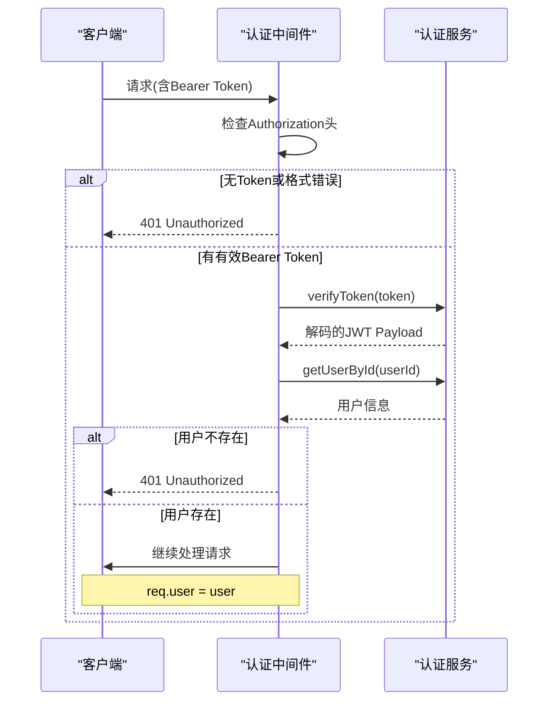
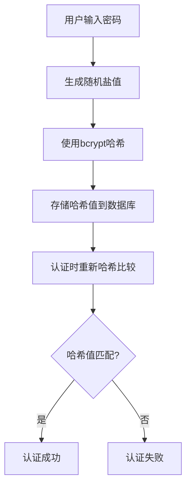
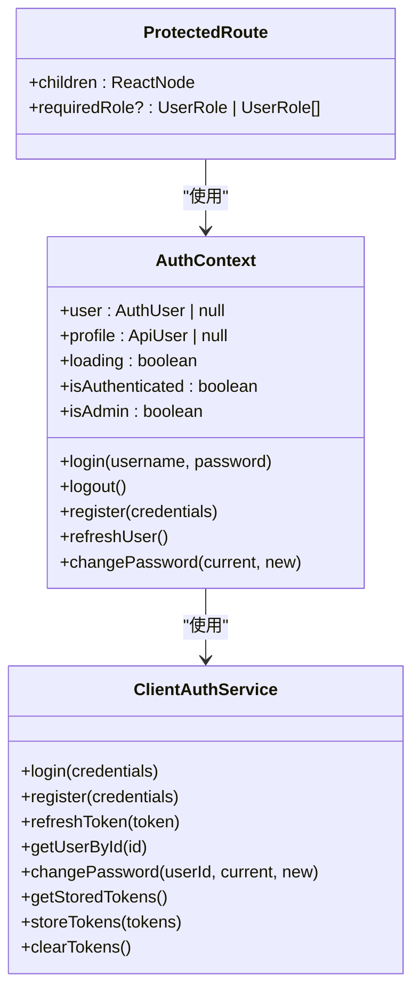

# 认证接口

<cite>
**本文档引用的文件**   
- [auth.ts](file://src/services/auth.ts)
- [auth-client.ts](file://src/services/auth-client.ts)
- [AuthContext.tsx](file://src/contexts/AuthContext.tsx)
- [api-server.ts](file://server/api-server.ts)
- [types.ts](file://src/types/types.ts)
- [ProtectedRoute.tsx](file://src/components/auth/ProtectedRoute.tsx)
</cite>

## 目录
1. [简介](#简介)
2. [核心认证端点](#核心认证端点)
3. [认证中间件](#认证中间件)
4. [密码处理与会话管理](#密码处理与会话管理)
5. [安全防护措施](#安全防护措施)
6. [前端认证状态管理](#前端认证状态管理)
7. [总结](#总结)

## 简介
Bio-Appointment系统采用基于JWT（JSON Web Token）的认证体系，为用户提供安全的登录、注册和令牌刷新功能。本系统通过无状态的JWT令牌实现用户身份验证，结合前端的React Context和后端的Express中间件，构建了一套完整的认证解决方案。系统支持三种核心认证操作：用户登录(/api/auth/login)、用户注册(/api/auth/register)和令牌刷新(/api/auth/refresh)。认证流程遵循标准的JWT实践，使用访问令牌(accessToken)进行短期身份验证和刷新令牌(refreshToken)进行长期会话维护。

**Section sources**
- [auth.ts](file://src/services/auth.ts#L1-L341)
- [auth-client.ts](file://src/services/auth-client.ts#L1-L235)

## 核心认证端点
Bio-Appointment系统的认证接口提供了三个核心RESTful端点，分别处理用户登录、注册和令牌刷新操作。这些端点均位于`/api/auth`路径下，采用标准的HTTP方法和JSON格式的请求/响应体。

### 登录端点 (/api/auth/login)
登录端点用于验证用户凭据并颁发认证令牌对。

- **HTTP方法**: POST
- **请求URL**: `/api/auth/login`
- **请求头**: `Content-Type: application/json`
- **请求体结构 (LoginCredentials)**:
```json
{
  "username": "string",
  "password": "string"
}
```

- **成功响应格式**:
```json
{
  "user": {
    "id": "string",
    "email": "string",
    "full_name": "string",
    "role": "string",
    "department": "string"
  },
  "tokens": {
    "accessToken": "string",
    "refreshToken": "string"
  }
}
```

- **状态码**:
  - `200 OK`: 登录成功，返回用户信息和令牌对
  - `401 Unauthorized`: 认证失败，用户名或密码错误
  - `400 Bad Request`: 请求格式无效

**Section sources**
- [auth.ts](file://src/services/auth.ts#L148-L179)
- [api-server.ts](file://server/api-server.ts#L57-L69)

### 注册端点 (/api/auth/register)
注册端点用于创建新用户账户。

- **HTTP方法**: POST
- **请求URL**: `/api/auth/register`
- **请求头**: `Content-Type: application/json`
- **请求体结构 (RegisterCredentials)**:
```json
{
  "username": "string",
  "password": "string",
  "full_name": "string"
}
```

- **成功响应格式**:
```json
{
  "id": "string",
  "username": "string",
  "email": "string",
  "full_name": "string",
  "role": "string",
  "status": "active",
  "created_at": "string",
  "updated_at": "string"
}
```

- **状态码**:
  - `200 OK`: 注册成功，返回新创建的用户信息
  - `400 Bad Request`: 注册失败，用户名已存在或输入无效
  - `400 Bad Request`: 请求格式无效

**Section sources**
- [auth.ts](file://src/services/auth.ts#L118-L143)
- [api-server.ts](file://server/api-server.ts#L72-L85)

### 令牌刷新端点 (/api/auth/refresh)
令牌刷新端点用于使用刷新令牌获取新的访问令牌。

- **HTTP方法**: POST
- **请求URL**: `/api/auth/refresh`
- **请求头**: `Content-Type: application/json`
- **请求体**:
```json
{
  "refreshToken": "string"
}
```

- **成功响应格式**:
```json
{
  "accessToken": "string",
  "refreshToken": "string"
}
```

- **状态码**:
  - `200 OK`: 令牌刷新成功，返回新的令牌对
  - `400 Bad Request`: 刷新令牌缺失
  - `401 Unauthorized`: 刷新令牌无效或已过期

**Section sources**
- [auth.ts](file://src/services/auth.ts#L184-L204)
- [api-server.ts](file://server/api-server.ts#L87-L104)

## 认证中间件
认证中间件是Bio-Appointment系统安全架构的核心组件，负责验证每个受保护API请求的身份。该中间件在服务器端实现，确保只有经过身份验证的用户才能访问受保护的资源。



**Diagram sources**
- [api-server.ts](file://server/api-server.ts#L119-L148)
- [auth.ts](file://src/services/auth.ts#L86-L103)

### 中间件工作流程
1. **请求拦截**: 中间件拦截所有以`/api`开头的请求。
2. **令牌提取**: 从请求头的`Authorization`字段中提取Bearer令牌。
3. **令牌验证**: 使用`AuthService.verifyToken()`方法验证JWT签名和有效期。
4. **用户查找**: 根据解码后的用户ID从数据库中查找用户信息。
5. **上下文注入**: 将用户信息注入到请求对象中，供后续处理函数使用。
6. **权限控制**: 如果验证失败，返回401错误；如果成功，继续处理请求。

**Section sources**
- [api-server.ts](file://server/api-server.ts#L119-L148)

## 密码处理与会话管理
Bio-Appointment系统在密码处理和会话管理方面采用了现代安全实践，确保用户数据的安全性。

### 密码处理策略
系统使用bcrypt算法对用户密码进行哈希处理，而不是明文存储。bcrypt是一种专门为密码哈希设计的加密哈希函数，具有以下优势：
- **加盐(Salting)**: 每个密码哈希都包含一个唯一的随机盐值，防止彩虹表攻击。
- **自适应性**: 可以调整计算复杂度（通过`saltRounds`参数），随着计算能力的提升而增加安全性。
- **慢速哈希**: 故意设计为计算缓慢，增加暴力破解的难度。



**Diagram sources**
- [auth.ts](file://src/services/auth.ts#L37-L47)

### 会话管理机制
系统采用双令牌机制进行会话管理：
- **访问令牌(accessToken)**: 短期令牌，有效期24小时，用于常规API请求的身份验证。
- **刷新令牌(refreshToken)**: 长期令牌，有效期7天，用于在访问令牌过期后获取新的令牌对。

这种机制平衡了安全性和用户体验：
- 访问令牌有效期短，减少令牌泄露的风险。
- 刷新令牌允许用户在不重新输入凭据的情况下保持登录状态。
- 刷新令牌在使用后会生成新的令牌对，实现令牌轮换。

**Section sources**
- [auth.ts](file://src/services/auth.ts#L52-L81)

## 安全防护措施
Bio-Appointment系统实施了多层次的安全防护措施，确保认证系统的安全性。

### 密码强度要求
系统在前端和后端都实施了密码强度验证：
- **最小长度**: 密码至少6个字符
- **字符复杂度**: 建议包含字母、数字和特殊字符
- **前端验证**: 使用Zod库在登录和注册表单中进行实时验证

### 登录失败限制
虽然当前实现中未包含账户锁定机制，但系统通过以下方式增强安全性：
- **清晰的错误信息**: 区分"用户名不存在"和"密码错误"，防止用户枚举攻击
- **账户状态检查**: 禁用的账户无法登录，支持管理员对可疑账户进行手动禁用
- **建议的增强**: 可以添加登录失败次数限制和账户临时锁定功能

### JWT安全配置
JWT令牌的生成和验证包含多项安全配置：
- **签发者(issuer)**: 设置为`bio-appointment`，确保令牌来源可信
- **受众(audience)**: 设置为`bio-appointment-users`，确保令牌用途正确
- **密钥管理**: 使用环境变量存储JWT密钥，避免硬编码
- **令牌过期**: 强制设置访问令牌和刷新令牌的有效期

**Section sources**
- [auth.ts](file://src/services/auth.ts#L6-L9)
- [auth.ts](file://src/services/auth.ts#L59-L63)

## 前端认证状态管理
Bio-Appointment系统的前端采用React Context API实现全局认证状态管理，为开发者提供了简洁的认证接口。

### AuthContext实现
`AuthContext`组件封装了完整的认证逻辑，包括：
- **状态管理**: 管理用户信息、认证状态和加载状态
- **令牌存储**: 使用localStorage持久化存储访问令牌和刷新令牌
- **自动刷新**: 在访问令牌即将过期时自动使用刷新令牌获取新令牌
- **错误处理**: 统一处理认证相关的错误和异常



**Diagram sources**
- [AuthContext.tsx](file://src/contexts/AuthContext.tsx#L1-L308)
- [auth-client.ts](file://src/services/auth-client.ts#L1-L235)

### ProtectedRoute组件
`ProtectedRoute`是一个高阶组件，用于保护需要认证的页面路由：
- **加载状态**: 显示加载动画，直到认证状态确定
- **未认证重定向**: 未登录用户重定向到登录页面
- **角色权限控制**: 根据用户角色决定是否允许访问特定页面
- **超级管理员特权**: 超级管理员拥有所有页面的访问权限

**Section sources**
- [ProtectedRoute.tsx](file://src/components/auth/ProtectedRoute.tsx#L1-L49)
- [AuthContext.tsx](file://src/contexts/AuthContext.tsx#L1-L308)

## 总结
Bio-Appointment系统的认证接口提供了一套完整、安全的用户认证解决方案。通过JWT技术实现了无状态的身份验证，结合前端的React Context和后端的Express中间件，构建了现代化的认证体系。系统支持登录、注册和令牌刷新三个核心功能，采用bcrypt密码哈希和双令牌会话管理机制，确保了用户数据的安全性。前端通过`AuthContext`和`ProtectedRoute`组件提供了简洁的认证状态管理和路由保护，为开发者提供了良好的开发体验。建议在生产环境中进一步增强安全措施，如添加密码强度策略、登录失败限制和HTTPS强制等。