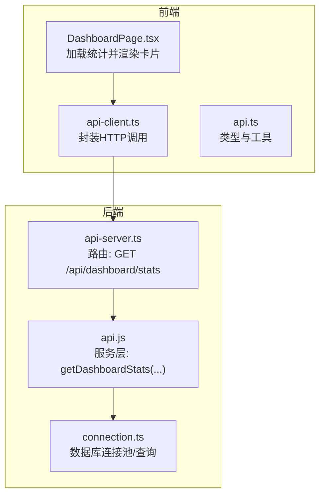
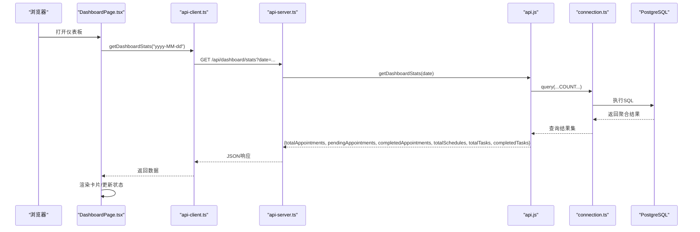
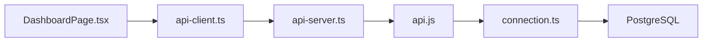

# 仪表板统计接口

<cite>
**本文引用的文件**
- [server/api-server.ts](file://server/api-server.ts)
- [server/server/src/services/api.js](file://server/server/src/services/api.js)
- [server/src/services/api.js](file://server/src/services/api.js)
- [src/services/api-client.ts](file://src/services/api-client.ts)
- [src/services/api.ts](file://src/services/api.ts)
- [src/pages/DashboardPage.tsx](file://src/pages/DashboardPage.tsx)
- [src/db/connection.ts](file://src/db/connection.ts)
- [src/types/types.ts](file://src/types/types.ts)
</cite>

## 目录
1. [简介](#简介)
2. [项目结构](#项目结构)
3. [核心组件](#核心组件)
4. [架构总览](#架构总览)
5. [详细组件分析](#详细组件分析)
6. [依赖关系分析](#依赖关系分析)
7. [性能考量](#性能考量)
8. [故障排查指南](#故障排查指南)
9. [结论](#结论)

## 简介
本文档面向前端与后端开发者，系统化梳理 Bio-Appointment 系统中“仪表板统计”接口 GET /api/dashboard/stats 的实现与使用方式。重点包括：
- 请求参数 date 的处理逻辑与默认值策略（默认为当前日期）
- 统计指标聚合范围与含义（当日预约总数、已完成预约数、待确认/待排班等）
- 后端服务层 getDashboardStats 的数据查询策略与并发优化
- 前端调用示例与错误处理、默认值回退机制
- 与现有前端仪表板页面的对接方式

## 项目结构
该接口涉及前后端多处协作：
- 前端页面通过 API 客户端调用后端接口
- 后端路由解析参数并委派给服务层
- 服务层通过数据库连接池执行聚合查询
- 前端页面接收响应并在仪表板中渲染

图表来源
- [server/api-server.ts](file://server/api-server.ts#L436-L448)
- [server/server/src/services/api.js](file://server/server/src/services/api.js#L335-L353)
- [src/services/api-client.ts](file://src/services/api-client.ts#L281-L285)
- [src/services/api.ts](file://src/services/api.ts#L454-L481)
- [src/db/connection.ts](file://src/db/connection.ts#L80-L94)

章节来源
- [server/api-server.ts](file://server/api-server.ts#L436-L448)
- [src/services/api-client.ts](file://src/services/api-client.ts#L281-L285)
- [src/pages/DashboardPage.tsx](file://src/pages/DashboardPage.tsx#L1-L41)

## 核心组件
- 路由与参数解析
  - 后端路由 GET /api/dashboard/stats 解析 query 参数 date；若未提供，则使用当前日期字符串（格式为 yyyy-MM-dd）作为默认值。
- 服务层统计聚合
  - 服务层 ApiService.getDashboardStats(date) 并发执行多条 COUNT 聚合查询，返回当日关键业务指标。
- 前端调用与渲染
  - 前端通过 clientApi.getDashboardStats(date) 发起请求；DashboardPage 页面在挂载时以“今日日期”为参数拉取统计，并将结果映射到仪表板卡片。

章节来源
- [server/api-server.ts](file://server/api-server.ts#L436-L448)
- [server/server/src/services/api.js](file://server/server/src/services/api.js#L335-L353)
- [src/services/api-client.ts](file://src/services/api-client.ts#L281-L285)
- [src/pages/DashboardPage.tsx](file://src/pages/DashboardPage.tsx#L1-L41)

## 架构总览
下图展示了从浏览器到数据库的完整调用链路与数据流。

图表来源
- [server/api-server.ts](file://server/api-server.ts#L436-L448)
- [server/server/src/services/api.js](file://server/server/src/services/api.js#L335-L353)
- [src/services/api-client.ts](file://src/services/api-client.ts#L281-L285)
- [src/db/connection.ts](file://src/db/connection.ts#L80-L94)

## 详细组件分析

### 路由层：GET /api/dashboard/stats
- 参数处理
  - 读取 query.date；若为空则使用当前日期字符串（yyyy-MM-dd）。
- 错误处理
  - 捕获异常并返回统一的 500 JSON 错误体，包含 error 与 message 字段。
- 数据返回
  - 将服务层返回的统计对象直接 JSON 序列化返回。

章节来源
- [server/api-server.ts](file://server/api-server.ts#L436-L448)

### 服务层：getDashboardStats(date)
- 查询策略
  - 使用 Promise.all 并发执行 6 条 COUNT 聚合查询，分别统计：
    - 当日预约总数
    - 当日待确认/待排班等状态下的预约数量（根据实际状态字段）
    - 当日已完成预约数量
    - 当日排班总数
    - 当日任务总数（基于任务执行与排班关联）
    - 当日已完成任务数
- 性能优化
  - 并发查询减少往返次数，降低整体延迟。
  - 使用参数化查询防止 SQL 注入风险。
- 返回结构
  - 返回包含上述 6 个数值的聚合对象。

章节来源
- [server/server/src/services/api.js](file://server/server/src/services/api.js#L335-L353)
- [server/src/services/api.js](file://server/src/services/api.js#L335-L353)

### 前端调用与渲染
- 调用方式
  - clientApi.getDashboardStats(date?)：若传入 date 则附加到查询字符串；否则由后端使用默认值。
- 默认值与日期格式
  - 前端通常以“yyyy-MM-dd”格式传递日期；后端同样采用该格式进行比较。
- 错误处理与回退
  - 前端在 loadStats 中捕获异常并打印日志；可在此基础上增加 UI 提示或默认值回退（例如将卡片数字置零）。
- 与仪表板页面对接
  - DashboardPage 在挂载时调用 getDashboardStats(today)，并将返回的统计映射到“今日预约”、“待排班”、“进行中任务”等卡片。

章节来源
- [src/services/api-client.ts](file://src/services/api-client.ts#L281-L285)
- [src/pages/DashboardPage.tsx](file://src/pages/DashboardPage.tsx#L1-L41)

### 数据库连接与查询
- 连接池与查询封装
  - connection.ts 提供 query(text, params) 封装，自动记录耗时与行数，并在异常时输出详细上下文。
- 事务与健康检查
  - 提供 transaction 与 healthCheck 辅助函数，便于扩展更复杂的业务场景。

章节来源
- [src/db/connection.ts](file://src/db/connection.ts#L80-L94)

### 类型与状态枚举
- 状态枚举
  - AppointmentStatus、ScheduleStatus、TaskExecutionStatus 等用于约束状态字段取值，确保统计口径一致。
- 类型定义
  - ApiService.getDashboardStats 返回值类型在 types.ts 中有明确声明，便于前端消费。

章节来源
- [src/types/types.ts](file://src/types/types.ts#L13-L20)
- [src/services/api.ts](file://src/services/api.ts#L454-L481)

## 依赖关系分析
- 前端依赖
  - DashboardPage 依赖 clientApi.getDashboardStats 与 getTaskExecutions。
  - clientApi 依赖 fetch 与本地存储的令牌。
- 后端依赖
  - 路由依赖 ensureDatabase（在现有代码中已存在），随后调用 ApiService.getDashboardStats。
  - 服务层依赖 connection.ts 的 query 封装。
- 数据库依赖
  - 统计查询依赖 appointments、schedules、task_executions 等表的结构与索引设计（建议对 requested_date、scheduled_date、status 等字段建立合适索引以提升 COUNT 查询性能）。

图表来源
- [src/pages/DashboardPage.tsx](file://src/pages/DashboardPage.tsx#L1-L41)
- [src/services/api-client.ts](file://src/services/api-client.ts#L281-L285)
- [server/api-server.ts](file://server/api-server.ts#L436-L448)
- [server/server/src/services/api.js](file://server/server/src/services/api.js#L335-L353)
- [src/db/connection.ts](file://src/db/connection.ts#L80-L94)

## 性能考量
- 并发查询
  - 服务层使用 Promise.all 并发执行多个 COUNT 查询，显著降低总延迟。
- 索引建议
  - 对以下字段建立索引可进一步提升统计查询性能：
    - appointments.requested_date
    - appointments.status
    - schedules.scheduled_date
    - task_executions.status
    - schedules.id（用于 JOIN）
- 缓存策略
  - 若统计数据更新频率较低，可在服务层引入短期缓存（如 Redis）以减轻数据库压力。
- 分页与过滤
  - 当前统计为“当日”聚合，无需分页；若未来扩展为跨日统计，需考虑分页与过滤参数的组合。

[本节为通用性能建议，不直接分析具体文件，故无章节来源]

## 故障排查指南
- 常见错误
  - 数据库连接失败：检查 connection.ts 初始化与环境变量配置。
  - SQL 执行异常：查看 connection.ts 的错误日志输出，定位具体语句与参数。
  - 前端网络错误：确认 API_BASE_URL 与 CORS 设置；检查浏览器控制台与网络面板。
- 建议的日志与回退
  - 前端：在 DashboardPage 的 loadStats 中捕获异常并记录；可设置默认值（如 0）避免 UI 异常。
  - 后端：统一的 500 错误响应已包含 error 与 message，便于前端识别与提示。

章节来源
- [src/db/connection.ts](file://src/db/connection.ts#L80-L94)
- [src/services/api-client.ts](file://src/services/api-client.ts#L1-L25)
- [src/pages/DashboardPage.tsx](file://src/pages/DashboardPage.tsx#L1-L41)

## 结论
- GET /api/dashboard/stats 已实现以“当日”为粒度的关键业务指标聚合，包含预约与任务两大维度。
- 后端通过 Promise.all 并发查询提升性能，前端以“yyyy-MM-dd”格式传递日期并支持默认值。
- 建议后续完善：
  - 对关键字段建立索引
  - 在高并发场景下引入短期缓存
  - 在前端增加更完善的错误提示与默认值回退