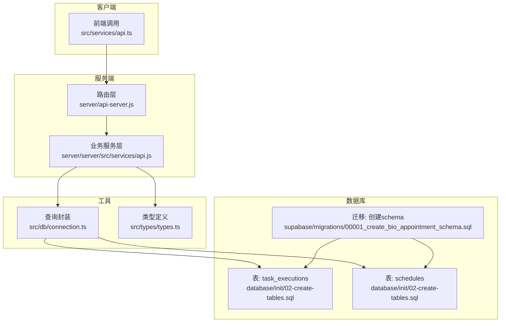
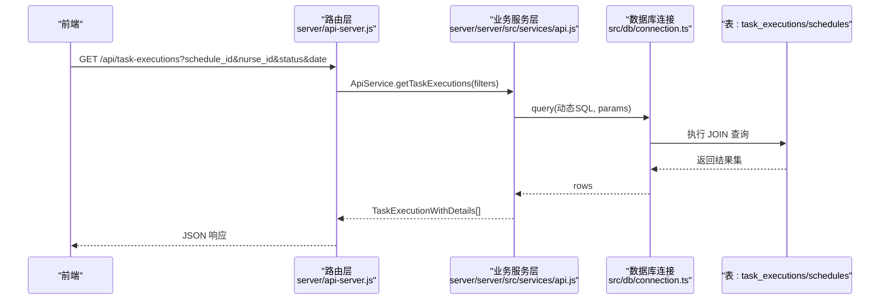
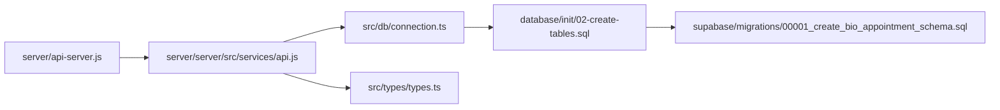

# 任务执行接口

<cite>
**本文引用的文件**
- [server/api-server.js](file://server/api-server.js)
- [server/server/src/services/api.js](file://server/server/src/services/api.js)
- [src/services/api.ts](file://src/services/api.ts)
- [src/db/connection.ts](file://src/db/connection.ts)
- [src/types/types.ts](file://src/types/types.ts)
- [database/init/02-create-tables.sql](file://database/init/02-create-tables.sql)
- [supabase/migrations/00001_create_bio_appointment_schema.sql](file://supabase/migrations/00001_create_bio_appointment_schema.sql)
- [src/services/dataSync.ts](file://src/services/dataSync.ts)
</cite>

## 目录
1. [简介](#简介)
2. [项目结构](#项目结构)
3. [核心组件](#核心组件)
4. [架构总览](#架构总览)
5. [详细组件分析](#详细组件分析)
6. [依赖关系分析](#依赖关系分析)
7. [性能考量](#性能考量)
8. [故障排除指南](#故障排除指南)
9. [结论](#结论)
10. [附录](#附录)

## 简介
本文件面向前端与后端开发者，系统化梳理 Bio-Appointment 系统中“任务执行”接口 GET /api/task-executions 的设计与实现，重点覆盖以下方面：
- 接口功能与支持的过滤参数（schedule_id、nurse_id、status、date）
- 查询逻辑与 SQL 构造（动态 WHERE 条件、参数绑定、LEFT JOIN 关联）
- 响应数据结构与关键字段含义（任务标题、描述、状态、分配人员等）
- 参数化查询的实现方式与安全实践
- 前端调用示例与最佳实践

## 项目结构
围绕任务执行接口的关键文件组织如下：
- 服务端路由：负责接收请求并转发到业务服务层
- 业务服务层：封装数据库查询逻辑，动态构建 WHERE 条件与 JOIN
- 数据库连接层：统一的查询与事务封装
- 类型定义：明确 TaskExecution 及其扩展详情的数据结构
- 数据库初始化与迁移：定义 task_executions、schedules 等表结构及索引

图表来源
- [server/api-server.js](file://server/api-server.js#L280-L320)
- [server/server/src/services/api.js](file://server/server/src/services/api.js#L233-L273)
- [src/services/api.ts](file://src/services/api.ts#L327-L377)
- [src/db/connection.ts](file://src/db/connection.ts#L80-L114)
- [database/init/02-create-tables.sql](file://database/init/02-create-tables.sql#L98-L112)
- [supabase/migrations/00001_create_bio_appointment_schema.sql](file://supabase/migrations/00001_create_bio_appointment_schema.sql#L177-L190)

章节来源
- [server/api-server.js](file://server/api-server.js#L280-L320)
- [server/server/src/services/api.js](file://server/server/src/services/api.js#L233-L273)
- [src/services/api.ts](file://src/services/api.ts#L327-L377)
- [src/db/connection.ts](file://src/db/connection.ts#L80-L114)
- [database/init/02-create-tables.sql](file://database/init/02-create-tables.sql#L98-L112)
- [supabase/migrations/00001_create_bio_appointment_schema.sql](file://supabase/migrations/00001_create_bio_appointment_schema.sql#L177-L190)

## 核心组件
- 路由层：接收 GET /api/task-executions 请求，解析查询参数，调用业务服务层并返回结果。
- 业务服务层：根据过滤参数动态拼接 WHERE 条件，执行 JOIN 查询 task_executions 与 schedules、appointments、profiles，返回带详情的任务集合。
- 数据库连接层：提供 query 封装，确保参数化查询与连接生命周期管理。
- 类型定义：TaskExecution 与 TaskExecutionWithDetails 明确响应字段，便于前后端契约一致。

章节来源
- [server/api-server.js](file://server/api-server.js#L280-L320)
- [server/server/src/services/api.js](file://server/server/src/services/api.js#L233-L273)
- [src/services/api.ts](file://src/services/api.ts#L327-L377)
- [src/db/connection.ts](file://src/db/connection.ts#L80-L114)
- [src/types/types.ts](file://src/types/types.ts#L155-L189)

## 架构总览
下图展示了从路由到数据库的调用链路与数据流向。

图表来源
- [server/api-server.js](file://server/api-server.js#L280-L320)
- [server/server/src/services/api.js](file://server/server/src/services/api.js#L233-L273)
- [src/db/connection.ts](file://src/db/connection.ts#L80-L114)
- [database/init/02-create-tables.sql](file://database/init/02-create-tables.sql#L98-L112)

## 详细组件分析

### 接口定义与过滤参数
- 端点：GET /api/task-executions
- 支持的查询参数：
  - schedule_id：按排班 ID 过滤
  - nurse_id：按执行护士 ID 过滤
  - status：按任务执行状态过滤
  - date：按排班日期过滤（与 schedules.scheduled_date 对齐）
- 查询逻辑要点：
  - 使用 LEFT JOIN 连接 schedules、appointments、profiles，以便在响应中携带排班日期、时间、客户名称、服务 ID、护士姓名等详情。
  - 动态构建 WHERE 子句，仅对非空参数追加条件，保证灵活性与安全性。
  - 使用参数化查询绑定参数，避免 SQL 注入风险。
  - 按排班日期与开始时间排序，便于前端展示。

章节来源
- [server/api-server.js](file://server/api-server.js#L280-L320)
- [server/server/src/services/api.js](file://server/server/src/services/api.js#L233-L273)
- [src/services/api.ts](file://src/services/api.ts#L327-L377)

### SQL 查询与参数化实现
- 动态 WHERE 构建：
  - 以字符串常量 "1=1" 作为起始，逐个参数追加 AND 条件。
  - 每个参数对应一个占位符 $n，并将参数值依次放入 params 数组。
- JOIN 关联：
  - task_executions ← schedules（schedule_id）
  - schedules ← appointments（appointment_id）
  - task_executions ← profiles（nurse_id）
- 排序与返回：
  - 按 scheduled_date、scheduled_time_start 升序排列。
  - 返回 rows，供路由层 JSON 序列化。

章节来源
- [server/server/src/services/api.js](file://server/server/src/services/api.js#L233-L273)
- [src/services/api.ts](file://src/services/api.ts#L327-L377)
- [src/db/connection.ts](file://src/db/connection.ts#L80-L114)

### 响应数据结构与字段说明
- 基础字段（来自 task_executions）：
  - id、schedule_id、nurse_id、check_in_time、start_time、finish_time、actual_duration、overtime_note、status、created_at、updated_at
- 关联详情（来自 JOIN）：
  - scheduled_date、scheduled_time_start（来自 schedules）
  - customer_name、service_id（来自 appointments）
  - nurse_name（来自 profiles.full_name）
- 类型定义参考：
  - TaskExecution：基础字段
  - TaskExecutionWithDetails：包含 schedule、nurse_profile 等扩展信息

章节来源
- [src/types/types.ts](file://src/types/types.ts#L155-L189)
- [server/server/src/services/api.js](file://server/server/src/services/api.js#L233-L273)
- [src/services/api.ts](file://src/services/api.ts#L327-L377)

### 参数化查询与安全实践
- 参数绑定：
  - 使用 $n 占位符与 params 数组，确保输入值不会被当作 SQL 语句执行。
- 动态拼接：
  - 仅拼接 WHERE 条件片段，不拼接表名、列名等敏感部分，降低注入风险。
- 连接池与超时：
  - 通过连接池管理并发与超时，提升稳定性与性能。

章节来源
- [src/db/connection.ts](file://src/db/connection.ts#L80-L114)
- [server/server/src/services/api.js](file://server/server/src/services/api.js#L233-L273)
- [src/services/api.ts](file://src/services/api.ts#L327-L377)

### 前端调用示例与最佳实践
- 获取特定护士的任务执行：
  - GET /api/task-executions?nurse_id={护士ID}
- 获取特定排班的任务执行：
  - GET /api/task-executions?schedule_id={排班ID}
- 获取特定状态的任务执行：
  - GET /api/task-executions?status={状态}
- 获取某一天的任务执行：
  - GET /api/task-executions?date={YYYY-MM-DD}
- 多条件组合：
  - GET /api/task-executions?date={YYYY-MM-DD}&nurse_id={护士ID}&status={状态}

注意：以上示例为 URL 形式，实际调用请结合前端框架的 fetch 或 axios，并正确设置请求头（如 Authorization）。若需跨域，请在服务端配置 CORS。

章节来源
- [server/api-server.js](file://server/api-server.js#L280-L320)
- [src/services/api.ts](file://src/services/api.ts#L853-L885)

### 与数据库表结构的关系
- task_executions 表：
  - schedule_id 引用 schedules.id
  - nurse_id 引用 profiles.id
- schedules 表：
  - appointment_id 引用 appointments.id
  - scheduled_date、scheduled_time_start、scheduled_time_end 记录排班时间
- 索引优化：
  - task_executions 上存在 schedule_id、nurse_id、status 等索引，有利于过滤与排序性能。

章节来源
- [database/init/02-create-tables.sql](file://database/init/02-create-tables.sql#L98-L112)
- [supabase/migrations/00001_create_bio_appointment_schema.sql](file://supabase/migrations/00001_create_bio_appointment_schema.sql#L177-L190)

## 依赖关系分析
- 路由层依赖业务服务层提供的查询方法。
- 业务服务层依赖数据库连接封装，执行参数化 SQL。
- 响应数据结构依赖类型定义，确保前后端一致性。
- 数据库层依赖表结构与索引，支撑高效查询。

图表来源
- [server/api-server.js](file://server/api-server.js#L280-L320)
- [server/server/src/services/api.js](file://server/server/src/services/api.js#L233-L273)
- [src/db/connection.ts](file://src/db/connection.ts#L80-L114)
- [src/types/types.ts](file://src/types/types.ts#L155-L189)
- [database/init/02-create-tables.sql](file://database/init/02-create-tables.sql#L98-L112)
- [supabase/migrations/00001_create_bio_appointment_schema.sql](file://supabase/migrations/00001_create_bio_appointment_schema.sql#L177-L190)

## 性能考量
- 索引命中：
  - task_executions.schedule_id、task_executions.nurse_id、task_executions.status 等索引可显著提升过滤效率。
- 排序与分页：
  - 当前实现按 scheduled_date、scheduled_time_start 排序；若数据量大，建议在业务层增加分页参数（如 limit、offset）以控制单次返回量。
- 连接池与并发：
  - 使用连接池管理并发连接，避免阻塞与超时。
- 查询复杂度：
  - JOIN 三张表的查询在合理索引下通常具备良好性能；若出现慢查询，可考虑为 schedules.scheduled_date 建立复合索引以优化 date 过滤。

章节来源
- [database/init/02-create-tables.sql](file://database/init/02-create-tables.sql#L206-L215)
- [src/db/connection.ts](file://src/db/connection.ts#L80-L114)

## 故障排除指南
- 400/404/500 错误：
  - 若路由层捕获异常，会返回包含错误信息的 JSON；请检查请求参数是否合法、服务是否启动、数据库连接是否正常。
- 参数绑定问题：
  - 确认过滤参数均传入有效值；未传入的参数不会进入 WHERE 条件。
- 数据为空：
  - 检查过滤条件是否过于严格；尝试放宽条件或清除 date/nurse_id/status 等筛选项以定位数据范围。
- 实时更新与通知：
  - 若涉及任务状态变更，可参考增强更新流程（事务、动态 SET 子句、实时通知），确保状态变更与通知的一致性。

章节来源
- [server/api-server.js](file://server/api-server.js#L280-L320)
- [src/services/dataSync.ts](file://src/services/dataSync.ts#L199-L236)

## 结论
GET /api/task-executions 提供了灵活、安全、可扩展的任务执行查询能力。通过动态 WHERE 构建与参数化查询，既能满足多维过滤需求，又能保障安全性；通过 JOIN 关联，响应中可直接获得排班日期、客户与护士等关键信息，便于前端直接渲染。建议在大规模数据场景下配合分页与索引优化，持续关注查询性能与用户体验。

## 附录

### API 定义摘要
- 方法：GET
- 路径：/api/task-executions
- 查询参数：
  - schedule_id：排班 ID
  - nurse_id：护士 ID
  - status：任务执行状态
  - date：排班日期（YYYY-MM-DD）
- 响应：TaskExecutionWithDetails[]（包含关联详情）

章节来源
- [server/api-server.js](file://server/api-server.js#L280-L320)
- [server/server/src/services/api.js](file://server/server/src/services/api.js#L233-L273)
- [src/services/api.ts](file://src/services/api.ts#L327-L377)
- [src/types/types.ts](file://src/types/types.ts#L155-L189)