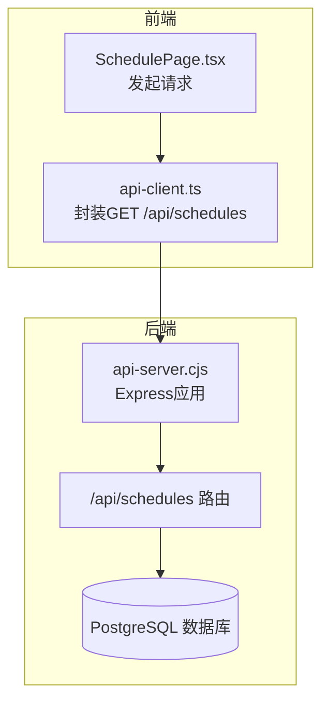
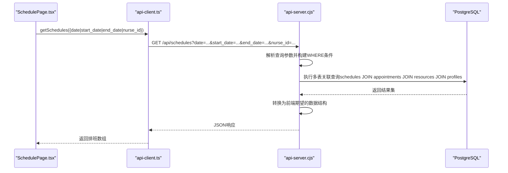
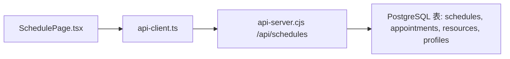
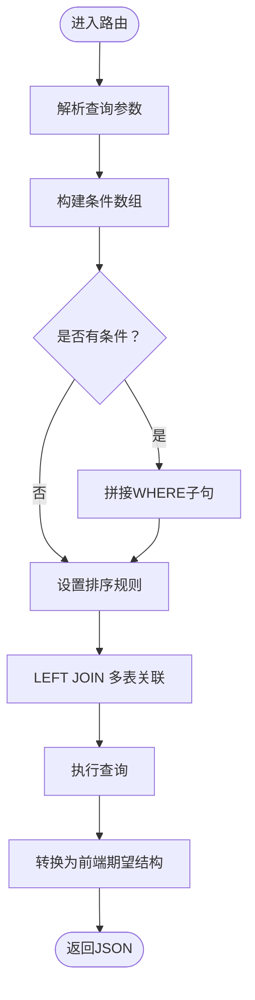

# 排班管理接口

<cite>
**本文引用的文件**
- [server/api-server.cjs](file://server/api-server.cjs)
- [src/services/api-client.ts](file://src/services/api-client.ts)
- [src/pages/head-nurse/SchedulePage.tsx](file://src/pages/head-nurse/SchedulePage.tsx)
- [src/types/types.ts](file://src/types/types.ts)
- [src/db/api.ts](file://src/db/api.ts)
</cite>

## 目录
1. [简介](#简介)
2. [项目结构](#项目结构)
3. [核心组件](#核心组件)
4. [架构总览](#架构总览)
5. [详细组件分析](#详细组件分析)
6. [依赖关系分析](#依赖关系分析)
7. [性能考量](#性能考量)
8. [故障排查指南](#故障排查指南)
9. [结论](#结论)
10. [附录](#附录)

## 简介
本文件面向Bio-Appointment系统的排班管理接口，聚焦于后端Express服务器提供的GET /api/schedules端点。文档将详细说明：
- 支持的查询参数（date、start_date、end_date、nurse_id）及组合查询逻辑
- 动态SQL构建过程：如何根据可选参数生成WHERE条件并执行多表关联查询（关联预约表、资源表、用户表）
- 响应数据结构：包含排班信息、客户姓名、房间信息、护士姓名等字段
- 分页与排序规则（按日期和时间排序）
- 错误处理机制
- 前端调用示例：通过apiClient.getSchedules()方法传递过滤条件

## 项目结构
后端API服务器位于server目录，前端调用封装在src/services/api-client.ts中，页面组件在src/pages/head-nurse/SchedulePage.tsx中发起请求并消费数据。

图表来源
- [server/api-server.cjs](file://server/api-server.cjs#L287-L389)
- [src/services/api-client.ts](file://src/services/api-client.ts#L228-L241)
- [src/pages/head-nurse/SchedulePage.tsx](file://src/pages/head-nurse/SchedulePage.tsx#L94-L103)

章节来源
- [server/api-server.cjs](file://server/api-server.cjs#L287-L389)
- [src/services/api-client.ts](file://src/services/api-client.ts#L228-L241)
- [src/pages/head-nurse/SchedulePage.tsx](file://src/pages/head-nurse/SchedulePage.tsx#L94-L103)

## 核心组件
- 后端路由：/api/schedules，接收查询参数并返回排班列表
- 前端客户端：api-client.ts提供getSchedules(filters)，负责拼装查询字符串并发起请求
- 页面组件：SchedulePage.tsx在不同视图模式下计算日期范围，并调用api-client.getSchedules进行数据拉取
- 类型定义：types.ts中定义了Schedule、ScheduleWithDetails等类型，用于前后端契约一致

章节来源
- [src/services/api-client.ts](file://src/services/api-client.ts#L228-L241)
- [src/pages/head-nurse/SchedulePage.tsx](file://src/pages/head-nurse/SchedulePage.tsx#L94-L103)
- [src/types/types.ts](file://src/types/types.ts#L139-L153)

## 架构总览
后端路由层负责解析查询参数，动态构建SQL并执行多表LEFT JOIN；前端通过api-client封装统一的HTTP调用，页面组件负责业务场景下的参数组装。

图表来源
- [server/api-server.cjs](file://server/api-server.cjs#L287-L389)
- [src/services/api-client.ts](file://src/services/api-client.ts#L228-L241)
- [src/pages/head-nurse/SchedulePage.tsx](file://src/pages/head-nurse/SchedulePage.tsx#L94-L103)

## 详细组件分析

### 后端路由：GET /api/schedules
- 查询参数支持：
  - date：精确匹配排班日期
  - start_date：起始日期（含）
  - end_date：结束日期（含）
  - nurse_id：按护士ID过滤
- 参数组合逻辑：
  - 若提供date，则仅按该日期过滤
  - 若未提供date但同时提供start_date与end_date，则按日期区间过滤
  - 若仅提供start_date，则按>=起始日期过滤
  - 若仅提供end_date，则按<=结束日期过滤
  - nurse_id可与上述日期条件组合使用
- 动态SQL构建：
  - 基于条件数组拼接WHERE子句，使用占位符参数避免SQL注入
  - 使用LEFT JOIN关联预约、服务、资源、用户信息
- 排序规则：
  - ORDER BY scheduled_date, scheduled_time_start
- 响应数据结构：
  - 返回排班记录，并内嵌appointment、room、nurse对象，字段包含客户姓名、服务信息、房间信息、护士信息等
- 错误处理：
  - 捕获异常并返回500及错误消息

章节来源
- [server/api-server.cjs](file://server/api-server.cjs#L287-L389)

### 前端客户端：api-client.ts
- 提供getSchedules(filters)方法，将filters映射为URL查询字符串
- 自动附加Authorization头（Bearer令牌）
- 统一错误处理：当HTTP非2xx时抛出错误，便于上层捕获

章节来源
- [src/services/api-client.ts](file://src/services/api-client.ts#L228-L241)

### 页面组件：SchedulePage.tsx
- 在不同视图模式（日/周/月）下计算日期范围
- 并发拉取待排班预约、排班列表、可用护士与房间
- 传入getSchedules的filters：
  - 日视图：使用date
  - 周/月视图：使用start_date与end_date
- 将后端返回的扁平数据转换为前端期望的结构（appointment、room、nurse对象）

章节来源
- [src/pages/head-nurse/SchedulePage.tsx](file://src/pages/head-nurse/SchedulePage.tsx#L94-L103)

### 类型定义：types.ts
- Schedule：排班基础字段（日期、时间、房间、护士、状态等）
- ScheduleWithDetails：扩展包含appointment、room、nurse、created_by_profile等

章节来源
- [src/types/types.ts](file://src/types/types.ts#L139-L153)
- [src/types/types.ts](file://src/types/types.ts#L178-L183)

### 前端历史实现对比：src/db/api.ts
- 历史实现中存在getSchedules(filters)方法，支持scheduled_date、scheduled_date_from、scheduled_date_to、room_id、nurse_id、status等参数
- 该实现使用DatabaseHelper.findMany与自定义query函数，同样基于LEFT JOIN关联预约、资源、用户，并按日期与时间排序
- 与当前后端路由相比，参数命名与返回结构略有差异（例如字段别名、嵌套对象结构），但核心动态SQL与多表关联思路一致

章节来源
- [src/db/api.ts](file://src/db/api.ts#L240-L303)

## 依赖关系分析

图表来源
- [src/pages/head-nurse/SchedulePage.tsx](file://src/pages/head-nurse/SchedulePage.tsx#L94-L103)
- [src/services/api-client.ts](file://src/services/api-client.ts#L228-L241)
- [server/api-server.cjs](file://server/api-server.cjs#L287-L389)

章节来源
- [src/pages/head-nurse/SchedulePage.tsx](file://src/pages/head-nurse/SchedulePage.tsx#L94-L103)
- [src/services/api-client.ts](file://src/services/api-client.ts#L228-L241)
- [server/api-server.cjs](file://server/api-server.cjs#L287-L389)

## 性能考量
- 动态SQL构建：后端对WHERE条件采用占位符参数，避免SQL注入风险；建议在高频查询场景下为schedules.scheduled_date、schedules.nurse_id建立索引以优化查询性能
- 多表关联：LEFT JOIN涉及四张表，建议确保相关外键字段具备索引，减少全表扫描
- 排序：ORDER BY scheduled_date, scheduled_time_start，若数据量大，可考虑复合索引以提升排序效率
- 前端并发：页面组件使用Promise.all并发拉取多个数据源，有助于降低整体等待时间

[本节为通用性能建议，不直接分析具体文件]

## 故障排查指南
- 请求失败：
  - 检查后端服务是否启动且监听端口3001
  - 确认数据库连接正常（host/port/database/user/password）
- 参数无效：
  - 确认传入的date、start_date、end_date格式为“YYYY-MM-DD”
  - nurse_id需为有效UUID
- 响应为空：
  - 检查日期范围是否正确（start_date <= end_date）
  - 确认数据库中是否存在满足条件的排班记录
- 错误信息：
  - 后端返回500时，查看控制台日志中的错误堆栈
  - 前端抛出HTTP错误时，检查api-client的错误处理逻辑

章节来源
- [server/api-server.cjs](file://server/api-server.cjs#L287-L389)
- [src/services/api-client.ts](file://src/services/api-client.ts#L1-L25)

## 结论
GET /api/schedules端点通过灵活的查询参数组合与动态SQL构建，实现了对排班数据的高效检索。后端采用多表LEFT JOIN聚合关键信息，前端通过api-client统一封装请求与错误处理，页面组件则根据视图模式智能组装参数。整体架构清晰、职责分离明确，便于后续扩展与维护。

[本节为总结性内容，不直接分析具体文件]

## 附录

### 查询参数与组合逻辑
- date：精确匹配排班日期
- start_date：起始日期（含）
- end_date：结束日期（含）
- nurse_id：按护士ID过滤
- 组合规则：
  - 若提供date：仅按该日期过滤
  - 若未提供date但同时提供start_date与end_date：按日期区间过滤
  - 若仅提供start_date：按>=起始日期过滤
  - 若仅提供end_date：按<=结束日期过滤
  - nurse_id可与上述日期条件组合使用

章节来源
- [server/api-server.cjs](file://server/api-server.cjs#L287-L348)

### 动态SQL构建流程

图表来源
- [server/api-server.cjs](file://server/api-server.cjs#L287-L389)

### 响应数据结构要点
- 基础字段：排班ID、日期、时间、房间ID、护士ID、状态等
- 关联字段：appointment.customer_name、service信息、room信息、nurse信息
- 嵌套对象：appointment、room、nurse对象，便于前端直接渲染

章节来源
- [server/api-server.cjs](file://server/api-server.cjs#L352-L379)
- [src/types/types.ts](file://src/types/types.ts#L139-L153)
- [src/types/types.ts](file://src/types/types.ts#L178-L183)

### 分页与排序
- 排序规则：ORDER BY scheduled_date, scheduled_time_start
- 分页：当前后端未实现LIMIT/OFFSET；如需分页，可在路由层增加page/size参数并传入数据库查询

章节来源
- [server/api-server.cjs](file://server/api-server.cjs#L344-L348)

### 前端调用示例
- 日视图：传入date
- 周/月视图：传入start_date与end_date
- 可选：nurse_id

章节来源
- [src/pages/head-nurse/SchedulePage.tsx](file://src/pages/head-nurse/SchedulePage.tsx#L94-L103)
- [src/services/api-client.ts](file://src/services/api-client.ts#L228-L241)