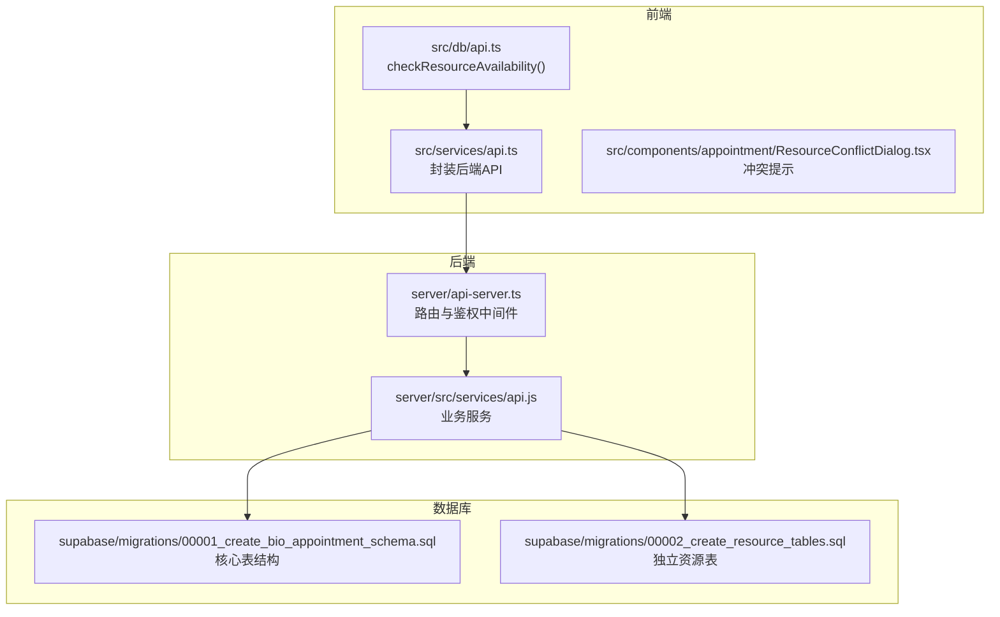
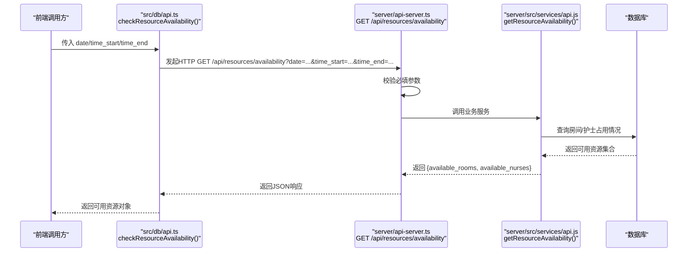
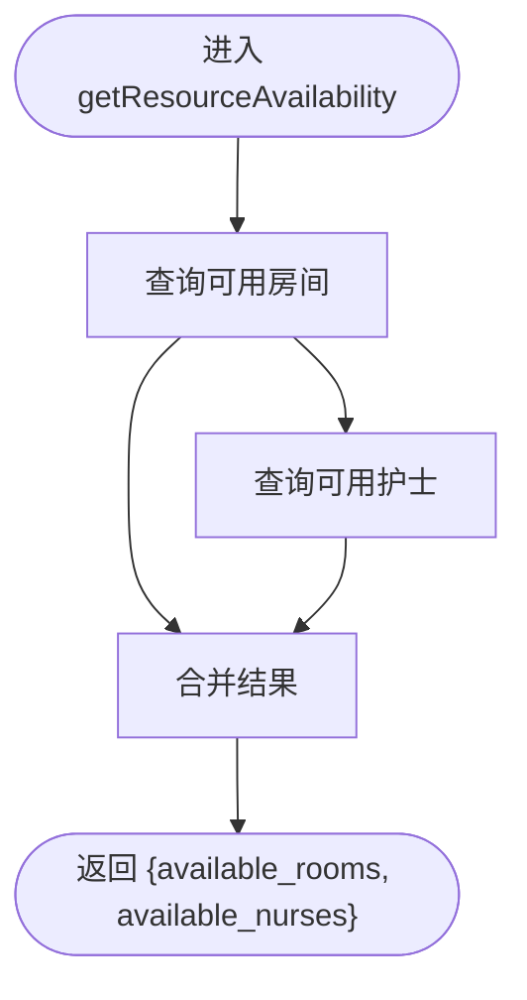
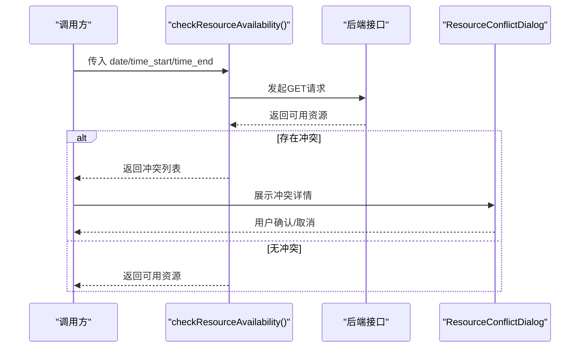
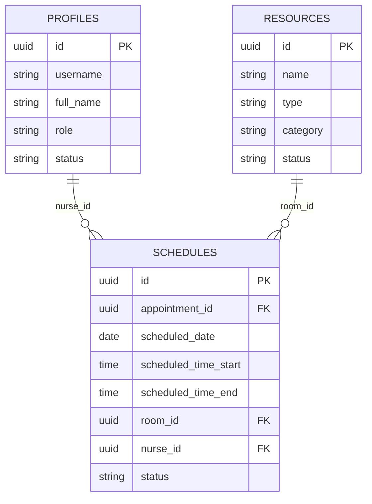
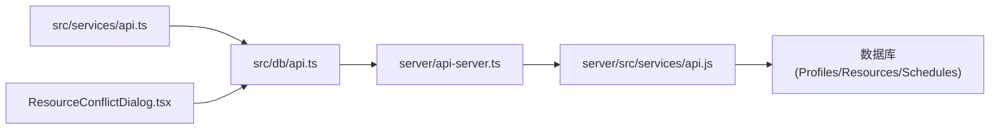

# 资源可用性接口

<cite>
**本文引用的文件**
- [server/api-server.ts](file://server/api-server.ts)
- [server/src/services/api.js](file://server/src/services/api.js)
- [src/services/api.ts](file://src/services/api.ts)
- [src/db/api.ts](file://src/db/api.ts)
- [src/components/appointment/ResourceConflictDialog.tsx](file://src/components/appointment/ResourceConflictDialog.tsx)
- [supabase/migrations/00001_create_bio_appointment_schema.sql](file://supabase/migrations/00001_create_bio_appointment_schema.sql)
- [supabase/migrations/00002_create_resource_tables.sql](file://supabase/migrations/00002_create_resource_tables.sql)
</cite>

## 目录
1. [简介](#简介)
2. [项目结构](#项目结构)
3. [核心组件](#核心组件)
4. [架构总览](#架构总览)
5. [详细组件分析](#详细组件分析)
6. [依赖关系分析](#依赖关系分析)
7. [性能考量](#性能考量)
8. [故障排查指南](#故障排查指南)
9. [结论](#结论)
10. [附录](#附录)

## 简介
本文档面向前端与后端开发者，系统化梳理“资源可用性检查”接口 GET /api/resources/availability 的业务逻辑与实现细节，重点覆盖：
- 必填参数校验（date、time_start、time_end）与400错误响应
- 指定时间段内房间、护士等资源的占用情况检查机制
- 返回可用资源列表的格式与字段
- 参数解析、业务逻辑调用与响应格式化的流程
- 前端调用示例与最佳实践（含错误处理）

## 项目结构
围绕资源可用性接口，涉及的关键文件与职责如下：
- 服务端路由与鉴权：server/api-server.ts
- 业务服务层：server/src/services/api.js
- 前端RPC封装与调用：src/services/api.ts、src/db/api.ts
- 前端UI交互组件：src/components/appointment/ResourceConflictDialog.tsx
- 数据库Schema与资源表：supabase/migrations/00001_create_bio_appointment_schema.sql、supabase/migrations/00002_create_resource_tables.sql

图表来源
- [server/api-server.ts](file://server/api-server.ts#L450-L475)
- [server/src/services/api.js](file://server/src/services/api.js#L305-L351)
- [src/services/api.ts](file://src/services/api.ts#L1-L120)
- [src/db/api.ts](file://src/db/api.ts#L910-L946)
- [supabase/migrations/00001_create_bio_appointment_schema.sql](file://supabase/migrations/00001_create_bio_appointment_schema.sql#L127-L190)
- [supabase/migrations/00002_create_resource_tables.sql](file://supabase/migrations/00002_create_resource_tables.sql#L1-L182)

章节来源
- [server/api-server.ts](file://server/api-server.ts#L450-L475)
- [server/src/services/api.js](file://server/src/services/api.js#L305-L351)
- [src/services/api.ts](file://src/services/api.ts#L1-L120)
- [src/db/api.ts](file://src/db/api.ts#L910-L946)
- [supabase/migrations/00001_create_bio_appointment_schema.sql](file://supabase/migrations/00001_create_bio_appointment_schema.sql#L127-L190)
- [supabase/migrations/00002_create_resource_tables.sql](file://supabase/migrations/00002_create_resource_tables.sql#L1-L182)

## 核心组件
- 路由与参数校验：后端路由对必填参数进行校验，缺失时返回400错误；校验通过后调用业务服务。
- 业务服务：根据传入的时间段，查询数据库中与排班冲突的资源，返回可用房间与可用护士列表。
- 前端封装：提供checkResourceAvailability()方法，统一处理参数拼装、鉴权头注入与错误处理。
- UI组件：ResourceConflictDialog用于展示检测到的资源冲突详情，辅助用户决策。

章节来源
- [server/api-server.ts](file://server/api-server.ts#L450-L475)
- [server/src/services/api.js](file://server/src/services/api.js#L305-L351)
- [src/db/api.ts](file://src/db/api.ts#L910-L946)
- [src/components/appointment/ResourceConflictDialog.tsx](file://src/components/appointment/ResourceConflictDialog.tsx#L1-L93)

## 架构总览
下图展示了从前端调用到数据库查询的整体链路：

图表来源
- [src/db/api.ts](file://src/db/api.ts#L910-L946)
- [server/api-server.ts](file://server/api-server.ts#L450-L475)
- [server/src/services/api.js](file://server/src/services/api.js#L305-L351)

## 详细组件分析

### 接口定义与参数校验
- 端点：GET /api/resources/availability
- 必填参数：
  - date：字符串，YYYY-MM-DD
  - time_start：字符串，HH:mm:ss 或 HH:mm
  - time_end：字符串，HH:mm:ss 或 HH:mm
- 校验规则：
  - 若任一参数缺失，立即返回400错误，包含明确的错误信息。
- 成功响应：
  - 返回对象包含 available_rooms 与 available_nurses 两个数组字段。

章节来源
- [server/api-server.ts](file://server/api-server.ts#L450-L475)

### 参数解析与业务逻辑调用
- 参数解析：从URL查询参数中提取 date、time_start、time_end。
- 业务调用：调用 ApiService 的 getResourceAvailability 方法，传入上述三个参数。
- 并发查询：同时查询可用房间与可用护士，提升响应速度。

章节来源
- [server/api-server.ts](file://server/api-server.ts#L450-L475)
- [server/src/services/api.js](file://server/src/services/api.js#L305-L351)

### 资源占用检查算法
- 房间可用性：
  - 条件：房间类型为“room”，状态为“available”，且在指定日期与时间段内无冲突排班。
  - 冲突判断：排班状态为“published”或“locked”，且排班时间段与请求时间段存在重叠。
- 护士可用性：
  - 条件：用户角色为“nurse”或“head_nurse”，状态为“active”，且在指定日期与时间段内无冲突排班。
  - 冲突判断：排班状态为“published”或“locked”，且排班时间段与请求时间段存在重叠。
- 返回格式：
  - available_rooms：数组，元素包含 id、name、category 等字段。
  - available_nurses：数组，元素包含 id、name、full_name 等字段。

图表来源
- [server/src/services/api.js](file://server/src/services/api.js#L305-L351)

章节来源
- [server/src/services/api.js](file://server/src/services/api.js#L305-L351)

### 响应格式化与错误处理
- 成功响应：JSON对象，包含 available_rooms 与 available_nurses 字段。
- 400错误：当必填参数缺失时，返回包含错误信息的JSON，并设置HTTP状态码400。
- 500错误：其他异常情况下，返回包含错误信息的JSON，并设置HTTP状态码500。

章节来源
- [server/api-server.ts](file://server/api-server.ts#L450-L475)

### 前端调用示例与最佳实践
- 调用入口：src/db/api.ts 中的 checkResourceAvailability() 方法。
- 参数传递：自动拼接 date、time_start、time_end 作为查询参数。
- 鉴权头：自动注入 Authorization: Bearer <token>。
- 错误处理：当响应非2xx时抛出错误，调用方可捕获并提示用户或回退逻辑。
- 使用场景：在创建排班前调用，避免资源冲突；若检测到冲突，可结合 ResourceConflictDialog 展示冲突详情供用户确认。

图表来源
- [src/db/api.ts](file://src/db/api.ts#L910-L946)
- [src/components/appointment/ResourceConflictDialog.tsx](file://src/components/appointment/ResourceConflictDialog.tsx#L1-L93)

章节来源
- [src/db/api.ts](file://src/db/api.ts#L910-L946)
- [src/components/appointment/ResourceConflictDialog.tsx](file://src/components/appointment/ResourceConflictDialog.tsx#L1-L93)

### 数据模型与数据库结构
- 核心表：
  - profiles：用户档案，包含角色与状态字段，用于筛选护士与护士长。
  - resources：通用资源表，包含房间与护士两类资源。
  - schedules：排班表，记录每个预约的排班日期与时间段，以及绑定的房间与护士。
- 资源表演进：
  - 早期迁移包含独立的 nurses、doctors、rooms 表，便于更细粒度的资源管理与扩展。
  - 当前业务服务仍基于 resources 与 profiles 进行资源可用性检查，兼容历史数据。

图表来源
- [supabase/migrations/00001_create_bio_appointment_schema.sql](file://supabase/migrations/00001_create_bio_appointment_schema.sql#L127-L190)
- [supabase/migrations/00002_create_resource_tables.sql](file://supabase/migrations/00002_create_resource_tables.sql#L1-L182)

章节来源
- [supabase/migrations/00001_create_bio_appointment_schema.sql](file://supabase/migrations/00001_create_bio_appointment_schema.sql#L127-L190)
- [supabase/migrations/00002_create_resource_tables.sql](file://supabase/migrations/00002_create_resource_tables.sql#L1-L182)

## 依赖关系分析
- 路由依赖：GET /api/resources/availability 依赖 ApiService 的 getResourceAvailability。
- 服务层依赖：getResourceAvailability 依赖数据库查询，涉及 profiles、resources、schedules 表。
- 前端依赖：checkResourceAvailability 依赖后端接口与鉴权头，调用方负责错误处理与UI反馈。

图表来源
- [server/api-server.ts](file://server/api-server.ts#L450-L475)
- [server/src/services/api.js](file://server/src/services/api.js#L305-L351)
- [src/db/api.ts](file://src/db/api.ts#L910-L946)
- [src/components/appointment/ResourceConflictDialog.tsx](file://src/components/appointment/ResourceConflictDialog.tsx#L1-L93)

章节来源
- [server/api-server.ts](file://server/api-server.ts#L450-L475)
- [server/src/services/api.js](file://server/src/services/api.js#L305-L351)
- [src/db/api.ts](file://src/db/api.ts#L910-L946)
- [src/components/appointment/ResourceConflictDialog.tsx](file://src/components/appointment/ResourceConflictDialog.tsx#L1-L93)

## 性能考量
- 并发查询：后端对房间与护士的查询采用并发执行，减少往返延迟。
- 索引建议：确保 schedules 表上的 scheduled_date 与 scheduled_time_start/End 字段建立合适索引，以加速时间段重叠判断。
- 缓存策略：可考虑在Redis中缓存热点日期的可用资源结果，降低数据库压力（需评估一致性与失效策略）。
- 分页与限制：当前接口返回全量可用资源，如数据量较大，可在前端分页或后端增加分页参数。

## 故障排查指南
- 400错误：检查请求URL中的 date、time_start、time_end 是否齐全且格式正确。
- 500错误：查看后端日志定位数据库查询异常；确认数据库连接池初始化与健康检查正常。
- 资源为空：确认资源表状态与角色/状态字段是否符合查询条件；核对排班状态是否包含 published/locked。
- 前端错误：在 checkResourceAvailability 中捕获异常并提示用户；必要时降级为本地提示或默认值。

章节来源
- [server/api-server.ts](file://server/api-server.ts#L450-L475)
- [src/db/api.ts](file://src/db/api.ts#L910-L946)

## 结论
GET /api/resources/availability 提供了在指定时间段内检查房间与护士可用性的能力。其关键特性包括严格的参数校验、基于排班状态与时间段重叠的冲突判定、以及前后端清晰的调用与错误处理边界。通过在创建排班前调用该接口并结合UI冲突提示，可有效避免资源冲突，提升排班质量与用户体验。

## 附录
- 前端调用路径参考：
  - [src/db/api.ts](file://src/db/api.ts#L910-L946)
- 后端路由与校验：
  - [server/api-server.ts](file://server/api-server.ts#L450-L475)
- 业务服务实现：
  - [server/src/services/api.js](file://server/src/services/api.js#L305-L351)
- 数据库Schema：
  - [supabase/migrations/00001_create_bio_appointment_schema.sql](file://supabase/migrations/00001_create_bio_appointment_schema.sql#L127-L190)
  - [supabase/migrations/00002_create_resource_tables.sql](file://supabase/migrations/00002_create_resource_tables.sql#L1-L182)
- 冲突提示UI：
  - [src/components/appointment/ResourceConflictDialog.tsx](file://src/components/appointment/ResourceConflictDialog.tsx#L1-L93)