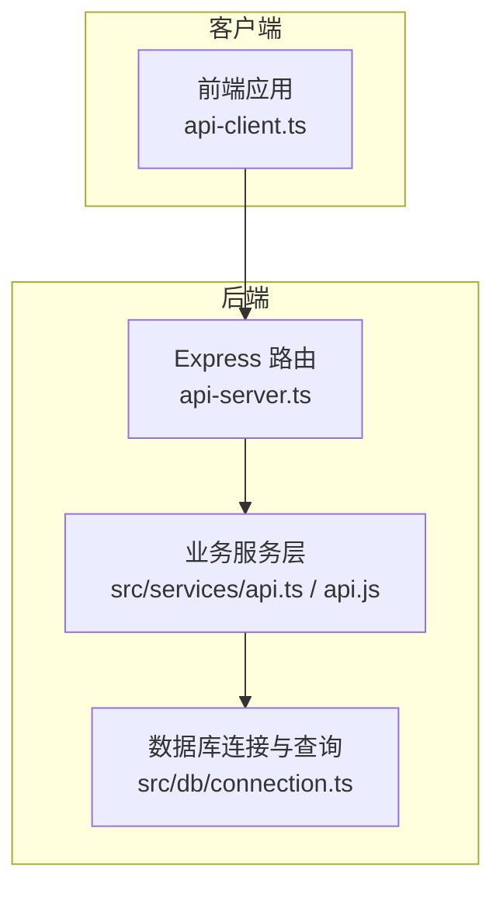
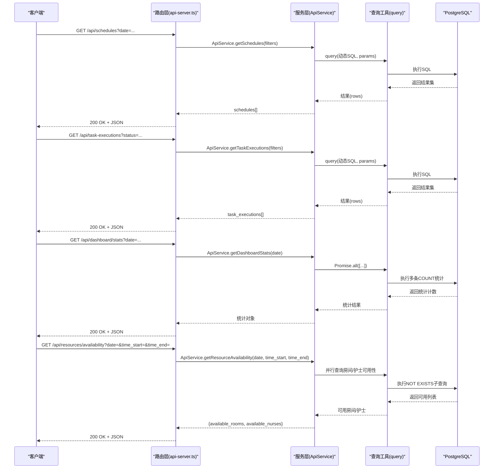
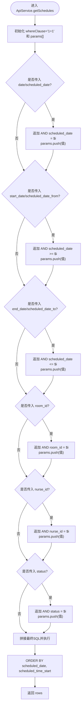
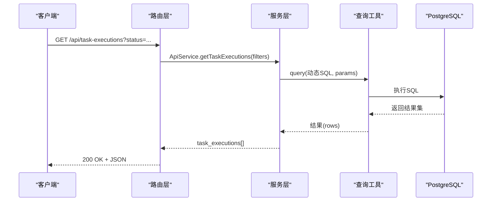
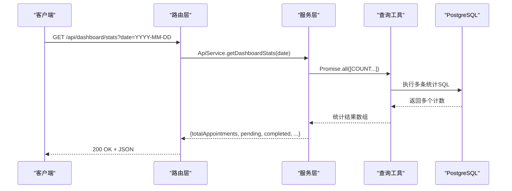
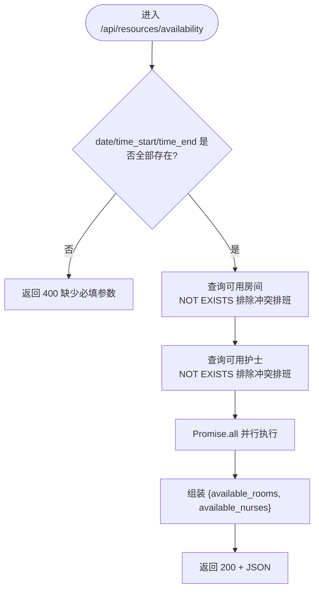
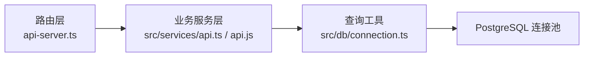

# 资源调度接口

<cite>
**本文引用的文件**
- [server/api-server.ts](file://server/api-server.ts)
- [server/src/services/api.js](file://server/src/services/api.js)
- [src/services/api.ts](file://src/services/api.ts)
- [src/db/connection.ts](file://src/db/connection.ts)
- [src/services/api-client.ts](file://src/services/api-client.ts)
- [src/types/types.ts](file://src/types/types.ts)
</cite>

## 目录
1. [简介](#简介)
2. [项目结构](#项目结构)
3. [核心组件](#核心组件)
4. [架构总览](#架构总览)
5. [详细组件分析](#详细组件分析)
6. [依赖关系分析](#依赖关系分析)
7. [性能考量](#性能考量)
8. [故障排查指南](#故障排查指南)
9. [结论](#结论)

## 简介
本文件面向Bio-Appointment系统的资源调度接口，聚焦以下四个RESTful端点：
- 获取排班：/api/schedules
- 获取任务执行：/api/task-executions
- 获取仪表板统计：/api/dashboard/stats
- 查询资源可用性：/api/resources/availability

文档将详细说明各接口的HTTP方法、URL路径、查询参数、响应数据结构与状态码；重点解析排班查询接口的动态SQL构建机制与WHERE条件组合；说明资源可用性检查接口的必填参数校验规则；并结合类型定义与数据库层实现，展示多表关联查询（排班关联预约、服务、资源、用户信息）及分页、排序等通用处理规范。

## 项目结构
后端采用Express服务，路由集中于server/api-server.ts，业务逻辑封装在server/src/services/api.js中；数据库访问通过src/db/connection.ts提供的连接池与查询工具；前端通过src/services/api-client.ts发起请求，统一携带鉴权头并拼装查询参数。

图表来源
- [server/api-server.ts](file://server/api-server.ts#L405-L475)
- [server/src/services/api.js](file://server/src/services/api.js#L166-L231)
- [src/db/connection.ts](file://src/db/connection.ts#L80-L115)

章节来源
- [server/api-server.ts](file://server/api-server.ts#L405-L475)
- [src/db/connection.ts](file://src/db/connection.ts#L80-L115)

## 核心组件
- Express路由层：负责接收HTTP请求、参数校验、调用业务服务、返回JSON响应。
- 业务服务层：封装数据库查询逻辑，提供动态WHERE构建、多表LEFT JOIN、统计聚合等能力。
- 数据库层：提供连接池、事务、健康检查与通用查询工具。

章节来源
- [server/api-server.ts](file://server/api-server.ts#L405-L475)
- [server/src/services/api.js](file://server/src/services/api.js#L166-L231)
- [src/db/connection.ts](file://src/db/connection.ts#L80-L115)

## 架构总览
下图展示了资源调度相关接口的端到端调用链路与数据流向。

图表来源
- [server/api-server.ts](file://server/api-server.ts#L405-L475)
- [server/src/services/api.js](file://server/src/services/api.js#L166-L231)
- [src/db/connection.ts](file://src/db/connection.ts#L80-L115)

## 详细组件分析

### 排班查询接口：/api/schedules
- 方法与路径
  - GET /api/schedules
- 查询参数
  - date 或 scheduled_date：单日过滤
  - start_date 或 scheduled_date_from：起始日期
  - end_date 或 scheduled_date_to：结束日期
  - room_id：房间ID过滤
  - nurse_id：护士ID过滤
  - status：排班状态过滤
- 响应
  - 数组：包含排班记录及其关联字段（客户名、服务ID、预估时长、房间名、房间类型、护士姓名、服务名称等）
- 状态码
  - 200：成功
  - 500：内部错误
- 动态SQL与WHERE组合
  - 服务层通过“1=1”作为基础条件，逐个判断传入参数是否为空，若非空则追加对应AND条件与占位符参数，最终形成可变长度的WHERE子句
  - 示例要点（基于实现逻辑）：
    - 若传入date/scheduled_date：追加“scheduled_date = $i”
    - 若传入start_date/scheduled_date_from：追加“scheduled_date >= $i”
    - 若传入end_date/scheduled_date_to：追加“scheduled_date <= $i”
    - 若传入room_id：追加“room_id = $i”
    - 若传入nurse_id：追加“nurse_id = $i”
    - 若传入status：追加“status = $i”
  - 最终ORDER BY scheduled_date, scheduled_time_start
- 多表关联
  - LEFT JOIN appointments、resources、profiles、services，返回带详情的排班集合
- 分页与排序
  - 该接口未显式实现LIMIT/OFFSET，但可通过日期范围参数控制返回规模；排序固定按日期与开始时间

图表来源
- [server/src/services/api.js](file://server/src/services/api.js#L166-L231)
- [src/services/api.ts](file://src/services/api.ts#L239-L303)

章节来源
- [server/api-server.ts](file://server/api-server.ts#L405-L418)
- [server/src/services/api.js](file://server/src/services/api.js#L166-L231)
- [src/services/api.ts](file://src/services/api.ts#L239-L303)

### 任务执行查询接口：/api/task-executions
- 方法与路径
  - GET /api/task-executions
- 查询参数
  - schedule_id：排班ID过滤
  - nurse_id：护士ID过滤
  - status：任务状态过滤
  - date：按排班日期过滤
- 响应
  - 数组：包含任务执行记录及其关联字段（排班日期、开始时间、客户名、服务ID、护士姓名等）
- 状态码
  - 200：成功
  - 500：内部错误
- 动态SQL与WHERE组合
  - 与排班查询类似，按传入参数追加条件，最终ORDER BY scheduled_date, scheduled_time_start
- 多表关联
  - LEFT JOIN schedules、appointments、profiles

图表来源
- [server/api-server.ts](file://server/api-server.ts#L421-L433)
- [server/src/services/api.js](file://server/src/services/api.js#L251-L289)
- [src/services/api.ts](file://src/services/api.ts#L327-L377)

章节来源
- [server/api-server.ts](file://server/api-server.ts#L421-L433)
- [server/src/services/api.js](file://server/src/services/api.js#L251-L289)
- [src/services/api.ts](file://src/services/api.ts#L327-L377)

### 仪表板统计接口：/api/dashboard/stats
- 方法与路径
  - GET /api/dashboard/stats
- 查询参数
  - date：统计日期（默认取当日）
- 响应
  - 对象：包含当天的预约总数、待处理预约数、已完成预约数、排班总数、任务总数、已完成任务数
- 状态码
  - 200：成功
  - 500：内部错误
- 业务逻辑
  - 通过Promise.all并发执行多条COUNT统计SQL，分别统计预约、排班、任务相关计数
  - 将字符串计数转换为数字返回

图表来源
- [server/api-server.ts](file://server/api-server.ts#L436-L448)
- [server/src/services/api.js](file://server/src/services/api.js#L353-L371)
- [src/services/api.ts](file://src/services/api.ts#L455-L481)

章节来源
- [server/api-server.ts](file://server/api-server.ts#L436-L448)
- [server/src/services/api.js](file://server/src/services/api.js#L353-L371)
- [src/services/api.ts](file://src/services/api.ts#L455-L481)

### 资源可用性查询接口：/api/resources/availability
- 方法与路径
  - GET /api/resources/availability
- 查询参数
  - date：必填（YYYY-MM-DD）
  - time_start：必填（HH:mm:ss）
  - time_end：必填（HH:mm:ss）
- 响应
  - 对象：包含可用房间列表与可用护士列表
- 状态码
  - 200：成功
  - 400：缺少必填参数
  - 500：内部错误
- 业务逻辑
  - 必填参数校验：若任一缺失，直接返回400
  - 并行查询：
    - 房间：type='room'且is_active=true且status='available'，且不存在与给定日期、时间段冲突的已发布/锁定排班
    - 护士：role IN ('nurse','head_nurse')且status='active'，且不存在与给定日期、时间段冲突的已发布/锁定排班
  - 冲突判定：时间段重叠判断（包含相交、包含、边界接触三种情形）

图表来源
- [server/api-server.ts](file://server/api-server.ts#L451-L475)
- [server/src/services/api.js](file://server/src/services/api.js#L305-L351)
- [src/services/api.ts](file://src/services/api.ts#L400-L453)

章节来源
- [server/api-server.ts](file://server/api-server.ts#L451-L475)
- [server/src/services/api.js](file://server/src/services/api.js#L305-L351)
- [src/services/api.ts](file://src/services/api.ts#L400-L453)

## 依赖关系分析
- 路由层依赖业务服务层；业务服务层依赖数据库查询工具；数据库查询工具依赖PostgreSQL连接池
- 排班查询与任务执行查询均使用动态WHERE构建与LEFT JOIN关联多表
- 资源可用性查询使用NOT EXISTS子查询进行冲突检测，并发查询房间与护士可用列表

图表来源
- [server/api-server.ts](file://server/api-server.ts#L405-L475)
- [server/src/services/api.js](file://server/src/services/api.js#L166-L231)
- [src/db/connection.ts](file://src/db/connection.ts#L80-L115)

章节来源
- [server/api-server.ts](file://server/api-server.ts#L405-L475)
- [server/src/services/api.js](file://server/src/services/api.js#L166-L231)
- [src/db/connection.ts](file://src/db/connection.ts#L80-L115)

## 性能考量
- 动态SQL构建
  - 通过“1=1”+条件追加的方式避免复杂分支，参数化查询防止注入风险
- 并发统计
  - 仪表板统计使用Promise.all并发执行多条COUNT查询，减少往返次数
- 冲突检测
  - 资源可用性查询使用NOT EXISTS子查询，配合索引可有效降低冲突扫描成本
- 排序与分页
  - 排班与任务执行接口固定按日期与时间排序；若数据量大，建议在数据库层面建立合适索引（如scheduled_date、scheduled_time_start、status等），并在上层增加分页参数（LIMIT/OFFSET）以控制返回规模

[本节为通用指导，无需特定文件引用]

## 故障排查指南
- 400 缺少必填参数
  - 现象：调用资源可用性接口时返回400
  - 排查：确认date、time_start、time_end三者均传入
- 500 内部错误
  - 现象：任意接口返回500
  - 排查：查看后端日志定位具体SQL或连接异常；检查数据库连接池初始化与健康检查
- 排班/任务查询无结果
  - 现象：返回空数组
  - 排查：核对查询参数（日期范围、状态、ID过滤）是否正确；确认数据库中是否存在匹配记录
- 时间段冲突
  - 现象：资源可用性查询返回空列表
  - 排查：确认时间段重叠判定逻辑；检查排班状态是否为published/locked

章节来源
- [server/api-server.ts](file://server/api-server.ts#L451-L475)
- [src/db/connection.ts](file://src/db/connection.ts#L116-L146)

## 结论
本文档梳理了Bio-Appointment系统资源调度相关的核心RESTful接口，明确了各接口的参数、响应与状态码；深入解析了排班查询的动态SQL构建机制与多表关联实现；强调了资源可用性查询的必填参数校验与冲突检测逻辑；并提供了性能与故障排查建议。建议在生产环境中为高频查询字段建立索引，并在上层引入分页参数以控制返回规模。