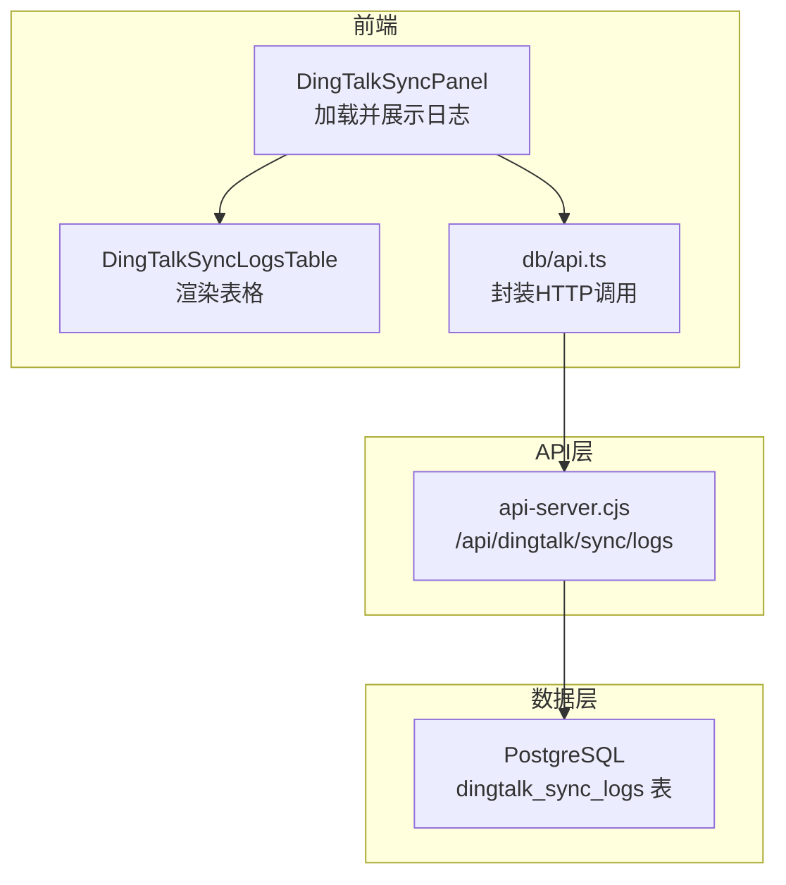
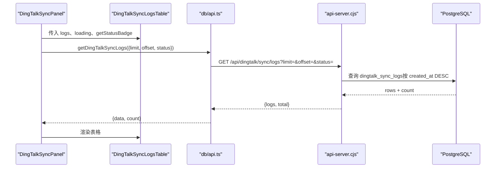
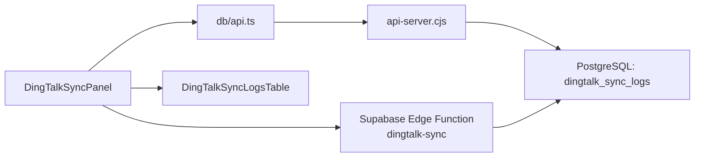

# 同步日志查询

<cite>
**本文引用的文件**
- [server/api-server.cjs](file://server/api-server.cjs)
- [src/db/api.ts](file://src/db/api.ts)
- [src/components/dingtalk/DingTalkSyncLogsTable.tsx](file://src/components/dingtalk/DingTalkSyncLogsTable.tsx)
- [src/components/dingtalk/DingTalkSyncPanel.tsx](file://src/components/dingtalk/DingTalkSyncPanel.tsx)
- [database/init/04-dingtalk-sync-tables.sql](file://database/init/04-dingtalk-sync-tables.sql)
- [supabase/functions/dingtalk-sync/index.ts](file://supabase/functions/dingtalk-sync/index.ts)
</cite>

## 目录
1. [简介](#简介)
2. [项目结构](#项目结构)
3. [核心组件](#核心组件)
4. [架构总览](#架构总览)
5. [详细组件分析](#详细组件分析)
6. [依赖关系分析](#依赖关系分析)
7. [性能考量](#性能考量)
8. [故障排查指南](#故障排查指南)
9. [结论](#结论)
10. [附录](#附录)

## 简介
本文档系统性地文档化 GET /api/dingtalk/sync/logs 接口的实现与使用，涵盖：
- 从 dingtalk_sync_logs 表查询同步历史记录的流程
- 分页参数（limit、offset）的处理逻辑与默认值
- 响应数据结构的关键字段：sync_type（manual/auto/incremental）、status（pending/running/success/failed/partial）、统计指标（total_users、success_count、failed_count、skipped_count）以及时间戳（started_at、completed_at）
- 前端 DingTalkSyncLogsTable 组件的渲染逻辑，包括状态标签的颜色编码与时间格式化
- 实际 API 调用示例：如何获取最近 N 条同步记录
- 错误处理机制：数据库查询失败时返回 500 状态码与错误信息

## 项目结构
该功能涉及三层：
- 前端：React 组件负责展示与交互
- API 层：Node.js 服务器提供 REST 接口
- 数据层：PostgreSQL 表 dingtalk_sync_logs 存储同步日志

图表来源
- [src/components/dingtalk/DingTalkSyncPanel.tsx](file://src/components/dingtalk/DingTalkSyncPanel.tsx#L1-L120)
- [src/components/dingtalk/DingTalkSyncLogsTable.tsx](file://src/components/dingtalk/DingTalkSyncLogsTable.tsx#L1-L91)
- [src/db/api.ts](file://src/db/api.ts#L1380-L1418)
- [server/api-server.cjs](file://server/api-server.cjs#L1443-L1483)
- [database/init/04-dingtalk-sync-tables.sql](file://database/init/04-dingtalk-sync-tables.sql#L43-L60)

章节来源
- [src/components/dingtalk/DingTalkSyncPanel.tsx](file://src/components/dingtalk/DingTalkSyncPanel.tsx#L1-L120)
- [src/components/dingtalk/DingTalkSyncLogsTable.tsx](file://src/components/dingtalk/DingTalkSyncLogsTable.tsx#L1-L91)
- [src/db/api.ts](file://src/db/api.ts#L1380-L1418)
- [server/api-server.cjs](file://server/api-server.cjs#L1443-L1483)
- [database/init/04-dingtalk-sync-tables.sql](file://database/init/04-dingtalk-sync-tables.sql#L43-L60)

## 核心组件
- 后端接口：GET /api/dingtalk/sync/logs
  - 解析查询参数：limit、offset、status
  - 构造 SQL 查询，按 created_at 降序排序，支持按 status 过滤
  - 返回 logs 数组与 total 计数
  - 异常时返回 500 与错误信息
- 前端服务：db/api.ts 的 getDingTalkSyncLogs
  - 将 limit/offset/status 转换为查询字符串
  - 发起 GET 请求并转换响应格式为 { data, count }
- 前端表格：DingTalkSyncLogsTable
  - 渲染同步时间、类型、状态、统计指标与操作人
  - 使用 getStatusBadge 对状态进行颜色编码
  - 时间字段使用本地化格式化

章节来源
- [server/api-server.cjs](file://server/api-server.cjs#L1443-L1483)
- [src/db/api.ts](file://src/db/api.ts#L1380-L1418)
- [src/components/dingtalk/DingTalkSyncLogsTable.tsx](file://src/components/dingtalk/DingTalkSyncLogsTable.tsx#L1-L91)

## 架构总览
下图展示了从前端到后端再到数据库的数据流与控制流。

图表来源
- [src/components/dingtalk/DingTalkSyncPanel.tsx](file://src/components/dingtalk/DingTalkSyncPanel.tsx#L54-L64)
- [src/db/api.ts](file://src/db/api.ts#L1380-L1418)
- [server/api-server.cjs](file://server/api-server.cjs#L1443-L1483)

## 详细组件分析

### 后端接口：GET /api/dingtalk/sync/logs
- 查询参数解析
  - limit：默认值 20；用于限制返回条目数量
  - offset：默认值 0；用于分页偏移
  - status：可选；按状态过滤
- 查询逻辑
  - 基础查询：从 dingtalk_sync_logs 左连接 profiles 获取创建者用户名与全名
  - 可选过滤：若提供 status，则添加 WHERE 条件
  - 排序与分页：ORDER BY created_at DESC，LIMIT $1 OFFSET $2
  - 总量统计：根据是否带 status 决定 COUNT 查询
- 响应结构
  - logs：查询结果行数组
  - total：满足条件的总记录数
- 错误处理
  - 捕获异常并返回 500，包含 error 与 message 字段

章节来源
- [server/api-server.cjs](file://server/api-server.cjs#L1443-L1483)
- [database/init/04-dingtalk-sync-tables.sql](file://database/init/04-dingtalk-sync-tables.sql#L43-L60)

### 前端服务：getDingTalkSyncLogs
- 参数映射
  - limit/offset/status 映射为查询字符串
- 请求与响应
  - 发送 GET 请求至 /api/dingtalk/sync/logs
  - 若 response.ok 为 false，抛出错误
  - 正常响应时转换为 { data, count }，其中 data 为 logs 数组，count 为 total
- 调用方
  - DingTalkSyncPanel 在初始化与刷新时调用，设置 isLoadingLogs 并更新 logs

章节来源
- [src/db/api.ts](file://src/db/api.ts#L1380-L1418)
- [src/components/dingtalk/DingTalkSyncPanel.tsx](file://src/components/dingtalk/DingTalkSyncPanel.tsx#L54-L64)

### 前端表格：DingTalkSyncLogsTable
- 渲染列
  - 同步时间：started_at 使用本地化格式化
  - 类型：sync_type 的中文映射（manual/auto/incremental）
  - 状态：通过 getStatusBadge 返回带颜色与图标的 Badge
  - 统计指标：total_users、success_count、failed_count、skipped_count
  - 操作人：created_by_profile 的 full_name 或 username
- 状态标签颜色编码
  - success：绿色
  - failed：红色
  - running：蓝色（带旋转图标）
  - partial：黄色
  - 其他：灰色（带时钟图标）
- 时间格式化
  - 使用 new Date(x).toLocaleString('zh-CN')

章节来源
- [src/components/dingtalk/DingTalkSyncLogsTable.tsx](file://src/components/dingtalk/DingTalkSyncLogsTable.tsx#L1-L91)
- [src/components/dingtalk/DingTalkSyncPanel.tsx](file://src/components/dingtalk/DingTalkSyncPanel.tsx#L105-L118)

### 数据模型：dingtalk_sync_logs
- 关键字段
  - id、sync_type（枚举：manual/auto/incremental）、status（枚举：pending/running/success/failed/partial）
  - total_users、success_count、failed_count、skipped_count
  - error_message、details（JSONB）
  - started_at、completed_at、created_by、created_at
- 索引
  - idx_sync_logs_status、idx_sync_logs_created_at、idx_sync_logs_created_by

章节来源
- [database/init/04-dingtalk-sync-tables.sql](file://database/init/04-dingtalk-sync-tables.sql#L43-L81)

### 同步流程对日志的影响
- 触发同步时会向 dingtalk_sync_logs 插入一条状态为 running 的记录
- 同步完成后根据结果更新为 success/failed/partial，并填充统计指标与完成时间
- 该流程由 Supabase Edge Function 执行，最终更新数据库

章节来源
- [supabase/functions/dingtalk-sync/index.ts](file://supabase/functions/dingtalk-sync/index.ts#L110-L125)
- [supabase/functions/dingtalk-sync/index.ts](file://supabase/functions/dingtalk-sync/index.ts#L308-L334)

## 依赖关系分析
- 组件耦合
  - DingTalkSyncPanel 依赖 db/api.ts 提供的 getDingTalkSyncLogs
  - DingTalkSyncLogsTable 依赖 DingTalkSyncPanel 传入的 logs、loading 与 getStatusBadge
  - db/api.ts 依赖浏览器 fetch 与本地存储的访问令牌
- 数据库依赖
  - /api/dingtalk/sync/logs 依赖 dingtalk_sync_logs 表结构与索引
- 外部依赖
  - Supabase Edge Function 负责实际的钉钉 API 调用与日志更新

图表来源
- [src/components/dingtalk/DingTalkSyncPanel.tsx](file://src/components/dingtalk/DingTalkSyncPanel.tsx#L1-L120)
- [src/db/api.ts](file://src/db/api.ts#L1380-L1418)
- [server/api-server.cjs](file://server/api-server.cjs#L1443-L1483)
- [database/init/04-dingtalk-sync-tables.sql](file://database/init/04-dingtalk-sync-tables.sql#L43-L60)
- [supabase/functions/dingtalk-sync/index.ts](file://supabase/functions/dingtalk-sync/index.ts#L110-L125)

## 性能考量
- 分页与排序
  - 使用 created_at DESC 排序，避免全表扫描
  - 建议在 created_at 上建立索引（已存在）
- 过滤
  - status 过滤会触发额外的 COUNT 查询；建议在 status 上建立索引（已存在）
- 前端渲染
  - 大量数据时建议使用虚拟滚动或分页控件优化渲染性能
- 数据库负载
  - 高频查询时可考虑缓存最近 N 条日志或增加只读副本

章节来源
- [database/init/04-dingtalk-sync-tables.sql](file://database/init/04-dingtalk-sync-tables.sql#L75-L81)
- [server/api-server.cjs](file://server/api-server.cjs#L1443-L1483)

## 故障排查指南
- 数据库查询失败
  - 后端捕获异常并返回 500，包含 error 与 message
  - 前端 db/api.ts 在 response.ok 为 false 时抛出错误
- 常见原因
  - 数据库连接异常
  - 查询语法或索引缺失导致慢查询
  - 前端网络问题或鉴权失败
- 建议排查步骤
  - 检查后端日志中的错误堆栈
  - 确认数据库连接与索引是否存在
  - 在浏览器开发者工具中查看请求与响应
  - 确认 Authorization 头是否正确传递

章节来源
- [server/api-server.cjs](file://server/api-server.cjs#L1476-L1483)
- [src/db/api.ts](file://src/db/api.ts#L1380-L1418)

## 结论
GET /api/dingtalk/sync/logs 提供了对钉钉同步历史的高效查询能力，结合分页与过滤，能够满足管理后台对同步记录的浏览需求。前端通过 DingTalkSyncLogsTable 完成直观展示，并通过颜色编码与本地化时间格式提升可读性。整体实现遵循清晰的前后端职责划分，具备良好的扩展性与可维护性。

## 附录

### API 定义与示例
- 端点：GET /api/dingtalk/sync/logs
- 查询参数
  - limit：数字，默认 20
  - offset：数字，默认 0
  - status：可选，枚举值来自数据库定义
- 响应体
  - logs：数组，每项包含：
    - id、sync_type、status、total_users、success_count、failed_count、skipped_count、error_message、details、started_at、completed_at、created_by、created_at
    - created_by_profile：可选，包含 username、full_name
  - total：满足条件的总记录数
- 示例
  - 获取最近 5 次同步记录
    - 请求：GET /api/dingtalk/sync/logs?limit=5&offset=0
    - 响应：logs 为最近 5 条，total 为满足条件的总条数
  - 按状态过滤
    - 请求：GET /api/dingtalk/sync/logs?status=success&limit=20&offset=0
    - 响应：仅包含状态为 success 的记录

章节来源
- [server/api-server.cjs](file://server/api-server.cjs#L1443-L1483)
- [src/db/api.ts](file://src/db/api.ts#L1380-L1418)
- [database/init/04-dingtalk-sync-tables.sql](file://database/init/04-dingtalk-sync-tables.sql#L43-L60)

### 前端渲染要点
- 状态标签颜色
  - success：绿色
  - failed：红色
  - running：蓝色（带旋转图标）
  - partial：黄色
  - 其他：灰色（带时钟图标）
- 时间格式化
  - 使用 new Date(x).toLocaleString('zh-CN')
- 统计指标
  - total_users、success_count、failed_count、skipped_count 以右对齐展示，分别使用绿色、红色、黄色强调

章节来源
- [src/components/dingtalk/DingTalkSyncLogsTable.tsx](file://src/components/dingtalk/DingTalkSyncLogsTable.tsx#L1-L91)
- [src/components/dingtalk/DingTalkSyncPanel.tsx](file://src/components/dingtalk/DingTalkSyncPanel.tsx#L105-L118)