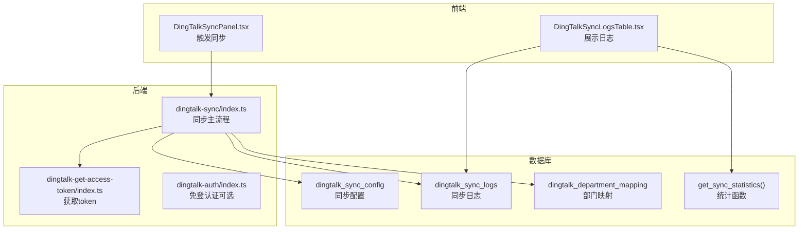
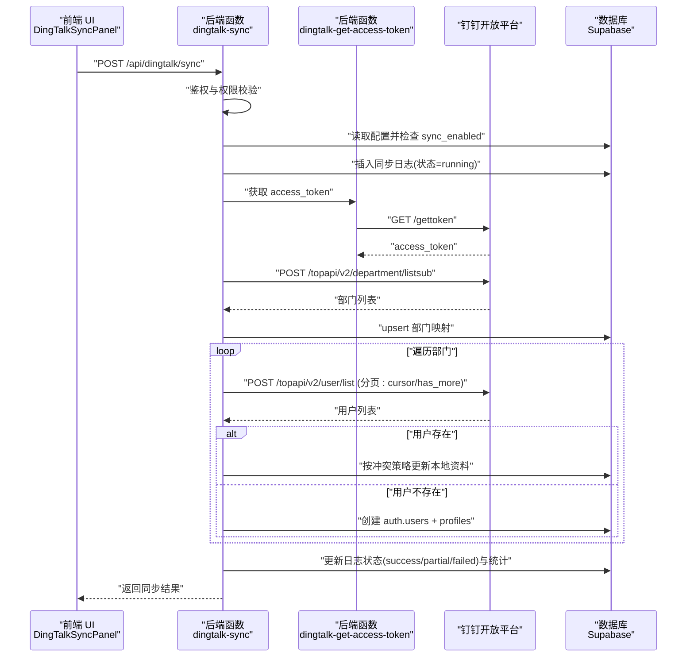
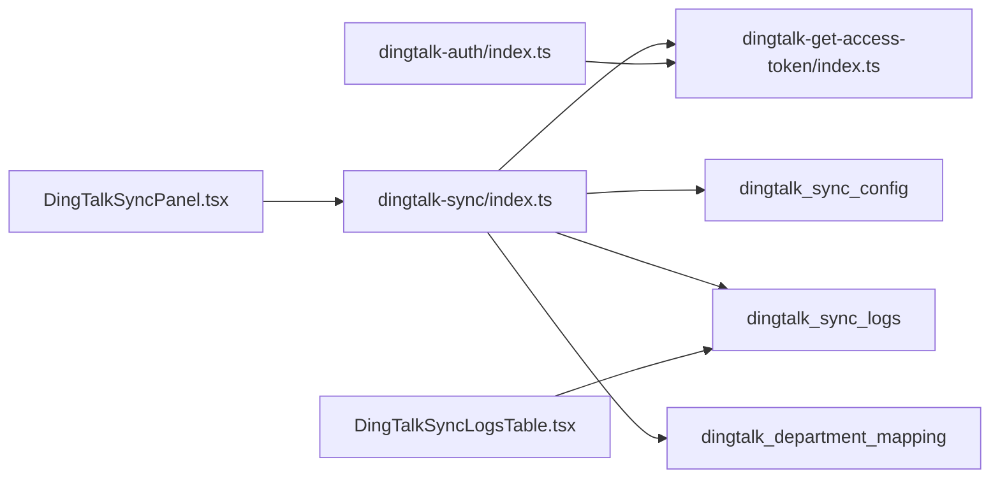
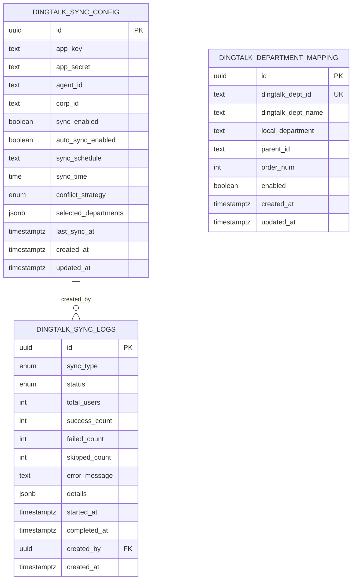
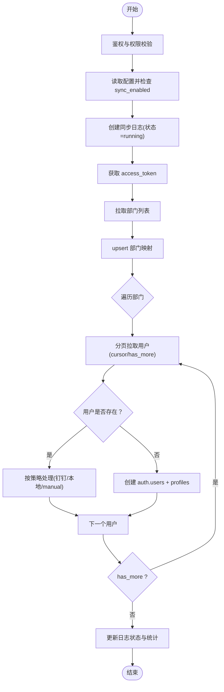

# 同步流程详解

<cite>
**本文引用的文件**
- [supabase/functions/dingtalk-sync/index.ts](file://supabase/functions/dingtalk-sync/index.ts)
- [supabase/functions/dingtalk-get-access-token/index.ts](file://supabase/functions/dingtalk-get-access-token/index.ts)
- [supabase/functions/dingtalk-auth/index.ts](file://supabase/functions/dingtalk-auth/index.ts)
- [database/init/04-dingtalk-sync-tables.sql](file://database/init/04-dingtalk-sync-tables.sql)
- [supabase/migrations/00010_create_dingtalk_sync_tables.sql](file://supabase/migrations/00010_create_dingtalk_sync_tables.sql)
- [src/components/dingtalk/DingTalkSyncPanel.tsx](file://src/components/dingtalk/DingTalkSyncPanel.tsx)
- [src/components/dingtalk/DingTalkSyncLogsTable.tsx](file://src/components/dingtalk/DingTalkSyncLogsTable.tsx)
- [src/types/types.ts](file://src/types/types.ts)
- [src/utils/dingtalk.ts](file://src/utils/dingtalk.ts)
</cite>

## 目录
1. [简介](#简介)
2. [项目结构](#项目结构)
3. [核心组件](#核心组件)
4. [架构总览](#架构总览)
5. [详细组件分析](#详细组件分析)
6. [依赖关系分析](#依赖关系分析)
7. [性能考量](#性能考量)
8. [故障排查指南](#故障排查指南)
9. [结论](#结论)
10. [附录](#附录)

## 简介
本文围绕“钉钉通讯录同步”的完整执行流程展开，自调用 POST /api/dingtalk/sync 接口开始，逐层拆解从鉴权校验、配置检查、日志记录，到 access_token 获取、部门列表拉取与映射、用户分页拉取与冲突处理、最终日志状态更新与统计汇总的全过程。同时补充了前端触发入口、日志展示与统计接口的配合关系，帮助读者全面理解该功能在系统中的位置与协作方式。

## 项目结构
- 后端同步逻辑位于 Supabase Edge Functions 中，核心为钉钉同步函数与 access_token 辅助函数。
- 数据库侧维护钉钉同步配置、同步日志与部门映射三张表，包含枚举类型与统计函数。
- 前端提供“钉钉同步面板”，负责触发同步、展示日志与统计信息。

图表来源
- [supabase/functions/dingtalk-sync/index.ts](file://supabase/functions/dingtalk-sync/index.ts#L1-L384)
- [supabase/functions/dingtalk-get-access-token/index.ts](file://supabase/functions/dingtalk-get-access-token/index.ts#L1-L121)
- [supabase/functions/dingtalk-auth/index.ts](file://supabase/functions/dingtalk-auth/index.ts#L1-L248)
- [database/init/04-dingtalk-sync-tables.sql](file://database/init/04-dingtalk-sync-tables.sql#L1-L131)
- [supabase/migrations/00010_create_dingtalk_sync_tables.sql](file://supabase/migrations/00010_create_dingtalk_sync_tables.sql#L1-L189)

章节来源
- [supabase/functions/dingtalk-sync/index.ts](file://supabase/functions/dingtalk-sync/index.ts#L1-L384)
- [database/init/04-dingtalk-sync-tables.sql](file://database/init/04-dingtalk-sync-tables.sql#L1-L131)
- [supabase/migrations/00010_create_dingtalk_sync_tables.sql](file://supabase/migrations/00010_create_dingtalk_sync_tables.sql#L1-L189)

## 核心组件
- 钉钉同步主流程函数：负责鉴权、配置检查、创建同步日志、获取 access_token、拉取部门列表并写入映射、遍历部门分页拉取用户、按冲突策略处理、更新日志与统计。
- access_token 辅助函数：封装钉钉 token 获取与缓存逻辑，供同步流程复用。
- 前端同步面板：提供触发入口、读取配置、展示日志与统计。
- 数据库表与统计函数：维护同步配置、日志与部门映射，提供最近30天统计聚合。

章节来源
- [supabase/functions/dingtalk-sync/index.ts](file://supabase/functions/dingtalk-sync/index.ts#L1-L384)
- [supabase/functions/dingtalk-get-access-token/index.ts](file://supabase/functions/dingtalk-get-access-token/index.ts#L1-L121)
- [src/components/dingtalk/DingTalkSyncPanel.tsx](file://src/components/dingtalk/DingTalkSyncPanel.tsx#L1-L237)
- [src/components/dingtalk/DingTalkSyncLogsTable.tsx](file://src/components/dingtalk/DingTalkSyncLogsTable.tsx#L1-L91)
- [database/init/04-dingtalk-sync-tables.sql](file://database/init/04-dingtalk-sync-tables.sql#L1-L131)
- [supabase/migrations/00010_create_dingtalk_sync_tables.sql](file://supabase/migrations/00010_create_dingtalk_sync_tables.sql#L1-L189)

## 架构总览
下图展示了从前端触发到后端执行再到数据库落盘的整体调用链路与数据流向。

图表来源
- [supabase/functions/dingtalk-sync/index.ts](file://supabase/functions/dingtalk-sync/index.ts#L1-L384)
- [supabase/functions/dingtalk-get-access-token/index.ts](file://supabase/functions/dingtalk-get-access-token/index.ts#L1-L121)

## 详细组件分析

### 1) 鉴权与配置检查
- 鉴权：从 Authorization 头中提取 Bearer Token，调用 Supabase getUser 校验有效性。
- 权限：读取 profiles 表 role 字段，仅超级管理员可执行同步。
- 配置：读取 dingtalk_sync_config，检查 sync_enabled；若未启用则抛错。
- 日志：创建 dingtalk_sync_logs 记录，初始状态为 running，记录触发者与开始时间。

章节来源
- [supabase/functions/dingtalk-sync/index.ts](file://supabase/functions/dingtalk-sync/index.ts#L60-L125)
- [database/init/04-dingtalk-sync-tables.sql](file://database/init/04-dingtalk-sync-tables.sql#L25-L61)

### 2) 获取 access_token 的实现细节
- 请求 URL 构造：GET https://oapi.dingtalk.com/gettoken?appkey=...&appsecret=...
- 参数编码：使用查询字符串拼接 appkey 与 appsecret。
- 错误处理：响应非 2xx、errcode 不为 0、或未返回 access_token 时抛错。
- 缓存策略：在 Edge Function 内部维护内存缓存，提前 5 分钟过期，避免频繁请求钉钉接口。

章节来源
- [supabase/functions/dingtalk-sync/index.ts](file://supabase/functions/dingtalk-sync/index.ts#L126-L140)
- [supabase/functions/dingtalk-get-access-token/index.ts](file://supabase/functions/dingtalk-get-access-token/index.ts#L1-L121)

### 3) 获取部门列表与部门映射
- API 调用：POST https://oapi.dingtalk.com/topapi/v2/department/listsub?access_token=...，body 传入 dept_id=1（根部门）。
- 数据处理：遍历返回的部门列表，upsert 写入 dingtalk_department_mapping，字段包括 dingtalk_dept_id、name、parent_id、order_num、enabled。
- 索引与约束：表含唯一索引 dingtalk_dept_id，便于幂等 upsert。

章节来源
- [supabase/functions/dingtalk-sync/index.ts](file://supabase/functions/dingtalk-sync/index.ts#L141-L174)
- [database/init/04-dingtalk-sync-tables.sql](file://database/init/04-dingtalk-sync-tables.sql#L63-L73)

### 4) 用户同步全流程
- 部门范围：若前端传入 selected_departments，则按其同步；否则使用本次拉取到的全部部门。
- 分页机制：每次请求携带 cursor 与 size=100，has_more 为真时继续循环。
- 用户存在性检查：按 username=user.userid 查询 profiles，若存在则按冲突策略处理；若不存在则创建新用户。
- 冲突策略：
  - dingtalk_first：以钉钉数据为准，更新本地资料。
  - local_first：保留本地数据，跳过更新。
  - manual：记录冲突，跳过更新（由人工介入）。
- 用户创建：先在 auth.users 中创建用户（email、password、metadata），再在 profiles 中插入对应记录（role、department 等）。
- 失败收集：将失败用户加入 details.failed_details，便于后续查看。

章节来源
- [supabase/functions/dingtalk-sync/index.ts](file://supabase/functions/dingtalk-sync/index.ts#L175-L306)
- [src/types/types.ts](file://src/types/types.ts#L283-L322)

### 5) 日志状态更新与统计
- 状态判定：若无失败则 success，若有成功则 partial，否则 failed。
- 字段填充：total_users、success_count、failed_count、skipped_count、details（含 departments_synced、failed_details）、completed_at。
- 最后同步时间：更新 dingtalk_sync_config.last_sync_at。
- 统计接口：提供 get_sync_statistics() 聚合最近30天的同步次数、成功/失败次数与总同步人数。

章节来源
- [supabase/functions/dingtalk-sync/index.ts](file://supabase/functions/dingtalk-sync/index.ts#L308-L334)
- [database/init/04-dingtalk-sync-tables.sql](file://database/init/04-dingtalk-sync-tables.sql#L104-L126)

### 6) 前端触发与展示
- 触发入口：DingTalkSyncPanel 读取配置与统计，点击“立即同步”调用 triggerDingTalkSync，传入 sync_type、selected_departments、conflict_strategy。
- 日志展示：DingTalkSyncLogsTable 展示最近日志，包含状态徽章、总数/成功/失败/跳过等列。
- 钉钉 JSAPI：src/utils/dingtalk.ts 提供在钉钉环境内的 JSAPI 能力封装（与同步流程同属“钉钉集成”范畴，但不参与同步主流程）。

章节来源
- [src/components/dingtalk/DingTalkSyncPanel.tsx](file://src/components/dingtalk/DingTalkSyncPanel.tsx#L1-L237)
- [src/components/dingtalk/DingTalkSyncLogsTable.tsx](file://src/components/dingtalk/DingTalkSyncLogsTable.tsx#L1-L91)
- [src/utils/dingtalk.ts](file://src/utils/dingtalk.ts#L1-L329)

## 依赖关系分析
- 同步主流程依赖 access_token 辅助函数，减少重复请求与缓存开销。
- 同步主流程依赖数据库表：dingtalk_sync_config、dingtalk_sync_logs、dingtalk_department_mapping。
- 前端组件依赖后端接口：触发同步、读取配置、读取日志、读取统计。
- 钉钉免登认证函数与同步流程相互独立，但共享 access_token 获取能力。

图表来源
- [supabase/functions/dingtalk-sync/index.ts](file://supabase/functions/dingtalk-sync/index.ts#L1-L384)
- [supabase/functions/dingtalk-get-access-token/index.ts](file://supabase/functions/dingtalk-get-access-token/index.ts#L1-L121)
- [supabase/functions/dingtalk-auth/index.ts](file://supabase/functions/dingtalk-auth/index.ts#L1-L248)
- [database/init/04-dingtalk-sync-tables.sql](file://database/init/04-dingtalk-sync-tables.sql#L1-L131)
- [src/components/dingtalk/DingTalkSyncPanel.tsx](file://src/components/dingtalk/DingTalkSyncPanel.tsx#L1-L237)
- [src/components/dingtalk/DingTalkSyncLogsTable.tsx](file://src/components/dingtalk/DingTalkSyncLogsTable.tsx#L1-L91)

## 性能考量
- access_token 缓存：在 Edge Function 内部缓存，避免频繁请求钉钉接口，提升整体吞吐。
- 分页拉取：用户列表按 100 人/页分页，has_more 控制循环，避免一次性拉取过多导致超时。
- upsert 写入：部门映射使用 on conflict upsert，避免重复写入带来的额外开销。
- 统计聚合：get_sync_statistics() 在数据库侧聚合，减少前端复杂计算。

章节来源
- [supabase/functions/dingtalk-get-access-token/index.ts](file://supabase/functions/dingtalk-get-access-token/index.ts#L1-L121)
- [supabase/functions/dingtalk-sync/index.ts](file://supabase/functions/dingtalk-sync/index.ts#L175-L306)
- [database/init/04-dingtalk-sync-tables.sql](file://database/init/04-dingtalk-sync-tables.sql#L104-L126)

## 故障排查指南
- 鉴权失败：确认 Authorization 头有效且用户为 super_admin。
- 配置未启用：检查 dingtalk_sync_config.sync_enabled 是否为 true。
- access_token 获取失败：检查 app_key/app_secret 是否正确，或查看缓存是否过期。
- 部门/用户拉取失败：关注 errcode 与 errmsg，确认网络可达与参数正确。
- 用户创建失败：检查 auth.users 与 profiles 插入逻辑，核对 email/password 与 metadata。
- 日志状态异常：确认同步结束后的状态更新逻辑是否执行，检查 details.failed_details 是否有记录。

章节来源
- [supabase/functions/dingtalk-sync/index.ts](file://supabase/functions/dingtalk-sync/index.ts#L60-L125)
- [supabase/functions/dingtalk-sync/index.ts](file://supabase/functions/dingtalk-sync/index.ts#L126-L140)
- [supabase/functions/dingtalk-sync/index.ts](file://supabase/functions/dingtalk-sync/index.ts#L141-L174)
- [supabase/functions/dingtalk-sync/index.ts](file://supabase/functions/dingtalk-sync/index.ts#L175-L306)
- [supabase/functions/dingtalk-sync/index.ts](file://supabase/functions/dingtalk-sync/index.ts#L308-L334)

## 结论
该同步流程以“最小权限+幂等写入+分页拉取+冲突策略”为核心设计原则，既保证了与钉钉组织架构的准确对齐，又兼顾了本地系统的稳定性与可观测性。通过 access_token 缓存与 upsert 写入，显著降低了外部依赖与数据库写入成本；通过日志与统计接口，实现了对同步质量的持续监控与改进。

## 附录

### A. 数据模型概览

图表来源
- [database/init/04-dingtalk-sync-tables.sql](file://database/init/04-dingtalk-sync-tables.sql#L1-L131)
- [supabase/migrations/00010_create_dingtalk_sync_tables.sql](file://supabase/migrations/00010_create_dingtalk_sync_tables.sql#L1-L189)

### B. 用户同步算法流程图

图表来源
- [supabase/functions/dingtalk-sync/index.ts](file://supabase/functions/dingtalk-sync/index.ts#L126-L334)