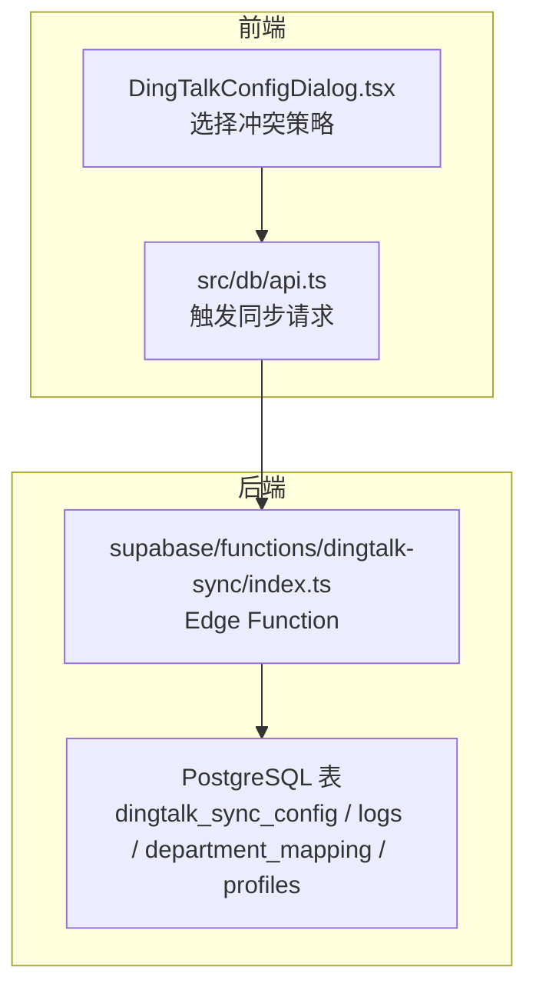
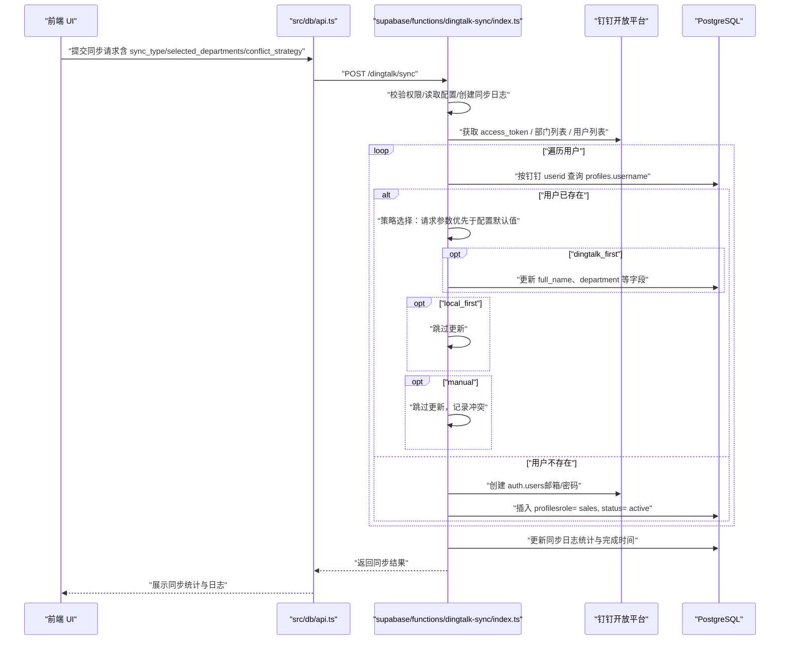
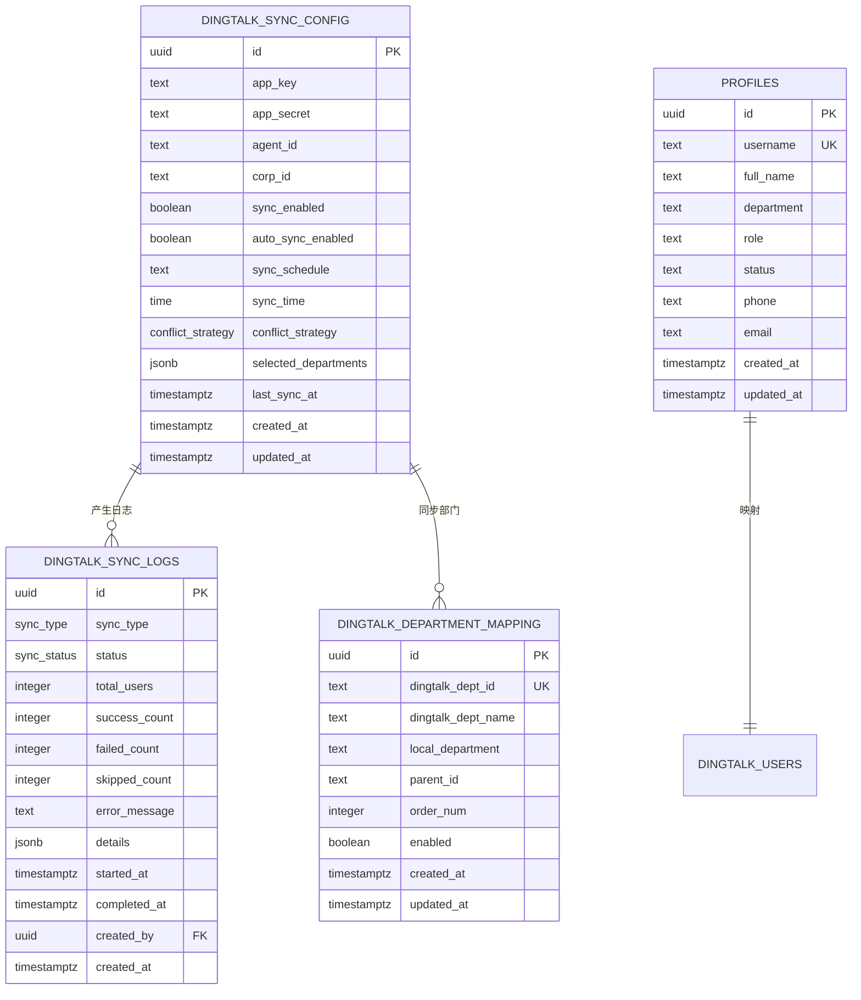

# 数据冲突解决策略

<cite>
**本文引用的文件**
- [supabase/functions/dingtalk-sync/index.ts](file://supabase/functions/dingtalk-sync/index.ts)
- [DINGTALK_SYNC_IMPLEMENTATION.md](file://DINGTALK_SYNC_IMPLEMENTATION.md)
- [supabase/migrations/00010_create_dingtalk_sync_tables.sql](file://supabase/migrations/00010_create_dingtalk_sync_tables.sql)
- [supabase/migrations/00009_create_dingtalk_integration_tables.sql](file://supabase/migrations/00009_create_dingtalk_integration_tables.sql)
- [supabase/migrations/00007_update_profiles_structure_and_auth.sql](file://supabase/migrations/00007_update_profiles_structure_and_auth.sql)
- [src/components/dingtalk/DingTalkConfigDialog.tsx](file://src/components/dingtalk/DingTalkConfigDialog.tsx)
- [src/db/api.ts](file://src/db/api.ts)
- [server/api-server.cjs](file://server/api-server.cjs)
</cite>

## 目录
1. [简介](#简介)
2. [项目结构](#项目结构)
3. [核心组件](#核心组件)
4. [架构总览](#架构总览)
5. [详细组件分析](#详细组件分析)
6. [依赖分析](#依赖分析)
7. [性能考虑](#性能考虑)
8. [故障排查指南](#故障排查指南)
9. [结论](#结论)

## 简介
本文聚焦“钉钉同步中的数据冲突解决机制”，围绕三种策略（dingtalk_first、local_first、manual）在代码中的实现进行深入解析，并结合字段映射规则与新用户创建的默认设置，帮助读者理解系统在检测到用户名已存在时的处理流程。同时，文档提供策略选择优先级逻辑（请求参数优先于配置默认值）的定位路径，便于快速查阅。

## 项目结构
- 同步逻辑由 Supabase Edge Function 承载，负责拉取钉钉数据、处理冲突策略、创建/更新用户资料与同步日志。
- 前端提供配置面板，允许管理员选择冲突策略与同步范围。
- 数据库包含同步配置、同步日志、部门映射等表，以及 profiles 表承载用户核心信息。

图表来源
- [src/components/dingtalk/DingTalkConfigDialog.tsx](file://src/components/dingtalk/DingTalkConfigDialog.tsx#L257-L301)
- [src/db/api.ts](file://src/db/api.ts#L1351-L1369)
- [supabase/functions/dingtalk-sync/index.ts](file://supabase/functions/dingtalk-sync/index.ts#L1-L384)
- [supabase/migrations/00010_create_dingtalk_sync_tables.sql](file://supabase/migrations/00010_create_dingtalk_sync_tables.sql#L63-L119)

章节来源
- [DINGTALK_SYNC_IMPLEMENTATION.md](file://DINGTALK_SYNC_IMPLEMENTATION.md#L1-L120)
- [src/components/dingtalk/DingTalkConfigDialog.tsx](file://src/components/dingtalk/DingTalkConfigDialog.tsx#L257-L301)
- [src/db/api.ts](file://src/db/api.ts#L1351-L1369)
- [supabase/functions/dingtalk-sync/index.ts](file://supabase/functions/dingtalk-sync/index.ts#L1-L120)

## 核心组件
- 冲突策略定义与默认值
  - 冲突策略枚举类型包含：dingtalk_first、local_first、manual。
  - 配置表中提供默认策略字段，若请求未显式传入，则采用配置默认值。
- 字段映射规则
  - 钉钉 userid → 系统 username
  - 钉钉 name → 系统 full_name
  - 钉钉 dept_id_list[0] → 系统 department（通过部门映射表转换为本地部门名称）
- 新用户创建默认设置
  - 角色：sales
  - 状态：active
  - 密码：优先使用钉钉用户 mobile，否则使用默认密码“123456”

章节来源
- [supabase/migrations/00010_create_dingtalk_sync_tables.sql](file://supabase/migrations/00010_create_dingtalk_sync_tables.sql#L63-L82)
- [DINGTALK_SYNC_IMPLEMENTATION.md](file://DINGTALK_SYNC_IMPLEMENTATION.md#L90-L103)
- [supabase/functions/dingtalk-sync/index.ts](file://supabase/functions/dingtalk-sync/index.ts#L220-L300)

## 架构总览
下图展示了从请求到执行再到落库的关键路径，重点标注冲突策略选择与处理分支。

图表来源
- [src/db/api.ts](file://src/db/api.ts#L1351-L1369)
- [supabase/functions/dingtalk-sync/index.ts](file://supabase/functions/dingtalk-sync/index.ts#L90-L120)
- [supabase/functions/dingtalk-sync/index.ts](file://supabase/functions/dingtalk-sync/index.ts#L120-L170)
- [supabase/functions/dingtalk-sync/index.ts](file://supabase/functions/dingtalk-sync/index.ts#L180-L330)
- [supabase/functions/dingtalk-sync/index.ts](file://supabase/functions/dingtalk-sync/index.ts#L330-L384)

## 详细组件分析

### 冲突策略选择与优先级逻辑
- 策略来源优先级
  - 请求参数优先：若请求体提供了 conflict_strategy，则使用该值。
  - 配置默认回退：若请求未提供，则使用数据库配置表中的默认策略。
- 代码定位
  - 策略选择与分支处理位于用户处理循环内，用于判断“用户已存在”时的行为。
  - 策略来源优先级逻辑位于用户处理循环中，确保以请求为准。

章节来源
- [supabase/functions/dingtalk-sync/index.ts](file://supabase/functions/dingtalk-sync/index.ts#L220-L250)

### 策略一：dingtalk_first（以钉钉数据为准）
- 场景：钉钉为主数据源，本地数据需被覆盖。
- 实现要点
  - 用户已存在：更新本地 full_name、department 等字段。
  - 用户不存在：创建新用户（role= sales，status= active，密码优先使用 mobile，否则默认“123456”）。
- 字段映射
  - userid → username
  - name → full_name
  - dept_id_list[0] → department（通过部门映射转换为本地名称）

章节来源
- [supabase/functions/dingtalk-sync/index.ts](file://supabase/functions/dingtalk-sync/index.ts#L231-L241)
- [DINGTALK_SYNC_IMPLEMENTATION.md](file://DINGTALK_SYNC_IMPLEMENTATION.md#L90-L103)

### 策略二：local_first（保留本地数据）
- 场景：本地数据优先，钉钉数据不做更改。
- 实现要点
  - 用户已存在：跳过更新。
  - 用户不存在：创建新用户（role= sales，status= active，密码策略同上）。
- 日志统计
  - 跳过计数增加，便于后续审计与核对。

章节来源
- [supabase/functions/dingtalk-sync/index.ts](file://supabase/functions/dingtalk-sync/index.ts#L243-L246)

### 策略三：manual（手动处理）
- 场景：冲突发生时跳过更新，交由管理员人工介入。
- 实现要点
  - 用户已存在：跳过更新，并计入“跳过计数”。
  - 用户不存在：正常创建新用户。
- 管理员入口
  - 前端提供“冲突解决策略”选择，便于统一配置默认策略。

章节来源
- [supabase/functions/dingtalk-sync/index.ts](file://supabase/functions/dingtalk-sync/index.ts#L247-L249)
- [src/components/dingtalk/DingTalkConfigDialog.tsx](file://src/components/dingtalk/DingTalkConfigDialog.tsx#L257-L301)

### 字段映射规则
- 钉钉字段 → 系统字段
  - userid → username
  - name → full_name
  - email → email
  - mobile → 默认密码（临时）
  - dept_id_list[0] → department（通过部门映射转换为本地名称）
- 数据库层面
  - profiles 表包含 username、full_name、department、status 等字段，且 username 唯一。
  - 冲突策略针对 username 已存在的情况进行差异化处理。

章节来源
- [DINGTALK_SYNC_IMPLEMENTATION.md](file://DINGTALK_SYNC_IMPLEMENTATION.md#L90-L103)
- [supabase/migrations/00007_update_profiles_structure_and_auth.sql](file://supabase/migrations/00007_update_profiles_structure_and_auth.sql#L25-L83)
- [supabase/migrations/00010_create_dingtalk_sync_tables.sql](file://supabase/migrations/00010_create_dingtalk_sync_tables.sql#L101-L112)

### 新用户创建默认设置
- 角色：sales
- 状态：active
- 密码策略：优先使用钉钉用户 mobile，否则使用默认密码“123456”
- 邮箱：若钉钉用户未提供 email，则使用“userid@miaoda.com”作为占位邮箱

章节来源
- [supabase/functions/dingtalk-sync/index.ts](file://supabase/functions/dingtalk-sync/index.ts#L252-L291)
- [DINGTALK_SYNC_IMPLEMENTATION.md](file://DINGTALK_SYNC_IMPLEMENTATION.md#L99-L103)

### 冲突策略选择优先级逻辑（代码片段路径）
- 策略来源优先级逻辑位于用户处理循环中，确保以请求参数为准，未提供则回退到配置默认值。
- 代码片段路径
  - [supabase/functions/dingtalk-sync/index.ts](file://supabase/functions/dingtalk-sync/index.ts#L227-L228)

章节来源
- [supabase/functions/dingtalk-sync/index.ts](file://supabase/functions/dingtalk-sync/index.ts#L227-L228)

## 依赖分析
- 冲突策略枚举与默认值
  - 冲突策略类型定义于同步配置表，包含三种策略。
- 前端交互
  - 配置对话框提供策略选择，便于管理员统一配置默认策略。
- 数据库表结构
  - 同步配置表、同步日志表、部门映射表与 profiles 表共同支撑同步与冲突处理。

图表来源
- [supabase/migrations/00010_create_dingtalk_sync_tables.sql](file://supabase/migrations/00010_create_dingtalk_sync_tables.sql#L63-L119)
- [supabase/migrations/00009_create_dingtalk_integration_tables.sql](file://supabase/migrations/00009_create_dingtalk_integration_tables.sql#L63-L124)
- [supabase/migrations/00007_update_profiles_structure_and_auth.sql](file://supabase/migrations/00007_update_profiles_structure_and_auth.sql#L25-L83)

章节来源
- [supabase/migrations/00010_create_dingtalk_sync_tables.sql](file://supabase/migrations/00010_create_dingtalk_sync_tables.sql#L63-L119)
- [supabase/migrations/00009_create_dingtalk_integration_tables.sql](file://supabase/migrations/00009_create_dingtalk_integration_tables.sql#L63-L124)
- [supabase/migrations/00007_update_profiles_structure_and_auth.sql](file://supabase/migrations/00007_update_profiles_structure_and_auth.sql#L25-L83)

## 性能考虑
- 分页拉取用户：钉钉用户列表按游标分页获取，避免一次性请求过大导致超时。
- 部门映射批量 upsert：部门信息批量 upsert，减少多次往返。
- 冲突处理分支：策略选择在循环内进行，逻辑清晰，避免重复查询。
- 建议
  - 首次同步建议使用 manual 策略，确认无误后再切换为 dingtalk_first。
  - 对大量用户同步时，关注钉钉 API 频率限制，必要时增加节流或分批策略。

章节来源
- [supabase/functions/dingtalk-sync/index.ts](file://supabase/functions/dingtalk-sync/index.ts#L188-L306)
- [DINGTALK_SYNC_IMPLEMENTATION.md](file://DINGTALK_SYNC_IMPLEMENTATION.md#L120-L176)

## 故障排查指南
- 常见问题
  - access_token 获取失败：检查 AppKey/AppSecret 是否正确。
  - 权限不足：确认应用具备通讯录读取权限。
  - 用户数据不完整：查看同步日志 details 字段，定位失败用户与错误信息。
- 日志与统计
  - 同步日志记录 total_users、success_count、failed_count、skipped_count，便于快速定位异常。
- 建议
  - 首次同步建议选择 manual 策略，确认无误后再使用 dingtalk_first。
  - 若出现部分用户失败，可在日志中查看 failed_details 并针对性修复。

章节来源
- [DINGTALK_SYNC_IMPLEMENTATION.md](file://DINGTALK_SYNC_IMPLEMENTATION.md#L148-L185)
- [supabase/functions/dingtalk-sync/index.ts](file://supabase/functions/dingtalk-sync/index.ts#L308-L334)

## 结论
- 冲突策略以“请求参数优先于配置默认值”的方式灵活控制，满足不同场景需求。
- dingtalk_first 适合钉钉为主数据源的组织，local_first 适合本地数据优先的组织，manual 则适用于需要人工审核的合规场景。
- 字段映射与新用户默认设置清晰明确，配合部门映射与同步日志，形成完整的同步闭环。
- 建议在生产环境中优先使用 manual 进行首次验证，再根据组织策略切换至 dingtalk_first 或 local_first。