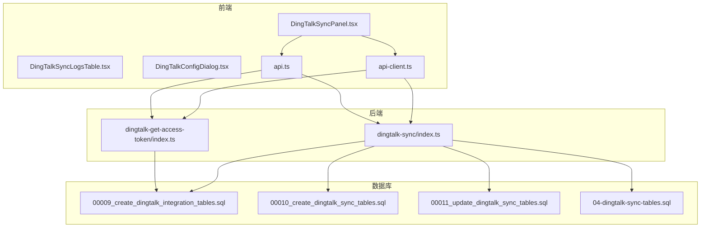
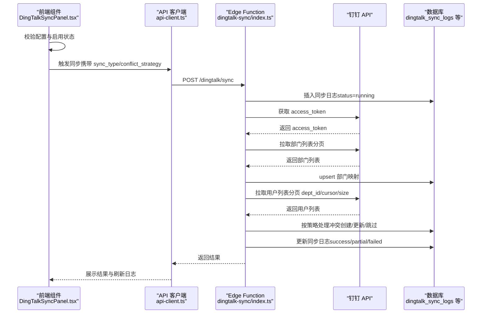
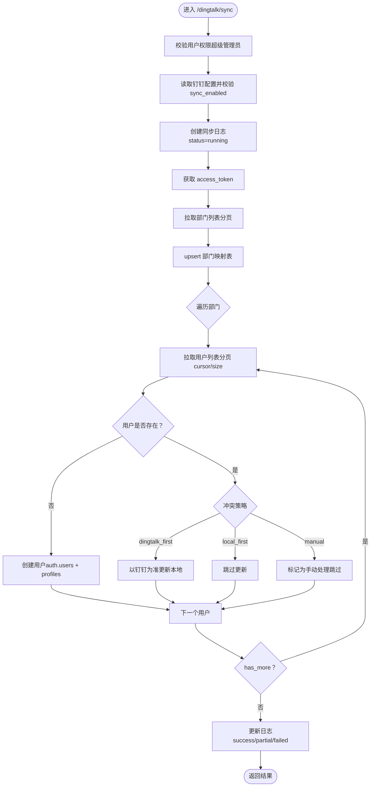
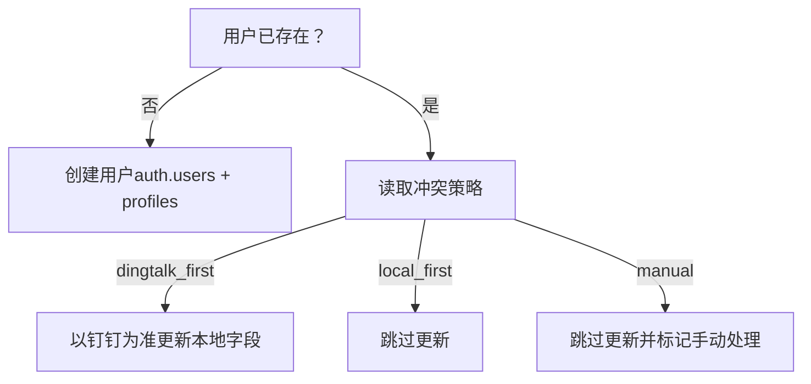
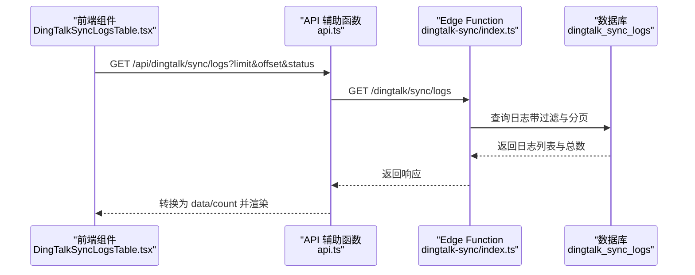
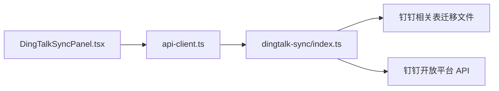

# 钉钉通讯录同步接口

<cite>
**本文引用的文件**
- [index.ts](file://supabase/functions/dingtalk-sync/index.ts)
- [index.ts](file://supabase/functions/dingtalk-get-access-token/index.ts)
- [DingTalkSyncPanel.tsx](file://src/components/dingtalk/DingTalkSyncPanel.tsx)
- [DingTalkSyncLogsTable.tsx](file://src/components/dingtalk/DingTalkSyncLogsTable.tsx)
- [DingTalkConfigDialog.tsx](file://src/components/dingtalk/DingTalkConfigDialog.tsx)
- [api.ts](file://src/db/api.ts)
- [api-client.ts](file://src/services/api-client.ts)
- [00009_create_dingtalk_integration_tables.sql](file://supabase/migrations/00009_create_dingtalk_integration_tables.sql)
- [00010_create_dingtalk_sync_tables.sql](file://supabase/migrations/00010_create_dingtalk_sync_tables.sql)
- [00011_update_dingtalk_sync_tables.sql](file://supabase/migrations/00011_update_dingtalk_sync_tables.sql)
- [04-dingtalk-sync-tables.sql](file://database/init/04-dingtalk-sync-tables.sql)
- [钉钉同步功能使用说明.md](file://钉钉同步功能使用说明.md)
- [钉钉同步功能实现总结.md](file://钉钉同步功能实现总结.md)
</cite>

## 目录
1. [简介](#简介)
2. [项目结构](#项目结构)
3. [核心组件](#核心组件)
4. [架构总览](#架构总览)
5. [详细组件分析](#详细组件分析)
6. [依赖分析](#依赖分析)
7. [性能考虑](#性能考虑)
8. [故障排查指南](#故障排查指南)
9. [结论](#结论)
10. [附录](#附录)

## 简介
本文件深入解析“钉钉通讯录同步接口”（/api/dingtalk/sync）的技术实现，覆盖从接口触发到任务执行的完整链路，包括：
- 配置项校验（sync_enabled）
- 同步日志记录（dingtalk_sync_logs）
- 钉钉 access_token 获取
- 部门与用户分页拉取与处理
- 冲突解决策略（dingtalk_first、local_first、manual）
- 同步日志查询接口（/api/dingtalk/sync/logs）的分页与状态过滤
- 错误处理、重试与限流应对
- 前端触发到后端执行的调用链路示例

## 项目结构
围绕钉钉同步功能，涉及前端组件、API 客户端、Supabase Edge Functions 以及数据库表结构。下图展示关键模块与文件的关系。

图表来源
- [DingTalkSyncPanel.tsx](file://src/components/dingtalk/DingTalkSyncPanel.tsx#L1-L236)
- [DingTalkSyncLogsTable.tsx](file://src/components/dingtalk/DingTalkSyncLogsTable.tsx#L1-L48)
- [DingTalkConfigDialog.tsx](file://src/components/dingtalk/DingTalkConfigDialog.tsx#L257-L301)
- [api-client.ts](file://src/services/api-client.ts#L331-L381)
- [api.ts](file://src/db/api.ts#L1360-L1532)
- [index.ts](file://supabase/functions/dingtalk-sync/index.ts#L1-L384)
- [index.ts](file://supabase/functions/dingtalk-get-access-token/index.ts#L57-L120)
- [00009_create_dingtalk_integration_tables.sql](file://supabase/migrations/00009_create_dingtalk_integration_tables.sql#L1-L204)
- [00010_create_dingtalk_sync_tables.sql](file://supabase/migrations/00010_create_dingtalk_sync_tables.sql#L101-L138)
- [00011_update_dingtalk_sync_tables.sql](file://supabase/migrations/00011_update_dingtalk_sync_tables.sql#L72-L95)
- [04-dingtalk-sync-tables.sql](file://database/init/04-dingtalk-sync-tables.sql#L104-L130)

章节来源
- [DingTalkSyncPanel.tsx](file://src/components/dingtalk/DingTalkSyncPanel.tsx#L1-L236)
- [api-client.ts](file://src/services/api-client.ts#L331-L381)
- [api.ts](file://src/db/api.ts#L1360-L1532)
- [index.ts](file://supabase/functions/dingtalk-sync/index.ts#L1-L384)
- [index.ts](file://supabase/functions/dingtalk-get-access-token/index.ts#L57-L120)
- [00009_create_dingtalk_integration_tables.sql](file://supabase/migrations/00009_create_dingtalk_integration_tables.sql#L1-L204)
- [00010_create_dingtalk_sync_tables.sql](file://supabase/migrations/00010_create_dingtalk_sync_tables.sql#L101-L138)
- [00011_update_dingtalk_sync_tables.sql](file://supabase/migrations/00011_update_dingtalk_sync_tables.sql#L72-L95)
- [04-dingtalk-sync-tables.sql](file://database/init/04-dingtalk-sync-tables.sql#L104-L130)

## 核心组件
- 前端触发与交互
  - 钉钉同步面板：负责加载配置、统计、日志，并触发同步。
  - 日志表格：展示同步历史，支持刷新。
  - 配置对话框：设置冲突策略等。
- API 客户端与帮助函数
  - API 客户端封装 /dingtalk/* 端点调用。
  - API 辅助函数封装 /api/dingtalk/* 端点调用（用于本地 API 服务器）。
- Edge Function（后端同步与令牌）
  - 钉钉同步函数：校验配置、创建同步日志、获取 access_token、拉取部门与用户、按策略处理冲突、更新日志与配置。
  - 获取 access_token 函数：独立获取并缓存 token，供同步流程复用。
- 数据库表结构
  - 钉钉同步配置、日志、部门映射、RPC 统计等。

章节来源
- [DingTalkSyncPanel.tsx](file://src/components/dingtalk/DingTalkSyncPanel.tsx#L1-L236)
- [DingTalkSyncLogsTable.tsx](file://src/components/dingtalk/DingTalkSyncLogsTable.tsx#L1-L48)
- [DingTalkConfigDialog.tsx](file://src/components/dingtalk/DingTalkConfigDialog.tsx#L257-L301)
- [api-client.ts](file://src/services/api-client.ts#L331-L381)
- [api.ts](file://src/db/api.ts#L1360-L1532)
- [index.ts](file://supabase/functions/dingtalk-sync/index.ts#L1-L384)
- [index.ts](file://supabase/functions/dingtalk-get-access-token/index.ts#L57-L120)
- [00009_create_dingtalk_integration_tables.sql](file://supabase/migrations/00009_create_dingtalk_integration_tables.sql#L1-L204)
- [00010_create_dingtalk_sync_tables.sql](file://supabase/migrations/00010_create_dingtalk_sync_tables.sql#L101-L138)
- [00011_update_dingtalk_sync_tables.sql](file://supabase/migrations/00011_update_dingtalk_sync_tables.sql#L72-L95)
- [04-dingtalk-sync-tables.sql](file://database/init/04-dingtalk-sync-tables.sql#L104-L130)

## 架构总览
下图展示从前端点击“立即同步”到后端 Edge Function 执行的完整链路。

图表来源
- [DingTalkSyncPanel.tsx](file://src/components/dingtalk/DingTalkSyncPanel.tsx#L66-L118)
- [api-client.ts](file://src/services/api-client.ts#L355-L378)
- [index.ts](file://supabase/functions/dingtalk-sync/index.ts#L90-L383)
- [00010_create_dingtalk_sync_tables.sql](file://supabase/migrations/00010_create_dingtalk_sync_tables.sql#L101-L138)

## 详细组件分析

### 接口触发与控制流（/api/dingtalk/sync）
- 触发入口
  - 前端通过 API 客户端调用 POST /dingtalk/sync，传入 sync_type、selected_departments、conflict_strategy。
- 控制流要点
  - 校验用户权限（超级管理员）。
  - 读取配置并校验 sync_enabled。
  - 创建同步日志（status=running）。
  - 获取 access_token 并调用钉钉 API。
  - 拉取部门列表并 upsert 至部门映射表。
  - 逐部门分页拉取用户列表，按策略处理冲突。
  - 更新同步日志状态与统计字段。
  - 记录异常并回滚状态为 failed。

图表来源
- [index.ts](file://supabase/functions/dingtalk-sync/index.ts#L90-L383)

章节来源
- [DingTalkSyncPanel.tsx](file://src/components/dingtalk/DingTalkSyncPanel.tsx#L66-L118)
- [api-client.ts](file://src/services/api-client.ts#L355-L378)
- [index.ts](file://supabase/functions/dingtalk-sync/index.ts#L90-L383)

### 冲突解决策略与数据处理
- 策略定义
  - dingtalk_first：以钉钉数据为准，更新本地字段。
  - local_first：保留本地数据，跳过更新。
  - manual：标记冲突，跳过自动处理，等待人工干预。
- 字段映射与更新条件
  - 用户存在：按策略更新本地字段（如姓名、部门等）。
  - 用户不存在：在 auth.users 中创建用户，再在 profiles 中创建资料。
- 手动冲突标记
  - manual 策略下，跳过自动更新，后续可在前端界面查看并处理。

图表来源
- [index.ts](file://supabase/functions/dingtalk-sync/index.ts#L227-L301)

章节来源
- [index.ts](file://supabase/functions/dingtalk-sync/index.ts#L227-L301)
- [DingTalkConfigDialog.tsx](file://src/components/dingtalk/DingTalkConfigDialog.tsx#L257-L301)

### 同步日志查询接口（/api/dingtalk/sync/logs）
- 参数
  - limit：每页条数，默认值由后端决定（前端可传）。
  - offset：偏移量。
  - status：过滤状态（pending/running/success/failed/partial）。
- 返回
  - 列表数据与总数（前端辅助转换为 data/count 结构）。
- 数据库索引
  - 提供按 status、created_at、created_by 的索引，优化查询性能。

图表来源
- [DingTalkSyncLogsTable.tsx](file://src/components/dingtalk/DingTalkSyncLogsTable.tsx#L1-L48)
- [api.ts](file://src/db/api.ts#L1380-L1418)
- [00010_create_dingtalk_sync_tables.sql](file://supabase/migrations/00010_create_dingtalk_sync_tables.sql#L114-L118)

章节来源
- [DingTalkSyncLogsTable.tsx](file://src/components/dingtalk/DingTalkSyncLogsTable.tsx#L1-L48)
- [api.ts](file://src/db/api.ts#L1380-L1418)
- [00010_create_dingtalk_sync_tables.sql](file://supabase/migrations/00010_create_dingtalk_sync_tables.sql#L114-L118)

### access_token 获取与缓存
- 独立 Edge Function 获取 token，避免重复请求与缓存过期问题。
- 返回成功时包含剩余有效期（提前 5 分钟过期），便于上层复用。

章节来源
- [index.ts](file://supabase/functions/dingtalk-get-access-token/index.ts#L57-L120)

### 数据库表结构与统计
- 表结构
  - dingtalk_sync_config：存储钉钉应用配置、同步策略、启用状态等。
  - dingtalk_sync_logs：记录每次同步的类型、状态、计数、错误信息、时间等。
  - dingtalk_department_mapping：钉钉部门与本地部门映射。
  - RPC get_sync_statistics：聚合近 30 天的同步统计。
- 索引与安全
  - 为日志表建立 status、created_at、created_by 等索引。
  - 启用 RLS，限制日志与通知记录的访问范围。

章节来源
- [00009_create_dingtalk_integration_tables.sql](file://supabase/migrations/00009_create_dingtalk_integration_tables.sql#L1-L204)
- [00010_create_dingtalk_sync_tables.sql](file://supabase/migrations/00010_create_dingtalk_sync_tables.sql#L101-L138)
- [00011_update_dingtalk_sync_tables.sql](file://supabase/migrations/00011_update_dingtalk_sync_tables.sql#L72-L95)
- [04-dingtalk-sync-tables.sql](file://database/init/04-dingtalk-sync-tables.sql#L104-L130)

## 依赖分析
- 前端依赖
  - DingTalkSyncPanel 依赖 API 客户端与 API 辅助函数，负责触发同步与刷新日志。
  - DingTalkConfigDialog 提供冲突策略选择。
- 后端依赖
  - Edge Function 依赖 Supabase 客户端与钉钉 API。
  - 数据库迁移文件定义了表结构、索引与 RLS 策略。
- 外部依赖
  - 钉钉开放平台 API（获取 token、部门列表、用户列表）。

图表来源
- [DingTalkSyncPanel.tsx](file://src/components/dingtalk/DingTalkSyncPanel.tsx#L1-L236)
- [api-client.ts](file://src/services/api-client.ts#L331-L381)
- [index.ts](file://supabase/functions/dingtalk-sync/index.ts#L1-L384)
- [00009_create_dingtalk_integration_tables.sql](file://supabase/migrations/00009_create_dingtalk_integration_tables.sql#L1-L204)

章节来源
- [DingTalkSyncPanel.tsx](file://src/components/dingtalk/DingTalkSyncPanel.tsx#L1-L236)
- [api-client.ts](file://src/services/api-client.ts#L331-L381)
- [index.ts](file://supabase/functions/dingtalk-sync/index.ts#L1-L384)
- [00009_create_dingtalk_integration_tables.sql](file://supabase/migrations/00009_create_dingtalk_integration_tables.sql#L1-L204)

## 性能考虑
- 分页与批量处理
  - 部门与用户均采用分页拉取（cursor/size），避免一次性请求过大。
- 索引优化
  - 日志表按 status、created_at、created_by 建立索引，提升查询效率。
- 缓存与重用
  - access_token 获取函数内置缓存与过期时间，减少重复请求。
- 并发与幂等
  - upsert 部门映射避免重复插入；日志创建与更新使用唯一标识，保证幂等性。

章节来源
- [index.ts](file://supabase/functions/dingtalk-sync/index.ts#L141-L206)
- [index.ts](file://supabase/functions/dingtalk-get-access-token/index.ts#L57-L120)
- [00010_create_dingtalk_sync_tables.sql](file://supabase/migrations/00010_create_dingtalk_sync_tables.sql#L114-L118)

## 故障排查指南
- 立即同步按钮灰色
  - 检查配置是否启用：可通过 curl 获取配置并确认 sync_enabled。
- 同步失败
  - 查看同步日志表 status 与 error_message。
  - 确认 access_token 获取是否成功。
- 日志查询无数据
  - 确认 limit/offset/status 参数是否正确。
  - 检查 RLS 策略是否允许当前用户查看日志。
- 配置与实现状态
  - 若使用 .cjs 版本，配置与日志可能为内存/模拟数据，建议切换至 TypeScript 版本或更新 .cjs 文件。

章节来源
- [钉钉同步功能使用说明.md](file://钉钉同步功能使用说明.md#L130-L148)
- [钉钉同步功能实现总结.md](file://钉钉同步功能实现总结.md#L193-L213)
- [index.ts](file://supabase/functions/dingtalk-sync/index.ts#L355-L383)
- [index.ts](file://supabase/functions/dingtalk-get-access-token/index.ts#L57-L120)

## 结论
钉钉通讯录同步接口通过清晰的前后端分工与完善的数据库结构，实现了从配置校验、日志记录、令牌获取、分页拉取到冲突策略处理的完整闭环。前端提供直观的触发与展示能力，后端通过 Edge Function 执行同步并持久化结果，具备良好的扩展性与可观测性。建议在生产环境中优先使用 TypeScript 版本的 API 服务器与数据库版本的 Edge Function，确保配置与日志的持久化与一致性。

## 附录

### 调用链路示例（从按钮到任务执行）
- 前端点击“立即同步”
  - DingTalkSyncPanel 校验配置与启用状态，调用 API 客户端触发同步。
- 后端执行
  - Edge Function 校验权限与配置，创建日志，获取 token，拉取部门与用户，按策略处理冲突，更新日志。
- 前端展示
  - API 辅助函数获取日志列表，DingTalkSyncLogsTable 渲染并支持刷新。

章节来源
- [DingTalkSyncPanel.tsx](file://src/components/dingtalk/DingTalkSyncPanel.tsx#L66-L118)
- [api-client.ts](file://src/services/api-client.ts#L355-L378)
- [index.ts](file://supabase/functions/dingtalk-sync/index.ts#L90-L383)
- [api.ts](file://src/db/api.ts#L1380-L1418)