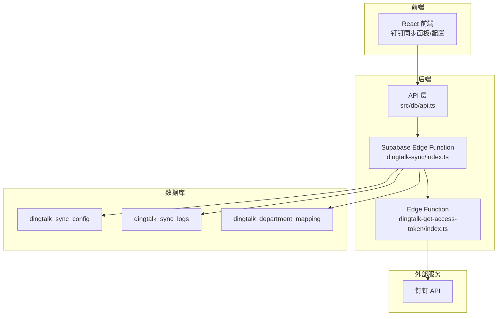
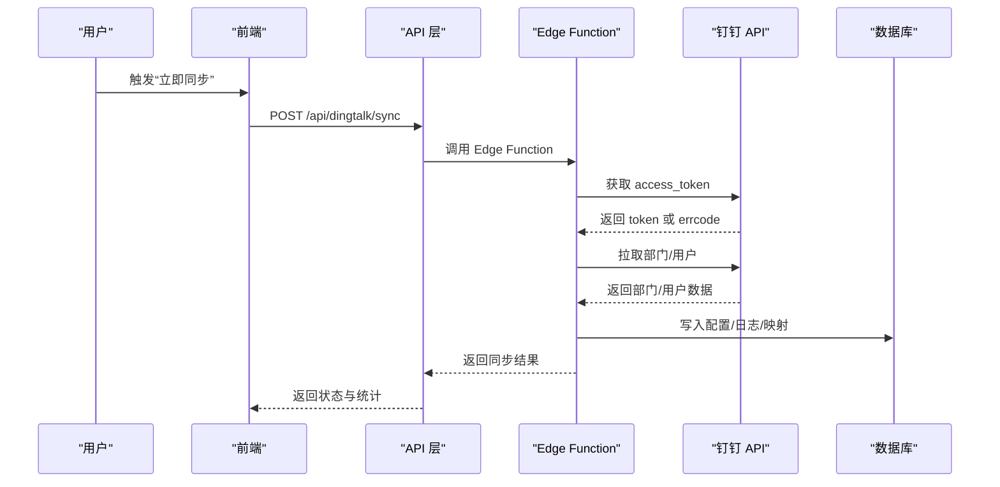
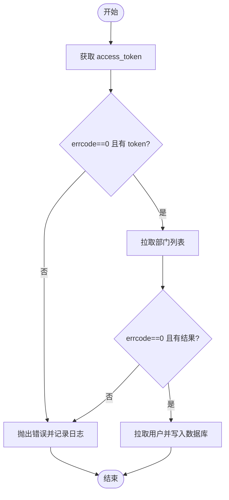
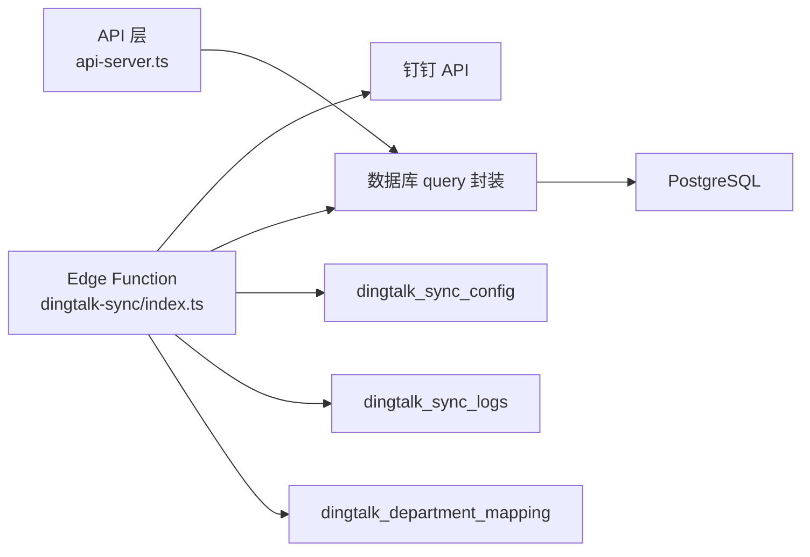

# 错误处理与故障排除

<cite>
**本文引用的文件**
- [钉钉同步功能说明.md](file://钉钉同步功能说明.md)
- [钉钉同步toString错误修复.md](file://钉钉同步toString错误修复.md)
- [supabase/functions/dingtalk-sync/index.ts](file://supabase/functions/dingtalk-sync/index.ts)
- [supabase/functions/dingtalk-get-access-token/index.ts](file://supabase/functions/dingtalk-get-access-token/index.ts)
- [server/api-server.ts](file://server/api-server.ts)
- [server/api-server.cjs](file://server/api-server.cjs)
- [server/server/server/api-server.js](file://server/server/server/api-server.js)
- [src/db/connection.ts](file://src/db/connection.ts)
- [server/src/db/connection.js](file://server/src/db/connection.js)
- [database/init/04-dingtalk-sync-tables.sql](file://database/init/04-dingtalk-sync-tables.sql)
- [supabase/migrations/00010_create_dingtalk_sync_tables.sql](file://supabase/migrations/00010_create_dingtalk_sync_tables.sql)
- [restart-api.sh](file://restart-api.sh)
- [restart-api-for-sync-fix.sh](file://restart-api-for-sync-fix.sh)
</cite>

## 目录
1. [简介](#简介)
2. [项目结构](#项目结构)
3. [核心组件](#核心组件)
4. [架构总览](#架构总览)
5. [详细组件分析](#详细组件分析)
6. [依赖分析](#依赖分析)
7. [性能考虑](#性能考虑)
8. [故障排除指南](#故障排除指南)
9. [结论](#结论)

## 简介
本文件系统化梳理了钉钉同步过程中可能遇到的错误类型与处理策略，涵盖 HTTP 错误码语义、后端错误处理机制（网络请求失败的重试策略、钉钉 API 限流与错误捕获、数据库操作异常）、以及结合“钉钉同步功能说明.md”中的故障排除指南给出的解决方案。同时，基于“钉钉同步toString错误修复.md”的成功案例，说明通过重启 API 服务器与刷新页面即可恢复同步，并强调查看同步日志 details 字段以获取失败详情的重要性。

## 项目结构
- 同步功能由前端触发，后端通过 Supabase Edge Function 调用钉钉 API 并写入本地数据库；后端也提供独立的 API 服务器实现（兼容多版本文件）。
- 数据库侧包含钉钉同步配置、同步日志、部门映射等表，支持状态枚举与 RLS 策略。
- 故障排除文档提供了常见问题与解决方案，包括“同步失败”“部分用户同步失败”等场景。

图表来源
- [supabase/functions/dingtalk-sync/index.ts](file://supabase/functions/dingtalk-sync/index.ts#L102-L140)
- [supabase/functions/dingtalk-get-access-token/index.ts](file://supabase/functions/dingtalk-get-access-token/index.ts#L57-L120)
- [database/init/04-dingtalk-sync-tables.sql](file://database/init/04-dingtalk-sync-tables.sql#L25-L81)
- [supabase/migrations/00010_create_dingtalk_sync_tables.sql](file://supabase/migrations/00010_create_dingtalk_sync_tables.sql#L66-L112)

章节来源
- [钉钉同步功能说明.md](file://钉钉同步功能说明.md#L232-L275)

## 核心组件
- 钉钉同步 Edge Function：负责获取 access_token、拉取部门与用户、冲突处理、写入日志与统计。
- 访问令牌 Edge Function：封装钉钉 token 获取，统一处理 errcode 非 0 场景与网络错误。
- API 服务器（TypeScript/CJS/JS）：提供同步接口、配置接口、日志查询接口；对钉钉 API 调用进行 errcode 校验与错误抛出。
- 数据库层：提供通用 query/transaction 封装，统一记录错误日志并回滚事务。
- 数据表：dingtalk_sync_config、dingtalk_sync_logs、dingtalk_department_mapping，支持状态枚举与 RLS 策略。

章节来源
- [supabase/functions/dingtalk-sync/index.ts](file://supabase/functions/dingtalk-sync/index.ts#L102-L140)
- [supabase/functions/dingtalk-get-access-token/index.ts](file://supabase/functions/dingtalk-get-access-token/index.ts#L57-L120)
- [server/api-server.ts](file://server/api-server.ts#L615-L840)
- [src/db/connection.ts](file://src/db/connection.ts#L80-L114)
- [database/init/04-dingtalk-sync-tables.sql](file://database/init/04-dingtalk-sync-tables.sql#L25-L81)

## 架构总览
钉钉同步采用“前端触发 → API 层 → Edge Function → 钉钉 API → 写入本地数据库”的链路。Edge Function 负责保护密钥、执行长时间任务与错误处理；API 层负责权限校验与日志查询。

图表来源
- [supabase/functions/dingtalk-sync/index.ts](file://supabase/functions/dingtalk-sync/index.ts#L102-L383)
- [server/api-server.ts](file://server/api-server.ts#L615-L840)

## 详细组件分析

### HTTP 错误码与语义
- 401 未授权：通常出现在鉴权失败或非超级管理员访问受保护接口时。
- 400 参数缺失或配置未启用：例如钉钉同步未启用或配置缺失。
- 500 内部服务器错误：后端异常或数据库错误。

章节来源
- [server/api-server.ts](file://server/api-server.ts#L118-L148)
- [server/api-server.ts](file://server/api-server.ts#L615-L621)
- [server/api-server.ts](file://server/api-server.ts#L456-L474)

### 钉钉 API 限流与错误捕获
- Edge Function 对 access_token 获取与部门/用户拉取进行 errcode 校验，失败时抛出错误并记录日志。
- 同步主流程在钉钉 API 返回 errcode 非 0 时直接抛出错误，最终在 catch 中统一更新日志状态为 failed 并返回错误信息。

图表来源
- [supabase/functions/dingtalk-sync/index.ts](file://supabase/functions/dingtalk-sync/index.ts#L126-L170)
- [supabase/functions/dingtalk-sync/index.ts](file://supabase/functions/dingtalk-sync/index.ts#L355-L383)

章节来源
- [supabase/functions/dingtalk-sync/index.ts](file://supabase/functions/dingtalk-sync/index.ts#L126-L170)
- [supabase/functions/dingtalk-sync/index.ts](file://supabase/functions/dingtalk-sync/index.ts#L355-L383)

### 访问令牌获取的错误处理
- 对网络响应状态码进行判断，errcode 非 0 时抛出错误；未获取到 access_token 时同样抛错；统一返回 500 状态码。

章节来源
- [supabase/functions/dingtalk-get-access-token/index.ts](file://supabase/functions/dingtalk-get-access-token/index.ts#L57-L120)

### 后端同步接口的错误处理
- 配置校验：若未启用同步或未找到配置，返回 400。
- 同步日志创建：插入 running 状态日志。
- 钉钉 API 调用：errcode 非 0 即抛错。
- 结果汇总：根据失败数量更新日志状态为 success/partial/failed，并写入 details 字段（包含失败详情）。
- 异常捕获：统一记录错误并返回 500。

章节来源
- [server/api-server.ts](file://server/api-server.ts#L615-L621)
- [server/api-server.ts](file://server/api-server.ts#L634-L840)

### 数据库操作异常处理
- 通用 query 封装：捕获异常并记录错误日志，随后抛出，便于上层统一处理。
- 事务封装：BEGIN/COMMIT/ROLLBACK，异常时自动回滚，释放连接。
- 日志表 details 字段：用于存放失败详情，便于定位问题。

章节来源
- [src/db/connection.ts](file://src/db/connection.ts#L80-L114)
- [server/src/db/connection.js](file://server/src/db/connection.js#L80-L111)
- [database/init/04-dingtalk-sync-tables.sql](file://database/init/04-dingtalk-sync-tables.sql#L46-L60)

### 日志与统计
- 同步日志包含：同步类型、状态、开始/结束时间、总数、成功/失败/跳过数量、错误信息、details。
- Edge Function 在同步完成后更新日志状态与统计，并将 details 写入 JSONB 字段。
- 前端可通过日志接口查看历史记录与失败详情。

章节来源
- [supabase/functions/dingtalk-sync/index.ts](file://supabase/functions/dingtalk-sync/index.ts#L335-L354)
- [server/api-server.cjs.bak2](file://server/api-server.cjs.bak2#L1198-L1244)

## 依赖分析
- Edge Function 依赖钉钉 API，需处理网络异常与 errcode 非 0。
- API 层依赖数据库连接池与事务封装，异常时统一向上抛出。
- 数据库层提供统一的 query/transaction 封装，保证错误可追踪与事务一致性。
- 数据表结构定义了状态枚举与索引，支撑日志查询与统计。

图表来源
- [supabase/functions/dingtalk-sync/index.ts](file://supabase/functions/dingtalk-sync/index.ts#L102-L383)
- [server/api-server.ts](file://server/api-server.ts#L615-L840)
- [database/init/04-dingtalk-sync-tables.sql](file://database/init/04-dingtalk-sync-tables.sql#L25-L81)

章节来源
- [supabase/migrations/00010_create_dingtalk_sync_tables.sql](file://supabase/migrations/00010_create_dingtalk_sync_tables.sql#L66-L112)
- [database/init/04-dingtalk-sync-tables.sql](file://database/init/04-dingtalk-sync-tables.sql#L25-L81)

## 性能考虑
- Edge Function 适合长时间运行的任务，避免在前端暴露密钥与执行耗时操作。
- 分页拉取用户，降低单次请求压力，避免超时。
- 避免频繁手动同步，建议使用自动同步并设置合理的频率（如每天）。

章节来源
- [钉钉同步功能说明.md](file://钉钉同步功能说明.md#L276-L305)

## 故障排除指南

### 常见错误与解决方案
- 同步失败
  - 可能原因：配置错误、网络无法访问钉钉 API、应用权限不足。
  - 解决方案：核对 AppKey/AppSecret/AgentId/CorpId；确认应用已启用；检查通讯录读取权限；查看同步日志中的错误信息。
- 部分用户同步失败
  - 可能原因：用户名重复、邮箱格式不正确、必填字段缺失。
  - 解决方案：查看同步日志 details 字段中的失败详情，手动修正后重新同步。
- 401 未授权
  - 可能原因：非超级管理员访问受保护接口。
  - 解决方案：确保当前用户具备超级管理员权限。
- 400 配置未找到或同步未启用
  - 可能原因：未配置钉钉应用信息或未启用同步。
  - 解决方案：在配置界面填写并保存钉钉应用信息，启用同步功能。
- 500 内部服务器错误
  - 可能原因：数据库异常、网络异常、代码空值访问等。
  - 解决方案：查看后端日志，必要时重启 API 服务器并刷新页面。

章节来源
- [钉钉同步功能说明.md](file://钉钉同步功能说明.md#L345-L369)
- [server/api-server.ts](file://server/api-server.ts#L118-L148)
- [server/api-server.ts](file://server/api-server.ts#L615-L621)
- [server/api-server.ts](file://server/api-server.ts#L456-L474)

### 成功案例：toString 错误修复
- 问题现象：POST /api/dingtalk/sync 返回 500，TypeError 无法读取 undefined 的 toString。
- 根因：同步部门映射时访问了不存在的 parent_id 与 order 字段。
- 修复要点：对 parent_id 与 order 进行空值检查与默认值处理；支持根部门 parent_id 为 null；order 缺失时默认 0。
- 复现步骤：重启 API 服务器并刷新页面，重新执行同步，观察日志与前端结果。

章节来源
- [钉钉同步toString错误修复.md](file://钉钉同步toString错误修复.md#L1-L120)
- [钉钉同步toString错误修复.md](file://钉钉同步toString错误修复.md#L120-L235)

### 重启与验证脚本
- 提供一键重启 API 服务器脚本，验证健康检查并通过 tail 查看日志。
- 修复后建议：重启 API 服务器 → 刷新浏览器 → 点击“立即同步” → 查看日志 details 字段。

章节来源
- [restart-api.sh](file://restart-api.sh#L1-L25)
- [restart-api-for-sync-fix.sh](file://restart-api-for-sync-fix.sh#L1-L51)

## 结论
- 钉钉同步的错误处理应覆盖：配置校验（400）、鉴权（401）、网络与 API 限流（errcode 非 0）、数据库异常（统一抛错与回滚）。
- 通过 Edge Function 执行同步任务，既能保护密钥又能提升稳定性；日志 details 字段是定位失败问题的关键。
- 遇到 500 错误时，优先查看后端日志并按需重启 API 服务器，再重新触发同步；同时依据“钉钉同步功能说明.md”的故障排除指南逐项排查。