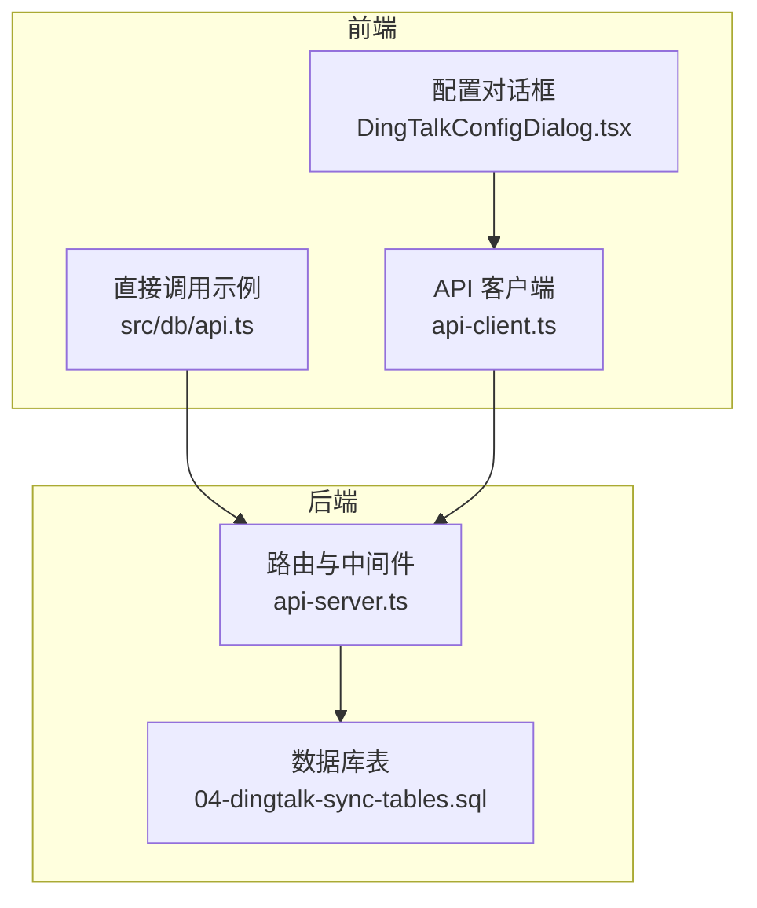
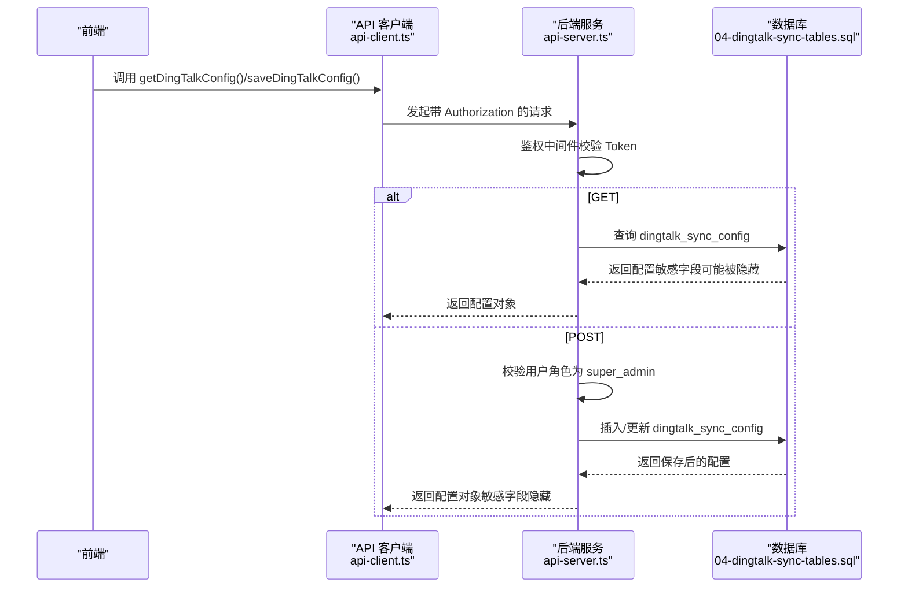
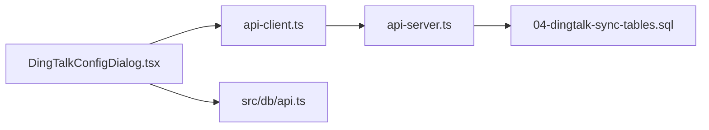

# 钉钉配置管理接口

<cite>
**本文引用的文件**
- [server/api-server.ts](file://server/api-server.ts)
- [src/services/api-client.ts](file://src/services/api-client.ts)
- [database/init/04-dingtalk-sync-tables.sql](file://database/init/04-dingtalk-sync-tables.sql)
- [supabase/migrations/00009_create_dingtalk_integration_tables.sql](file://supabase/migrations/00009_create_dingtalk_integration_tables.sql)
- [supabase/migrations/00011_update_dingtalk_sync_tables.sql](file://supabase/migrations/00011_update_dingtalk_sync_tables.sql)
- [src/components/dingtalk/DingTalkConfigDialog.tsx](file://src/components/dingtalk/DingTalkConfigDialog.tsx)
- [src/db/api.ts](file://src/db/api.ts)
</cite>

## 目录
1. [简介](#简介)
2. [项目结构](#项目结构)
3. [核心组件](#核心组件)
4. [架构总览](#架构总览)
5. [详细组件分析](#详细组件分析)
6. [依赖分析](#依赖分析)
7. [性能考虑](#性能考虑)
8. [故障排查指南](#故障排查指南)
9. [结论](#结论)
10. [附录](#附录)

## 简介
本文件面向前端与后端开发者，系统性说明“钉钉配置管理接口”的设计与实现，覆盖以下要点：
- GET /api/dingtalk/config 的响应结构与字段含义
- POST /api/dingtalk/config 的请求体格式、参数校验与保存逻辑
- 权限控制（仅超级管理员可修改）
- 敏感信息处理与错误处理策略
- 前端调用示例与典型成功/失败响应样例

## 项目结构
围绕钉钉配置管理的关键文件与职责如下：
- 后端路由与业务逻辑：server/api-server.ts
- 前端 API 客户端封装：src/services/api-client.ts
- 数据库表结构（配置、日志、部门映射）：database/init/04-dingtalk-sync-tables.sql、supabase/migrations/00009_create_dingtalk_integration_tables.sql、supabase/migrations/00011_update_dingtalk_sync_tables.sql
- 前端配置对话框与表单校验：src/components/dingtalk/DingTalkConfigDialog.tsx
- 前端直接调用示例：src/db/api.ts

图表来源
- [server/api-server.ts](file://server/api-server.ts#L477-L579)
- [src/services/api-client.ts](file://src/services/api-client.ts#L331-L352)
- [database/init/04-dingtalk-sync-tables.sql](file://database/init/04-dingtalk-sync-tables.sql#L25-L41)

章节来源
- [server/api-server.ts](file://server/api-server.ts#L477-L579)
- [src/services/api-client.ts](file://src/services/api-client.ts#L331-L352)
- [database/init/04-dingtalk-sync-tables.sql](file://database/init/04-dingtalk-sync-tables.sql#L25-L41)

## 核心组件
- GET /api/dingtalk/config
  - 返回当前钉钉集成配置，包含 app_key、app_secret、agent_id、corp_id、sync_enabled、auto_sync_enabled、sync_schedule、sync_time、conflict_strategy、selected_departments 等字段。
  - 响应中对敏感字段 app_secret 进行隐藏处理，避免泄露。
- POST /api/dingtalk/config
  - 请求体包含上述字段；后端进行权限校验（仅超级管理员），随后根据是否存在历史配置决定插入或更新。
  - 保存时将 selected_departments 以 JSONB 形式存储，便于后续同步筛选。
  - 返回保存后的配置对象（敏感字段同样隐藏）。

章节来源
- [server/api-server.ts](file://server/api-server.ts#L479-L579)
- [database/init/04-dingtalk-sync-tables.sql](file://database/init/04-dingtalk-sync-tables.sql#L25-L41)

## 架构总览
后端采用 Express 中间件链路：CORS、JSON 解析、统一错误处理、鉴权中间件、业务路由。钉钉配置路由位于统一鉴权之后，确保只有携带有效 Bearer Token 的用户可访问。

图表来源
- [server/api-server.ts](file://server/api-server.ts#L118-L151)
- [server/api-server.ts](file://server/api-server.ts#L479-L579)
- [src/services/api-client.ts](file://src/services/api-client.ts#L331-L352)
- [database/init/04-dingtalk-sync-tables.sql](file://database/init/04-dingtalk-sync-tables.sql#L25-L41)

## 详细组件分析

### GET /api/dingtalk/config
- 功能：返回当前钉钉集成配置
- 访问控制：受统一鉴权中间件保护（Bearer Token）
- 数据来源：查询 dingtalk_sync_config 表，取最新一条记录
- 响应字段（示例结构）
  - app_key: 字符串
  - app_secret: 字符串（响应中会被隐藏）
  - agent_id: 字符串
  - corp_id: 字符串
  - sync_enabled: 布尔值
  - auto_sync_enabled: 布尔值
  - sync_schedule: 字符串（如 daily/weekly 等）
  - sync_time: 时间字符串（HH:mm:ss）
  - conflict_strategy: 枚举（dingtalk_first/local_first/manual）
  - selected_departments: JSONB 数组（字符串数组）
  - 其他：created_at、updated_at、last_sync_at 等
- 错误处理：数据库查询异常时返回 500 与错误信息

章节来源
- [server/api-server.ts](file://server/api-server.ts#L479-L506)
- [database/init/04-dingtalk-sync-tables.sql](file://database/init/04-dingtalk-sync-tables.sql#L25-L41)

### POST /api/dingtalk/config
- 功能：保存或更新钉钉集成配置
- 请求体字段与默认值
  - app_key: 必填
  - app_secret: 必填
  - agent_id: 必填
  - corp_id: 必填
  - sync_enabled: 默认 false
  - auto_sync_enabled: 默认 false
  - sync_schedule: 默认 daily
  - sync_time: 默认 02:00:00
  - conflict_strategy: 默认 manual
  - selected_departments: 默认 []
- 参数校验与保存逻辑
  - 鉴权：必须为超级管理员（super_admin）
  - 若存在历史配置，则按 id 更新；否则插入新记录
  - selected_departments 以 JSONB 存储
  - 返回保存后的配置对象（敏感字段隐藏）
- 错误处理：鉴权失败返回 401/403；数据库异常返回 500

章节来源
- [server/api-server.ts](file://server/api-server.ts#L506-L579)
- [database/init/04-dingtalk-sync-tables.sql](file://database/init/04-dingtalk-sync-tables.sql#L25-L41)

### 权限控制与中间件流程
- 统一鉴权中间件
  - 校验 Authorization 头是否为 Bearer Token
  - 验证 Token 并解析用户信息
  - 将用户信息挂载到 req.user，供后续路由使用
- 路由级权限
  - 钉钉配置路由在鉴权中间件之后，且在保存配置时再次校验用户角色为 super_admin
- CORS 与错误处理
  - 默认允许本地开发源
  - 统一错误处理中间件捕获异常并返回 500

章节来源
- [server/api-server.ts](file://server/api-server.ts#L118-L151)
- [server/api-server.ts](file://server/api-server.ts#L514-L530)

### 敏感信息处理
- 响应中对 app_secret 进行隐藏（以占位符替代），防止泄露
- 前端表单中使用密码输入框，避免明文显示
- 建议：生产环境建议对敏感字段进行加密存储（当前实现未展示加密逻辑）

章节来源
- [server/api-server.ts](file://server/api-server.ts#L486-L494)
- [src/components/dingtalk/DingTalkConfigDialog.tsx](file://src/components/dingtalk/DingTalkConfigDialog.tsx#L128-L141)

### 数据模型与表结构
- dingtalk_sync_config
  - 字段：id、app_key、app_secret、agent_id、corp_id、sync_enabled、auto_sync_enabled、sync_schedule、sync_time、conflict_strategy、selected_departments、last_sync_at、created_at、updated_at
  - 类型：文本、布尔、时间、枚举、JSONB
- dingtalk_sync_logs（与配置接口相关）
  - 字段：id、sync_type、status、total_users、success_count、failed_count、skipped_count、error_message、details、started_at、completed_at、created_by、created_at
- dingtalk_department_mapping（与同步流程相关）
  - 字段：id、dingtalk_dept_id、dingtalk_dept_name、local_department、parent_id、order_num、enabled、created_at、updated_at

章节来源
- [database/init/04-dingtalk-sync-tables.sql](file://database/init/04-dingtalk-sync-tables.sql#L25-L81)
- [supabase/migrations/00009_create_dingtalk_integration_tables.sql](file://supabase/migrations/00009_create_dingtalk_integration_tables.sql#L63-L124)
- [supabase/migrations/00011_update_dingtalk_sync_tables.sql](file://supabase/migrations/00011_update_dingtalk_sync_tables.sql#L72-L91)

### 前端调用示例
- 使用 api-client.ts 封装的方法
  - 读取配置：clientApi.getDingTalkConfig()
  - 保存配置：clientApi.saveDingTalkConfig(config)
- 直接使用 fetch 的示例
  - 参考 src/db/api.ts 中的保存实现，包含 Authorization 与 Content-Type

章节来源
- [src/services/api-client.ts](file://src/services/api-client.ts#L331-L352)
- [src/db/api.ts](file://src/db/api.ts#L1324-L1346)

## 依赖分析
- 后端依赖
  - 数据库连接与查询封装：server/src/db/connection.js（在 api-server.ts 中通过 import 使用）
  - 配置表结构：database/init/04-dingtalk-sync-tables.sql
- 前端依赖
  - API 客户端：src/services/api-client.ts
  - 配置对话框：src/components/dingtalk/DingTalkConfigDialog.tsx
  - 表单校验：Zod Schema（字段必填、枚举、时间格式等）

图表来源
- [src/services/api-client.ts](file://src/services/api-client.ts#L331-L352)
- [server/api-server.ts](file://server/api-server.ts#L477-L579)
- [database/init/04-dingtalk-sync-tables.sql](file://database/init/04-dingtalk-sync-tables.sql#L25-L41)
- [src/components/dingtalk/DingTalkConfigDialog.tsx](file://src/components/dingtalk/DingTalkConfigDialog.tsx#L14-L24)

## 性能考虑
- 数据库查询
  - GET 配置：按时间倒序取第一条，索引可优化 created_at 查询
  - POST 配置：存在历史配置时按 id 更新，建议保持 id 唯一索引
- JSONB 字段
  - selected_departments 为 JSONB，适合灵活存储数组；若频繁过滤可考虑建立 GIN 索引
- 日志与审计
  - 同步日志表支持按状态、创建时间、创建者索引，便于分页查询

章节来源
- [database/init/04-dingtalk-sync-tables.sql](file://database/init/04-dingtalk-sync-tables.sql#L75-L81)

## 故障排查指南
- 常见错误与定位
  - 401 未授权：检查 Authorization 头是否正确传递 Bearer Token
  - 403 权限不足：确认当前用户角色为 super_admin
  - 500 数据库错误：查看后端日志，确认数据库连接与 SQL 语句
- 配置校验建议
  - 前端表单已进行必填与枚举校验；后端保存时会再次校验字段存在性与类型
- 敏感信息泄露风险
  - 响应中 app_secret 已隐藏；前端避免在控制台打印敏感字段

章节来源
- [server/api-server.ts](file://server/api-server.ts#L514-L530)
- [server/api-server.ts](file://server/api-server.ts#L570-L578)
- [src/components/dingtalk/DingTalkConfigDialog.tsx](file://src/components/dingtalk/DingTalkConfigDialog.tsx#L14-L24)

## 结论
钉钉配置管理接口在鉴权、权限控制、数据模型与错误处理方面具备清晰的设计与实现。GET 接口提供当前配置，POST 接口支持保存与更新，并对敏感字段进行响应隐藏。建议在生产环境中进一步完善敏感字段的加密存储与更严格的参数校验，同时优化数据库索引以提升查询性能。

## 附录

### API 定义与示例

- GET /api/dingtalk/config
  - 请求：携带 Authorization: Bearer <token>
  - 响应：包含 app_key、agent_id、corp_id、sync_enabled、auto_sync_enabled、sync_schedule、sync_time、conflict_strategy、selected_departments 等字段；敏感字段 app_secret 在响应中被隐藏
  - 示例响应（简化）
    - {
        "app_key": "your_app_key",
        "agent_id": "your_agent_id",
        "corp_id": "your_corp_id",
        "sync_enabled": true,
        "auto_sync_enabled": false,
        "sync_schedule": "daily",
        "sync_time": "02:00:00",
        "conflict_strategy": "manual",
        "selected_departments": [],
        "created_at": "2025-01-01T00:00:00Z",
        "updated_at": "2025-01-01T00:00:00Z"
      }

- POST /api/dingtalk/config
  - 请求体字段与默认值
    - app_key: 必填
    - app_secret: 必填
    - agent_id: 必填
    - corp_id: 必填
    - sync_enabled: 默认 false
    - auto_sync_enabled: 默认 false
    - sync_schedule: 默认 daily
    - sync_time: 默认 02:00:00
    - conflict_strategy: 默认 manual
    - selected_departments: 默认 []
  - 响应：保存后的配置对象（敏感字段隐藏）
  - 示例成功响应（简化）
    - {
        "id": "uuid",
        "app_key": "your_app_key",
        "agent_id": "your_agent_id",
        "corp_id": "your_corp_id",
        "sync_enabled": true,
        "auto_sync_enabled": false,
        "sync_schedule": "daily",
        "sync_time": "02:00:00",
        "conflict_strategy": "manual",
        "selected_departments": [],
        "created_at": "2025-01-01T00:00:00Z",
        "updated_at": "2025-01-01T00:00:00Z"
      }
  - 示例失败响应（简化）
    - {
        "error": "Failed to save DingTalk configuration",
        "message": "数据库写入失败或参数校验失败"
      }

章节来源
- [server/api-server.ts](file://server/api-server.ts#L479-L579)
- [src/services/api-client.ts](file://src/services/api-client.ts#L331-L352)
- [src/db/api.ts](file://src/db/api.ts#L1324-L1346)