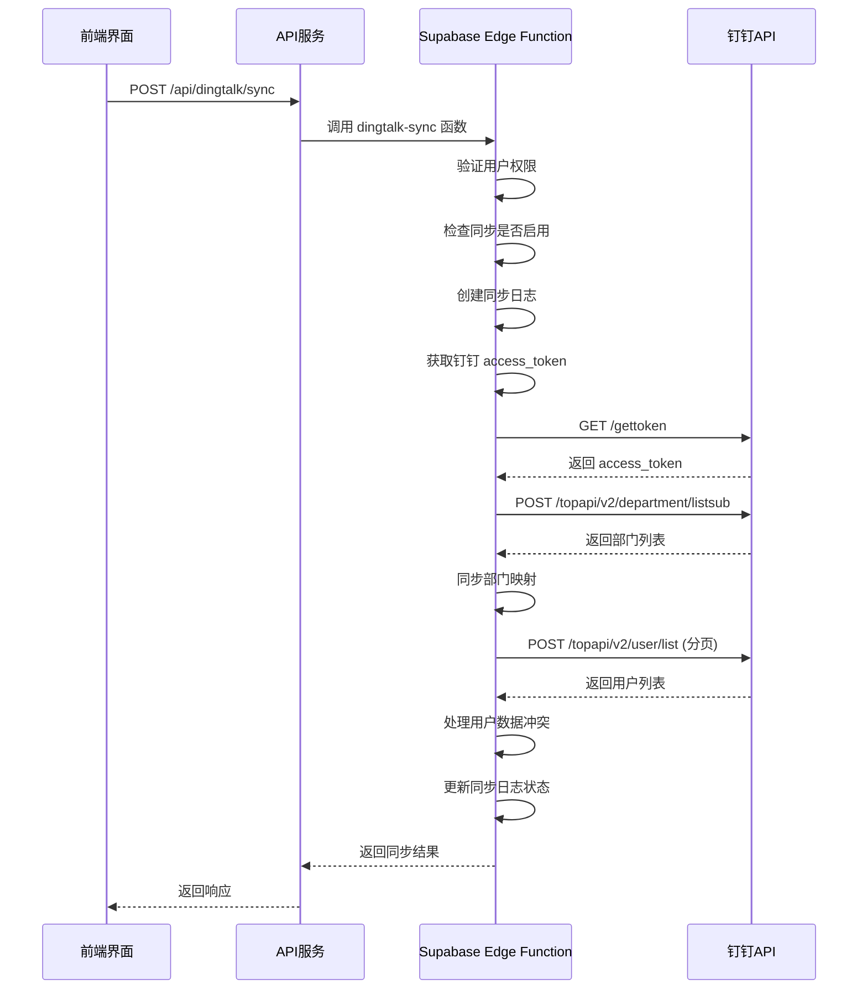

# 钉钉集成接口

<cite>
**本文档引用的文件**   
- [api-client.ts](file://src/services/api-client.ts)
- [DingTalkConfigDialog.tsx](file://src/components/dingtalk/DingTalkConfigDialog.tsx)
- [DingTalkSyncPanel.tsx](file://src/components/dingtalk/DingTalkSyncPanel.tsx)
- [DingTalkSyncLogsTable.tsx](file://src/components/dingtalk/DingTalkSyncLogsTable.tsx)
- [dingtalk-sync/index.ts](file://supabase/functions/dingtalk-sync/index.ts)
- [dingtalk-auth/index.ts](file://supabase/functions/dingtalk-auth/index.ts)
- [dingtalk-get-access-token/index.ts](file://supabase/functions/dingtalk-get-access-token/index.ts)
- [api.ts](file://src/db/api.ts)
- [types.ts](file://src/types/types.ts)
- [api-server.ts](file://server/api-server.ts)
- [00011_update_dingtalk_sync_tables.sql](file://supabase/migrations/00011_update_dingtalk_sync_tables.sql)
</cite>

## 目录
1. [简介](#简介)
2. [钉钉配置管理](#钉钉配置管理)
3. [通讯录同步](#通讯录同步)
4. [同步日志查询](#同步日志查询)
5. [错误处理机制](#错误处理机制)
6. [数据库表结构](#数据库表结构)
7. [接口调用流程图](#接口调用流程图)

## 简介
本接口文档详细描述了Bio-Appointment系统与钉钉开放平台对接的完整API体系。系统通过钉钉集成接口实现了组织架构同步功能，主要包括钉钉配置管理和通讯录同步两大核心模块。管理员可以通过前端界面配置钉钉应用信息，包括app_key、app_secret、agent_id、corp_id等关键参数，并设置同步策略。系统支持手动触发和自动计划两种同步模式，能够将钉钉组织架构中的部门和用户信息同步到本地系统中。在数据冲突处理方面，提供了"以钉钉数据为准"、"保留本地数据"和"手动处理"三种策略，确保数据一致性的同时给予管理员充分的控制权。

**Section sources**
- [DingTalkSyncPanel.tsx](file://src/components/dingtalk/DingTalkSyncPanel.tsx#L21-L237)
- [DingTalkConfigDialog.tsx](file://src/components/dingtalk/DingTalkConfigDialog.tsx#L35-L302)

## 钉钉配置管理
钉钉配置管理模块提供了获取和保存钉钉应用配置的API接口。配置项包括app_key、app_secret、agent_id、corp_id等认证信息，以及sync_enabled、auto_sync_enabled等同步控制参数。

### 获取配置 (GET /api/dingtalk/config)
该接口用于获取当前的钉钉配置信息。

**请求方式**: GET  
**请求路径**: /api/dingtalk/config  
**认证要求**: 需要管理员权限

**响应格式**:
```json
{
  "id": "string",
  "app_key": "string",
  "app_secret": "string",
  "agent_id": "string",
  "corp_id": "string",
  "sync_enabled": boolean,
  "auto_sync_enabled": boolean,
  "sync_schedule": "string",
  "sync_time": "string",
  "conflict_strategy": "dingtalk_first" | "local_first" | "manual",
  "selected_departments": ["string"],
  "last_sync_at": "string",
  "created_at": "string",
  "updated_at": "string"
}
```

### 保存配置 (POST /api/dingtalk/config)
该接口用于保存或更新钉钉配置信息。

**请求方式**: POST  
**请求路径**: /api/dingtalk/config  
**认证要求**: 需要管理员权限

**请求体格式**:
```json
{
  "app_key": "string",
  "app_secret": "string",
  "agent_id": "string",
  "corp_id": "string",
  "sync_enabled": boolean,
  "auto_sync_enabled": boolean,
  "sync_schedule": "string",
  "sync_time": "string",
  "conflict_strategy": "dingtalk_first" | "local_first" | "manual",
  "selected_departments": ["string"]
}
```

**响应格式**:
```json
{
  "success": true,
  "data": {
    // 返回保存后的完整配置信息
  }
}
```

**Section sources**
- [api-client.ts](file://src/services/api-client.ts#L331-L352)
- [api-server.ts](file://server/api-server.ts#L531-L568)
- [types.ts](file://src/types/types.ts#L289-L304)

## 通讯录同步
通讯录同步模块提供了触发组织架构同步的API接口，实现了从钉钉获取部门和用户信息并同步到本地系统的完整流程。

### 同步触发接口 (/api/dingtalk/sync)
该接口用于手动触发钉钉组织架构同步。

**请求方式**: POST  
**请求路径**: /api/dingtalk/sync  
**认证要求**: 需要超级管理员权限

**请求体格式**:
```json
{
  "sync_type": "manual" | "auto" | "incremental",
  "selected_departments": ["string"],
  "conflict_strategy": "dingtalk_first" | "local_first" | "manual"
}
```

**实现逻辑**:
1. **验证同步是否启用**: 首先检查钉钉配置中的`sync_enabled`字段，如果为`false`则拒绝同步请求。
2. **创建同步日志记录**: 在`dingtalk_sync_logs`表中插入一条新的日志记录，状态初始化为"running"。
3. **获取钉钉access_token**: 调用钉钉API `/gettoken` 接口，使用配置中的app_key和app_secret获取access_token。
4. **获取部门列表**: 调用钉钉API `/topapi/v2/department/listsub` 获取所有部门信息。
5. **获取用户列表**: 遍历需要同步的部门，调用钉钉API `/topapi/v2/user/list` 分页获取每个部门的用户列表。
6. **处理数据冲突**: 根据配置的冲突解决策略处理用户数据：
   - `dingtalk_first`: 以钉钉数据为准，更新本地用户信息
   - `local_first`: 保留本地数据，跳过更新
   - `manual`: 记录冲突，需要手动处理
7. **更新同步状态**: 根据同步结果更新日志记录的状态为"success"、"failed"或"partial"。

**响应格式**:
```json
{
  "success": boolean,
  "data": {
    "sync_log_id": "string",
    "status": "success" | "failed" | "partial",
    "total_users": number,
    "success_count": number,
    "failed_count": number,
    "skipped_count": number,
    "failed_details": [
      {
        "userid": "string",
        "name": "string",
        "error": "string"
      }
    ]
  }
}
```

**Section sources**
- [dingtalk-sync/index.ts](file://supabase/functions/dingtalk-sync/index.ts#L53-L384)
- [api-client.ts](file://src/services/api-client.ts#L354-L364)
- [types.ts](file://src/types/types.ts#L456-L460)

## 同步日志查询
同步日志查询模块提供了分页查询同步历史记录的API接口。

### 同步日志查询接口 (/api/dingtalk/sync/logs)
该接口用于查询钉钉同步日志记录。

**请求方式**: GET  
**请求路径**: /api/dingtalk/sync/logs  
**认证要求**: 需要管理员权限

**查询参数**:
- `limit`: 每页记录数（默认10）
- `offset`: 偏移量（用于分页）
- `status`: 状态过滤（pending, running, success, failed, partial）

**请求示例**:
```
GET /api/dingtalk/sync/logs?limit=10&offset=0&status=success
```

**响应格式**:
```json
{
  "data": [
    {
      "id": "string",
      "sync_type": "manual" | "auto" | "incremental",
      "status": "pending" | "running" | "success" | "failed" | "partial",
      "total_users": number,
      "success_count": number,
      "failed_count": number,
      "skipped_count": number,
      "error_message": "string",
      "details": {
        "departments_synced": number,
        "failed_details": [
          {
            "userid": "string",
            "name": "string",
            "error": "string"
          }
        ]
      },
      "started_at": "string",
      "completed_at": "string",
      "created_by": "string",
      "created_at": "string"
    }
  ],
  "total": number
}
```

**Section sources**
- [api-client.ts](file://src/services/api-client.ts#L366-L378)
- [DingTalkSyncLogsTable.tsx](file://src/components/dingtalk/DingTalkSyncLogsTable.tsx#L13-L91)
- [types.ts](file://src/types/types.ts#L307-L321)

## 错误处理机制
系统在钉钉API调用过程中实现了完善的错误处理机制，确保在异常情况下能够正确记录和传播错误信息。

### 错误处理流程
1. **API调用失败**: 当调用钉钉API失败时，系统会捕获错误并记录详细的错误信息。
2. **日志记录**: 在`dingtalk_sync_logs`表中记录错误信息，包括错误消息和堆栈跟踪。
3. **错误传播**: 将错误信息通过API响应返回给前端，便于用户了解失败原因。

**错误响应格式**:
```json
{
  "success": false,
  "error": "错误描述信息"
}
```

**代码示例**:
```typescript
try {
  // 调用钉钉API
  const response = await fetch(dingtalkApiUrl);
  const data = await response.json();
  
  if (data.errcode !== 0) {
    throw new Error(`钉钉API错误: ${data.errmsg}`);
  }
} catch (error: any) {
  // 记录错误日志
  console.error('同步过程出错:', error);
  
  // 更新同步日志为失败状态
  await supabase
    .from("dingtalk_sync_logs")
    .update({
      status: "failed",
      error_message: error.message,
      completed_at: new Date().toISOString(),
    })
    .eq("id", syncLog.id);
  
  // 抛出错误，传播到上层
  throw error;
}
```

**Section sources**
- [dingtalk-sync/index.ts](file://supabase/functions/dingtalk-sync/index.ts#L355-L382)
- [dingtalk-auth/index.ts](file://supabase/functions/dingtalk-auth/index.ts#L233-L247)

## 数据库表结构
钉钉集成功能涉及以下数据库表结构：

### dingtalk_sync_config（钉钉同步配置表）
存储钉钉应用配置和同步策略。

| 字段名 | 类型 | 说明 |
|-------|------|------|
| id | uuid | 主键 |
| app_key | text | 钉钉AppKey |
| app_secret | text | 钉钉AppSecret |
| agent_id | text | 钉钉AgentId |
| corp_id | text | 钉钉CorpId |
| sync_enabled | boolean | 是否启用同步 |
| auto_sync_enabled | boolean | 是否启用自动同步 |
| sync_schedule | text | 同步计划 |
| sync_time | time | 同步时间 |
| conflict_strategy | conflict_strategy | 冲突策略 |
| selected_departments | jsonb | 选择的部门 |
| last_sync_at | timestamptz | 最后同步时间 |

### dingtalk_sync_logs（钉钉同步日志表）
记录每次同步操作的详细信息。

| 字段名 | 类型 | 说明 |
|-------|------|------|
| id | uuid | 主键 |
| sync_type | sync_type | 同步类型 |
| status | sync_status | 状态 |
| total_users | integer | 总用户数 |
| success_count | integer | 成功数量 |
| failed_count | integer | 失败数量 |
| skipped_count | integer | 跳过数量 |
| error_message | text | 错误信息 |
| details | jsonb | 详细信息 |
| started_at | timestamptz | 开始时间 |
| completed_at | timestamptz | 完成时间 |
| created_by | uuid | 创建人 |

### dingtalk_department_mapping（钉钉部门映射表）
存储钉钉部门与本地部门的映射关系。

| 字段名 | 类型 | 说明 |
|-------|------|------|
| id | uuid | 主键 |
| dingtalk_dept_id | text | 钉钉部门ID |
| dingtalk_dept_name | text | 钉钉部门名称 |
| local_department | text | 本地部门名称 |
| parent_id | text | 父部门ID |
| order_num | integer | 排序 |
| enabled | boolean | 是否启用 |

**Section sources**
- [00011_update_dingtalk_sync_tables.sql](file://supabase/migrations/00011_update_dingtalk_sync_tables.sql#L1-L95)
- [types.ts](file://src/types/types.ts#L284-L334)

## 接口调用流程图


**Diagram sources **
- [dingtalk-sync/index.ts](file://supabase/functions/dingtalk-sync/index.ts#L53-L384)
- [api-client.ts](file://src/services/api-client.ts#L354-L364)

**Section sources**
- [dingtalk-sync/index.ts](file://supabase/functions/dingtalk-sync/index.ts#L53-L384)
- [api-client.ts](file://src/services/api-client.ts#L354-L364)