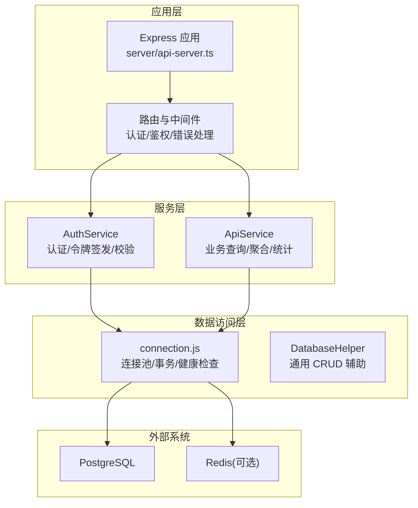
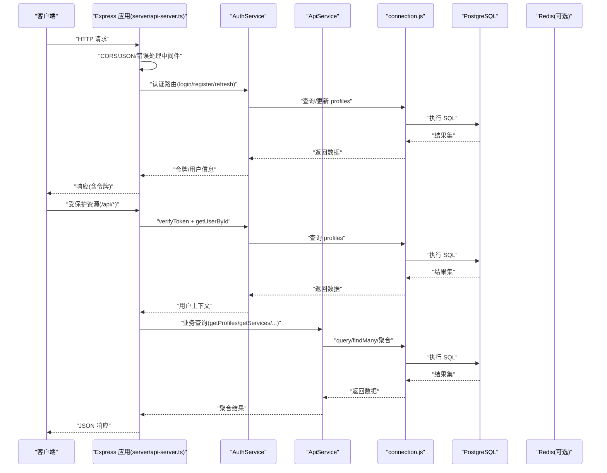
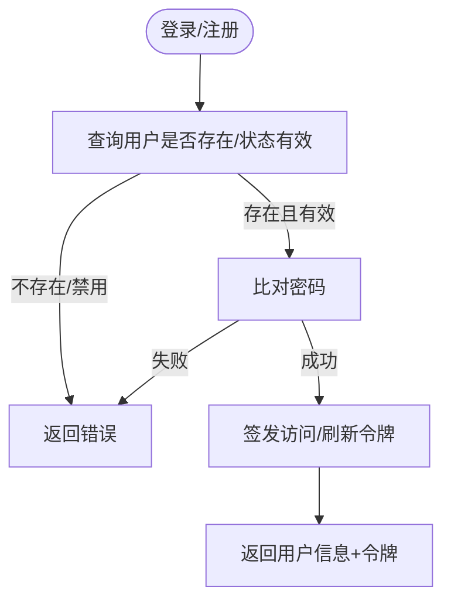
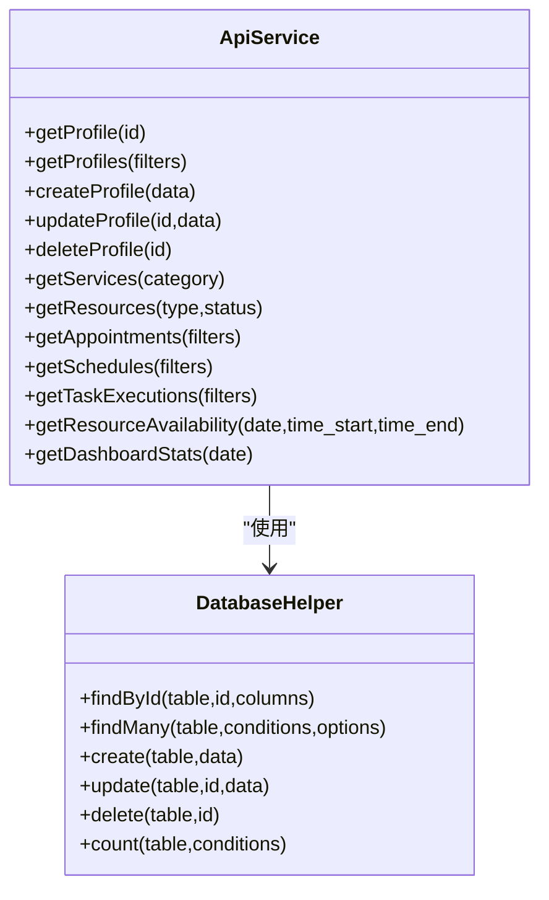
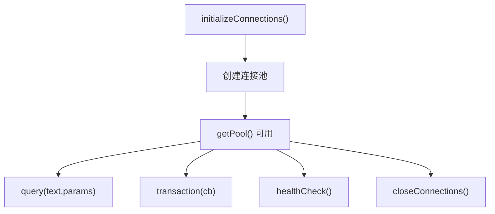
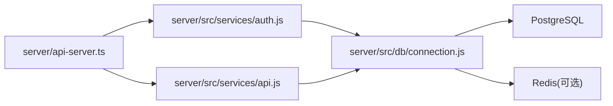

# 后端架构

<cite>
**本文引用的文件**
- [server/api-server.ts](file://server/api-server.ts)
- [server/src/db/connection.js](file://server/src/db/connection.js)
- [server/src/services/api.js](file://server/src/services/api.js)
- [server/src/services/auth.js](file://server/src/services/auth.js)
- [src/db/connection.ts](file://src/db/connection.ts)
- [src/types/types.ts](file://src/types/types.ts)
- [test-all-apis.js](file://test-all-apis.js)
- [start.sh](file://start.sh)
- [API服务器重启指南.md](file://API服务器重启指南.md)
</cite>

## 目录
1. [引言](#引言)
2. [项目结构](#项目结构)
3. [核心组件](#核心组件)
4. [架构总览](#架构总览)
5. [详细组件分析](#详细组件分析)
6. [依赖关系分析](#依赖关系分析)
7. [性能考量](#性能考量)
8. [故障排查指南](#故障排查指南)
9. [结论](#结论)
10. [附录](#附录)

## 引言
本文件面向后端开发者，系统化梳理 Bio-Appointment 后端架构，重点覆盖基于 Express.js 的 RESTful API 服务器设计、中间件与路由分发、业务服务层（ApiService 与 AuthService）职责划分、数据库连接池（connection.js）单例模式与高并发性能考量，并给出分层架构图与 JWT 认证流程、API 版本控制策略说明，帮助读者快速理解与高效维护系统。

## 项目结构
后端采用“多层分层”组织方式：
- 服务器入口与路由：Express 应用在 server/api-server.ts 中初始化，注册中间件与路由。
- 业务服务层：ApiService 提供数据访问与聚合查询；AuthService 处理认证与授权。
- 数据访问层：统一导出 connection.js，封装连接池、事务、健康检查与通用查询工具类。
- 类型定义：src/types/types.ts 提供强类型约束，贯穿服务层与控制器。
- 工具与脚本：启动脚本、健康检查脚本辅助开发与运维。

图表来源
- [server/api-server.ts](file://server/api-server.ts#L1-L120)
- [server/src/services/auth.js](file://server/src/services/auth.js#L1-L120)
- [server/src/services/api.js](file://server/src/services/api.js#L1-L120)
- [server/src/db/connection.js](file://server/src/db/connection.js#L1-L120)

章节来源
- [server/api-server.ts](file://server/api-server.ts#L1-L120)
- [src/types/types.ts](file://src/types/types.ts#L1-L120)

## 核心组件
- Express 服务器与中间件
  - CORS 配置、JSON 请求体解析、全局错误处理中间件。
  - 健康检查端点用于快速诊断数据库与缓存状态。
- 路由与鉴权
  - 认证路由：登录、注册、刷新、登出。
  - 保护路由：统一的 Bearer Token 鉴权中间件，拦截未携带或无效令牌的请求。
  - 路由分发：按资源域划分（/api/profiles、/api/services、/api/appointments 等），支持查询参数过滤与分页。
- 业务服务层
  - ApiService：封装 profiles、services、resources、appointments、schedules、task_executions 的查询与聚合，提供资源可用性与仪表盘统计。
  - AuthService：密码哈希、令牌签发与校验、刷新、用户资料更新、权限矩阵。
- 数据访问层
  - connection.js：PostgreSQL 连接池、Redis 客户端（可选）、query 封装、事务、健康检查、关闭连接。
  - DatabaseHelper：通用 CRUD 辅助（findById/findMany/create/update/delete/count）。
- 类型系统
  - src/types/types.ts：用户角色、状态枚举、实体模型、输入输出类型、钉钉集成相关类型等，保证前后端一致的契约。

章节来源
- [server/api-server.ts](file://server/api-server.ts#L1-L200)
- [server/src/services/api.js](file://server/src/services/api.js#L1-L120)
- [server/src/services/auth.js](file://server/src/services/auth.js#L1-L120)
- [server/src/db/connection.js](file://server/src/db/connection.js#L1-L120)
- [src/types/types.ts](file://src/types/types.ts#L1-L200)

## 架构总览
下图展示从客户端到数据库的完整调用链路，以及各层职责边界。

图表来源
- [server/api-server.ts](file://server/api-server.ts#L100-L200)
- [server/src/services/auth.js](file://server/src/services/auth.js#L120-L220)
- [server/src/services/api.js](file://server/src/services/api.js#L1-L120)
- [server/src/db/connection.js](file://server/src/db/connection.js#L77-L120)

## 详细组件分析

### Express 服务器与路由分发
- 服务器启动与中间件
  - 初始化 CORS（允许前端地址）、JSON 解析。
  - 全局错误处理中间件统一返回 500 与错误消息。
  - 健康检查端点调用 connection.js 的 healthCheck，返回数据库与缓存状态。
- 路由分发
  - 认证路由：/api/auth/login、/api/auth/register、/api/auth/refresh、/api/auth/logout。
  - 保护路由：在 /api 前缀上挂载 authenticateToken 中间件，拦截无令牌或无效令牌请求。
  - 业务路由：/api/profiles、/api/services、/api/resources、/api/appointments、/api/schedules、/api/task-executions、/api/dashboard/stats、/api/resources/availability 等。
  - 钉钉集成路由：/api/dingtalk/config、/api/dingtalk/sync 等，内部进行超级管理员权限校验。
- 数据库初始化
  - 首次请求前 ensureDatabase 调用 initializeConnections，确保连接池建立。

章节来源
- [server/api-server.ts](file://server/api-server.ts#L1-L120)
- [server/api-server.ts](file://server/api-server.ts#L118-L151)
- [server/api-server.ts](file://server/api-server.ts#L150-L201)
- [server/api-server.ts](file://server/api-server.ts#L200-L475)

### 认证与授权（AuthService）
- 密码处理
  - 使用 bcrypt 对明文密码进行哈希存储；登录时比对密码。
- 令牌体系
  - JWT Secret、过期时间由环境变量配置；分别生成访问令牌与刷新令牌。
  - verifyToken 校验签名、issuer、audience，区分过期与非法令牌。
- 用户生命周期
  - register：用户名去重、哈希密码、创建用户并返回不含敏感字段的用户信息。
  - login：查找用户、校验状态、比对密码、签发双令牌。
  - refreshToken：校验刷新令牌、确认用户仍有效、重新签发新令牌。
  - getUserById：按 ID 查询用户并移除敏感字段。
  - 权限矩阵：根据角色返回可执行的操作集合，便于后续细粒度权限控制扩展。

图表来源
- [server/src/services/auth.js](file://server/src/services/auth.js#L93-L179)
- [server/src/services/auth.js](file://server/src/services/auth.js#L148-L168)

章节来源
- [server/src/services/auth.js](file://server/src/services/auth.js#L1-L284)

### 业务服务层（ApiService）
- 职责边界
  - 仅负责业务语义的查询与聚合，不直接操作数据库；委托 connection.js 与 DatabaseHelper。
  - 统一移除敏感字段（如 password_hash），保障返回数据安全。
- 主要能力
  - profiles：按条件查询、分页排序、创建/更新/删除。
  - services：按分类过滤、启用状态筛选。
  - resources：按类型/状态过滤、启用状态筛选。
  - appointments：动态 WHERE 构建（名称、状态、医生/销售/日期范围等）。
  - schedules：多表联结查询，返回带详情的排班列表。
  - task_executions：按 schedule/nurse/status/date 过滤。
  - 资源可用性：并发检查房间与护士在指定时间段内的冲突，返回可用列表。
  - 仪表盘统计：按日期统计预约、排班、任务完成情况。
- 性能注意
  - 动态 WHERE 构建避免 SQL 注入风险，参数化查询。
  - 并发查询（Promise.all）提升资源可用性与统计查询效率。

图表来源
- [server/src/services/api.js](file://server/src/services/api.js#L1-L374)
- [server/src/db/connection.js](file://server/src/db/connection.js#L160-L270)

章节来源
- [server/src/services/api.js](file://server/src/services/api.js#L1-L374)

### 数据访问层（connection.js 与 DatabaseHelper）
- 单例与连接池
  - 通过 initializeConnections 初始化 PostgreSQL Pool，设置最大连接数、空闲超时、连接超时等参数。
  - getPool 返回已初始化的连接池；未初始化则抛错，防止未准备的数据库调用。
- Redis 支持
  - 可选 Redis 客户端，初始化失败会降级运行（不影响核心功能）。
- 查询与事务
  - query 包装 pg.Pool.query，记录耗时与行数，异常时统一抛出。
  - transaction 提供 BEGIN/COMMIT/ROLLBACK 与 finally 释放连接，保证一致性。
- 健康检查与关闭
  - healthCheck 同时检测 PostgreSQL 与 Redis（若可用）。
  - closeConnections 正确关闭连接池与 Redis 客户端。
- DatabaseHelper
  - 提供通用 CRUD 与计数方法，支持动态 WHERE、ORDER BY、LIMIT/OFFSET，减少样板代码。

图表来源
- [server/src/db/connection.js](file://server/src/db/connection.js#L1-L120)
- [server/src/db/connection.js](file://server/src/db/connection.js#L120-L270)

章节来源
- [server/src/db/connection.js](file://server/src/db/connection.js#L1-L270)
- [src/db/connection.ts](file://src/db/connection.ts#L1-L165)

### 类型系统（src/types/types.ts）
- 角色与状态枚举：用户、服务、资源、预约、排班、任务执行等状态与类别。
- 实体模型：Profile、Service、Resource、Appointment、Schedule、TaskExecution 等。
- 输入输出类型：Create/Update/Filter 等输入类型，以及扩展详情类型。
- 钉钉集成类型：同步配置、日志、部门映射、用户映射、通知等。
- 作用：为控制器、服务层与前端提供一致的数据契约，降低耦合与错误率。

章节来源
- [src/types/types.ts](file://src/types/types.ts#L1-L200)
- [src/types/types.ts](file://src/types/types.ts#L200-L487)

### API 版本控制策略
- 当前实现
  - 路由以 /api 前缀统一承载，未见显式版本号（如 /api/v1）。
- 建议
  - 采用路径版本：/api/v1/*，便于未来演进与向后兼容。
  - 若采用查询参数版本，需在网关或中间件统一解析与路由转发。
  - 严格遵循语义化版本，变更前先发布预发布版本并充分测试。

[本节为概念性建议，不直接分析具体文件]

## 依赖关系分析
- 控制器到服务层：路由处理器调用 AuthService 与 ApiService。
- 服务层到数据访问层：ApiService 与 AuthService 通过 connection.js 与 DatabaseHelper 访问数据库。
- 外部依赖：Express、pg.Pool、jsonwebtoken、bcrypt、redis。
- 环境变量：数据库与缓存主机、端口、凭据、JWT 密钥与过期时间。

图表来源
- [server/api-server.ts](file://server/api-server.ts#L1-L120)
- [server/src/services/auth.js](file://server/src/services/auth.js#L1-L120)
- [server/src/services/api.js](file://server/src/services/api.js#L1-L120)
- [server/src/db/connection.js](file://server/src/db/connection.js#L1-L120)

章节来源
- [server/api-server.ts](file://server/api-server.ts#L1-L120)
- [server/src/services/auth.js](file://server/src/services/auth.js#L1-L120)
- [server/src/services/api.js](file://server/src/services/api.js#L1-L120)
- [server/src/db/connection.js](file://server/src/db/connection.js#L1-L120)

## 性能考量
- 连接池参数
  - 最大连接数、空闲超时、连接超时：根据并发峰值与数据库性能调优。
  - 建议：监控连接池利用率与等待时间，避免过度扩容导致数据库压力。
- 查询优化
  - ApiService 的动态 WHERE 构建与参数化查询，避免 SQL 注入与提升可读性。
  - 聚合查询使用 JOIN 与索引列（如 scheduled_date、status）。
- 并发与缓存
  - Redis 可选支持，适合会话与热点数据缓存；未初始化时不影响核心流程。
- 日志与可观测性
  - query 内部记录耗时与行数，便于定位慢查询。
  - 健康检查端点可用于自动化巡检。

[本节为通用性能建议，不直接分析具体文件]

## 故障排查指南
- 启动与健康检查
  - 使用 start.sh 启动后，自动检查 /api/health；若失败，查看 /tmp/api-server.log。
  - 如需重启，参考 API服务器重启指南.md，确保端口未被占用。
- 常见错误
  - 401 未携带或无效令牌：检查前端是否正确携带 Authorization: Bearer <token>。
  - 403 权限不足：钉钉配置与同步接口仅超级管理员可访问。
  - 500 数据库连接失败：检查 PostgreSQL/Redis 运行状态与连接参数。
- 自动化测试
  - test-all-apis.js 提供健康检查、资源查询与预约创建的端到端测试，便于快速验证。

章节来源
- [start.sh](file://start.sh#L139-L173)
- [API服务器重启指南.md](file://API服务器重启指南.md#L1-L84)
- [test-all-apis.js](file://test-all-apis.js#L1-L98)

## 结论
本架构以 Express 为核心，清晰划分控制器、服务层与数据访问层，配合连接池与通用查询工具，既满足当前业务需求，又具备良好的扩展性与可维护性。建议尽快引入 API 版本控制（路径式 v1），并在生产环境完善 Redis 缓存与更细粒度的权限控制，持续优化连接池参数与查询性能，确保高并发场景下的稳定性与吞吐量。

## 附录
- 开发与运维
  - 启动脚本：start.sh 自动启动数据库、API 服务器与前端，并进行健康检查。
  - 重启指南：API服务器重启指南.md 提供一键重启与日志查看方法。
- 测试脚本：test-all-apis.js 覆盖健康检查、资源查询与预约创建，便于回归测试。

章节来源
- [start.sh](file://start.sh#L139-L173)
- [API服务器重启指南.md](file://API服务器重启指南.md#L1-L84)
- [test-all-apis.js](file://test-all-apis.js#L1-L98)