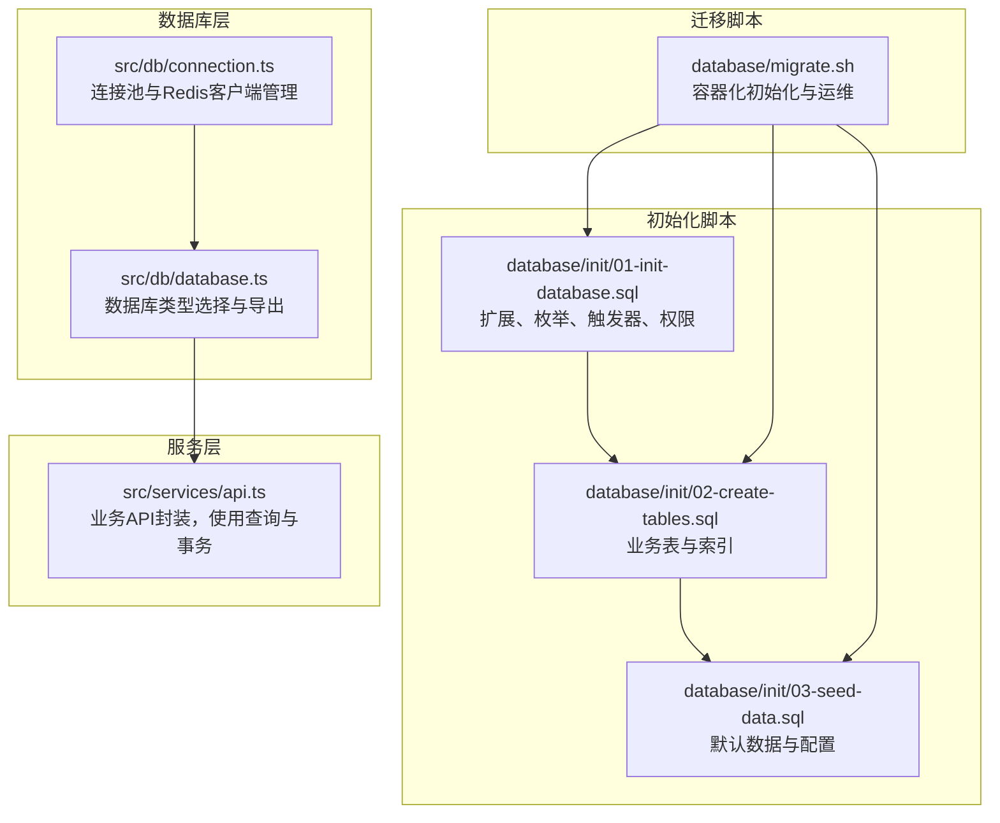
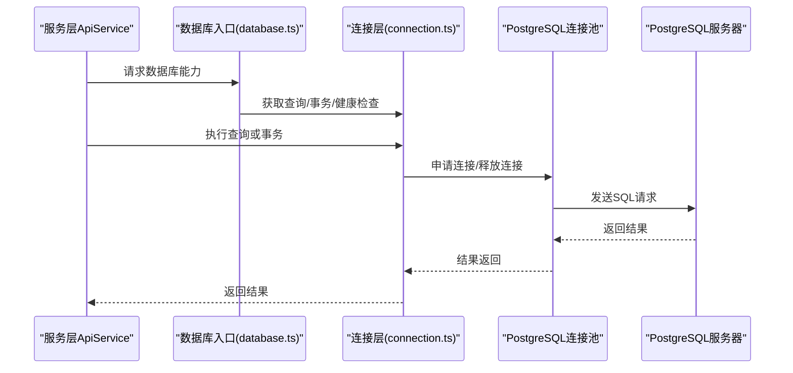
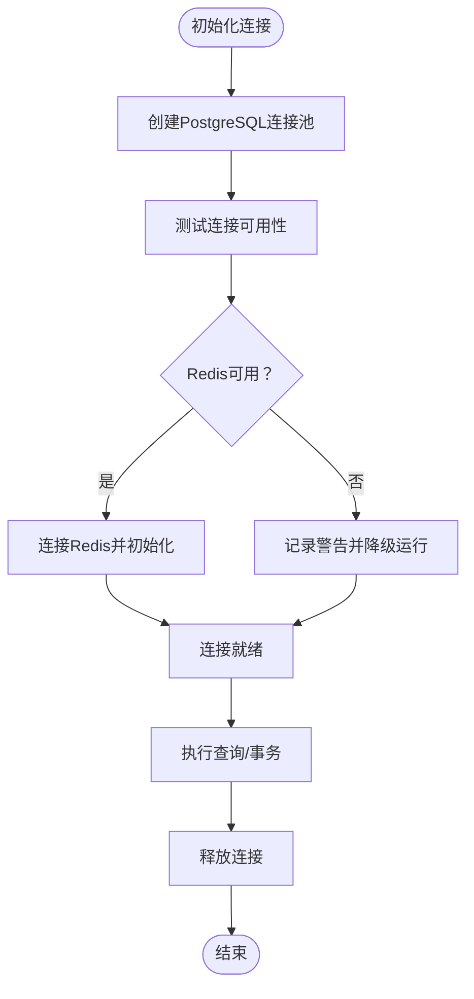
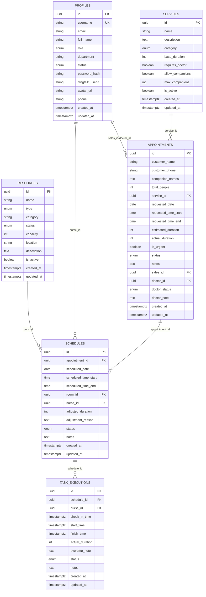
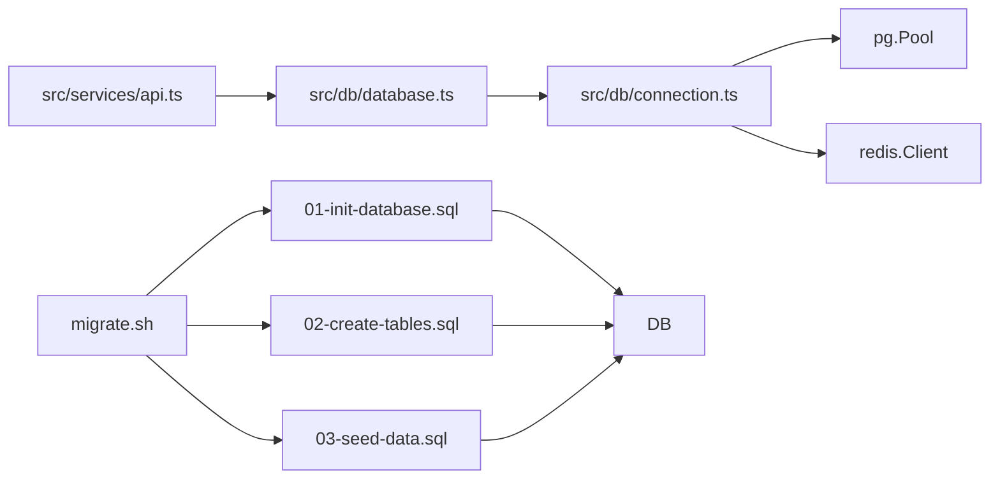

# 数据库连接

<cite>
**本文引用的文件**
- [src/db/connection.ts](file://src/db/connection.ts)
- [src/db/database.ts](file://src/db/database.ts)
- [database/init/01-init-database.sql](file://database/init/01-init-database.sql)
- [database/init/02-create-tables.sql](file://database/init/02-create-tables.sql)
- [database/init/03-seed-data.sql](file://database/init/03-seed-data.sql)
- [database/migrate.sh](file://database/migrate.sh)
- [.env.example](file://.env.example)
- [src/services/api.ts](file://src/services/api.ts)
</cite>

## 目录
1. [简介](#简介)
2. [项目结构](#项目结构)
3. [核心组件](#核心组件)
4. [架构总览](#架构总览)
5. [详细组件分析](#详细组件分析)
6. [依赖分析](#依赖分析)
7. [性能考虑](#性能考虑)
8. [故障排查指南](#故障排查指南)
9. [结论](#结论)
10. [附录](#附录)

## 简介
本文件聚焦于数据库连接层的设计与实现，围绕 PostgreSQL 连接池的单例模式、连接配置、连接复用、超时设置与错误处理策略展开；同时说明 connection 层如何管理数据库客户端实例生命周期，并在高并发场景下保障稳定性与性能。文档还结合数据库初始化脚本（02-create-tables.sql）解释表结构设计与 ORM 模型的映射关系，并提供连接池监控指标、性能优化建议以及常见连接问题（如连接泄漏、超时）的解决方案。

## 项目结构
数据库连接层位于前端工程的 src/db 目录中，采用单例模式对外暴露连接池与辅助工具函数，配合数据库初始化脚本完成表结构与索引的建立。服务层通过统一入口访问数据库能力。

图表来源
- [src/db/connection.ts](file://src/db/connection.ts#L1-L166)
- [src/db/database.ts](file://src/db/database.ts#L1-L43)
- [database/init/01-init-database.sql](file://database/init/01-init-database.sql#L1-L112)
- [database/init/02-create-tables.sql](file://database/init/02-create-tables.sql#L1-L274)
- [database/init/03-seed-data.sql](file://database/init/03-seed-data.sql#L1-L77)
- [database/migrate.sh](file://database/migrate.sh#L1-L233)
- [src/services/api.ts](file://src/services/api.ts#L1-L483)

章节来源
- [src/db/connection.ts](file://src/db/connection.ts#L1-L166)
- [src/db/database.ts](file://src/db/database.ts#L1-L43)
- [database/init/01-init-database.sql](file://database/init/01-init-database.sql#L1-L112)
- [database/init/02-create-tables.sql](file://database/init/02-create-tables.sql#L1-L274)
- [database/init/03-seed-data.sql](file://database/init/03-seed-data.sql#L1-L77)
- [database/migrate.sh](file://database/migrate.sh#L1-L233)
- [src/services/api.ts](file://src/services/api.ts#L1-L483)

## 核心组件
- 连接池与Redis客户端管理：负责连接池初始化、健康检查、查询执行、事务控制、连接关闭等。
- 数据库类型选择：根据配置选择本地 PostgreSQL 或 Supabase（当前示例为本地）。
- 初始化脚本：创建扩展、枚举、触发器、权限、业务表与索引、默认数据。
- 服务层API：通过统一入口使用查询与事务，实现业务逻辑。

章节来源
- [src/db/connection.ts](file://src/db/connection.ts#L1-L166)
- [src/db/database.ts](file://src/db/database.ts#L1-L43)
- [database/init/01-init-database.sql](file://database/init/01-init-database.sql#L1-L112)
- [database/init/02-create-tables.sql](file://database/init/02-create-tables.sql#L1-L274)
- [database/init/03-seed-data.sql](file://database/init/03-seed-data.sql#L1-L77)
- [src/services/api.ts](file://src/services/api.ts#L1-L483)

## 架构总览
连接层以单例模式持有连接池与可选的 Redis 客户端，对外提供查询、事务、健康检查与关闭接口；服务层通过统一入口访问数据库能力，避免直接操作底层连接池。

图表来源
- [src/services/api.ts](file://src/services/api.ts#L1-L483)
- [src/db/database.ts](file://src/db/database.ts#L1-L43)
- [src/db/connection.ts](file://src/db/connection.ts#L1-L166)

## 详细组件分析

### 连接池与Redis客户端管理（connection.ts）
- 单例模式：内部维护全局连接池与Redis客户端，初始化后不可重复初始化，提供获取池与客户端的只读访问。
- 连接配置：
  - PostgreSQL：最大连接数、空闲超时、连接超时等参数在配置对象中集中定义。
  - Redis：主机、端口、密码等配置，初始化失败会降级为无缓存运行。
- 查询执行：自动记录耗时与影响行数，异常时记录错误并抛出。
- 事务控制：自动 BEGIN/COMMIT/ROLLBACK，确保异常时资源释放。
- 健康检查：分别对 PostgreSQL 与 Redis 进行连通性检测。
- 关闭连接：优雅关闭连接池与 Redis 客户端。

图表来源
- [src/db/connection.ts](file://src/db/connection.ts#L1-L166)

章节来源
- [src/db/connection.ts](file://src/db/connection.ts#L1-L166)

### 数据库类型选择与导出（database.ts）
- 依据配置选择本地 PostgreSQL，初始化后向服务层导出查询与数据库助手。
- 提供类型判断函数，便于上层逻辑分支处理。

章节来源
- [src/db/database.ts](file://src/db/database.ts#L1-L43)

### 表结构设计与ORM模型映射（02-create-tables.sql）
- 业务表概览与字段语义：
  - profiles：用户档案，含角色、状态、部门、密码哈希等。
  - services：服务项，含分类、时长、是否需要医生等。
  - resources：资源（房间、护士），含容量、位置、状态等。
  - appointments：预约，含客户信息、服务、时间、状态等。
  - schedules：排班，关联预约、房间、护士、调整信息等。
  - task_executions：任务执行，记录签到、开始、完成等。
  - dingtalk_*：钉钉集成相关表。
  - user_sessions：会话管理。
- 索引与触发器：
  - 为高频查询字段建立索引，提升查询性能。
  - 为多张表创建更新时间戳触发器，自动维护 updated_at。
  - 为关键表创建审计触发器，记录增删改日志。
- 与ORM模型映射：
  - ApiService 中的模型类型与上述表字段一一对应，查询与更新均基于表结构设计。

图表来源
- [database/init/02-create-tables.sql](file://database/init/02-create-tables.sql#L1-L274)

章节来源
- [database/init/02-create-tables.sql](file://database/init/02-create-tables.sql#L1-L274)
- [src/services/api.ts](file://src/services/api.ts#L1-L483)

### 初始化脚本与迁移（01-init-database.sql、02-create-tables.sql、03-seed-data.sql、migrate.sh）
- 01-init-database.sql：启用 UUID、加密等扩展，创建自定义枚举类型，定义更新时间戳与审计触发器函数，授予 app_user 权限。
- 02-create-tables.sql：创建业务表与索引，包含触发器维护 updated_at 与审计日志。
- 03-seed-data.sql：插入默认服务、资源、用户与系统配置，便于开发与演示。
- migrate.sh：容器化初始化脚本，支持启动容器、创建数据库与用户、执行初始化脚本、备份/恢复/重置数据库、查看状态等。

章节来源
- [database/init/01-init-database.sql](file://database/init/01-init-database.sql#L1-L112)
- [database/init/02-create-tables.sql](file://database/init/02-create-tables.sql#L1-L274)
- [database/init/03-seed-data.sql](file://database/init/03-seed-data.sql#L1-L77)
- [database/migrate.sh](file://database/migrate.sh#L1-L233)

### 服务层API与连接层交互（src/services/api.ts）
- ApiService 统一封装 CRUD 与统计查询，内部使用 DatabaseHelper 与 query 接口访问数据库。
- 支持复杂过滤条件与联表查询，利用连接池并发执行多个查询。
- 通过事务封装关键写入流程，确保一致性。

章节来源
- [src/services/api.ts](file://src/services/api.ts#L1-L483)
- [src/db/connection.ts](file://src/db/connection.ts#L1-L166)

## 依赖分析
- 连接层依赖：
  - pg：PostgreSQL 连接池与客户端。
  - redis：可选缓存客户端。
- 服务层依赖：
  - database.ts：统一数据库入口。
  - connection.ts：查询、事务、健康检查等能力。
- 初始化脚本依赖：
  - 由 migrate.sh 驱动执行，确保数据库与权限正确配置。

图表来源
- [src/services/api.ts](file://src/services/api.ts#L1-L483)
- [src/db/database.ts](file://src/db/database.ts#L1-L43)
- [src/db/connection.ts](file://src/db/connection.ts#L1-L166)
- [database/init/01-init-database.sql](file://database/init/01-init-database.sql#L1-L112)
- [database/init/02-create-tables.sql](file://database/init/02-create-tables.sql#L1-L274)
- [database/init/03-seed-data.sql](file://database/init/03-seed-data.sql#L1-L77)
- [database/migrate.sh](file://database/migrate.sh#L1-L233)

章节来源
- [src/services/api.ts](file://src/services/api.ts#L1-L483)
- [src/db/database.ts](file://src/db/database.ts#L1-L43)
- [src/db/connection.ts](file://src/db/connection.ts#L1-L166)
- [database/init/01-init-database.sql](file://database/init/01-init-database.sql#L1-L112)
- [database/init/02-create-tables.sql](file://database/init/02-create-tables.sql#L1-L274)
- [database/init/03-seed-data.sql](file://database/init/03-seed-data.sql#L1-L77)
- [database/migrate.sh](file://database/migrate.sh#L1-L233)

## 性能考虑
- 连接池参数建议：
  - 最大连接数：根据并发峰值与数据库承载能力设定，避免过高导致资源争用。
  - 空闲超时：适中设置，平衡资源回收与频繁重建成本。
  - 连接超时：短于请求超时，避免阻塞等待。
- 查询优化：
  - 利用 02-create-tables.sql 中的索引覆盖高频查询字段。
  - 对复杂联表查询使用 LIMIT/OFFSET 分页，避免一次性返回大量数据。
- 缓存策略：
  - Redis 可选启用，用于热点数据与会话存储；若不可用应保持功能可用性。
- 并发与事务：
  - 使用事务包裹写入流程，减少锁冲突与数据不一致风险。
  - 避免长事务，缩短事务窗口，降低锁持有时间。
- 监控指标（建议）：
  - 连接池活跃/空闲/等待/超时计数。
  - 查询耗时分布与慢查询数量。
  - 事务提交/回滚次数与失败率。
  - Redis 命中率与延迟。

[本节为通用性能建议，无需列出具体文件来源]

## 故障排查指南
- 连接泄漏：
  - 确认每次查询/事务结束后均释放连接（连接池自动管理，但避免长时间持有客户端句柄）。
  - 使用健康检查与连接池状态监控，发现异常及时重启服务。
- 超时问题：
  - 检查连接超时与查询超时配置，适当提高或分批处理大数据量。
  - 对复杂查询添加索引，减少扫描范围。
- 连接池耗尽：
  - 评估并发峰值，增加最大连接数或优化查询性能。
  - 使用连接池状态监控，定位长时间占用连接的请求。
- Redis 不可用：
  - 初始化阶段降级运行，不影响核心功能；修复后自动恢复缓存能力。
- 数据库初始化失败：
  - 使用 migrate.sh 检查容器状态、数据库与用户创建情况，重新执行初始化脚本。

章节来源
- [src/db/connection.ts](file://src/db/connection.ts#L1-L166)
- [database/migrate.sh](file://database/migrate.sh#L1-L233)

## 结论
该数据库连接层采用单例模式管理 PostgreSQL 连接池与可选 Redis 客户端，提供查询、事务、健康检查与关闭等核心能力；配合完善的初始化脚本与迁移工具，能够满足高并发场景下的稳定性与性能需求。通过合理的连接池参数、索引与缓存策略，以及持续的监控与告警，可有效降低连接泄漏与超时风险，保障系统的长期可靠运行。

[本节为总结性内容，无需列出具体文件来源]

## 附录
- 环境变量参考（.env.example）：包含数据库类型、连接地址、Redis 配置、JWT 等关键参数，便于本地开发与部署。

章节来源
- [.env.example](file://.env.example#L1-L42)