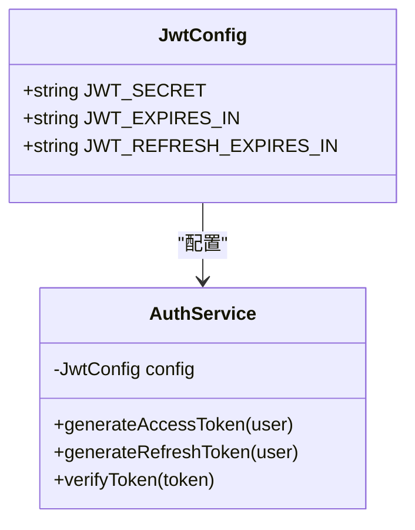
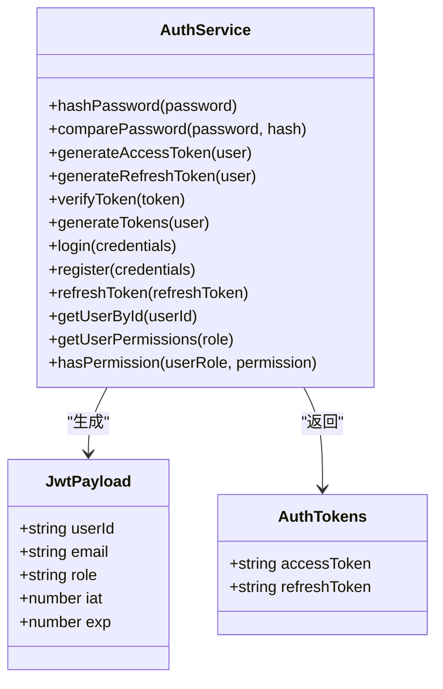
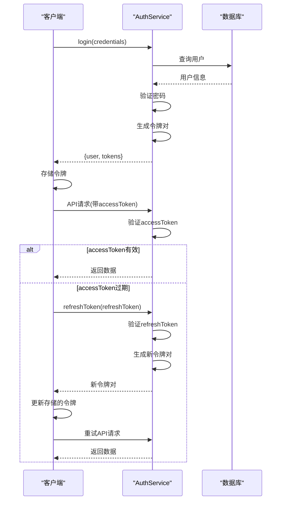
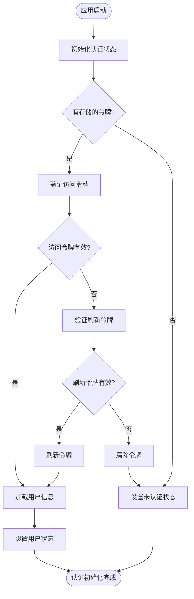
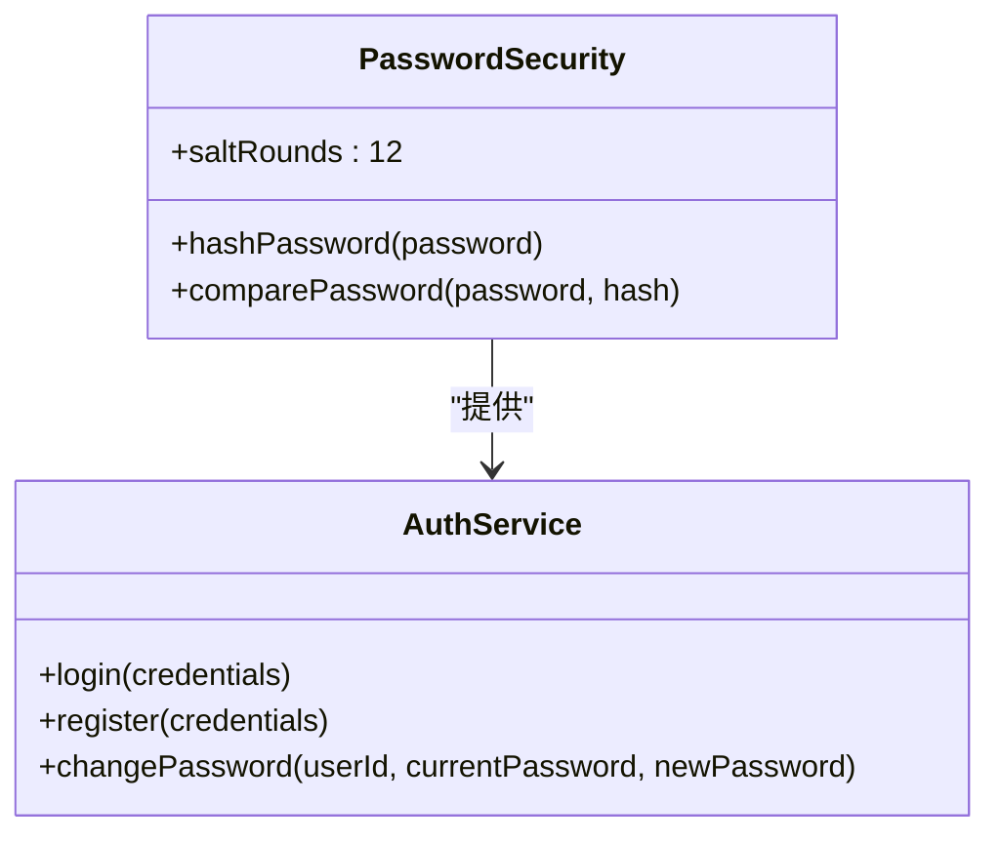
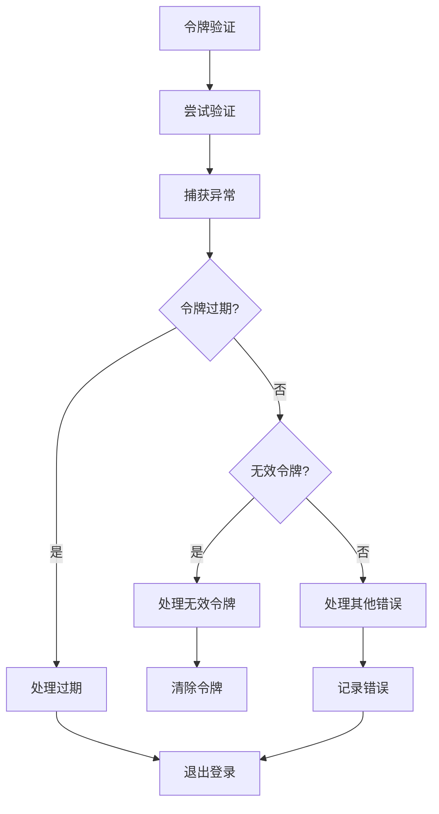

# JWT实现

<cite>
**本文档引用的文件**   
- [auth.ts](file://src/services/auth.ts)
- [auth-client.ts](file://src/services/auth-client.ts)
- [AuthContext.tsx](file://src/contexts/AuthContext.tsx)
- [connection.ts](file://src/db/connection.ts)
- [types.ts](file://src/types/types.ts)
- [auth.js](file://server/src/services/auth.js)
- [.env.example](file://.env.example)
</cite>

## 目录
1. [简介](#简介)
2. [JWT配置与安全](#jwt配置与安全)
3. [认证服务实现](#认证服务实现)
4. [令牌生命周期管理](#令牌生命周期管理)
5. [客户端认证流程](#客户端认证流程)
6. [密码安全实践](#密码安全实践)
7. [异常处理与安全建议](#异常处理与安全建议)

## 简介
Bio-Appointment系统采用JWT（JSON Web Token）实现用户认证机制，通过访问令牌和刷新令牌的双令牌模式确保系统安全性和用户体验。本系统实现了完整的认证流程，包括用户登录、令牌验证、令牌刷新和权限管理等功能。认证系统分为服务端和客户端两个部分，服务端负责令牌的生成和验证，客户端负责令牌的存储和使用。

**Section sources**
- [auth.ts](file://src/services/auth.ts#L1-L341)
- [auth-client.ts](file://src/services/auth-client.ts#L1-L235)

## JWT配置与安全
系统通过环境变量配置JWT相关参数，确保配置的灵活性和安全性。JWT配置包括密钥、访问令牌过期时间和刷新令牌过期时间。

**Diagram sources**
- [auth.ts](file://src/services/auth.ts#L6-L9)
- [.env.example](file://.env.example#L24-L27)

### 配置细节
系统JWT配置如下：
- **JWT_SECRET**: 用于签名和验证JWT令牌的密钥，从环境变量`VITE_JWT_SECRET`或`JWT_SECRET`获取，若未设置则使用默认值`your-secret-key-change-in-production`
- **JWT_EXPIRES_IN**: 访问令牌过期时间，从环境变量`VITE_JWT_EXPIRES_IN`或`JWT_EXPIRES_IN`获取，默认值为`24h`
- **JWT_REFRESH_EXPIRES_IN**: 清理令牌过期时间，从环境变量`VITE_JWT_REFRESH_EXPIRES_IN`或`JWT_REFRESH_EXPIRES_IN`获取，默认值为`7d`

这些配置通过严格的环境变量优先级机制实现，确保生产环境的安全性。系统还设置了令牌的签发者（issuer）为`bio-appointment`，受众（audience）为`bio-appointment-users`，增强了令牌的安全性。

**Section sources**
- [auth.ts](file://src/services/auth.ts#L6-L9)
- [.env.example](file://.env.example#L24-L27)

## 认证服务实现
AuthService是系统认证的核心服务，提供了完整的用户认证功能，包括令牌生成、验证、用户注册和登录等。

**Diagram sources**
- [auth.ts](file://src/services/auth.ts#L11-L28)
- [auth.ts](file://src/services/auth.ts#L33-L338)

### 令牌生成与验证
AuthService提供了三个核心方法来处理JWT令牌：

1. **generateAccessToken**: 生成访问令牌，包含用户ID、邮箱和角色信息，设置过期时间为`JWT_EXPIRES_IN`
2. **generateRefreshToken**: 生成刷新令牌，包含相同的信息，但过期时间更长（`JWT_REFRESH_EXPIRES_IN`）
3. **verifyToken**: 验证令牌的有效性，检查签名、过期时间和签发者/受众信息

令牌的载荷（payload）包含用户ID、邮箱和角色，这些信息在验证后可用于身份识别和权限检查。

**Section sources**
- [auth.ts](file://src/services/auth.ts#L50-L103)

## 令牌生命周期管理
系统实现了完整的令牌生命周期管理，包括令牌的生成、存储、刷新和失效处理。

**Diagram sources**
- [auth.ts](file://src/services/auth.ts#L108-L204)
- [auth-client.ts](file://src/services/auth-client.ts#L111-L126)

### 双令牌机制
系统采用访问令牌和刷新令牌的双令牌机制：
- **访问令牌（Access Token）**: 短期有效（默认24小时），用于日常API请求的身份验证
- **刷新令牌（Refresh Token）**: 长期有效（默认7天），用于在访问令牌过期后获取新的访问令牌

这种机制平衡了安全性和用户体验，避免了用户频繁登录，同时限制了访问令牌的暴露风险。

**Section sources**
- [auth.ts](file://src/services/auth.ts#L8-L9)
- [auth.ts](file://src/services/auth.ts#L108-L113)

## 客户端认证流程
客户端通过AuthContext和ClientAuthService实现完整的认证流程，包括自动令牌刷新和状态管理。

**Diagram sources**
- [AuthContext.tsx](file://src/contexts/AuthContext.tsx#L80-L138)
- [auth-client.ts](file://src/services/auth-client.ts#L30-L232)

### 自动刷新机制
系统实现了智能的自动令牌刷新机制：
1. 每分钟检查一次访问令牌的过期时间
2. 当访问令牌剩余有效期少于5分钟时，自动使用刷新令牌获取新的令牌对
3. 如果访问令牌已过期，则直接使用刷新令牌刷新
4. 如果刷新令牌也无效，则清除所有令牌并要求用户重新登录

此外，系统还实现了令牌的本地存储，使用localStorage保存访问令牌和刷新令牌，确保页面刷新后用户状态不丢失。

**Section sources**
- [AuthContext.tsx](file://src/contexts/AuthContext.tsx#L232-L276)

## 密码安全实践
系统采用bcrypt算法进行密码哈希处理，确保用户密码的安全存储。

**Diagram sources**
- [auth.ts](file://src/services/auth.ts#L37-L47)
- [auth.ts](file://src/services/auth.ts#L164-L168)

### 安全措施
系统实施了多项密码安全措施：
- 使用bcrypt算法，盐值轮数（saltRounds）设置为12，提供足够的计算强度
- 在用户注册时对密码进行哈希处理，不存储明文密码
- 在登录和修改密码时使用`comparePassword`方法验证密码
- 禁止直接更新密码哈希字段，确保所有密码更新都经过哈希处理

这些措施有效防止了密码泄露风险，即使数据库被攻破，攻击者也无法轻易获取用户明文密码。

**Section sources**
- [auth.ts](file://src/services/auth.ts#L37-L47)
- [auth.ts](file://src/services/auth.ts#L127-L128)

## 异常处理与安全建议
系统实现了完善的异常处理机制，确保认证过程的安全性和用户体验。

**Diagram sources**
- [auth.ts](file://src/services/auth.ts#L86-L102)
- [AuthContext.tsx](file://src/contexts/AuthContext.tsx#L101-L129)

### 安全建议
基于系统实现，提出以下安全建议：
1. **生产环境密钥管理**: 确保`JWT_SECRET`在生产环境中设置为强随机字符串，不应使用默认值
2. **令牌存储安全**: 考虑使用HttpOnly Cookie存储令牌，防止XSS攻击
3. **刷新令牌轮换**: 实现刷新令牌轮换机制，每次使用后生成新的刷新令牌
4. **令牌黑名单**: 实现令牌黑名单机制，支持主动注销和令牌失效
5. **监控与日志**: 记录认证相关的安全事件，便于审计和异常检测

系统还实现了基于角色的权限控制，不同角色拥有不同的权限集合，确保最小权限原则的实施。

**Section sources**
- [auth.ts](file://src/services/auth.ts#L94-L102)
- [auth.ts](file://src/services/auth.ts#L304-L337)