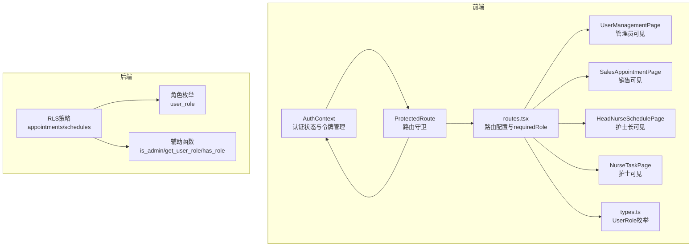
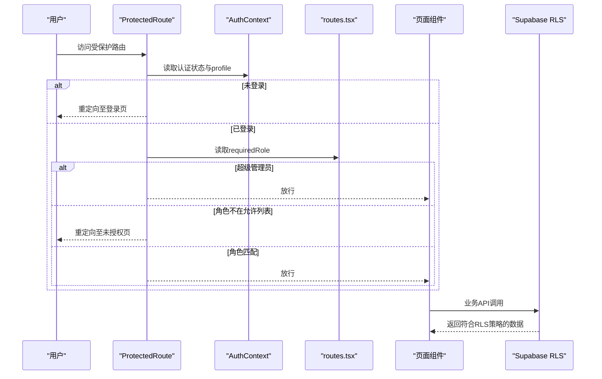
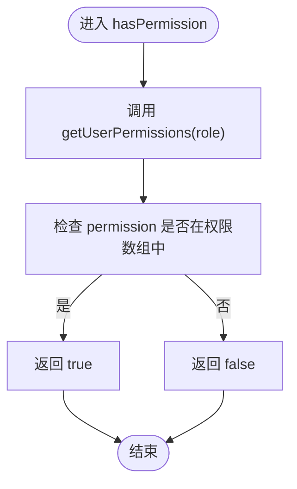
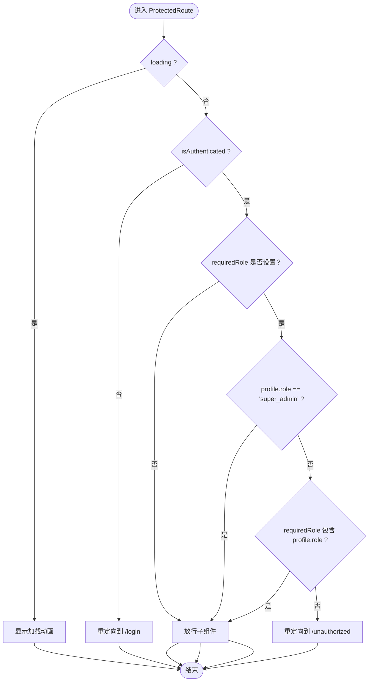
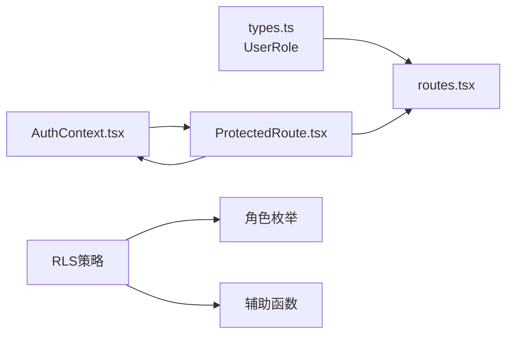

# RBAC权限模型

<cite>
**本文引用的文件**
- [AUTH_IMPLEMENTATION_SUMMARY.md](file://AUTH_IMPLEMENTATION_SUMMARY.md)
- [USER_AUTH_GUIDE.md](file://USER_AUTH_GUIDE.md)
- [src/contexts/AuthContext.tsx](file://src/contexts/AuthContext.tsx)
- [src/services/auth.ts](file://src/services/auth.ts)
- [src/components/auth/ProtectedRoute.tsx](file://src/components/auth/ProtectedRoute.tsx)
- [src/routes.tsx](file://src/routes.tsx)
- [src/types/types.ts](file://src/types/types.ts)
- [supabase/migrations/00008_add_rls_policies_for_role_based_access.sql](file://supabase/migrations/00008_add_rls_policies_for_role_based_access.sql)
- [src/pages/admin/UserManagementPage.tsx](file://src/pages/admin/UserManagementPage.tsx)
- [src/pages/sales/AppointmentPage.tsx](file://src/pages/sales/AppointmentPage.tsx)
- [src/pages/head-nurse/SchedulePage.tsx](file://src/pages/head-nurse/SchedulePage.tsx)
- [src/pages/nurse/TaskPage.tsx](file://src/pages/nurse/TaskPage.tsx)
</cite>

## 目录
1. [引言](#引言)
2. [项目结构](#项目结构)
3. [核心组件](#核心组件)
4. [架构总览](#架构总览)
5. [详细组件分析](#详细组件分析)
6. [依赖关系分析](#依赖关系分析)
7. [性能考量](#性能考量)
8. [故障排除指南](#故障排除指南)
9. [结论](#结论)
10. [附录](#附录)

## 引言
本文件系统性阐述Bio-Appointment系统的基于角色的访问控制（RBAC）模型实现，覆盖角色定义、权限集合、前端路由守卫、后端数据级权限控制（RLS）与操作级权限校验，并结合权限矩阵文档展示不同角色在各功能模块的访问权限差异，最后提供自定义权限扩展的指导建议。

## 项目结构
RBAC相关能力横跨前端与后端：
- 前端侧：认证上下文、路由守卫、页面组件、类型定义
- 后端侧：Supabase RLS策略、角色枚举与辅助函数

图表来源
- [src/contexts/AuthContext.tsx](file://src/contexts/AuthContext.tsx#L1-L308)
- [src/components/auth/ProtectedRoute.tsx](file://src/components/auth/ProtectedRoute.tsx#L1-L49)
- [src/routes.tsx](file://src/routes.tsx#L1-L135)
- [src/types/types.ts](file://src/types/types.ts#L1-L40)
- [supabase/migrations/00008_add_rls_policies_for_role_based_access.sql](file://supabase/migrations/00008_add_rls_policies_for_role_based_access.sql#L1-L180)

章节来源
- [AUTH_IMPLEMENTATION_SUMMARY.md](file://AUTH_IMPLEMENTATION_SUMMARY.md#L1-L120)
- [USER_AUTH_GUIDE.md](file://USER_AUTH_GUIDE.md#L1-L120)

## 核心组件
- 角色与权限
  - 五种角色：super_admin、sales、head_nurse、nurse、doctor
  - 前端权限集合：通过静态映射定义，包含用户管理、预约、排班、任务、系统配置等操作级权限
- 认证上下文
  - 管理登录、登出、注册、令牌刷新、用户信息拉取
  - 暴露isAdmin、profile等能力
- 路由守卫
  - 基于requiredRole进行角色校验；超级管理员拥有豁免权
- RLS策略
  - 对appointments与schedules表实施按角色的数据级访问控制

章节来源
- [src/services/auth.ts](file://src/services/auth.ts#L301-L338)
- [src/contexts/AuthContext.tsx](file://src/contexts/AuthContext.tsx#L283-L297)
- [src/components/auth/ProtectedRoute.tsx](file://src/components/auth/ProtectedRoute.tsx#L12-L49)
- [supabase/migrations/00008_add_rls_policies_for_role_based_access.sql](file://supabase/migrations/00008_add_rls_policies_for_role_based_access.sql#L52-L180)

## 架构总览
RBAC在Bio-Appointment中采用“前端路由守卫 + 后端RLS”的双层保障：
- 前端：路由守卫拦截未授权访问；页面组件按角色渲染与交互
- 后端：RLS策略在数据库层面强制隔离不同角色的数据访问边界

图表来源
- [src/components/auth/ProtectedRoute.tsx](file://src/components/auth/ProtectedRoute.tsx#L12-L49)
- [src/contexts/AuthContext.tsx](file://src/contexts/AuthContext.tsx#L140-L189)
- [src/routes.tsx](file://src/routes.tsx#L30-L135)
- [supabase/migrations/00008_add_rls_policies_for_role_based_access.sql](file://supabase/migrations/00008_add_rls_policies_for_role_based_access.sql#L52-L180)

## 详细组件分析

### 角色与权限集合
- 角色定义
  - super_admin：超级管理员，拥有最高权限
  - sales：销售/健康管理师
  - head_nurse：护士长
  - nurse：护士
  - doctor：医生
- 权限集合（操作级）
  - super_admin：用户、预约、排班、系统配置的增删改查
  - sales：预约的创建、读取、更新
  - head_nurse：预约读取/更新、排班创建/读取/更新、任务创建/读取/更新
  - nurse：任务读取/更新
  - doctor：预约读取/更新
- 数据级权限（RLS）
  - appointments：超级管理员与护士长可查看全部；销售仅能查看自己创建的；医生仅能查看分配给自己的；护士可查看全部
  - schedules：超级管理员与护士长可查看全部；护士仅能查看分配给自己的；销售可查看与其创建的预约相关的排班

章节来源
- [src/services/auth.ts](file://src/services/auth.ts#L301-L338)
- [AUTH_IMPLEMENTATION_SUMMARY.md](file://AUTH_IMPLEMENTATION_SUMMARY.md#L175-L210)
- [USER_AUTH_GUIDE.md](file://USER_AUTH_GUIDE.md#L7-L50)
- [supabase/migrations/00008_add_rls_policies_for_role_based_access.sql](file://supabase/migrations/00008_add_rls_policies_for_role_based_access.sql#L52-L180)

### AuthService中权限判定逻辑
- getUserPermissions(role)
  - 输入角色，返回对应的操作级权限数组
  - 复杂度：O(1)，查表返回
- hasPermission(userRole, permission)
  - 基于getUserPermissions的结果判断是否包含某权限
  - 复杂度：O(k)，k为该角色权限数量

图表来源
- [src/services/auth.ts](file://src/services/auth.ts#L301-L338)

章节来源
- [src/services/auth.ts](file://src/services/auth.ts#L301-L338)

### ProtectedRoute组件的路由级别权限控制
- 逻辑要点
  - 加载中显示加载动画
  - 未登录重定向至登录页
  - 检查requiredRole与当前用户角色
  - 超级管理员豁免，直接放行
  - 角色不在允许列表则重定向至未授权页
- 复杂度：O(1)，仅做角色比较与条件分支

图表来源
- [src/components/auth/ProtectedRoute.tsx](file://src/components/auth/ProtectedRoute.tsx#L12-L49)

章节来源
- [src/components/auth/ProtectedRoute.tsx](file://src/components/auth/ProtectedRoute.tsx#L12-L49)

### 路由配置与角色绑定
- routes.tsx中通过requiredRole字段将页面与角色绑定
- 支持单角色或角色数组
- 超级管理员路由无需额外requiredRole即可访问

章节来源
- [src/routes.tsx](file://src/routes.tsx#L30-L135)

### 认证上下文与令牌管理
- AuthContext负责：
  - 初始化认证状态、令牌存储与刷新
  - 登录/登出/注册/改密
  - 暴露isAdmin、profile等能力
- 令牌过期自动刷新，失效时清理本地存储并登出

章节来源
- [src/contexts/AuthContext.tsx](file://src/contexts/AuthContext.tsx#L74-L297)

### 页面组件与角色可见性
- 管理端页面（用户管理、系统配置）仅超级管理员可见
- 销售端页面（预约发起）仅销售与超级管理员可见
- 护士长端页面（智能排班）仅护士长与超级管理员可见
- 护士端页面（我的任务）仅护士与超级管理员可见
- 医生端页面（预约待办）仅医生与超级管理员可见

章节来源
- [src/routes.tsx](file://src/routes.tsx#L63-L118)
- [src/pages/admin/UserManagementPage.tsx](file://src/pages/admin/UserManagementPage.tsx#L1-L120)
- [src/pages/sales/AppointmentPage.tsx](file://src/pages/sales/AppointmentPage.tsx#L1-L60)
- [src/pages/head-nurse/SchedulePage.tsx](file://src/pages/head-nurse/SchedulePage.tsx#L1-L60)
- [src/pages/nurse/TaskPage.tsx](file://src/pages/nurse/TaskPage.tsx#L1-L60)

## 依赖关系分析
- 前端依赖
  - routes.tsx依赖types.ts中的UserRole
  - ProtectedRoute依赖AuthContext提供的认证状态
  - 页面组件依赖路由配置与RLS策略
- 后端依赖
  - RLS策略依赖角色枚举与辅助函数
  - 辅助函数用于判断is_admin、get_user_role、has_role

图表来源
- [src/types/types.ts](file://src/types/types.ts#L1-L40)
- [src/routes.tsx](file://src/routes.tsx#L30-L135)
- [src/components/auth/ProtectedRoute.tsx](file://src/components/auth/ProtectedRoute.tsx#L12-L49)
- [src/contexts/AuthContext.tsx](file://src/contexts/AuthContext.tsx#L283-L297)
- [supabase/migrations/00008_add_rls_policies_for_role_based_access.sql](file://supabase/migrations/00008_add_rls_policies_for_role_based_access.sql#L52-L180)

章节来源
- [src/types/types.ts](file://src/types/types.ts#L1-L40)
- [src/routes.tsx](file://src/routes.tsx#L30-L135)
- [src/components/auth/ProtectedRoute.tsx](file://src/components/auth/ProtectedRoute.tsx#L12-L49)
- [supabase/migrations/00008_add_rls_policies_for_role_based_access.sql](file://supabase/migrations/00008_add_rls_policies_for_role_based_access.sql#L52-L180)

## 性能考量
- 前端权限判定为常数时间复杂度，开销极低
- 路由守卫仅做角色比较，避免昂贵的网络请求
- RLS策略在数据库层生效，减少前端过滤带来的数据传输与渲染压力
- 建议：对频繁访问的页面，可在路由守卫之外增加缓存策略（如页面级缓存），但需注意数据一致性

## 故障排除指南
- 登录后仍被重定向到登录页
  - 检查本地存储是否存在有效令牌
  - 确认令牌未过期且refreshToken可用
- 跳转到未授权页
  - 确认当前用户角色是否在requiredRole允许列表
  - 超级管理员可访问所有受保护路由
- 数据访问异常
  - 确认RLS策略是否正确应用到目标表
  - 检查用户状态是否为active

章节来源
- [src/contexts/AuthContext.tsx](file://src/contexts/AuthContext.tsx#L140-L189)
- [src/components/auth/ProtectedRoute.tsx](file://src/components/auth/ProtectedRoute.tsx#L27-L49)
- [supabase/migrations/00008_add_rls_policies_for_role_based_access.sql](file://supabase/migrations/00008_add_rls_policies_for_role_based_access.sql#L52-L180)

## 结论
Bio-Appointment的RBAC模型通过“前端路由守卫 + 后端RLS”的双层控制，实现了清晰的角色划分与细粒度的权限边界。前端以路由与页面可见性约束用户行为，后端以RLS策略保证数据访问隔离，二者协同确保系统在功能与安全上的稳健性。权限矩阵与实现文档共同提供了角色与功能模块的对应关系，便于维护与扩展。

## 附录

### 权限矩阵（功能模块 vs 角色）
- 工作台：超级管理员、销售、护士长、护士、医生
- 预约发起：超级管理员、销售
- 智能排班：超级管理员、护士长
- 我的任务：超级管理员、护士
- 预约待办：超级管理员、医生
- 用户管理：超级管理员
- 系统配置：超级管理员

章节来源
- [AUTH_IMPLEMENTATION_SUMMARY.md](file://AUTH_IMPLEMENTATION_SUMMARY.md#L175-L186)

### 数据权限矩阵（数据类型 vs 角色）
- 所有预约：超级管理员、护士长、护士；销售、医生不可见
- 自己的预约：超级管理员、销售、护士长、护士、医生
- 所有排班：超级管理员、护士长；护士、销售不可见
- 自己的排班：超级管理员、护士长、护士；销售不可见
- 用户信息：超级管理员；其他角色不可见

章节来源
- [AUTH_IMPLEMENTATION_SUMMARY.md](file://AUTH_IMPLEMENTATION_SUMMARY.md#L187-L196)
- [supabase/migrations/00008_add_rls_policies_for_role_based_access.sql](file://supabase/migrations/00008_add_rls_policies_for_role_based_access.sql#L52-L180)

### 自定义权限扩展指导
- 新增角色
  - 在前端types.ts中扩展UserRole
  - 在后端Supabase迁移中扩展user_role枚举
  - 在RLS策略中新增对应的数据访问规则
- 新增权限
  - 在AuthService中扩展权限映射
  - 在路由配置中为页面绑定requiredRole
  - 在页面组件中按需渲染与交互
- 安全加固
  - 为敏感操作增加二次确认或审计日志
  - 对关键API接口补充后端权限校验
  - 定期审查RLS策略与角色权限映射

章节来源
- [src/types/types.ts](file://src/types/types.ts#L1-L40)
- [src/services/auth.ts](file://src/services/auth.ts#L301-L338)
- [src/routes.tsx](file://src/routes.tsx#L30-L135)
- [AUTH_IMPLEMENTATION_SUMMARY.md](file://AUTH_IMPLEMENTATION_SUMMARY.md#L130-L174)