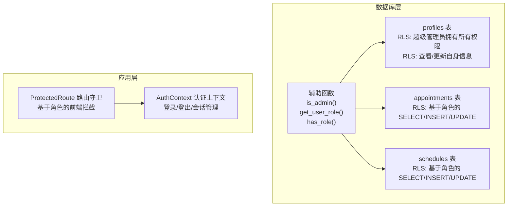
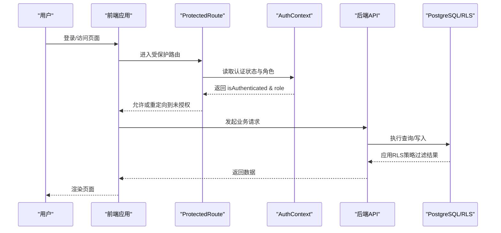
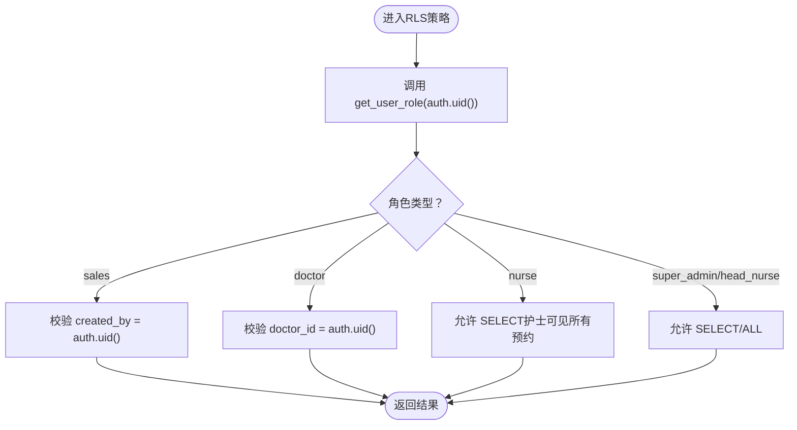
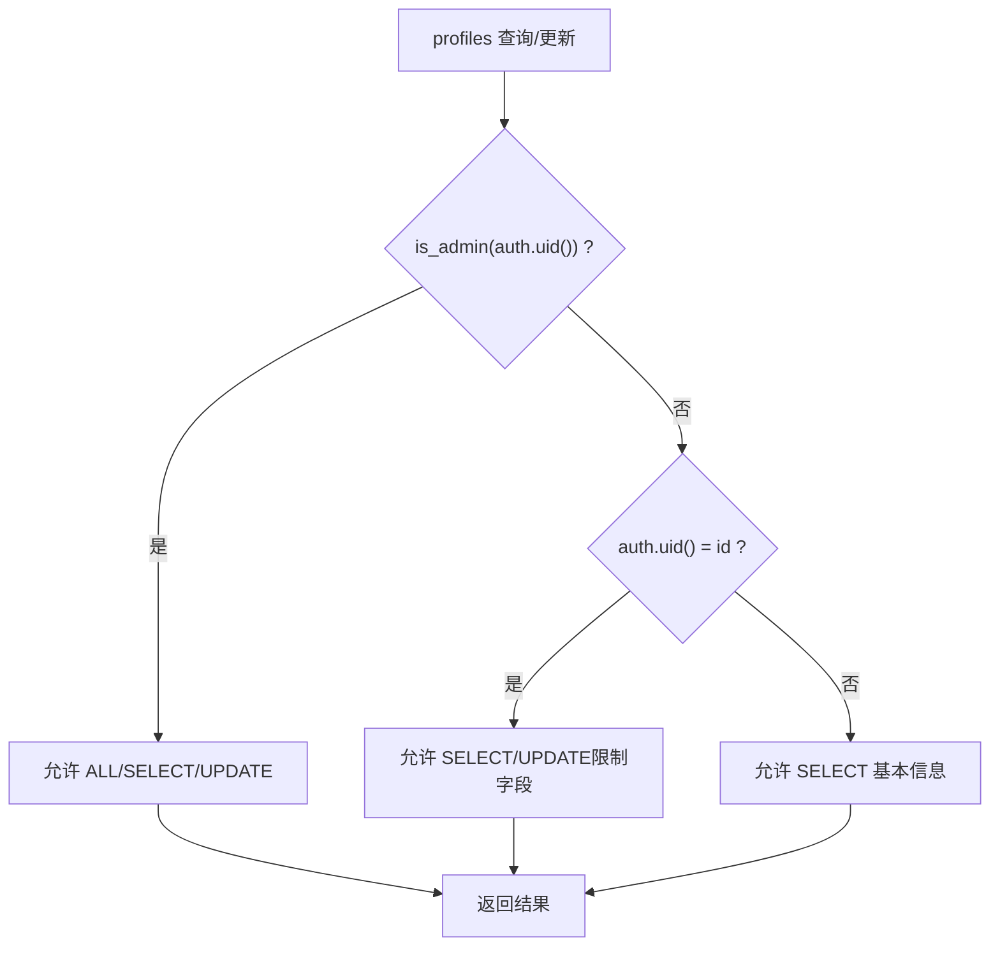
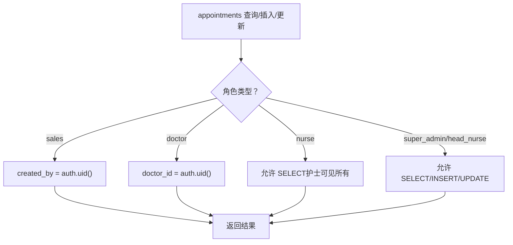
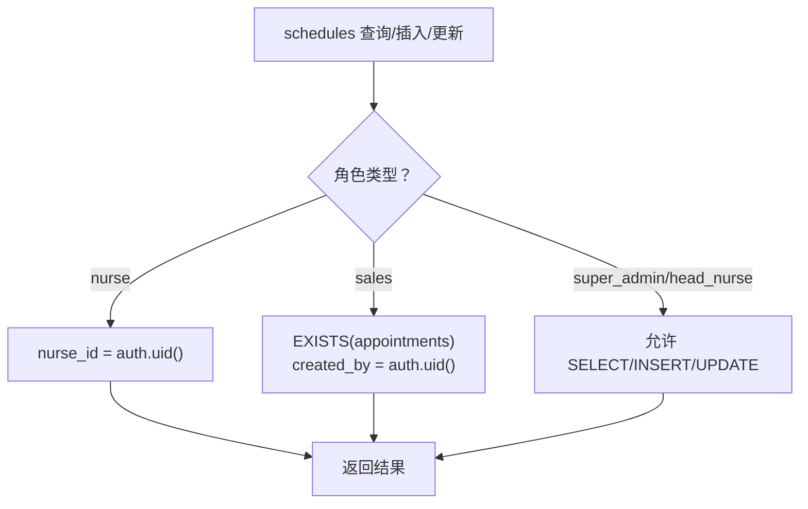
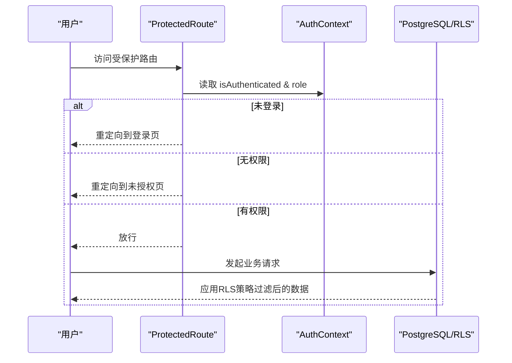
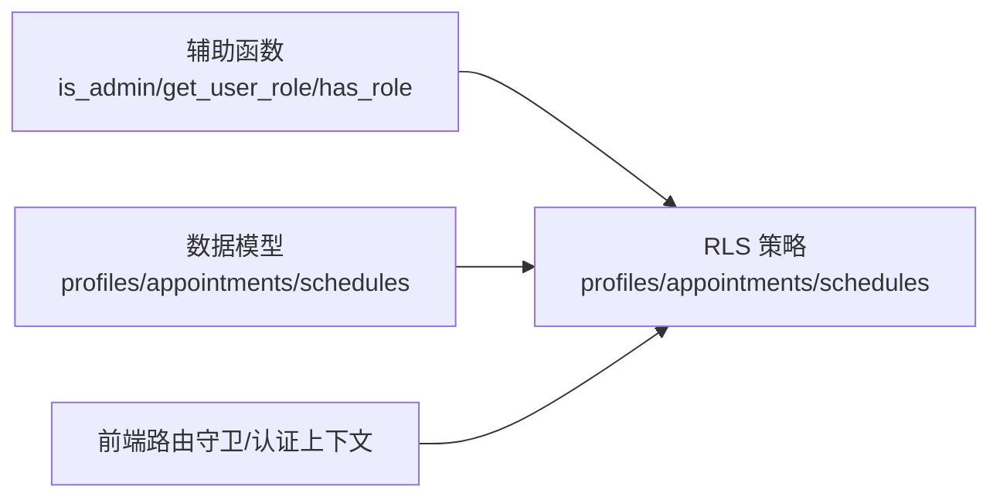

# RLS策略

<cite>
**本文引用的文件**
- [00004_create_user_profiles_and_auth.sql](file://supabase/migrations/00004_create_user_profiles_and_auth.sql)
- [00007_update_profiles_structure_and_auth.sql](file://supabase/migrations/00007_update_profiles_structure_and_auth.sql)
- [00008_add_rls_policies_for_role_based_access.sql](file://supabase/migrations/00008_add_rls_policies_for_role_based_access.sql)
- [00002_create_resource_tables.sql](file://supabase/migrations/00002_create_resource_tables.sql)
- [01-init-database.sql](file://database/init/01-init-database.sql)
- [02-create-tables.sql](file://database/init/02-create-tables.sql)
- [03-seed-data.sql](file://database/init/03-seed-data.sql)
- [ProtectedRoute.tsx](file://src/components/auth/ProtectedRoute.tsx)
- [AuthContext.tsx](file://src/contexts/AuthContext.tsx)
- [AUTH_IMPLEMENTATION_SUMMARY.md](file://AUTH_IMPLEMENTATION_SUMMARY.md)
- [AUTH_TESTING_GUIDE.md](file://AUTH_TESTING_GUIDE.md)
</cite>

## 目录
1. [简介](#简介)
2. [项目结构](#项目结构)
3. [核心组件](#核心组件)
4. [架构总览](#架构总览)
5. [详细组件分析](#详细组件分析)
6. [依赖关系分析](#依赖关系分析)
7. [性能考量](#性能考量)
8. [故障排查指南](#故障排查指南)
9. [结论](#结论)
10. [附录](#附录)

## 简介
本文件系统性解析 Bio-Appointment 系统中行级安全（RLS）策略的设计与实现，重点覆盖以下方面：
- 在 profiles、appointments 和 schedules 等核心表上配置的 RLS 策略，如何实现数据层面的访问控制
- 超级管理员、销售、护士长、护士和医生在不同数据表上的读写权限规则
- has_role()、get_user_role()、is_admin() 等辅助函数在策略中的应用
- RLS 与应用层认证的协同机制，如何防止越权访问
- RLS 策略测试与调试的最佳实践

## 项目结构
RLS 策略主要分布在数据库迁移脚本中，配合前端路由守卫与认证上下文共同实现“认证 + 授权”的双重保障。数据库侧负责“数据级隔离”，前端负责“界面级与API级权限”。

图表来源
- [00004_create_user_profiles_and_auth.sql](file://supabase/migrations/00004_create_user_profiles_and_auth.sql#L75-L141)
- [00007_update_profiles_structure_and_auth.sql](file://supabase/migrations/00007_update_profiles_structure_and_auth.sql#L85-L148)
- [00008_add_rls_policies_for_role_based_access.sql](file://supabase/migrations/00008_add_rls_policies_for_role_based_access.sql#L31-L180)
- [ProtectedRoute.tsx](file://src/components/auth/ProtectedRoute.tsx#L1-L49)
- [AuthContext.tsx](file://src/contexts/AuthContext.tsx#L1-L308)

章节来源
- [00004_create_user_profiles_and_auth.sql](file://supabase/migrations/00004_create_user_profiles_and_auth.sql#L1-L207)
- [00007_update_profiles_structure_and_auth.sql](file://supabase/migrations/00007_update_profiles_structure_and_auth.sql#L1-L219)
- [00008_add_rls_policies_for_role_based_access.sql](file://supabase/migrations/00008_add_rls_policies_for_role_based_access.sql#L1-L180)
- [ProtectedRoute.tsx](file://src/components/auth/ProtectedRoute.tsx#L1-L49)
- [AuthContext.tsx](file://src/contexts/AuthContext.tsx#L1-L308)

## 核心组件
- 辅助函数（数据库侧）
  - is_admin(uid): 判断用户是否为超级管理员且状态为激活
  - get_user_role(uid): 返回用户的当前有效角色
  - has_role(uid, required_role): 判断用户是否拥有指定角色且状态为激活
- RLS 策略（数据库侧）
  - profiles 表：超级管理员拥有所有权限；用户可查看/更新自身信息；所有人可查看基本信息
  - appointments 表：按角色限定 SELECT/INSERT/UPDATE 权限
  - schedules 表：按角色限定 SELECT/INSERT/UPDATE 权限
- 应用层认证与路由守卫
  - ProtectedRoute：基于角色的前端路由拦截，超级管理员放行
  - AuthContext：登录/登出/会话管理，提供 isAdmin/isAuthenticated 等能力

章节来源
- [00004_create_user_profiles_and_auth.sql](file://supabase/migrations/00004_create_user_profiles_and_auth.sql#L75-L141)
- [00007_update_profiles_structure_and_auth.sql](file://supabase/migrations/00007_update_profiles_structure_and_auth.sql#L85-L148)
- [00008_add_rls_policies_for_role_based_access.sql](file://supabase/migrations/00008_add_rls_policies_for_role_based_access.sql#L31-L180)
- [ProtectedRoute.tsx](file://src/components/auth/ProtectedRoute.tsx#L1-L49)
- [AuthContext.tsx](file://src/contexts/AuthContext.tsx#L1-L308)

## 架构总览
RLS 与应用层认证协同工作，形成“前端路由拦截 + 后端数据隔离”的双层防护。

图表来源
- [ProtectedRoute.tsx](file://src/components/auth/ProtectedRoute.tsx#L1-L49)
- [AuthContext.tsx](file://src/contexts/AuthContext.tsx#L1-L308)
- [00008_add_rls_policies_for_role_based_access.sql](file://supabase/migrations/00008_add_rls_policies_for_role_based_access.sql#L31-L180)

## 详细组件分析

### 辅助函数与策略定义
- is_admin(uid)
  - 作用：判断用户是否为超级管理员且状态为激活
  - 位置：profiles 表 RLS 策略中用于授予超级管理员“所有权限”
- get_user_role(uid)
  - 作用：返回用户的当前有效角色
  - 位置：appointments/schedules 的 SELECT/UPDATE 策略中用于角色判定
- has_role(uid, required_role)
  - 作用：判断用户是否拥有指定角色且状态为激活
  - 位置：策略中用于 IN 列表匹配或相等比较

图表来源
- [00008_add_rls_policies_for_role_based_access.sql](file://supabase/migrations/00008_add_rls_policies_for_role_based_access.sql#L55-L84)
- [00008_add_rls_policies_for_role_based_access.sql](file://supabase/migrations/00008_add_rls_policies_for_role_based_access.sql#L62-L83)

章节来源
- [00004_create_user_profiles_and_auth.sql](file://supabase/migrations/00004_create_user_profiles_and_auth.sql#L75-L111)
- [00007_update_profiles_structure_and_auth.sql](file://supabase/migrations/00007_update_profiles_structure_and_auth.sql#L85-L118)
- [00008_add_rls_policies_for_role_based_access.sql](file://supabase/migrations/00008_add_rls_policies_for_role_based_access.sql#L55-L84)

### profiles 表 RLS 策略
- 超级管理员拥有所有权限
- 用户可查看自己的信息
- 用户可更新自己的信息（不允许更改 role 与 status）
- 所有认证用户可查看基本信息（用于显示名称等）

图表来源
- [00004_create_user_profiles_and_auth.sql](file://supabase/migrations/00004_create_user_profiles_and_auth.sql#L113-L141)
- [00007_update_profiles_structure_and_auth.sql](file://supabase/migrations/00007_update_profiles_structure_and_auth.sql#L129-L148)

章节来源
- [00004_create_user_profiles_and_auth.sql](file://supabase/migrations/00004_create_user_profiles_and_auth.sql#L75-L141)
- [00007_update_profiles_structure_and_auth.sql](file://supabase/migrations/00007_update_profiles_structure_and_auth.sql#L129-L148)

### appointments 表 RLS 策略
- 查看权限
  - 超级管理员与护士长：查看所有预约
  - 销售：只能查看自己创建的预约
  - 医生：只能查看分配给自己的预约
  - 护士：可以查看所有预约（用于执行任务）
- 创建权限
  - 销售可以创建预约（created_by = auth.uid()）
- 更新权限
  - 销售：仅限 pending 状态，且 created_by = auth.uid()
  - 护士长：可更新所有预约
  - 医生：仅限更新与医生相关的字段（doctor_id = auth.uid()）

图表来源
- [00008_add_rls_policies_for_role_based_access.sql](file://supabase/migrations/00008_add_rls_policies_for_role_based_access.sql#L55-L84)
- [00008_add_rls_policies_for_role_based_access.sql](file://supabase/migrations/00008_add_rls_policies_for_role_based_access.sql#L86-L124)

章节来源
- [00008_add_rls_policies_for_role_based_access.sql](file://supabase/migrations/00008_add_rls_policies_for_role_based_access.sql#L55-L124)

### schedules 表 RLS 策略
- 查看权限
  - 超级管理员与护士长：查看和管理所有排班
  - 护士：只能查看分配给自己的排班
  - 销售：可以查看与自己创建的预约相关的排班（通过 EXISTS 关联 appointments）
- 创建权限
  - 护士长可以创建排班
- 更新权限
  - 护士长：可更新所有排班
  - 护士：仅限更新分配给自己的排班的状态字段（nurse_id = auth.uid()）

图表来源
- [00008_add_rls_policies_for_role_based_access.sql](file://supabase/migrations/00008_add_rls_policies_for_role_based_access.sql#L128-L180)

章节来源
- [00008_add_rls_policies_for_role_based_access.sql](file://supabase/migrations/00008_add_rls_policies_for_role_based_access.sql#L128-L180)

### RLS 与应用层认证协同
- 前端路由守卫（ProtectedRoute）
  - 未登录重定向至登录页
  - 非超级管理员访问受限路由时重定向至未授权页
  - 超级管理员拥有所有权限
- 认证上下文（AuthContext）
  - 管理登录/登出/会话刷新
  - 提供 isAdmin/isAuthenticated 等便捷属性
- 数据库层 RLS
  - 通过 get_user_role()/has_role()/is_admin() 与策略配合，确保越权访问被拒绝

图表来源
- [ProtectedRoute.tsx](file://src/components/auth/ProtectedRoute.tsx#L1-L49)
- [AuthContext.tsx](file://src/contexts/AuthContext.tsx#L1-L308)
- [00008_add_rls_policies_for_role_based_access.sql](file://supabase/migrations/00008_add_rls_policies_for_role_based_access.sql#L31-L180)

章节来源
- [ProtectedRoute.tsx](file://src/components/auth/ProtectedRoute.tsx#L1-L49)
- [AuthContext.tsx](file://src/contexts/AuthContext.tsx#L1-L308)
- [AUTH_IMPLEMENTATION_SUMMARY.md](file://AUTH_IMPLEMENTATION_SUMMARY.md#L1-L350)

## 依赖关系分析
- 辅助函数依赖
  - get_user_role() 依赖 profiles 表的 role/status 字段
  - is_admin() 依赖 profiles 表的 role/status 字段
  - has_role() 依赖 profiles 表的 role/status 字段
- 策略依赖
  - appointments/schedules 的策略依赖 get_user_role()/has_role() 的正确返回
  - profiles 的策略依赖 is_admin() 的正确返回
- 数据模型
  - profiles、appointments、schedules 表均启用 RLS
  - 通过外键约束保证数据一致性（例如 appointments.created_by 引用 profiles.id）

图表来源
- [00004_create_user_profiles_and_auth.sql](file://supabase/migrations/00004_create_user_profiles_and_auth.sql#L75-L111)
- [00007_update_profiles_structure_and_auth.sql](file://supabase/migrations/00007_update_profiles_structure_and_auth.sql#L85-L118)
- [00008_add_rls_policies_for_role_based_access.sql](file://supabase/migrations/00008_add_rls_policies_for_role_based_access.sql#L31-L180)
- [02-create-tables.sql](file://database/init/02-create-tables.sql#L53-L96)

章节来源
- [00004_create_user_profiles_and_auth.sql](file://supabase/migrations/00004_create_user_profiles_and_auth.sql#L75-L111)
- [00007_update_profiles_structure_and_auth.sql](file://supabase/migrations/00007_update_profiles_structure_and_auth.sql#L85-L118)
- [00008_add_rls_policies_for_role_based_access.sql](file://supabase/migrations/00008_add_rls_policies_for_role_based_access.sql#L31-L180)
- [02-create-tables.sql](file://database/init/02-create-tables.sql#L53-L96)

## 性能考量
- 函数稳定性
  - get_user_role()/is_admin()/has_role() 声明为 STABLE，适合在策略中频繁调用
- 索引与查询
  - profiles 表包含 username、role、status 等常用过滤字段的索引
  - appointments/schedules 表对关键字段建立索引，有助于策略过滤与业务查询
- 触发器与审计
  - 初始化脚本包含 update_updated_at_column() 触发器与审计日志表，便于追踪变更

章节来源
- [00004_create_user_profiles_and_auth.sql](file://supabase/migrations/00004_create_user_profiles_and_auth.sql#L71-L74)
- [00007_update_profiles_structure_and_auth.sql](file://supabase/migrations/00007_update_profiles_structure_and_auth.sql#L79-L84)
- [02-create-tables.sql](file://database/init/02-create-tables.sql#L185-L231)
- [01-init-database.sql](file://database/init/01-init-database.sql#L57-L64)

## 故障排查指南
- 常见问题
  - 禁用用户仍可访问：确认 has_role()/get_user_role() 中包含 status = 'active' 的过滤条件
  - 越权访问：检查策略中角色判断逻辑与 created_by/doctor_id/nurse_id 等字段是否正确
  - 路由仍可访问：确认 ProtectedRoute 是否正确识别 requiredRole 并优先放行 super_admin
- 调试步骤
  - 在数据库侧使用辅助函数验证当前用户角色与状态
  - 在前端断点检查 AuthContext 中的 profile.role 与 isAuthenticated
  - 使用 AUTH_TESTING_GUIDE.md 中的测试场景逐项验证
- 测试清单
  - 超级管理员：应可访问所有页面与数据
  - 销售：仅能查看/更新自己创建的预约，不能跨用户访问
  - 护士长：可查看/更新所有预约与排班
  - 护士：仅能查看/更新分配给自己的排班
  - 医生：仅能查看/更新分配给自己的预约

章节来源
- [AUTH_TESTING_GUIDE.md](file://AUTH_TESTING_GUIDE.md#L1-L180)
- [AUTH_IMPLEMENTATION_SUMMARY.md](file://AUTH_IMPLEMENTATION_SUMMARY.md#L1-L350)

## 结论
本系统通过“数据库层 RLS + 应用层认证”的组合，实现了细粒度的数据级访问控制。辅助函数与策略紧密配合，确保不同角色在 appointments 与 schedules 上的读写边界清晰，同时前端路由守卫进一步强化了越权访问的防护。配合完善的测试与调试流程，可有效降低越权风险并提升系统的安全性与可维护性。

## 附录
- 角色与权限矩阵（摘自实现总结）
  - 超级管理员：所有模块与数据的读写权限
  - 销售：仅能查看/更新自己创建的预约
  - 护士长：可查看/更新所有预约与排班
  - 护士：可查看所有预约；仅能更新分配给自己的排班
  - 医生：仅能查看/更新分配给自己的预约

章节来源
- [AUTH_IMPLEMENTATION_SUMMARY.md](file://AUTH_IMPLEMENTATION_SUMMARY.md#L175-L248)