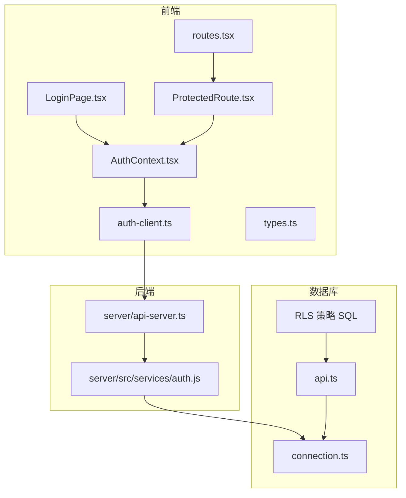
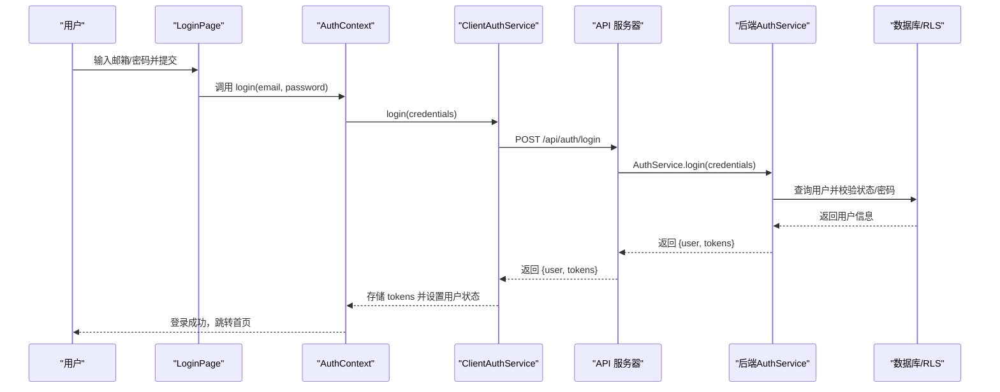
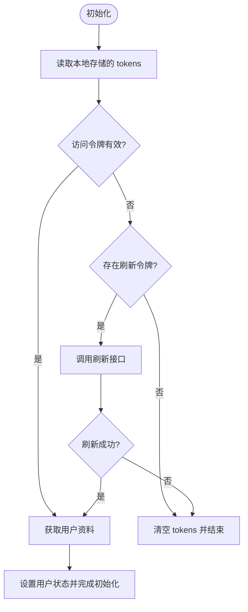
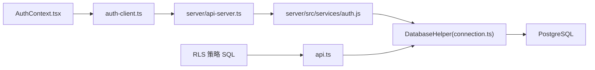

# 认证机制

<cite>
**本文引用的文件**
- [AuthContext.tsx](file://src/contexts/AuthContext.tsx)
- [ProtectedRoute.tsx](file://src/components/auth/ProtectedRoute.tsx)
- [auth.ts](file://src/services/auth.ts)
- [auth-client.ts](file://src/services/auth-client.ts)
- [auth.js](file://server/src/services/auth.js)
- [api-server.ts](file://server/api-server.ts)
- [LoginPage.tsx](file://src/pages/auth/LoginPage.tsx)
- [routes.tsx](file://src/routes.tsx)
- [types.ts](file://src/types/types.ts)
- [connection.ts](file://src/db/connection.ts)
- [api.ts](file://src/services/api.ts)
- [00008_add_rls_policies_for_role_based_access.sql](file://supabase/migrations/00008_add_rls_policies_for_role_based_access.sql)
- [AUTH_IMPLEMENTATION_SUMMARY.md](file://AUTH_IMPLEMENTATION_SUMMARY.md)
- [AUTH_TESTING_GUIDE.md](file://AUTH_TESTING_GUIDE.md)
</cite>

## 目录
1. [简介](#简介)
2. [项目结构](#项目结构)
3. [核心组件](#核心组件)
4. [架构总览](#架构总览)
5. [详细组件分析](#详细组件分析)
6. [依赖关系分析](#依赖关系分析)
7. [性能考量](#性能考量)
8. [故障排查指南](#故障排查指南)
9. [结论](#结论)
10. [附录](#附录)

## 简介
本文件深入解析 Bio-Appointment 系统的认证与权限控制机制，覆盖前端基于 JWT 的认证流程（登录、令牌签发、会话管理、权限验证）、服务层与数据库交互、前端 AuthContext 的状态维护、ProtectedRoute 的细粒度路由权限控制，以及数据库层 RLS（行级安全）策略在数据访问控制中的应用。同时提供常见问题排查指南与安全防护建议。

## 项目结构
认证相关的核心文件分布如下：
- 前端认证上下文与路由守卫：AuthContext、ProtectedRoute
- 前端认证客户端与服务：auth-client、auth
- 后端认证服务与中间件：server/src/services/auth.js、server/api-server.ts
- 路由配置与页面：routes.tsx、LoginPage
- 类型定义与数据库连接：types.ts、connection.ts、api.ts
- 数据库 RLS 策略：supabase/migrations/00008_add_rls_policies_for_role_based_access.sql
- 文档与测试指南：AUTH_IMPLEMENTATION_SUMMARY.md、AUTH_TESTING_GUIDE.md



图表来源
- [AuthContext.tsx](file://src/contexts/AuthContext.tsx#L1-L308)
- [ProtectedRoute.tsx](file://src/components/auth/ProtectedRoute.tsx#L1-L49)
- [auth-client.ts](file://src/services/auth-client.ts#L1-L235)
- [auth.js](file://server/src/services/auth.js#L1-L284)
- [api-server.ts](file://server/api-server.ts#L107-L151)
- [routes.tsx](file://src/routes.tsx#L1-L135)
- [connection.ts](file://src/db/connection.ts#L1-L324)
- [api.ts](file://src/services/api.ts#L1-L483)
- [00008_add_rls_policies_for_role_based_access.sql](file://supabase/migrations/00008_add_rls_policies_for_role_based_access.sql#L1-L180)

章节来源
- [AuthContext.tsx](file://src/contexts/AuthContext.tsx#L1-L308)
- [auth-client.ts](file://src/services/auth-client.ts#L1-L235)
- [auth.js](file://server/src/services/auth.js#L1-L284)
- [api-server.ts](file://server/api-server.ts#L107-L151)
- [routes.tsx](file://src/routes.tsx#L1-L135)
- [connection.ts](file://src/db/connection.ts#L1-L324)
- [api.ts](file://src/services/api.ts#L1-L483)
- [00008_add_rls_policies_for_role_based_access.sql](file://supabase/migrations/00008_add_rls_policies_for_role_based_access.sql#L1-L180)

## 核心组件
- 前端认证上下文 AuthContext：负责初始化认证状态、登录/登出、注册、密码修改、自动刷新令牌、本地存储与状态管理。
- 前端认证客户端 ClientAuthService：封装与后端 API 的交互，包括登录、注册、刷新令牌、获取用户信息、登出等。
- 后端认证服务 AuthService：负责密码哈希/校验、JWT 签发/校验、用户查询、令牌刷新、用户资料更新、权限矩阵。
- 路由守卫 ProtectedRoute：基于角色的路由权限控制，支持超级管理员豁免与角色白名单。
- 数据库 RLS 策略：按角色对 appointments/schedules 等表实施细粒度数据访问控制。

章节来源
- [AuthContext.tsx](file://src/contexts/AuthContext.tsx#L1-L308)
- [auth-client.ts](file://src/services/auth-client.ts#L1-L235)
- [auth.js](file://server/src/services/auth.js#L1-L284)
- [ProtectedRoute.tsx](file://src/components/auth/ProtectedRoute.tsx#L1-L49)
- [00008_add_rls_policies_for_role_based_access.sql](file://supabase/migrations/00008_add_rls_policies_for_role_based_access.sql#L1-L180)

## 架构总览
下图展示了从前端登录到后端鉴权再到数据库 RLS 的完整链路。



图表来源
- [LoginPage.tsx](file://src/pages/auth/LoginPage.tsx#L1-L158)
- [AuthContext.tsx](file://src/contexts/AuthContext.tsx#L154-L176)
- [auth-client.ts](file://src/services/auth-client.ts#L59-L109)
- [api-server.ts](file://server/api-server.ts#L107-L151)
- [auth.js](file://server/src/services/auth.js#L118-L146)
- [connection.ts](file://src/db/connection.ts#L170-L321)

## 详细组件分析

### 前端认证上下文 AuthContext
- 初始化逻辑：读取本地存储的访问令牌与刷新令牌；若访问令牌有效则直接拉取用户资料；否则尝试使用刷新令牌换取新的令牌。
- 登录流程：调用 ClientAuthService.login，成功后写入本地存储并设置用户状态。
- 会话管理：定时检查令牌过期时间（提前 5 分钟自动刷新），过期或无效则自动登出。
- 注册流程：先调用 ClientAuthService.register，再自动登录。
- 密码修改：调用 ClientAuthService.changePassword，内部携带 Bearer 令牌访问后端接口。
- 登出流程：清空本地令牌，调用后端 logout 接口，重置上下文状态。



图表来源
- [AuthContext.tsx](file://src/contexts/AuthContext.tsx#L80-L138)
- [AuthContext.tsx](file://src/contexts/AuthContext.tsx#L232-L276)

章节来源
- [AuthContext.tsx](file://src/contexts/AuthContext.tsx#L1-L308)

### 前端认证客户端 ClientAuthService
- 令牌验证：支持简单解码（client-side）以判断过期与角色，开发环境支持 mock 令牌。
- 登录/注册：通过 fetch 调用后端 /api/auth/* 接口，统一处理非 2xx 响应并抛出错误。
- 刷新令牌：POST /api/auth/refresh，返回新的 {accessToken, refreshToken}。
- 获取用户：GET /api/profiles/{id}，携带 Authorization: Bearer。
- 密码修改：POST /api/auth/change-password，携带 Authorization: Bearer。
- 存储与清理：localStorage 读写 tokens，异常时记录日志。

章节来源
- [auth-client.ts](file://src/services/auth-client.ts#L1-L235)

### 后端认证服务 AuthService 与中间件
- JWT 签发：生成 access/refresh 令牌，设置过期时间、签发者与受众。
- JWT 校验：校验过期与签名，区分过期与非法令牌。
- 登录流程：查询用户、校验状态与密码，生成令牌并返回用户信息。
- 刷新流程：校验刷新令牌，重新查询用户并生成新令牌。
- 中间件 authenticateToken：从 Authorization 头提取 Bearer 令牌，校验后注入 req.user，保护 /api/* 路由。

```mermaid
classDiagram
class AuthService {
+hashPassword(password) Promise~string~
+comparePassword(password, hash) Promise~boolean~
+generateAccessToken(user) string
+generateRefreshToken(user) string
+verifyToken(token) JwtPayload
+generateTokens(user) AuthTokens
+register(credentials) Promise~Profile~
+login(credentials) Promise~{user, tokens}~
+refreshToken(refreshToken) Promise~AuthTokens~
+getUserById(userId) Promise~Profile|null~
+updateProfile(userId, updates) Promise~Profile|null~
+changePassword(userId, current, new) Promise~void~
+resetPassword(userId, newPassword) Promise~void~
+deactivateUser(userId) Promise~void~
+activateUser(userId) Promise~void~
+getUserPermissions(role) string[]
+hasPermission(userRole, permission) boolean
}
```

图表来源
- [auth.js](file://server/src/services/auth.js#L1-L284)

章节来源
- [auth.js](file://server/src/services/auth.js#L1-L284)
- [api-server.ts](file://server/api-server.ts#L107-L151)

### 路由守卫 ProtectedRoute
- 加载态：loading 期间显示加载动画。
- 未登录：重定向至 /login。
- 角色校验：支持单角色或角色数组；超级管理员拥有全部权限；不在允许列表则重定向至 /unauthorized。
- 与路由配置配合：routes.tsx 中为各页面配置 requireAuth 与 requiredRole。

章节来源
- [ProtectedRoute.tsx](file://src/components/auth/ProtectedRoute.tsx#L1-L49)
- [routes.tsx](file://src/routes.tsx#L1-L135)

### 数据库 RLS 策略
- 启用 RLS：对 appointments/schedules 表启用行级安全。
- 查看权限：超级管理员与护士长可查看所有预约；销售仅能查看自己创建的预约；医生仅能查看分配给自己的预约；护士可查看所有预约。
- 创建权限：销售可创建预约；护士长可创建排班。
- 更新权限：销售仅能在特定状态下更新自己创建的预约；护士长可更新所有预约/排班；医生可更新分配给自己的预约；护士仅能更新自己的排班状态。
- 其他：RLS 依赖 get_user_role(auth.uid()) 辅助函数判断角色。

章节来源
- [00008_add_rls_policies_for_role_based_access.sql](file://supabase/migrations/00008_add_rls_policies_for_role_based_access.sql#L1-L180)

### 登录流程异常处理与安全防护
- 前端 LoginPage：统一捕获登录错误，使用 toast 提示；记录详细日志便于调试。
- ClientAuthService：对非 2xx 响应统一抛错，避免静默失败。
- AuthContext：对令牌过期/无效自动登出，防止长期持有失效令牌。
- 后端中间件：严格校验 Authorization 头与令牌有效性，拒绝未认证请求。
- 密码安全：bcrypt 哈希存储，前后端均不暴露明文密码。

章节来源
- [LoginPage.tsx](file://src/pages/auth/LoginPage.tsx#L1-L158)
- [auth-client.ts](file://src/services/auth-client.ts#L59-L109)
- [AuthContext.tsx](file://src/contexts/AuthContext.tsx#L232-L276)
- [api-server.ts](file://server/api-server.ts#L107-L151)

## 依赖关系分析
- 前端依赖
  - AuthContext 依赖 ClientAuthService 与本地存储。
  - ClientAuthService 依赖 fetch 与后端 API。
  - ProtectedRoute 依赖 AuthContext 与路由配置。
- 后端依赖
  - AuthService 依赖 jsonwebtoken、bcrypt 与 DatabaseHelper。
  - DatabaseHelper 依赖 pg 连接池与 redis（可选）。
- 数据库依赖
  - RLS 策略依赖 get_user_role 等辅助函数与枚举类型 user_role。



图表来源
- [AuthContext.tsx](file://src/contexts/AuthContext.tsx#L1-L308)
- [auth-client.ts](file://src/services/auth-client.ts#L1-L235)
- [api-server.ts](file://server/api-server.ts#L107-L151)
- [auth.js](file://server/src/services/auth.js#L1-L284)
- [connection.ts](file://src/db/connection.ts#L1-L324)
- [api.ts](file://src/services/api.ts#L1-L483)
- [00008_add_rls_policies_for_role_based_access.sql](file://supabase/migrations/00008_add_rls_policies_for_role_based_access.sql#L1-L180)

章节来源
- [types.ts](file://src/types/types.ts#L1-L120)
- [connection.ts](file://src/db/connection.ts#L1-L324)
- [api.ts](file://src/services/api.ts#L1-L483)

## 性能考量
- 前端令牌轮询：每分钟检查一次过期，建议在高并发场景下合并检查频率或在用户活跃时才检查。
- 后端中间件：每次请求均需校验令牌，建议在网关层或反向代理层缓存鉴权结果（如使用 Redis）。
- 数据库查询：RLS 策略可能增加查询复杂度，建议为常用过滤字段建立索引并定期分析查询计划。
- 缓存：优先使用 Redis 缓存热点用户信息与令牌元数据，降低数据库压力。

[本节为通用指导，无需列出具体文件来源]

## 故障排查指南
- 登录失败
  - 检查前端 LoginPage 是否正确捕获并提示错误。
  - 确认 ClientAuthService 的 /api/auth/login 是否返回 2xx。
  - 后端 AuthService 是否能正确查询用户并校验状态与密码。
- 令牌过期/刷新失败
  - 检查 AuthContext 的自动刷新逻辑是否触发。
  - 确认 ClientAuthService.refreshToken 是否返回新令牌。
  - 后端 AuthService.refreshToken 是否能重新签发令牌。
- 路由访问受限
  - 检查 ProtectedRoute 的 requiredRole 配置是否正确。
  - 确认用户角色是否为 super_admin。
- 数据越权访问
  - 检查 RLS 策略是否生效（启用 RLS、策略名称与条件）。
  - 确认 get_user_role 返回值与用户角色一致。
- 常见测试清单
  - 使用 AUTH_TESTING_GUIDE.md 中的角色测试场景逐项验证。
  - 验证超级管理员可访问所有页面、禁用用户无法登录等边界情况。

章节来源
- [AUTH_TESTING_GUIDE.md](file://AUTH_TESTING_GUIDE.md#L1-L180)
- [AUTH_IMPLEMENTATION_SUMMARY.md](file://AUTH_IMPLEMENTATION_SUMMARY.md#L1-L350)

## 结论
Bio-Appointment 的认证体系从前端到后端再到数据库形成闭环：前端通过 JWT 实现无状态认证与会话管理，后端通过中间件与服务层保障令牌有效性与用户状态，数据库通过 RLS 实施细粒度的数据访问控制。该方案具备良好的安全性与可维护性，适合多角色协作的医疗预约调度场景。

[本节为总结性内容，无需列出具体文件来源]

## 附录
- 角色与权限矩阵（摘自实现总结）
  - 超级管理员：所有功能与数据权限。
  - 销售：工作台、预约发起；仅能查看/更新自己创建的预约（限定状态）。
  - 护士长：工作台、智能排班；可查看/更新所有预约/排班。
  - 护士：工作台、我的任务；可查看所有预约/排班，仅能更新自己的排班状态。
  - 医生：工作台、预约待办；仅能查看/更新分配给自己的预约。

章节来源
- [AUTH_IMPLEMENTATION_SUMMARY.md](file://AUTH_IMPLEMENTATION_SUMMARY.md#L175-L218)