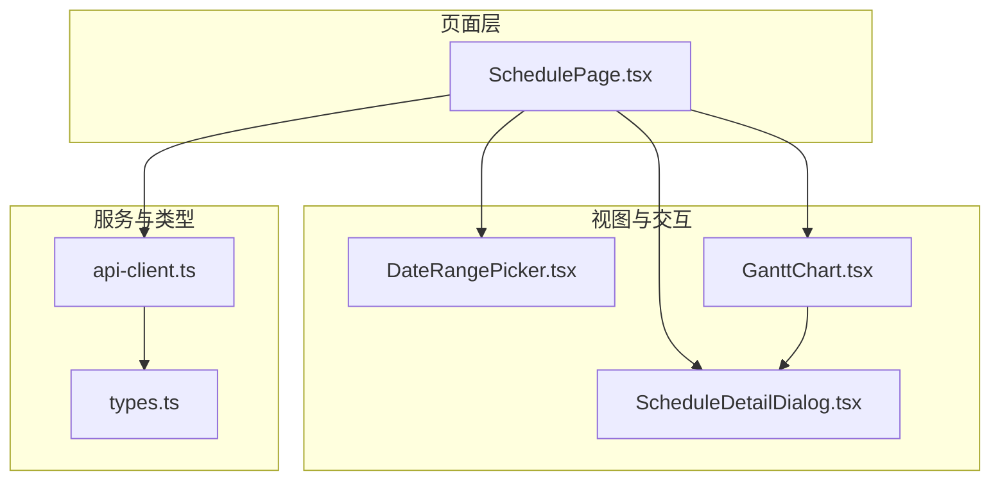
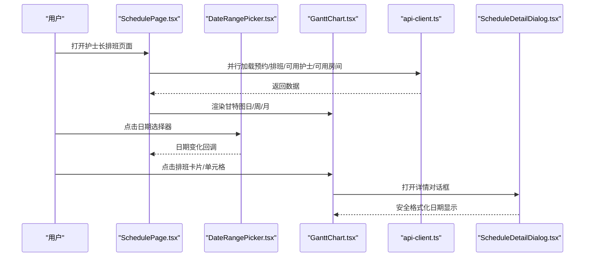
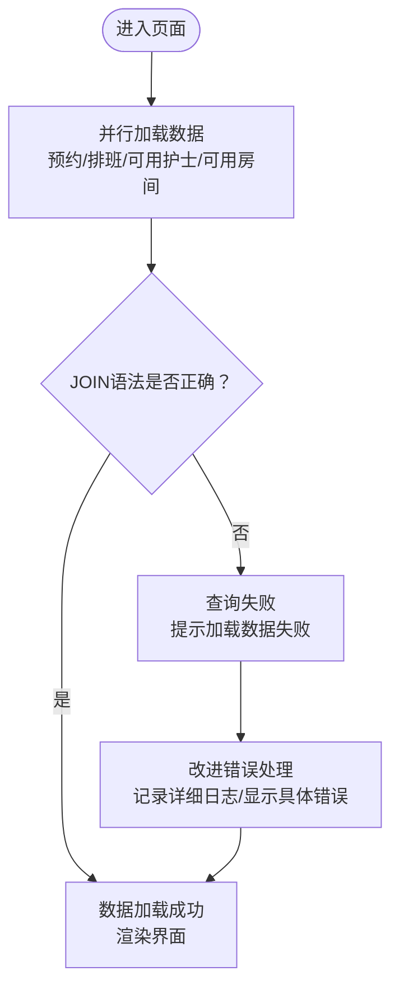
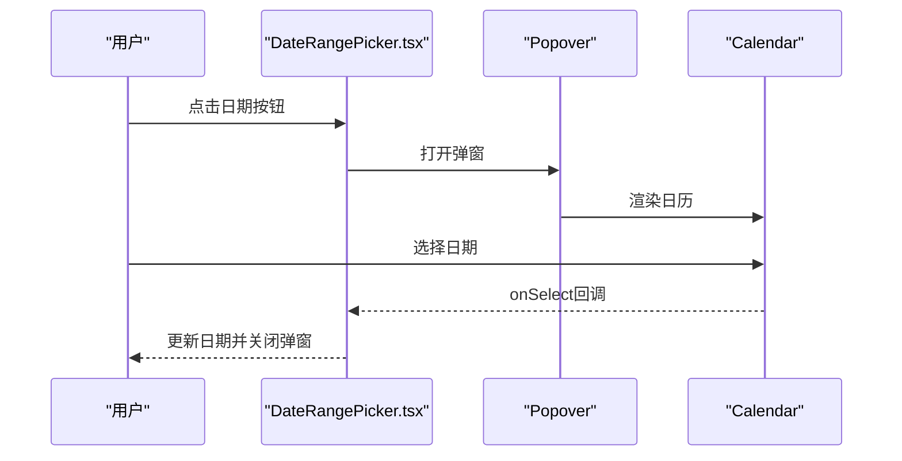
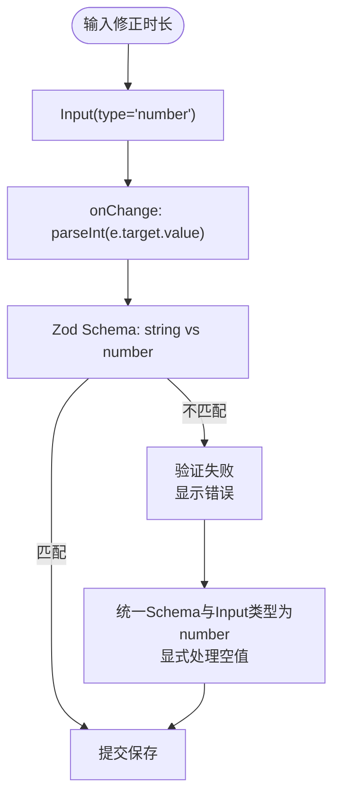
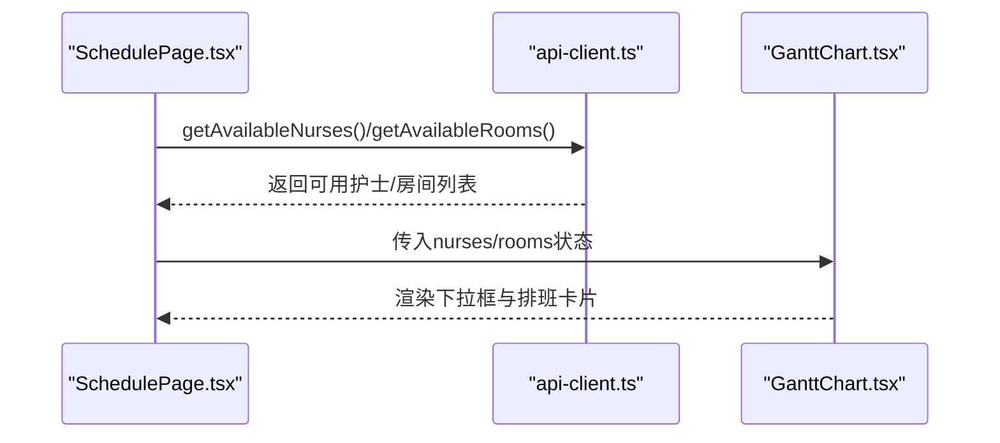
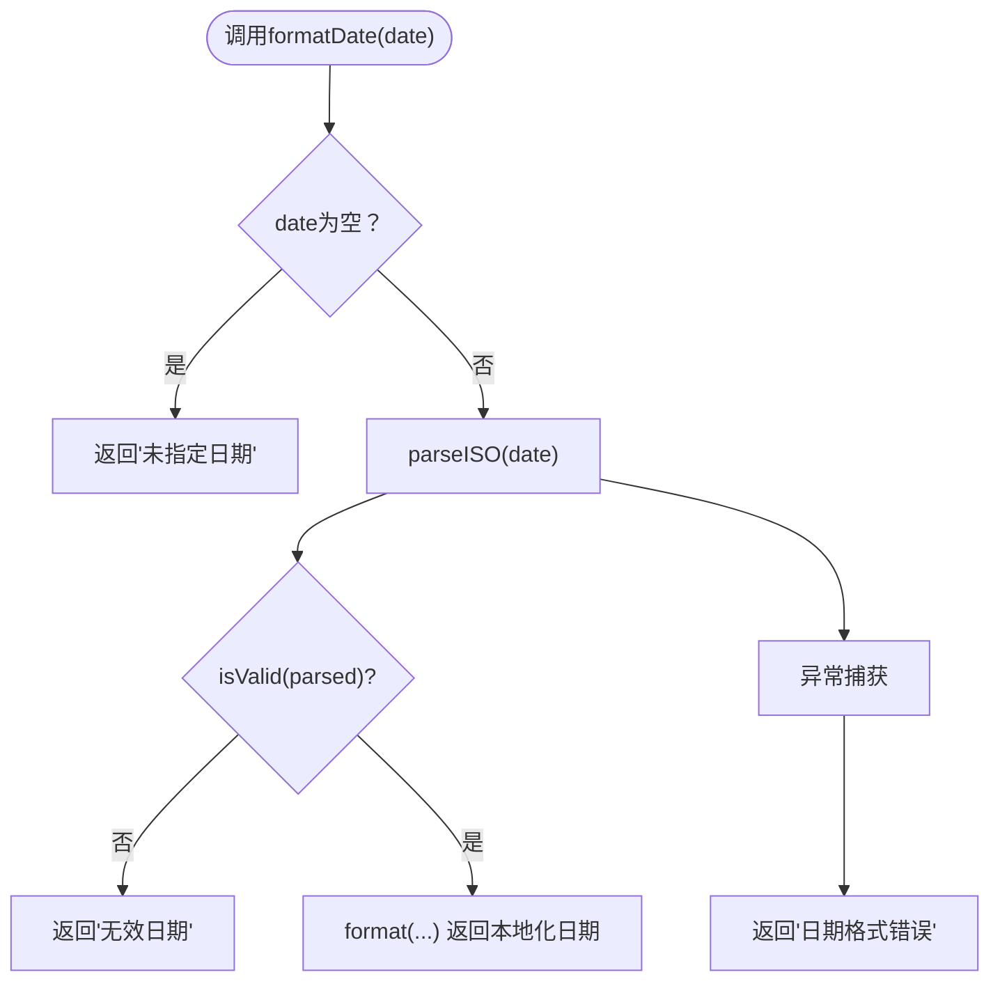
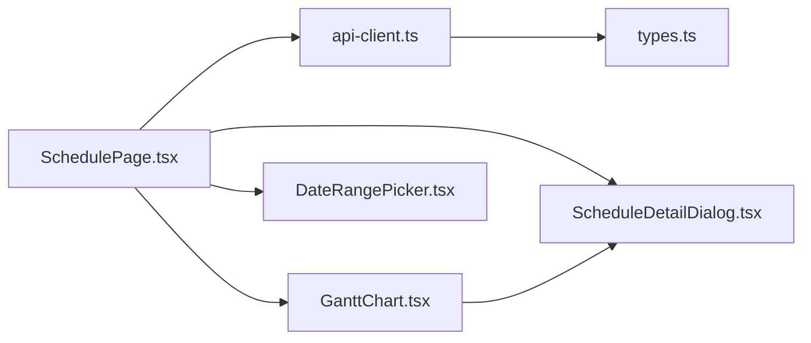

# 前端问题

<cite>
**本文引用的文件**
- [BUGFIX_SCHEDULE_PAGE_LOADING.md](file://BUGFIX_SCHEDULE_PAGE_LOADING.md)
- [BUGFIX_DATE_PICKER.md](file://BUGFIX_DATE_PICKER.md)
- [BUGFIX_DURATION_INPUT.md](file://BUGFIX_DURATION_INPUT.md)
- [BUGFIX_NURSE_SELECTION.md](file://BUGFIX_NURSE_SELECTION.md)
- [BUGFIX_INVALID_DATE.md](file://BUGFIX_INVALID_DATE.md)
- [SchedulePage.tsx](file://src/pages/head-nurse/SchedulePage.tsx)
- [DateRangePicker.tsx](file://src/components/appointment/DateRangePicker.tsx)
- [GanttChart.tsx](file://src/components/appointment/GanttChart.tsx)
- [ScheduleDetailDialog.tsx](file://src/components/appointment/ScheduleDetailDialog.tsx)
- [api-client.ts](file://src/services/api-client.ts)
- [types.ts](file://src/types/types.ts)
- [test-schedule-comprehensive.js](file://test-schedule-comprehensive.js)
- [browser-test-guide.md](file://browser-test-guide.md)
</cite>

## 目录
1. [简介](#简介)
2. [项目结构](#项目结构)
3. [核心组件](#核心组件)
4. [架构总览](#架构总览)
5. [详细组件分析](#详细组件分析)
6. [依赖关系分析](#依赖关系分析)
7. [性能考量](#性能考量)
8. [故障排除指南](#故障排除指南)
9. [结论](#结论)
10. [附录](#附录)

## 简介
本文件聚焦于排班页面的常见前端问题，结合BUGFIX系列文档，系统梳理以下问题的“症状—根因—修复—验证—预防”闭环：排班页面加载缓慢、日期选择器异常、输入时长无效、护士选择失效、无效日期处理。文档同时给出开发与生产环境的复现与诊断方法、调试技巧、性能分析工具建议，以及通过单元与集成测试预防问题的实践路径，并以src/components/appointment与src/pages中的相关组件为依据进行说明。

## 项目结构
- 页面入口与核心逻辑集中在护士长排班页面组件中，负责加载预约与排班数据、渲染甘特图、处理排班对话框与资源冲突检测。
- 日期选择器与视图切换由独立组件提供，配合日期工具库实现不同视图下的日期导航与弹窗交互。
- 甘特图组件负责按日/周/月渲染排班卡片、资源筛选与详情对话框联动。
- 详情对话框对日期格式化进行安全兜底，避免无效日期导致的崩溃。
- API客户端封装统一的请求与鉴权逻辑，类型定义保证前后端数据契约一致。

图表来源
- [SchedulePage.tsx](file://src/pages/head-nurse/SchedulePage.tsx#L1-L695)
- [DateRangePicker.tsx](file://src/components/appointment/DateRangePicker.tsx#L1-L223)
- [GanttChart.tsx](file://src/components/appointment/GanttChart.tsx#L1-L917)
- [ScheduleDetailDialog.tsx](file://src/components/appointment/ScheduleDetailDialog.tsx#L1-L175)
- [api-client.ts](file://src/services/api-client.ts#L1-L381)
- [types.ts](file://src/types/types.ts#L1-L487)

章节来源
- [SchedulePage.tsx](file://src/pages/head-nurse/SchedulePage.tsx#L1-L695)
- [DateRangePicker.tsx](file://src/components/appointment/DateRangePicker.tsx#L1-L223)
- [GanttChart.tsx](file://src/components/appointment/GanttChart.tsx#L1-L917)
- [ScheduleDetailDialog.tsx](file://src/components/appointment/ScheduleDetailDialog.tsx#L1-L175)
- [api-client.ts](file://src/services/api-client.ts#L1-L381)
- [types.ts](file://src/types/types.ts#L1-L487)

## 核心组件
- 护士长排班页面：负责加载数据、渲染视图、处理排班对话框、资源冲突检测与保存。
- 日期选择器：提供日/周/月视图下的日期导航与弹窗交互。
- 甘特图：按日/周/月渲染排班卡片，支持资源筛选与详情对话框。
- 详情对话框：对日期格式化进行安全兜底，避免无效日期导致崩溃。
- API客户端：封装鉴权与请求，提供预约、排班、资源可用性等接口。
- 类型定义：统一前后端数据契约，确保表单与API字段类型一致。

章节来源
- [SchedulePage.tsx](file://src/pages/head-nurse/SchedulePage.tsx#L1-L695)
- [DateRangePicker.tsx](file://src/components/appointment/DateRangePicker.tsx#L1-L223)
- [GanttChart.tsx](file://src/components/appointment/GanttChart.tsx#L1-L917)
- [ScheduleDetailDialog.tsx](file://src/components/appointment/ScheduleDetailDialog.tsx#L1-L175)
- [api-client.ts](file://src/services/api-client.ts#L1-L381)
- [types.ts](file://src/types/types.ts#L1-L487)

## 架构总览
排班页面采用“页面组件 + 交互组件 + 服务层 + 类型层”的分层架构。页面组件负责状态管理与副作用；交互组件负责UI行为与数据展示；服务层负责API调用与鉴权；类型层确保数据契约一致。

图表来源
- [SchedulePage.tsx](file://src/pages/head-nurse/SchedulePage.tsx#L63-L120)
- [DateRangePicker.tsx](file://src/components/appointment/DateRangePicker.tsx#L108-L127)
- [GanttChart.tsx](file://src/components/appointment/GanttChart.tsx#L103-L134)
- [ScheduleDetailDialog.tsx](file://src/components/appointment/ScheduleDetailDialog.tsx#L26-L36)
- [api-client.ts](file://src/services/api-client.ts#L179-L241)

## 详细组件分析

### 排班页面加载缓慢/失败
- 症状：页面提示“加载数据失败”，无法查看待排班与已有排班。
- 根因：Supabase查询JOIN语法错误，多外键指向同一表时未使用外键约束名区分，导致查询失败。
- 修复：在查询中使用外键约束名明确关联，修正getAppointments/getAppointmentById/getSchedules/getScheduleById。
- 错误处理改进：增强loadData的错误日志与错误信息展示，便于定位问题。
- 验证：页面正常加载、预约/排班列表与甘特图正常显示，错误信息明确。

图表来源
- [SchedulePage.tsx](file://src/pages/head-nurse/SchedulePage.tsx#L94-L119)
- [BUGFIX_SCHEDULE_PAGE_LOADING.md](file://BUGFIX_SCHEDULE_PAGE_LOADING.md#L20-L41)
- [BUGFIX_SCHEDULE_PAGE_LOADING.md](file://BUGFIX_SCHEDULE_PAGE_LOADING.md#L252-L284)

章节来源
- [SchedulePage.tsx](file://src/pages/head-nurse/SchedulePage.tsx#L94-L119)
- [BUGFIX_SCHEDULE_PAGE_LOADING.md](file://BUGFIX_SCHEDULE_PAGE_LOADING.md#L20-L41)
- [BUGFIX_SCHEDULE_PAGE_LOADING.md](file://BUGFIX_SCHEDULE_PAGE_LOADING.md#L252-L284)

### 日期选择器无法弹出
- 症状：点击“选择日期”按钮无反应。
- 根因：FormControl被错误嵌套在PopoverTrigger内部，事件传递被阻断。
- 修复：移除PopoverTrigger内部的FormControl包装，将Button直接作为触发器子元素，保持asChild属性。
- 验证：按钮点击后日历控件正常弹出，选择日期后按钮文本更新，表单验证正常。

图表来源
- [DateRangePicker.tsx](file://src/components/appointment/DateRangePicker.tsx#L108-L127)
- [BUGFIX_DATE_PICKER.md](file://BUGFIX_DATE_PICKER.md#L13-L36)
- [BUGFIX_DATE_PICKER.md](file://BUGFIX_DATE_PICKER.md#L39-L58)

章节来源
- [DateRangePicker.tsx](file://src/components/appointment/DateRangePicker.tsx#L108-L127)
- [BUGFIX_DATE_PICKER.md](file://BUGFIX_DATE_PICKER.md#L13-L36)
- [BUGFIX_DATE_PICKER.md](file://BUGFIX_DATE_PICKER.md#L39-L58)

### 输入时长无效（修正时长）
- 症状：输入修正时长后提交报错“期望字符串，收到数字”。
- 根因：Zod Schema定义为string，Input为number类型，onChange返回数字，类型不匹配。
- 修复：将Schema与表单字段类型统一为number；修正初始化与提交处理，显式处理空值；Input组件显式value与onChange逻辑。
- 验证：输入数字通过验证，保存成功，编辑时正确显示原值。

图表来源
- [SchedulePage.tsx](file://src/pages/head-nurse/SchedulePage.tsx#L26-L33)
- [SchedulePage.tsx](file://src/pages/head-nurse/SchedulePage.tsx#L558-L569)
- [SchedulePage.tsx](file://src/pages/head-nurse/SchedulePage.tsx#L139-L146)
- [SchedulePage.tsx](file://src/pages/head-nurse/SchedulePage.tsx#L155-L162)
- [BUGFIX_DURATION_INPUT.md](file://BUGFIX_DURATION_INPUT.md#L19-L34)
- [BUGFIX_DURATION_INPUT.md](file://BUGFIX_DURATION_INPUT.md#L51-L79)
- [BUGFIX_DURATION_INPUT.md](file://BUGFIX_DURATION_INPUT.md#L133-L161)

章节来源
- [SchedulePage.tsx](file://src/pages/head-nurse/SchedulePage.tsx#L26-L33)
- [SchedulePage.tsx](file://src/pages/head-nurse/SchedulePage.tsx#L558-L569)
- [SchedulePage.tsx](file://src/pages/head-nurse/SchedulePage.tsx#L139-L146)
- [SchedulePage.tsx](file://src/pages/head-nurse/SchedulePage.tsx#L155-L162)
- [BUGFIX_DURATION_INPUT.md](file://BUGFIX_DURATION_INPUT.md#L19-L34)
- [BUGFIX_DURATION_INPUT.md](file://BUGFIX_DURATION_INPUT.md#L51-L79)
- [BUGFIX_DURATION_INPUT.md](file://BUGFIX_DURATION_INPUT.md#L133-L161)

### 护士选择下拉框无选项
- 症状：护士分配下拉框无选项，房间选择正常。
- 根因：前端调用旧的resources API，但系统已迁移到独立的nurses/rooms表，resources表无护士数据。
- 修复：更新数据获取逻辑，分别调用getAvailableNurses与getAvailableRooms；在甘特图中直接使用独立的nurses/rooms状态；更新GanttChart调用。
- 验证：护士下拉框显示可用护士，可正常选择并完成排班。

图表来源
- [SchedulePage.tsx](file://src/pages/head-nurse/SchedulePage.tsx#L94-L114)
- [GanttChart.tsx](file://src/components/appointment/GanttChart.tsx#L16-L25)
- [api-client.ts](file://src/services/api-client.ts#L323-L329)
- [BUGFIX_NURSE_SELECTION.md](file://BUGFIX_NURSE_SELECTION.md#L26-L30)

章节来源
- [SchedulePage.tsx](file://src/pages/head-nurse/SchedulePage.tsx#L94-L114)
- [GanttChart.tsx](file://src/components/appointment/GanttChart.tsx#L16-L25)
- [api-client.ts](file://src/services/api-client.ts#L323-L329)
- [BUGFIX_NURSE_SELECTION.md](file://BUGFIX_NURSE_SELECTION.md#L26-L30)

### 无效日期处理（Invalid time value）
- 症状：详情对话框在date为空字符串或无效值时崩溃。
- 根因：直接使用format(new Date(date), ...)创建无效日期对象。
- 修复：新增安全的日期格式化函数，使用parseISO与isValid进行解析与校验，捕获异常并提供友好提示。
- 验证：空字符串显示“未指定日期”，无效日期显示“无效日期”，格式错误显示“日期格式错误”。

图表来源
- [ScheduleDetailDialog.tsx](file://src/components/appointment/ScheduleDetailDialog.tsx#L26-L36)
- [BUGFIX_INVALID_DATE.md](file://BUGFIX_INVALID_DATE.md#L22-L38)
- [BUGFIX_INVALID_DATE.md](file://BUGFIX_INVALID_DATE.md#L74-L103)

章节来源
- [ScheduleDetailDialog.tsx](file://src/components/appointment/ScheduleDetailDialog.tsx#L26-L36)
- [BUGFIX_INVALID_DATE.md](file://BUGFIX_INVALID_DATE.md#L22-L38)
- [BUGFIX_INVALID_DATE.md](file://BUGFIX_INVALID_DATE.md#L74-L103)

## 依赖关系分析
- 页面组件依赖API客户端进行数据获取，依赖类型定义确保字段类型一致。
- 甘特图组件依赖详情对话框进行日期安全格式化。
- 日期选择器组件依赖Popover与Calendar组件，需注意触发器与包装组件的正确嵌套。
- 表单验证依赖Zod与React Hook Form，需确保Schema与Input类型一致。

图表来源
- [SchedulePage.tsx](file://src/pages/head-nurse/SchedulePage.tsx#L1-L695)
- [api-client.ts](file://src/services/api-client.ts#L1-L381)
- [GanttChart.tsx](file://src/components/appointment/GanttChart.tsx#L1-L917)
- [DateRangePicker.tsx](file://src/components/appointment/DateRangePicker.tsx#L1-L223)
- [ScheduleDetailDialog.tsx](file://src/components/appointment/ScheduleDetailDialog.tsx#L1-L175)
- [types.ts](file://src/types/types.ts#L1-L487)

章节来源
- [SchedulePage.tsx](file://src/pages/head-nurse/SchedulePage.tsx#L1-L695)
- [api-client.ts](file://src/services/api-client.ts#L1-L381)
- [GanttChart.tsx](file://src/components/appointment/GanttChart.tsx#L1-L917)
- [DateRangePicker.tsx](file://src/components/appointment/DateRangePicker.tsx#L1-L223)
- [ScheduleDetailDialog.tsx](file://src/components/appointment/ScheduleDetailDialog.tsx#L1-L175)
- [types.ts](file://src/types/types.ts#L1-L487)

## 性能考量
- 数据加载：使用并行请求减少等待时间；在页面首次加载时避免重复请求；必要时引入缓存策略。
- 视图切换：日/周/月视图渲染差异较大，应避免不必要的重渲染；对大列表使用虚拟滚动或分页。
- 日期处理：使用专业的日期库与安全的解析/校验函数，避免无效日期导致的异常与回流。
- 表单验证：统一Schema与Input类型，减少无效提交与重渲染。
- 错误处理：记录详细日志与错误信息，便于快速定位问题。

## 故障排除指南

### 复现与诊断方法
- 开发环境
  - 启动前端与后端服务，访问护士长排班页面。
  - 打开浏览器开发者工具，切换到Network标签页观察API请求与响应。
  - 在Console标签页查看错误信息，定位问题来源。
  - 使用React DevTools检查组件树与状态变化，确认数据流向。
- 生产环境
  - 通过浏览器控制台与网络面板收集错误与响应信息。
  - 结合后端日志与数据库查询，确认Supabase/数据库层面的问题。
  - 使用截图与录屏工具记录问题复现步骤。

### 调试技巧
- 排班页面加载失败：检查loadData的错误处理与API返回；确认Supabase JOIN语法是否正确。
- 日期选择器异常：检查PopoverTrigger与FormControl的嵌套关系，确保asChild属性正确使用。
- 输入时长无效：核对Zod Schema与Input类型是否一致，显式处理空值与转换。
- 护士选择失效：确认前端是否调用getAvailableNurses而非旧的resources API。
- 无效日期处理：在详情对话框中使用安全的日期格式化函数，捕获异常并提供友好提示。

### 性能分析工具
- 浏览器性能面板：分析首屏渲染、重排重绘与长任务。
- React Profiler：识别高频更新与不必要的渲染。
- Network面板：监控API耗时与错误率。
- Lighthouse：评估页面性能、可访问性与最佳实践。

### 测试策略
- 单元测试
  - 针对表单验证（Zod Schema）编写测试，覆盖数字/字符串类型与空值场景。
  - 针对日期格式化函数编写边界测试（空字符串、无效日期、格式错误）。
- 集成测试
  - 使用Playwright等工具模拟用户操作，覆盖视图切换、日期选择、护士选择、排班创建/编辑全流程。
  - 监听控制台错误与网络请求，确保无异常与错误提示。

章节来源
- [test-schedule-comprehensive.js](file://test-schedule-comprehensive.js#L1-L271)
- [browser-test-guide.md](file://browser-test-guide.md#L1-L123)

## 结论
通过对排班页面常见问题的系统化梳理与修复，项目在数据加载、日期交互、表单验证、资源选择与日期安全等方面实现了稳定提升。建议持续完善测试体系与性能监控，确保问题早发现、早修复，保障用户体验与系统稳定性。

## 附录
- 相关组件与文件路径
  - 护士长排班页面：src/pages/head-nurse/SchedulePage.tsx
  - 日期选择器：src/components/appointment/DateRangePicker.tsx
  - 甘特图：src/components/appointment/GanttChart.tsx
  - 详情对话框：src/components/appointment/ScheduleDetailDialog.tsx
  - API客户端：src/services/api-client.ts
  - 类型定义：src/types/types.ts
  - 浏览器测试脚本：test-schedule-comprehensive.js
  - 浏览器测试指南：browser-test-guide.md