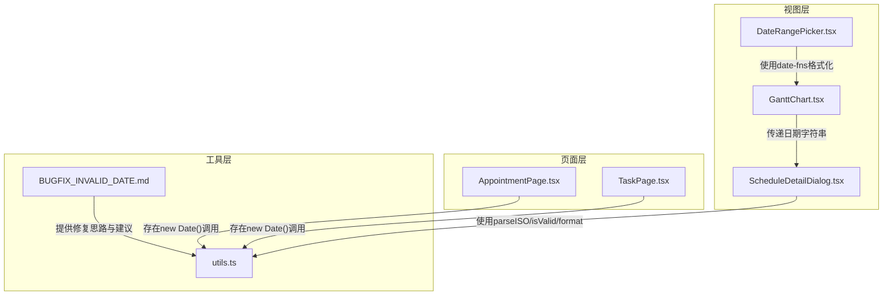
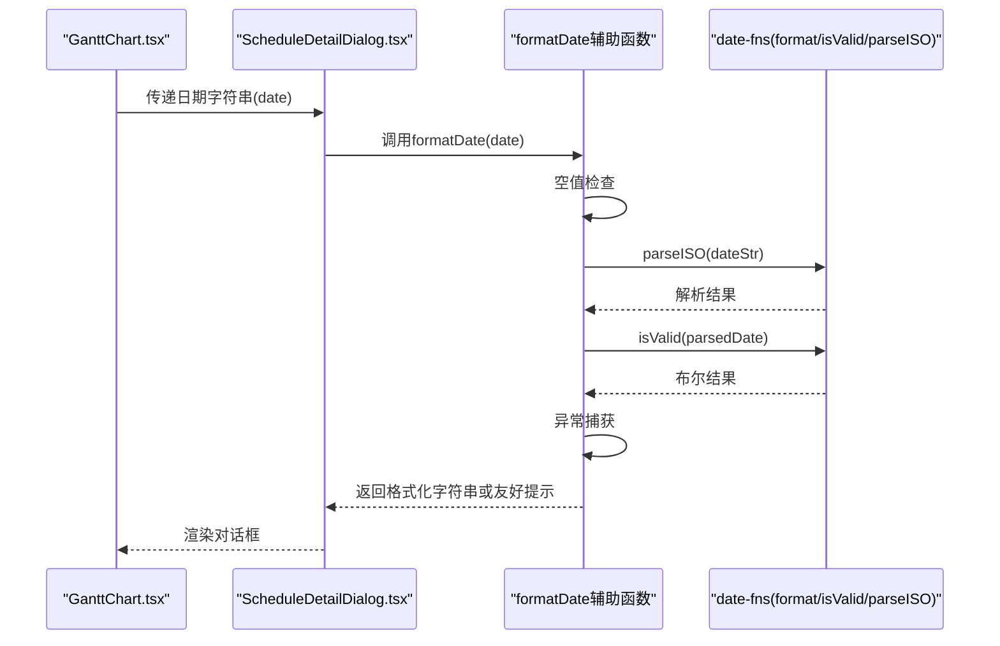
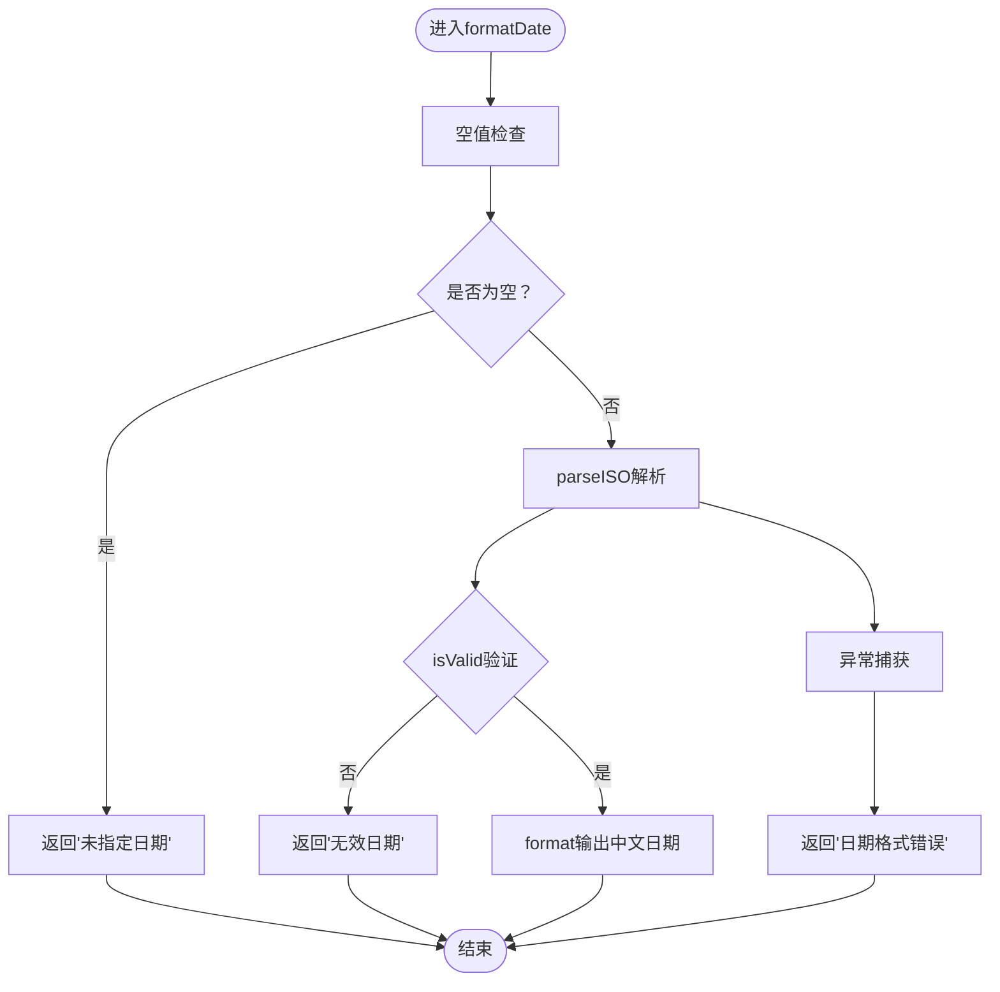

# 无效日期处理问题

<cite>
**本文引用的文件**
- [ScheduleDetailDialog.tsx](file://src/components/appointment/ScheduleDetailDialog.tsx)
- [GanttChart.tsx](file://src/components/appointment/GanttChart.tsx)
- [DateRangePicker.tsx](file://src/components/appointment/DateRangePicker.tsx)
- [utils.ts](file://src/lib/utils.ts)
- [AppointmentPage.tsx](file://src/pages/doctor/AppointmentPage.tsx)
- [TaskPage.tsx](file://src/pages/nurse/TaskPage.tsx)
- [BUGFIX_INVALID_DATE.md](file://BUGFIX_INVALID_DATE.md)
</cite>

## 目录
1. [引言](#引言)
2. [项目结构与相关组件](#项目结构与相关组件)
3. [核心问题与根本原因](#核心问题与根本原因)
4. [架构与数据流概览](#架构与数据流概览)
5. [组件深度分析](#组件深度分析)
6. [依赖关系与耦合分析](#依赖关系与耦合分析)
7. [性能与健壮性考量](#性能与健壮性考量)
8. [故障排查与最佳实践](#故障排查与最佳实践)
9. [结论](#结论)
10. [附录：安全格式化函数设计与复用建议](#附录安全格式化函数设计与复用建议)

## 引言
本文件聚焦于“无效日期处理”问题，围绕 ScheduleDetailDialog 组件中因直接使用 new Date('') 导致的“Invalid time value”崩溃展开，系统性梳理问题成因、修复方案、错误处理策略与全局复用建议。目标是帮助开发者在前端应用中建立一致、健壮且用户友好的日期格式化与错误兜底机制。

## 项目结构与相关组件
本次分析涉及以下关键文件：
- ScheduleDetailDialog.tsx：对话框组件，负责展示某一天的排班详情，包含安全的日期格式化函数
- GanttChart.tsx：甘特图组件，负责调度视图与对话框联动，向对话框传递日期字符串
- DateRangePicker.tsx：日期范围选择器，使用 date-fns 进行格式化与导航
- utils.ts：通用工具函数，包含基于原生 Date 的格式化函数（存在潜在风险）
- AppointmentPage.tsx、TaskPage.tsx：页面组件，存在直接使用 new Date() 的格式化调用
- BUGFIX_INVALID_DATE.md：问题修复说明文档，记录了问题背景、修复方案与测试验证



图表来源
- [ScheduleDetailDialog.tsx](file://src/components/appointment/ScheduleDetailDialog.tsx#L1-L70)
- [GanttChart.tsx](file://src/components/appointment/GanttChart.tsx#L39-L70)
- [DateRangePicker.tsx](file://src/components/appointment/DateRangePicker.tsx#L1-L36)
- [utils.ts](file://src/lib/utils.ts#L29-L40)
- [AppointmentPage.tsx](file://src/pages/doctor/AppointmentPage.tsx#L160-L170)
- [TaskPage.tsx](file://src/pages/nurse/TaskPage.tsx#L35-L45)
- [BUGFIX_INVALID_DATE.md](file://BUGFIX_INVALID_DATE.md#L1-L120)

章节来源
- [ScheduleDetailDialog.tsx](file://src/components/appointment/ScheduleDetailDialog.tsx#L1-L70)
- [GanttChart.tsx](file://src/components/appointment/GanttChart.tsx#L39-L70)
- [DateRangePicker.tsx](file://src/components/appointment/DateRangePicker.tsx#L1-L36)
- [utils.ts](file://src/lib/utils.ts#L29-L40)
- [AppointmentPage.tsx](file://src/pages/doctor/AppointmentPage.tsx#L160-L170)
- [TaskPage.tsx](file://src/pages/nurse/TaskPage.tsx#L35-L45)
- [BUGFIX_INVALID_DATE.md](file://BUGFIX_INVALID_DATE.md#L1-L120)

## 核心问题与根本原因
- 问题现象：当 ScheduleDetailDialog 的日期参数为空字符串或无效值时，直接使用 format(new Date(date), ...) 会创建无效日期对象，进而触发 date-fns isValid 抛出 RangeError，导致组件崩溃。
- 触发场景：
  - 组件初始化时 dialogDate 初始值为空字符串
  - 传入的日期字符串格式不正确或为 null/undefined
- 修复路径：在组件内部新增安全的 formatDate 辅助函数，采用“空值检查 → 解析验证 → 异常捕获”的三层防护策略，并使用 date-fns 的 parseISO 替代原生 new Date()，以获得更严格的格式校验与跨浏览器一致性。

章节来源
- [BUGFIX_INVALID_DATE.md](file://BUGFIX_INVALID_DATE.md#L1-L60)
- [ScheduleDetailDialog.tsx](file://src/components/appointment/ScheduleDetailDialog.tsx#L27-L36)

## 架构与数据流概览
- 数据来源：GanttChart 将选定日期字符串传递给 ScheduleDetailDialog
- 处理流程：组件内部先对日期字符串进行安全格式化，再渲染标题与排班详情
- 错误兜底：若输入为空、解析失败或无效，则返回友好文案而非抛错



图表来源
- [GanttChart.tsx](file://src/components/appointment/GanttChart.tsx#L563-L571)
- [ScheduleDetailDialog.tsx](file://src/components/appointment/ScheduleDetailDialog.tsx#L27-L36)

章节来源
- [GanttChart.tsx](file://src/components/appointment/GanttChart.tsx#L563-L571)
- [ScheduleDetailDialog.tsx](file://src/components/appointment/ScheduleDetailDialog.tsx#L27-L36)

## 组件深度分析

### ScheduleDetailDialog 组件的安全格式化策略
- 设计要点：
  - 空值检查：对空字符串、null、undefined 返回“未指定日期”
  - 解析验证：使用 parseISO 解析 ISO 字符串，再用 isValid 验证有效性
  - 异常兜底：try-catch 捕获意外错误，返回“日期格式错误”
  - 本地化：使用 zhCN locale 输出中文日期
- 优势：
  - 避免直接使用 new Date('') 导致的 RangeError
  - 统一错误提示，提升用户体验
  - 与 date-fns 生态保持一致，便于后续扩展



图表来源
- [ScheduleDetailDialog.tsx](file://src/components/appointment/ScheduleDetailDialog.tsx#L27-L36)

章节来源
- [ScheduleDetailDialog.tsx](file://src/components/appointment/ScheduleDetailDialog.tsx#L27-L36)

### GanttChart 组件中的日期交互
- 关键点：
  - 通过对话框打开时，将日期字符串与排班集合传递给 ScheduleDetailDialog
  - 组件内部存在状态初始化为字符串空值，这正是引发问题的潜在入口之一
- 建议：
  - 在打开对话框前确保日期字符串有效
  - 或在对话框内部统一走安全格式化流程

章节来源
- [GanttChart.tsx](file://src/components/appointment/GanttChart.tsx#L39-L70)
- [GanttChart.tsx](file://src/components/appointment/GanttChart.tsx#L563-L571)

### DateRangePicker 组件中的安全格式化实践
- 关键点：
  - 使用 date-fns 的 format、startOfWeek、endOfWeek 等函数进行格式化与区间计算
  - 该组件未出现直接使用 new Date('') 的格式化调用，属于安全实践范例
- 建议：
  - 其他组件可借鉴其导入与使用方式，统一采用 date-fns

章节来源
- [DateRangePicker.tsx](file://src/components/appointment/DateRangePicker.tsx#L1-L36)

### utils.ts 中的通用格式化函数风险
- 现状：
  - 存在基于原生 Date 的 formatDate 函数，直接调用 new Date(date)，存在与问题相同的崩溃风险
- 建议：
  - 将该函数改造为安全版本，或在调用处改为使用 date-fns 的 parseISO + isValid + format 组合
  - 或者在应用范围内逐步替换为安全的日期工具函数

章节来源
- [utils.ts](file://src/lib/utils.ts#L29-L40)

### 页面组件中的直接 new Date() 调用
- AppointmentPage.tsx、TaskPage.tsx 中存在直接使用 new Date() 的格式化调用
- 风险：
  - 若传入的日期字段为 null/undefined/空字符串，可能导致无效日期对象
- 建议：
  - 在调用前进行空值检查或使用安全格式化函数
  - 优先采用 date-fns 的 parseISO + isValid + format 组合

章节来源
- [AppointmentPage.tsx](file://src/pages/doctor/AppointmentPage.tsx#L160-L170)
- [TaskPage.tsx](file://src/pages/nurse/TaskPage.tsx#L35-L45)

## 依赖关系与耦合分析
- 组件内聚与解耦：
  - ScheduleDetailDialog 内部封装了安全格式化逻辑，避免了外部组件对日期格式化的侵入式处理
- 外部依赖：
  - date-fns 的 format、isValid、parseISO 为安全日期处理的核心依赖
- 潜在循环依赖：
  - 当前各组件之间通过 props 传递日期字符串，未见循环依赖迹象
- 风险点：
  - utils.ts 中的原生 Date 版本格式化函数可能被其他模块直接使用，形成潜在风险面

```mermaid
graph LR
SD["ScheduleDetailDialog.tsx"] --> FNS["date-fns(format/isValid/parseISO)"]
Gantt["GanttChart.tsx"] --> SD
DRP["DateRangePicker.tsx"] --> FNS
Utils["utils.ts"] --> |原生Date风险| SD
Appt["AppointmentPage.tsx"] --> |new Date()风险| Utils
Task["TaskPage.tsx"] --> |new Date()风险| Utils
```

图表来源
- [ScheduleDetailDialog.tsx](file://src/components/appointment/ScheduleDetailDialog.tsx#L1-L20)
- [GanttChart.tsx](file://src/components/appointment/GanttChart.tsx#L563-L571)
- [DateRangePicker.tsx](file://src/components/appointment/DateRangePicker.tsx#L1-L36)
- [utils.ts](file://src/lib/utils.ts#L29-L40)
- [AppointmentPage.tsx](file://src/pages/doctor/AppointmentPage.tsx#L160-L170)
- [TaskPage.tsx](file://src/pages/nurse/TaskPage.tsx#L35-L45)

章节来源
- [ScheduleDetailDialog.tsx](file://src/components/appointment/ScheduleDetailDialog.tsx#L1-L20)
- [GanttChart.tsx](file://src/components/appointment/GanttChart.tsx#L563-L571)
- [DateRangePicker.tsx](file://src/components/appointment/DateRangePicker.tsx#L1-L36)
- [utils.ts](file://src/lib/utils.ts#L29-L40)
- [AppointmentPage.tsx](file://src/pages/doctor/AppointmentPage.tsx#L160-L170)
- [TaskPage.tsx](file://src/pages/nurse/TaskPage.tsx#L35-L45)

## 性能与健壮性考量
- 性能：
  - parseISO + isValid + format 的组合在大多数 UI 场景下开销极小，远小于一次崩溃导致的重渲染成本
- 健壮性：
  - 多层错误处理（空值检查 → 解析验证 → 异常捕获）显著降低异常传播概率
- 一致性：
  - 使用 date-fns 的 parseISO 能够提供更严格的格式校验与跨浏览器一致性，减少平台差异带来的不确定性

[本节为通用指导，无需特定文件引用]

## 故障排查与最佳实践
- 诊断步骤：
  - 确认传入日期是否为空字符串/null/undefined
  - 检查日期字符串是否符合 ISO 8601 格式
  - 观察是否存在异常捕获分支被触发
- 修复建议：
  - 在所有涉及日期格式化的组件中引入安全格式化函数
  - 统一使用 date-fns 的 parseISO + isValid + format
  - 对页面组件中的 new Date() 调用进行替换或包裹空值检查
- 代码审查清单：
  - 是否使用了安全的解析函数（parseISO 等）
  - 是否验证了日期有效性（isValid）
  - 是否有 try-catch 错误处理
  - 是否有空值检查
  - 是否提供了友好的错误消息

章节来源
- [BUGFIX_INVALID_DATE.md](file://BUGFIX_INVALID_DATE.md#L142-L219)
- [ScheduleDetailDialog.tsx](file://src/components/appointment/ScheduleDetailDialog.tsx#L27-L36)

## 结论
通过在 ScheduleDetailDialog 中引入安全的 formatDate 辅助函数，并采用“空值检查 → 解析验证 → 异常捕获”的多层防护策略，成功规避了因 new Date('') 导致的崩溃问题。建议将该模式推广至全应用，替换所有直接使用 new Date() 的格式化调用，统一采用 date-fns 的 parseISO + isValid + format 组合，从而提升整体健壮性与用户体验。

[本节为总结性内容，无需特定文件引用]

## 附录：安全格式化函数设计与复用建议
- 设计思想：
  - 空值检查：对空字符串、null、undefined 返回默认友好文案
  - 解析验证：使用 parseISO 解析 ISO 字符串，再用 isValid 验证有效性
  - 异常兜底：try-catch 捕获意外错误，返回“日期格式错误”
  - 可配置：支持自定义格式字符串与回退文案
- 复用建议：
  - 在 src/utils 下新增安全日期工具模块，集中管理安全格式化函数
  - 在各页面与组件中统一导入与使用，避免重复实现
  - 对现有 utils.ts 中的原生 Date 版本格式化函数进行替换或迁移

章节来源
- [BUGFIX_INVALID_DATE.md](file://BUGFIX_INVALID_DATE.md#L182-L205)
- [ScheduleDetailDialog.tsx](file://src/components/appointment/ScheduleDetailDialog.tsx#L27-L36)