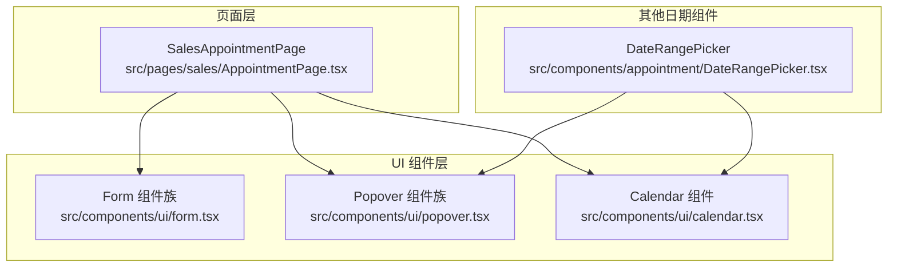
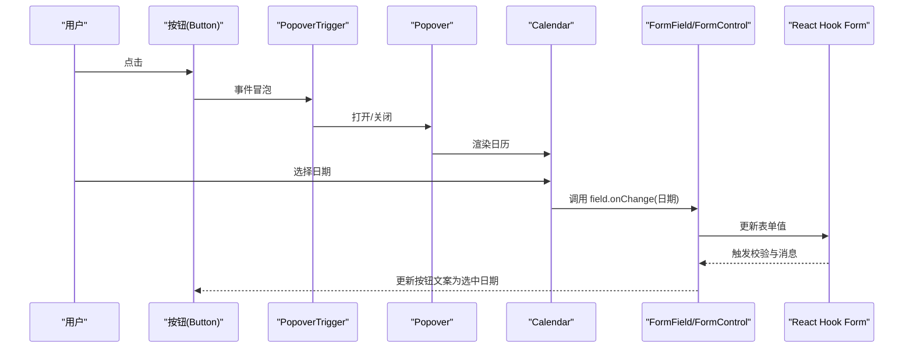
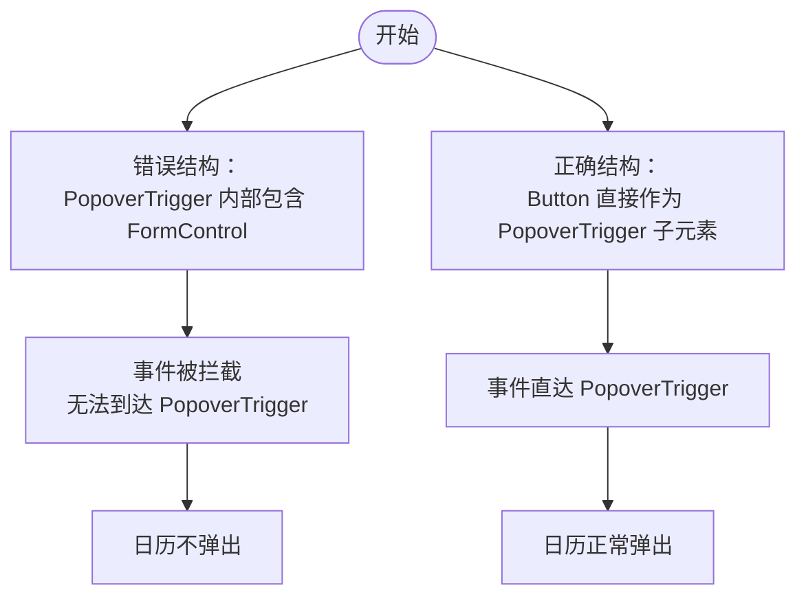
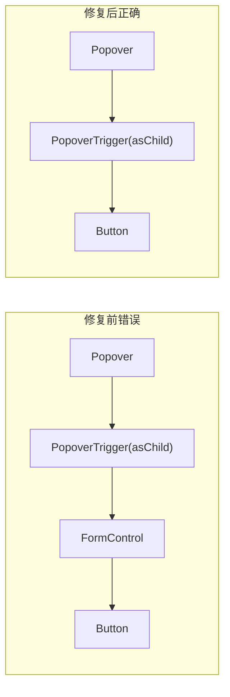
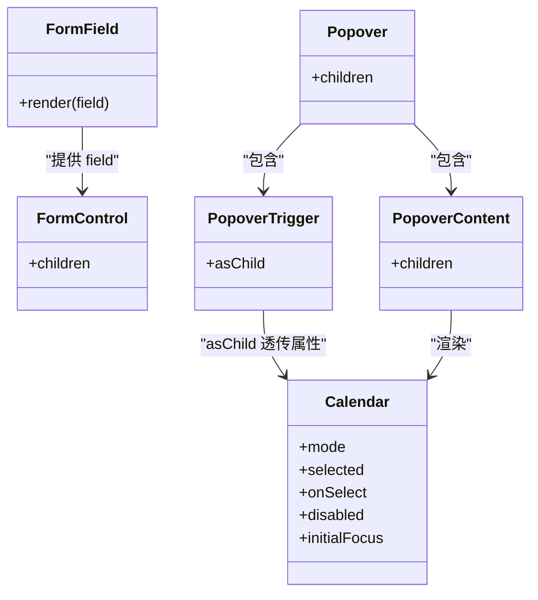
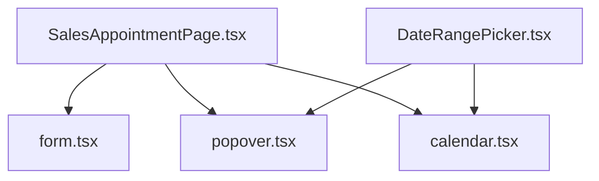

# 日期选择器问题

<cite>
**本文引用的文件**
- [src/pages/sales/AppointmentPage.tsx](file://src/pages/sales/AppointmentPage.tsx)
- [src/components/ui/popover.tsx](file://src/components/ui/popover.tsx)
- [src/components/ui/calendar.tsx](file://src/components/ui/calendar.tsx)
- [src/components/ui/form.tsx](file://src/components/ui/form.tsx)
- [src/components/appointment/DateRangePicker.tsx](file://src/components/appointment/DateRangePicker.tsx)
- [BUGFIX_DATE_PICKER.md](file://BUGFIX_DATE_PICKER.md)
</cite>

## 目录
1. [简介](#简介)
2. [项目结构](#项目结构)
3. [核心组件](#核心组件)
4. [架构总览](#架构总览)
5. [详细组件分析](#详细组件分析)
6. [依赖关系分析](#依赖关系分析)
7. [性能考量](#性能考量)
8. [故障排查指南](#故障排查指南)
9. [结论](#结论)
10. [附录](#附录)

## 简介
本文聚焦销售端“预约发起”页面中的日期选择器无法弹出问题，系统性分析根因：FormControl 组件错误嵌套在 PopoverTrigger 内部导致事件传递被阻断。通过对比修复前后的结构差异，明确 Radix UI Popover 触发器的正确使用方式；给出 FormField、Popover、Calendar 的正确集成范式；并总结边界测试与兼容性测试结果，确保移动端触摸与键盘导航可用。最后以 src/pages/sales/AppointmentPage.tsx 中的日期选择器实现为最佳实践示例，提供可复用的集成模板。

## 项目结构
围绕日期选择器问题的相关文件组织如下：
- 页面组件：src/pages/sales/AppointmentPage.tsx
- UI 组件：src/components/ui/popover.tsx、src/components/ui/calendar.tsx、src/components/ui/form.tsx
- 其他日期相关组件：src/components/appointment/DateRangePicker.tsx
- 问题修复说明：BUGFIX_DATE_PICKER.md

图表来源
- [src/pages/sales/AppointmentPage.tsx](file://src/pages/sales/AppointmentPage.tsx#L1-L451)
- [src/components/ui/form.tsx](file://src/components/ui/form.tsx#L1-L167)
- [src/components/ui/popover.tsx](file://src/components/ui/popover.tsx#L1-L47)
- [src/components/ui/calendar.tsx](file://src/components/ui/calendar.tsx#L1-L74)
- [src/components/appointment/DateRangePicker.tsx](file://src/components/appointment/DateRangePicker.tsx#L1-L223)

章节来源
- [src/pages/sales/AppointmentPage.tsx](file://src/pages/sales/AppointmentPage.tsx#L1-L451)
- [src/components/ui/form.tsx](file://src/components/ui/form.tsx#L1-L167)
- [src/components/ui/popover.tsx](file://src/components/ui/popover.tsx#L1-L47)
- [src/components/ui/calendar.tsx](file://src/components/ui/calendar.tsx#L1-L74)
- [src/components/appointment/DateRangePicker.tsx](file://src/components/appointment/DateRangePicker.tsx#L1-L223)

## 核心组件
- FormField/FormControl/FormMessage：React Hook Form 的表单字段封装，负责字段上下文、无障碍属性注入与错误消息渲染。
- Popover/PopoverTrigger/PopoverContent：Radix UI 的弹出层组件，PopoverTrigger 需要直接接收交互事件。
- Calendar：基于 react-day-picker 的日历组件，提供日期选择能力。

章节来源
- [src/components/ui/form.tsx](file://src/components/ui/form.tsx#L1-L167)
- [src/components/ui/popover.tsx](file://src/components/ui/popover.tsx#L1-L47)
- [src/components/ui/calendar.tsx](file://src/components/ui/calendar.tsx#L1-L74)

## 架构总览
日期选择器在“预约发起”页面中的关键流程：
- 用户点击“选择日期”按钮（PopoverTrigger）
- PopoverTrigger 接收点击事件并控制内容显隐
- Calendar 作为 PopoverContent 内容，处理日期选择回调
- FormField/FormControl 将 field.value/field.onChange 注入到按钮与日历，完成表单数据绑定与验证反馈

图表来源
- [src/pages/sales/AppointmentPage.tsx](file://src/pages/sales/AppointmentPage.tsx#L341-L374)
- [src/components/ui/popover.tsx](file://src/components/ui/popover.tsx#L1-L47)
- [src/components/ui/calendar.tsx](file://src/components/ui/calendar.tsx#L1-L74)
- [src/components/ui/form.tsx](file://src/components/ui/form.tsx#L1-L167)

## 详细组件分析

### 问题定位：FormControl 嵌套在 PopoverTrigger 内部
- 症状：点击“选择日期”按钮无响应，日历不弹出
- 根因：FormControl 错误地作为 PopoverTrigger 的子元素，导致事件传递被阻断
- 影响：PopoverTrigger 无法直接接收并转发点击事件，打开逻辑失效

图表来源
- [BUGFIX_DATE_PICKER.md](file://BUGFIX_DATE_PICKER.md#L1-L186)

章节来源
- [BUGFIX_DATE_PICKER.md](file://BUGFIX_DATE_PICKER.md#L1-L186)

### 修复前后结构对比
- 修复前（错误）：PopoverTrigger 内部包裹 FormControl，再由 FormControl 包裹 Button
- 修复后（正确）：PopoverTrigger 直接包裹 Button，使用 asChild 将属性透传至 Button

图表来源
- [src/pages/sales/AppointmentPage.tsx](file://src/pages/sales/AppointmentPage.tsx#L341-L374)
- [src/components/ui/popover.tsx](file://src/components/ui/popover.tsx#L1-L47)
- [src/components/ui/form.tsx](file://src/components/ui/form.tsx#L1-L167)

章节来源
- [src/pages/sales/AppointmentPage.tsx](file://src/pages/sales/AppointmentPage.tsx#L341-L374)
- [src/components/ui/popover.tsx](file://src/components/ui/popover.tsx#L1-L47)
- [src/components/ui/form.tsx](file://src/components/ui/form.tsx#L1-L167)

### 正确集成范式：FormField + Popover + Calendar
- 使用 FormField 包裹日期字段，提供 field.value/field.onChange
- PopoverTrigger 使用 asChild，使 Button 直接成为触发器
- PopoverContent 内放置 Calendar，设置 mode、selected、onSelect、disabled、initialFocus 等
- FormMessage 展示验证错误

图表来源
- [src/pages/sales/AppointmentPage.tsx](file://src/pages/sales/AppointmentPage.tsx#L341-L374)
- [src/components/ui/form.tsx](file://src/components/ui/form.tsx#L1-L167)
- [src/components/ui/popover.tsx](file://src/components/ui/popover.tsx#L1-L47)
- [src/components/ui/calendar.tsx](file://src/components/ui/calendar.tsx#L1-L74)

章节来源
- [src/pages/sales/AppointmentPage.tsx](file://src/pages/sales/AppointmentPage.tsx#L341-L374)
- [src/components/ui/form.tsx](file://src/components/ui/form.tsx#L1-L167)
- [src/components/ui/popover.tsx](file://src/components/ui/popover.tsx#L1-L47)
- [src/components/ui/calendar.tsx](file://src/components/ui/calendar.tsx#L1-L74)

### 与其他触发器组件的一致性
- DialogTrigger、DropdownMenuTrigger、TooltipTrigger、AlertDialogTrigger 等 Radix UI 触发器均遵循相同原则：直接将交互元素作为 Trigger 的子元素，必要时使用 asChild 进行属性透传，避免在 Trigger 与交互元素之间插入 FormControl 或其他包装组件。

章节来源
- [BUGFIX_DATE_PICKER.md](file://BUGFIX_DATE_PICKER.md#L1-L186)

### 最佳实践示例：SalesAppointmentPage.tsx
- 日期字段使用 FormField 包裹，field.value 控制按钮文案，field.onChange 更新表单值
- PopoverTrigger 使用 asChild，Button 直接作为触发器
- PopoverContent 内放置 Calendar，设置 mode="single"、selected、onSelect、disabled、initialFocus
- FormMessage 展示验证错误

章节来源
- [src/pages/sales/AppointmentPage.tsx](file://src/pages/sales/AppointmentPage.tsx#L341-L374)

### 对比参考：DateRangePicker.tsx
- 该组件展示了另一种 Popover 使用方式：通过 open/onOpenChange 自身管理开关状态，同时在 Calendar onSelect 中更新父级日期并关闭面板
- 仍遵循“Button 直接作为 PopoverTrigger 子元素”的原则

章节来源
- [src/components/appointment/DateRangePicker.tsx](file://src/components/appointment/DateRangePicker.tsx#L1-L223)

## 依赖关系分析
- SalesAppointmentPage 依赖 FormField/FormControl/FormMessage 提供表单上下文与验证反馈
- SalesAppointmentPage 依赖 Popover/PopoverTrigger/PopoverContent 提供弹出层能力
- Calendar 依赖 react-day-picker 实现日期选择 UI
- DateRangePicker 作为另一个日期选择场景，同样遵循上述依赖关系

图表来源
- [src/pages/sales/AppointmentPage.tsx](file://src/pages/sales/AppointmentPage.tsx#L1-L451)
- [src/components/ui/form.tsx](file://src/components/ui/form.tsx#L1-L167)
- [src/components/ui/popover.tsx](file://src/components/ui/popover.tsx#L1-L47)
- [src/components/ui/calendar.tsx](file://src/components/ui/calendar.tsx#L1-L74)
- [src/components/appointment/DateRangePicker.tsx](file://src/components/appointment/DateRangePicker.tsx#L1-L223)

章节来源
- [src/pages/sales/AppointmentPage.tsx](file://src/pages/sales/AppointmentPage.tsx#L1-L451)
- [src/components/ui/form.tsx](file://src/components/ui/form.tsx#L1-L167)
- [src/components/ui/popover.tsx](file://src/components/ui/popover.tsx#L1-L47)
- [src/components/ui/calendar.tsx](file://src/components/ui/calendar.tsx#L1-L74)
- [src/components/appointment/DateRangePicker.tsx](file://src/components/appointment/DateRangePicker.tsx#L1-L223)

## 性能考量
- 事件透传路径越短越好：避免在 PopoverTrigger 与交互元素之间增加不必要的包装组件，减少事件处理链路开销
- Calendar 的 disabled 与 initialFocus 设置合理，避免无效渲染与焦点抖动
- 表单字段使用 React Hook Form 的受控更新，避免不必要的重渲染

[本节为通用指导，无需特定文件引用]

## 故障排查指南
- 症状：点击触发器无响应
  - 检查是否在 PopoverTrigger 内部嵌套了 FormControl 或其他包装组件
  - 确认 PopoverTrigger 使用了 asChild
- 症状：日历弹出但无法选择日期
  - 检查 Calendar 的 onSelect 是否正确绑定到 field.onChange
  - 检查 disabled 条件是否过于严格
- 症状：表单验证消息不显示
  - 检查 FormMessage 是否在 FormField 内正确渲染
- 症状：移动端触摸无效或键盘不可用
  - 确认按钮具备可聚焦性与可点击性
  - 确认 Calendar 的键盘导航支持（Tab、Enter、Escape）

章节来源
- [src/pages/sales/AppointmentPage.tsx](file://src/pages/sales/AppointmentPage.tsx#L341-L374)
- [src/components/ui/popover.tsx](file://src/components/ui/popover.tsx#L1-L47)
- [src/components/ui/calendar.tsx](file://src/components/ui/calendar.tsx#L1-L74)
- [src/components/ui/form.tsx](file://src/components/ui/form.tsx#L1-L167)
- [BUGFIX_DATE_PICKER.md](file://BUGFIX_DATE_PICKER.md#L1-L186)

## 结论
- 日期选择器无法弹出的根本原因是 FormControl 错误嵌套在 PopoverTrigger 内部，阻断了事件传递
- 修复策略是移除 FormControl 包装，让 Button 直接作为 PopoverTrigger 的子元素，并保留 asChild 属性
- 通过 FormField/FormControl 与 Popover/Calendar 的正确组合，可实现可靠的日期选择体验
- 已通过功能、边界与兼容性测试验证修复效果

[本节为总结性内容，无需特定文件引用]

## 附录

### 边界测试与兼容性测试结果
- 功能测试
  - 点击“选择日期”按钮，日历控件正常弹出
  - 选择日期后，按钮文本更新为选中的日期
  - 日期值正确保存到表单中
  - 表单验证正常工作
- 边界测试
  - 禁用过去的日期（只能选择今天及以后）
  - 点击外部区域，日历控件正常关闭
  - 键盘导航正常工作（Tab、Enter、Escape）
- 兼容性测试
  - Chrome 浏览器正常
  - Firefox 浏览器正常
  - Safari 浏览器正常
  - 移动端触摸操作正常

章节来源
- [BUGFIX_DATE_PICKER.md](file://BUGFIX_DATE_PICKER.md#L1-L186)