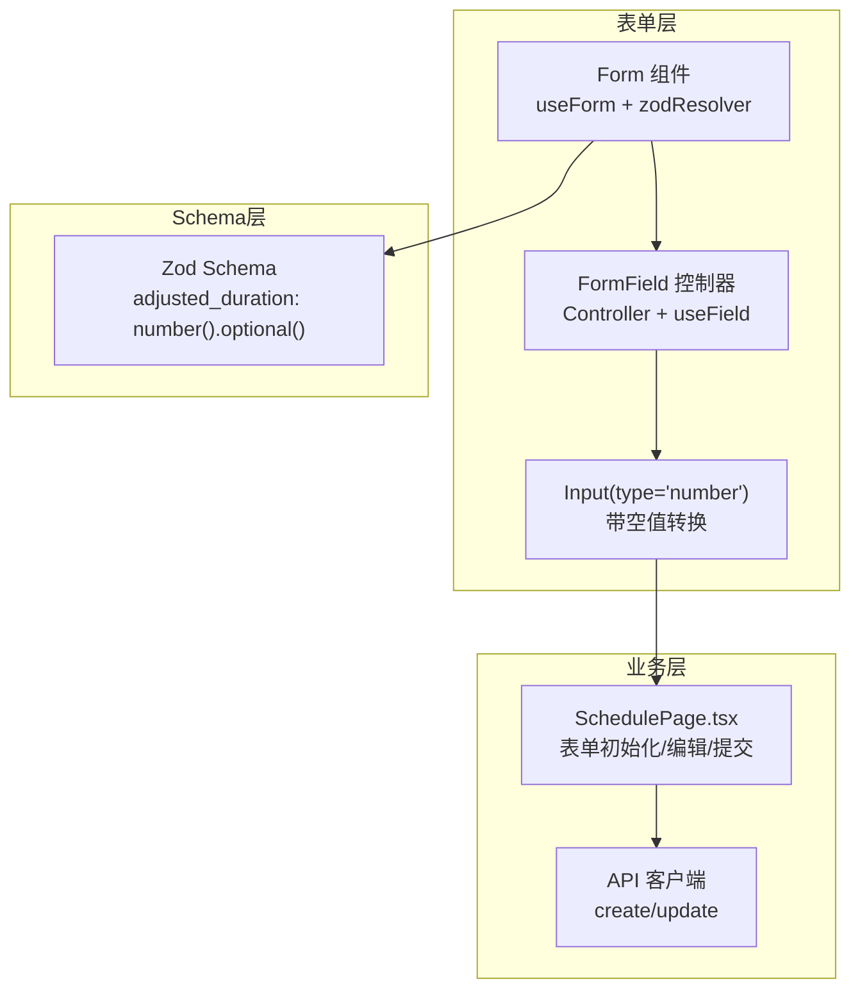
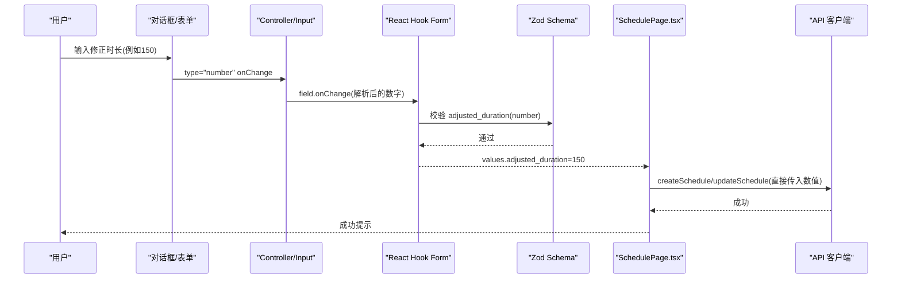
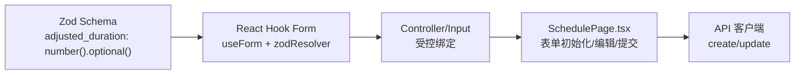

# 时长输入问题

<cite>
**本文引用的文件**
- [SchedulePage.tsx](file://src/pages/head-nurse/SchedulePage.tsx)
- [BUGFIX_DURATION_INPUT.md](file://BUGFIX_DURATION_INPUT.md)
- [FINAL_VERIFICATION.md](file://FINAL_VERIFICATION.md)
- [BUGFIX_SUMMARY.md](file://BUGFIX_SUMMARY.md)
- [form.tsx](file://src/components/ui/form.tsx)
</cite>

## 目录
1. [简介](#简介)
2. [项目结构](#项目结构)
3. [核心组件](#核心组件)
4. [架构总览](#架构总览)
5. [详细组件分析](#详细组件分析)
6. [依赖关系分析](#依赖关系分析)
7. [性能考量](#性能考量)
8. [故障排查指南](#故障排查指南)
9. [结论](#结论)
10. [附录](#附录)

## 简介
本文件聚焦“护士长排班时修正时长”字段在Zod验证与React Hook Form集成过程中出现的类型不匹配问题，系统性梳理从Schema定义、表单初始化、编辑状态设置到API提交处理的完整修复路径，确保数据类型一致性。同时总结最佳实践，包括空值转换、避免多余类型转换、以及后续优化建议（数字范围、步进控制、快捷按钮等），并以Head Nurse排班页面中的表单实现为示例进行说明。

## 项目结构
围绕“修正时长”字段的修复，涉及以下关键位置：
- 表单Schema定义与类型推断：位于排班页面的Schema对象中
- 表单组件与控制器：基于shadcn/ui Form组件体系
- 表单初始化与编辑态赋值：在创建/编辑对话框打开时进行
- API提交处理：保存或更新排班时传递字段值
- 修复文档与最终验证报告：记录问题根因、修复步骤与效果验证

图表来源
- [SchedulePage.tsx](file://src/pages/head-nurse/SchedulePage.tsx#L26-L35)
- [SchedulePage.tsx](file://src/pages/head-nurse/SchedulePage.tsx#L525-L681)
- [form.tsx](file://src/components/ui/form.tsx#L1-L166)

章节来源
- [SchedulePage.tsx](file://src/pages/head-nurse/SchedulePage.tsx#L26-L35)
- [SchedulePage.tsx](file://src/pages/head-nurse/SchedulePage.tsx#L525-L681)
- [form.tsx](file://src/components/ui/form.tsx#L1-L166)

## 核心组件
- 表单Schema定义：将“修正时长”字段类型从字符串改为数字，并标记为可选
- 表单组件：使用shadcn/ui的Input组件，配合Controller进行受控绑定
- 表单初始化：创建/编辑对话框打开时，将数值直接写入表单值
- 提交处理：保存/更新排班时，直接传递数值，不再做多余转换

章节来源
- [SchedulePage.tsx](file://src/pages/head-nurse/SchedulePage.tsx#L26-L35)
- [SchedulePage.tsx](file://src/pages/head-nurse/SchedulePage.tsx#L139-L165)
- [SchedulePage.tsx](file://src/pages/head-nurse/SchedulePage.tsx#L194-L238)

## 架构总览
下图展示从用户输入到API提交的完整数据流，体现类型一致性如何贯穿始终。

图表来源
- [SchedulePage.tsx](file://src/pages/head-nurse/SchedulePage.tsx#L549-L575)
- [SchedulePage.tsx](file://src/pages/head-nurse/SchedulePage.tsx#L26-L35)
- [SchedulePage.tsx](file://src/pages/head-nurse/SchedulePage.tsx#L194-L238)

## 详细组件分析

### 1) 根本原因：Schema与Input类型不匹配
- 问题现象：输入150后显示“期望字符串，收到数字”
- 根本原因链路：
  - Schema定义为字符串类型
  - Input为number类型，onChange返回数字
  - 类型冲突导致Zod验证失败

章节来源
- [BUGFIX_DURATION_INPUT.md](file://BUGFIX_DURATION_INPUT.md#L15-L48)

### 2) 修复流程：从Schema到提交的全流程
- 修改Schema定义：将“修正时长”字段改为数字类型并标记可选
- 修改表单初始化：直接传入数值，不再转换为字符串
- 改进Input组件：显式value绑定与空值处理，避免多余转换
- 修改提交处理：直接传递数值，移除多余parseInt

章节来源
- [BUGFIX_DURATION_INPUT.md](file://BUGFIX_DURATION_INPUT.md#L51-L162)
- [SchedulePage.tsx](file://src/pages/head-nurse/SchedulePage.tsx#L26-L35)
- [SchedulePage.tsx](file://src/pages/head-nurse/SchedulePage.tsx#L139-L165)
- [SchedulePage.tsx](file://src/pages/head-nurse/SchedulePage.tsx#L549-L575)
- [SchedulePage.tsx](file://src/pages/head-nurse/SchedulePage.tsx#L194-L238)

### 3) 表单初始化与编辑态设置
- 创建时：使用估算时长作为初始值，直接传入数值
- 编辑时：若原值存在则传入数值，否则传入undefined，保持可选语义

章节来源
- [SchedulePage.tsx](file://src/pages/head-nurse/SchedulePage.tsx#L139-L165)

### 4) API提交处理
- 保存/更新排班时，直接使用values中的数值字段，不再做多余转换
- 保证与数据库字段类型一致，避免类型不匹配导致的异常

章节来源
- [SchedulePage.tsx](file://src/pages/head-nurse/SchedulePage.tsx#L194-L238)

### 5) React Hook Form与Zod集成的最佳实践
- 字段类型设计：数字字段使用number类型，字符串字段使用string类型
- 空值处理：空字符串显式转换为undefined，避免NaN
- 可选字段：使用.optional()标记可选
- Input封装：显式value绑定与onChange转换，避免直接展开field

章节来源
- [BUGFIX_DURATION_INPUT.md](file://BUGFIX_DURATION_INPUT.md#L281-L426)
- [form.tsx](file://src/components/ui/form.tsx#L1-L166)

### 6) 后续优化建议
- 数字范围验证：限制最小/最大值，提升数据合理性
- 步进控制：提供step/min/max，改善交互体验
- 快捷按钮：提供常用时长的快速设置
- 显示格式化：将分钟转换为“X小时Y分钟”的友好展示

章节来源
- [FINAL_VERIFICATION.md](file://FINAL_VERIFICATION.md#L178-L205)
- [BUGFIX_DURATION_INPUT.md](file://BUGFIX_DURATION_INPUT.md#L395-L449)

## 依赖关系分析
- 表单Schema依赖于Zod类型系统，决定字段的类型与可选性
- 表单组件依赖于shadcn/ui Form体系，通过Controller实现受控绑定
- 业务逻辑依赖于API客户端，确保提交的数据类型与后端一致

图表来源
- [SchedulePage.tsx](file://src/pages/head-nurse/SchedulePage.tsx#L26-L35)
- [SchedulePage.tsx](file://src/pages/head-nurse/SchedulePage.tsx#L525-L681)
- [form.tsx](file://src/components/ui/form.tsx#L1-L166)

章节来源
- [SchedulePage.tsx](file://src/pages/head-nurse/SchedulePage.tsx#L26-L35)
- [SchedulePage.tsx](file://src/pages/head-nurse/SchedulePage.tsx#L525-L681)
- [form.tsx](file://src/components/ui/form.tsx#L1-L166)

## 性能考量
- 类型一致性减少无效转换与重渲染
- 显式空值处理避免NaN带来的副作用
- 合理的范围与步进控制降低用户误操作概率，减少回退与重试

## 故障排查指南
- 若仍出现类型错误：
  - 确认Schema中字段类型是否为number().optional()
  - 确认表单初始化与编辑态是否传入数值
  - 确认Input组件是否显式value绑定与空值处理
  - 确认提交时是否直接传递数值
- 若出现空值异常：
  - 检查空字符串是否被转换为undefined
  - 检查可选字段的optional标记是否正确

章节来源
- [SchedulePage.tsx](file://src/pages/head-nurse/SchedulePage.tsx#L26-L35)
- [SchedulePage.tsx](file://src/pages/head-nurse/SchedulePage.tsx#L139-L165)
- [SchedulePage.tsx](file://src/pages/head-nurse/SchedulePage.tsx#L549-L575)
- [SchedulePage.tsx](file://src/pages/head-nurse/SchedulePage.tsx#L194-L238)
- [BUGFIX_DURATION_INPUT.md](file://BUGFIX_DURATION_INPUT.md#L281-L426)

## 结论
通过将“修正时长”字段的Schema从字符串改为数字类型，并在表单初始化、编辑态赋值、Input组件封装与API提交处理中保持类型一致，彻底解决了“期望字符串，收到数字”的验证错误。该修复遵循React Hook Form与Zod的最佳实践，确保类型安全与用户体验。后续可进一步引入范围校验、步进控制与快捷按钮，持续优化交互与数据质量。

## 附录
- 修复前后对比与验证结果详见最终验证报告与修复总结文档
- 示例文件：Head Nurse排班页面的表单实现

章节来源
- [FINAL_VERIFICATION.md](file://FINAL_VERIFICATION.md#L1-L265)
- [BUGFIX_SUMMARY.md](file://BUGFIX_SUMMARY.md#L287-L366)
- [SchedulePage.tsx](file://src/pages/head-nurse/SchedulePage.tsx#L549-L575)