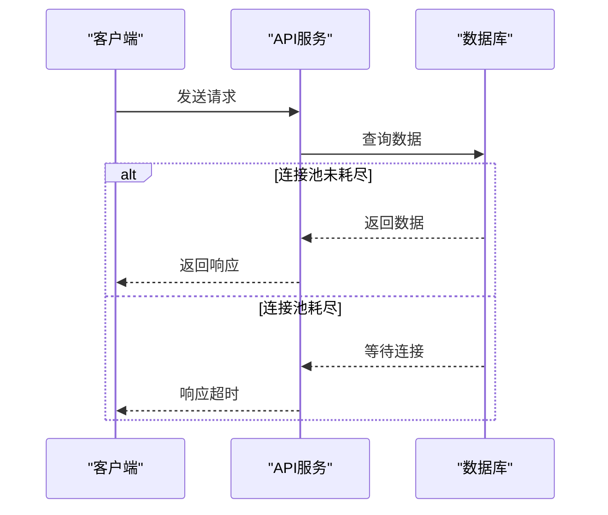
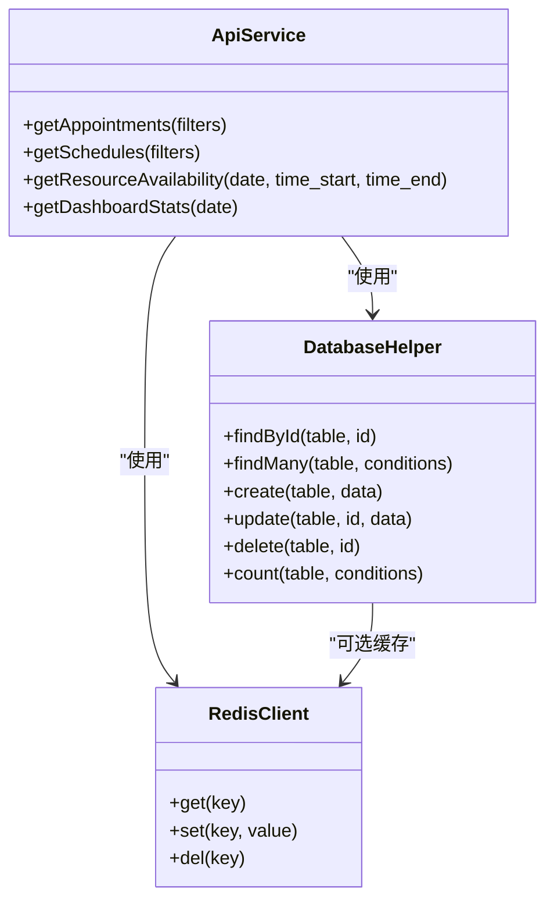
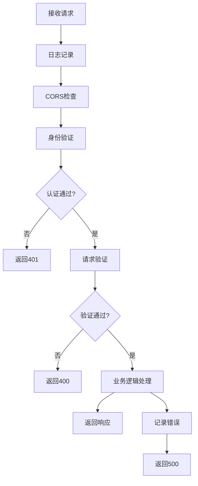
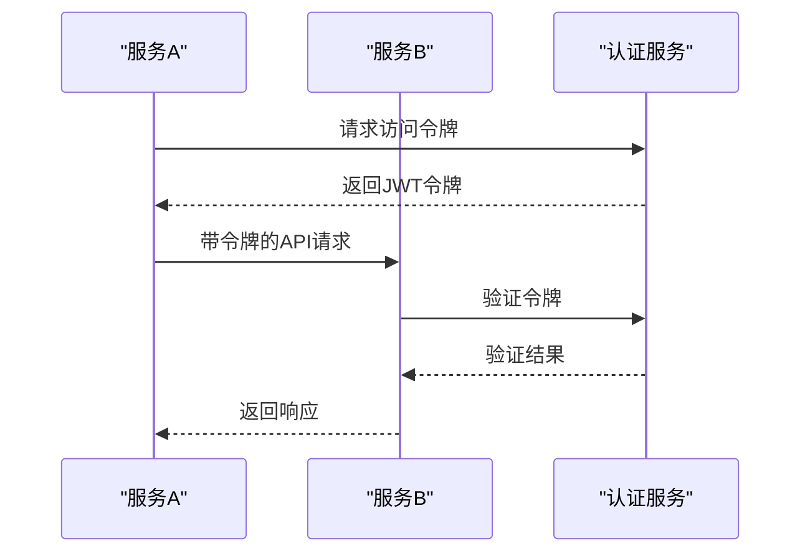
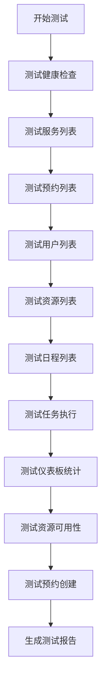
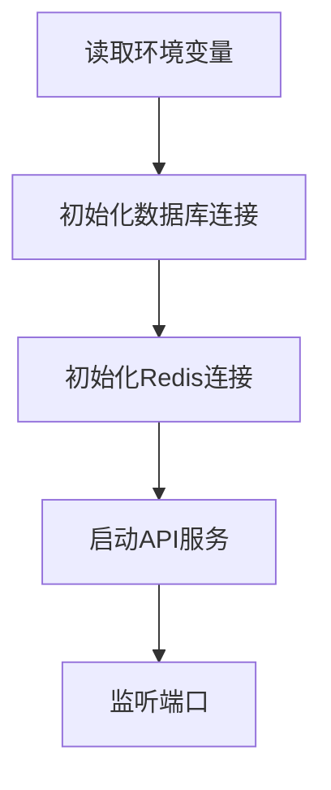

# API服务问题

<cite>
**本文档引用的文件**   
- [api.js](file://server/src/services/api.js)
- [connection.js](file://server/src/db/connection.js)
- [BUGFIX_SYSTEM_CONFIG.md](file://BUGFIX_SYSTEM_CONFIG.md)
- [test-all-apis.js](file://test-all-apis.js)
- [api.ts](file://src/db/api.ts)
- [types.ts](file://src/types/types.ts)
- [connection.ts](file://src/db/connection.ts)
</cite>

## 目录
1. [简介](#简介)
2. [系统配置更新失败问题分析](#系统配置更新失败问题分析)
3. [API响应超时与性能瓶颈](#api响应超时与性能瓶颈)
4. [数据库查询性能优化](#数据库查询性能优化)
5. [Express.js路由处理异常诊断](#expressjs路由处理异常诊断)
6. [服务间通信问题排查](#服务间通信问题排查)
7. [日志分析与API测试](#日志分析与api测试)
8. [配置加载与环境变量注入](#配置加载与环境变量注入)
9. [总结与建议](#总结与建议)

## 简介
本文档深入分析Bio-Appointment项目中API服务的常见问题，重点关注系统配置更新失败、API响应超时和数据库查询性能瓶颈等关键问题。通过分析`BUGFIX_SYSTEM_CONFIG.md`中的修复方案，结合`server/src/services/api.js`中的服务实现，详细说明如何诊断和解决配置加载顺序错误、环境变量未正确注入、数据库连接池配置不当等问题。同时提供日志分析方法和API测试脚本的使用方式，帮助开发人员快速定位和解决系统问题。

## 系统配置更新失败问题分析
系统配置更新失败的主要原因是数据库表缺失。前端代码已经实现了护士、医生、房间的管理功能，并调用了`nurses`、`doctors`、`rooms`三个表，但数据库中并未创建这些表，导致所有数据库操作都失败。

### 根本原因
数据库表缺失是导致系统配置更新失败的根本原因。前端代码已经实现了完整的CRUD操作，API也正确调用了Supabase的相应方法，但数据库中缺少必要的表结构。

### 修复方案
根据`BUGFIX_SYSTEM_CONFIG.md`文档，修复方案包括创建数据库迁移文件并应用迁移。具体步骤如下：
1. 创建包含`nurses`、`doctors`、`rooms`表的迁移文件
2. 为每个表添加必要的索引和RLS策略
3. 插入初始示例数据
4. 应用迁移并验证数据

```mermaid
flowchart TD
A[用户点击"保存"] --> B[前端调用createNurse]
B --> C[API调用Supabase插入数据]
C --> D[Supabase查询数据库]
D --> E{表是否存在?}
E --> |否| F[返回错误: 表不存在]
E --> |是| G[成功插入数据]
F --> H[显示"操作失败"]
G --> I[显示"添加成功"]
```

**Diagram sources**
- [BUGFIX_SYSTEM_CONFIG.md](file://BUGFIX_SYSTEM_CONFIG.md#L47-L61)

**Section sources**
- [BUGFIX_SYSTEM_CONFIG.md](file://BUGFIX_SYSTEM_CONFIG.md#L1-L550)

## API响应超时与性能瓶颈
API响应超时通常由数据库查询性能瓶颈引起。通过分析`server/src/services/api.js`中的查询实现，可以发现多个潜在的性能问题。

### 查询性能分析
在`getAppointments`和`getSchedules`等方法中，使用了动态构建的WHERE子句，但缺乏适当的索引支持。这会导致在数据量增大时查询性能急剧下降。

### 连接池配置
数据库连接池的配置对API响应时间有重要影响。当前配置如下：
- 最大连接数：20
- 空闲超时：30秒
- 连接超时：2秒

这些配置在高并发场景下可能导致连接池耗尽，从而引发API响应超时。



**Diagram sources**
- [connection.js](file://server/src/db/connection.js#L14-L23)
- [api.js](file://server/src/services/api.js#L99-L146)

**Section sources**
- [connection.js](file://server/src/db/connection.js#L1-L271)
- [api.js](file://server/src/services/api.js#L1-L374)

## 数据库查询性能优化
针对数据库查询性能瓶颈，需要从索引优化、查询重构和缓存策略三个方面进行优化。

### 索引优化
为频繁查询的字段添加索引可以显著提升查询性能。根据`BUGFIX_SYSTEM_CONFIG.md`中的建议，应为以下字段添加索引：
- `nurses`表的`is_available`和`name`字段
- `doctors`表的`is_available`和`name`字段
- `rooms`表的`is_available`、`name`和`room_type`字段

### 复杂查询优化
对于复杂的JOIN查询，如`getSchedules`方法中的查询，应考虑以下优化措施：
1. 确保所有JOIN字段都有适当的索引
2. 避免在WHERE子句中使用函数或表达式
3. 使用EXPLAIN分析查询执行计划

### 缓存策略
利用Redis缓存频繁访问的数据可以显著减少数据库负载。当前系统已经集成了Redis，但需要合理配置缓存策略。



**Diagram sources**
- [connection.js](file://server/src/db/connection.js#L163-L270)
- [api.js](file://server/src/services/api.js#L99-L231)
- [connection.js](file://server/src/db/connection.js#L24-L29)

**Section sources**
- [connection.js](file://server/src/db/connection.js#L1-L271)
- [api.js](file://server/src/services/api.js#L1-L374)

## Express.js路由处理异常诊断
Express.js路由处理异常通常由中间件执行顺序、错误处理机制和请求验证等问题引起。

### 中间件执行顺序
中间件的执行顺序对请求处理有重要影响。错误的中间件顺序可能导致请求无法正确处理。建议的中间件顺序如下：
1. 日志中间件
2. CORS中间件
3. 身份验证中间件
4. 请求验证中间件
5. 业务逻辑处理

### 错误处理
完善的错误处理机制是确保API稳定性的关键。应在路由处理中捕获所有异常，并返回适当的错误响应。



**Diagram sources**
- [api.js](file://server/src/services/api.js#L1-L374)
- [auth.js](file://server/src/services/auth.js#L1-L284)

**Section sources**
- [api.js](file://server/src/services/api.js#L1-L374)
- [auth.js](file://server/src/services/auth.js#L1-L284)

## 服务间通信问题排查
服务间通信问题可能由网络配置、API端点错误或认证失败引起。

### 网络配置
确保所有服务都能正确访问彼此的API端点。检查防火墙设置和网络策略，确保必要的端口已开放。

### 认证机制
服务间通信通常需要认证。检查JWT令牌的生成和验证过程，确保令牌包含正确的权限信息。



**Diagram sources**
- [auth.js](file://server/src/services/auth.js#L1-L284)
- [api.ts](file://src/db/api.ts#L36-L69)

**Section sources**
- [auth.js](file://server/src/services/auth.js#L1-L284)
- [api.ts](file://src/db/api.ts#L1-L800)

## 日志分析与API测试
有效的日志分析和API测试是快速定位和解决问题的关键。

### 日志分析方法
系统在关键操作中记录了详细的日志信息，包括：
- 查询执行时间
- 错误详情
- 请求参数

通过分析这些日志，可以快速定位性能瓶颈和错误原因。

### API测试脚本使用
`test-all-apis.js`脚本提供了全面的API测试功能。使用方法如下：
1. 确保API服务正在运行
2. 执行`node test-all-apis.js`
3. 查看测试结果和成功率



**Diagram sources**
- [test-all-apis.js](file://test-all-apis.js#L26-L98)

**Section sources**
- [test-all-apis.js](file://test-all-apis.js#L1-L98)

## 配置加载与环境变量注入
正确的配置加载和环境变量注入是确保系统正常运行的基础。

### 配置加载顺序
系统配置的加载顺序至关重要。应确保：
1. 环境变量优先加载
2. 数据库连接在API启动前初始化
3. 缓存服务在需要时可用

### 环境变量管理
使用`.env`文件管理环境变量，确保敏感信息不被提交到版本控制。关键环境变量包括：
- 数据库连接信息
- JWT密钥
- Redis配置



**Diagram sources**
- [connection.js](file://server/src/db/connection.js#L14-L61)
- [database.ts](file://src/db/database.ts#L1-L43)

**Section sources**
- [connection.js](file://server/src/db/connection.js#L1-L271)
- [database.ts](file://src/db/database.ts#L1-L43)

## 总结与建议
通过对API服务问题的深入分析，我们识别了系统配置更新失败、API响应超时和数据库查询性能瓶颈等关键问题的根本原因，并提供了相应的解决方案。

### 主要发现
1. 系统配置更新失败主要由数据库表缺失引起
2. API响应超时与数据库连接池配置和查询性能有关
3. 复杂查询缺乏适当的索引支持
4. 中间件执行顺序影响请求处理效率

### 优化建议
1. 为频繁查询的字段添加索引
2. 优化数据库连接池配置
3. 实施合理的缓存策略
4. 完善错误处理和日志记录
5. 定期进行API性能测试

通过实施这些优化措施，可以显著提升API服务的稳定性和性能。

**Section sources**
- [BUGFIX_SYSTEM_CONFIG.md](file://BUGFIX_SYSTEM_CONFIG.md#L1-L550)
- [connection.js](file://server/src/db/connection.js#L1-L271)
- [api.js](file://server/src/services/api.js#L1-L374)
- [test-all-apis.js](file://test-all-apis.js#L1-L98)