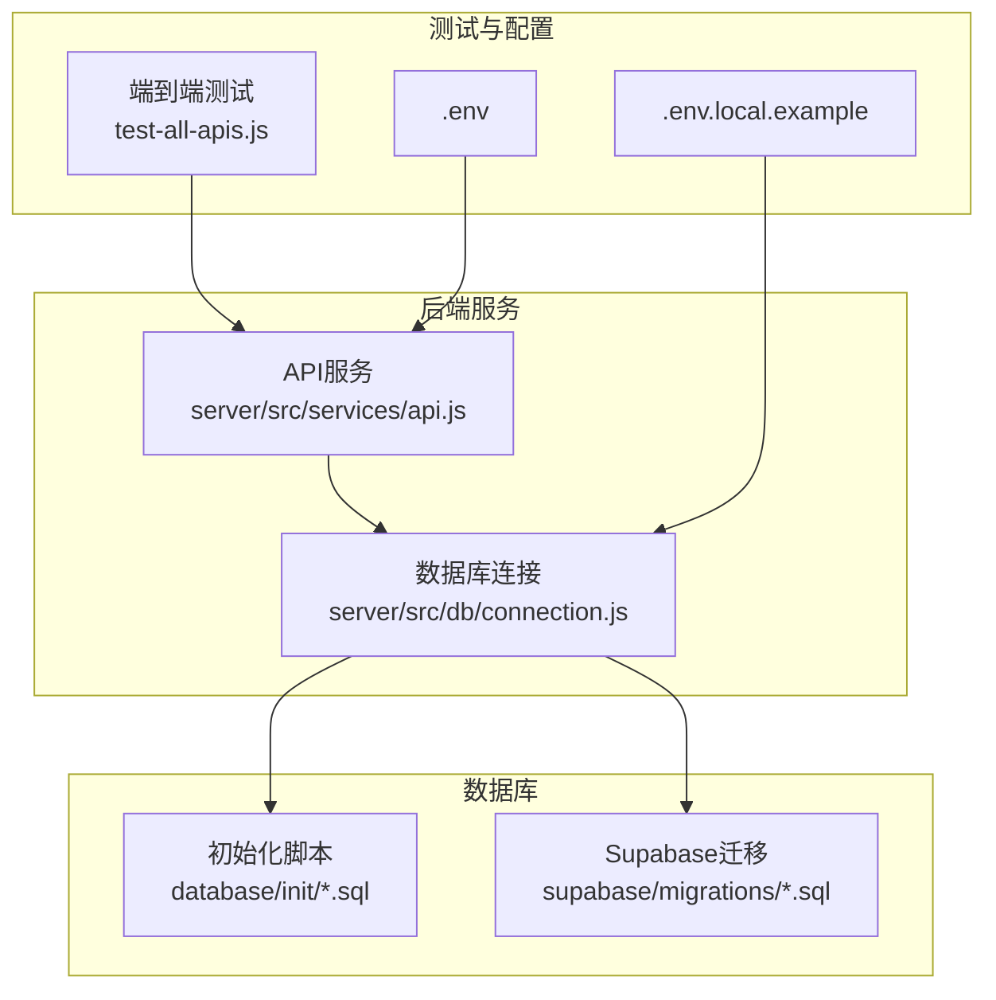
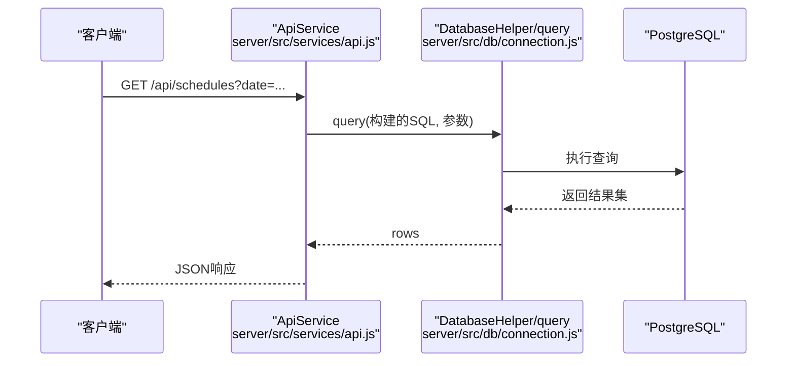
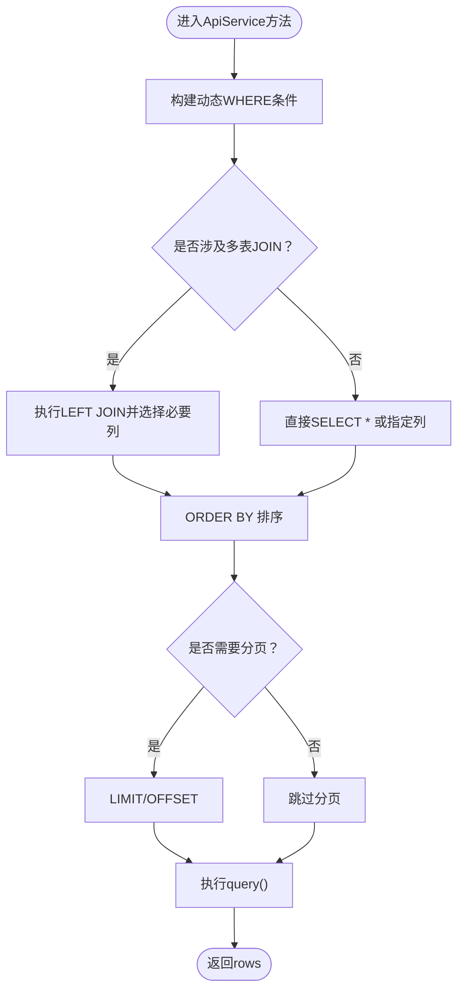
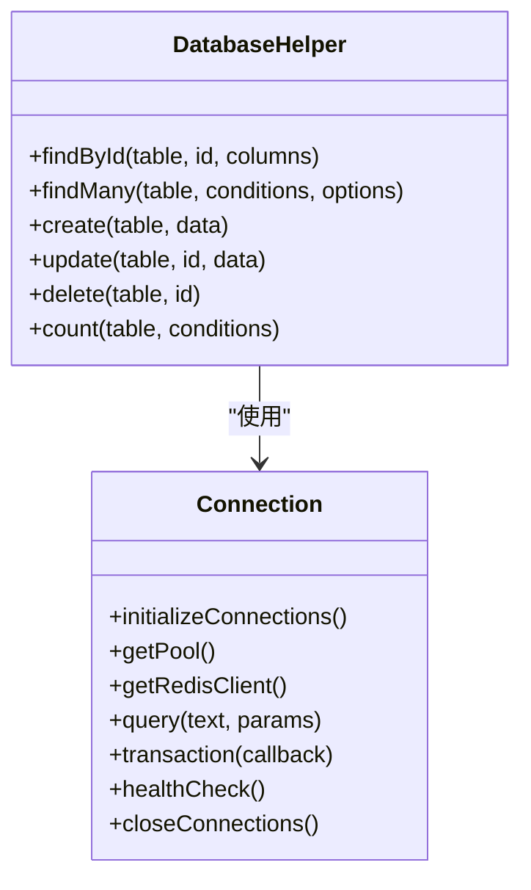
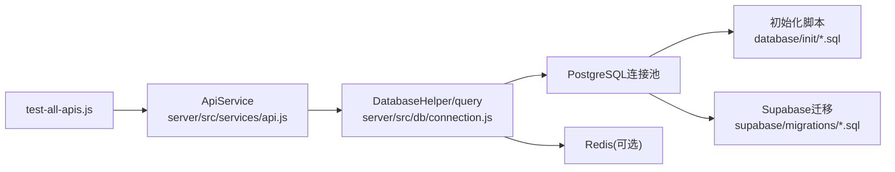

# 数据查询问题

<cite>
**本文引用的文件**
- [server/src/services/api.js](file://server/src/services/api.js)
- [server/src/db/connection.js](file://server/src/db/connection.js)
- [database/init/02-create-tables.sql](file://database/init/02-create-tables.sql)
- [database/init/04-dingtalk-sync-tables.sql](file://database/init/04-dingtalk-sync-tables.sql)
- [supabase/migrations/00002_create_resource_tables.sql](file://supabase/migrations/00002_create_resource_tables.sql)
- [supabase/migrations/00010_create_dingtalk_sync_tables.sql](file://supabase/migrations/00010_create_dingtalk_sync_tables.sql)
- [test-all-apis.js](file://test-all-apis.js)
- [database/migrate.sh](file://database/migrate.sh)
- [.env.local.example](file://.env.local.example)
- [.env](file://.env)
- [src/db/api.ts](file://src/db/api.ts)
</cite>

## 目录
1. [简介](#简介)
2. [项目结构](#项目结构)
3. [核心组件](#核心组件)
4. [架构总览](#架构总览)
5. [详细组件分析](#详细组件分析)
6. [依赖关系分析](#依赖关系分析)
7. [性能考量](#性能考量)
8. [故障排查指南](#故障排查指南)
9. [结论](#结论)
10. [附录](#附录)

## 简介
本文件聚焦于API服务中的数据查询问题，围绕数据库表缺失、查询性能瓶颈与复杂JOIN优化展开。通过对现有代码与数据库初始化脚本的分析，识别由数据库迁移未应用、表结构不匹配或查询语句未优化导致的查询失败风险；结合“系统配置功能Bug修复”文档中的修复方案，说明如何诊断与修复因缺少nurses、doctors、rooms等关键表引发的CRUD操作失败问题；并提供使用端到端测试脚本对API进行验证的方法，同时给出索引优化、查询缓存策略与分页处理的最佳实践建议。

## 项目结构
- 后端API服务位于 server/src，包含数据库连接池与查询封装，以及业务API服务层。
- 数据库初始化脚本位于 database/init，包含核心业务表与索引、以及钉钉同步相关表。
- Supabase迁移文件用于补充资源类表（nurses/doctors/rooms）与钉钉同步表。
- 端到端测试脚本 test-all-apis.js 提供对健康检查、服务、预约、排班、任务执行、仪表盘统计与资源可用性的自动化验证。
- 运行时环境变量配置位于 .env.local.example 与 .env，分别用于本地开发数据库与前端Supabase配置。

图表来源
- [server/src/services/api.js](file://server/src/services/api.js#L1-L374)
- [server/src/db/connection.js](file://server/src/db/connection.js#L1-L271)
- [database/init/02-create-tables.sql](file://database/init/02-create-tables.sql#L1-L274)
- [supabase/migrations/00002_create_resource_tables.sql](file://supabase/migrations/00002_create_resource_tables.sql#L1-L182)
- [test-all-apis.js](file://test-all-apis.js#L1-L98)
- [.env.local.example](file://.env.local.example#L1-L37)
- [.env](file://.env#L1-L13)

章节来源
- [server/src/services/api.js](file://server/src/services/api.js#L1-L374)
- [server/src/db/connection.js](file://server/src/db/connection.js#L1-L271)
- [database/init/02-create-tables.sql](file://database/init/02-create-tables.sql#L1-L274)
- [supabase/migrations/00002_create_resource_tables.sql](file://supabase/migrations/00002_create_resource_tables.sql#L1-L182)
- [test-all-apis.js](file://test-all-apis.js#L1-L98)
- [.env.local.example](file://.env.local.example#L1-L37)
- [.env](file://.env#L1-L13)

## 核心组件
- API服务层（ApiService）：封装CRUD与复杂查询，包括预约、排班、任务执行、资源可用性与统计等接口。
- 数据库连接层（DatabaseHelper/query/transaction）：统一连接池、查询执行、事务与健康检查。
- 初始化脚本与迁移：定义核心业务表、索引与触发器；补充资源表与钉钉同步表。
- 端到端测试：覆盖健康检查、服务、预约、排班、任务执行、仪表盘统计与资源可用性。

章节来源
- [server/src/services/api.js](file://server/src/services/api.js#L1-L374)
- [server/src/db/connection.js](file://server/src/db/connection.js#L1-L271)
- [database/init/02-create-tables.sql](file://database/init/02-create-tables.sql#L1-L274)
- [supabase/migrations/00002_create_resource_tables.sql](file://supabase/migrations/00002_create_resource_tables.sql#L1-L182)
- [test-all-apis.js](file://test-all-apis.js#L1-L98)

## 架构总览
后端API通过统一的数据库连接层访问PostgreSQL，业务查询集中在ApiService中，复杂查询涉及多表JOIN与动态WHERE构建。初始化脚本负责创建核心表与索引，Supabase迁移补充资源表与钉钉同步表。端到端测试脚本对关键API进行验证。

图表来源
- [server/src/services/api.js](file://server/src/services/api.js#L165-L231)
- [server/src/db/connection.js](file://server/src/db/connection.js#L80-L111)

## 详细组件分析

### ApiService中的查询与JOIN优化要点
- 预约查询（getAppointments）：支持多条件动态WHERE构建，排序基于请求日期与创建时间，避免全表扫描需配合索引。
- 排班查询（getSchedules）：LEFT JOIN appointments、resources、profiles、services，按日期与开始时间排序；过滤条件丰富，需确保相关列建立索引。
- 任务执行查询（getTaskExecutions）：LEFT JOIN schedules、appointments、profiles，按日期与开始时间排序；适合按schedule_id/nurse_id/status/date等维度过滤。
- 资源可用性（getResourceAvailability）：并行查询可用房间与可用护士，使用NOT EXISTS子查询判断冲突时间段。
- 统计查询（getDashboardStats）：多条COUNT查询，适合在对应列上建立索引以降低统计成本。

图表来源
- [server/src/services/api.js](file://server/src/services/api.js#L99-L146)
- [server/src/services/api.js](file://server/src/services/api.js#L166-L231)
- [server/src/services/api.js](file://server/src/services/api.js#L251-L289)
- [server/src/services/api.js](file://server/src/services/api.js#L305-L351)
- [server/src/services/api.js](file://server/src/services/api.js#L353-L370)

章节来源
- [server/src/services/api.js](file://server/src/services/api.js#L99-L146)
- [server/src/services/api.js](file://server/src/services/api.js#L166-L231)
- [server/src/services/api.js](file://server/src/services/api.js#L251-L289)
- [server/src/services/api.js](file://server/src/services/api.js#L305-L351)
- [server/src/services/api.js](file://server/src/services/api.js#L353-L370)

### 数据库连接与事务
- 连接池配置：最大连接数、空闲超时、连接超时等参数，保证并发与稳定性。
- query包装：统一记录执行时间与返回行数，便于性能监控与异常定位。
- transaction：显式BEGIN/COMMIT/ROLLBACK，确保一致性。
- healthCheck：检测PostgreSQL与Redis健康状态。

图表来源
- [server/src/db/connection.js](file://server/src/db/connection.js#L1-L271)

章节来源
- [server/src/db/connection.js](file://server/src/db/connection.js#L1-L271)

### 表结构与索引现状
- 核心业务表：profiles、services、resources、appointments、schedules、task_executions、user_sessions、dingtalk_*系列表。
- 索引覆盖：profiles、services、resources、appointments、schedules、task_executions、dingtalk_*等常见查询字段均建立了索引。
- 资源表（nurses/doctors/rooms）：Supabase迁移文件中定义，包含RLS策略与索引；当前仓库未见同名表，可能仍需应用迁移。

章节来源
- [database/init/02-create-tables.sql](file://database/init/02-create-tables.sql#L1-L274)
- [database/init/04-dingtalk-sync-tables.sql](file://database/init/04-dingtalk-sync-tables.sql#L1-L131)
- [supabase/migrations/00002_create_resource_tables.sql](file://supabase/migrations/00002_create_resource_tables.sql#L1-L182)
- [supabase/migrations/00010_create_dingtalk_sync_tables.sql](file://supabase/migrations/00010_create_dingtalk_sync_tables.sql#L1-L189)

### 端到端API测试方法
- 测试脚本覆盖：健康检查、服务、预约、用户、资源、排班、任务执行、仪表盘统计、资源可用性。
- 预约创建：构造POST请求体，包含客户信息、服务ID、日期与时间段等字段。
- 输出：统计通过/失败数量与成功率，便于快速定位问题。

章节来源
- [test-all-apis.js](file://test-all-apis.js#L1-L98)

### 与“系统配置功能Bug修复”的关联
- 问题现象：系统配置页面添加/编辑/删除护士、医生、房间时提示“操作失败”。
- 根本原因：前端调用 nurses/doctors/rooms 表，但数据库中未创建这些表。
- 修复方案：应用Supabase迁移文件创建nurses/doctors/rooms表，建立索引与RLS策略，并验证初始数据。
- 影响范围：系统配置页面的所有CRUD操作。

章节来源
- [BUGFIX_SYSTEM_CONFIG.md](file://BUGFIX_SYSTEM_CONFIG.md#L1-L550)
- [supabase/migrations/00002_create_resource_tables.sql](file://supabase/migrations/00002_create_resource_tables.sql#L1-L182)

## 依赖关系分析
- ApiService依赖DatabaseHelper与query，间接依赖PostgreSQL。
- DatabaseHelper依赖连接池与Redis客户端（可选）。
- 初始化脚本与Supabase迁移共同决定数据库结构与索引。
- 端到端测试脚本依赖API服务与数据库状态。

图表来源
- [server/src/services/api.js](file://server/src/services/api.js#L1-L374)
- [server/src/db/connection.js](file://server/src/db/connection.js#L1-L271)
- [database/init/02-create-tables.sql](file://database/init/02-create-tables.sql#L1-L274)
- [supabase/migrations/00002_create_resource_tables.sql](file://supabase/migrations/00002_create_resource_tables.sql#L1-L182)
- [test-all-apis.js](file://test-all-apis.js#L1-L98)

章节来源
- [server/src/services/api.js](file://server/src/services/api.js#L1-L374)
- [server/src/db/connection.js](file://server/src/db/connection.js#L1-L271)
- [database/init/02-create-tables.sql](file://database/init/02-create-tables.sql#L1-L274)
- [supabase/migrations/00002_create_resource_tables.sql](file://supabase/migrations/00002_create_resource_tables.sql#L1-L182)
- [test-all-apis.js](file://test-all-apis.js#L1-L98)

## 性能考量
- 索引优化建议
  - 预约查询：为 requested_date、status、sales_id、doctor_id、service_id、is_urgent 建立复合或单列索引，减少排序与过滤成本。
  - 排班查询：为 scheduled_date、room_id、nurse_id、status 建立索引；若频繁按日期范围查询，考虑覆盖索引。
  - 任务执行查询：为 schedule_id、nurse_id、status 建立索引；日期范围查询可利用索引。
  - 资源可用性：为 profiles(role/status)、resources(type/status/is_active) 建立索引，提升NOT EXISTS子查询效率。
  - 用户会话：为 user_sessions(user_id/token_hash/expire) 建立索引，提高登录与会话校验性能。
- 查询缓存策略
  - 对高频读取且相对稳定的列表（如服务、资源、用户角色列表）可采用Redis缓存，设置合理TTL与失效策略。
  - 对统计类查询（仪表盘）可缓存短期聚合结果，结合定时刷新。
  - 注意缓存穿透与热点键问题，必要时引入布隆过滤器与限流。
- 分页处理最佳实践
  - 使用LIMIT与OFFSET实现分页，或采用游标分页（基于时间戳或主键）以避免深度偏移带来的性能问题。
  - 为分页字段建立索引（如created_at、id），确保排序与过滤高效。
  - 控制每页大小上限，避免一次性返回过多数据。
- 复杂JOIN优化
  - 明确选择必要列，避免SELECT *。
  - 优先使用INNER JOIN替代LEFT JOIN，除非必须保留无匹配记录。
  - 将过滤条件下推至JOIN前，减少中间结果集规模。
  - 对大表JOIN时，确保连接键有索引；必要时拆分查询或使用物化视图。

[本节为通用性能指导，不直接分析具体文件，故无章节来源]

## 故障排查指南
- 数据库表缺失
  - 症状：系统配置页面新增/编辑/删除护士/医生/房间失败。
  - 诊断：确认nurses/doctors/rooms表是否存在；检查Supabase迁移是否已应用。
  - 修复：应用Supabase迁移文件创建表并验证索引与RLS策略。
- 查询失败与慢查询
  - 症状：GET /api/schedules、GET /api/appointments等接口响应缓慢或报错。
  - 诊断：检查相关列是否具备索引；确认WHERE条件与排序字段是否命中索引。
  - 修复：为常用过滤与排序列建立索引；优化复杂JOIN与子查询。
- 端到端测试验证
  - 使用 test-all-apis.js 对关键API进行验证，观察通过/失败数量与错误信息。
  - 若失败，结合后端日志与数据库连接状态（healthCheck）定位问题。
- 数据库初始化与迁移
  - 使用 database/migrate.sh 的 init/backup/restore/reset/status 命令管理数据库。
  - 确认 .env.local.example 中的数据库连接参数与 .env 中的前端Supabase配置分离。

章节来源
- [BUGFIX_SYSTEM_CONFIG.md](file://BUGFIX_SYSTEM_CONFIG.md#L1-L550)
- [server/src/services/api.js](file://server/src/services/api.js#L166-L231)
- [server/src/db/connection.js](file://server/src/db/connection.js#L112-L141)
- [test-all-apis.js](file://test-all-apis.js#L1-L98)
- [database/migrate.sh](file://database/migrate.sh#L1-L233)
- [.env.local.example](file://.env.local.example#L1-L37)
- [.env](file://.env#L1-L13)

## 结论
- 数据查询问题的核心在于数据库结构与索引是否与查询模式匹配。通过应用Supabase迁移补齐nurses/doctors/rooms等关键表，可彻底解决系统配置页面的CRUD失败问题。
- ApiService中的动态WHERE与复杂JOIN需要配合索引与分页策略，才能在高并发与大数据量场景下保持稳定性能。
- 借助端到端测试脚本与数据库迁移工具，可快速验证修复效果并维持数据库健康状态。

[本节为总结性内容，不直接分析具体文件，故无章节来源]

## 附录
- 端到端测试脚本路径：[test-all-apis.js](file://test-all-apis.js#L1-L98)
- API服务方法路径（示例）：
  - [getAppointments](file://server/src/services/api.js#L99-L146)
  - [getSchedules](file://server/src/services/api.js#L166-L231)
  - [getTaskExecutions](file://server/src/services/api.js#L251-L289)
  - [getResourceAvailability](file://server/src/services/api.js#L305-L351)
  - [getDashboardStats](file://server/src/services/api.js#L353-L370)
- 数据库初始化与迁移：
  - [database/init/02-create-tables.sql](file://database/init/02-create-tables.sql#L1-L274)
  - [database/init/04-dingtalk-sync-tables.sql](file://database/init/04-dingtalk-sync-tables.sql#L1-L131)
  - [supabase/migrations/00002_create_resource_tables.sql](file://supabase/migrations/00002_create_resource_tables.sql#L1-L182)
  - [supabase/migrations/00010_create_dingtalk_sync_tables.sql](file://supabase/migrations/00010_create_dingtalk_sync_tables.sql#L1-L189)
  - [database/migrate.sh](file://database/migrate.sh#L1-L233)
- 环境配置：
  - [.env.local.example](file://.env.local.example#L1-L37)
  - [.env](file://.env#L1-L13)
- 前端API封装（供对照理解）：
  - [src/db/api.ts](file://src/db/api.ts#L587-L743)