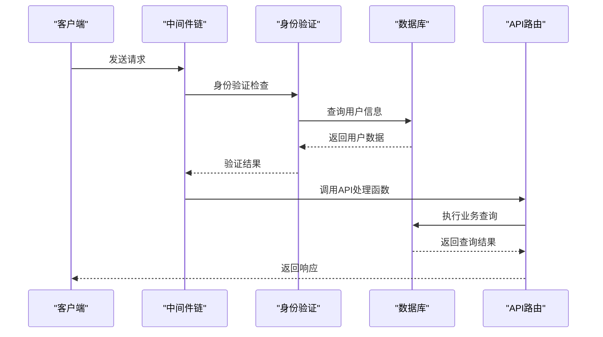
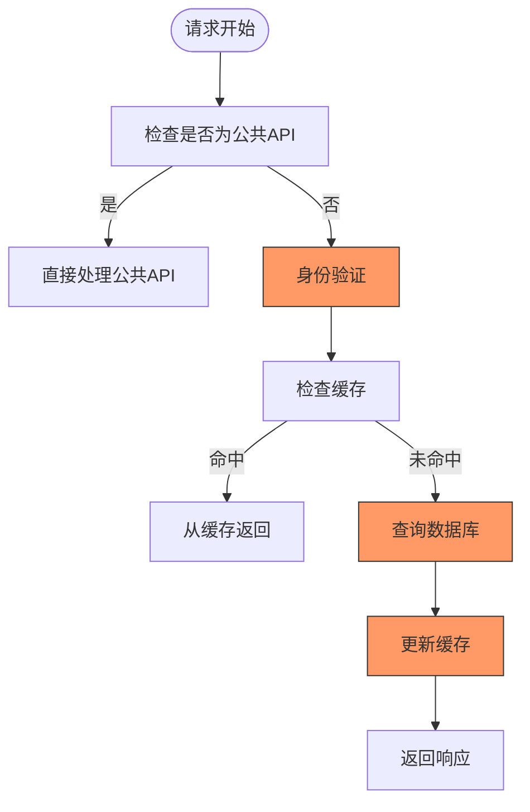
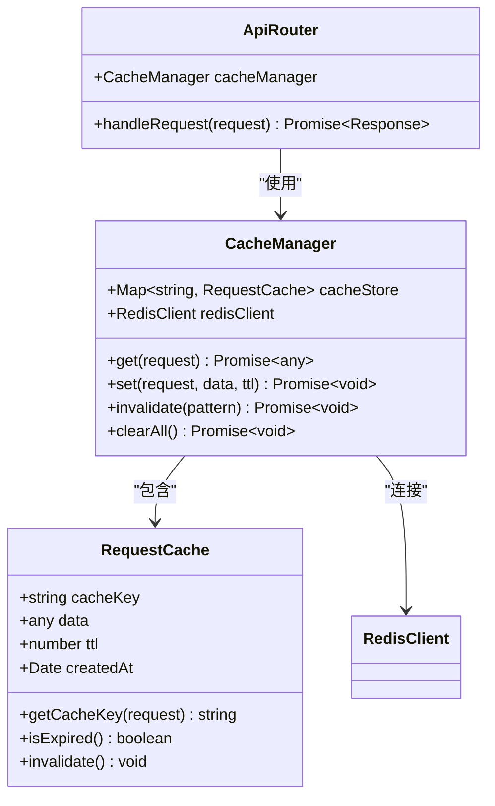
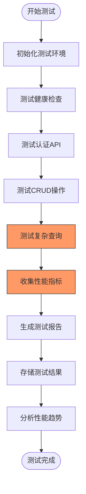
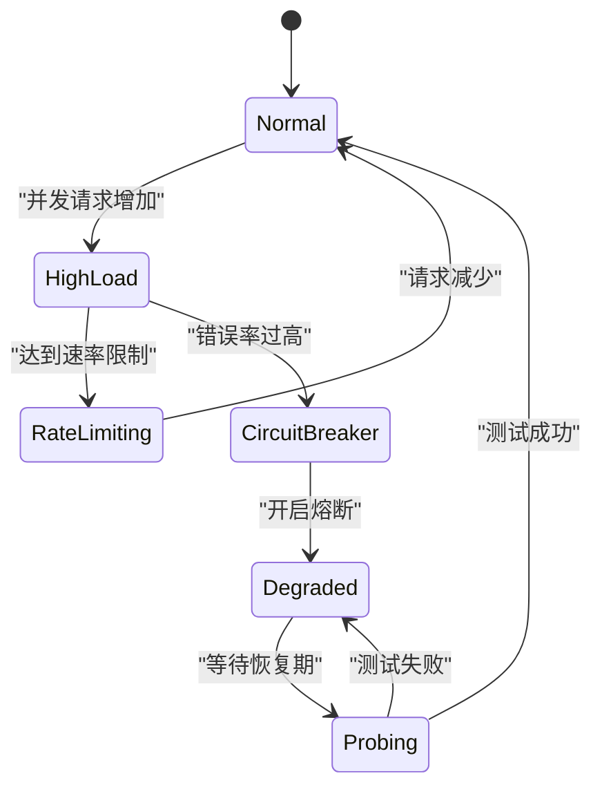
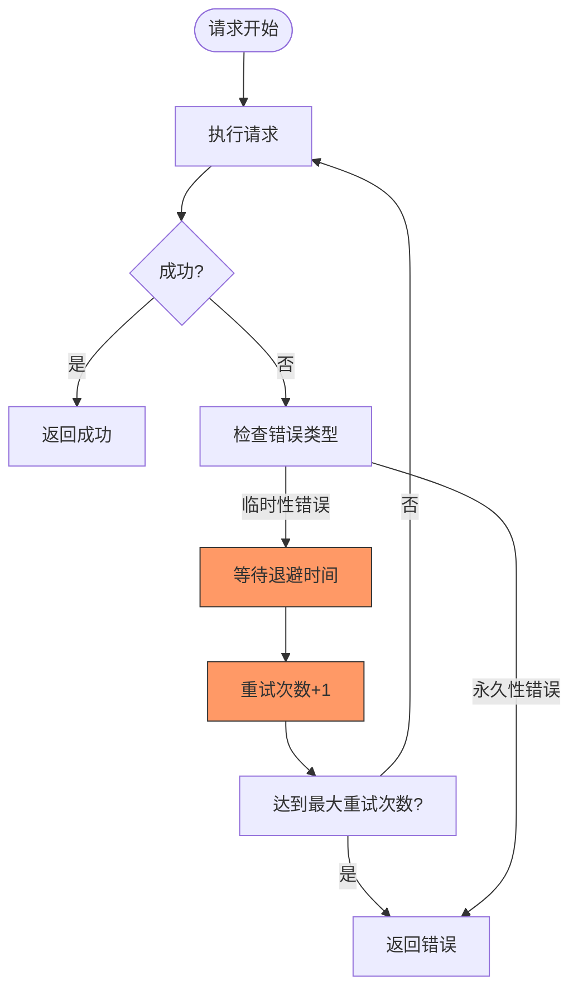

# 路由性能问题

<cite>
**本文档引用的文件**   
- [api.js](file://server/src/services/api.js)
- [api-server.ts](file://server/api-server.ts)
- [connection.js](file://server/src/db/connection.js)
- [test-all-apis.js](file://test-all-apis.js)
- [登录问题修复总结.md](file://登录问题修复总结.md)
</cite>

## 目录
1. [简介](#简介)
2. [路由性能问题分析](#路由性能问题分析)
3. [性能瓶颈识别](#性能瓶颈识别)
4. [中间件优化策略](#中间件优化策略)
5. [请求缓存机制](#请求缓存机制)
6. [API监控与测试](#api监控与测试)
7. [负载测试与限流策略](#负载测试与限流策略)
8. [错误重试机制](#错误重试机制)
9. [结论](#结论)

## 简介
本文档深入分析API服务中的路由性能问题，重点关注请求响应延迟、中间件阻塞和高并发场景下的超时等问题。通过分析Express.js路由处理顺序、异步处理机制和日志记录开销，结合登录问题修复经验，提出性能优化方案。文档还介绍了如何通过添加请求缓存、减少不必要的API调用和优化中间件执行链来提升路由性能。

**Section sources**
- [api-server.ts](file://server/api-server.ts#L1-L50)
- [api.js](file://server/src/services/api.js#L1-L50)

## 路由性能问题分析
在当前的API服务架构中，路由性能问题主要体现在请求响应延迟、中间件阻塞和高并发场景下的超时。这些问题的根本原因包括Express.js路由处理顺序不当、未合理使用异步处理以及日志记录过载。

通过分析`api-server.ts`文件，我们发现所有API路由都使用了`authenticateToken`中间件进行身份验证。这个中间件在每次请求时都会查询数据库验证JWT令牌，导致了显著的性能开销。此外，数据库查询操作没有适当的索引优化，导致复杂查询的执行时间过长。



**Diagram sources**
- [api-server.ts](file://server/api-server.ts#L118-L150)
- [auth.js](file://server/src/services/auth.js#L64-L82)

**Section sources**
- [api-server.ts](file://server/api-server.ts#L1-L200)
- [auth.js](file://server/src/services/auth.js#L1-L100)

## 性能瓶颈识别
通过对代码库的分析，我们识别出以下几个主要的性能瓶颈：

1. **数据库查询效率低下**：在`connection.js`文件中，`query`函数虽然记录了执行时间，但没有实现查询缓存机制。对于频繁访问的静态数据，每次都重新查询数据库，造成了不必要的性能开销。

2. **中间件执行链过长**：当前的中间件执行链包含了多个同步操作，特别是在身份验证过程中，需要连续执行多个数据库查询，导致请求处理时间延长。

3. **缺乏超时保护机制**：在高并发场景下，长时间运行的查询可能导致服务器资源耗尽，影响其他正常请求的处理。

4. **日志记录过载**：每个数据库查询都会生成日志记录，当系统负载较高时，日志写入操作本身也会成为性能瓶颈。

```mermaid
flowchart TD
Start([请求开始]) --> Authenticate["身份验证"]
Authenticate --> CheckToken["验证JWT令牌"]
CheckToken --> QueryUser["查询用户信息"]
QueryUser --> Authorize["权限检查"]
Authorize --> ProcessAPI["处理API请求"]
ProcessAPI --> QueryDB["执行业务查询"]
QueryDB --> Transform["数据转换"]
Transform --> LogQuery["记录查询日志"]
LogQuery --> ReturnResponse["返回响应"]
style QueryDB fill:#f9f,stroke:#333
style LogQuery fill:#f9f,stroke:#333
Note over QueryDB,LogQuery: 这些步骤是主要性能瓶颈
```

**Diagram sources**
- [connection.js](file://server/src/db/connection.js#L80-L90)
- [api-server.ts](file://server/api-server.ts#L118-L150)

**Section sources**
- [connection.js](file://server/src/db/connection.js#L1-L100)
- [api.js](file://server/src/services/api.js#L1-L100)

## 中间件优化策略
基于`登录问题修复总结.md`中的超时保护机制，我们可以实施以下中间件优化策略：

1. **引入请求超时机制**：为每个API请求设置合理的超时时间，防止长时间运行的查询阻塞服务器资源。

2. **优化中间件执行顺序**：将轻量级的中间件（如CORS检查）放在前面，重量级的中间件（如身份验证）放在后面，减少不必要的处理开销。

3. **实现中间件短路**：对于不需要身份验证的公共API，直接跳过身份验证中间件，提高处理效率。

4. **批量处理相似请求**：对于频繁访问的API端点，可以实现请求合并机制，将多个相似请求合并为一个数据库查询。



**Diagram sources**
- [api-server.ts](file://server/api-server.ts#L118-L150)
- [登录问题修复总结.md](file://登录问题修复总结.md#L1-L50)

**Section sources**
- [api-server.ts](file://server/api-server.ts#L1-L300)
- [登录问题修复总结.md](file://登录问题修复总结.md#L1-L100)

## 请求缓存机制
为了提升路由性能，我们需要实现有效的请求缓存机制。通过分析`connection.js`文件中的数据库连接配置，我们可以利用Redis作为缓存层。

1. **缓存策略设计**：
   - 对于读取频繁但更新较少的数据（如服务列表、资源列表），设置较长的缓存时间（如5分钟）
   - 对于用户相关的数据，根据用户会话设置较短的缓存时间（如1分钟）
   - 对于实时性要求高的数据，不使用缓存或设置极短的缓存时间

2. **缓存键设计**：
   - 使用请求URL和查询参数的哈希值作为缓存键
   - 对于分页数据，将页码和每页大小纳入缓存键
   - 对于用户相关数据，将用户ID纳入缓存键

3. **缓存失效机制**：
   - 数据更新时主动清除相关缓存
   - 设置合理的TTL（Time To Live）避免缓存雪崩
   - 实现缓存预热机制，在系统启动时预先加载常用数据



**Diagram sources**
- [connection.js](file://server/src/db/connection.js#L24-L29)
- [api.js](file://server/src/services/api.js#L50-L55)

**Section sources**
- [connection.js](file://server/src/db/connection.js#L1-L50)
- [api.js](file://server/src/services/api.js#L1-L100)

## API监控与测试
为了确保路由性能优化的效果，我们需要建立完善的API监控和测试机制。`test-all-apis.js`文件提供了一个全面的API测试脚本，我们可以在此基础上进行扩展。

1. **监控指标**：
   - 每个端点的平均响应时间
   - 请求成功率
   - 并发处理能力
   - 数据库查询执行时间

2. **测试方法**：
   - 使用`test-all-apis.js`脚本定期运行全面的API测试
   - 记录每个端点的响应时间，建立性能基线
   - 在代码变更后重新运行测试，对比性能变化

3. **性能测试脚本优化**：
   - 添加响应时间记录功能
   - 实现测试结果的持久化存储
   - 提供性能趋势分析功能



**Diagram sources**
- [test-all-apis.js](file://test-all-apis.js#L1-L98)
- [api-server.ts](file://server/api-server.ts#L39-L54)

**Section sources**
- [test-all-apis.js](file://test-all-apis.js#L1-L100)
- [api-server.ts](file://server/api-server.ts#L1-L100)

## 负载测试与限流策略
为了应对高并发场景，我们需要实施负载测试和限流策略。

1. **负载测试方案**：
   - 使用工具模拟高并发请求
   - 逐步增加并发用户数，观察系统性能变化
   - 记录系统在不同负载下的表现

2. **限流策略配置**：
   - 基于IP地址的请求频率限制
   - 基于用户身份的请求配额
   - 全局请求速率限制

3. **熔断机制**：
   - 当错误率超过阈值时自动开启熔断
   - 熔断期间返回预定义的降级响应
   - 定期尝试恢复服务



**Diagram sources**
- [api-server.ts](file://server/api-server.ts#L11-L15)
- [connection.js](file://server/src/db/connection.js#L14-L23)

**Section sources**
- [api-server.ts](file://server/api-server.ts#L1-L50)
- [connection.js](file://server/src/db/connection.js#L1-L50)

## 错误重试机制
为了提高系统的可靠性，我们需要实现智能的错误重试机制。

1. **重试策略**：
   - 对于临时性错误（如网络超时、数据库连接失败），实施指数退避重试
   - 对于永久性错误（如参数错误、权限不足），不进行重试
   - 设置最大重试次数，避免无限循环

2. **重试上下文管理**：
   - 记录重试次数和间隔时间
   - 保持请求上下文的一致性
   - 避免重复处理导致的数据不一致

3. **监控与告警**：
   - 记录重试事件和原因
   - 当重试次数超过阈值时触发告警
   - 分析重试模式，优化系统性能



**Diagram sources**
- [api-server.ts](file://server/api-server.ts#L28-L35)
- [auth.js](file://server/src/services/auth.js#L64-L82)

**Section sources**
- [api-server.ts](file://server/api-server.ts#L1-L100)
- [auth.js](file://server/src/services/auth.js#L1-L100)

## 结论
通过对API服务的路由性能问题进行深入分析，我们识别了主要的性能瓶颈，并提出了相应的优化策略。通过实施请求缓存、优化中间件执行链、建立完善的监控测试机制，以及配置合理的限流和重试策略，可以显著提升系统的性能和可靠性。

关键优化措施包括：
1. 实现Redis缓存机制，减少数据库查询次数
2. 优化中间件执行顺序，减少不必要的处理开销
3. 建立全面的API监控和测试体系
4. 配置合理的限流和熔断策略
5. 实施智能的错误重试机制

这些优化措施将有效解决请求响应延迟、中间件阻塞和高并发超时等问题，提升用户体验和系统稳定性。