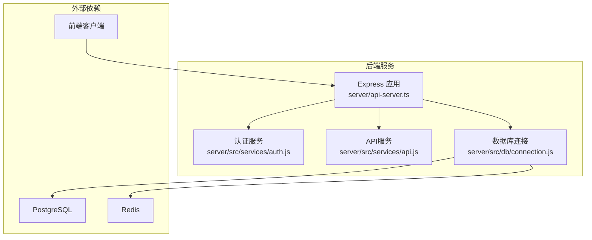
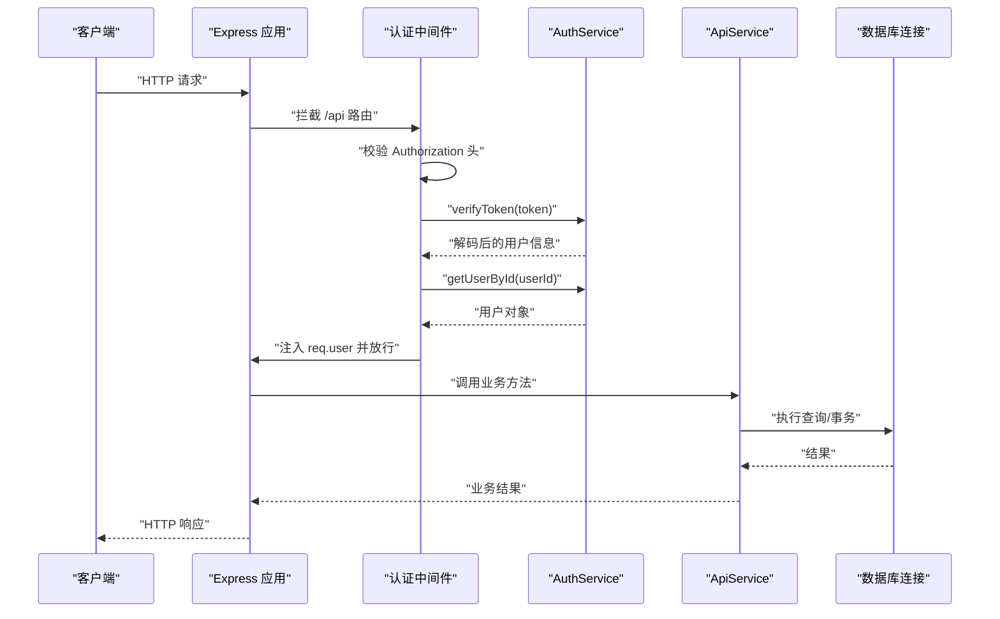
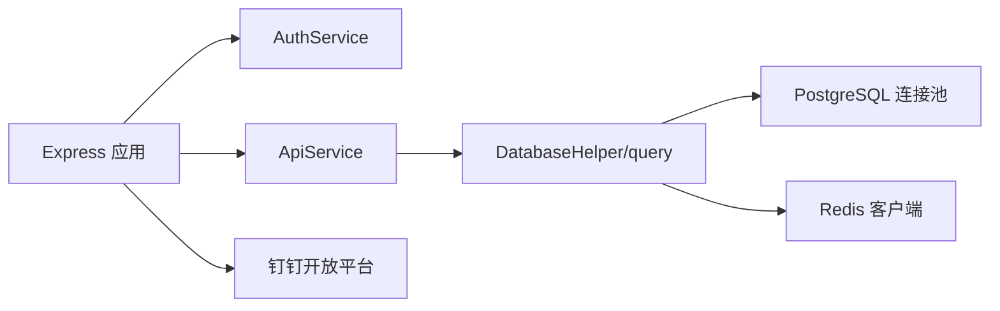

# 后端问题

<cite>
**本文引用的文件**
- [server/api-server.ts](file://server/api-server.ts)
- [server/server/server/api-server.js](file://server/server/server/api-server.js)
- [server/src/services/api.js](file://server/src/services/api.js)
- [server/src/services/auth.js](file://server/src/services/auth.js)
- [server/src/db/connection.js](file://server/src/db/connection.js)
- [test-all-apis.js](file://test-all-apis.js)
- [API服务器重启指南.md](file://API服务器重启指南.md)
- [DEPLOYMENT_GUIDE.md](file://DEPLOYMENT_GUIDE.md)
- [AUTH_TESTING_GUIDE.md](file://AUTH_TESTING_GUIDE.md)
- [AUTH_IMPLEMENTATION_SUMMARY.md](file://AUTH_IMPLEMENTATION_SUMMARY.md)
- [BUGFIX_SYSTEM_CONFIG.md](file://BUGFIX_SYSTEM_CONFIG.md)
</cite>

## 目录
1. [简介](#简介)
2. [项目结构](#项目结构)
3. [核心组件](#核心组件)
4. [架构总览](#架构总览)
5. [详细组件分析](#详细组件分析)
6. [依赖关系分析](#依赖关系分析)
7. [性能考虑](#性能考虑)
8. [故障排除指南](#故障排除指南)
9. [结论](#结论)
10. [附录](#附录)

## 简介
本文件面向后端服务的故障排除与运维，聚焦以下问题域：
- 系统配置更新失败（如“护士/医生/房间”新增/编辑/删除失败）
- API响应超时与路由加载异常（如404未找到新端点）
- 认证流程中断（如JWT令牌验证失败、中间件逻辑缺陷）
- 配置加载顺序错误、环境变量未正确注入导致的服务异常
- Express.js路由处理异常、JWT令牌验证失败、服务间通信问题
- 日志分析方法、API测试脚本使用、性能瓶颈识别与优化建议（数据库查询与中间件执行顺序）

本指南结合仓库中的实现与修复文档，提供可操作的诊断步骤、定位方法与优化建议，帮助快速恢复服务稳定性。

## 项目结构
后端服务采用Express.js + TypeScript/JavaScript混合实现，核心目录与职责如下：
- server/api-server.ts：Express应用入口，负责中间件、路由、认证中间件、错误处理与健康检查
- server/src/services：业务服务层，封装数据库API与认证逻辑
- server/src/db：数据库连接与事务封装，提供连接池、Redis客户端、健康检查与基础CRUD助手
- test-all-apis.js：端到端API测试脚本，用于快速验证服务可用性
- 文档类文件：API服务器重启指南、部署指南、认证测试指南、认证实现总结、系统配置修复说明等

图表来源
- [server/api-server.ts](file://server/api-server.ts#L1-L120)
- [server/src/services/auth.js](file://server/src/services/auth.js#L1-L120)
- [server/src/services/api.js](file://server/src/services/api.js#L1-L120)
- [server/src/db/connection.js](file://server/src/db/connection.js#L1-L120)

章节来源
- [server/api-server.ts](file://server/api-server.ts#L1-L120)
- [server/src/db/connection.js](file://server/src/db/connection.js#L1-L120)

## 核心组件
- Express应用与中间件
  - CORS与JSON解析中间件
  - 全局错误处理中间件
  - 健康检查端点
- 认证中间件
  - Bearer Token校验、用户存在性校验、请求对象注入用户信息
- 认证服务
  - JWT签发/刷新、密码哈希/比对、用户查询与权限矩阵
- API服务
  - profiles/services/resources/appointments/schedules/task_executions等CRUD封装
  - 资源可用性查询、仪表盘统计
- 数据库连接
  - PostgreSQL连接池、Redis客户端、事务、健康检查、查询日志

章节来源
- [server/api-server.ts](file://server/api-server.ts#L1-L120)
- [server/src/services/auth.js](file://server/src/services/auth.js#L1-L120)
- [server/src/services/api.js](file://server/src/services/api.js#L1-L120)
- [server/src/db/connection.js](file://server/src/db/connection.js#L1-L120)

## 架构总览
下图展示了认证中间件、路由与服务层之间的交互关系，以及数据库与缓存的依赖。

图表来源
- [server/api-server.ts](file://server/api-server.ts#L118-L171)
- [server/src/services/auth.js](file://server/src/services/auth.js#L60-L120)
- [server/src/services/api.js](file://server/src/services/api.js#L1-L120)
- [server/src/db/connection.js](file://server/src/db/connection.js#L77-L120)

## 详细组件分析

### Express 路由与中间件
- 中间件链路
  - CORS与JSON解析
  - 全局错误处理
  - 认证中间件：统一拦截 /api 路由，校验Authorization头，解码JWT，注入用户信息
- 健康检查
  - /api/health：返回服务与数据库健康状态
- 认证端点
  - /api/auth/login、/api/auth/register、/api/auth/refresh、/api/auth/logout
- 业务端点
  - /api/profiles、/api/services、/api/resources、/api/appointments、/api/schedules、/api/task-executions、/api/dashboard/stats、/api/resources/availability
  - 系统配置相关：/api/nurses、/api/doctors、/api/rooms
  - 钉钉集成：/api/dingtalk/config、/api/dingtalk/sync

章节来源
- [server/api-server.ts](file://server/api-server.ts#L1-L120)
- [server/api-server.ts](file://server/api-server.ts#L118-L171)
- [server/api-server.ts](file://server/api-server.ts#L150-L475)
- [server/server/server/api-server.js](file://server/server/server/api-server.js#L73-L201)

### 认证中间件与JWT验证
- 认证中间件逻辑要点
  - 校验Authorization头格式
  - 提取Bearer Token并调用AuthService.verifyToken
  - 通过用户ID查询用户是否存在
  - 将用户信息注入req.user，继续后续路由
- AuthService.verifyToken
  - 使用JWT_SECRET与过期时间配置进行签名验证
  - 捕获TokenExpiredError/JsonWebTokenError并抛出明确错误
- 常见问题
  - 未携带Authorization头或格式不正确
  - JWT_SECRET未正确注入（import.meta.env）
  - 用户被禁用或不存在
  - Token过期

章节来源
- [server/api-server.ts](file://server/api-server.ts#L118-L171)
- [server/src/services/auth.js](file://server/src/services/auth.js#L60-L120)
- [server/src/db/connection.js](file://server/src/db/connection.js#L1-L60)

### API服务层（CRUD与查询）
- ApiService
  - 提供profiles/services/resources/appointments/schedules/task_executions等CRUD方法
  - 使用DatabaseHelper与原生query执行SQL
  - 资源可用性查询与仪表盘统计
- 关键点
  - 动态WHERE构建与参数化查询
  - 返回数据时过滤敏感字段（如password_hash）
  - 并发查询与统计聚合

章节来源
- [server/src/services/api.js](file://server/src/services/api.js#L1-L120)
- [server/src/services/api.js](file://server/src/services/api.js#L120-L240)
- [server/src/services/api.js](file://server/src/services/api.js#L240-L374)

### 数据库连接与事务
- DatabaseHelper
  - findById/findMany/create/update/delete/count等通用CRUD
  - 参数化查询，避免SQL注入
- 连接池与Redis
  - 默认连接池大小、空闲超时、连接超时
  - Redis连接失败时降级运行，不影响核心功能
- 健康检查
  - PostgreSQL与Redis分别ping/SELECT 1检测连通性

章节来源
- [server/src/db/connection.js](file://server/src/db/connection.js#L1-L120)
- [server/src/db/connection.js](file://server/src/db/connection.js#L120-L200)
- [server/src/db/connection.js](file://server/src/db/connection.js#L200-L271)

### 钉钉同步与服务间通信
- 钉钉配置与同步
  - 配置端点：/api/dingtalk/config（仅super_admin）
  - 同步端点：/api/dingtalk/sync（仅super_admin）
  - 步骤：获取access_token -> 获取部门列表 -> 同步部门映射 -> 分页拉取用户 -> 冲突策略处理 -> 写入profiles并记录日志
- 服务间通信
  - 通过HTTP调用钉钉开放平台接口
  - 严格的身份校验与权限控制

章节来源
- [server/api-server.ts](file://server/api-server.ts#L477-L800)
- [server/server/server/api-server.js](file://server/server/server/api-server.js#L479-L620)

## 依赖关系分析
- 组件耦合
  - Express应用依赖AuthService与ApiService
  - ApiService依赖DatabaseHelper与query
  - DatabaseHelper依赖连接池与Redis客户端
- 外部依赖
  - PostgreSQL：核心数据存储
  - Redis：会话与缓存（可选）
  - 钉钉开放平台：服务间通信

图表来源
- [server/api-server.ts](file://server/api-server.ts#L1-L120)
- [server/src/services/auth.js](file://server/src/services/auth.js#L1-L120)
- [server/src/services/api.js](file://server/src/services/api.js#L1-L120)
- [server/src/db/connection.js](file://server/src/db/connection.js#L1-L120)

章节来源
- [server/api-server.ts](file://server/api-server.ts#L1-L120)
- [server/src/db/connection.js](file://server/src/db/connection.js#L1-L120)

## 性能考虑
- 数据库连接池
  - 默认最大连接数、空闲超时、连接超时，可根据并发与负载调整
- 查询优化
  - ApiService中多处使用参数化查询与LIMIT/OFFSET，建议为高频查询建立索引
  - 资源可用性查询涉及多表联结与EXISTS子查询，建议评估索引与分区策略
- 中间件执行顺序
  - 认证中间件位于路由之前，确保所有受保护路由均经过鉴权
  - 建议将耗时的业务逻辑置于路由内部，避免在中间件中执行阻塞操作
- 缓存与降级
  - Redis连接失败时降级运行，建议在关键路径增加缓存与熔断策略

章节来源
- [DEPLOYMENT_GUIDE.md](file://DEPLOYMENT_GUIDE.md#L171-L196)
- [server/src/services/api.js](file://server/src/services/api.js#L300-L374)
- [server/src/db/connection.js](file://server/src/db/connection.js#L1-L60)

## 故障排除指南

### 一、系统配置更新失败（如“护士/医生/房间”CRUD）
- 现象
  - 系统配置页面新增/编辑/删除护士/医生/房间时报错“操作失败”
- 根因与修复
  - 前端已实现相关CRUD，但数据库缺少nurses/doctors/rooms表，导致所有数据库操作失败
  - 修复方案：创建并应用数据库迁移，创建上述三张表并配置RLS策略与初始数据
- 诊断步骤
  - 确认数据库中是否存在nurses/doctors/rooms表
  - 使用数据库客户端查询表数量与结构
  - 重新部署迁移后，再次测试CRUD
- 参考文档
  - 系统配置功能Bug修复说明

章节来源
- [BUGFIX_SYSTEM_CONFIG.md](file://BUGFIX_SYSTEM_CONFIG.md#L1-L120)
- [BUGFIX_SYSTEM_CONFIG.md](file://BUGFIX_SYSTEM_CONFIG.md#L120-L220)
- [BUGFIX_SYSTEM_CONFIG.md](file://BUGFIX_SYSTEM_CONFIG.md#L220-L360)

### 二、API响应超时与路由加载异常（404）
- 现象
  - 访问新端点返回404，或健康检查/用户列表等端点无响应
- 根因与修复
  - 服务器未加载新路由或进程未重启
  - 修复方案：重启API服务器，确保新路由生效；查看日志定位端口占用或数据库连接失败
- 诊断步骤
  - 使用重启指南脚本或手动停止旧进程、启动新进程
  - 健康检查：curl http://localhost:3001/api/health
  - 端点验证：curl http://localhost:3001/api/users
  - 查看日志：tail -50 /tmp/api-server.log
- 参考文档
  - API服务器重启指南

章节来源
- [API服务器重启指南.md](file://API服务器重启指南.md#L1-L120)
- [API服务器重启指南.md](file://API服务器重启指南.md#L120-L178)

### 三、认证流程中断（JWT令牌验证失败）
- 现象
  - 登录成功但访问受保护路由返回401
  - 刷新Token失败
- 根因与修复
  - Authorization头格式不正确（缺少Bearer前缀）
  - JWT_SECRET未正确注入（import.meta.env）
  - 用户被禁用或不存在
  - Token过期
- 诊断步骤
  - 检查请求头Authorization格式
  - 校验JWT_SECRET环境变量是否正确
  - 确认用户状态为active且存在
  - 验证Token有效期与issuer/audience配置
- 参考文档
  - 认证实现总结、认证测试指南

章节来源
- [server/api-server.ts](file://server/api-server.ts#L118-L171)
- [server/src/services/auth.js](file://server/src/services/auth.js#L1-L120)
- [AUTH_IMPLEMENTATION_SUMMARY.md](file://AUTH_IMPLEMENTATION_SUMMARY.md#L1-L120)
- [AUTH_TESTING_GUIDE.md](file://AUTH_TESTING_GUIDE.md#L1-L120)

### 四、配置加载顺序错误与环境变量未正确注入
- 现象
  - 数据库连接失败、Redis连接失败、JWT密钥无效
- 根因与修复
  - 环境变量未正确注入（import.meta.env）
  - 数据库连接初始化顺序不当
- 诊断步骤
  - 检查.env/.env.local配置与环境变量
  - 确认initializeConnections在路由调用前执行
  - 查看连接池与Redis初始化日志
- 参考文档
  - 部署指南、数据库连接实现

章节来源
- [DEPLOYMENT_GUIDE.md](file://DEPLOYMENT_GUIDE.md#L1-L120)
- [server/src/db/connection.js](file://server/src/db/connection.js#L1-L60)
- [server/api-server.ts](file://server/api-server.ts#L1-L40)

### 五、Express.js路由处理异常
- 现象
  - 路由未生效、中间件未执行、错误未被捕获
- 根因与修复
  - 中间件挂载顺序错误
  - 全局错误处理中间件未正确放置
- 诊断步骤
  - 确认认证中间件位于路由之前
  - 确认全局错误处理中间件位于路由之后
  - 使用curl或postman验证各端点
- 参考文档
  - Express路由与中间件实现

章节来源
- [server/api-server.ts](file://server/api-server.ts#L1-L120)
- [server/api-server.ts](file://server/api-server.ts#L118-L171)

### 六、JWT令牌验证失败
- 现象
  - 401未授权，Token验证失败
- 根因与修复
  - Token格式错误、过期、issuer/audience不匹配
- 诊断步骤
  - 校验Token签名算法与密钥
  - 检查issuer/audience配置
  - 使用jwt.io等工具验证Token有效性
- 参考文档
  - AuthService.verifyToken实现

章节来源
- [server/src/services/auth.js](file://server/src/services/auth.js#L60-L120)

### 七、服务间通信问题（钉钉同步）
- 现象
  - 钉钉配置保存失败、同步触发报错、用户未导入
- 根因与修复
  - 未配置钉钉应用或配置不完整
  - 未授予super_admin权限
  - 钉钉接口调用失败（网络/限流/参数错误）
- 诊断步骤
  - 检查配置端点返回值与日志
  - 确认super_admin身份
  - 校验access_token获取与部门/用户分页拉取
- 参考文档
  - 钉钉同步实现与权限控制

章节来源
- [server/api-server.ts](file://server/api-server.ts#L477-L800)

### 八、日志分析方法
- 应用日志
  - 控制台输出（连接池初始化、查询执行、错误捕获）
- 数据库日志
  - Docker容器日志查看PostgreSQL/Redis日志
- 日志定位
  - 使用API服务器重启指南中的tail命令查看最新日志
  - 结合错误码与堆栈定位具体路由与服务

章节来源
- [DEPLOYMENT_GUIDE.md](file://DEPLOYMENT_GUIDE.md#L224-L233)
- [API服务器重启指南.md](file://API服务器重启指南.md#L69-L100)

### 九、API测试脚本使用
- test-all-apis.js
  - 覆盖健康检查、服务列表、预约列表、用户列表、资源列表、排班列表、任务执行列表、仪表盘统计、资源可用性等端点
  - 支持预约创建测试
- 使用建议
  - 在本地启动后端服务，执行脚本观察通过/失败统计
  - 结合curl命令单独验证失败端点
  - 将脚本纳入CI/CD，作为回归测试的一部分

章节来源
- [test-all-apis.js](file://test-all-apis.js#L1-L98)

## 结论
- 本指南围绕系统配置更新失败、API响应超时、认证流程中断等典型问题，结合Express中间件、JWT验证、数据库连接与服务间通信实现，提供了系统化的诊断与修复路径
- 通过严格的日志分析、API测试脚本与部署/重启指南，可快速定位并解决问题
- 建议持续优化数据库索引、中间件执行顺序与连接池配置，提升整体性能与稳定性

## 附录
- 相关实现与文档
  - 认证实现总结与测试指南
  - 系统配置修复说明
  - 部署与运维指南

章节来源
- [AUTH_IMPLEMENTATION_SUMMARY.md](file://AUTH_IMPLEMENTATION_SUMMARY.md#L1-L120)
- [AUTH_TESTING_GUIDE.md](file://AUTH_TESTING_GUIDE.md#L1-L120)
- [BUGFIX_SYSTEM_CONFIG.md](file://BUGFIX_SYSTEM_CONFIG.md#L1-L120)
- [DEPLOYMENT_GUIDE.md](file://DEPLOYMENT_GUIDE.md#L1-L120)