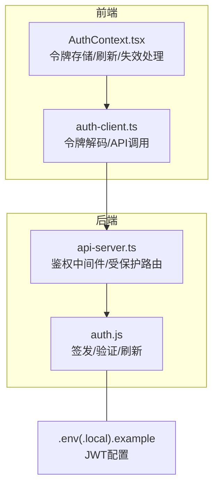
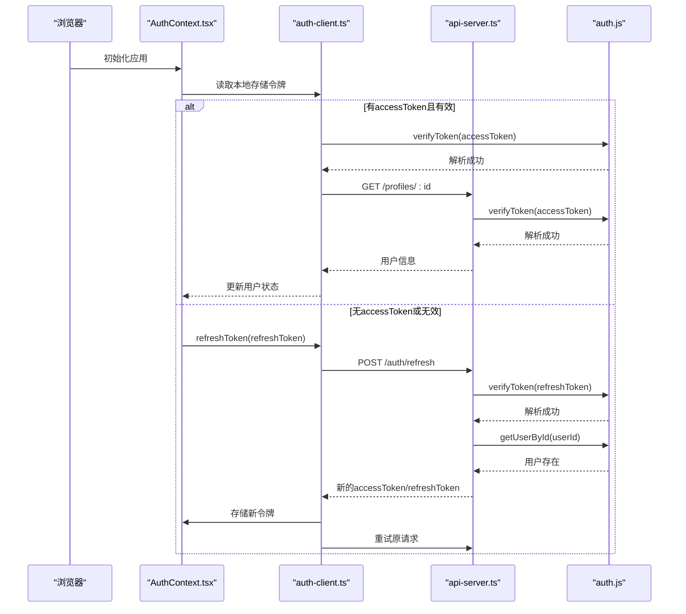
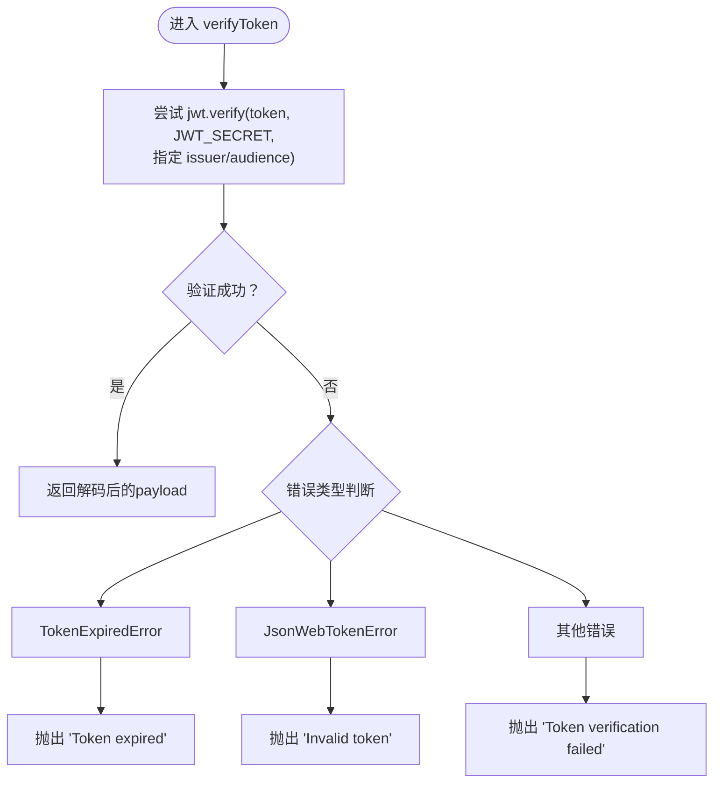
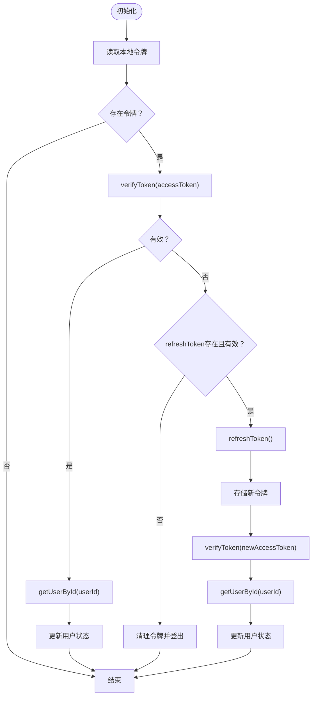
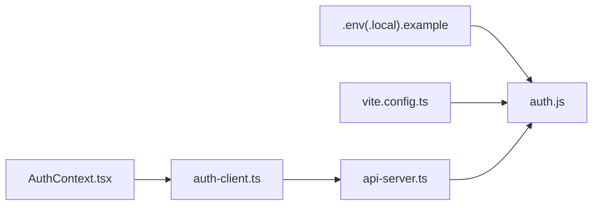

# 令牌验证问题

<cite>
**本文引用的文件**
- [server/src/services/auth.js](file://server/src/services/auth.js)
- [src/contexts/AuthContext.tsx](file://src/contexts/AuthContext.tsx)
- [src/services/auth-client.ts](file://src/services/auth-client.ts)
- [server/api-server.ts](file://server/api-server.ts)
- [.env.local.example](file://.env.local.example)
- [.env.example](file://.env.example)
- [vite.config.ts](file://vite.config.ts)
</cite>

## 目录
1. [引言](#引言)
2. [项目结构](#项目结构)
3. [核心组件](#核心组件)
4. [架构总览](#架构总览)
5. [详细组件分析](#详细组件分析)
6. [依赖关系分析](#依赖关系分析)
7. [性能考量](#性能考量)
8. [故障排查指南](#故障排查指南)
9. [结论](#结论)
10. [附录](#附录)

## 引言
本文件聚焦于JWT令牌验证失败的系统性分析，覆盖令牌过期、签名无效、令牌格式错误等常见问题。结合后端AuthService的verifyToken实现与前端AuthContext的令牌存储与刷新机制，给出诊断路径、日志分析方法、令牌调试技巧，并提出安全加固建议（包括令牌刷新机制优化、防重放与令牌吊销列表的实现思路）。

## 项目结构
围绕JWT认证的关键文件分布如下：
- 后端服务：server/src/services/auth.js（令牌签发、验证、刷新）
- 前端上下文：src/contexts/AuthContext.tsx（令牌持久化、自动刷新、失效处理）
- 前端客户端：src/services/auth-client.ts（令牌解码、API交互）
- 服务器入口：server/api-server.ts（鉴权中间件、受保护路由）
- 环境变量：.env.local.example、.env.example（JWT密钥与过期策略）
- 构建配置：vite.config.ts（外部化依赖）

图表来源
- [src/contexts/AuthContext.tsx](file://src/contexts/AuthContext.tsx#L1-L308)
- [src/services/auth-client.ts](file://src/services/auth-client.ts#L1-L235)
- [server/src/services/auth.js](file://server/src/services/auth.js#L1-L284)
- [server/api-server.ts](file://server/api-server.ts#L56-L151)
- [.env.local.example](file://.env.local.example#L13-L17)
- [.env.example](file://.env.example#L24-L28)

章节来源
- [src/contexts/AuthContext.tsx](file://src/contexts/AuthContext.tsx#L1-L308)
- [src/services/auth-client.ts](file://src/services/auth-client.ts#L1-L235)
- [server/src/services/auth.js](file://server/src/services/auth.js#L1-L284)
- [server/api-server.ts](file://server/api-server.ts#L56-L151)
- [.env.local.example](file://.env.local.example#L13-L17)
- [.env.example](file://.env.example#L24-L28)
- [vite.config.ts](file://vite.config.ts#L69-L89)

## 核心组件
- 后端AuthService
  - 令牌签发：generateAccessToken/generateRefreshToken
  - 令牌验证：verifyToken（基于密钥与iss/aud约束）
  - 刷新流程：refreshToken（验证refreshToken并重新签发）
- 前端AuthContext
  - 令牌存储：localStorage键值对
  - 初始化：尝试使用accessToken恢复会话；若失败则用refreshToken刷新
  - 自动刷新：在过期前5分钟自动刷新
  - 失效处理：过期或验证失败时清理令牌并登出
- 前端ClientAuthService
  - 令牌解码：verifyToken（支持开发环境的mock令牌）
  - API交互：login/register/refresh/getUserById/changePassword/logout
- 服务器中间件
  - 鉴权中间件：从Authorization头提取Bearer令牌并调用AuthService.verifyToken
  - 受保护路由：/api前缀下的所有接口均需通过鉴权

章节来源
- [server/src/services/auth.js](file://server/src/services/auth.js#L33-L103)
- [server/src/services/auth.js](file://server/src/services/auth.js#L145-L186)
- [src/contexts/AuthContext.tsx](file://src/contexts/AuthContext.tsx#L37-L138)
- [src/contexts/AuthContext.tsx](file://src/contexts/AuthContext.tsx#L232-L276)
- [src/services/auth-client.ts](file://src/services/auth-client.ts#L31-L57)
- [src/services/auth-client.ts](file://src/services/auth-client.ts#L111-L126)
- [server/api-server.ts](file://server/api-server.ts#L118-L151)

## 架构总览
下图展示从浏览器到后端的完整令牌验证链路，以及前端自动刷新与失效处理机制。

图表来源
- [src/contexts/AuthContext.tsx](file://src/contexts/AuthContext.tsx#L80-L138)
- [src/services/auth-client.ts](file://src/services/auth-client.ts#L111-L126)
- [server/api-server.ts](file://server/api-server.ts#L86-L105)
- [server/src/services/auth.js](file://server/src/services/auth.js#L145-L186)

## 详细组件分析

### 后端AuthService.verifyToken实现与问题定位
- 密钥来源：优先从VITE_JWT_SECRET或JWT_SECRET读取，否则使用默认值（生产环境务必替换）
- 策略约束：限定issuer与audience，避免跨域误用
- 错误分类：
  - 过期：TokenExpiredError -> 抛出“Token expired”
  - 签名无效/非法：JsonWebTokenError -> 抛出“Invalid token”
  - 其他：抛出“Token verification failed”

图表来源
- [server/src/services/auth.js](file://server/src/services/auth.js#L61-L83)

章节来源
- [server/src/services/auth.js](file://server/src/services/auth.js#L11-L13)
- [server/src/services/auth.js](file://server/src/services/auth.js#L61-L83)

### 前端AuthContext中的令牌存储与刷新机制
- 存储键：ACCESS_TOKEN_KEY/REFRESH_TOKEN_KEY
- 初始化流程：
  - 若存在令牌，先尝试使用accessToken恢复会话
  - 若accessToken无效，检查refreshToken是否存在并可用，尝试刷新
  - 成功后重新获取用户资料并更新状态
- 自动刷新：
  - 每分钟检查一次accessToken是否接近过期（提前5分钟）
  - 若已过期则登出
  - 若即将过期则触发refreshToken并更新本地存储
- 失效处理：任何验证失败或刷新失败均清理本地令牌并登出

图表来源
- [src/contexts/AuthContext.tsx](file://src/contexts/AuthContext.tsx#L80-L138)
- [src/contexts/AuthContext.tsx](file://src/contexts/AuthContext.tsx#L232-L276)

章节来源
- [src/contexts/AuthContext.tsx](file://src/contexts/AuthContext.tsx#L37-L138)
- [src/contexts/AuthContext.tsx](file://src/contexts/AuthContext.tsx#L232-L276)

### 前端ClientAuthService的令牌解码与调试
- 客户端解码：verifyToken通过拆分JWT三段并base64解码payload，便于在前端查看exp/iat等字段
- 开发环境支持：以“mock-”开头的令牌会被识别为开发用mock，exp设置较长以便调试
- 注意：客户端解码仅用于调试，不应替代后端verifyToken进行授权决策

章节来源
- [src/services/auth-client.ts](file://src/services/auth-client.ts#L31-L57)

### 服务器中间件与受保护路由
- 中间件逻辑：
  - 从Authorization头提取Bearer令牌
  - 调用AuthService.verifyToken
  - 通过后从数据库查询用户并注入req.user
- 返回错误：
  - 缺少或格式不正确：401 + “Access token required”
  - 验证失败：401 + “Invalid token” + 具体message

章节来源
- [server/api-server.ts](file://server/api-server.ts#L118-L151)

## 依赖关系分析
- 环境变量依赖：JWT_SECRET/JWT_EXPIRES_IN/JWT_REFRESH_EXPIRES_IN
- 构建配置：vite.config.ts将jsonwebtoken标记为外部依赖，确保运行时由后端环境提供
- 组件耦合：
  - 前端ClientAuthService依赖后端API端点
  - AuthContext依赖ClientAuthService与后端API
  - 服务器中间件依赖AuthService

图表来源
- [.env.local.example](file://.env.local.example#L13-L17)
- [.env.example](file://.env.example#L24-L28)
- [vite.config.ts](file://vite.config.ts#L69-L89)
- [src/contexts/AuthContext.tsx](file://src/contexts/AuthContext.tsx#L1-L308)
- [src/services/auth-client.ts](file://src/services/auth-client.ts#L1-L235)
- [server/api-server.ts](file://server/api-server.ts#L56-L151)
- [server/src/services/auth.js](file://server/src/services/auth.js#L1-L284)

章节来源
- [.env.local.example](file://.env.local.example#L13-L17)
- [.env.example](file://.env.example#L24-L28)
- [vite.config.ts](file://vite.config.ts#L69-L89)

## 性能考量
- 令牌验证成本低：主要为哈希与时间比较，开销可忽略
- 自动刷新频率：每分钟检查一次，建议保持当前频率以平衡用户体验与安全性
- 网络往返：刷新令牌涉及一次后端调用，建议在弱网环境下增加重试与降级提示

## 故障排查指南

### 常见问题与定位步骤
- 令牌过期
  - 现象：前端自动刷新或受保护路由返回401
  - 排查：
    - 使用前端ClientAuthService.verifyToken查看exp/iat
    - 检查JWT_EXPIRES_IN配置是否过短
    - 观察AuthContext的自动刷新逻辑是否在5分钟前提前刷新
  - 关联文件
    - [src/services/auth-client.ts](file://src/services/auth-client.ts#L31-L57)
    - [src/contexts/AuthContext.tsx](file://src/contexts/AuthContext.tsx#L232-L276)
    - [server/src/services/auth.js](file://server/src/services/auth.js#L11-L13)

- 签名无效/非法
  - 现象：后端AuthService.verifyToken抛出“Invalid token”，或服务器中间件返回401
  - 排查：
    - 确认JWT_SECRET一致（前后端应使用相同密钥）
    - 检查是否被代理或中间层篡改了Authorization头
    - 确认issuer/audience约束是否匹配
  - 关联文件
    - [server/src/services/auth.js](file://server/src/services/auth.js#L61-L83)
    - [server/api-server.ts](file://server/api-server.ts#L118-L151)

- 令牌格式错误
  - 现象：前端ClientAuthService.verifyToken抛出“Invalid token format”
  - 排查：
    - 检查localStorage中存储的令牌是否为标准JWT三段式
    - 开发环境mock令牌仅用于调试，避免在生产使用
  - 关联文件
    - [src/services/auth-client.ts](file://src/services/auth-client.ts#L31-L57)

- JWT_SECRET配置错误
  - 现象：前后端密钥不一致导致签名验证失败
  - 排查：
    - 对比.env与部署环境中的JWT_SECRET
    - 确保VITE_JWT_SECRET/JWT_SECRET均设置且一致
  - 关联文件
    - [server/src/services/auth.js](file://server/src/services/auth.js#L11-L13)
    - [.env.local.example](file://.env.local.example#L13-L17)
    - [.env.example](file://.env.example#L24-L28)

- Token过期策略不当
  - 现象：频繁过期导致用户体验差
  - 排查：
    - 检查JWT_EXPIRES_IN与JWT_REFRESH_EXPIRES_IN配置
    - 结合AuthContext的自动刷新阈值（5分钟）评估
  - 关联文件
    - [server/src/services/auth.js](file://server/src/services/auth.js#L11-L13)
    - [src/contexts/AuthContext.tsx](file://src/contexts/AuthContext.tsx#L232-L276)

- verifyToken方法实现缺陷
  - 现象：错误分支未区分过期与非法，导致统一返回“Token verification failed”
  - 排查：
    - 确认捕获TokenExpiredError与JsonWebTokenError并分别处理
  - 关联文件
    - [server/src/services/auth.js](file://server/src/services/auth.js#L61-L83)

### 日志分析方法
- 前端日志要点：
  - 初始化阶段：记录是否命中accessToken、是否触发refreshToken、刷新结果
  - 自动刷新：记录exp剩余时间、刷新时机、失败原因
  - 失效处理：记录清理令牌与登出行为
- 后端日志要点：
  - 鉴权中间件：记录Authorization头格式、verifyToken返回、getUserById结果
  - 刷新接口：记录refreshToken有效性、用户状态、新令牌签发
- 建议：
  - 在关键节点输出令牌摘要（如userId、exp）而非完整payload
  - 区分业务错误与系统错误，便于检索

章节来源
- [src/contexts/AuthContext.tsx](file://src/contexts/AuthContext.tsx#L80-L138)
- [src/contexts/AuthContext.tsx](file://src/contexts/AuthContext.tsx#L232-L276)
- [server/api-server.ts](file://server/api-server.ts#L118-L151)
- [server/src/services/auth.js](file://server/src/services/auth.js#L145-L186)

### 令牌调试技巧
- 前端调试：
  - 使用ClientAuthService.verifyToken在控制台打印payload
  - 临时切换为mock令牌以模拟长期有效的令牌
- 后端调试：
  - 打印JWT_SECRET来源（环境变量）与签发参数（issuer/audience/exp）
  - 在受保护路由中记录req.user与请求路径，便于定位权限问题

章节来源
- [src/services/auth-client.ts](file://src/services/auth-client.ts#L31-L57)
- [server/src/services/auth.js](file://server/src/services/auth.js#L33-L60)
- [server/api-server.ts](file://server/api-server.ts#L118-L151)

## 结论
JWT令牌验证失败通常由密钥不一致、过期策略不当或verifyToken实现缺陷引发。通过前后端协同的日志与调试手段，可快速定位问题。建议在生产环境中强化密钥管理、优化刷新策略、引入防重放与吊销机制，以提升整体安全性与稳定性。

## 附录

### 安全加固建议
- 令牌刷新机制优化
  - 采用短期accessToken与较长refreshToken组合
  - 在AuthContext中增加刷新并发控制，避免重复刷新
  - 刷新失败时立即清理令牌并强制登出
- 防重放攻击
  - 后端维护“已使用refreshToken集合”（内存/Redis），拒绝重复使用
  - 为refreshToken加入一次性使用标记并在签发时设置唯一标识
- 令牌吊销列表
  - 维护“已吊销accessToken集合”（黑名单），在verifyToken阶段快速检查
  - 支持按用户维度吊销（例如换绑设备、强制登出）
- 环境与配置
  - 严格管理JWT_SECRET，禁止硬编码与泄露
  - 在CI/CD中注入敏感配置，避免提交至仓库
- 监控与告警
  - 记录鉴权失败率、刷新成功率、过期事件
  - 对异常峰值（如短时间内大量刷新失败）触发告警