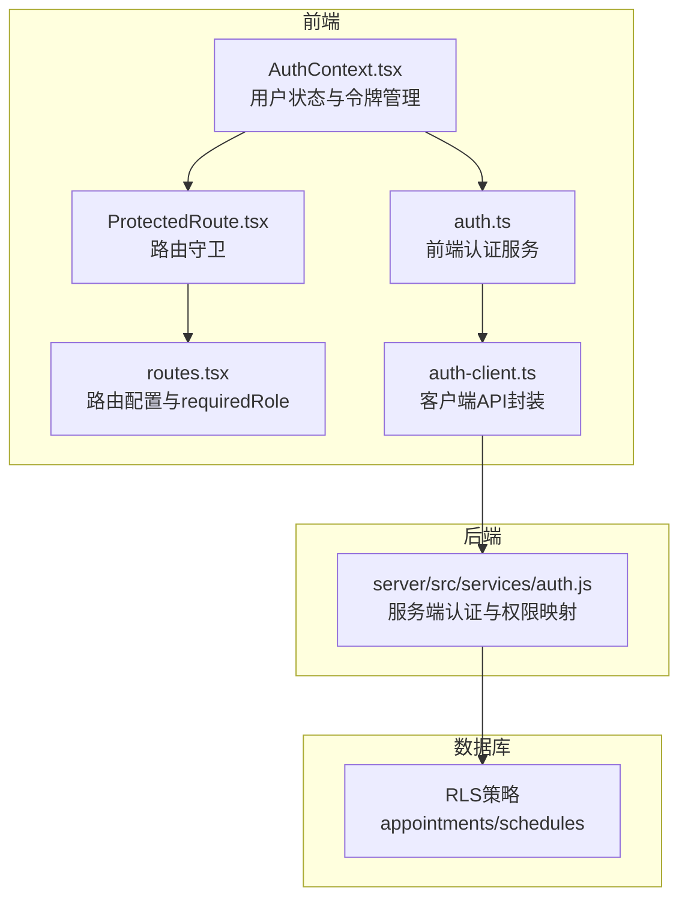
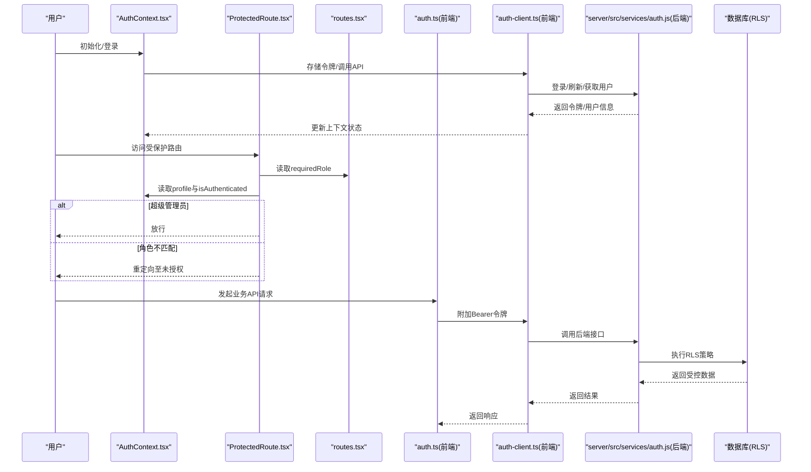
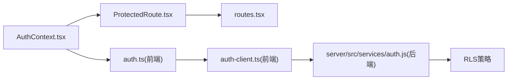

# 用户权限问题

<cite>
**本文引用的文件**
- [server/src/services/auth.js](file://server/src/services/auth.js)
- [src/services/auth.ts](file://src/services/auth.ts)
- [src/services/auth-client.ts](file://src/services/auth-client.ts)
- [src/contexts/AuthContext.tsx](file://src/contexts/AuthContext.tsx)
- [src/components/auth/ProtectedRoute.tsx](file://src/components/auth/ProtectedRoute.tsx)
- [src/routes.tsx](file://src/routes.tsx)
- [src/types/types.ts](file://src/types/types.ts)
- [AUTH_IMPLEMENTATION_SUMMARY.md](file://AUTH_IMPLEMENTATION_SUMMARY.md)
- [AUTH_TESTING_GUIDE.md](file://AUTH_TESTING_GUIDE.md)
- [supabase/migrations/00008_add_rls_policies_for_role_based_access.sql](file://supabase/migrations/00008_add_rls_policies_for_role_based_access.sql)
</cite>

## 目录
1. [简介](#简介)
2. [项目结构](#项目结构)
3. [核心组件](#核心组件)
4. [架构总览](#架构总览)
5. [详细组件分析](#详细组件分析)
6. [依赖关系分析](#依赖关系分析)
7. [性能考量](#性能考量)
8. [故障排查指南](#故障排查指南)
9. [结论](#结论)
10. [附录](#附录)

## 简介
本文件聚焦“用户权限校验异常”的系统性分析与解决路径，覆盖角色权限缺失、访问受保护路由失败、操作权限不足等典型问题。通过对服务端权限映射、前端路由守卫与用户状态管理的联合剖析，定位由权限映射错误、权限判断逻辑缺陷或角色更新不及时引发的异常；并结合后端行级安全策略（RLS）与前端上下文（AuthContext）给出可落地的调试方法、角色验证技巧与权限模型优化建议（动态权限配置、细粒度访问控制、权限缓存策略）。

## 项目结构
围绕权限体系的关键文件分布如下：
- 服务端权限与认证：server/src/services/auth.js
- 前端认证与权限：src/services/auth.ts、src/services/auth-client.ts
- 用户状态与上下文：src/contexts/AuthContext.tsx
- 路由守卫与权限判定：src/components/auth/ProtectedRoute.tsx、src/routes.tsx
- 类型与角色定义：src/types/types.ts
- 数据库权限策略：supabase/migrations/00008_add_rls_policies_for_role_based_access.sql
- 权限实现与测试文档：AUTH_IMPLEMENTATION_SUMMARY.md、AUTH_TESTING_GUIDE.md

图表来源
- [src/contexts/AuthContext.tsx](file://src/contexts/AuthContext.tsx#L1-L308)
- [src/components/auth/ProtectedRoute.tsx](file://src/components/auth/ProtectedRoute.tsx#L1-L49)
- [src/routes.tsx](file://src/routes.tsx#L1-L135)
- [src/services/auth.ts](file://src/services/auth.ts#L1-L341)
- [src/services/auth-client.ts](file://src/services/auth-client.ts#L1-L235)
- [server/src/services/auth.js](file://server/src/services/auth.js#L1-L284)
- [supabase/migrations/00008_add_rls_policies_for_role_based_access.sql](file://supabase/migrations/00008_add_rls_policies_for_role_based_access.sql#L1-L180)

章节来源
- [AUTH_IMPLEMENTATION_SUMMARY.md](file://AUTH_IMPLEMENTATION_SUMMARY.md#L1-L350)
- [AUTH_TESTING_GUIDE.md](file://AUTH_TESTING_GUIDE.md#L1-L180)

## 核心组件
- 服务端权限映射与判断：服务端AuthService提供角色到权限集合的映射与hasPermission判断，是权限判定的权威来源。
- 前端认证与令牌管理：前端AuthService负责本地令牌签发/校验，ClientAuthService负责与后端API交互、存储令牌、刷新会话。
- 用户状态上下文：AuthContext统一管理登录态、用户资料、角色、自动刷新与登出流程。
- 路由守卫：ProtectedRoute基于AuthContext与路由配置的requiredRole进行角色校验，超级管理员拥有豁免权。
- 数据库RLS：后端通过PostgreSQL RLS策略对数据访问进行强约束，防止越权读取/写入。

章节来源
- [server/src/services/auth.js](file://server/src/services/auth.js#L246-L280)
- [src/services/auth.ts](file://src/services/auth.ts#L300-L338)
- [src/services/auth-client.ts](file://src/services/auth-client.ts#L1-L235)
- [src/contexts/AuthContext.tsx](file://src/contexts/AuthContext.tsx#L1-L308)
- [src/components/auth/ProtectedRoute.tsx](file://src/components/auth/ProtectedRoute.tsx#L1-L49)
- [supabase/migrations/00008_add_rls_policies_for_role_based_access.sql](file://supabase/migrations/00008_add_rls_policies_for_role_based_access.sql#L1-L180)

## 架构总览
权限校验的端到端流程如下：

图表来源
- [src/contexts/AuthContext.tsx](file://src/contexts/AuthContext.tsx#L1-L308)
- [src/components/auth/ProtectedRoute.tsx](file://src/components/auth/ProtectedRoute.tsx#L1-L49)
- [src/routes.tsx](file://src/routes.tsx#L1-L135)
- [src/services/auth.ts](file://src/services/auth.ts#L1-L341)
- [src/services/auth-client.ts](file://src/services/auth-client.ts#L1-L235)
- [server/src/services/auth.js](file://server/src/services/auth.js#L1-L284)
- [supabase/migrations/00008_add_rls_policies_for_role_based_access.sql](file://supabase/migrations/00008_add_rls_policies_for_role_based_access.sql#L1-L180)

## 详细组件分析

### 服务端权限映射与hasPermission逻辑
- 角色到权限映射：服务端提供角色到权限集合的静态映射，返回对应权限数组。
- 权限判断：hasPermission(userRole, permission)通过includes判断是否具备某权限。
- 风险点：
  - 映射缺失：当新增角色或权限时，若未同步更新映射，会导致hasPermission返回false，出现“权限不足”。
  - 逻辑缺陷：includes匹配严格，大小写、拼写错误都会导致判断失败。
  - 角色更新不及时：若用户角色变更但映射未生效，前端仍按旧映射判断，造成访问受阻。

章节来源
- [server/src/services/auth.js](file://server/src/services/auth.js#L246-L280)

### 前端权限映射与hasPermission对比
- 前端AuthService同样提供getUserPermissions与hasPermission，用于前端侧的细粒度按钮/菜单控制。
- 与后端映射保持一致至关重要：若前后端映射不一致，会出现“前端可见但后端拒绝”的矛盾现象。
- 建议：前后端映射保持同步，或在前端仅做UI层提示，核心权限判断以服务端为准。

章节来源
- [src/services/auth.ts](file://src/services/auth.ts#L300-L338)

### 用户状态管理与令牌生命周期
- AuthContext负责：
  - 初始化：从本地存储读取令牌，尝试解码并拉取用户资料，必要时刷新会话。
  - 自动刷新：在令牌即将过期前主动刷新，避免白屏或401。
  - 登出：清理本地令牌与上下文状态，并调用后端登出。
- 常见问题：
  - 令牌过期：前端未正确检测exp或刷新失败，导致后续请求401。
  - 本地存储损坏：令牌丢失或格式异常，初始化失败。
  - 刷新失败：refreshToken无效或账户被禁用，导致自动登出。

章节来源
- [src/contexts/AuthContext.tsx](file://src/contexts/AuthContext.tsx#L1-L308)

### 路由守卫与requiredRole
- ProtectedRoute：
  - 未登录：重定向至登录页。
  - 超级管理员：放行所有受保护路由。
  - 角色校验：若路由声明requiredRole且当前角色不在允许列表，则重定向至未授权页。
- 常见问题：
  - requiredRole配置错误：路由配置与实际角色不一致，导致“无权限”。
  - 角色未更新：用户角色变更后未刷新上下文，导致守卫仍按旧角色判断。

章节来源
- [src/components/auth/ProtectedRoute.tsx](file://src/components/auth/ProtectedRoute.tsx#L1-L49)
- [src/routes.tsx](file://src/routes.tsx#L1-L135)

### 数据库RLS策略
- 对appointments与schedules表实施基于角色的访问控制：
  - 超级管理员与护士长：可查看/更新所有数据。
  - 销售：仅能查看/更新自己创建的预约（且状态受限）。
  - 医生：仅能查看/更新分配给自己的预约。
  - 护士：可查看所有预约；仅能更新分配给自己的排班。
- 常见问题：
  - RLS策略未启用或被覆盖：导致绕过权限控制。
  - 用户状态为禁用：RLS拒绝访问。
  - 字段不匹配：created_by doctor_id等字段与策略条件不一致。

章节来源
- [supabase/migrations/00008_add_rls_policies_for_role_based_access.sql](file://supabase/migrations/00008_add_rls_policies_for_role_based_access.sql#L1-L180)

### 权限模型与类型定义
- 角色类型：super_admin、sales、head_nurse、nurse、doctor。
- 前端路由配置与页面可见性均基于角色进行控制。
- 建议：在类型层面统一角色枚举，避免字符串漂移带来的错误。

章节来源
- [src/types/types.ts](file://src/types/types.ts#L1-L120)
- [AUTH_IMPLEMENTATION_SUMMARY.md](file://AUTH_IMPLEMENTATION_SUMMARY.md#L100-L175)

## 依赖关系分析
- 前端依赖后端：
  - 登录/刷新/获取用户：通过ClientAuthService调用后端API。
  - 权限判断：前端可做UI层提示，但最终以服务端映射为准。
- 路由守卫依赖AuthContext：
  - 读取profile与isAuthenticated，决定是否放行。
- 数据库RLS独立于前端/后端逻辑，形成第二道防线。

图表来源
- [src/contexts/AuthContext.tsx](file://src/contexts/AuthContext.tsx#L1-L308)
- [src/components/auth/ProtectedRoute.tsx](file://src/components/auth/ProtectedRoute.tsx#L1-L49)
- [src/routes.tsx](file://src/routes.tsx#L1-L135)
- [src/services/auth.ts](file://src/services/auth.ts#L1-L341)
- [src/services/auth-client.ts](file://src/services/auth-client.ts#L1-L235)
- [server/src/services/auth.js](file://server/src/services/auth.js#L1-L284)
- [supabase/migrations/00008_add_rls_policies_for_role_based_access.sql](file://supabase/migrations/00008_add_rls_policies_for_role_based_access.sql#L1-L180)

## 性能考量
- 前端令牌刷新频率：每分钟检查一次过期时间，建议在高并发场景下合并刷新请求，避免频繁网络抖动。
- 权限映射缓存：对静态角色权限映射可在前端做内存缓存，减少重复计算。
- RLS查询成本：复杂策略可能增加查询开销，建议在表上建立必要索引（如created_by、doctor_id）。

[本节为通用指导，无需列出具体文件来源]

## 故障排查指南

### 诊断步骤
1. 确认登录态与令牌
   - 检查本地存储是否存在有效令牌，令牌是否过期或格式异常。
   - 若过期或无效，尝试刷新；若刷新失败，清理令牌并重新登录。
   - 参考路径：[src/contexts/AuthContext.tsx](file://src/contexts/AuthContext.tsx#L1-L308)、[src/services/auth-client.ts](file://src/services/auth-client.ts#L1-L235)

2. 校验requiredRole配置
   - 检查目标路由的requiredRole是否包含当前角色；超级管理员可豁免。
   - 参考路径：[src/components/auth/ProtectedRoute.tsx](file://src/components/auth/ProtectedRoute.tsx#L1-L49)、[src/routes.tsx](file://src/routes.tsx#L1-L135)

3. 对比前后端权限映射
   - 确认服务端角色到权限映射是否包含所需权限；前端hasPermission应与之保持一致。
   - 参考路径：[server/src/services/auth.js](file://server/src/services/auth.js#L246-L280)、[src/services/auth.ts](file://src/services/auth.ts#L300-L338)

4. 核对数据库RLS策略
   - 确认RLS已启用且策略条件与业务逻辑一致；检查用户状态是否为active。
   - 参考路径：[supabase/migrations/00008_add_rls_policies_for_role_based_access.sql](file://supabase/migrations/00008_add_rls_policies_for_role_based_access.sql#L1-L180)

5. 角色更新不及时
   - 用户角色变更后，需刷新用户资料；否则上下文仍持有旧角色。
   - 参考路径：[src/contexts/AuthContext.tsx](file://src/contexts/AuthContext.tsx#L1-L308)

### 常见问题与定位
- 角色权限缺失
  - 现象：按钮/菜单不可见或点击报错。
  - 排查：核对服务端映射与前端hasPermission；确保路由requiredRole包含当前角色。
  - 参考路径：[server/src/services/auth.js](file://server/src/services/auth.js#L246-L280)、[src/services/auth.ts](file://src/services/auth.ts#L300-L338)、[src/routes.tsx](file://src/routes.tsx#L1-L135)

- 访问受保护路由失败
  - 现象：跳转到未授权页。
  - 排查：确认isAuthenticated为true；检查requiredRole与profile.role；超级管理员可豁免。
  - 参考路径：[src/components/auth/ProtectedRoute.tsx](file://src/components/auth/ProtectedRoute.tsx#L1-L49)、[src/contexts/AuthContext.tsx](file://src/contexts/AuthContext.tsx#L1-L308)

- 操作权限不足
  - 现象：提交请求被后端拒绝（403/RLS拒绝）。
  - 排查：核对RLS策略条件（如created_by、doctor_id）；确认用户状态为active。
  - 参考路径：[supabase/migrations/00008_add_rls_policies_for_role_based_access.sql](file://supabase/migrations/00008_add_rls_policies_for_role_based_access.sql#L1-L180)

- 用户角色更新不及时
  - 现象：角色变更后仍按旧权限运行。
  - 排查：调用refreshUser或重新登录；确保上下文更新profile。
  - 参考路径：[src/contexts/AuthContext.tsx](file://src/contexts/AuthContext.tsx#L1-L308)

### 权限调试方法
- 前端调试
  - 在AuthContext中打印profile与令牌；在ProtectedRoute中打印requiredRole与当前角色。
  - 使用浏览器开发者工具Network面板观察API请求与响应。
  - 参考路径：[src/contexts/AuthContext.tsx](file://src/contexts/AuthContext.tsx#L1-L308)、[src/components/auth/ProtectedRoute.tsx](file://src/components/auth/ProtectedRoute.tsx#L1-L49)

- 后端调试
  - 在服务端AuthService中输出getUserPermissions与hasPermission的输入参数与返回值。
  - 参考路径：[server/src/services/auth.js](file://server/src/services/auth.js#L246-L280)

- 数据库调试
  - 使用Supabase Console执行SELECT验证RLS策略是否生效；检查用户状态与字段值。
  - 参考路径：[supabase/migrations/00008_add_rls_policies_for_role_based_access.sql](file://supabase/migrations/00008_add_rls_policies_for_role_based_access.sql#L1-L180)

### 用户角色验证技巧
- 强制刷新用户资料：在角色变更后调用refreshUser，确保上下文与后端一致。
- 令牌有效期监控：利用verifyToken与exp字段判断剩余有效期，提前刷新。
- 未授权页友好提示：引导用户联系管理员或切换账号。
- 参考路径：[src/contexts/AuthContext.tsx](file://src/contexts/AuthContext.tsx#L1-L308)、[src/pages/auth/UnauthorizedPage.tsx](file://src/pages/auth/UnauthorizedPage.tsx#L1-L39)

## 结论
权限校验异常通常源于“前后端权限映射不一致、路由守卫配置错误、令牌生命周期管理不当、角色更新未同步、RLS策略未生效或字段不匹配”。通过统一权限映射、完善路由守卫、强化令牌生命周期管理、及时刷新用户资料以及严格执行RLS策略，可显著降低权限异常的发生率。建议在现有基础上引入动态权限配置、细粒度访问控制与权限缓存策略，进一步提升系统的安全性与可维护性。

[本节为总结性内容，无需列出具体文件来源]

## 附录

### 权限模型优化建议
- 动态权限配置
  - 将权限映射从静态映射迁移到后端动态下发，前端缓存并定期刷新。
  - 参考路径：[server/src/services/auth.js](file://server/src/services/auth.js#L246-L280)

- 细粒度访问控制
  - 在RLS中细化字段级与行级控制，结合created_by、doctor_id等字段实现最小权限原则。
  - 参考路径：[supabase/migrations/00008_add_rls_policies_for_role_based_access.sql](file://supabase/migrations/00008_add_rls_policies_for_role_based_access.sql#L1-L180)

- 权限缓存策略
  - 前端对角色权限映射做短期缓存，配合定时刷新与失效重试机制。
  - 参考路径：[src/services/auth.ts](file://src/services/auth.ts#L300-L338)

- 测试与回归
  - 使用AUTH_TESTING_GUIDE中的场景覆盖各角色的菜单、路由与数据访问边界。
  - 参考路径：[AUTH_TESTING_GUIDE.md](file://AUTH_TESTING_GUIDE.md#L1-L180)