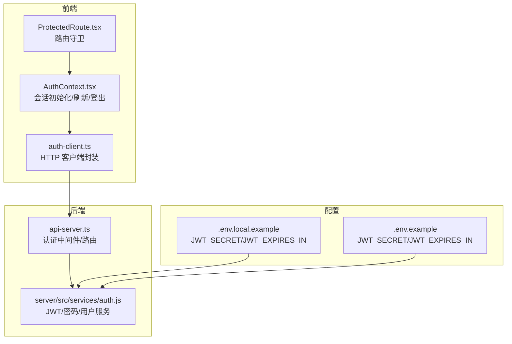
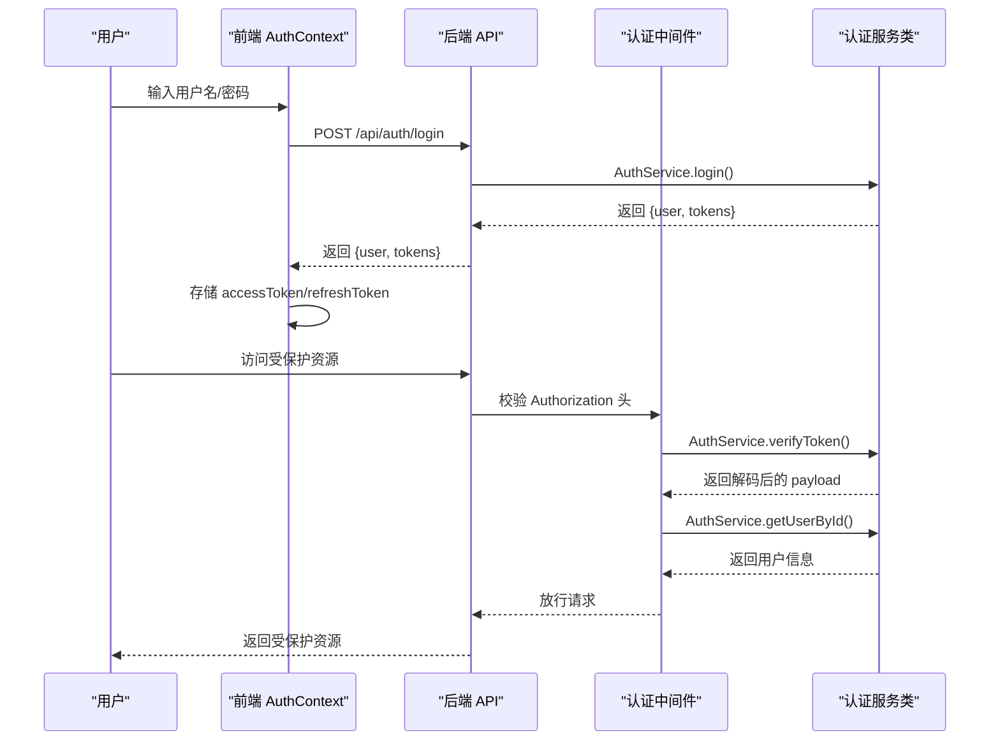
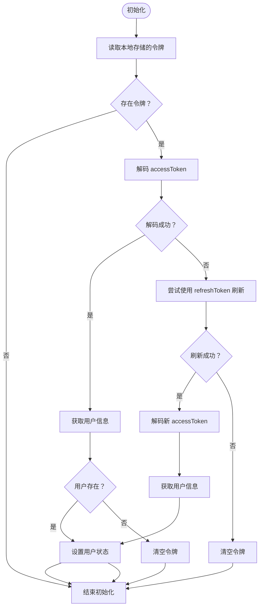
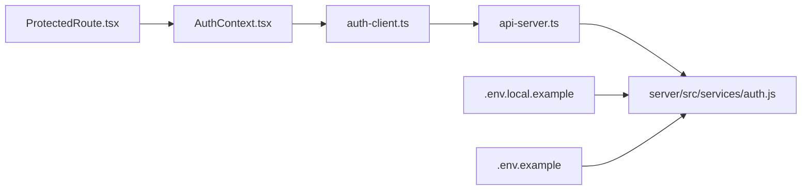

# 认证服务问题

<cite>
**本文引用的文件**
- [server/src/services/auth.js](file://server/src/services/auth.js)
- [src/services/auth.ts](file://src/services/auth.ts)
- [src/services/auth-client.ts](file://src/services/auth-client.ts)
- [src/contexts/AuthContext.tsx](file://src/contexts/AuthContext.tsx)
- [src/components/auth/ProtectedRoute.tsx](file://src/components/auth/ProtectedRoute.tsx)
- [server/api-server.ts](file://server/api-server.ts)
- [.env.local.example](file://.env.local.example)
- [.env.example](file://.env.example)
- [登录问题修复总结.md](file://登录问题修复总结.md)
- [登录问题排查指南.md](file://登录问题排查指南.md)
- [AUTH_TESTING_GUIDE.md](file://AUTH_TESTING_GUIDE.md)
- [AUTH_IMPLEMENTATION_SUMMARY.md](file://AUTH_IMPLEMENTATION_SUMMARY.md)
</cite>

## 目录
1. [简介](#简介)
2. [项目结构](#项目结构)
3. [核心组件](#核心组件)
4. [架构总览](#架构总览)
5. [详细组件分析](#详细组件分析)
6. [依赖关系分析](#依赖关系分析)
7. [性能考量](#性能考量)
8. [故障排除指南](#故障排除指南)
9. [结论](#结论)
10. [附录](#附录)

## 简介
本文件聚焦于认证服务的故障排除，围绕以下关键问题展开：
- JWT 令牌验证失败（签名不匹配、过期、格式错误）
- 登录流程中断（用户名/密码错误、账户禁用、网络异常）
- 密码验证异常（哈希不一致、存储策略差异）
- 由 JWT_SECRET 配置错误、Token 过期策略不当或认证中间件逻辑缺陷引发的问题
- 结合“登录问题修复总结.md”中的案例，提供诊断用户身份验证失败、权限校验异常及会话管理问题的方法
- 提供详细的日志分析方法、认证流程调试技巧，并以 server/src/services/auth.js 为上下文进行说明
- 包含安全加固建议：密码加密策略、Token 刷新机制优化、防暴力破解等

## 项目结构
认证相关代码分布在前后端两部分：
- 前端：认证上下文、路由守卫、客户端认证服务
- 后端：Express 中间件、认证服务类、API 路由
- 配置：JWT 相关环境变量

图表来源
- [src/contexts/AuthContext.tsx](file://src/contexts/AuthContext.tsx#L1-L308)
- [src/components/auth/ProtectedRoute.tsx](file://src/components/auth/ProtectedRoute.tsx#L1-L49)
- [src/services/auth-client.ts](file://src/services/auth-client.ts#L1-L235)
- [server/api-server.ts](file://server/api-server.ts#L100-L160)
- [server/src/services/auth.js](file://server/src/services/auth.js#L1-L120)
- [.env.local.example](file://.env.local.example#L1-L37)
- [.env.example](file://.env.example#L1-L42)

章节来源
- [src/contexts/AuthContext.tsx](file://src/contexts/AuthContext.tsx#L1-L308)
- [src/components/auth/ProtectedRoute.tsx](file://src/components/auth/ProtectedRoute.tsx#L1-L49)
- [src/services/auth-client.ts](file://src/services/auth-client.ts#L1-L235)
- [server/api-server.ts](file://server/api-server.ts#L100-L160)
- [server/src/services/auth.js](file://server/src/services/auth.js#L1-L120)
- [.env.local.example](file://.env.local.example#L1-L37)
- [.env.example](file://.env.example#L1-L42)

## 核心组件
- 前端认证上下文（AuthContext）负责：
  - 初始化会话（读取本地存储的令牌，尝试解码/刷新）
  - 登录/注册/登出流程
  - Token 到期前自动刷新
- 客户端认证服务（auth-client）负责：
  - 与后端 API 交互（登录、注册、刷新、获取用户、改密、登出）
  - 本地存储令牌
- Express 中间件（api-server）负责：
  - 校验 Authorization 头中的 Bearer Token
  - 解码并从数据库获取用户信息
- 认证服务类（server/src/services/auth.js）负责：
  - JWT 签发与验证（含 issuer/audience 校验）
  - 密码哈希与比对
  - 用户查询与状态校验
- 配置（.env.*）负责：
  - JWT_SECRET、JWT_EXPIRES_IN、JWT_REFRESH_EXPIRES_IN

章节来源
- [src/contexts/AuthContext.tsx](file://src/contexts/AuthContext.tsx#L1-L308)
- [src/services/auth-client.ts](file://src/services/auth-client.ts#L1-L235)
- [server/api-server.ts](file://server/api-server.ts#L100-L160)
- [server/src/services/auth.js](file://server/src/services/auth.js#L1-L120)
- [.env.local.example](file://.env.local.example#L1-L37)
- [.env.example](file://.env.example#L1-L42)

## 架构总览
认证流程从登录开始，贯穿令牌签发、中间件校验、路由守卫与会话刷新。

图表来源
- [src/contexts/AuthContext.tsx](file://src/contexts/AuthContext.tsx#L150-L210)
- [src/services/auth-client.ts](file://src/services/auth-client.ts#L60-L120)
- [server/api-server.ts](file://server/api-server.ts#L118-L151)
- [server/src/services/auth.js](file://server/src/services/auth.js#L118-L168)

## 详细组件分析

### 前端认证上下文（AuthContext）
- 初始化流程：
  - 读取本地存储的 accessToken/refreshToken
  - 若 accessToken 可解码且用户存在则直接设置用户状态
  - 若 accessToken 无效，则尝试使用 refreshToken 刷新
  - 刷新失败则清空本地令牌
- 登录流程：
  - 调用客户端登录接口，成功后保存令牌并设置用户状态
- 登出流程：
  - 清空本地令牌
  - 调用后端登出接口
- Token 刷新：
  - 每分钟检查 accessToken 剩余有效期
  - 在过期前 5 分钟自动刷新
  - 若刷新失败或已过期则登出

图表来源
- [src/contexts/AuthContext.tsx](file://src/contexts/AuthContext.tsx#L74-L138)
- [src/contexts/AuthContext.tsx](file://src/contexts/AuthContext.tsx#L232-L276)

章节来源
- [src/contexts/AuthContext.tsx](file://src/contexts/AuthContext.tsx#L1-L308)

### 客户端认证服务（auth-client）
- 登录/注册/刷新/获取用户/改密/登出均通过 fetch 发起请求
- 本地存储 accessToken/refreshToken
- 对 401/404 等状态进行区分处理

章节来源
- [src/services/auth-client.ts](file://src/services/auth-client.ts#L1-L235)

### Express 认证中间件与路由
- 中间件：
  - 校验 Authorization 头必须为 Bearer
  - 从头部提取 token 并调用 AuthService.verifyToken
  - 通过用户 ID 查询用户并注入 req.user
- 路由：
  - /api/auth/login：登录
  - /api/auth/register：注册
  - /api/auth/refresh：刷新
  - /api/auth/logout：登出
  - /api/profiles/:id：受保护资源示例

章节来源
- [server/api-server.ts](file://server/api-server.ts#L100-L160)
- [server/api-server.ts](file://server/api-server.ts#L150-L210)

### 认证服务类（server/src/services/auth.js）
- JWT 配置：
  - 从环境变量读取 JWT_SECRET、JWT_EXPIRES_IN、JWT_REFRESH_EXPIRES_IN
  - 签发时设置 issuer/audience
- 登录：
  - 根据用户名查询用户，校验状态，比对密码，签发双令牌
- 刷新：
  - 验证 refreshToken，查询用户并签发新令牌
- 密码：
  - 使用 bcrypt 进行哈希与比对
- 权限：
  - 基于角色返回权限集合

章节来源
- [server/src/services/auth.js](file://server/src/services/auth.js#L1-L120)
- [server/src/services/auth.js](file://server/src/services/auth.js#L118-L168)
- [server/src/services/auth.js](file://server/src/services/auth.js#L169-L217)
- [server/src/services/auth.js](file://server/src/services/auth.js#L246-L280)

### 前端路由守卫（ProtectedRoute）
- 未登录重定向至登录页
- 检查 requiredRole，超级管理员放行
- 其他角色在校验失败时重定向至未授权页

章节来源
- [src/components/auth/ProtectedRoute.tsx](file://src/components/auth/ProtectedRoute.tsx#L1-L49)

## 依赖关系分析
- 前端依赖：
  - AuthContext 依赖 ClientAuthService
  - ClientAuthService 依赖 fetch 与本地存储
  - ProtectedRoute 依赖 AuthContext
- 后端依赖：
  - api-server 依赖 AuthService
  - AuthService 依赖数据库连接与 bcrypt/jwt
- 配置依赖：
  - JWT_SECRET/JWT_EXPIRES_IN/JWT_REFRESH_EXPIRES_IN 影响签发与验证

图表来源
- [src/contexts/AuthContext.tsx](file://src/contexts/AuthContext.tsx#L1-L308)
- [src/services/auth-client.ts](file://src/services/auth-client.ts#L1-L235)
- [server/api-server.ts](file://server/api-server.ts#L100-L160)
- [server/src/services/auth.js](file://server/src/services/auth.js#L1-L120)
- [.env.local.example](file://.env.local.example#L1-L37)
- [.env.example](file://.env.example#L1-L42)

章节来源
- [src/contexts/AuthContext.tsx](file://src/contexts/AuthContext.tsx#L1-L308)
- [src/services/auth-client.ts](file://src/services/auth-client.ts#L1-L235)
- [server/api-server.ts](file://server/api-server.ts#L100-L160)
- [server/src/services/auth.js](file://server/src/services/auth.js#L1-L120)
- [.env.local.example](file://.env.local.example#L1-L37)
- [.env.example](file://.env.example#L1-L42)

## 性能考量
- Token 刷新频率：每分钟检查一次，提前 5 分钟刷新，避免频繁刷新带来的压力
- 密码哈希成本：盐轮数较高可提升安全性但增加 CPU 开销，需在安全与性能间平衡
- 中间件开销：每次受保护请求都会进行 JWT 验证与用户查询，建议配合缓存与索引优化

## 故障排除指南

### 一、JWT 令牌验证失败
常见原因与定位方法：
- 签名不匹配（JWT_SECRET 不一致）
  - 检查前后端是否使用同一 JWT_SECRET
  - 确认部署环境变量覆盖顺序
- Token 过期
  - 前端定时刷新逻辑是否生效
  - 后端 verifyToken 是否抛出过期错误
- 格式错误（非标准 JWT 字符串）
  - 客户端 verifyToken 是否能解析 payload
- issuer/audience 不匹配
  - 服务端签发时设置的 issuer/audience 与验证时一致

定位步骤：
1. 打开浏览器开发者工具，查看 Network 中 /api/auth/login 的响应，确认返回的 accessToken/refreshToken
2. 在受保护请求中检查 Authorization 头是否为 Bearer 令牌
3. 在中间件处断点或打印 verifyToken 的输入与输出
4. 检查环境变量 JWT_SECRET 是否正确加载

章节来源
- [server/src/services/auth.js](file://server/src/services/auth.js#L31-L79)
- [src/services/auth-client.ts](file://src/services/auth-client.ts#L30-L60)
- [server/api-server.ts](file://server/api-server.ts#L118-L151)
- [.env.local.example](file://.env.local.example#L13-L17)
- [.env.example](file://.env.example#L24-L28)

### 二、登录流程中断
常见问题与修复：
- 用户名/密码错误
  - 前端登录表单校验与错误提示
  - 后端登录接口返回明确错误
- 账户禁用
  - 登录前检查用户状态
- 网络异常
  - 检查 API 基础地址与跨域配置
  - 查看 Network 标签中的请求状态与响应

定位步骤：
1. 在 LoginPage 中观察控制台日志，确认登录 API 调用链
2. 查看 AuthContext 初始化与登录回调中的错误分支
3. 使用“登录问题排查指南.md”中的步骤逐项检查

章节来源
- [src/contexts/AuthContext.tsx](file://src/contexts/AuthContext.tsx#L150-L210)
- [src/services/auth-client.ts](file://src/services/auth-client.ts#L60-L120)
- [server/src/services/auth.js](file://server/src/services/auth.js#L118-L168)
- [登录问题排查指南.md](file://登录问题排查指南.md#L140-L252)
- [登录问题修复总结.md](file://登录问题修复总结.md#L57-L120)

### 三、密码验证异常
常见原因与修复：
- 哈希不一致（前后端密码存储策略不一致）
  - 确保后端 AuthService 使用 bcrypt 进行哈希与比对
  - 前端不直接存储明文密码
- 用户状态异常（账户被禁用）
  - 登录前检查用户状态

定位步骤：
1. 在登录流程中确认 comparePassword 的调用与返回
2. 检查数据库中 profiles 表的 password_hash 字段是否正确
3. 使用 AUTH_TESTING_GUIDE.md 中的测试账号进行复测

章节来源
- [server/src/services/auth.js](file://server/src/services/auth.js#L21-L30)
- [server/src/services/auth.js](file://server/src/services/auth.js#L118-L168)
- [AUTH_TESTING_GUIDE.md](file://AUTH_TESTING_GUIDE.md#L1-L180)

### 四、Token 过期策略不当
- 建议：
  - accessToken 有效期较短（如 24h），refreshToken 有效期较长（如 7d）
  - 前端在过期前 5 分钟自动刷新
  - 后端对 refresh token 的用户状态进行再次校验

章节来源
- [server/src/services/auth.js](file://server/src/services/auth.js#L11-L13)
- [src/contexts/AuthContext.tsx](file://src/contexts/AuthContext.tsx#L232-L276)
- [.env.local.example](file://.env.local.example#L13-L17)
- [.env.example](file://.env.example#L24-L28)

### 五、认证中间件逻辑缺陷
- 常见问题：
  - 缺少 Bearer 前缀校验
  - 未正确注入 req.user
  - 未对用户不存在或状态异常进行处理
- 修复要点：
  - 严格校验 Authorization 头
  - verifyToken 后查询用户并校验状态
  - 对异常情况进行统一 401 响应

章节来源
- [server/api-server.ts](file://server/api-server.ts#L118-L151)

### 六、日志分析方法与调试技巧
- 前端：
  - 在 LoginPage 中打印登录调用链与结果
  - 在 AuthContext 初始化与刷新逻辑中加入日志
- 后端：
  - 在中间件与认证服务中打印关键路径（token 解析、用户查询）
- 参考“登录问题修复总结.md”的日志输出示例与步骤

章节来源
- [登录问题修复总结.md](file://登录问题修复总结.md#L57-L120)
- [src/contexts/AuthContext.tsx](file://src/contexts/AuthContext.tsx#L89-L138)
- [src/pages/auth/LoginPage.tsx](file://src/pages/auth/LoginPage.tsx#L38-L70)

### 七、安全加固建议
- 密码加密策略：
  - 使用 bcrypt，盐轮数保持在合理范围（如 12）
  - 不在前端存储明文密码
- Token 刷新机制优化：
  - 前端在过期前 5 分钟自动刷新
  - 后端刷新时再次校验用户状态
- 防暴力破解：
  - 引入登录尝试次数限制与冷却时间
  - 对异常 IP 进行临时封禁
  - 使用验证码或二次验证（可选）

章节来源
- [server/src/services/auth.js](file://server/src/services/auth.js#L21-L30)
- [src/contexts/AuthContext.tsx](file://src/contexts/AuthContext.tsx#L232-L276)
- [AUTH_IMPLEMENTATION_SUMMARY.md](file://AUTH_IMPLEMENTATION_SUMMARY.md#L227-L248)

## 结论
- 认证问题多源于配置不一致（JWT_SECRET）、过期策略不当与中间件校验缺失
- 建议以“登录问题修复总结.md”和“登录问题排查指南.md”为线索，结合前端日志与后端中间件输出进行定位
- 通过统一的环境变量管理、严格的 issuer/audience 校验与自动刷新机制，可显著降低认证失败率
- 安全加固应从密码策略、Token 生命周期与访问控制三方面入手

## 附录
- 关键实现位置参考：
  - JWT 配置与签发/验证：[server/src/services/auth.js](file://server/src/services/auth.js#L1-L120)
  - 登录/刷新/用户查询：[server/src/services/auth.js](file://server/src/services/auth.js#L118-L217)
  - 前端会话初始化与刷新：[src/contexts/AuthContext.tsx](file://src/contexts/AuthContext.tsx#L74-L138)
  - 前端自动刷新与登出：[src/contexts/AuthContext.tsx](file://src/contexts/AuthContext.tsx#L232-L276)
  - 客户端 API 调用封装：[src/services/auth-client.ts](file://src/services/auth-client.ts#L60-L120)
  - 中间件校验与路由：[server/api-server.ts](file://server/api-server.ts#L118-L151)
  - 环境变量配置示例：[.env.local.example](file://.env.local.example#L13-L17)，[.env.example](file://.env.example#L24-L28)