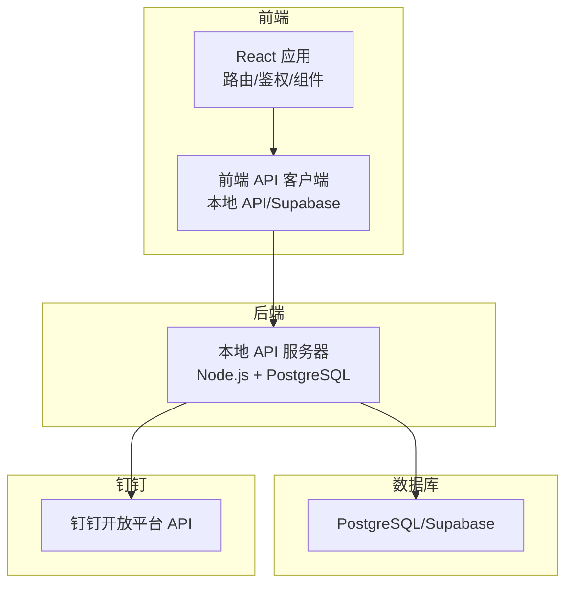
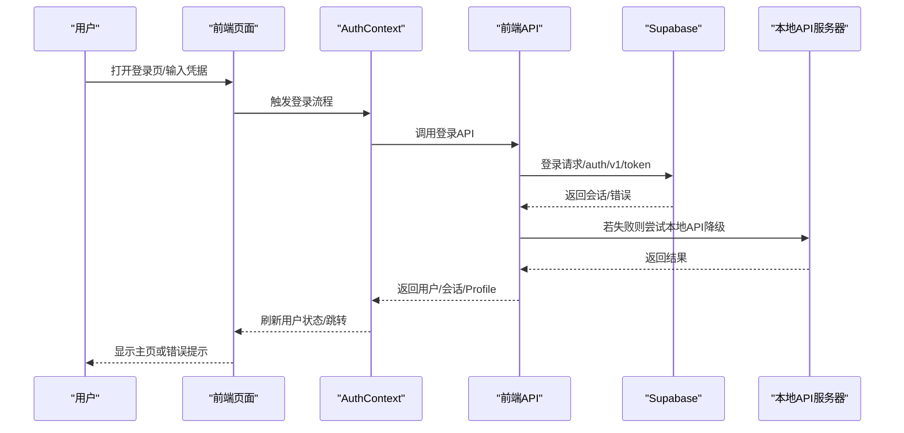
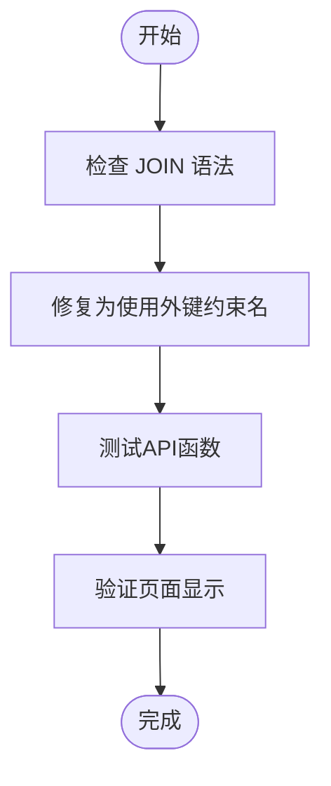
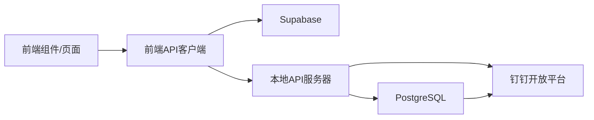

# 故障排除

<cite>
**本文引用的文件**
- [BUGFIX_SUMMARY.md](file://BUGFIX_SUMMARY.md)
- [BUGFIX_SCHEDULE_PAGE_LOADING.md](file://BUGFIX_SCHEDULE_PAGE_LOADING.md)
- [BUGFIX_DATE_PICKER.md](file://BUGFIX_DATE_PICKER.md)
- [BUGFIX_NURSE_SELECTION.md](file://BUGFIX_NURSE_SELECTION.md)
- [BUGFIX_SYSTEM_CONFIG.md](file://BUGFIX_SYSTEM_CONFIG.md)
- [登录问题排查指南.md](file://登录问题排查指南.md)
- [登录问题修复总结.md](file://登录问题修复总结.md)
- [加载问题修复说明.md](file://加载问题修复说明.md)
- [测试加载修复.md](file://测试加载修复.md)
- [Supabase配置错误修复指南.md](file://Supabase配置错误修复指南.md)
- [schedule-page-test-report.md](file://schedule-page-test-report.md)
- [钉钉同步功能验证报告.md](file://钉钉同步功能验证报告.md)
- [钉钉同步toString错误修复.md](file://钉钉同步toString错误修复.md)
- [钉钉同步人数不全问题修复.md](file://钉钉同步人数不全问题修复.md)
- [钉钉同步用户列表显示问题修复说明.md](file://钉钉同步用户列表显示问题修复说明.md)
- [钉钉同步配置测试指南.md](file://钉钉同步配置测试指南.md)
</cite>

## 目录
1. [简介](#简介)
2. [项目结构](#项目结构)
3. [核心组件](#核心组件)
4. [架构总览](#架构总览)
5. [详细组件分析](#详细组件分析)
6. [依赖关系分析](#依赖关系分析)
7. [性能考量](#性能考量)
8. [故障排除指南](#故障排除指南)
9. [结论](#结论)
10. [附录](#附录)

## 简介
本故障排除指南基于仓库内的“BUGFIX_*.md”系列文档与测试报告，系统梳理了前端、后端、数据库、钉钉集成等模块的常见问题与修复方案，并提供按模块分类的排查步骤、症状描述、根因分析、修复步骤与预防措施，帮助支持与开发团队快速定位与解决问题，显著缩短响应时间。

## 项目结构
本项目采用前后端分离架构：
- 前端：React + TypeScript + shadcn/ui 组件库，路由与权限校验位于 AuthContext，API 通过本地 API 服务器或 Supabase 客户端访问。
- 后端：Node.js + PostgreSQL，提供本地 API 服务器，负责用户管理、钉钉同步等业务接口。
- 数据库：Supabase/本地 PostgreSQL，包含资源表、排班表、用户表、钉钉同步相关表等。
- 钉钉集成：通过钉钉开放平台 API 获取部门与用户信息，支持冲突策略与日志记录。

图表来源
- [钉钉同步功能验证报告.md](file://钉钉同步功能验证报告.md#L1-L120)
- [钉钉同步toString错误修复.md](file://钉钉同步toString错误修复.md#L1-L120)
- [加载问题修复说明.md](file://加载问题修复说明.md#L1-L120)

章节来源
- [钉钉同步功能验证报告.md](file://钉钉同步功能验证报告.md#L1-L120)
- [加载问题修复说明.md](file://加载问题修复说明.md#L1-L120)

## 核心组件
- 登录与鉴权：AuthContext 负责认证初始化、用户信息刷新与路由守卫；前端 API 对 Supabase 与本地 API 进行封装与降级。
- 排班与资源：护士长排班看板、甘特图、资源筛选、视图切换等组件；后端提供预约与排班查询接口。
- 系统配置：护士/医生/房间的增删改查，后端提供对应 CRUD 接口并与数据库迁移文件配套。
- 钉钉同步：配置面板、立即同步、日志展示；后端对接钉钉 API 并落库，前端通过本地 API 获取用户列表。

章节来源
- [登录问题排查指南.md](file://登录问题排查指南.md#L1-L120)
- [登录问题修复总结.md](file://登录问题修复总结.md#L1-L120)
- [BUGFIX_SCHEDULE_PAGE_LOADING.md](file://BUGFIX_SCHEDULE_PAGE_LOADING.md#L1-L120)
- [BUGFIX_SYSTEM_CONFIG.md](file://BUGFIX_SYSTEM_CONFIG.md#L1-L120)
- [钉钉同步功能验证报告.md](file://钉钉同步功能验证报告.md#L1-L120)

## 架构总览
下图展示了登录流程与关键错误点的定位思路，结合 Supabase 配置、网络请求与前端日志进行诊断。

图表来源
- [登录问题排查指南.md](file://登录问题排查指南.md#L1-L200)
- [加载问题修复说明.md](file://加载问题修复说明.md#L1-L120)

章节来源
- [登录问题排查指南.md](file://登录问题排查指南.md#L1-L200)
- [加载问题修复说明.md](file://加载问题修复说明.md#L1-L120)

## 详细组件分析

### 排班页加载缓慢/失败
- 症状：智能排班页面提示“加载数据失败”，无法查看待排班与已排班数据。
- 根因：Supabase 查询 JOIN 语法错误，字段名被误用为表名；多个外键指向同一表时未使用外键约束名区分；部分查询函数未修复 JOIN。
- 修复：统一使用外键约束名进行关联，修复 getAppointments/getAppointmentById/getSchedules/getScheduleById 等函数；改进错误处理，输出详细日志与用户提示。
- 预防：建立 JOIN 语法规范与测试用例，避免字段名与表名混淆；对外键约束名进行单元测试。

图表来源
- [BUGFIX_SCHEDULE_PAGE_LOADING.md](file://BUGFIX_SCHEDULE_PAGE_LOADING.md#L1-L120)
- [BUGFIX_SCHEDULE_PAGE_LOADING.md](file://BUGFIX_SCHEDULE_PAGE_LOADING.md#L120-L240)

章节来源
- [BUGFIX_SCHEDULE_PAGE_LOADING.md](file://BUGFIX_SCHEDULE_PAGE_LOADING.md#L1-L240)
- [schedule-page-test-report.md](file://schedule-page-test-report.md#L1-L120)

### 日期选择器异常（点击无反应）
- 症状：预约发起页面“选择日期”按钮无响应。
- 根因：PopoverTrigger 内部错误嵌套 FormControl，导致事件传递被阻断。
- 修复：移除 FormControl 包装，将 Button 直接作为 PopoverTrigger 子元素，保持 asChild 属性。
- 预防：对触发器类组件（Popover/Dialog/DropdownMenu）进行代码审查，避免在 Trigger 内部添加额外包装。

章节来源
- [BUGFIX_DATE_PICKER.md](file://BUGFIX_DATE_PICKER.md#L1-L120)

### 护士选择下拉框为空
- 症状：护士长分配资源时护士/房间下拉框为空。
- 根因：前端调用旧 API getResources() 获取 resources 表数据，但系统已拆分为 nurses/doctors/rooms 独立表；resources 表无数据。
- 修复：更新 SchedulePage 与 GanttChart 组件，改为调用 getAvailableNurses()/getAvailableRooms()，并删除运行时过滤逻辑，使用独立状态与类型。
- 预防：数据模型变更后，同步更新所有使用该模型的前端与后端代码，建立全局搜索与回归测试。

章节来源
- [BUGFIX_NURSE_SELECTION.md](file://BUGFIX_NURSE_SELECTION.md#L1-L200)
- [BUGFIX_SUMMARY.md](file://BUGFIX_SUMMARY.md#L90-L170)

### 系统配置功能无法使用（护士/医生/房间）
- 症状：系统配置页面无法添加/编辑/删除护士、医生、房间。
- 根因：数据库缺少 nurses/doctors/rooms 表；API 未实现；前端仍调用旧 API。
- 修复：创建数据库迁移文件并应用；实现 getNurses/getDoctors/getRooms 等 CRUD API；更新前端 SystemConfigPage 使用新 API。
- 预防：前后端同步开发，先建表再实现功能；完善测试清单与回归测试。

章节来源
- [BUGFIX_SYSTEM_CONFIG.md](file://BUGFIX_SYSTEM_CONFIG.md#L1-L120)
- [BUGFIX_SUMMARY.md](file://BUGFIX_SUMMARY.md#L30-L90)

### 修正时长输入报错（类型验证错误）
- 症状：输入修正时长后提示“期望字符串，收到数字”。
- 根因：Schema 定义为字符串，Input 组件 type="number" 且 onChange 中进行 parseInt，类型不一致导致验证失败。
- 修复：将 Schema 改为 number；表单初始化与 onChange 处理改为数字类型；移除多余转换。
- 预防：统一表单字段类型与验证 Schema，避免前端与后端类型差异。

章节来源
- [BUGFIX_SUMMARY.md](file://BUGFIX_SUMMARY.md#L280-L365)

### 登录问题排查与修复
- 症状：点击登录后一直显示“登录中...”，无法进入系统。
- 根因：数据库无测试用户、登录 API 调用失败/超时、Profile 获取失败、AuthContext 初始化失败、路由跳转失败、缺少详细日志。
- 修复：添加详细日志与错误处理；优化 getCurrentUser 与 getProfileById；添加 5 秒超时保护；提供注册创建测试用户流程；完善 Network 与 Console 调试步骤。
- 预防：建立登录流程验收清单与自动化测试；加强错误提示与降级策略。

章节来源
- [登录问题排查指南.md](file://登录问题排查指南.md#L1-L200)
- [登录问题修复总结.md](file://登录问题修复总结.md#L1-L200)
- [加载问题修复说明.md](file://加载问题修复说明.md#L1-L120)
- [测试加载修复.md](file://测试加载修复.md#L1-L120)

### Supabase 配置错误（URL 无效）
- 症状：启动时报“无效的 supabaseUrl：必须是有效的 HTTP 或 HTTPS URL”。
- 根因：.env.local 中 URL 为占位值，非有效 URL。
- 修复：更新 .env.local 为有效占位值；在初始化处添加兜底逻辑与警告日志；重启前端开发服务器。
- 预防：环境变量校验与默认值兜底；启动脚本与文档指引。

章节来源
- [Supabase配置错误修复指南.md](file://Supabase配置错误修复指南.md#L1-L120)

### 钉钉同步功能（toString 错误、人数不全、用户列表不显示）
- toString 错误：根部门 parent_id 为 undefined，直接调用 toString 导致崩溃。
  - 修复：对 parent_id 与 order 字段做空值检查与默认值处理，支持根部门与所有层级部门存储。
- 人数不全：仅递归获取一级子部门，未遍历所有嵌套部门。
  - 修复：新增递归函数获取所有层级部门，增强日志输出与分页处理。
- 用户列表不显示：同步完成后未刷新前端用户列表；前端使用 Supabase 查询但直接插入用户可能受 RLS 限制；缺少钉钉用户标识。
  - 修复：添加同步完成回调触发父组件刷新；后端新增 GET /api/users；前端 getAllUsers 降级使用本地 API；同步时保存 dingtalk_userid。

章节来源
- [钉钉同步toString错误修复.md](file://钉钉同步toString错误修复.md#L1-L120)
- [钉钉同步人数不全问题修复.md](file://钉钉同步人数不全问题修复.md#L1-L120)
- [钉钉同步用户列表显示问题修复说明.md](file://钉钉同步用户列表显示问题修复说明.md#L1-L120)
- [钉钉同步功能验证报告.md](file://钉钉同步功能验证报告.md#L1-L120)

## 依赖关系分析
- 前端依赖：AuthContext 依赖前端 API；前端 API 依赖 Supabase 或本地 API；本地 API 依赖 PostgreSQL。
- 钉钉集成：后端依赖钉钉开放平台 API；数据库依赖钉钉同步相关表。
- 数据库：资源表与排班表的外键约束需与前端调用一致；RLS 策略影响查询可见性。

图表来源
- [登录问题排查指南.md](file://登录问题排查指南.md#L1-L120)
- [钉钉同步功能验证报告.md](file://钉钉同步功能验证报告.md#L1-L120)

章节来源
- [登录问题排查指南.md](file://登录问题排查指南.md#L1-L120)
- [钉钉同步功能验证报告.md](file://钉钉同步功能验证报告.md#L1-L120)

## 性能考量
- 排班页面：JOIN 语法修复后减少无效查询；建议引入数据缓存与分页查询，避免一次性加载大量数据。
- 登录流程：超时保护与错误降级提升用户体验；建议在网络不佳时提供重试与离线提示。
- 钉钉同步：递归获取部门与分页拉取用户，避免一次性请求过多；建议增加增量同步与冲突策略优化。

章节来源
- [BUGFIX_SCHEDULE_PAGE_LOADING.md](file://BUGFIX_SCHEDULE_PAGE_LOADING.md#L450-L576)
- [加载问题修复说明.md](file://加载问题修复说明.md#L200-L305)
- [钉钉同步人数不全问题修复.md](file://钉钉同步人数不全问题修复.md#L200-L277)

## 故障排除指南

### 前端模块
- 排班页加载失败
  - 步骤：检查 Network 标签中的查询请求；查看 Console 错误；确认 JOIN 语法修复与错误处理已生效。
  - 预防：为 JOIN 语法编写单元测试；建立回归测试。
  - 参考：[BUGFIX_SCHEDULE_PAGE_LOADING.md](file://BUGFIX_SCHEDULE_PAGE_LOADING.md#L1-L240)
- 日期选择器无响应
  - 步骤：移除 PopoverTrigger 内部 FormControl；确认 asChild 属性正确使用。
  - 预防：触发器组件避免在 Trigger 内部添加额外包装。
  - 参考：[BUGFIX_DATE_PICKER.md](file://BUGFIX_DATE_PICKER.md#L1-L120)
- 护士/房间下拉框为空
  - 步骤：确认已应用 nurses/doctors/rooms 表迁移；前端使用 getAvailableNurses/getAvailableRooms；删除运行时过滤。
  - 预防：数据模型变更后同步更新所有前端调用。
  - 参考：[BUGFIX_NURSE_SELECTION.md](file://BUGFIX_NURSE_SELECTION.md#L1-L200)
- 修正时长输入报错
  - 步骤：将 Schema 改为 number；统一表单字段类型与验证。
  - 参考：[BUGFIX_SUMMARY.md](file://BUGFIX_SUMMARY.md#L280-L365)

章节来源
- [BUGFIX_SCHEDULE_PAGE_LOADING.md](file://BUGFIX_SCHEDULE_PAGE_LOADING.md#L1-L240)
- [BUGFIX_DATE_PICKER.md](file://BUGFIX_DATE_PICKER.md#L1-L120)
- [BUGFIX_NURSE_SELECTION.md](file://BUGFIX_NURSE_SELECTION.md#L1-L200)
- [BUGFIX_SUMMARY.md](file://BUGFIX_SUMMARY.md#L280-L365)

### 后端模块
- 登录卡住/超时
  - 步骤：查看 AuthContext 初始化日志；检查 getCurrentUser 与 getProfileById 错误处理；确认 5 秒超时保护。
  - 预防：添加性能监控与重试机制。
  - 参考：[加载问题修复说明.md](file://加载问题修复说明.md#L1-L120)
- Supabase 配置错误
  - 步骤：检查 .env.local 中 URL 与 ANON_KEY；使用占位值兜底；重启前端开发服务器。
  - 参考：[Supabase配置错误修复指南.md](file://Supabase配置错误修复指南.md#L1-L120)
- 钉钉同步异常
  - toString 错误：对 parent_id 与 order 做空值检查与默认值处理。
    - 参考：[钉钉同步toString错误修复.md](file://钉钉同步toString错误修复.md#L1-L120)
  - 人数不全：递归获取所有层级部门，增强日志与分页处理。
    - 参考：[钉钉同步人数不全问题修复.md](file://钉钉同步人数不全问题修复.md#L1-L120)
  - 用户列表不显示：添加同步完成回调、使用本地 API 获取用户、保存 dingtalk_userid。
    - 参考：[钉钉同步用户列表显示问题修复说明.md](file://钉钉同步用户列表显示问题修复说明.md#L1-L120)

章节来源
- [加载问题修复说明.md](file://加载问题修复说明.md#L1-L120)
- [Supabase配置错误修复指南.md](file://Supabase配置错误修复指南.md#L1-L120)
- [钉钉同步toString错误修复.md](file://钉钉同步toString错误修复.md#L1-L120)
- [钉钉同步人数不全问题修复.md](file://钉钉同步人数不全问题修复.md#L1-L120)
- [钉钉同步用户列表显示问题修复说明.md](file://钉钉同步用户列表显示问题修复说明.md#L1-L120)

### 数据库模块
- 外键约束错误
  - 步骤：确认 schedules 表外键指向 nurses/rooms；应用迁移修复约束。
  - 参考：[BUGFIX_SUMMARY.md](file://BUGFIX_SUMMARY.md#L170-L240)
- 表结构缺失
  - 步骤：确认 nurses/doctors/rooms 表存在；应用迁移并插入初始数据。
  - 参考：[BUGFIX_SYSTEM_CONFIG.md](file://BUGFIX_SYSTEM_CONFIG.md#L1-L120)

章节来源
- [BUGFIX_SUMMARY.md](file://BUGFIX_SUMMARY.md#L170-L240)
- [BUGFIX_SYSTEM_CONFIG.md](file://BUGFIX_SYSTEM_CONFIG.md#L1-L120)

### 钉钉集成模块
- 配置测试
  - 步骤：以超级管理员登录；填写 AppKey/AppSecret/AgentId/CorpId；保存配置；验证数据库写入与权限。
  - 参考：[钉钉同步配置测试指南.md](file://钉钉同步配置测试指南.md#L1-L120)
- 同步验证
  - 步骤：立即同步；查看同步日志与用户统计；核对数据库用户数量与部门映射。
  - 参考：[钉钉同步功能验证报告.md](file://钉钉同步功能验证报告.md#L1-L120)

章节来源
- [钉钉同步配置测试指南.md](file://钉钉同步配置测试指南.md#L1-L120)
- [钉钉同步功能验证报告.md](file://钉钉同步功能验证报告.md#L1-L120)

## 结论
本指南基于仓库内已发布的修复文档与测试报告，按模块梳理了常见问题的根因、修复与预防措施。建议在日常运维中：
- 建立完善的日志与错误提示体系；
- 对关键流程（登录、同步、数据加载）进行自动化测试；
- 在数据模型变更后进行全链路回归；
- 为触发器类组件与数据库约束建立规范与测试用例。

## 附录
- 快速启动与验证清单
  - 启动本地服务：参考启动脚本与健康检查端点。
  - 登录验证：使用注册创建测试用户，观察 Console 日志与 Network 请求。
  - 钉钉同步：配置保存后立即同步，查看日志与用户列表变化。
- 常用诊断命令
  - 健康检查：curl http://localhost:3001/api/health
  - 用户列表：curl http://localhost:3001/api/users | jq 'length'