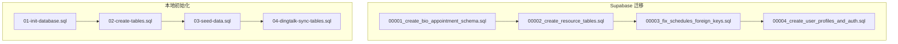
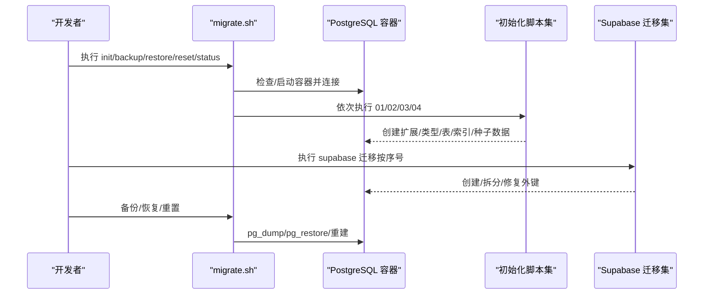
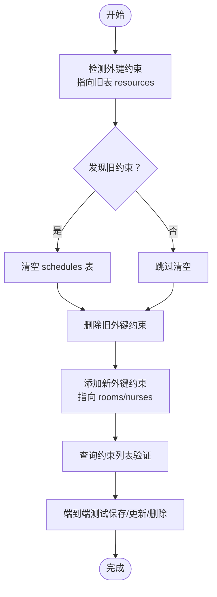
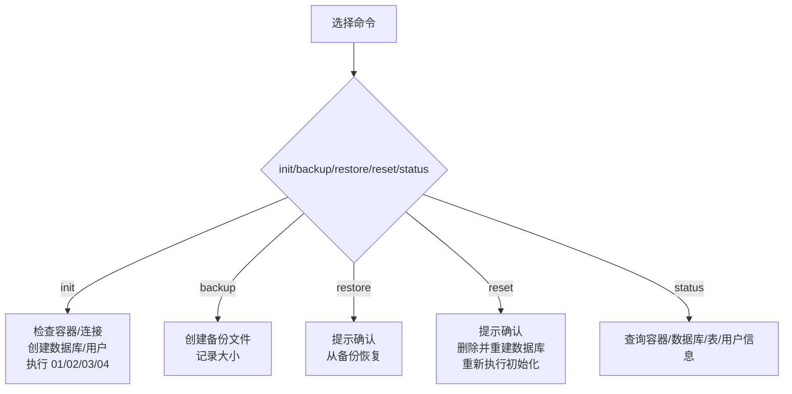
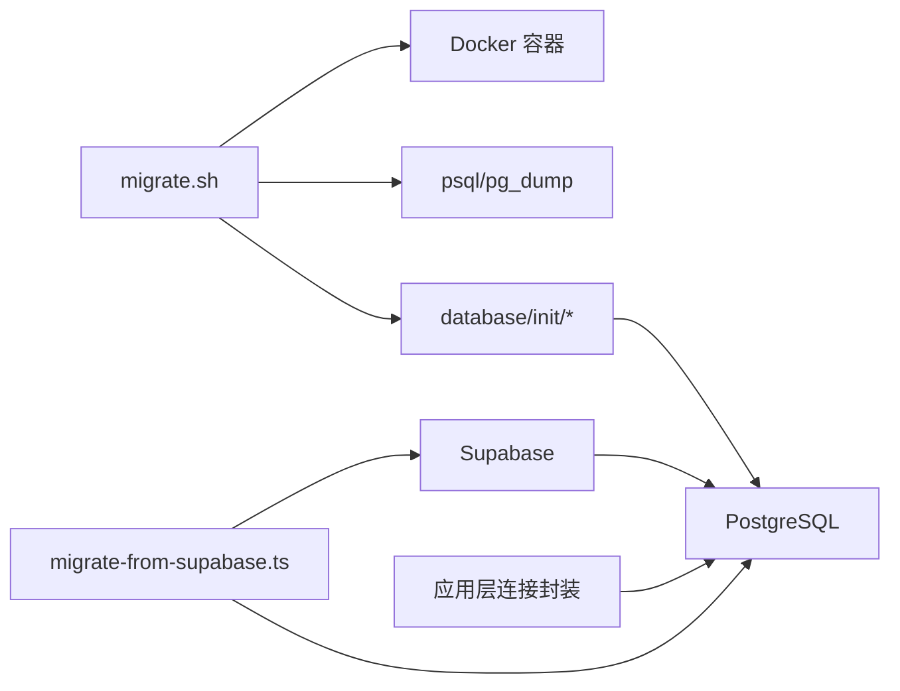

# 数据库问题

<cite>
**本文引用的文件**
- [database/migrate.sh](file://database/migrate.sh)
- [BUGFIX_FOREIGN_KEY_CONSTRAINT.md](file://BUGFIX_FOREIGN_KEY_CONSTRAINT.md)
- [supabase/migrations/00003_fix_schedules_foreign_keys.sql](file://supabase/migrations/00003_fix_schedules_foreign_keys.sql)
- [database/init/01-init-database.sql](file://database/init/01-init-database.sql)
- [database/init/02-create-tables.sql](file://database/init/02-create-tables.sql)
- [database/init/03-seed-data.sql](file://database/init/03-seed-data.sql)
- [database/init/04-dingtalk-sync-tables.sql](file://database/init/04-dingtalk-sync-tables.sql)
- [supabase/migrations/00001_create_bio_appointment_schema.sql](file://supabase/migrations/00001_create_bio_appointment_schema.sql)
- [supabase/migrations/00002_create_resource_tables.sql](file://supabase/migrations/00002_create_resource_tables.sql)
- [supabase/migrations/00004_create_user_profiles_and_auth.sql](file://supabase/migrations/00004_create_user_profiles_and_auth.sql)
- [scripts/migrate-from-supabase.ts](file://scripts/migrate-from-supabase.ts)
- [src/db/connection.ts](file://src/db/connection.ts)
- [server/src/db/connection.js](file://server/src/db/connection.js)
</cite>

## 目录
1. [简介](#简介)
2. [项目结构](#项目结构)
3. [核心组件](#核心组件)
4. [架构总览](#架构总览)
5. [详细组件分析](#详细组件分析)
6. [依赖分析](#依赖分析)
7. [性能考量](#性能考量)
8. [故障排查指南](#故障排查指南)
9. [结论](#结论)
10. [附录](#附录)

## 简介
本文件聚焦数据库相关故障的系统化文档，围绕外键约束冲突、迁移脚本执行失败、数据不一致等典型问题展开。基于仓库中的“外键约束错误修复”案例，解释因表结构变更未同步、种子数据不合规或迁移脚本顺序错误导致的数据库异常；并提供使用 migrate.sh 脚本进行回滚与重试的操作指南，分析 supabase/migrations 与 database/init 中 SQL 脚本的差异；说明如何通过日志追踪 DDL 执行过程、验证约束完整性，并给出预防未来迁移冲突的最佳实践与 PostgreSQL 错误码解读及调试技巧。

## 项目结构
数据库初始化与迁移由两套机制共同构成：
- supabase/migrations：Supabase 风格的增量迁移集合，按序号递增，描述从单表模式到多表模式的演进。
- database/init：本地初始化脚本集合，负责扩展安装、类型定义、基础表与种子数据、以及钉钉同步相关表的创建与索引。

图表来源
- [supabase/migrations/00001_create_bio_appointment_schema.sql](file://supabase/migrations/00001_create_bio_appointment_schema.sql#L1-L281)
- [supabase/migrations/00002_create_resource_tables.sql](file://supabase/migrations/00002_create_resource_tables.sql#L1-L182)
- [supabase/migrations/00003_fix_schedules_foreign_keys.sql](file://supabase/migrations/00003_fix_schedules_foreign_keys.sql#L1-L67)
- [supabase/migrations/00004_create_user_profiles_and_auth.sql](file://supabase/migrations/00004_create_user_profiles_and_auth.sql#L1-L207)
- [database/init/01-init-database.sql](file://database/init/01-init-database.sql#L1-L112)
- [database/init/02-create-tables.sql](file://database/init/02-create-tables.sql#L1-L274)
- [database/init/03-seed-data.sql](file://database/init/03-seed-data.sql#L1-L77)
- [database/init/04-dingtalk-sync-tables.sql](file://database/init/04-dingtalk-sync-tables.sql#L1-L131)

章节来源
- [database/migrate.sh](file://database/migrate.sh#L1-L233)
- [supabase/migrations/00001_create_bio_appointment_schema.sql](file://supabase/migrations/00001_create_bio_appointment_schema.sql#L1-L281)
- [supabase/migrations/00002_create_resource_tables.sql](file://supabase/migrations/00002_create_resource_tables.sql#L1-L182)
- [supabase/migrations/00003_fix_schedules_foreign_keys.sql](file://supabase/migrations/00003_fix_schedules_foreign_keys.sql#L1-L67)
- [supabase/migrations/00004_create_user_profiles_and_auth.sql](file://supabase/migrations/00004_create_user_profiles_and_auth.sql#L1-L207)
- [database/init/01-init-database.sql](file://database/init/01-init-database.sql#L1-L112)
- [database/init/02-create-tables.sql](file://database/init/02-create-tables.sql#L1-L274)
- [database/init/03-seed-data.sql](file://database/init/03-seed-data.sql#L1-L77)
- [database/init/04-dingtalk-sync-tables.sql](file://database/init/04-dingtalk-sync-tables.sql#L1-L131)

## 核心组件
- 外键约束修复脚本：针对 schedules 表的 room_id/nurse_id 引用旧表 resources 的问题，统一更新为指向 rooms/nurses。
- 本地迁移脚本：提供容器内 PostgreSQL 初始化、数据库与用户创建、初始化脚本执行、备份/恢复/重置等能力。
- Supabase 迁移集合：描述从单表模式到多表模式的演进路径，包含资源表拆分、用户与权限体系、以及外键修复。
- 数据导入脚本：从 Supabase 导出数据并导入本地数据库，提供备份、校验与报告生成。
- 数据库连接与事务封装：提供查询、事务、健康检查、连接池管理等能力，便于定位数据库层面问题。

章节来源
- [BUGFIX_FOREIGN_KEY_CONSTRAINT.md](file://BUGFIX_FOREIGN_KEY_CONSTRAINT.md#L1-L715)
- [supabase/migrations/00003_fix_schedules_foreign_keys.sql](file://supabase/migrations/00003_fix_schedules_foreign_keys.sql#L1-L67)
- [database/migrate.sh](file://database/migrate.sh#L1-L233)
- [scripts/migrate-from-supabase.ts](file://scripts/migrate-from-supabase.ts#L1-L355)
- [src/db/connection.ts](file://src/db/connection.ts#L1-L324)
- [server/src/db/connection.js](file://server/src/db/connection.js#L59-L270)

## 架构总览
数据库初始化与迁移的总体流程如下：
- Supabase 迁移：按序号顺序执行，逐步完成 schema 创建、资源表拆分、用户与权限、外键修复。
- 本地初始化：先安装扩展与类型，再创建表与索引，最后填充种子数据与钉钉同步相关表。
- 迁移脚本：提供一键初始化、备份、恢复、重置、状态查询等运维能力。
- 数据导入：从 Supabase 导出数据，按列过滤与类型转换后导入本地数据库，支持校验与报告。

图表来源
- [database/migrate.sh](file://database/migrate.sh#L1-L233)
- [database/init/01-init-database.sql](file://database/init/01-init-database.sql#L1-L112)
- [database/init/02-create-tables.sql](file://database/init/02-create-tables.sql#L1-L274)
- [database/init/03-seed-data.sql](file://database/init/03-seed-data.sql#L1-L77)
- [database/init/04-dingtalk-sync-tables.sql](file://database/init/04-dingtalk-sync-tables.sql#L1-L131)
- [supabase/migrations/00001_create_bio_appointment_schema.sql](file://supabase/migrations/00001_create_bio_appointment_schema.sql#L1-L281)
- [supabase/migrations/00002_create_resource_tables.sql](file://supabase/migrations/00002_create_resource_tables.sql#L1-L182)
- [supabase/migrations/00003_fix_schedules_foreign_keys.sql](file://supabase/migrations/00003_fix_schedules_foreign_keys.sql#L1-L67)
- [supabase/migrations/00004_create_user_profiles_and_auth.sql](file://supabase/migrations/00004_create_user_profiles_and_auth.sql#L1-L207)

## 详细组件分析

### 外键约束冲突案例与修复
- 问题现象：插入 schedules 时违反外键约束，指向旧表 resources 的 ID 不存在于新表 rooms/nurses。
- 根本原因：schedules 表的外键约束未随表结构从单表模式升级为多表模式而同步更新。
- 修复步骤：清空现有 schedules 数据，删除旧外键约束，添加指向 rooms/nurses 的新外键约束。
- 验证方法：查询约束列表，确认指向表已更新；端到端测试保存/更新/删除排班功能。
- 预防措施：结构变更时全面扫描并更新所有外键约束；增加迁移后验证脚本。

图表来源
- [BUGFIX_FOREIGN_KEY_CONSTRAINT.md](file://BUGFIX_FOREIGN_KEY_CONSTRAINT.md#L1-L715)
- [supabase/migrations/00003_fix_schedules_foreign_keys.sql](file://supabase/migrations/00003_fix_schedules_foreign_keys.sql#L1-L67)

章节来源
- [BUGFIX_FOREIGN_KEY_CONSTRAINT.md](file://BUGFIX_FOREIGN_KEY_CONSTRAINT.md#L1-L715)
- [supabase/migrations/00003_fix_schedules_foreign_keys.sql](file://supabase/migrations/00003_fix_schedules_foreign_keys.sql#L1-L67)

### 迁移脚本执行失败与顺序问题
- 常见失败场景：
  - 依赖表未创建：先执行依赖外键的表，后执行被引用表。
  - 类型/扩展缺失：未先执行 01-init-database.sql 安装扩展与自定义类型。
  - 种子数据不合规：ID 冲突或枚举值非法导致插入失败。
- 预防与诊断：
  - 严格遵循 database/init 顺序：01→02→03→04。
  - 使用 migrate.sh status 快速检查数据库状态与表数量。
  - 使用 Supabase 迁移顺序：00001→00002→00003→00004。

章节来源
- [database/migrate.sh](file://database/migrate.sh#L1-L233)
- [database/init/01-init-database.sql](file://database/init/01-init-database.sql#L1-L112)
- [database/init/02-create-tables.sql](file://database/init/02-create-tables.sql#L1-L274)
- [database/init/03-seed-data.sql](file://database/init/03-seed-data.sql#L1-L77)
- [database/init/04-dingtalk-sync-tables.sql](file://database/init/04-dingtalk-sync-tables.sql#L1-L131)
- [supabase/migrations/00001_create_bio_appointment_schema.sql](file://supabase/migrations/00001_create_bio_appointment_schema.sql#L1-L281)
- [supabase/migrations/00002_create_resource_tables.sql](file://supabase/migrations/00002_create_resource_tables.sql#L1-L182)
- [supabase/migrations/00003_fix_schedules_foreign_keys.sql](file://supabase/migrations/00003_fix_schedules_foreign_keys.sql#L1-L67)
- [supabase/migrations/00004_create_user_profiles_and_auth.sql](file://supabase/migrations/00004_create_user_profiles_and_auth.sql#L1-L207)

### 数据不一致与种子数据问题
- 问题表现：插入种子数据时报冲突或字段类型不匹配。
- 诊断要点：检查 ON CONFLICT 子句、字段类型与长度、枚举值范围。
- 修复建议：在导入前清理目标表，或在迁移中使用幂等插入策略。

章节来源
- [database/init/03-seed-data.sql](file://database/init/03-seed-data.sql#L1-L77)
- [database/init/02-create-tables.sql](file://database/init/02-create-tables.sql#L1-L274)

### 使用 migrate.sh 进行回滚与重试
- 初始化数据库：自动检查容器、创建数据库与用户、按顺序执行初始化脚本。
- 备份数据库：导出当前数据库为 SQL 文件，便于回滚与审计。
- 恢复数据库：从备份文件恢复到当前数据库，注意确认提示。
- 重置数据库：删除并重建数据库，重新执行初始化脚本。
- 状态查询：显示容器运行状态、数据库大小、表数量、用户数量等。

图表来源
- [database/migrate.sh](file://database/migrate.sh#L1-L233)

章节来源
- [database/migrate.sh](file://database/migrate.sh#L1-L233)

### Supabase 迁移与 database/init 的差异
- Supabase 迁移侧重业务演进与权限模型，强调多表模式与外键修复。
- database/init 更偏向本地开发环境的快速搭建，包含扩展、类型、表与索引、种子数据与钉钉同步表。
- 差异点：
  - 类型定义：init 中自定义枚举类型，Supabase 迁移中也定义了用户角色等类型。
  - 表结构：Supabase 迁移早期包含单表模式下的 schedules 与 resources；后期拆分为 rooms/nurses。
  - 钉钉同步：init 提供同步配置、日志与映射表；Supabase 迁移中也有相关表的创建与更新。

章节来源
- [supabase/migrations/00001_create_bio_appointment_schema.sql](file://supabase/migrations/00001_create_bio_appointment_schema.sql#L1-L281)
- [supabase/migrations/00002_create_resource_tables.sql](file://supabase/migrations/00002_create_resource_tables.sql#L1-L182)
- [supabase/migrations/00003_fix_schedules_foreign_keys.sql](file://supabase/migrations/00003_fix_schedules_foreign_keys.sql#L1-L67)
- [supabase/migrations/00004_create_user_profiles_and_auth.sql](file://supabase/migrations/00004_create_user_profiles_and_auth.sql#L1-L207)
- [database/init/01-init-database.sql](file://database/init/01-init-database.sql#L1-L112)
- [database/init/02-create-tables.sql](file://database/init/02-create-tables.sql#L1-L274)
- [database/init/03-seed-data.sql](file://database/init/03-seed-data.sql#L1-L77)
- [database/init/04-dingtalk-sync-tables.sql](file://database/init/04-dingtalk-sync-tables.sql#L1-L131)

### 日志追踪 DDL 执行与约束验证
- DDL 执行追踪：
  - migrate.sh 在执行每个 SQL 脚本时输出状态信息，便于定位失败位置。
  - Supabase 迁移脚本本身不输出详细日志，可在执行前开启数据库日志或使用客户端工具查看。
- 约束完整性验证：
  - 使用查询约束列表的方法核对 schedules 的外键指向是否正确。
  - 通过端到端测试（保存/更新/删除）验证约束生效。

章节来源
- [database/migrate.sh](file://database/migrate.sh#L1-L233)
- [BUGFIX_FOREIGN_KEY_CONSTRAINT.md](file://BUGFIX_FOREIGN_KEY_CONSTRAINT.md#L1-L715)

### PostgreSQL 错误码解读与调试技巧
- 外键约束冲突常见错误信息与含义：
  - 违反外键约束：通常出现在插入或更新时，引用的 ID 在被引用表中不存在。
  - 解决思路：确认被引用表是否存在对应 ID；检查迁移顺序与约束指向是否正确。
- 调试技巧：
  - 使用数据库连接池与事务封装，结合日志输出定位具体查询耗时与错误上下文。
  - 在应用层捕获数据库错误，转换为用户友好的提示并记录详细日志。
  - 使用健康检查与连接池管理，避免连接泄漏与超时。

章节来源
- [src/db/connection.ts](file://src/db/connection.ts#L1-L324)
- [server/src/db/connection.js](file://server/src/db/connection.js#L59-L270)

## 依赖分析
- 组件耦合关系：
  - migrate.sh 依赖 Docker 容器与 psql/pg_dump 工具，顺序执行初始化脚本。
  - Supabase 迁移与 database/init 在逻辑上互补：前者关注业务演进，后者关注本地快速搭建。
  - 数据导入脚本依赖 Supabase 客户端与本地数据库连接，按列过滤与类型转换后导入。
- 潜在循环依赖：
  - 无直接循环依赖；迁移脚本之间通过顺序编号保证依赖关系清晰。
- 外部依赖：
  - PostgreSQL 扩展（uuid-ossp、pgcrypto、btree_gin、btree_gist）。
  - Redis（可选，用于缓存与会话）。

图表来源
- [database/migrate.sh](file://database/migrate.sh#L1-L233)
- [scripts/migrate-from-supabase.ts](file://scripts/migrate-from-supabase.ts#L1-L355)
- [src/db/connection.ts](file://src/db/connection.ts#L1-L324)

章节来源
- [database/migrate.sh](file://database/migrate.sh#L1-L233)
- [scripts/migrate-from-supabase.ts](file://scripts/migrate-from-supabase.ts#L1-L355)
- [src/db/connection.ts](file://src/db/connection.ts#L1-L324)

## 性能考量
- 外键约束带来的性能影响：
  - 插入/更新时需在被引用表中进行查询，但主键索引可保证查询效率。
  - 在高频写入场景下，适度的索引与批量写入策略有助于降低开销。
- 索引与触发器：
  - 初始化脚本为关键表创建了大量索引与更新时间触发器，提升查询与审计能力。
- 迁移性能：
  - 大表迁移建议分批导入与索引重建策略，减少锁竞争与长时间阻塞。

章节来源
- [BUGFIX_FOREIGN_KEY_CONSTRAINT.md](file://BUGFIX_FOREIGN_KEY_CONSTRAINT.md#L1-L715)
- [database/init/02-create-tables.sql](file://database/init/02-create-tables.sql#L1-L274)

## 故障排查指南
- 外键约束冲突
  - 现象：插入 schedules 报外键约束违反。
  - 排查：确认 schedules 的 room_id/nurse_id 是否仍指向 resources；若指向旧表，执行外键修复迁移。
  - 验证：查询约束列表，确认指向 rooms/nurses；端到端测试保存/更新/删除。
- 迁移脚本执行失败
  - 现象：某一步骤报错（如类型不存在、表未创建、种子数据冲突）。
  - 排查：检查执行顺序与前置条件；使用 migrate.sh status 检查数据库状态。
  - 重试：先备份，再重置数据库并重新初始化。
- 数据不一致
  - 现象：导入后记录数不一致或字段类型异常。
  - 排查：检查 ON CONFLICT 与字段类型；必要时清理目标表后重新导入。
- 日志与监控
  - 应用层：使用连接封装的日志输出定位错误上下文。
  - 运维层：使用 migrate.sh 备份/恢复/重置；Supabase 迁移后进行约束验证。

章节来源
- [BUGFIX_FOREIGN_KEY_CONSTRAINT.md](file://BUGFIX_FOREIGN_KEY_CONSTRAINT.md#L1-L715)
- [database/migrate.sh](file://database/migrate.sh#L1-L233)
- [scripts/migrate-from-supabase.ts](file://scripts/migrate-from-supabase.ts#L1-L355)
- [src/db/connection.ts](file://src/db/connection.ts#L1-L324)

## 结论
本项目通过 Supabase 迁移与本地初始化脚本双轨并行，实现了从单表模式到多表模式的平滑演进。针对外键约束冲突、迁移顺序错误与数据不一致等典型问题，提供了明确的修复路径与预防策略。借助 migrate.sh 的运维能力与应用层连接封装的日志输出，能够快速定位问题并进行回滚与重试。建议在后续迁移中严格执行结构变更审查、约束一致性检查与端到端验证，以降低数据库异常风险。

## 附录
- 常用命令与操作
  - 初始化：./database/migrate.sh init
  - 备份：./database/migrate.sh backup
  - 恢复：./database/migrate.sh restore 备份文件
  - 重置：./database/migrate.sh reset
  - 状态：./database/migrate.sh status
- Supabase 迁移顺序
  - 00001 → 00002 → 00003 → 00004
- 本地初始化顺序
  - 01 → 02 → 03 → 04