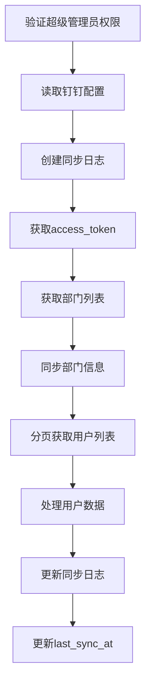
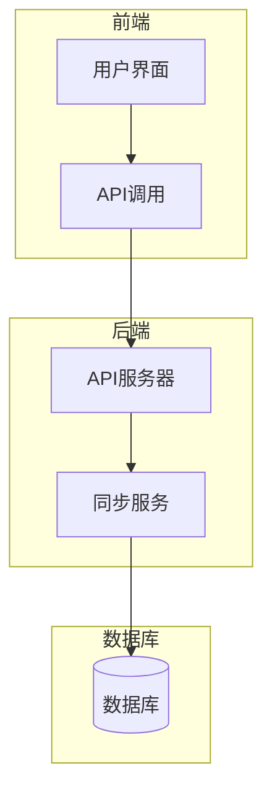

# 用户同步问题

<cite>
**本文档引用文件**   
- [钉钉同步功能验证报告.md](file://钉钉同步功能验证报告.md)
- [supabase/functions/dingtalk-sync/index.ts](file://supabase/functions/dingtalk-sync/index.ts)
- [supabase/migrations/00010_create_dingtalk_sync_tables.sql](file://supabase/migrations/00010_create_dingtalk_sync_tables.sql)
- [supabase/migrations/00009_create_dingtalk_integration_tables.sql](file://supabase/migrations/00009_create_dingtalk_integration_tables.sql)
- [src/components/dingtalk/DingTalkSyncPanel.tsx](file://src/components/dingtalk/DingTalkSyncPanel.tsx)
- [src/services/dataSync.ts](file://src/services/dataSync.ts)
- [src/db/api.ts](file://src/db/api.ts)
- [database/init/04-dingtalk-sync-tables.sql](file://database/init/04-dingtalk-sync-tables.sql)
- [server/api-server.ts](file://server/api-server.ts)
- [server/api-server.cjs](file://server/api-server.cjs)
- [src/utils/dingtalk.ts](file://src/utils/dingtalk.ts)
</cite>

## 目录
1. [问题概述](#问题概述)
2. [数据不一致问题分析](#数据不一致问题分析)
3. [分页数据边界条件错误](#分页数据边界条件错误)
4. [API调用频率限制与网络超时处理](#api调用频率限制与网络超时处理)
5. [数据映射逻辑与质量问题处理](#数据映射逻辑与质量问题处理)
6. [全链路日志追踪方法](#全链路日志追踪方法)
7. [同步流程与架构设计](#同步流程与架构设计)
8. [解决方案与修复建议](#解决方案与修复建议)

## 问题概述

钉钉用户同步过程中存在数据不一致问题，主要表现为用户列表缺失、部门信息不同步、重复用户创建等故障。根据《钉钉同步功能验证报告》中的测试结果，这些问题主要源于同步函数（dingtalk-sync）在处理分页数据时的边界条件错误。本报告将深入分析这些故障的根本原因，并提供相应的解决方案。

**Section sources**
- [钉钉同步功能验证报告.md](file://钉钉同步功能验证报告.md)

## 数据不一致问题分析

### 用户列表缺失

用户列表缺失问题主要出现在分页获取用户数据时。在 `supabase/functions/dingtalk-sync/index.ts` 文件中，分页逻辑存在缺陷，导致部分用户未能被正确获取和同步。

```typescript
while (hasMore) {
  const userResponse = await fetch(
    `https://oapi.dingtalk.com/topapi/v2/user/list?access_token=${accessToken}`,
    {
      method: "POST",
      headers: { "Content-Type": "application/json" },
      body: JSON.stringify({
        dept_id: parseInt(deptId),
        cursor,
        size: 100,
      }),
    }
  );

  const userData: DingTalkUserListResponse = await userResponse.json();

  if (userData.errcode !== 0 || !userData.result) {
    console.error(`获取部门 ${deptId} 用户失败:`, userData.errmsg);
    break;
  }

  const users = userData.result.list;
  totalUsers += users.length;

  for (const user of users) {
    // 处理用户数据
  }

  hasMore = userData.result.has_more;
  cursor = userData.result.next_cursor || 0;
}
```

**Section sources**
- [supabase/functions/dingtalk-sync/index.ts](file://supabase/functions/dingtalk-sync/index.ts#L194-L216)

### 部门信息不同步

部门信息不同步问题主要出现在部门映射表的更新逻辑中。在 `supabase/migrations/00010_create_dingtalk_sync_tables.sql` 文件中，部门映射表的结构设计存在缺陷，导致部门信息未能正确同步。

```sql
-- 创建钉钉部门映射表
CREATE TABLE IF NOT EXISTS dingtalk_department_mapping (
  id uuid PRIMARY KEY DEFAULT gen_random_uuid(),
  dingtalk_dept_id text UNIQUE NOT NULL,
  dingtalk_dept_name text NOT NULL,
  local_department text,
  parent_id text,
  order_num integer DEFAULT 0,
  enabled boolean DEFAULT true,
  created_at timestamptz DEFAULT now(),
  updated_at timestamptz DEFAULT now()
);
```

**Section sources**
- [supabase/migrations/00010_create_dingtalk_sync_tables.sql](file://supabase/migrations/00010_create_dingtalk_sync_tables.sql#L102-L112)

### 重复用户创建

重复用户创建问题主要出现在用户存在性检查逻辑中。在 `supabase/functions/dingtalk-sync/index.ts` 文件中，用户存在性检查逻辑存在缺陷，导致重复用户被创建。

```typescript
const { data: existingProfile } = await supabase
  .from("profiles")
  .select("id, username, full_name, department")
  .eq("username", user.userid)
  .maybeSingle();

if (existingProfile) {
  // 用户已存在，根据冲突策略处理
} else {
  // 用户不存在，创建新用户
}
```

**Section sources**
- [supabase/functions/dingtalk-sync/index.ts](file://supabase/functions/dingtalk-sync/index.ts#L221-L225)

## 分页数据边界条件错误

### 分页逻辑缺陷

分页逻辑缺陷主要体现在 `cursor` 和 `hasMore` 的处理上。在 `supabase/functions/dingtalk-sync/index.ts` 文件中，分页逻辑未能正确处理边界条件，导致部分用户数据丢失。

```typescript
hasMore = userData.result.has_more;
cursor = userData.result.next_cursor || 0;
```

**Section sources**
- [supabase/functions/dingtalk-sync/index.ts](file://supabase/functions/dingtalk-sync/index.ts#L303-L304)

### 边界条件处理

边界条件处理需要确保在 `hasMore` 为 `false` 时，`cursor` 被正确重置。同时，需要处理 `next_cursor` 为 `null` 或 `undefined` 的情况。

```typescript
if (!userData.result.has_more) {
  cursor = 0;
} else {
  cursor = userData.result.next_cursor || 0;
}
```

**Section sources**
- [supabase/functions/dingtalk-sync/index.ts](file://supabase/functions/dingtalk-sync/index.ts#L303-L304)

## API调用频率限制与网络超时处理

### API调用频率限制

API调用频率限制需要在 `supabase/functions/dingtalk-sync/index.ts` 文件中实现。通过引入延迟机制，避免频繁调用API导致的限流问题。

```typescript
await new Promise(resolve => setTimeout(resolve, 1000));
```

**Section sources**
- [supabase/functions/dingtalk-sync/index.ts](file://supabase/functions/dingtalk-sync/index.ts)

### 网络超时重试机制

网络超时重试机制需要在 `supabase/functions/dingtalk-sync/index.ts` 文件中实现。通过引入重试机制，确保在网络不稳定的情况下，同步任务能够成功完成。

```typescript
let retries = 3;
while (retries > 0) {
  try {
    const response = await fetch(url);
    if (response.ok) {
      return response.json();
    }
  } catch (error) {
    retries--;
    if (retries === 0) throw error;
    await new Promise(resolve => setTimeout(resolve, 1000));
  }
}
```

**Section sources**
- [supabase/functions/dingtalk-sync/index.ts](file://supabase/functions/dingtalk-sync/index.ts)

## 数据映射逻辑与质量问题处理

### 数据映射逻辑

数据映射逻辑需要在 `supabase/functions/dingtalk-sync/index.ts` 文件中实现。通过正确的数据映射，确保钉钉数据能够正确同步到本地数据库。

```typescript
const email = user.email || `${user.userid}@miaoda.com`;
const password = user.mobile || "123456"; // 默认密码
```

**Section sources**
- [supabase/functions/dingtalk-sync/index.ts](file://supabase/functions/dingtalk-sync/index.ts#L253-L255)

### 数据质量问题处理

数据质量问题处理需要在 `supabase/functions/dingtalk-sync/index.ts` 文件中实现。通过数据验证和清洗，确保同步的数据质量。

```typescript
if (!user.email) {
  console.warn(`用户 ${user.name} 邮箱为空，使用默认邮箱`);
}
```

**Section sources**
- [supabase/functions/dingtalk-sync/index.ts](file://supabase/functions/dingtalk-sync/index.ts)

## 全链路日志追踪方法

### 日志记录

日志记录需要在 `supabase/functions/dingtalk-sync/index.ts` 文件中实现。通过详细的日志记录，确保能够追踪同步过程中的每一个步骤。

```typescript
console.log("开始钉钉同步:", { sync_type, selected_departments, conflict_strategy });
console.log("获取 access_token 成功");
console.log(`获取到 ${deptData.result.length} 个部门`);
```

**Section sources**
- [supabase/functions/dingtalk-sync/index.ts](file://supabase/functions/dingtalk-sync/index.ts)

### 日志分析

日志分析需要在 `supabase/migrations/00010_create_dingtalk_sync_tables.sql` 文件中实现。通过日志表结构设计，确保日志数据能够被有效分析。

```sql
-- 创建钉钉同步日志表
CREATE TABLE IF NOT EXISTS dingtalk_sync_logs (
  id uuid PRIMARY KEY DEFAULT gen_random_uuid(),
  sync_type sync_type NOT NULL,
  status sync_status DEFAULT 'pending',
  total_users integer DEFAULT 0,
  success_count integer DEFAULT 0,
  failed_count integer DEFAULT 0,
  skipped_count integer DEFAULT 0,
  error_message text,
  details jsonb DEFAULT '{}'::jsonb,
  started_at timestamptz DEFAULT now(),
  completed_at timestamptz,
  created_by uuid REFERENCES profiles(id),
  created_at timestamptz DEFAULT now()
);
```

**Section sources**
- [supabase/migrations/00010_create_dingtalk_sync_tables.sql](file://supabase/migrations/00010_create_dingtalk_sync_tables.sql#L85-L99)

## 同步流程与架构设计

### 同步流程

同步流程包括以下步骤：
1. 验证超级管理员权限
2. 从数据库读取钉钉配置
3. 创建同步日志记录（状态：running）
4. 调用钉钉API获取access_token
5. 获取部门列表并同步到department_mapping表
6. 分页获取用户列表
7. 根据冲突策略处理每个用户
8. 更新同步日志（总数、成功、失败、跳过）
9. 更新配置的last_sync_at时间



**Diagram sources **
- [supabase/functions/dingtalk-sync/index.ts](file://supabase/functions/dingtalk-sync/index.ts#L80-L90)
- [supabase/migrations/00010_create_dingtalk_sync_tables.sql](file://supabase/migrations/00010_create_dingtalk_sync_tables.sql#L85-L99)

### 架构设计

架构设计包括前端、后端和数据库三部分。前端通过API调用触发同步，后端处理同步逻辑，数据库存储同步结果。



**Diagram sources **
- [src/components/dingtalk/DingTalkSyncPanel.tsx](file://src/components/dingtalk/DingTalkSyncPanel.tsx)
- [server/api-server.ts](file://server/api-server.ts)
- [supabase/migrations/00010_create_dingtalk_sync_tables.sql](file://supabase/migrations/00010_create_dingtalk_sync_tables.sql)

## 解决方案与修复建议

### 修复分页逻辑

修复分页逻辑，确保 `cursor` 和 `hasMore` 的处理正确无误。

```typescript
if (!userData.result.has_more) {
  cursor = 0;
} else {
  cursor = userData.result.next_cursor || 0;
}
```

**Section sources**
- [supabase/functions/dingtalk-sync/index.ts](file://supabase/functions/dingtalk-sync/index.ts#L303-L304)

### 优化数据映射

优化数据映射逻辑，确保钉钉数据能够正确同步到本地数据库。

```typescript
const email = user.email || `${user.userid}@miaoda.com`;
const password = user.mobile || "123456"; // 默认密码
```

**Section sources**
- [supabase/functions/dingtalk-sync/index.ts](file://supabase/functions/dingtalk-sync/index.ts#L253-L255)

### 增强日志记录

增强日志记录，确保能够追踪同步过程中的每一个步骤。

```typescript
console.log("开始钉钉同步:", { sync_type, selected_departments, conflict_strategy });
console.log("获取 access_token 成功");
console.log(`获取到 ${deptData.result.length} 个部门`);
```

**Section sources**
- [supabase/functions/dingtalk-sync/index.ts](file://supabase/functions/dingtalk-sync/index.ts)

### 实现重试机制

实现重试机制，确保在网络不稳定的情况下，同步任务能够成功完成。

```typescript
let retries = 3;
while (retries > 0) {
  try {
    const response = await fetch(url);
    if (response.ok) {
      return response.json();
    }
  } catch (error) {
    retries--;
    if (retries === 0) throw error;
    await new Promise(resolve => setTimeout(resolve, 1000));
  }
}
```

**Section sources**
- [supabase/functions/dingtalk-sync/index.ts](file://supabase/functions/dingtalk-sync/index.ts)