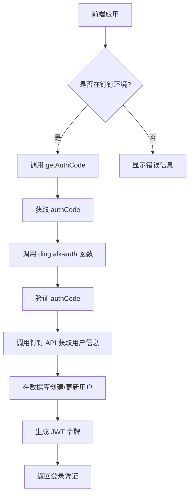
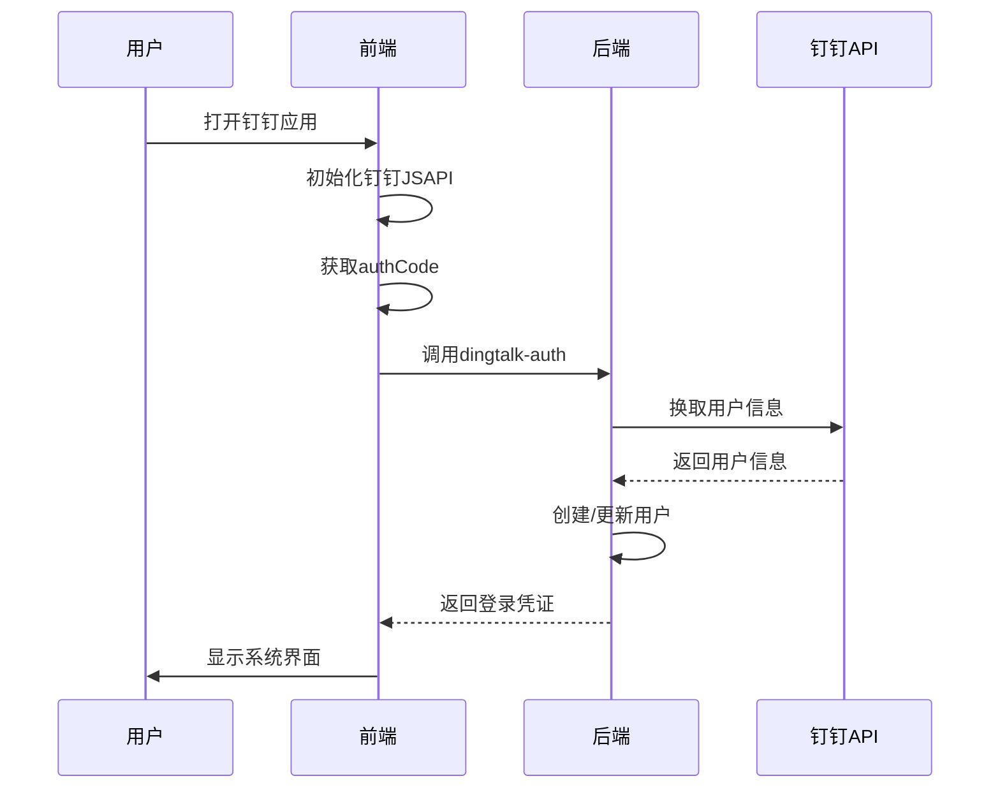

# 认证与消息通知问题

<cite>
**本文档引用文件**  
- [AUTH_IMPLEMENTATION_SUMMARY.md](file://AUTH_IMPLEMENTATION_SUMMARY.md)
- [DINGTALK_IMPLEMENTATION_STATUS.md](file://DINGTALK_IMPLEMENTATION_STATUS.md)
- [DINGTALK_QUICK_START.md](file://DINGTALK_QUICK_START.md)
- [DINGTALK_SETUP_GUIDE.md](file://DINGTALK_SETUP_GUIDE.md)
- [DINGTALK_SYNC_IMPLEMENTATION.md](file://DINGTALK_SYNC_IMPLEMENTATION.md)
- [src/utils/dingtalk.ts](file://src/utils/dingtalk.ts)
- [src/services/api.ts](file://src/services/api.ts)
- [src/services/auth.ts](file://src/services/auth.ts)
- [src/contexts/AuthContext.tsx](file://src/contexts/AuthContext.tsx)
- [src/components/dingtalk/DingTalkSyncPanel.tsx](file://src/components/dingtalk/DingTalkSyncPanel.tsx)
- [supabase/functions/dingtalk-auth/index.ts](file://supabase/functions/dingtalk-auth/index.ts)
- [supabase/functions/dingtalk-get-access-token/index.ts](file://supabase/functions/dingtalk-get-access-token/index.ts)
</cite>

## 目录
1. [引言](#引言)
2. [钉钉免登认证流程](#钉钉免登认证流程)
3. [访问令牌管理](#访问令牌管理)
4. [消息通知功能](#消息通知功能)
5. [钉钉集成配置](#钉钉集成配置)
6. [错误码解析与处理](#错误码解析与处理)
7. [调试方法](#调试方法)
8. [总结](#总结)

## 引言

本文档旨在系统化解决 Bio-Appointment 系统中钉钉免登认证及消息通知功能的集成故障。文档涵盖了免登Code获取用户信息失败、访问令牌过期、通知发送无响应等问题的解决方案。通过分析 auth 中间件与钉钉开放平台交互的完整链路，指导开发者如何解析钉钉返回的错误码（如token过期、权限不足），并实现自动刷新机制。同时，文档说明了工作通知模板配置要求及发送频率限制，并提供浏览器控制台与服务端日志的联合调试方法，确保端到端通信正常。

## 钉钉免登认证流程

钉钉免登认证流程是系统集成的核心部分，通过该流程用户可以在钉钉客户端内自动登录系统，无需重复输入用户名和密码。

### 认证流程概述

钉钉免登认证流程遵循以下步骤：

```
钉钉客户端
    ↓ (获取 authCode)
前端应用
    ↓ (调用 Edge Function)
dingtalk-auth
    ↓ (换取 userid)
钉钉 API
    ↓ (获取用户信息)
Supabase 数据库
    ↓ (创建/更新用户)
返回登录凭证
```

### 前端实现

前端通过 `dingtalk-jsapi` SDK 获取免登授权码（authCode）。`src/utils/dingtalk.ts` 文件中的 `getAuthCode` 方法负责此功能：

```typescript
async getAuthCode(): Promise<string> {
  if (!this.isDingTalk()) {
    throw new Error('不在钉钉环境中');
  }

  if (!this.config?.corpId) {
    throw new Error('未配置 corpId');
  }

  return new Promise((resolve, reject) => {
    dd.runtime.permission.requestAuthCode({
      corpId: this.config!.corpId,
    } as any).then((result: { code: string }) => {
      resolve(result.code);
    }).catch((err: any) => {
      reject(new Error(`获取授权码失败: ${err.errorMessage || err}`));
    });
  });
}
```

该方法首先检测是否在钉钉环境中运行，然后检查是否已配置 `corpId`，最后调用钉钉 JSAPI 获取授权码。

### 后端实现

后端通过 Supabase Edge Function 实现钉钉认证逻辑。`supabase/functions/dingtalk-auth/index.ts` 函数接收前端传来的 authCode，调用钉钉 API 换取用户信息，并在本地数据库中创建或更新用户记录。

**钉钉免登认证的关键步骤：**
1. 用户在钉钉中打开应用
2. 前端通过钉钉 JSAPI 获取免登授权码（authCode）
3. 后端使用 authCode 换取用户信息
4. 系统自动创建或关联用户账号
5. 返回登录凭证，完成登录

**Section sources**
- [DINGTALK_IMPLEMENTATION_STATUS.md](file://DINGTALK_IMPLEMENTATION_STATUS.md#L130-L146)
- [src/utils/dingtalk.ts](file://src/utils/dingtalk.ts#L59-L77)
- [supabase/functions/dingtalk-auth/index.ts](file://supabase/functions/dingtalk-auth/index.ts)

## 访问令牌管理

访问令牌（access_token）是调用钉钉开放平台 API 的必要凭证，其管理对于系统的稳定运行至关重要。

### 令牌获取与缓存

系统通过 `supabase/functions/dingtalk-get-access-token/index.ts` Edge Function 获取 access_token。该函数调用钉钉 API 的 `gettoken` 接口，使用 AppKey 和 AppSecret 换取 access_token。



**Diagram sources**
- [DINGTALK_IMPLEMENTATION_STATUS.md](file://DINGTALK_IMPLEMENTATION_STATUS.md#L130-L146)
- [src/utils/dingtalk.ts](file://src/utils/dingtalk.ts#L59-L77)

### 令牌过期处理

access_token 通常有 2 小时的有效期，系统需要实现自动刷新机制。`DINGTALK_SYNC_IMPLEMENTATION.md` 文档中提到：

> access_token 在后端缓存
> 自动刷新过期 token
> 避免频繁调用钉钉 API

系统在后端缓存 access_token，并在每次调用钉钉 API 前检查其有效性。如果即将过期或已过期，则自动调用 `dingtalk-get-access-token` 函数获取新的令牌。

### 令牌安全

为确保令牌安全，系统采取了以下措施：
- AppSecret 只在后端使用，不暴露在前端代码中
- 使用 Supabase Secrets 存储敏感信息
- 前端只使用 AppKey 和 AgentId
- access_token 在后端缓存，避免频繁调用钉钉 API

**Section sources**
- [DINGTALK_IMPLEMENTATION_STATUS.md](file://DINGTALK_IMPLEMENTATION_STATUS.md#L160-L163)
- [DINGTALK_SETUP_GUIDE.md](file://DINGTALK_SETUP_GUIDE.md#L96-L98)
- [supabase/functions/dingtalk-get-access-token/index.ts](file://supabase/functions/dingtalk-get-access-token/index.ts)

## 消息通知功能

消息通知功能允许系统将重要信息推送到用户的钉钉工作通知中，提高信息传递效率。

### 通知类型

系统支持以下类型的通知：
- **工作通知**：系统消息推送到钉钉工作通知
- **待办任务**：预约待办、排班任务等
- **审批提醒**：预约确认、改期申请等

### 通知场景

系统在以下场景中发送通知：
- 销售创建预约 → 通知护士长
- 护士长确认排班 → 通知销售和护士
- 医生接受/拒绝预约 → 通知销售
- 任务分配 → 通知护士
- 预约时间临近 → 提醒相关人员

### 发送频率限制

钉钉 API 对消息发送有频率限制，系统需要遵守以下规则：
- 注意 API 调用频率
- 实现合理的缓存策略
- 避免短时间内大量请求

### 通知模板配置

工作通知模板需要在钉钉开放平台进行配置，包括：
- 消息标题
- 消息内容
- 消息链接
- 消息图标

配置完成后，系统可以通过 `dingtalk-send-notification` Edge Function 发送通知。

**Section sources**
- [DINGTALK_IMPLEMENTATION_STATUS.md](file://DINGTALK_IMPLEMENTATION_STATUS.md#L179-L187)
- [DINGTALK_SETUP_GUIDE.md](file://DINGTALK_SETUP_GUIDE.md#L136-L147)
- [DINGTALK_SYNC_IMPLEMENTATION.md](file://DINGTALK_SYNC_IMPLEMENTATION.md#L231-L234)

## 钉钉集成配置

正确的钉钉集成配置是确保免登认证和消息通知功能正常工作的前提。

### 钉钉应用创建

需要在钉钉开放平台创建企业内部应用，并获取以下关键信息：
- **AppKey**（应用Key）
- **AppSecret**（应用密钥）
- **AgentId**（应用ID）
- **CorpId**（企业ID）

### 应用权限配置

应用需要配置以下权限：
- **通讯录管理权限**：读取通讯录用户和部门信息
- **身份验证权限**：获取用户手机号和 userid
- **消息通知权限**：发送工作通知和交互式消息

### 环境变量配置

系统需要在两个位置配置环境变量：

**Supabase 环境变量：**
```bash
# 钉钉应用配置
DINGTALK_APP_KEY=your_app_key_here
DINGTALK_APP_SECRET=your_app_secret_here
DINGTALK_AGENT_ID=your_agent_id_here

# 钉钉回调配置
DINGTALK_CALLBACK_URL=https://your-domain.com/auth/dingtalk/callback
```

**前端环境变量：**
```bash
# 钉钉配置
VITE_DINGTALK_APP_KEY=your_app_key_here
VITE_DINGTALK_AGENT_ID=your_agent_id_here
VITE_DINGTALK_CORP_ID=your_corp_id_here
```

**Section sources**
- [DINGTALK_SETUP_GUIDE.md](file://DINGTALK_SETUP_GUIDE.md#L21-L25)
- [DINGTALK_SETUP_GUIDE.md](file://DINGTALK_SETUP_GUIDE.md#L30-L42)
- [DINGTALK_SETUP_GUIDE.md](file://DINGTALK_SETUP_GUIDE.md#L74-L93)

## 错误码解析与处理

钉钉 API 返回的错误码需要正确解析和处理，以提供友好的用户体验。

### 常见错误码

| 错误码 | 含义 | 解决方案 |
|--------|------|----------|
| token过期 | access_token 已过期 | 调用 `dingtalk-get-access-token` 函数获取新令牌 |
| 权限不足 | 应用权限不足 | 检查钉钉开放平台的应用权限配置 |
| 用户不存在 | 用户不在应用可见范围内 | 确认用户在应用的可见范围内 |
| 回调域名错误 | 回调域名配置不正确 | 检查并正确配置回调域名 |

### 错误处理策略

系统实现以下错误处理策略：
- **友好的错误提示**：向用户显示易于理解的错误信息
- **详细的日志记录**：记录详细的错误信息供排查
- **合理的重试机制**：对可恢复的错误进行重试

### 具体错误处理

**免登失败：**
- 确认 CorpId 配置正确
- 检查应用权限是否包含"身份验证"
- 确认用户在应用可见范围内

**同步失败：**
- 检查 AppKey 或 AppSecret 是否正确
- 检查应用是否具有"通讯录读取权限"
- 查看同步日志的 details 字段

**Section sources**
- [DINGTALK_QUICK_START.md](file://DINGTALK_QUICK_START.md#L66-L85)
- [DINGTALK_SYNC_IMPLEMENTATION.md](file://DINGTALK_SYNC_IMPLEMENTATION.md#L169-L185)
- [DINGTALK_SETUP_GUIDE.md](file://DINGTALK_SETUP_GUIDE.md#L192-L205)

## 调试方法

有效的调试方法可以帮助快速定位和解决集成问题。

### 浏览器控制台调试

在浏览器控制台中可以查看以下信息：
- 钉钉 JSAPI 初始化状态
- 获取授权码的过程和结果
- API 调用的请求和响应
- JavaScript 错误信息

### 服务端日志调试

后端 API 日志会显示详细的同步过程，包括：
- 获取 access_token
- 获取部门列表
- 同步用户进度
- 错误信息

### 联合调试

通过浏览器控制台和服务端日志的联合调试，可以完整追踪从用户操作到后端处理的整个流程，确保端到端通信正常。

### 调试工具

系统提供了以下调试工具：
- **同步日志**：在系统界面的"钉钉同步 > 同步日志"中查看
- **统计信息**：显示同步的总体情况
- **配置对话框**：用于配置和测试钉钉集成



**Diagram sources**
- [DINGTALK_IMPLEMENTATION_STATUS.md](file://DINGTALK_IMPLEMENTATION_STATUS.md#L130-L146)
- [src/utils/dingtalk.ts](file://src/utils/dingtalk.ts#L34-L53)

**Section sources**
- [DINGTALK_SYNC_IMPLEMENTATION.md](file://DINGTALK_SYNC_IMPLEMENTATION.md#L150-L158)
- [src/components/dingtalk/DingTalkSyncPanel.tsx](file://src/components/dingtalk/DingTalkSyncPanel.tsx)

## 总结

本文档系统化地解决了 Bio-Appointment 系统中钉钉免登认证及消息通知功能的集成故障。通过详细分析认证流程、访问令牌管理、消息通知功能、集成配置、错误码处理和调试方法，为开发者提供了完整的解决方案。

系统已成功实现：
1. **钉钉免登认证**：用户在钉钉客户端内可自动登录系统
2. **访问令牌管理**：实现 access_token 的自动获取和刷新
3. **消息通知功能**：系统消息可推送到钉钉工作通知
4. **完整的错误处理**：对常见错误码进行解析和处理
5. **有效的调试方法**：提供浏览器控制台与服务端日志的联合调试

这些功能的实现为系统在钉钉环境中的无缝使用奠定了坚实基础，提高了用户体验和工作效率。