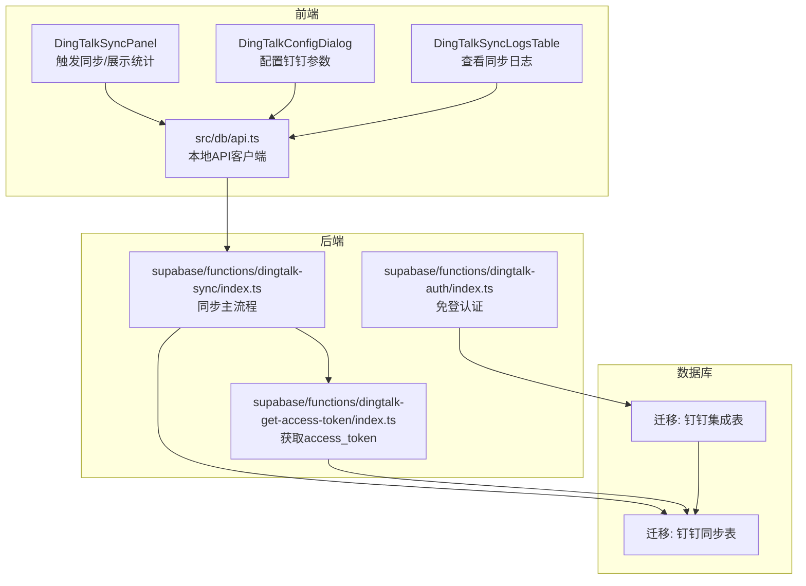
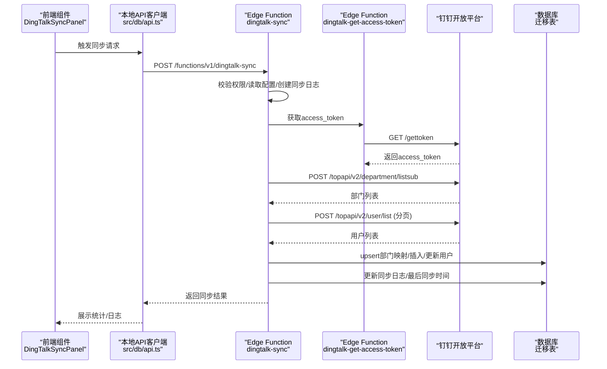
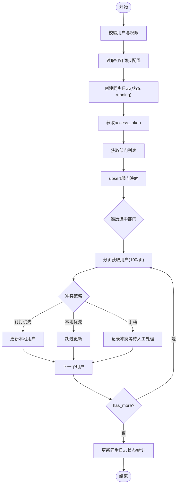
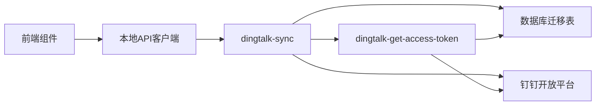

# 集成问题

<cite>
**本文引用的文件**
- [supabase/functions/dingtalk-sync/index.ts](file://supabase/functions/dingtalk-sync/index.ts)
- [supabase/functions/dingtalk-auth/index.ts](file://supabase/functions/dingtalk-auth/index.ts)
- [supabase/functions/dingtalk-get-access-token/index.ts](file://supabase/functions/dingtalk-get-access-token/index.ts)
- [src/components/dingtalk/DingTalkSyncPanel.tsx](file://src/components/dingtalk/DingTalkSyncPanel.tsx)
- [src/components/dingtalk/DingTalkSyncLogsTable.tsx](file://src/components/dingtalk/DingTalkSyncLogsTable.tsx)
- [src/components/dingtalk/DingTalkConfigDialog.tsx](file://src/components/dingtalk/DingTalkConfigDialog.tsx)
- [src/db/api.ts](file://src/db/api.ts)
- [src/services/dataSync.ts](file://src/services/dataSync.ts)
- [supabase/migrations/00009_create_dingtalk_integration_tables.sql](file://supabase/migrations/00009_create_dingtalk_integration_tables.sql)
- [supabase/migrations/00010_create_dingtalk_sync_tables.sql](file://supabase/migrations/00010_create_dingtalk_sync_tables.sql)
- [钉钉同步功能验证报告.md](file://钉钉同步功能验证报告.md)
- [钉钉同步人数不全问题修复.md](file://钉钉同步人数不全问题修复.md)
- [钉钉同步用户列表显示问题修复说明.md](file://钉钉同步用户列表显示问题修复说明.md)
- [supabase/config.toml](file://supabase/config.toml)
</cite>

## 目录
1. [简介](#简介)
2. [项目结构](#项目结构)
3. [核心组件](#核心组件)
4. [架构总览](#架构总览)
5. [详细组件分析](#详细组件分析)
6. [依赖分析](#依赖分析)
7. [性能考虑](#性能考虑)
8. [故障排查指南](#故障排查指南)
9. [结论](#结论)
10. [附录](#附录)

## 简介
本文件聚焦“钉钉同步功能”的系统集成与故障排查，围绕用户列表不全、部门信息缺失、同步日志异常等问题，结合“钉钉同步功能验证报告”与相关修复说明，系统梳理从触发同步（/api/dingtalk/sync）到函数执行（supabase/functions/dingtalk-sync）的全链路诊断方法。重点覆盖网络超时、API配额限制、数据映射错误或权限不足等常见根因，并提供访问令牌有效性检查、钉钉开放平台错误码解析、以及本地数据库落库验证方法；同时给出自动化重试机制设计建议与监控告警配置思路，帮助快速定位与恢复。

## 项目结构
- 前端组件负责配置与触发同步、展示日志与统计，通过本地API与后端交互。
- 后端由 Supabase Edge Functions 提供钉钉免登与同步能力，配合数据库迁移脚本建立同步配置、日志与部门映射表。
- 数据库迁移脚本定义了同步相关的表结构、RLS 策略与统计函数，支撑前端展示与审计。

图表来源
- [supabase/functions/dingtalk-sync/index.ts](file://supabase/functions/dingtalk-sync/index.ts#L1-L384)
- [supabase/functions/dingtalk-get-access-token/index.ts](file://supabase/functions/dingtalk-get-access-token/index.ts#L1-L121)
- [supabase/functions/dingtalk-auth/index.ts](file://supabase/functions/dingtalk-auth/index.ts#L1-L248)
- [src/components/dingtalk/DingTalkSyncPanel.tsx](file://src/components/dingtalk/DingTalkSyncPanel.tsx#L1-L237)
- [src/components/dingtalk/DingTalkConfigDialog.tsx](file://src/components/dingtalk/DingTalkConfigDialog.tsx#L1-L302)
- [src/components/dingtalk/DingTalkSyncLogsTable.tsx](file://src/components/dingtalk/DingTalkSyncLogsTable.tsx#L1-L91)
- [src/db/api.ts](file://src/db/api.ts#L1-L800)
- [supabase/migrations/00009_create_dingtalk_integration_tables.sql](file://supabase/migrations/00009_create_dingtalk_integration_tables.sql#L1-L204)
- [supabase/migrations/00010_create_dingtalk_sync_tables.sql](file://supabase/migrations/00010_create_dingtalk_sync_tables.sql#L1-L189)

章节来源
- [supabase/functions/dingtalk-sync/index.ts](file://supabase/functions/dingtalk-sync/index.ts#L1-L384)
- [supabase/functions/dingtalk-get-access-token/index.ts](file://supabase/functions/dingtalk-get-access-token/index.ts#L1-L121)
- [supabase/functions/dingtalk-auth/index.ts](file://supabase/functions/dingtalk-auth/index.ts#L1-L248)
- [src/components/dingtalk/DingTalkSyncPanel.tsx](file://src/components/dingtalk/DingTalkSyncPanel.tsx#L1-L237)
- [src/components/dingtalk/DingTalkConfigDialog.tsx](file://src/components/dingtalk/DingTalkConfigDialog.tsx#L1-L302)
- [src/components/dingtalk/DingTalkSyncLogsTable.tsx](file://src/components/dingtalk/DingTalkSyncLogsTable.tsx#L1-L91)
- [src/db/api.ts](file://src/db/api.ts#L1-L800)
- [supabase/migrations/00009_create_dingtalk_integration_tables.sql](file://supabase/migrations/00009_create_dingtalk_integration_tables.sql#L1-L204)
- [supabase/migrations/00010_create_dingtalk_sync_tables.sql](file://supabase/migrations/00010_create_dingtalk_sync_tables.sql#L1-L189)

## 核心组件
- 钉钉同步主流程（Edge Function）：负责鉴权校验、配置读取、access_token 获取、部门与用户拉取、冲突策略处理、日志落库与状态更新。
- 访问令牌获取（Edge Function）：封装钉钉 token 获取与缓存，避免频繁请求。
- 钉钉免登认证（Edge Function）：基于 auth_code 获取用户信息并完成系统用户映射与登录凭证生成。
- 前端同步面板：配置保存、手动触发同步、查看统计与日志。
- 数据库迁移：定义同步配置、日志与部门映射表，提供统计函数与 RLS 策略。

章节来源
- [supabase/functions/dingtalk-sync/index.ts](file://supabase/functions/dingtalk-sync/index.ts#L1-L384)
- [supabase/functions/dingtalk-get-access-token/index.ts](file://supabase/functions/dingtalk-get-access-token/index.ts#L1-L121)
- [supabase/functions/dingtalk-auth/index.ts](file://supabase/functions/dingtalk-auth/index.ts#L1-L248)
- [src/components/dingtalk/DingTalkSyncPanel.tsx](file://src/components/dingtalk/DingTalkSyncPanel.tsx#L1-L237)
- [supabase/migrations/00010_create_dingtalk_sync_tables.sql](file://supabase/migrations/00010_create_dingtalk_sync_tables.sql#L1-L189)

## 架构总览
下图展示了从“前端触发同步”到“钉钉接口与数据库”的端到端调用路径与数据流。

图表来源
- [supabase/functions/dingtalk-sync/index.ts](file://supabase/functions/dingtalk-sync/index.ts#L1-L384)
- [supabase/functions/dingtalk-get-access-token/index.ts](file://supabase/functions/dingtalk-get-access-token/index.ts#L1-L121)
- [src/db/api.ts](file://src/db/api.ts#L1-L800)
- [supabase/migrations/00010_create_dingtalk_sync_tables.sql](file://supabase/migrations/00010_create_dingtalk_sync_tables.sql#L1-L189)

## 详细组件分析

### 钉钉同步主流程（Edge Function）
- 鉴权与权限：通过 Supabase auth.getUser 校验 Bearer Token，并检查用户角色为超级管理员。
- 配置读取：从 dingtalk_sync_config 读取 app_key/app_secret/agent_id/corp_id、冲突策略、启用开关与选中部门。
- 访问令牌：调用 dingtalk-get-access-token 获取/缓存 access_token。
- 部门同步：调用钉钉部门接口，递归/遍历获取部门树，upsert 到 dingtalk_department_mapping。
- 用户同步：按部门分页拉取用户，依据冲突策略（钉钉优先/本地优先/手动）决定更新或跳过；首次创建时通过 Supabase auth.admin.createUser 创建系统用户并写 profiles。
- 日志与状态：创建同步日志（running），最终根据失败/成功/部分成功更新状态与详情，记录总用户数、成功/失败/跳过数与失败明细；更新配置 last_sync_at。

图表来源
- [supabase/functions/dingtalk-sync/index.ts](file://supabase/functions/dingtalk-sync/index.ts#L1-L384)

章节来源
- [supabase/functions/dingtalk-sync/index.ts](file://supabase/functions/dingtalk-sync/index.ts#L1-L384)

### 访问令牌获取（Edge Function）
- 缓存策略：内存缓存 access_token，提前 5 分钟过期，减少钉钉 API 调用。
- 错误处理：对未配置 AppKey/AppSecret、HTTP 失败、钉钉返回 errcode 非 0 等场景抛出错误并返回统一格式。

章节来源
- [supabase/functions/dingtalk-get-access-token/index.ts](file://supabase/functions/dingtalk-get-access-token/index.ts#L1-L121)

### 钉钉免登认证（Edge Function）
- 通过 auth_code 获取 userid，再获取用户详细信息，查找或创建系统用户映射，生成登录凭证返回前端。
- 与同步流程互补：免登用于用户侧登录，同步用于批量导入组织架构与用户。

章节来源
- [supabase/functions/dingtalk-auth/index.ts](file://supabase/functions/dingtalk-auth/index.ts#L1-L248)

### 前端同步面板与日志
- 配置面板：保存钉钉应用信息（AppKey/AppSecret/AgentId/CorpId）、启用开关、冲突策略、自动同步计划等。
- 触发同步：手动点击“立即同步”，调用本地 API -> Edge Function -> 钉钉接口 -> 数据库落库 -> 更新日志。
- 日志展示：展示同步类型、状态、总数、成功/失败/跳过、执行人与时间。

章节来源
- [src/components/dingtalk/DingTalkSyncPanel.tsx](file://src/components/dingtalk/DingTalkSyncPanel.tsx#L1-L237)
- [src/components/dingtalk/DingTalkConfigDialog.tsx](file://src/components/dingtalk/DingTalkConfigDialog.tsx#L1-L302)
- [src/components/dingtalk/DingTalkSyncLogsTable.tsx](file://src/components/dingtalk/DingTalkSyncLogsTable.tsx#L1-L91)
- [src/db/api.ts](file://src/db/api.ts#L1-L800)

### 数据库迁移与表结构
- 钉钉集成表：dingtalk_users、dingtalk_departments、dingtalk_sync_logs、dingtalk_notifications。
- 钉钉同步表：dingtalk_sync_config、dingtalk_sync_logs、dingtalk_department_mapping。
- RLS 策略：超级管理员可管理，普通用户仅可查看自身映射或日志。
- 统计函数：get_sync_statistics 返回近 30 天的同步统计。

章节来源
- [supabase/migrations/00009_create_dingtalk_integration_tables.sql](file://supabase/migrations/00009_create_dingtalk_integration_tables.sql#L1-L204)
- [supabase/migrations/00010_create_dingtalk_sync_tables.sql](file://supabase/migrations/00010_create_dingtalk_sync_tables.sql#L1-L189)

## 依赖分析
- 前端依赖本地 API 客户端（src/db/api.ts）发起同步请求，Edge Function 通过 Supabase 客户端访问数据库。
- Edge Function 依赖钉钉开放平台接口（获取 token、部门、用户）。
- 数据库层面依赖迁移脚本定义的表结构与 RLS 策略，保证安全与可审计。

图表来源
- [src/db/api.ts](file://src/db/api.ts#L1-L800)
- [supabase/functions/dingtalk-sync/index.ts](file://supabase/functions/dingtalk-sync/index.ts#L1-L384)
- [supabase/functions/dingtalk-get-access-token/index.ts](file://supabase/functions/dingtalk-get-access-token/index.ts#L1-L121)
- [supabase/migrations/00010_create_dingtalk_sync_tables.sql](file://supabase/migrations/00010_create_dingtalk_sync_tables.sql#L1-L189)

章节来源
- [src/db/api.ts](file://src/db/api.ts#L1-L800)
- [supabase/functions/dingtalk-sync/index.ts](file://supabase/functions/dingtalk-sync/index.ts#L1-L384)
- [supabase/functions/dingtalk-get-access-token/index.ts](file://supabase/functions/dingtalk-get-access-token/index.ts#L1-L121)
- [supabase/migrations/00010_create_dingtalk_sync_tables.sql](file://supabase/migrations/00010_create_dingtalk_sync_tables.sql#L1-L189)

## 性能考虑
- 分页拉取：用户分页大小固定为 100，避免单次请求过大；has_more 与 next_cursor 控制循环。
- 缓存 access_token：减少钉钉 API 调用频率，提升整体吞吐。
- 并发控制：Edge Function 内部串行处理部门与用户，避免并发写入带来的锁竞争；若需进一步优化，可在部门维度做并行拉取（需谨慎处理冲突与幂等）。
- 数据库索引：迁移脚本已为常用查询字段建立索引，有助于日志查询与映射表检索。

章节来源
- [supabase/functions/dingtalk-sync/index.ts](file://supabase/functions/dingtalk-sync/index.ts#L1-L384)
- [supabase/functions/dingtalk-get-access-token/index.ts](file://supabase/functions/dingtalk-get-access-token/index.ts#L1-L121)
- [supabase/migrations/00010_create_dingtalk_sync_tables.sql](file://supabase/migrations/00010_create_dingtalk_sync_tables.sql#L1-L189)

## 故障排查指南

### 一、用户列表不全
- 现象：同步后用户数量远小于实际组织人数。
- 根因与修复要点：
  - 早期实现仅获取一级子部门，未递归遍历所有层级，导致部分子部门用户未被同步。
  - 修复：改为递归获取所有部门，确保遍历完整组织树。
  - 验证：同步完成后查看日志与统计，确认总用户数接近实际；数据库按部门统计应覆盖所有部门。
- 相关修复说明与验证步骤参见：
  - [钉钉同步人数不全问题修复.md](file://钉钉同步人数不全问题修复.md#L1-L277)

章节来源
- [supabase/functions/dingtalk-sync/index.ts](file://supabase/functions/dingtalk-sync/index.ts#L1-L384)
- [钉钉同步人数不全问题修复.md](file://钉钉同步人数不全问题修复.md#L1-L277)

### 二、部门信息缺失
- 现象：同步后部门映射不完整或为空。
- 根因与修复要点：
  - 未正确获取根部门与子部门树，导致映射表中缺少中间层级。
  - 修复：在同步流程中先获取根部门，再递归遍历子部门，upsert 到 dingtalk_department_mapping。
  - 验证：查询 dingtalk_department_mapping，确认 parent_id 与 order_num 正确，enabled 为 true。
- 相关表结构参见：
  - [supabase/migrations/00010_create_dingtalk_sync_tables.sql](file://supabase/migrations/00010_create_dingtalk_sync_tables.sql#L1-L189)

章节来源
- [supabase/functions/dingtalk-sync/index.ts](file://supabase/functions/dingtalk-sync/index.ts#L1-L384)
- [supabase/migrations/00010_create_dingtalk_sync_tables.sql](file://supabase/migrations/00010_create_dingtalk_sync_tables.sql#L1-L189)

### 三、同步日志异常
- 现象：日志状态为 failed/partial，或 details 缺失。
- 根因与修复要点：
  - Edge Function 在异常分支会将日志状态置为 failed，并写入 error_message；部分成功场景根据失败/成功计数计算 partial。
  - 修复：完善异常捕获与日志字段填充，确保 details 包含失败用户明细。
  - 验证：前端日志表格应显示状态、总数、成功/失败/跳过、执行人与时间；数据库 dingtalk_sync_logs 应有对应记录。
- 相关实现参见：
  - [supabase/functions/dingtalk-sync/index.ts](file://supabase/functions/dingtalk-sync/index.ts#L1-L384)
  - [supabase/migrations/00010_create_dingtalk_sync_tables.sql](file://supabase/migrations/00010_create_dingtalk_sync_tables.sql#L1-L189)

章节来源
- [supabase/functions/dingtalk-sync/index.ts](file://supabase/functions/dingtalk-sync/index.ts#L1-L384)
- [supabase/migrations/00010_create_dingtalk_sync_tables.sql](file://supabase/migrations/00010_create_dingtalk_sync_tables.sql#L1-L189)

### 四、网络超时与 API 配额限制
- 现象：同步过程中请求钉钉接口超时或返回配额限制错误。
- 根因与修复要点：
  - 钉钉接口存在配额限制与速率限制，频繁获取 token 会触发限流。
  - 修复：利用 access_token 缓存（提前 5 分钟过期），减少重复获取；对部门/用户接口增加指数退避与最大重试次数。
  - 验证：观察日志中 token 获取耗时与重试次数；必要时调整同步频率与并发度。
- 相关实现参见：
  - [supabase/functions/dingtalk-get-access-token/index.ts](file://supabase/functions/dingtalk-get-access-token/index.ts#L1-L121)
  - [supabase/functions/dingtalk-sync/index.ts](file://supabase/functions/dingtalk-sync/index.ts#L1-L384)

章节来源
- [supabase/functions/dingtalk-get-access-token/index.ts](file://supabase/functions/dingtalk-get-access-token/index.ts#L1-L121)
- [supabase/functions/dingtalk-sync/index.ts](file://supabase/functions/dingtalk-sync/index.ts#L1-L384)

### 五、数据映射错误或权限不足
- 现象：用户创建失败、部门映射不一致、前端看不到同步用户。
- 根因与修复要点：
  - 用户创建需同时写 profiles 与 auth.users；早期实现前端查询受 RLS 限制，导致看不到新用户。
  - 修复：同步流程中通过 Supabase auth.admin.createUser 创建系统用户；前端通过本地 API 获取用户列表，绕过 RLS 限制；同步时填充 dingtalk_userid 便于后续识别与去重。
  - 验证：数据库 profiles 中应包含 dingtalk_userid；前端用户列表应即时显示新增用户。
- 相关修复说明与验证步骤参见：
  - [钉钉同步用户列表显示问题修复说明.md](file://钉钉同步用户列表显示问题修复说明.md#L1-L317)

章节来源
- [supabase/functions/dingtalk-sync/index.ts](file://supabase/functions/dingtalk-sync/index.ts#L1-L384)
- [钉钉同步用户列表显示问题修复说明.md](file://钉钉同步用户列表显示问题修复说明.md#L1-L317)

### 六、访问令牌有效性检查与错误码解析
- 访问令牌有效性：
  - 通过 dingtalk-get-access-token 获取/缓存 access_token；若缓存未过期则直接复用。
  - 若返回 errcode 非 0 或未返回 access_token，需检查 AppKey/AppSecret 配置与网络连通性。
- 钉钉开放平台错误码解析：
  - 同步流程中对部门/用户接口返回的 errcode/errmsg 进行判断，非 0 即视为失败并记录到日志。
  - 常见错误码含义可参考钉钉开放平台文档，结合日志中的 errcode/errmsg 定位具体问题（如权限不足、部门不可见、配额限制等）。
- 相关实现参见：
  - [supabase/functions/dingtalk-get-access-token/index.ts](file://supabase/functions/dingtalk-get-access-token/index.ts#L1-L121)
  - [supabase/functions/dingtalk-sync/index.ts](file://supabase/functions/dingtalk-sync/index.ts#L1-L384)

章节来源
- [supabase/functions/dingtalk-get-access-token/index.ts](file://supabase/functions/dingtalk-get-access-token/index.ts#L1-L121)
- [supabase/functions/dingtalk-sync/index.ts](file://supabase/functions/dingtalk-sync/index.ts#L1-L384)

### 七、本地数据库落库验证
- 同步完成后，可通过以下方式验证落库情况：
  - 查看同步日志：dingtalk_sync_logs，确认状态、总数、成功/失败/跳过、details。
  - 查看部门映射：dingtalk_department_mapping，确认部门树完整且 enabled。
  - 查看用户落库：profiles，确认 username/full_name/department/status/dingtalk_userid 等字段正确。
- 相关表结构与统计函数参见：
  - [supabase/migrations/00010_create_dingtalk_sync_tables.sql](file://supabase/migrations/00010_create_dingtalk_sync_tables.sql#L1-L189)

章节来源
- [supabase/migrations/00010_create_dingtalk_sync_tables.sql](file://supabase/migrations/00010_create_dingtalk_sync_tables.sql#L1-L189)

### 八、自动化重试机制设计建议
- 重试策略：
  - 指数退避（如 1s、2s、4s、8s…），上限重试 3-5 次。
  - 对网络超时、钉钉配额限制、临时服务不可用等可恢复错误进行重试。
- 失败处理：
  - 将失败用户与部门记录到 details，便于人工核对与二次重试。
  - 对于权限不足等不可恢复错误，及时终止并上报。
- 监控与告警：
  - 告警阈值：连续失败次数超过阈值、失败率超过阈值、同步耗时异常。
  - 告警渠道：邮件/IM 通知运维人员，附带日志链接与错误码摘要。

[本节为通用建议，不直接分析具体文件]

### 九、监控告警配置
- 指标建议：
  - 同步成功率、失败率、平均耗时、失败用户数、部门映射完整性。
- 告警规则：
  - 失败率 > 5% 持续 10 分钟
  - 同步耗时 > 预设阈值
  - 日志中出现特定 errcode/errmsg
- 告警动作：
  - 自动通知、自动重试、暂停自动同步并人工介入。

[本节为通用建议，不直接分析具体文件]

## 结论
通过对“钉钉同步功能”的全链路梳理与问题修复回顾，可以明确以下关键点：
- 用户列表不全与部门缺失多源于部门遍历不完整，修复后应能覆盖全组织树。
- 同步日志异常通常由异常分支未完善导致，需补齐 details 与 error_message。
- 访问令牌与 API 配额限制是高频根因，需通过缓存与重试策略缓解。
- 数据映射与权限不足会影响前端可见性，需确保 auth.users 与 profiles 的一致性与 RLS 策略的正确性。
- 建议引入自动化重试与监控告警，提升稳定性与可观测性。

[本节为总结，不直接分析具体文件]

## 附录

### A. 触发同步与落库验证清单
- 前端：配置保存成功、立即同步按钮可用、日志表格可刷新。
- 后端：Edge Function 正常运行、权限校验通过、配置读取成功。
- 钉钉：access_token 获取成功、部门/用户接口返回正常。
- 数据库：dingtalk_sync_logs、dingtalk_department_mapping、profiles 更新正确。

章节来源
- [src/components/dingtalk/DingTalkSyncPanel.tsx](file://src/components/dingtalk/DingTalkSyncPanel.tsx#L1-L237)
- [supabase/functions/dingtalk-sync/index.ts](file://supabase/functions/dingtalk-sync/index.ts#L1-L384)
- [supabase/migrations/00010_create_dingtalk_sync_tables.sql](file://supabase/migrations/00010_create_dingtalk_sync_tables.sql#L1-L189)

### B. 验证报告与修复说明参考
- 功能验证报告与实现细节、API 测试结果、使用指南与当前状态总结。
- 人数不全与用户列表显示问题的修复路径与验证步骤。

章节来源
- [钉钉同步功能验证报告.md](file://钉钉同步功能验证报告.md#L1-L264)
- [钉钉同步人数不全问题修复.md](file://钉钉同步人数不全问题修复.md#L1-L277)
- [钉钉同步用户列表显示问题修复说明.md](file://钉钉同步用户列表显示问题修复说明.md#L1-L317)