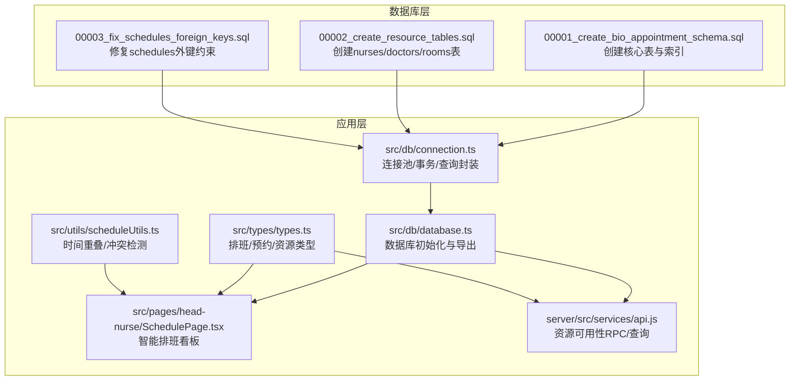
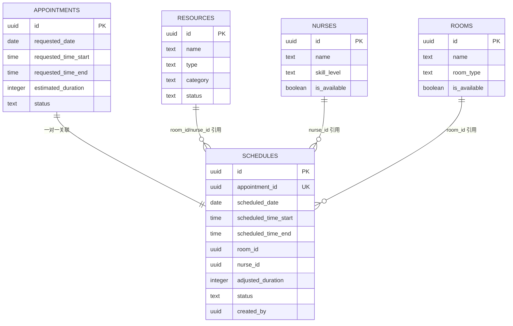
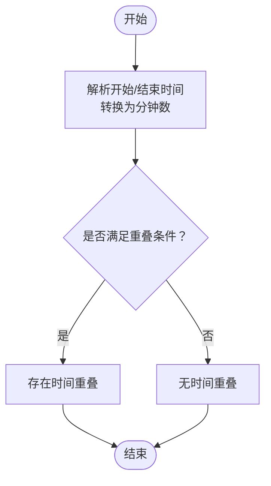
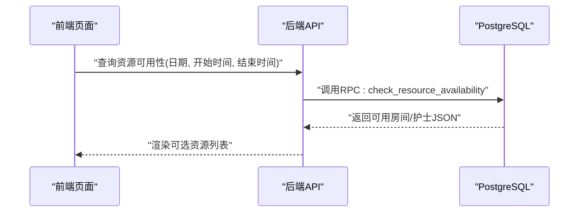
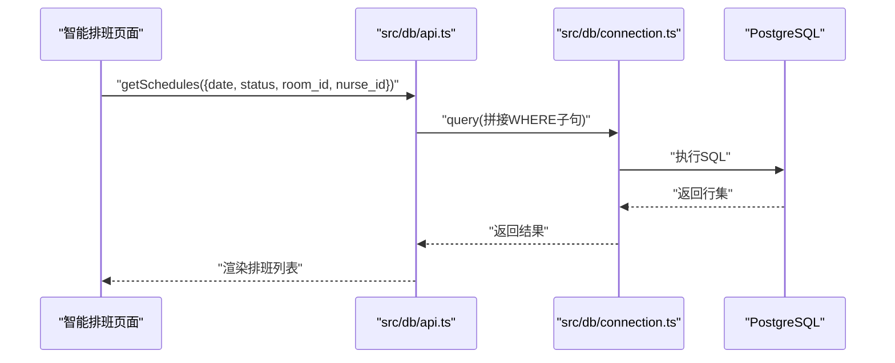
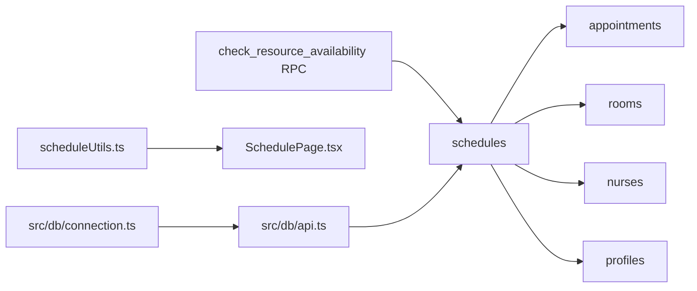

# 排班模型

<cite>
**本文引用的文件**
- [supabase/migrations/00001_create_bio_appointment_schema.sql](file://supabase/migrations/00001_create_bio_appointment_schema.sql)
- [supabase/migrations/00002_create_resource_tables.sql](file://supabase/migrations/00002_create_resource_tables.sql)
- [supabase/migrations/00003_fix_schedules_foreign_keys.sql](file://supabase/migrations/00003_fix_schedules_foreign_keys.sql)
- [src/db/connection.ts](file://src/db/connection.ts)
- [src/db/database.ts](file://src/db/database.ts)
- [src/db/api.ts](file://src/db/api.ts)
- [src/types/types.ts](file://src/types/types.ts)
- [src/utils/scheduleUtils.ts](file://src/utils/scheduleUtils.ts)
- [src/pages/head-nurse/SchedulePage.tsx](file://src/pages/head-nurse/SchedulePage.tsx)
- [server/src/services/api.js](file://server/src/services/api.js)
</cite>

## 目录
1. [简介](#简介)
2. [项目结构](#项目结构)
3. [核心组件](#核心组件)
4. [架构总览](#架构总览)
5. [详细组件分析](#详细组件分析)
6. [依赖分析](#依赖分析)
7. [性能考虑](#性能考虑)
8. [故障排查指南](#故障排查指南)
9. [结论](#结论)

## 简介
本文件面向Bio-Appointment系统的“排班数据模型”，系统化梳理schedules表的设计原理、字段语义、复合索引策略、与appointments与resources表的外键关系；解释智能排班算法依赖的数据结构，尤其是时间槽划分、资源占用检测与冲突预防的数据库实现；说明排班记录的生命周期管理（创建、修改、取消）与数据一致性保障；并结合database.ts中的查询接口，给出高效获取特定时间段内资源占用情况的方法与索引优化建议。

## 项目结构
围绕排班模型的关键文件与职责如下：
- 数据库迁移文件：负责创建与演进核心表结构、索引与约束
- 数据访问层：统一连接池、查询封装与事务管理
- 类型定义：前后端共享的排班、预约、资源等类型
- 业务工具：时间重叠判断与资源冲突检测
- 页面与服务：前端看板页面与后端API服务，用于演示排班流程与资源可用性查询

图表来源
- [supabase/migrations/00001_create_bio_appointment_schema.sql](file://supabase/migrations/00001_create_bio_appointment_schema.sql#L160-L190)
- [supabase/migrations/00002_create_resource_tables.sql](file://supabase/migrations/00002_create_resource_tables.sql#L1-L182)
- [supabase/migrations/00003_fix_schedules_foreign_keys.sql](file://supabase/migrations/00003_fix_schedules_foreign_keys.sql#L1-L67)
- [src/db/connection.ts](file://src/db/connection.ts#L1-L166)
- [src/db/database.ts](file://src/db/database.ts#L1-L43)
- [src/types/types.ts](file://src/types/types.ts#L139-L183)
- [src/utils/scheduleUtils.ts](file://src/utils/scheduleUtils.ts#L1-L112)
- [src/pages/head-nurse/SchedulePage.tsx](file://src/pages/head-nurse/SchedulePage.tsx#L1-L200)
- [server/src/services/api.js](file://server/src/services/api.js#L305-L341)

章节来源
- [supabase/migrations/00001_create_bio_appointment_schema.sql](file://supabase/migrations/00001_create_bio_appointment_schema.sql#L160-L190)
- [supabase/migrations/00002_create_resource_tables.sql](file://supabase/migrations/00002_create_resource_tables.sql#L1-L182)
- [supabase/migrations/00003_fix_schedules_foreign_keys.sql](file://supabase/migrations/00003_fix_schedules_foreign_keys.sql#L1-L67)
- [src/db/connection.ts](file://src/db/connection.ts#L1-L166)
- [src/db/database.ts](file://src/db/database.ts#L1-L43)
- [src/types/types.ts](file://src/types/types.ts#L139-L183)
- [src/utils/scheduleUtils.ts](file://src/utils/scheduleUtils.ts#L1-L112)
- [src/pages/head-nurse/SchedulePage.tsx](file://src/pages/head-nurse/SchedulePage.tsx#L1-L200)
- [server/src/services/api.js](file://server/src/services/api.js#L305-L341)

## 核心组件
- schedules表：承载排班记录，包含预约关联、资源分配、时间槽与状态等关键字段
- appointments表：承载预约请求与状态流转，与schedules形成一对一关联
- resources/nurses/rooms/doctors表：资源维度的实体表，schedules通过外键引用
- 资源可用性RPC：check_resource_availability，基于时间重叠与状态过滤，返回可用房间与护士集合
- 冲突检测工具：scheduleUtils.ts中的时间重叠与资源冲突检测逻辑
- 数据访问层：connection.ts提供连接池、事务与通用查询封装；database.ts导出数据库客户端

章节来源
- [supabase/migrations/00001_create_bio_appointment_schema.sql](file://supabase/migrations/00001_create_bio_appointment_schema.sql#L160-L190)
- [supabase/migrations/00002_create_resource_tables.sql](file://supabase/migrations/00002_create_resource_tables.sql#L1-L182)
- [supabase/migrations/00003_fix_schedules_foreign_keys.sql](file://supabase/migrations/00003_fix_schedules_foreign_keys.sql#L1-L67)
- [src/db/connection.ts](file://src/db/connection.ts#L1-L166)
- [src/db/database.ts](file://src/db/database.ts#L1-L43)
- [src/utils/scheduleUtils.ts](file://src/utils/scheduleUtils.ts#L1-L112)

## 架构总览
排班模型的数据库架构围绕“预约—排班—资源”三者展开，通过外键约束保证引用完整性，并通过索引与RPC函数提升查询效率与冲突检测能力。

图表来源
- [supabase/migrations/00001_create_bio_appointment_schema.sql](file://supabase/migrations/00001_create_bio_appointment_schema.sql#L160-L190)
- [supabase/migrations/00002_create_resource_tables.sql](file://supabase/migrations/00002_create_resource_tables.sql#L1-L182)
- [supabase/migrations/00003_fix_schedules_foreign_keys.sql](file://supabase/migrations/00003_fix_schedules_foreign_keys.sql#L1-L67)

## 详细组件分析

### schedules表设计与字段语义
- 关键字段
  - id：排班记录主键
  - appointment_id：与appointments表一对一关联，唯一约束
  - scheduled_date、scheduled_time_start、scheduled_time_end：排班时间槽
  - room_id、nurse_id：资源标识，分别指向rooms与nurses表
  - adjusted_duration、adjustment_reason：护士长调整后的时长与原因
  - status：排班状态（draft/published/locked）
  - created_by：创建者（护士长）
  - created_at、updated_at：时间戳
- 外键关系
  - appointment_id → appointments(id)（级联删除）
  - room_id → rooms(id)（RESTRICT）
  - nurse_id → nurses(id)（RESTRICT）
  - created_by → profiles(id)（RESTRICT）
- 约束与检查
  - status枚举值限定
  - 时间槽字段非空
  - appointment_id唯一
- 索引
  - schedules(scheduled_date, scheduled_time_start)：用于按日期与开始时间排序与筛选

章节来源
- [supabase/migrations/00001_create_bio_appointment_schema.sql](file://supabase/migrations/00001_create_bio_appointment_schema.sql#L160-L190)
- [supabase/migrations/00003_fix_schedules_foreign_keys.sql](file://supabase/migrations/00003_fix_schedules_foreign_keys.sql#L1-L67)

### appointments与schedules的关联
- 一对一关系：每个预约对应一条排班记录，且排班记录唯一绑定该预约
- 状态联动：预约状态从pending到scheduled，通常在创建排班时由应用层更新
- 时间槽一致性：排班时间槽应覆盖或等于预约的请求时间槽

章节来源
- [supabase/migrations/00001_create_bio_appointment_schema.sql](file://supabase/migrations/00001_create_bio_appointment_schema.sql#L138-L158)
- [supabase/migrations/00001_create_bio_appointment_schema.sql](file://supabase/migrations/00001_create_bio_appointment_schema.sql#L160-L190)

### 资源表与外键演进
- 历史阶段：早期schedules使用resources表作为统一资源容器
- 现状：schedules外键分别指向rooms与nurses表，避免跨类型引用
- 迁移要点：需清空schedules表后重建约束，确保ID空间分离

章节来源
- [supabase/migrations/00002_create_resource_tables.sql](file://supabase/migrations/00002_create_resource_tables.sql#L1-L182)
- [supabase/migrations/00003_fix_schedules_foreign_keys.sql](file://supabase/migrations/00003_fix_schedules_foreign_keys.sql#L1-L67)

### 时间槽划分与资源占用检测
- 时间重叠判定：scheduleUtils.ts提供时间字符串转分钟数并判断区间重叠的逻辑
- 资源占用检测：前端在提交排班前，对当前排班列表进行过滤（排除编辑中的自身），再按房间与护士分别检测时间重叠
- 数据库层面的重叠判断：使用PostgreSQL的OVERLAPS区间运算符，结合状态过滤（排除草稿）

图表来源
- [src/utils/scheduleUtils.ts](file://src/utils/scheduleUtils.ts#L16-L34)

章节来源
- [src/utils/scheduleUtils.ts](file://src/utils/scheduleUtils.ts#L1-L112)
- [supabase/migrations/00001_create_bio_appointment_schema.sql](file://supabase/migrations/00001_create_bio_appointment_schema.sql#L238-L281)

### 冲突预防机制的数据库实现
- RPC函数check_resource_availability：在指定日期与时间段内，返回可用房间与护士集合
  - 过滤条件：资源状态为available/active
  - 排除条件：同一日期、非草稿状态、时间重叠
  - 支持排除某条排班（编辑时避免自冲突）
- 业务侧配合：前端在提交排班前，先调用RPC或本地冲突检测，再决定是否允许提交

图表来源
- [supabase/migrations/00001_create_bio_appointment_schema.sql](file://supabase/migrations/00001_create_bio_appointment_schema.sql#L238-L281)
- [server/src/services/api.js](file://server/src/services/api.js#L305-L341)

章节来源
- [supabase/migrations/00001_create_bio_appointment_schema.sql](file://supabase/migrations/00001_create_bio_appointment_schema.sql#L238-L281)
- [server/src/services/api.js](file://server/src/services/api.js#L305-L341)

### 排班记录生命周期管理
- 创建：应用层根据预约生成排班，写入schedules表，同时更新appointments.status为scheduled
- 修改：更新scheduled_date/time与资源分配，必要时调整adjusted_duration/adjustment_reason
- 取消：可通过更新status为锁定或删除关联记录（取决于业务策略），并同步更新预约状态
- 一致性保障：
  - 外键约束防止悬挂引用
  - RPC与本地冲突检测共同降低并发冲突概率
  - 事务封装关键写操作（如创建排班+更新预约状态）

章节来源
- [supabase/migrations/00001_create_bio_appointment_schema.sql](file://supabase/migrations/00001_create_bio_appointment_schema.sql#L160-L190)
- [src/db/connection.ts](file://src/db/connection.ts#L99-L114)

### 查询接口与高效获取资源占用情况
- 数据库查询封装：connection.ts提供query与transaction，database.ts导出getDatabase供上层使用
- 前端API封装：src/db/api.ts提供getSchedules等方法，支持按日期、状态、资源ID等过滤
- 资源占用查询：通过RPC函数check_resource_availability一次性返回可用资源；也可在应用层按日期与时间范围查询schedules并合并结果

图表来源
- [src/db/api.ts](file://src/db/api.ts#L708-L743)
- [src/db/connection.ts](file://src/db/connection.ts#L80-L94)

章节来源
- [src/db/database.ts](file://src/db/database.ts#L1-L43)
- [src/db/connection.ts](file://src/db/connection.ts#L1-L166)
- [src/db/api.ts](file://src/db/api.ts#L708-L743)
- [src/pages/head-nurse/SchedulePage.tsx](file://src/pages/head-nurse/SchedulePage.tsx#L94-L120)

## 依赖分析
- 表间依赖
  - schedules依赖appointments（一对一）、rooms（多对一）、nurses（多对一）、profiles（多对一）
  - resources历史遗留表已被rooms/nurses替代
- 代码依赖
  - 数据访问层依赖连接池与查询封装
  - 页面依赖类型定义与工具函数
  - 后端服务依赖RPC函数与重叠判断逻辑

图表来源
- [supabase/migrations/00001_create_bio_appointment_schema.sql](file://supabase/migrations/00001_create_bio_appointment_schema.sql#L160-L190)
- [supabase/migrations/00001_create_bio_appointment_schema.sql](file://supabase/migrations/00001_create_bio_appointment_schema.sql#L238-L281)
- [src/utils/scheduleUtils.ts](file://src/utils/scheduleUtils.ts#L1-L112)
- [src/pages/head-nurse/SchedulePage.tsx](file://src/pages/head-nurse/SchedulePage.tsx#L1-L200)
- [src/db/api.ts](file://src/db/api.ts#L708-L743)
- [src/db/connection.ts](file://src/db/connection.ts#L1-L166)

章节来源
- [supabase/migrations/00001_create_bio_appointment_schema.sql](file://supabase/migrations/00001_create_bio_appointment_schema.sql#L160-L190)
- [supabase/migrations/00001_create_bio_appointment_schema.sql](file://supabase/migrations/00001_create_bio_appointment_schema.sql#L238-L281)
- [src/utils/scheduleUtils.ts](file://src/utils/scheduleUtils.ts#L1-L112)
- [src/pages/head-nurse/SchedulePage.tsx](file://src/pages/head-nurse/SchedulePage.tsx#L1-L200)
- [src/db/api.ts](file://src/db/api.ts#L708-L743)
- [src/db/connection.ts](file://src/db/connection.ts#L1-L166)

## 性能考虑
- 索引策略
  - schedules(scheduled_date, scheduled_time_start)：支持按日期与开始时间排序与筛选
  - resources(type, status)：加速资源类型与状态过滤
  - profiles(role)：加速按角色筛选
- 时间重叠查询
  - 使用OVERLAPS区间运算符，避免逐行遍历
  - 在RPC中结合状态过滤与排除条件，减少子查询扫描范围
- 连接池与事务
  - 合理设置最大连接数与超时，避免高并发下的连接争用
  - 对关键写操作使用事务，确保原子性与一致性

章节来源
- [supabase/migrations/00001_create_bio_appointment_schema.sql](file://supabase/migrations/00001_create_bio_appointment_schema.sql#L192-L219)
- [supabase/migrations/00002_create_resource_tables.sql](file://supabase/migrations/00002_create_resource_tables.sql#L1-L182)
- [src/db/connection.ts](file://src/db/connection.ts#L1-L166)

## 故障排查指南
- 外键约束问题
  - 现象：插入/更新schedules报外键约束失败
  - 原因：room_id/nurse_id引用的ID不在rooms/nurses表中
  - 处理：应用迁移脚本修复外键约束并清空schedules表
- 资源不可用
  - 现象：智能排班选择列表为空
  - 原因：资源状态非available/active或存在时间重叠
  - 处理：检查资源状态与RPC查询条件，确保排除草稿与重叠
- 查询性能差
  - 现象：按日期/时间范围查询慢
  - 处理：确认索引存在并合理使用；避免在WHERE中对列进行函数变换

章节来源
- [supabase/migrations/00003_fix_schedules_foreign_keys.sql](file://supabase/migrations/00003_fix_schedules_foreign_keys.sql#L1-L67)
- [supabase/migrations/00001_create_bio_appointment_schema.sql](file://supabase/migrations/00001_create_bio_appointment_schema.sql#L238-L281)
- [src/pages/head-nurse/SchedulePage.tsx](file://src/pages/head-nurse/SchedulePage.tsx#L94-L120)

## 结论
本排班模型以schedules为核心，通过appointments与rooms/nurses的外键关系实现清晰的业务语义；借助RPC函数与本地冲突检测，有效实现资源占用检测与冲突预防；配合索引与连接池，兼顾查询性能与一致性。实际部署中应关注外键迁移、状态过滤与索引策略，确保系统稳定运行与良好体验。